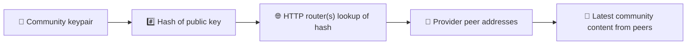
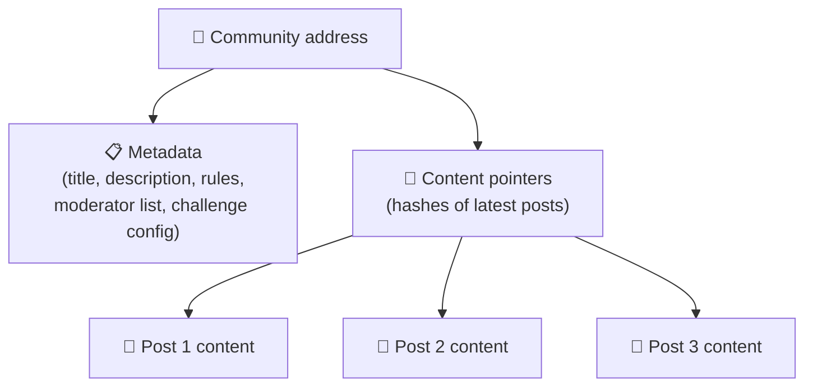
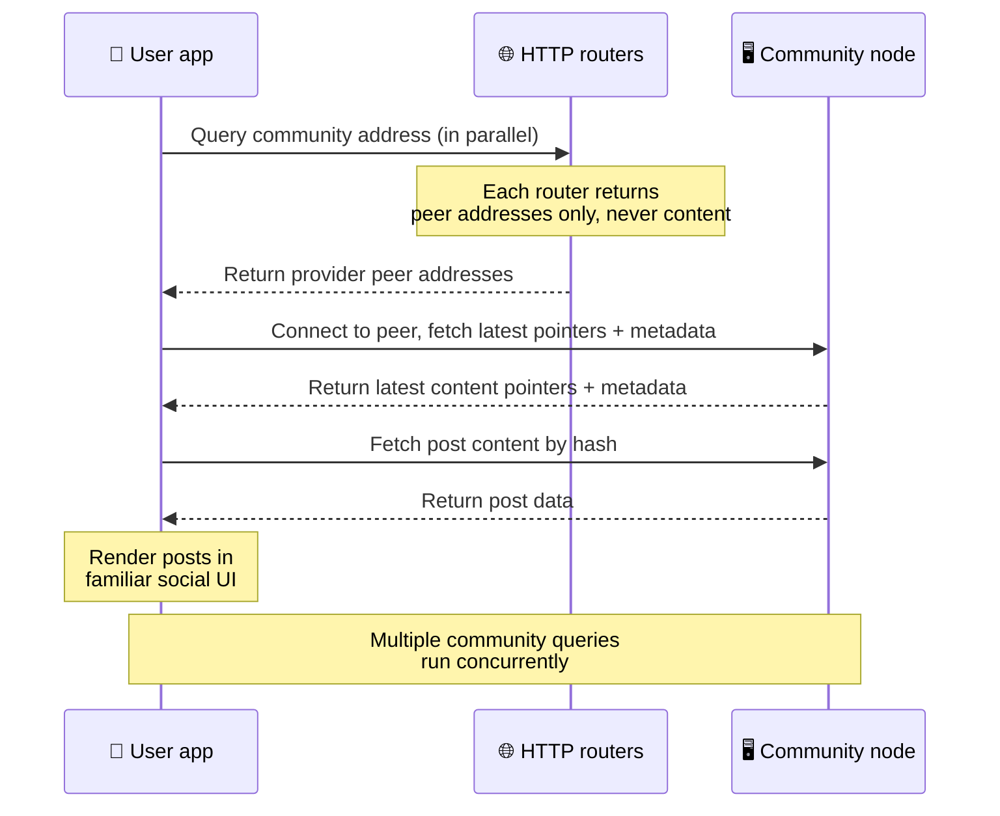
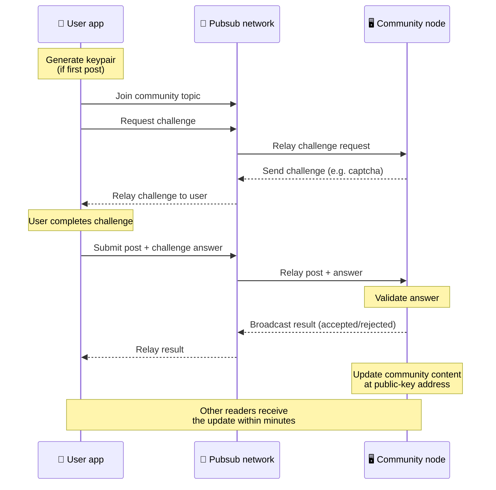
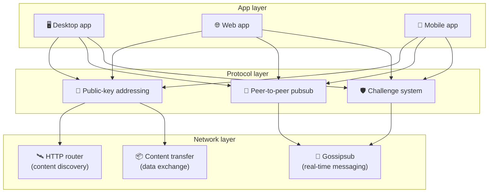

# بروتوكول نظير إلى نظير

لا يعتمد Bitsocial على سلسلة كتل ولا على خادم اتحادي ولا على واجهة خلفية مركزية. فهو يستخدم بدلًا من ذلك حزمة IPFS/libp2p للجمع بين فكرتين: **العنونة القائمة على المفتاح العام** و**pubsub نظير إلى نظير**. ومعًا تتيحان لأي شخص استضافة مجتمع من عتاد استهلاكي عادي، بينما يقرأ المستخدمون وينشرون دون حسابات على أي خدمة تملكها شركة.

للاطلاع على شرح أقل تقنية، اقرأ [شرح كامل ومبسّط لبروتوكول Bitsocial](./layman-protocol-explanation.md).

## هل يستخدم Bitsocial تقنية IPFS؟

نعم. تستخدم عُقد Bitsocial أساسيات IPFS/libp2p في طبقة نظير إلى نظير: سجلات المجتمعات المعنونة بالمفتاح العام، ونقل المحتوى بين الأقران، وpubsub عبر gossipsub للرسائل الفورية. وحين تقول هذه الوثائق "pubsub" فهي تعني pubsub الخاص بـ IPFS/libp2p، لا وسيط رسائل مركزيًا منفصلًا.

يصف البروتوكول حاليًا الاكتشاف عبر موجّهات HTTP لأن عملاء Bitsocial يستعلمون من نقاط نهاية الموجّهات عن عناوين الأقران المزوِّدين، بدلًا من الاعتماد على DHT غير الملائم للمتصفح في كل عملية بحث. لا تعيد الموجّهات سوى الأقران؛ أما نقل المحتوى وحركة pubsub فتظل تمر عبر شبكة نظير إلى نظير.

## المشكلتان

على أي شبكة اجتماعية لامركزية أن تجيب عن سؤالين:

1. **البيانات** — كيف تخزّن المحتوى الاجتماعي في العالم وتقدّمه دون قاعدة بيانات مركزية؟
2. **الرسائل العشوائية** — كيف تمنع إساءة الاستخدام مع إبقاء استخدام الشبكة مجانيًا؟

يحل Bitsocial مشكلة البيانات بتجاوز سلسلة الكتل تمامًا: فوسائل التواصل الاجتماعي لا تحتاج إلى ترتيب عالمي للمعاملات ولا إلى إتاحة دائمة لكل منشور قديم. ويحل مشكلة الرسائل العشوائية بترك كل مجتمع يشغّل تحدي مكافحة الرسائل العشوائية الخاص به عبر شبكة نظير إلى نظير.

للاطلاع على نموذج الاكتشاف الذي يقع فوق طبقة الشبكة هذه، راجع [اكتشاف المحتوى](./content-discovery.md).

---

## العنونة القائمة على المفتاح العام {#public-key-based-addressing}

في BitTorrent تصبح تجزئة الملف هي عنوانه (_العنونة القائمة على المحتوى_). ويستخدم Bitsocial فكرة مشابهة مع المفاتيح العامة: تصبح تجزئة المفتاح العام للمجتمع عنوانه على الشبكة.

يستطيع أي نظير على الشبكة أن يستعلم عن هذا العنوان من **موجّه HTTP**: يرد الموجّه بقائمة عناوين الأقران الذين يزوّدون حاليًا تجزئة المجتمع، فيتصل العميل بهؤلاء الأقران مباشرة ليجلب أحدث حالة للمجتمع. وفي كل مرة يُحدَّث فيها المحتوى يزداد رقم إصداره. لا تحتفظ الشبكة إلا بأحدث إصدار — فلا حاجة إلى حفظ كل حالة تاريخية، وهذا ما يجعل هذا النهج خفيفًا مقارنةً بسلسلة الكتل.

> **ما الذي يحتفظ به موجّه HTTP فعليًا.** موجّه HTTP ما هو إلا فهرس رفيع. فلكل عنوان محتوى يعرفه، لا يخزّن سوى عناوين الأقران الذين أعلنوا أنفسهم مزوّدين له (أزواج IP ومنفذ، وعناوين libp2p متعددة، وما شابه). وهو **لا** يخزّن محتوى المجتمع ولا بياناته الوصفية ولا نصوص المنشورات ولا قائمة الأعضاء، ولا حتى التسمية المقروءة بشريًا لما يوجد عند ذلك العنوان؛ فهو يجيب فقط عن سؤال "أي الأقران يدّعون امتلاك هذه التجزئة؟". وهذا يجعل تشغيل الموجّهات رخيصًا واستبدالها سهلًا، ولا يحمّلها مسؤولية ما ينشره المستخدمون، على نحو يشبه متعقّب BitTorrent لكن دون بيانات التورنت الوصفية: فالمتعقّب يربط بصمات infohash بالأقران، بينما موجّه HTTP لا يربط سوى عنوان محتوى بعناوين الأقران المزوّدين.
>
> ولأجل التكرار الاحتياطي، يستعلم العميل من **عدة موجّهات HTTP بالتوازي** ويدمج قوائم المزوّدين التي تعود إليه. ويستطيع أي شخص تشغيل موجّه، واستبدال الموجّهات أو إضافتها مجرد تغيير في الإعدادات دون أي ترحيل للبيانات.
>
> يستخدم Bitsocial موجّهات HTTP بدلًا من DHT لأن تشغيل DHT بالحجم اللازم لاكتشاف المحتوى مكلف، خصوصًا على الأجهزة المحمولة. كما أن DHT لا يعمل داخل المتصفح، إذ لا تستطيع المتصفحات الانضمام إلى DHT الخاص بـ libp2p مباشرة. أما موجّه HTTP فيعمل بتكلفة زهيدة على بنية HTTP تحتية شائعة، وبالكفاءة نفسها من هاتف أو من متصفح.

### ما الذي يُخزَّن عند العنوان

لا يحتوي عنوان المجتمع على محتوى المنشورات كاملًا بشكل مباشر، بل يخزّن قائمة بمعرّفات المحتوى — وهي تجزئات تشير إلى البيانات الفعلية. ثم يجلب العميل كل قطعة محتوى مباشرة من الأقران الذين أعادتهم موجّهات HTTP. أما الموجّهات نفسها فلا ترى المحتوى ولا تخزّنه أبدًا.

هناك دائمًا نظير واحد على الأقل يملك البيانات: عقدة مشغّل المجتمع. وإذا كان المجتمع شائعًا فسيملكها أقران كثيرون غيره وسيتوزّع الحِمل من تلقاء نفسه، تمامًا كما يكون تنزيل ملفات التورنت الشائعة أسرع.

---

## pubsub نظير إلى نظير

pubsub (النشر والاشتراك) نمط مراسلة يشترك فيه الأقران في موضوع فيتلقّون كل رسالة تُنشر في ذلك الموضوع. ويستخدم Bitsocial شبكة pubsub نظير إلى نظير — يستطيع أي شخص النشر، ويستطيع أي شخص الاشتراك، ولا وجود لوسيط رسائل مركزي.

ولنشر منشور في مجتمع ما، ينشر المستخدم رسالة موضوعها هو المفتاح العام لذلك المجتمع. فتلتقطها عقدة مشغّل المجتمع وتتحقق منها، وإذا اجتازت تحدي مكافحة الرسائل العشوائية أدرجتها في تحديث المحتوى التالي.

---

## مكافحة الرسائل العشوائية: تحدّيات عبر pubsub

شبكة pubsub المفتوحة معرّضة لفيضانات الرسائل العشوائية. ويعالج Bitsocial ذلك باشتراط أن يجتاز الناشرون **تحدّيًا** قبل قبول محتواهم.

نظام التحدّيات مرن: فكل مشغّل مجتمع يضبط سياسته الخاصة. ومن الخيارات المتاحة:

| نوع التحدي       | آلية العمل                                   |
| ---------------- | -------------------------------------------- |
| **كابتشا**       | لغز بصري أو تفاعلي يُعرض داخل التطبيق        |
| **تحديد المعدل** | تقييد عدد المنشورات لكل هوية ضمن نافذة زمنية |
| **بوابة توكن**   | اشتراط إثبات امتلاك رصيد من توكن معيّن       |
| **الدفع**        | اشتراط دفعة صغيرة مقابل كل منشور             |
| **قائمة السماح** | لا ينشر إلا من كانت هويته معتمدة مسبقًا      |
| **شيفرة مخصّصة** | أي سياسة يمكن التعبير عنها بالشيفرة          |

والأقران الذين يمرّرون عددًا كبيرًا من محاولات التحدي الفاشلة يُحظرون من موضوع pubsub، وهو ما يمنع هجمات حجب الخدمة على طبقة الشبكة.

---

## دورة الحياة: قراءة مجتمع

هذا ما يحدث حين يفتح المستخدم التطبيق ويستعرض أحدث منشورات مجتمع ما.

**خطوة بخطوة:**

1. يفتح المستخدم التطبيق فيرى واجهة اجتماعية.
2. يستعلم العميل من عدة موجّهات HTTP بالتوازي عن كل مجتمع يتابعه المستخدم؛ ولا يعيد أي موجّه سوى عناوين الأقران، ولا يعيد المحتوى أبدًا. ويتوقف زمن استجابة الاستعلام على ظروف الشبكة وحمل الموجّه؛ وفي الظروف المعتادة منخفضة الكمون تعود الاستعلامات غالبًا خلال ثانية واحدة تقريبًا وتُنفَّذ بالتوازي.
3. وبمجرد حصول العميل على عناوين الأقران، يتصل بهم ويجلب أحدث مؤشرات المحتوى والبيانات الوصفية للمجتمع (العنوان والوصف وقائمة المشرفين وإعدادات التحدي).
4. يجلب العميل محتوى المنشورات الفعلي باستخدام تلك المؤشرات، ثم يعرض كل شيء في واجهة اجتماعية مألوفة.

---

## دورة الحياة: نشر منشور

يتضمن النشر مصافحة تحدٍّ واستجابة عبر pubsub قبل قبول المنشور.

**خطوة بخطوة:**

1. ينشئ التطبيق زوج مفاتيح للمستخدم إن لم يكن يملك واحدًا بعد.
2. يكتب المستخدم منشورًا لمجتمع ما.
3. ينضم العميل إلى موضوع pubsub الخاص بذلك المجتمع (المرتبط بالمفتاح العام للمجتمع).
4. يطلب العميل تحدّيًا عبر pubsub.
5. ترد عقدة مشغّل المجتمع بتحدٍّ (كابتشا مثلًا).
6. يجتاز المستخدم التحدي.
7. يرسل العميل المنشور مع إجابة التحدي عبر pubsub.
8. تتحقق عقدة مشغّل المجتمع من الإجابة. وإذا كانت صحيحة قُبل المنشور.
9. تبثّ العقدة النتيجة عبر pubsub كي يعرف أقران الشبكة أن عليهم مواصلة تمرير رسائل هذا المستخدم.
10. تحدّث العقدة محتوى المجتمع عند عنوان مفتاحه العام.
11. وخلال دقائق قليلة يتلقى كل قارئ للمجتمع هذا التحديث.

---

## نظرة عامة على البنية

يتألف النظام الكامل من ثلاث طبقات تعمل معًا:

| الطبقة         | الدور                                                                                                            |
| -------------- | ---------------------------------------------------------------------------------------------------------------- |
| **التطبيق**    | واجهة المستخدم. يمكن أن توجد تطبيقات متعددة، لكل منها تصميمه الخاص، وكلها تتشارك المجتمعات والهويات نفسها.       |
| **البروتوكول** | يحدد كيفية عنونة المجتمعات، وكيفية نشر المنشورات، وكيفية منع الرسائل العشوائية.                                  |
| **الشبكة**     | البنية التحتية لنظير إلى نظير: موجّهات HTTP للاكتشاف، وgossipsub للمراسلة الفورية، ونقل المحتوى لتبادل البيانات. |

---

## الخصوصية: فك ارتباط المؤلفين بعناوين IP

حين ينشر المستخدم منشورًا، يُشفَّر المحتوى **بالمفتاح العام لمشغّل المجتمع** قبل دخوله إلى شبكة pubsub. وهذا يعني أن مراقبي الشبكة يستطيعون أن يروا أن نظيرًا ما نشر _شيئًا ما_، لكنهم لا يستطيعون تحديد:

- ما الذي يقوله المحتوى
- أي هوية مؤلف نشرته

ويشبه هذا ما يفعله BitTorrent حين يتيح اكتشاف عناوين IP التي تبذر ملف تورنت دون كشف من أنشأه أصلًا. وتضيف طبقة التشفير ضمانة خصوصية إضافية فوق ذلك الأساس.

---

## نظير إلى نظير في المتصفح

أصبح P2P في المتصفح ممكنًا الآن في عملاء Bitsocial. يستطيع تطبيق المتصفح تشغيل عقدة [Helia](https://helia.io/)، واستخدام حزمة عميل بروتوكول Bitsocial نفسها التي تستخدمها التطبيقات الأخرى، وجلب المحتوى من الأقران بدل مطالبة بوابة IPFS مركزية بتقديمه. ويستطيع المتصفح أيضًا المشاركة في pubsub مباشرة، فلا يحتاج النشر إلى مزوّد pubsub تملكه منصة في المسار الطبيعي.

وهذه هي المحطة المهمة للتوزيع عبر الويب: موقع HTTPS عادي يمكن أن يفتح مباشرة على عميل اجتماعي P2P حي. فلا يحتاج المستخدمون إلى تثبيت تطبيق سطح مكتب قبل أن يقرأوا من الشبكة، ولا يحتاج مشغّل التطبيق إلى تشغيل بوابة مركزية تصبح نقطة الاختناق الرقابية أو الإشرافية لكل مستخدمي المتصفح.

ولمسار المتصفح حدود تختلف عن حدود عقدة سطح المكتب أو الخادم:

- لا تستطيع عقدة المتصفح عادةً قبول اتصالات واردة عشوائية من الإنترنت العام
- تستطيع تحميل البيانات والتحقق منها وتخزينها مؤقتًا ونشرها ما دام التطبيق مفتوحًا
- لا ينبغي التعامل معها كمستضيف طويل الأمد لبيانات مجتمع ما
- تبقى الاستضافة الكاملة للمجتمع أفضل ما يتولاه تطبيق سطح مكتب أو `bitsocial-cli` أو أي عقدة أخرى دائمة التشغيل

ولا تزال موجّهات HTTP مهمة لاكتشاف المحتوى: فهي تعيد عناوين المزوّدين لتجزئة مجتمع ما. وهي ليست بوابات IPFS، لأنها لا تقدّم المحتوى نفسه. وبعد الاكتشاف يتصل عميل المتصفح بالأقران ويجلب البيانات عبر حزمة P2P.

وقد صار P2P في المتصفح هو مسار الويب الافتراضي، لا تجربة خلف مفتاح تفعيل. فـ 5chan يعمل افتراضيًا بـ P2P متصفح خالص على 5chan.app، ومدونة Bitsocial على bitsocial.net تفعل الشيء نفسه. ويتصل أقران المتصفح عبر WebSockets آمنة؛ ويرفض `pkc-js` افتراضيًا الاتصال عبر WebRTC وWebTransport لأن مسارات تأسيس الاتصال فيهما بطيئة وغير موثوقة داخل المتصفح. أما التغيير الخارجي الذي جعل النشر من المتصفح عمليًا في 2026 فكان إصلاح رقم تسلسل gossipsub في `@libp2p/gossipsub` 15.0.21، الذي أوقف تجاهل عُقد Kubo للرسائل المنشورة من عُقد JavaScript.

وللصورة الكاملة، بما في ذلك ما لا تستطيع عقدة المتصفح فعله بعد، راجع [نظير إلى نظير في المتصفح](/browser-p2p/).

## الاحتياط عبر البوابات {#gateway-fallback}

لا يزال الوصول من المتصفح عبر بوابة مفيدًا كمسار احتياطي للتوافق وللطرح التدريجي. فالبوابة يمكنها تمرير البيانات بين شبكة نظير إلى نظير وعميل المتصفح حين يتعذّر على المتصفح الانضمام إلى الشبكة مباشرة، أو حين يختار التطبيق المسار الأقدم عن قصد. وهذه البوابات:

- يستطيع أي شخص تشغيلها
- لا تتطلب حسابات مستخدمين ولا مدفوعات
- لا تكتسب وصاية على هويات المستخدمين أو مجتمعاتهم
- يمكن استبدالها دون فقدان البيانات

البنية المستهدفة هي P2P في المتصفح أولًا، مع بوابات كخيار احتياطي لا كعنق زجاجة افتراضي.

---

## لماذا لا سلسلة كتل؟

تحل سلاسل الكتل مشكلة الإنفاق المزدوج: فهي تحتاج إلى معرفة الترتيب الدقيق لكل معاملة كي تمنع أحدهم من إنفاق العملة نفسها مرتين.

ووسائل التواصل الاجتماعي ليست فيها مشكلة إنفاق مزدوج. فلا يهم إن نُشر المنشور «أ» قبل المنشور «ب» بجزء من الألف من الثانية، ولا حاجة إلى إتاحة المنشورات القديمة بشكل دائم على كل عقدة.

وبتجاوز سلسلة الكتل يتفادى Bitsocial:

- **رسوم الغاز** — النشر مجاني
- **حدود الإنتاجية** — لا عنق زجاجة في حجم الكتلة أو زمنها
- **تضخّم التخزين** — لا تحتفظ العُقد إلا بما تحتاجه
- **كلفة الإجماع** — لا حاجة إلى معدّنين أو مدققين أو رهن

والمقابل هو أن Bitsocial لا يضمن إتاحة دائمة للمحتوى القديم. لكن هذه مقايضة مقبولة في وسائل التواصل الاجتماعي: فعقدة مشغّل المجتمع تحتفظ بالبيانات، والمحتوى الشائع ينتشر عبر أقران كثيرين، والمنشورات القديمة جدًا تتلاشى طبيعيًا — تمامًا كما يحدث في كل منصة اجتماعية.

## لماذا لا الاتحاد؟

الشبكات الاتحادية (مثل البريد الإلكتروني أو المنصات القائمة على ActivityPub) تتقدم خطوة على المركزية لكنها تظل محكومة بقيود بنيوية:

- **الاعتماد على الخادم** — يحتاج كل مجتمع إلى خادم بنطاق وشهادة TLS وصيانة مستمرة
- **الثقة بالمدير** — يملك مدير الخادم سيطرة كاملة على حسابات المستخدمين والمحتوى
- **التشظّي** — الانتقال بين الخوادم يعني غالبًا خسارة المتابعين أو السجل أو الهوية
- **الكلفة** — على أحدهم أن يدفع ثمن الاستضافة، وهو ما يخلق ضغطًا نحو التمركز

ويزيل نهج نظير إلى نظير في Bitsocial الخادم من المعادلة تمامًا. فعقدة المجتمع يمكن أن تعمل على حاسوب محمول أو على Raspberry Pi أو على VPS رخيص. ويتحكم المشغّل في سياسة الإشراف لكنه لا يستطيع الاستيلاء على هويات المستخدمين، لأن الهويات محكومة بأزواج المفاتيح لا ممنوحة من خادم.

## ماذا عن Nostr؟

لا يندرج Nostr بوضوح في أي من الفئتين. فهو ليس اتحادًا على طراز ActivityPub، لأن المستخدمين لا تمنحهم الخوادم حسابات ولأن الهوية غير مرتبطة بخادم واحد. وهو ليس وسائط اجتماعية على سلسلة كتل أيضًا، إذ لا سلسلة فيه ولا إجماع ولا غاز ولا ترتيب عالمي للمعاملات.

والوصف الأدق لـ Nostr أنه **وسائط اجتماعية قائمة على المرحّلات**. ففي البروتوكول الأساسي ([NIP-01](https://github.com/nostr-protocol/nips/blob/master/01.md)) يملك المستخدمون أزواج مفاتيح، ويوقّعون الأحداث، وينشرون تلك الأحداث إلى مرحّلات WebSocket. ويشترك العملاء في المرحّلات بمرشّحات، ويجلبون الأحداث المطابقة، ويتحققون من التواقيع محليًا. ويمكن للمستخدمين أيضًا نشر بيانات وصفية لقائمة المرحّلات ([NIP-65](https://github.com/nostr-protocol/nips/blob/master/65.md)) تخبر العملاء بالمرحّلات التي يكتبون إليها عادةً وبالمرحّلات التي يفضّلونها لقراءة الإشارات إليهم.

وهذا يضع Nostr أقرب إلى Bitsocial من الأنظمة الاتحادية أو القائمة على سلسلة كتل في جانب مهم واحد: الهوية تشفيرية وقابلة للنقل. أما الفارق الرئيسي فهو طبقة البيانات. ففي Nostr تمثل المرحّلات طبقة التخزين والتسليم المعتادة. أما في Bitsocial فلا تساعد موجّهات HTTP إلا في عثور العملاء على الأقران. فالموجّهات لا تخزّن المنشورات ولا الملفات الشخصية ولا بيانات المجتمعات الوصفية ولا حالة الإشراف؛ بل تعيد عناوين الأقران المزوّدين، ثم يجلب العملاء المحتوى من الأقران.

وتُظهر المجتمعات الانقسام نفسه. فلدى Nostr أنماط اختيارية لـ [المجموعات القائمة على المرحّلات](https://github.com/nostr-protocol/nips/blob/master/29.md) و[المجتمعات المعتمدة من المشرفين](https://github.com/nostr-protocol/nips/blob/master/72.md)، لكنها تظل معتمدة على سياسة المرحّل، أو على حالة المجموعة المستضافة لدى المرحّل، أو على اختيارات العميل بشأن أي الموافقات يعتدّ بها. أما Bitsocial فيعامل المجتمعات ككائنات تشفيرية من الدرجة الأولى، تتحقق عقدة مشغّلها من المنشورات، وتشغّل سياسة التحدي الخاصة بالمجتمع، وتنشر أحدث حالة مقبولة إلى شبكة نظير إلى نظير.

| السؤال                   | Nostr                                                                                   | Bitsocial                                                        |
| ------------------------ | --------------------------------------------------------------------------------------- | ---------------------------------------------------------------- |
| الفئة                    | بروتوكول قائم على المرحّلات                                                             | شبكة مجتمعات نظير إلى نظير                                       |
| الهوية                   | المفتاح العام للمستخدم                                                                  | أزواج مفاتيح للمستخدمين وللمجتمعات                               |
| مسار البيانات            | أحداث موقّعة تُنشر إلى المرحّلات                                                        | عنوان المفتاح العام يُحلّ إلى أقران، ثم يُجلب المحتوى من الأقران |
| من يبقيه متاحًا          | مرحّلات يختارها المستخدمون والعملاء                                                     | عقدة مالك المجتمع إضافة إلى عُقد بذر مساعدة                      |
| المجتمعات                | مجموعات اختيارية قائمة على المرحّلات أو مجتمعات معتمدة من المشرفين                      | كائنات مجتمع من الدرجة الأولى بإشراف يتحكم فيه المشغّل           |
| مكافحة الرسائل العشوائية | سياسة المرحّل أو المصادقة أو الدفع أو إثبات العمل أو مرشّحات العميل أو موافقات المشرفين | منطق تحدٍّ يحدده المجتمع قبل الإدراج                             |
| المقايضة الرئيسية        | هوية قابلة للنقل، لكن الإتاحة والسياسة تعتمدان على المرحّلات                            | اعتماد أقل على المرحّلات، لكن المحتوى القديم غير مضمون إلى الأبد |

---

## الخلاصة

يقوم Bitsocial على أساسين اثنين: العنونة القائمة على المفتاح العام لاكتشاف المحتوى، وpubsub نظير إلى نظير للتواصل الفوري. ومعًا ينتجان شبكة اجتماعية حيث:

- تُعرَّف المجتمعات بمفاتيح تشفيرية لا بأسماء نطاقات
- ينتشر المحتوى عبر الأقران كما ينتشر ملف تورنت، لا يُقدَّم من قاعدة بيانات واحدة
- مقاومة الرسائل العشوائية محلية لكل مجتمع، لا مفروضة من منصة
- يملك المستخدمون هوياتهم عبر أزواج المفاتيح، لا عبر حسابات قابلة للإلغاء
- يعمل النظام كله دون خوادم ولا سلاسل كتل ولا رسوم منصة
