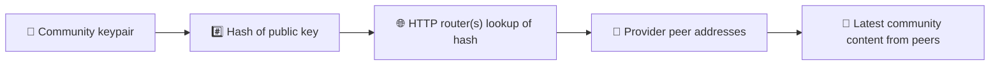
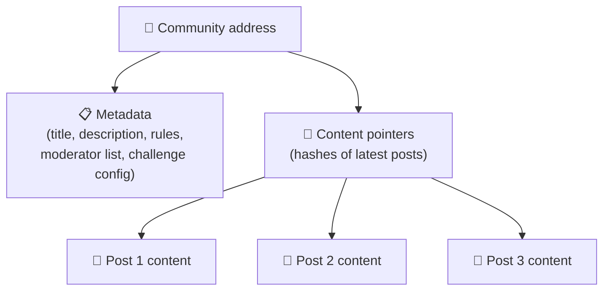
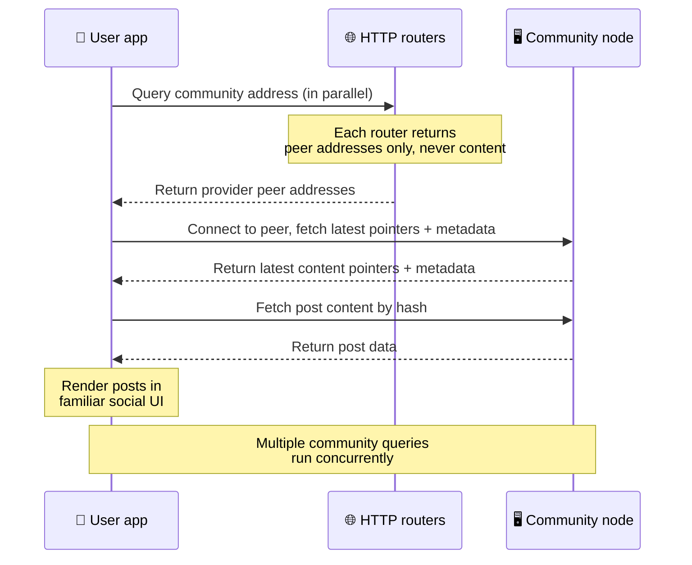
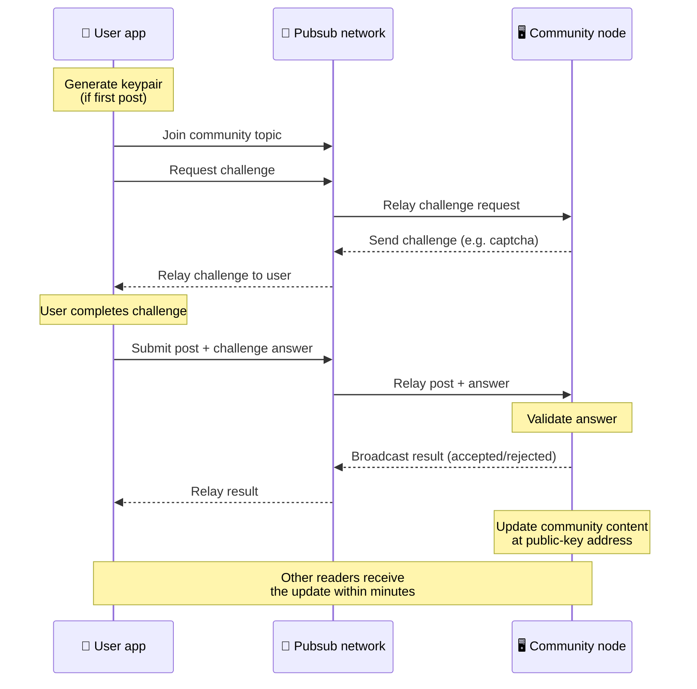
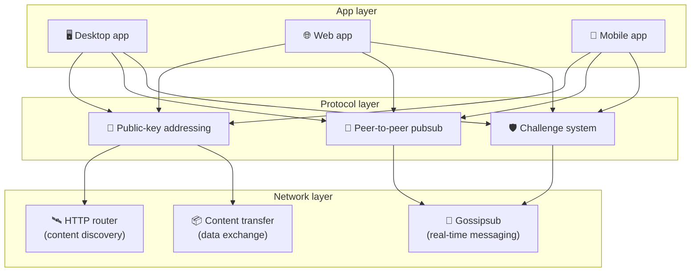

# পিয়ার-টু-পিয়ার প্রোটোকল

Bitsocial কোনো ব্লকচেইন, ফেডারেশন সার্ভার বা কেন্দ্রীভূত ব্যাকএন্ড ব্যবহার করে না। এর বদলে এটি
IPFS/libp2p স্ট্যাক দিয়ে দুটি ধারণাকে এক জায়গায় আনে: **পাবলিক-কী-ভিত্তিক অ্যাড্রেসিং** এবং
**পিয়ার-টু-পিয়ার pubsub**। এই দুটি মিলে যে কাউকে সাধারণ ঘরোয়া হার্ডওয়্যার থেকে একটি কমিউনিটি
চালানোর সুযোগ দেয়, আর ব্যবহারকারীরা কোনো কোম্পানি-নিয়ন্ত্রিত সার্ভিসে অ্যাকাউন্ট না খুলেই পড়তে ও
পোস্ট করতে পারেন।

কম কারিগরি ভাষায় পুরো ব্যাপারটি বুঝতে পড়ুন
[Bitsocial প্রোটোকলের সম্পূর্ণ সাধারণ ব্যাখ্যা](./layman-protocol-explanation.md)।

## Bitsocial কি IPFS ব্যবহার করে?

হ্যাঁ। পিয়ার-টু-পিয়ার স্তরের জন্য Bitsocial নোডগুলি IPFS/libp2p প্রিমিটিভ ব্যবহার করে: পাবলিক কী
দিয়ে অ্যাড্রেস করা কমিউনিটি রেকর্ড, পিয়ারদের মধ্যে কনটেন্ট আদান-প্রদান, এবং রিয়েল-টাইম বার্তার
জন্য gossipsub pubsub। এই ডকুমেন্টেশনে যেখানে "pubsub" বলা হয়েছে, সেখানে IPFS/libp2p-এর pubsub
বোঝানো হয়েছে — আলাদা কোনো কেন্দ্রীভূত মেসেজ ব্রোকার নয়।

প্রোটোকল এখন HTTP রাউটারের মাধ্যমে ডিসকভারির কথা বলে, কারণ Bitsocial ক্লায়েন্ট প্রতিটি লুকআপের
জন্য ব্রাউজারের পক্ষে অসুবিধাজনক DHT-র উপর নির্ভর না করে রাউটার এন্ডপয়েন্টের কাছে প্রোভাইডার
পিয়ারের ঠিকানা চায়। রাউটার কেবল পিয়ারই ফেরত দেয়; কনটেন্ট আদান-প্রদান আর pubsub ট্রাফিক আগের
মতোই পিয়ার-টু-পিয়ার নেটওয়ার্কের ভিতর দিয়ে চলে।

## দুটি সমস্যা

একটি বিকেন্দ্রীভূত সোশ্যাল নেটওয়ার্ককে দুটি প্রশ্নের উত্তর দিতে হয়:

1. **ডেটা** — কেন্দ্রীয় ডেটাবেস ছাড়া পৃথিবীর সব সোশ্যাল কনটেন্ট কীভাবে জমা রাখা আর পরিবেশন করা যায়?
2. **স্প্যাম** — নেটওয়ার্ক ব্যবহার বিনামূল্যে রেখেও অপব্যবহার কীভাবে ঠেকানো যায়?

Bitsocial ব্লকচেইনকে পুরোপুরি বাদ দিয়ে ডেটার সমস্যা সমাধান করে: সোশ্যাল মিডিয়ার জন্য বিশ্বব্যাপী
লেনদেনের ক্রম বা প্রতিটি পুরোনো পোস্টের স্থায়ী প্রাপ্যতা দরকার হয় না। আর স্প্যামের সমস্যা সমাধান
হয় প্রতিটি কমিউনিটিকে পিয়ার-টু-পিয়ার নেটওয়ার্কের উপরে নিজস্ব অ্যান্টি-স্প্যাম চ্যালেঞ্জ চালাতে
দিয়ে।

এই নেটওয়ার্ক স্তরের উপরে যে ডিসকভারি মডেল কাজ করে, তা জানতে দেখুন
[কনটেন্ট ডিসকভারি](./content-discovery.md)।

---

## পাবলিক-কী-ভিত্তিক অ্যাড্রেসিং {#public-key-based-addressing}

BitTorrent-এ একটি ফাইলের হ্যাশই তার ঠিকানা হয়ে যায় (_কনটেন্ট-ভিত্তিক অ্যাড্রেসিং_)। Bitsocial
পাবলিক কী দিয়ে প্রায় একই কাজ করে: একটি কমিউনিটির পাবলিক কী-র হ্যাশই তার নেটওয়ার্ক ঠিকানা।

নেটওয়ার্কের যেকোনো পিয়ার সেই ঠিকানার জন্য একটি **HTTP রাউটার**-কে জিজ্ঞাসা করতে পারে: রাউটার
তখন এমন পিয়ারদের নেটওয়ার্ক ঠিকানার তালিকা ফেরত দেয় যারা এই মুহূর্তে কমিউনিটির হ্যাশটি সরবরাহ
করছে, আর ক্লায়েন্ট সরাসরি সেই পিয়ারদের সঙ্গে যুক্ত হয়ে কমিউনিটির সর্বশেষ অবস্থা নিয়ে আসে।
কনটেন্ট প্রতিবার হালনাগাদ হলে তার ভার্সন নম্বর বাড়ে। নেটওয়ার্ক কেবল সর্বশেষ ভার্সনটিই রাখে —
প্রতিটি পুরোনো অবস্থা ধরে রাখার দরকার হয় না, আর এটাই এই পদ্ধতিকে ব্লকচেইনের তুলনায় হালকা করে
তোলে।

> **একটি HTTP রাউটার আসলে কী রাখে।** HTTP রাউটার একটি পাতলা ইনডেক্স মাত্র। তার জানা প্রতিটি
> কনটেন্ট ঠিকানার বিপরীতে সে কেবল সেইসব পিয়ারের নেটওয়ার্ক ঠিকানা জমা রাখে যারা নিজেদের
> প্রোভাইডার হিসেবে ঘোষণা করেছে (IP/পোর্ট জোড়া, libp2p multiaddr, এই ধরনের জিনিস)। কমিউনিটির
> কনটেন্ট, তার মেটাডেটা, পোস্টের লেখা, সদস্যতালিকা, এমনকি ওই ঠিকানায় কী আছে তার মানুষ-পাঠযোগ্য
> নামটুকুও সে **রাখে না**; সে শুধু "এই হ্যাশটি কাদের কাছে আছে বলে দাবি করা হচ্ছে?" — এইটুকুরই
> উত্তর দেয়। ফলে রাউটার চালানো সস্তা, বদলে ফেলা সহজ, আর ব্যবহারকারীরা যা প্রকাশ করেন তার দায়
> রাউটারের উপর বর্তায় না। ব্যাপারটি BitTorrent ট্র্যাকারের মতো, তবে টরেন্ট মেটাডেটা ছাড়া:
> ট্র্যাকার infohash-কে পিয়ারের সঙ্গে মেলায়, আর HTTP রাউটার কেবল একটি কনটেন্ট ঠিকানাকে
> প্রোভাইডার পিয়ারের ঠিকানার সঙ্গে মেলায়।
>
> বাড়তি নির্ভরযোগ্যতার জন্য ক্লায়েন্ট **একসঙ্গে একাধিক HTTP রাউটারে** জিজ্ঞাসা পাঠায় এবং ফেরত
> পাওয়া প্রোভাইডার তালিকাগুলি মিলিয়ে নেয়। যে কেউ রাউটার চালাতে পারেন, আর রাউটার বদলানো বা নতুন
> রাউটার যোগ করা কেবল কনফিগ পরিবর্তন — কোনো ডেটা মাইগ্রেশন লাগে না।
>
> Bitsocial DHT-র বদলে HTTP রাউটার ব্যবহার করে, কারণ কনটেন্ট ডিসকভারির জন্য যে মাপে DHT চালাতে
> হয় তা ব্যয়বহুল, বিশেষত মোবাইলে। DHT ব্রাউজারেও চলে না, কারণ ব্রাউজার সরাসরি libp2p DHT-তে
> যুক্ত হতে পারে না। অন্যদিকে HTTP রাউটার সাধারণ HTTP পরিকাঠামোতেই কম খরচে চলে এবং ফোন বা
> ব্রাউজার — দুই জায়গা থেকেই সমান ভালো কাজ করে।

### ঠিকানায় কী জমা থাকে

কমিউনিটির ঠিকানায় সরাসরি পোস্টের পুরো কনটেন্ট থাকে না। তার বদলে সেখানে থাকে কনটেন্ট
আইডেন্টিফায়ারের একটি তালিকা — অর্থাৎ হ্যাশ, যেগুলি আসল ডেটার দিকে নির্দেশ করে। এরপর ক্লায়েন্ট
HTTP রাউটারের ফেরত দেওয়া পিয়ারদের কাছ থেকে সরাসরি প্রতিটি কনটেন্ট নিয়ে আসে। রাউটার নিজে কখনও
সেই কনটেন্ট দেখে না বা জমা রাখে না।

অন্তত একটি পিয়ারের কাছে ডেটা সব সময়ই থাকে: কমিউনিটি অপারেটরের নোড। কমিউনিটি জনপ্রিয় হলে আরও
অনেক পিয়ারের কাছেও তা থাকে এবং লোড নিজে থেকেই ভাগ হয়ে যায় — ঠিক যেভাবে জনপ্রিয় টরেন্ট দ্রুত
ডাউনলোড হয়।

---

## পিয়ার-টু-পিয়ার pubsub

Pubsub (publish-subscribe) হলো এমন একটি মেসেজিং প্যাটার্ন যেখানে পিয়াররা কোনো টপিকে সাবস্ক্রাইব
করে এবং সেই টপিকে প্রকাশিত প্রতিটি বার্তা পায়। Bitsocial একটি পিয়ার-টু-পিয়ার pubsub নেটওয়ার্ক
ব্যবহার করে — যে কেউ প্রকাশ করতে পারে, যে কেউ সাবস্ক্রাইব করতে পারে, আর কোনো কেন্দ্রীয় মেসেজ
ব্রোকার নেই।

কোনো কমিউনিটিতে পোস্ট প্রকাশ করতে ব্যবহারকারী এমন একটি বার্তা প্রকাশ করেন যার টপিক হলো সেই
কমিউনিটির পাবলিক কী। কমিউনিটি অপারেটরের নোড বার্তাটি তুলে নেয়, যাচাই করে, এবং অ্যান্টি-স্প্যাম
চ্যালেঞ্জে উতরে গেলে পরবর্তী কনটেন্ট হালনাগাদে সেটি যুক্ত করে।

---

## অ্যান্টি-স্প্যাম: pubsub-এর উপর চ্যালেঞ্জ

খোলা pubsub নেটওয়ার্ক স্প্যামের বন্যার সামনে দুর্বল। Bitsocial এর সমাধান করে এভাবে: কনটেন্ট
গ্রহণ করার আগে প্রকাশককে একটি **চ্যালেঞ্জ** সম্পন্ন করতে হয়।

চ্যালেঞ্জ ব্যবস্থাটি নমনীয়: প্রতিটি কমিউনিটি অপারেটর নিজের নীতি নিজে ঠিক করেন। কয়েকটি বিকল্প:

| চ্যালেঞ্জের ধরন  | কীভাবে কাজ করে                                           |
| ---------------- | -------------------------------------------------------- |
| **ক্যাপচা**      | অ্যাপে দেখানো ছবি-ভিত্তিক বা ইন্টারঅ্যাক্টিভ ধাঁধা       |
| **রেট লিমিটিং**  | প্রতি পরিচয়ের জন্য নির্দিষ্ট সময়সীমায় পোস্ট সীমিত করা |
| **টোকেন গেট**    | নির্দিষ্ট একটি টোকেনের ব্যালেন্সের প্রমাণ চাওয়া         |
| **পেমেন্ট**      | প্রতি পোস্টে ছোট একটি অর্থপ্রদান চাওয়া                  |
| **অ্যালাউলিস্ট** | কেবল আগে থেকে অনুমোদিত পরিচয়গুলিই পোস্ট করতে পারে       |
| **কাস্টম কোড**   | কোডে প্রকাশ করা যায় এমন যেকোনো নীতি                     |

যেসব পিয়ার অতিরিক্ত সংখ্যক ব্যর্থ চ্যালেঞ্জ চেষ্টা রিলে করে, তাদের pubsub টপিক থেকে ব্লক করা হয়;
এতে নেটওয়ার্ক স্তরে ডিনায়াল-অফ-সার্ভিস আক্রমণ ঠেকানো যায়।

---

## লাইফসাইকেল: একটি কমিউনিটি পড়া

ব্যবহারকারী অ্যাপ খুলে কোনো কমিউনিটির সাম্প্রতিক পোস্ট দেখলে যা ঘটে, তা এখানে বর্ণনা করা হলো।

**ধাপে ধাপে:**

1. ব্যবহারকারী অ্যাপ খোলেন এবং একটি সোশ্যাল ইন্টারফেস দেখতে পান।
2. ব্যবহারকারী যে কমিউনিটিগুলি অনুসরণ করেন, তার প্রতিটির জন্য ক্লায়েন্ট একসঙ্গে একাধিক HTTP
   রাউটারে জিজ্ঞাসা পাঠায়; প্রতিটি রাউটার কেবল পিয়ারের ঠিকানা ফেরত দেয়, কনটেন্ট কখনও নয়।
   জিজ্ঞাসার লেটেন্সি নির্ভর করে নেটওয়ার্কের অবস্থা আর রাউটারের চাপের উপর; স্বাভাবিক কম-লেটেন্সি
   অবস্থায় জিজ্ঞাসাগুলি সাধারণত এক সেকেন্ডের মধ্যেই উত্তর দেয় এবং একসঙ্গে চলে।
3. পিয়ারের ঠিকানা পাওয়ার পর ক্লায়েন্ট সেই পিয়ারদের সঙ্গে যুক্ত হয় এবং কমিউনিটির সর্বশেষ কনটেন্ট
   পয়েন্টার ও মেটাডেটা (শিরোনাম, বিবরণ, মডারেটরের তালিকা, চ্যালেঞ্জ কনফিগারেশন) নিয়ে আসে।
4. সেই পয়েন্টার ব্যবহার করে ক্লায়েন্ট আসল পোস্টের কনটেন্ট নিয়ে আসে, তারপর সবকিছু পরিচিত সোশ্যাল
   ইন্টারফেসে দেখায়।

---

## লাইফসাইকেল: একটি পোস্ট প্রকাশ করা

পোস্টটি গৃহীত হওয়ার আগে pubsub-এর উপর একটি চ্যালেঞ্জ-রেসপন্স হ্যান্ডশেক ঘটে।

**ধাপে ধাপে:**

1. ব্যবহারকারীর কীপেয়ার না থাকলে অ্যাপ তাঁর জন্য একটি কীপেয়ার তৈরি করে।
2. ব্যবহারকারী কোনো কমিউনিটির জন্য একটি পোস্ট লেখেন।
3. ক্লায়েন্ট সেই কমিউনিটির pubsub টপিকে যুক্ত হয় (টপিকটি কমিউনিটির পাবলিক কী দিয়ে নির্ধারিত)।
4. ক্লায়েন্ট pubsub-এর মাধ্যমে একটি চ্যালেঞ্জ চায়।
5. কমিউনিটি অপারেটরের নোড একটি চ্যালেঞ্জ ফেরত পাঠায় (যেমন একটি ক্যাপচা)।
6. ব্যবহারকারী চ্যালেঞ্জটি সম্পন্ন করেন।
7. ক্লায়েন্ট pubsub-এর মাধ্যমে চ্যালেঞ্জের উত্তরসহ পোস্টটি জমা দেয়।
8. কমিউনিটি অপারেটরের নোড উত্তরটি যাচাই করে। উত্তর ঠিক হলে পোস্টটি গৃহীত হয়।
9. নোডটি ফলাফল pubsub-এ ব্রডকাস্ট করে, যাতে নেটওয়ার্কের পিয়াররা জানে যে এই ব্যবহারকারীর বার্তা
   রিলে করা চালিয়ে যেতে হবে।
10. নোডটি কমিউনিটির পাবলিক-কী ঠিকানায় কনটেন্ট হালনাগাদ করে।
11. কয়েক মিনিটের মধ্যেই কমিউনিটির প্রতিটি পাঠক হালনাগাদটি পেয়ে যান।

---

## আর্কিটেকচারের সংক্ষিপ্ত চিত্র

পুরো ব্যবস্থাটিতে তিনটি স্তর একসঙ্গে কাজ করে:

| স্তর           | ভূমিকা                                                                                                                                                     |
| -------------- | ---------------------------------------------------------------------------------------------------------------------------------------------------------- |
| **অ্যাপ**      | ব্যবহারকারীর ইন্টারফেস। একাধিক অ্যাপ থাকতে পারে, প্রতিটির নিজস্ব নকশা, অথচ সবাই একই কমিউনিটি ও পরিচয় ভাগ করে নেয়।                                        |
| **প্রোটোকল**   | কমিউনিটির ঠিকানা কীভাবে হয়, পোস্ট কীভাবে প্রকাশিত হয়, আর স্প্যাম কীভাবে ঠেকানো হয় তা নির্ধারণ করে।                                                      |
| **নেটওয়ার্ক** | অন্তর্নিহিত পিয়ার-টু-পিয়ার পরিকাঠামো: ডিসকভারির জন্য HTTP রাউটার, রিয়েল-টাইম মেসেজিংয়ের জন্য gossipsub, আর ডেটা আদান-প্রদানের জন্য কনটেন্ট ট্রান্সফার। |

---

## গোপনীয়তা: লেখকের পরিচয় ও IP ঠিকানার যোগসূত্র ছিঁড়ে দেওয়া

ব্যবহারকারী কোনো পোস্ট প্রকাশ করলে সেটি pubsub নেটওয়ার্কে ঢোকার আগেই **কমিউনিটি অপারেটরের পাবলিক
কী দিয়ে এনক্রিপ্ট** করা হয়। ফলে নেটওয়ার্কে নজর রাখা কেউ দেখতে পায় যে একটি পিয়ার _কিছু একটা_
প্রকাশ করেছে, কিন্তু জানতে পারে না:

- কনটেন্টে কী লেখা আছে
- কোন লেখক-পরিচয় থেকে সেটি প্রকাশিত হয়েছে

ব্যাপারটি অনেকটা BitTorrent-এর মতো: কোন IP একটি টরেন্ট সিড করছে তা জানা যায়, কিন্তু টরেন্টটি
মূলত কে তৈরি করেছিল তা জানা যায় না। এনক্রিপশন স্তরটি সেই ভিতের উপরে গোপনীয়তার আরও একটি নিশ্চয়তা
যোগ করে।

---

## ব্রাউজার পিয়ার-টু-পিয়ার

Bitsocial ক্লায়েন্টে ব্রাউজার P2P এখন সম্ভব। একটি ব্রাউজার অ্যাপ [Helia](https://helia.io/) নোড
চালাতে পারে, অন্য অ্যাপগুলির মতো একই Bitsocial প্রোটোকল ক্লায়েন্ট স্ট্যাক ব্যবহার করতে পারে, এবং
কেন্দ্রীভূত IPFS গেটওয়ের কাছে কনটেন্ট চাওয়ার বদলে সরাসরি পিয়ারদের কাছ থেকে তা নিয়ে আসতে পারে।
ব্রাউজার সরাসরি pubsub-এও অংশ নিতে পারে, তাই স্বাভাবিক পথে পোস্ট করার জন্য প্ল্যাটফর্ম-মালিকানাধীন
কোনো pubsub প্রোভাইডার লাগে না।

ওয়েব ডিস্ট্রিবিউশনের জন্য এটাই গুরুত্বপূর্ণ মাইলফলক: একটি সাধারণ HTTPS ওয়েবসাইট খুললেই তা একটি
সচল P2P সোশ্যাল ক্লায়েন্ট হয়ে উঠতে পারে। নেটওয়ার্ক থেকে পড়ার জন্য ব্যবহারকারীদের আগে ডেস্কটপ
অ্যাপ ইনস্টল করতে হয় না, আর অ্যাপ পরিচালককেও এমন কোনো কেন্দ্রীয় গেটওয়ে চালাতে হয় না যা প্রতিটি
ব্রাউজার ব্যবহারকারীর জন্য সেন্সরশিপ বা মডারেশনের নিয়ন্ত্রণবিন্দু হয়ে দাঁড়ায়।

ডেস্কটপ বা সার্ভার নোডের তুলনায় ব্রাউজার পথের সীমাবদ্ধতা আলাদা:

- ব্রাউজার নোড সাধারণত পাবলিক ইন্টারনেট থেকে যেকোনো ইনবাউন্ড সংযোগ গ্রহণ করতে পারে না
- অ্যাপ খোলা থাকা অবস্থায় এটি ডেটা লোড, যাচাই, ক্যাশ এবং প্রকাশ করতে পারে
- কোনো কমিউনিটির ডেটার দীর্ঘমেয়াদি হোস্ট হিসেবে একে ধরা উচিত নয়
- সম্পূর্ণ কমিউনিটি হোস্টিং এখনও সবচেয়ে ভালোভাবে সামলায় একটি ডেস্কটপ অ্যাপ, `bitsocial-cli`, বা
  সব সময় চালু থাকা অন্য কোনো নোড

কনটেন্ট ডিসকভারির জন্য HTTP রাউটার এখনও দরকারি: কমিউনিটির হ্যাশের বিপরীতে তারা প্রোভাইডারের ঠিকানা
ফেরত দেয়। তারা IPFS গেটওয়ে নয়, কারণ কনটেন্ট নিজে তারা পরিবেশন করে না। ডিসকভারির পর ব্রাউজার
ক্লায়েন্ট পিয়ারদের সঙ্গে যুক্ত হয় এবং P2P স্ট্যাকের মাধ্যমে ডেটা নিয়ে আসে।

ব্রাউজার P2P এখন ওয়েবের ডিফল্ট পথ, কোনো সুইচের পিছনে লুকোনো পরীক্ষা নয়। 5chan ডিফল্টভাবেই
5chan.app-এ বিশুদ্ধ ব্রাউজার P2P চালায়, আর bitsocial.net-এ Bitsocial ব্লগও একই কাজ করে। ব্রাউজার
পিয়াররা সুরক্ষিত WebSockets দিয়ে ডায়াল করে; `pkc-js` ডিফল্টভাবে WebRTC ও WebTransport ডায়াল
আটকে দেয়, কারণ ব্রাউজারে এদের সংযোগ স্থাপনের পথ ধীর ও অনির্ভরযোগ্য। 2026 সালে ব্রাউজার থেকে
প্রকাশ করাকে যে আপস্ট্রিম পরিবর্তনটি বাস্তবসম্মত করে তুলেছিল, সেটি হলো `@libp2p/gossipsub`
15.0.21-এ gossipsub সিকোয়েন্স-নম্বরের সংশোধন, যার ফলে Kubo পিয়াররা JavaScript নোডের প্রকাশ করা
বার্তা আর ফেলে দেয় না।

একটি ব্রাউজার নোড এখনও কী কী করতে পারে না, সেসহ পুরো ছবিটি দেখতে পড়ুন
[ব্রাউজার পিয়ার-টু-পিয়ার](/browser-p2p/)।

## গেটওয়ে ফলব্যাক {#gateway-fallback}

গেটওয়ে-নির্ভর ব্রাউজার অ্যাক্সেস এখনও সামঞ্জস্য ও পর্যায়ক্রমিক রোলআউটের ফলব্যাক হিসেবে কাজে
লাগে। ব্রাউজার সরাসরি নেটওয়ার্কে যুক্ত হতে না পারলে, কিংবা অ্যাপ ইচ্ছে করেই পুরোনো পথ বেছে নিলে,
গেটওয়ে P2P নেটওয়ার্ক আর ব্রাউজার ক্লায়েন্টের মধ্যে ডেটা রিলে করতে পারে। এই গেটওয়েগুলি:

- যে কেউ চালাতে পারেন
- ব্যবহারকারীর অ্যাকাউন্ট বা অর্থপ্রদান দাবি করে না
- ব্যবহারকারীর পরিচয় বা কমিউনিটির উপর কোনো দখল পায় না
- ডেটা না হারিয়েই বদলে ফেলা যায়

লক্ষ্য আর্কিটেকচার হলো আগে ব্রাউজার P2P, আর গেটওয়ে থাকবে ঐচ্ছিক ফলব্যাক হিসেবে — ডিফল্ট
বাধা হিসেবে নয়।

---

## ব্লকচেইন কেন নয়?

ব্লকচেইন ডাবল-স্পেন্ড সমস্যার সমাধান করে: একই কয়েন যাতে কেউ দুবার খরচ করতে না পারে, তার জন্য
প্রতিটি লেনদেনের সঠিক ক্রম তাদের জানা দরকার।

সোশ্যাল মিডিয়ায় ডাবল-স্পেন্ডের সমস্যা নেই। পোস্ট A পোস্ট B-র এক মিলিসেকেন্ড আগে প্রকাশিত হলো কি
না তাতে কিছু যায় আসে না, আর পুরোনো পোস্ট প্রতিটি নোডে স্থায়ীভাবে থাকারও দরকার নেই।

ব্লকচেইন বাদ দেওয়ায় Bitsocial যা এড়িয়ে যায়:

- **গ্যাস ফি** — পোস্ট করা বিনামূল্যে
- **থ্রুপুট সীমা** — ব্লকের আকার বা ব্লক-সময়ের কোনো বাধা নেই
- **স্টোরেজ স্ফীতি** — নোড কেবল যতটুকু দরকার ততটুকুই রাখে
- **কনসেনসাসের বাড়তি খরচ** — মাইনার, ভ্যালিডেটর বা স্টেকিং কিছুই লাগে না

এর বদলে যা ছাড়তে হয় তা হলো, পুরোনো কনটেন্ট চিরকাল পাওয়া যাবে — Bitsocial সেই নিশ্চয়তা দেয় না।
তবে সোশ্যাল মিডিয়ার ক্ষেত্রে এটি মেনে নেওয়ার মতোই: কমিউনিটি অপারেটরের নোডে ডেটা থাকে, জনপ্রিয়
কনটেন্ট বহু পিয়ারের মধ্যে ছড়িয়ে পড়ে, আর খুব পুরোনো পোস্ট স্বাভাবিকভাবেই মিলিয়ে যায় — প্রতিটি
সোশ্যাল প্ল্যাটফর্মে যেমন হয়।

## ফেডারেশন কেন নয়?

ফেডারেটেড নেটওয়ার্ক (যেমন ইমেল বা ActivityPub-ভিত্তিক প্ল্যাটফর্ম) কেন্দ্রীকরণের তুলনায় উন্নত,
তবু কাঠামোগত কিছু সীমাবদ্ধতা থেকেই যায়:

- **সার্ভার-নির্ভরতা** — প্রতিটি কমিউনিটির জন্য ডোমেইন, TLS আর নিয়মিত রক্ষণাবেক্ষণসহ একটি সার্ভার
  লাগে
- **অ্যাডমিনের উপর ভরসা** — সার্ভার অ্যাডমিনের হাতে ব্যবহারকারীর অ্যাকাউন্ট ও কনটেন্টের পূর্ণ
  নিয়ন্ত্রণ থাকে
- **বিভাজন** — এক সার্ভার থেকে আরেকটিতে সরে গেলে প্রায়ই অনুসরণকারী, ইতিহাস বা পরিচয় হারাতে হয়
- **খরচ** — হোস্টিংয়ের টাকা কাউকে না কাউকে দিতে হয়, আর তাতে সবকিছু কয়েকটি বড় জায়গায় জড়ো
  হওয়ার চাপ তৈরি হয়

Bitsocial-এর পিয়ার-টু-পিয়ার পদ্ধতি সমীকরণ থেকে সার্ভারকে পুরোপুরি সরিয়ে দেয়। একটি কমিউনিটি নোড
ল্যাপটপ, Raspberry Pi বা সস্তা VPS-এ চলতে পারে। অপারেটর মডারেশন নীতি নিয়ন্ত্রণ করেন, কিন্তু
ব্যবহারকারীর পরিচয় কেড়ে নিতে পারেন না, কারণ পরিচয় নিয়ন্ত্রিত হয় কীপেয়ার দিয়ে — সার্ভারের দেওয়া
অনুমতিতে নয়।

## Nostr সম্পর্কে কী বলা যায়?

Nostr এই দুই ভাগের কোনোটিতেই পরিষ্কারভাবে পড়ে না। এটি ActivityPub-ধাঁচের ফেডারেশন নয়, কারণ
ইনস্ট্যান্স ব্যবহারকারীদের অ্যাকাউন্ট দেয় না এবং পরিচয় কোনো একটি সার্ভারের সঙ্গে বাঁধা থাকে না।
এটি ব্লকচেইন সোশ্যাল মিডিয়াও নয়, কারণ এখানে কোনো চেইন, কনসেনসাস, গ্যাস বা বিশ্বব্যাপী লেনদেনের
ক্রম নেই।

Nostr-কে বরং **রিলে-ভিত্তিক সোশ্যাল মিডিয়া** বলাই ভালো। মূল প্রোটোকলে
([NIP-01](https://github.com/nostr-protocol/nips/blob/master/01.md)) ব্যবহারকারীরা কীপেয়ার রাখেন,
ইভেন্টে স্বাক্ষর করেন এবং সেই ইভেন্টগুলি WebSocket রিলেতে প্রকাশ করেন। ক্লায়েন্ট ফিল্টার দিয়ে
রিলেতে সাবস্ক্রাইব করে, মিলে যাওয়া ইভেন্টগুলি নিয়ে আসে এবং স্থানীয়ভাবে স্বাক্ষর যাচাই করে।
ব্যবহারকারীরা রিলে-তালিকার মেটাডেটাও প্রকাশ করতে পারেন
([NIP-65](https://github.com/nostr-protocol/nips/blob/master/65.md)), যা ক্লায়েন্টকে জানায় তাঁরা
সাধারণত কোন রিলেতে লেখেন আর মেনশন পড়ার জন্য কোন রিলে পছন্দ করেন।

একটি গুরুত্বপূর্ণ দিক থেকে এটি Nostr-কে ফেডারেটেড বা ব্লকচেইন ব্যবস্থার চেয়ে Bitsocial-এর
কাছাকাছি নিয়ে আসে: পরিচয় এখানে ক্রিপ্টোগ্রাফিক এবং বহনযোগ্য। মূল পার্থক্য ডেটা স্তরে। Nostr-এ
রিলেই স্বাভাবিক সংরক্ষণ ও সরবরাহের স্তর। Bitsocial-এ HTTP রাউটার কেবল ক্লায়েন্টকে পিয়ার খুঁজে
পেতে সাহায্য করে। রাউটার পোস্ট, প্রোফাইল, কমিউনিটির মেটাডেটা বা মডারেশনের অবস্থা জমা রাখে না;
তারা প্রোভাইডার পিয়ারের ঠিকানা ফেরত দেয়, তারপর ক্লায়েন্ট পিয়ারদের কাছ থেকে কনটেন্ট নিয়ে আসে।

কমিউনিটির ক্ষেত্রেও একই বিভাজন দেখা যায়। Nostr-এ
[রিলে-ভিত্তিক গ্রুপ](https://github.com/nostr-protocol/nips/blob/master/29.md) আর
[মডারেটর-অনুমোদিত কমিউনিটির](https://github.com/nostr-protocol/nips/blob/master/72.md) ঐচ্ছিক
প্যাটার্ন আছে, কিন্তু সেগুলি এখনও নির্ভর করে রিলের নীতি, রিলেতে রাখা গ্রুপের অবস্থা, অথবা কোন
অনুমোদন মানা হবে সে বিষয়ে ক্লায়েন্টের সিদ্ধান্তের উপর। Bitsocial কমিউনিটিকে প্রথম শ্রেণির
ক্রিপ্টোগ্রাফিক বস্তু হিসেবে দেখে, যার অপারেটর নোড পোস্ট যাচাই করে, কমিউনিটির চ্যালেঞ্জ নীতি চালায়
এবং সর্বশেষ গৃহীত অবস্থা পিয়ার-টু-পিয়ার নেটওয়ার্কে প্রকাশ করে।

| প্রশ্ন           | Nostr                                                                                       | Bitsocial                                                         |
| ---------------- | ------------------------------------------------------------------------------------------- | ----------------------------------------------------------------- |
| ধরন              | রিলে-ভিত্তিক প্রোটোকল                                                                       | পিয়ার-টু-পিয়ার কমিউনিটি নেটওয়ার্ক                              |
| পরিচয়           | ব্যবহারকারীর পাবলিক কী                                                                      | ব্যবহারকারী ও কমিউনিটির কীপেয়ার                                  |
| ডেটার পথ         | স্বাক্ষরিত ইভেন্ট রিলেতে প্রকাশিত হয়                                                       | পাবলিক-কী ঠিকানা পিয়ারে রিজলভ হয়; কনটেন্ট পিয়ারের কাছ থেকে আসে |
| কে অনলাইনে রাখে  | ব্যবহারকারী ও ক্লায়েন্টের বেছে নেওয়া রিলে                                                 | কমিউনিটির মালিকের নোড আর সহায়ক সিডাররা                           |
| কমিউনিটি         | ঐচ্ছিক রিলে-ভিত্তিক গ্রুপ বা মডারেটর-অনুমোদিত কমিউনিটি                                      | অপারেটর-নিয়ন্ত্রিত মডারেশনসহ প্রথম শ্রেণির কমিউনিটি অবজেক্ট      |
| অ্যান্টি-স্প্যাম | রিলের নীতি, অথেন্টিকেশন, পেমেন্ট, প্রুফ-অফ-ওয়ার্ক, ক্লায়েন্ট ফিল্টার বা মডারেটরের অনুমোদন | কনটেন্ট যুক্ত করার আগে কমিউনিটির নির্ধারিত চ্যালেঞ্জ লজিক         |
| মূল আপস          | বহনযোগ্য পরিচয়, তবে প্রাপ্যতা ও নীতি রিলের উপর নির্ভরশীল                                   | রিলে-নির্ভরতা কম, তবে পুরোনো কনটেন্ট চিরকাল থাকার নিশ্চয়তা নেই   |

---

## সারসংক্ষেপ

Bitsocial দাঁড়িয়ে আছে দুটি প্রিমিটিভের উপর: কনটেন্ট ডিসকভারির জন্য পাবলিক-কী-ভিত্তিক
অ্যাড্রেসিং, আর রিয়েল-টাইম যোগাযোগের জন্য পিয়ার-টু-পিয়ার pubsub। এই দুটি মিলে এমন একটি সোশ্যাল
নেটওয়ার্ক তৈরি করে যেখানে:

- কমিউনিটি চেনা যায় ক্রিপ্টোগ্রাফিক কী দিয়ে, ডোমেইন নাম দিয়ে নয়
- কনটেন্ট টরেন্টের মতো পিয়ারদের মধ্যে ছড়িয়ে পড়ে, একটিমাত্র ডেটাবেস থেকে পরিবেশিত হয় না
- স্প্যাম প্রতিরোধ প্রতিটি কমিউনিটির নিজস্ব, কোনো প্ল্যাটফর্মের চাপিয়ে দেওয়া নয়
- ব্যবহারকারীরা কীপেয়ারের মাধ্যমে নিজেদের পরিচয়ের মালিক, বাতিলযোগ্য অ্যাকাউন্টের মাধ্যমে নয়
- পুরো ব্যবস্থাটি চলে সার্ভার, ব্লকচেইন বা প্ল্যাটফর্ম ফি ছাড়াই
