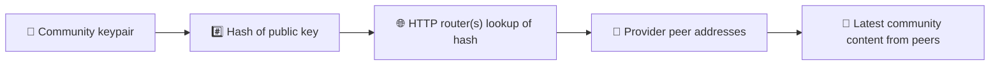
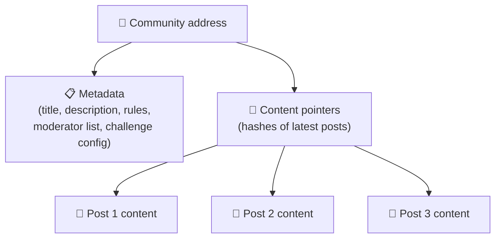
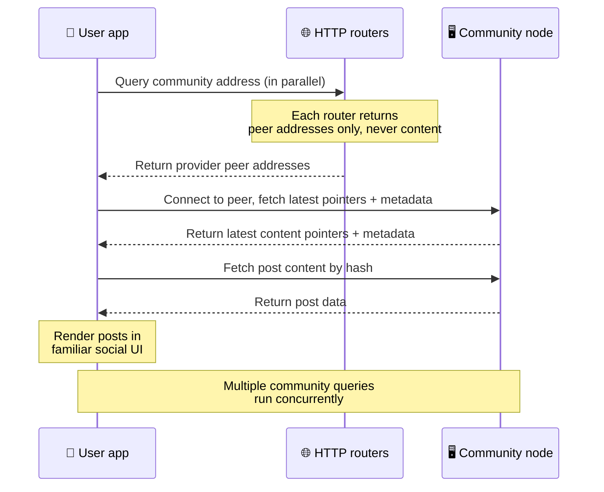
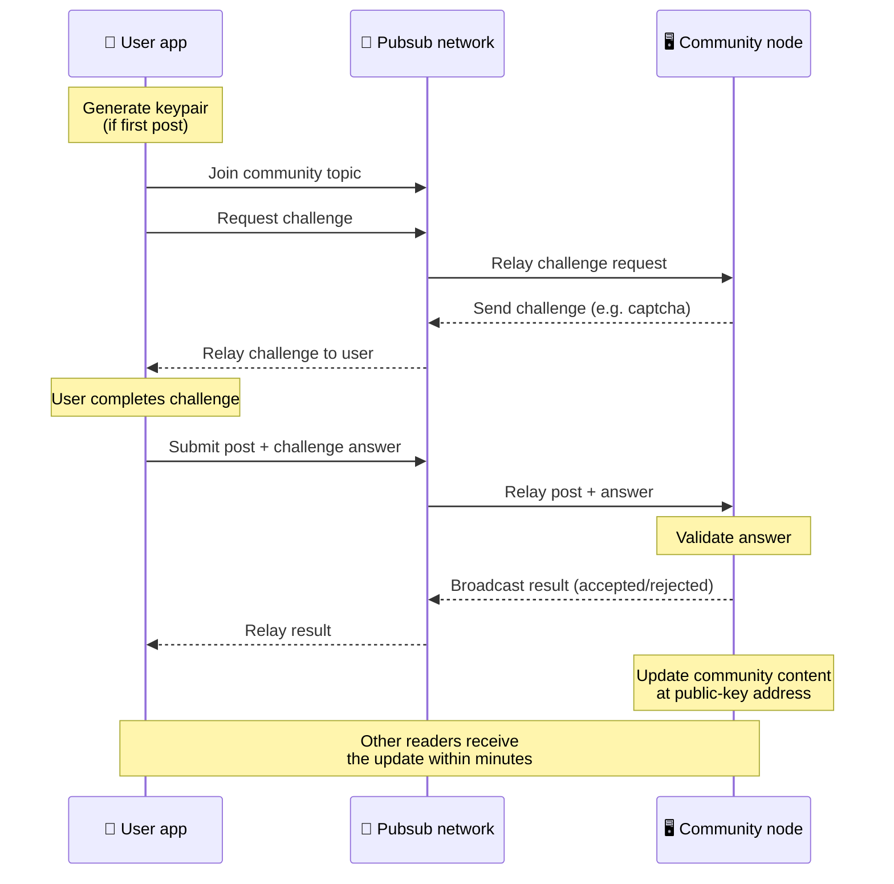
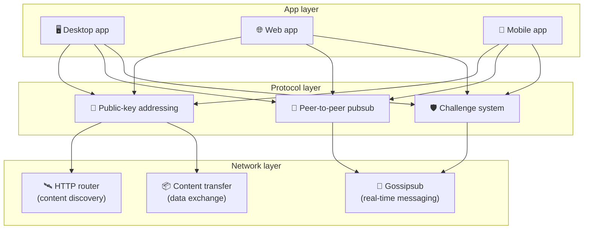

# Protocol peer-to-peer

Bitsocial no fa servir cap cadena de blocs, cap servidor de federació ni cap backend
centralitzat. En comptes d'això, fa servir la pila IPFS/libp2p per combinar dues idees:
**l'adreçament basat en claus públiques** i el **pubsub peer-to-peer**. Juntes permeten que
qualsevol persona allotgi una comunitat des de maquinari domèstic mentre els usuaris llegeixen i
publiquen sense comptes en cap servei controlat per una empresa.

Si vols una explicació menys tècnica, llegeix
[Una explicació completa del protocol Bitsocial](./layman-protocol-explanation.md).

## Bitsocial fa servir IPFS?

Sí. Els nodes de Bitsocial fan servir primitives d'IPFS/libp2p per a la capa peer-to-peer:
registres de comunitat adreçats per clau pública, transferència de continguts entre iguals i pubsub
de gossipsub per als missatges en temps real. Quan aquesta documentació parla de «pubsub», es
refereix al pubsub d'IPFS/libp2p, no a un intermediari de missatges centralitzat i separat.

Actualment el protocol descriu el descobriment a través d'encaminadors HTTP perquè els clients de
Bitsocial consulten punts finals d'encaminador per obtenir adreces d'iguals proveïdors en lloc de
dependre d'una DHT hostil per al navegador a cada cerca. Els encaminadors només retornen iguals; el
trànsit de transferència de continguts i de pubsub continua circulant per la xarxa peer-to-peer.

## Els dos problemes

Una xarxa social descentralitzada ha de respondre dues preguntes:

1. **Dades** — com s'emmagatzema i se serveix tot el contingut social del món sense una base de dades central?
2. **Spam** — com s'evita l'abús mantenint la xarxa gratuïta?

Bitsocial resol el problema de les dades saltant-se completament la cadena de blocs: les xarxes
socials no necessiten un ordre global de transaccions ni la disponibilitat permanent de cada
publicació antiga. Resol el problema de l'spam deixant que cada comunitat executi el seu propi
repte antispam sobre la xarxa peer-to-peer.

Per al model de descobriment que hi ha per sobre d'aquesta capa de xarxa, consulta [Descobriment de continguts](./content-discovery.md).

---

## Adreçament basat en claus públiques {#public-key-based-addressing}

A BitTorrent, el hash d'un fitxer esdevé la seva adreça (_adreçament basat en el contingut_).
Bitsocial fa servir una idea semblant amb claus públiques: el hash de la clau pública d'una
comunitat esdevé la seva adreça de xarxa.

Qualsevol igual de la xarxa pot consultar un **encaminador HTTP** per a aquesta adreça:
l'encaminador respon amb una llista d'adreces de xarxa dels iguals que en aquell moment
proporcionen el hash de la comunitat, i el client es connecta directament a aquests iguals per
obtenir l'estat més recent de la comunitat. Cada vegada que el contingut s'actualitza, el seu número
de versió augmenta. La xarxa només conserva la versió més recent — no cal preservar tots els estats
històrics, i això és el que fa que aquest plantejament sigui lleuger comparat amb una cadena de blocs.

> **Què conté realment un encaminador HTTP.** Un encaminador HTTP és un índex prim. Per a cada
> adreça de contingut que coneix, només desa les adreces de xarxa dels iguals que s'han anunciat com
> a proveïdors (parells d'IP i port, multiadreces de libp2p i coses per l'estil). **No** desa el
> contingut de la comunitat, ni les seves metadades, ni el text de les publicacions, ni la llista de
> membres, ni tan sols l'etiqueta llegible per humans del que hi ha en aquella adreça; només respon
> a «quins iguals diuen que tenen aquest hash?». Això fa que els encaminadors siguin barats de
> mantenir, fàcils de substituir i no responsables del que publiquen els usuaris, de manera semblant
> a un tracker de BitTorrent però sense metadades de torrent: un tracker associa infohashes amb
> iguals, mentre que un encaminador HTTP només associa una adreça de contingut amb adreces d'iguals
> proveïdors.
>
> Per redundància, el client consulta **diversos encaminadors HTTP en paral·lel** i fusiona les
> llistes de proveïdors que rep. Qualsevol persona pot mantenir un encaminador, i substituir-ne o
> afegir-ne és un canvi de configuració sense cap migració de dades.
>
> Bitsocial fa servir encaminadors HTTP en lloc d'una DHT perquè mantenir una DHT a l'escala que
> necessita el descobriment de continguts és car, sobretot per a mòbils. Una DHT tampoc no funciona
> al navegador, perquè els navegadors no es poden unir directament a una DHT de libp2p. Un
> encaminador HTTP funciona de manera econòmica sobre infraestructura HTTP convencional i va igual
> de bé des d'un telèfon o des d'un navegador.

### Què s'emmagatzema a l'adreça

L'adreça de la comunitat no conté directament el contingut complet de les publicacions. El que hi ha
és una llista d'identificadors de contingut, és a dir, hashos que apunten a les dades reals.
Aleshores el client obté cada fragment de contingut directament dels iguals que han retornat els
encaminadors HTTP. Els encaminadors mateixos no veuen ni desen mai el contingut.

Sempre hi ha com a mínim un igual que té les dades: el node de l'operador de la comunitat. Si la
comunitat és popular, molts altres iguals també les tindran i la càrrega es distribueix sola, igual
que els torrents populars es descarreguen més de pressa.

---

## Pubsub peer-to-peer

El pubsub (publicació i subscripció) és un patró de missatgeria en què els iguals se subscriuen a un
tema i reben tots els missatges que s'hi publiquen. Bitsocial fa servir una xarxa de pubsub
peer-to-peer: qualsevol pot publicar, qualsevol pot subscriure-s'hi i no hi ha cap intermediari de
missatges central.

Per publicar una entrada en una comunitat, l'usuari publica un missatge el tema del qual és la clau
pública de la comunitat. El node de l'operador de la comunitat el recull, el valida i, si supera el
repte antispam, l'inclou a la següent actualització de contingut.

---

## Antispam: reptes sobre pubsub

Una xarxa de pubsub oberta és vulnerable a allaus d'spam. Bitsocial ho resol exigint que qui publica
completi un **repte** abans que s'accepti el seu contingut.

El sistema de reptes és flexible: cada operador de comunitat configura la seva pròpia política.
Algunes opcions són:

| Tipus de repte           | Com funciona                                                  |
| ------------------------ | ------------------------------------------------------------- |
| **Captcha**              | Trencaclosques visual o interactiu presentat a l'aplicació    |
| **Límit de freqüència**  | Limita les publicacions per finestra de temps i per identitat |
| **Porta de tokens**      | Exigeix una prova de saldo d'un token concret                 |
| **Pagament**             | Exigeix un petit pagament per publicació                      |
| **Llista d'autoritzats** | Només poden publicar les identitats aprovades prèviament      |
| **Codi a mida**          | Qualsevol política que es pugui expressar en codi             |

Els iguals que retransmeten massa intents de repte fallits queden bloquejats del tema de pubsub, i
això evita atacs de denegació de servei a la capa de xarxa.

---

## Cicle de vida: llegir una comunitat

Això és el que passa quan un usuari obre l'aplicació i mira les últimes publicacions d'una comunitat.

**Pas a pas:**

1. L'usuari obre l'aplicació i veu una interfície social.
2. El client consulta diversos encaminadors HTTP en paral·lel per a cada comunitat que segueix
   l'usuari; cada encaminador retorna només adreces d'iguals, mai contingut. La latència de la
   consulta depèn de les condicions de la xarxa i de la càrrega de l'encaminador; en condicions
   habituals de baixa latència, les consultes solen respondre en aproximadament un segon i
   s'executen de manera concurrent.
3. Un cop el client té adreces d'iguals, s'hi connecta i obté els punters de contingut més recents i
   les metadades de la comunitat (títol, descripció, llista de moderadors, configuració dels
   reptes).
4. El client obté el contingut real de les publicacions amb aquests punters i després ho mostra tot
   en una interfície social familiar.

---

## Cicle de vida: publicar una entrada

Publicar implica un intercanvi de repte i resposta sobre pubsub abans que l'entrada s'accepti.

**Pas a pas:**

1. L'aplicació genera un parell de claus per a l'usuari si encara no en té cap.
2. L'usuari escriu una entrada per a una comunitat.
3. El client s'uneix al tema de pubsub d'aquesta comunitat (vinculat a la clau pública de la
   comunitat).
4. El client demana un repte per pubsub.
5. El node de l'operador de la comunitat li respon amb un repte (per exemple, un captcha).
6. L'usuari completa el repte.
7. El client envia l'entrada juntament amb la resposta al repte per pubsub.
8. El node de l'operador de la comunitat valida la resposta. Si és correcta, l'entrada s'accepta.
9. El node difon el resultat per pubsub perquè els iguals de la xarxa sàpiguen que han de continuar
   retransmetent els missatges d'aquest usuari.
10. El node actualitza el contingut de la comunitat a la seva adreça de clau pública.
11. Al cap d'uns minuts, tots els lectors de la comunitat reben l'actualització.

---

## Visió general de l'arquitectura

El sistema complet té tres capes que treballen conjuntament:

| Capa          | Funció                                                                                                                                                                                    |
| ------------- | ----------------------------------------------------------------------------------------------------------------------------------------------------------------------------------------- |
| **Aplicació** | Interfície d'usuari. Poden existir diverses aplicacions, cadascuna amb el seu disseny, i totes comparteixen les mateixes comunitats i identitats.                                         |
| **Protocol**  | Defineix com s'adrecen les comunitats, com es publiquen les entrades i com s'evita l'spam.                                                                                                |
| **Xarxa**     | La infraestructura peer-to-peer subjacent: encaminadors HTTP per al descobriment, gossipsub per a la missatgeria en temps real i transferència de continguts per a l'intercanvi de dades. |

---

## Privadesa: desvincular els autors de les adreces IP

Quan un usuari publica una entrada, el contingut es **xifra amb la clau pública de l'operador de la
comunitat** abans d'entrar a la xarxa de pubsub. Això vol dir que, encara que qui observi la xarxa
pugui veure que un igual ha publicat _alguna cosa_, no pot determinar:

- què diu el contingut
- quina identitat d'autor l'ha publicat

És semblant a com BitTorrent permet descobrir quines IP comparteixen un torrent però no qui el va
crear originalment. La capa de xifratge hi afegeix una garantia de privadesa addicional per sobre
d'aquesta base.

---

## Peer-to-peer al navegador

El P2P al navegador ja és possible als clients de Bitsocial. Una aplicació de navegador pot executar
un node [Helia](https://helia.io/), fer servir la mateixa pila de client del protocol Bitsocial que
la resta d'aplicacions i obtenir contingut dels iguals en lloc de demanar a una passarel·la IPFS
centralitzada que el serveixi. El navegador també pot participar directament en el pubsub, de manera
que publicar no necessita cap proveïdor de pubsub propietat d'una plataforma en el camí normal.

Aquesta és la fita important per a la distribució web: un lloc web HTTPS normal pot obrir-se com a
client social P2P en viu. Els usuaris no han d'instal·lar una aplicació d'escriptori abans de poder
llegir de la xarxa, i l'operador de l'aplicació no ha de mantenir una passarel·la central que es
converteixi en el coll d'ampolla de censura o moderació de tots els usuaris de navegador.

El camí del navegador té límits diferents dels d'un node d'escriptori o de servidor:

- un node de navegador normalment no pot acceptar connexions entrants arbitràries des d'internet públic
- pot carregar, validar, desar a la memòria cau i publicar dades mentre l'aplicació està oberta
- no s'hauria de considerar l'amfitrió de llarga durada de les dades d'una comunitat
- l'allotjament complet d'una comunitat encara es gestiona millor amb una aplicació d'escriptori,
  `bitsocial-cli` o un altre node sempre actiu

Els encaminadors HTTP continuen sent importants per al descobriment de continguts: retornen adreces
de proveïdors per al hash d'una comunitat. No són passarel·les IPFS, perquè no serveixen el
contingut en si. Després del descobriment, el client de navegador es connecta als iguals i obté les
dades a través de la pila P2P.

El P2P al navegador ja és el camí web per defecte, no un experiment amagat darrere d'un interruptor.
5chan funciona amb P2P pur al navegador per defecte a 5chan.app, i el blog de Bitsocial a
bitsocial.net fa el mateix. Els iguals de navegador es connecten mitjançant WebSockets segurs;
`pkc-js` denega per defecte les connexions per WebRTC i WebTransport perquè els seus camins
d'establiment de connexió són lents i poc fiables al navegador. El canvi upstream que va fer
practicable la publicació des del navegador el 2026 va ser la correcció del número de seqüència de
gossipsub a `@libp2p/gossipsub` 15.0.21, que va evitar que els iguals de Kubo descartessin els
missatges publicats per nodes de JavaScript.

Per veure la imatge completa, incloent-hi el que un node de navegador encara no pot fer, consulta
[Peer-to-peer al navegador](/browser-p2p/).

## Reserva amb passarel·la {#gateway-fallback}

L'accés des del navegador amb el suport d'una passarel·la continua sent útil com a reserva de
compatibilitat i de desplegament. Una passarel·la pot retransmetre dades entre la xarxa P2P i un
client de navegador quan aquest no es pot unir directament a la xarxa o quan l'aplicació tria
intencionadament el camí antic. Aquestes passarel·les:

- les pot mantenir qualsevol persona
- no requereixen comptes d'usuari ni pagaments
- no obtenen la custòdia de les identitats ni de les comunitats dels usuaris
- es poden substituir sense perdre dades

L'arquitectura objectiu és primer el P2P al navegador, amb les passarel·les com a reserva opcional i
no com a coll d'ampolla per defecte.

---

## Per què no una cadena de blocs?

Les cadenes de blocs resolen el problema de la doble despesa: necessiten saber l'ordre exacte de cada
transacció per evitar que algú gasti dues vegades la mateixa moneda.

Les xarxes socials no tenen cap problema de doble despesa. Tant és si l'entrada A s'ha publicat un
mil·lisegon abans que la B, i les entrades antigues no cal que estiguin disponibles permanentment a
tots els nodes.

En saltar-se la cadena de blocs, Bitsocial evita:

- **comissions de gas** — publicar és gratuït
- **límits de rendiment** — cap coll d'ampolla de mida de bloc o de temps de bloc
- **inflament de l'emmagatzematge** — els nodes només conserven el que necessiten
- **sobrecàrrega de consens** — no calen miners, validadors ni staking

La contrapartida és que Bitsocial no garanteix la disponibilitat permanent del contingut antic. Però
per a les xarxes socials és una contrapartida acceptable: el node de l'operador de la comunitat
conserva les dades, el contingut popular s'escampa per molts iguals i les entrades molt antigues
s'esvaeixen de manera natural, igual que passa a totes les plataformes socials.

## Per què no la federació?

Les xarxes federades (com el correu electrònic o les plataformes basades en ActivityPub) milloren la
centralització, però encara tenen limitacions estructurals:

- **Dependència del servidor** — cada comunitat necessita un servidor amb un domini, TLS i
  manteniment continuat
- **Confiança en l'administrador** — l'administrador del servidor té el control total sobre els
  comptes d'usuari i el contingut
- **Fragmentació** — canviar de servidor sovint vol dir perdre seguidors, historial o identitat
- **Cost** — algú ha de pagar l'allotjament, i això genera pressió cap a la consolidació

El plantejament peer-to-peer de Bitsocial treu el servidor completament de l'equació. Un node de
comunitat pot funcionar en un portàtil, en una Raspberry Pi o en un VPS barat. L'operador controla la
política de moderació, però no pot apropiar-se de les identitats dels usuaris, perquè les identitats
es controlen amb parells de claus i no les concedeix el servidor.

## I Nostr?

Nostr no encaixa clarament en cap dels dos grups. No és federació a l'estil d'ActivityPub, perquè les
instàncies no emeten comptes als usuaris i la identitat no està lligada a un servidor. Tampoc no és
xarxa social sobre cadena de blocs, perquè no hi ha cadena, ni consens, ni gas, ni ordre global de
transaccions.

Nostr es descriu millor com a **xarxa social basada en relés**. Al protocol base
([NIP-01](https://github.com/nostr-protocol/nips/blob/master/01.md)), els usuaris tenen parells de
claus, signen esdeveniments i publiquen aquests esdeveniments en relés de WebSocket. Els clients se
subscriuen als relés amb filtres, obtenen els esdeveniments que hi coincideixen i verifiquen les
signatures localment. Els usuaris també poden publicar metadades de llista de relés
([NIP-65](https://github.com/nostr-protocol/nips/blob/master/65.md)) que indiquen als clients en
quins relés escriuen habitualment i quins relés prefereixen per llegir les mencions.

Això situa Nostr més a prop de Bitsocial que dels sistemes federats o de cadena de blocs en un
aspecte important: la identitat és criptogràfica i portable. La diferència principal és la capa de
dades. A Nostr, els relés són la capa normal d'emmagatzematge i de lliurament. A Bitsocial, els
encaminadors HTTP només ajuden els clients a trobar iguals. Els encaminadors no desen entrades,
perfils, metadades de comunitat ni estat de moderació; retornen adreces d'iguals proveïdors i,
després, els clients obtenen el contingut dels iguals.

Amb les comunitats passa el mateix. Nostr té patrons opcionals per a
[grups basats en relés](https://github.com/nostr-protocol/nips/blob/master/29.md) i
[comunitats aprovades per moderadors](https://github.com/nostr-protocol/nips/blob/master/72.md),
però encara depenen de la política del relé, de l'estat del grup allotjat al relé o de les decisions
del client sobre quines aprovacions respecta. Bitsocial tracta les comunitats com a objectes
criptogràfics de primera classe, i el node del seu operador valida les entrades, aplica la política
de reptes de la comunitat i publica a la xarxa peer-to-peer l'últim estat acceptat.

| Pregunta                | Nostr                                                                                                       | Bitsocial                                                                         |
| ----------------------- | ----------------------------------------------------------------------------------------------------------- | --------------------------------------------------------------------------------- |
| Categoria               | Protocol basat en relés                                                                                     | Xarxa de comunitats peer-to-peer                                                  |
| Identitat               | Clau pública de l'usuari                                                                                    | Parells de claus d'usuari i de comunitat                                          |
| Camí de les dades       | Esdeveniments signats publicats als relés                                                                   | L'adreça de clau pública es resol en iguals; el contingut s'obté dels iguals      |
| Qui ho manté en línia   | Relés triats pels usuaris i els clients                                                                     | Node del propietari de la comunitat més seeders auxiliars                         |
| Comunitats              | Grups opcionals basats en relés o comunitats aprovades per moderadors                                       | Objectes de comunitat de primera classe amb moderació controlada per l'operador   |
| Antispam                | Política del relé, autenticació, pagament, prova de treball, filtres del client o aprovacions de moderadors | Lògica de reptes definida per la comunitat abans de la inclusió                   |
| Contrapartida principal | Identitat portable, però disponibilitat i política dependents dels relés                                    | Menys dependència dels relés, però el contingut antic no està garantit per sempre |

---

## Resum

Bitsocial es construeix sobre dues primitives: l'adreçament basat en claus públiques per al
descobriment de continguts i el pubsub peer-to-peer per a la comunicació en temps real. Juntes
produeixen una xarxa social on:

- les comunitats s'identifiquen amb claus criptogràfiques, no amb noms de domini
- el contingut s'escampa entre iguals com un torrent, en lloc de servir-se des d'una única base de dades
- la resistència a l'spam és local a cada comunitat, no imposada per una plataforma
- els usuaris són propietaris de les seves identitats mitjançant parells de claus, no mitjançant comptes revocables
- tot el sistema funciona sense servidors, cadenes de blocs ni comissions de plataforma
