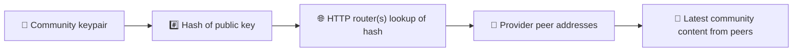
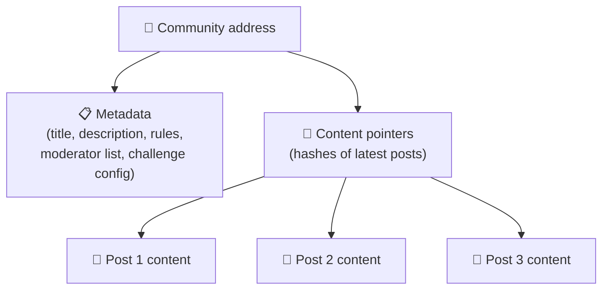
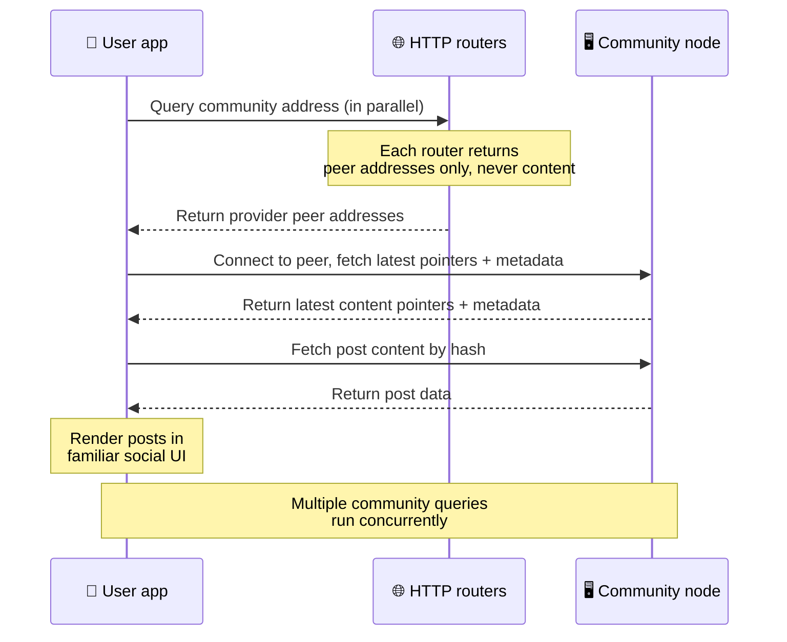
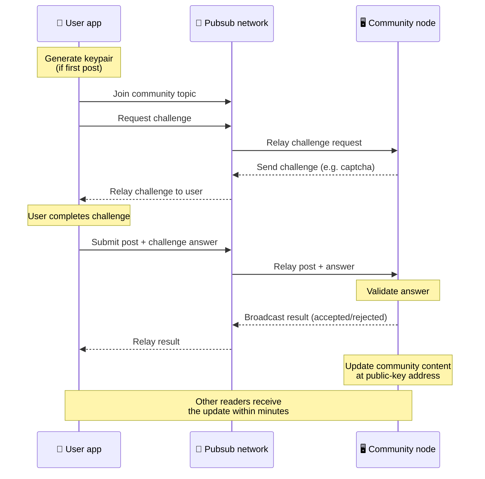
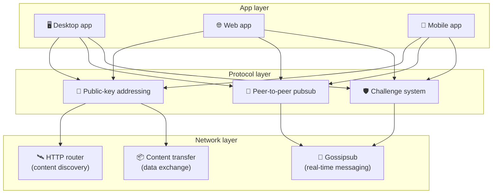

# Protokol peer-to-peer

Bitsocial nepoužívá blockchain, federační server ani centralizovaný backend. Staví místo toho na
sadě IPFS/libp2p a spojuje dvě myšlenky: **adresování podle veřejného klíče** a **peer-to-peer
pubsub**. Společně umožňují komukoli hostovat komunitu na běžném spotřebitelském hardwaru, zatímco
uživatelé čtou a přispívají bez účtů u jakékoli služby ovládané firmou.

Méně technický výklad najdete v článku
[Kompletní laické vysvětlení protokolu Bitsocial](./layman-protocol-explanation.md).

## Používá Bitsocial IPFS?

Ano. Uzly Bitsocial využívají pro peer-to-peer vrstvu primitiva IPFS/libp2p: záznamy komunit
adresované veřejným klíčem, přenos obsahu mezi peery a gossipsub pubsub pro zprávy v reálném čase.
Když se v této dokumentaci mluví o „pubsub“, myslí se tím IPFS/libp2p pubsub, nikoli samostatný
centralizovaný broker zpráv.

Protokol dnes popisuje vyhledávání přes HTTP routery, protože klienti Bitsocial se na adresy
poskytujících peerů ptají koncových bodů routerů, místo aby při každém dotazu spoléhali na DHT, která
je vůči prohlížečům nepřívětivá. Routery vracejí pouze peery; přenos obsahu i provoz pubsub nadále
proudí peer-to-peer sítí.

## Dva problémy

Decentralizovaná sociální síť musí odpovědět na dvě otázky:

1. **Data** — jak ukládat a doručovat sociální obsah celého světa bez centrální databáze?
2. **Spam** — jak zabránit zneužívání a přitom nechat síť volně použitelnou?

Problém dat řeší Bitsocial tím, že blockchain zcela vynechává: sociální média nepotřebují globální
řazení transakcí ani trvalou dostupnost každého starého příspěvku. Problém spamu řeší tím, že každé
komunitě umožní provozovat vlastní antispamovou výzvu přes peer-to-peer síť.

Model objevování obsahu nad touto síťovou vrstvou popisuje stránka
[Objevování obsahu](./content-discovery.md).

---

## Adresování podle veřejného klíče {#public-key-based-addressing}

V BitTorrentu se adresou souboru stává jeho hash (_adresování podle obsahu_). Bitsocial používá
obdobný princip s veřejnými klíči: síťovou adresou komunity se stává hash jejího veřejného klíče.

Kterýkoli peer v síti se může na tuto adresu zeptat **HTTP routeru**: router odpoví seznamem
síťových adres peerů, které hash komunity právě poskytují, a klient se k nim připojí přímo, aby
stáhl nejnovější stav komunity. Při každé aktualizaci obsahu se zvýší číslo verze. Síť uchovává
pouze nejnovější verzi — každý historický stav udržovat netřeba, a právě to dělá tento přístup ve
srovnání s blockchainem odlehčeným.

> **Co HTTP router ve skutečnosti drží.** HTTP router je tenký index. Pro každou adresu obsahu,
> kterou zná, uchovává jen síťové adresy peerů, kteří se přihlásili jako poskytovatelé (dvojice
> IP/port, libp2p multiadresy a podobně). **Neukládá** obsah komunity, její metadata, text
> příspěvků, seznam členů ani lidsky čitelný název toho, co se na dané adrese nachází; odpovídá
> pouze na otázku „kteří peeři tvrdí, že tento hash mají?“. Díky tomu je provoz routeru levný,
> router se dá snadno vyměnit a nenese odpovědnost za to, co uživatelé publikují — podobně jako
> BitTorrent tracker, ale bez torrentových metadat: tracker mapuje infohashe na peery, kdežto HTTP
> router mapuje adresu obsahu pouze na adresy poskytujících peerů.
>
> Kvůli redundanci se klient ptá **několika HTTP routerů paralelně** a seznamy poskytovatelů, které
> dostane zpět, slučuje. Router může provozovat kdokoli a výměna nebo přidání routeru je změna
> konfigurace bez migrace dat.
>
> Bitsocial používá HTTP routery místo DHT, protože provozovat DHT v měřítku potřebném pro
> objevování obsahu je drahé, obzvlášť na mobilu. DHT navíc nefunguje v prohlížeči, protože
> prohlížeče se do libp2p DHT nemohou připojit přímo. HTTP router běží levně na běžné HTTP
> infrastruktuře a funguje stejně dobře z telefonu i z prohlížeče.

### Co se na adrese ukládá

Adresa komunity neobsahuje přímo celý obsah příspěvků. Ukládá místo toho seznam identifikátorů
obsahu — hashů, které ukazují na skutečná data. Klient si pak každý kus obsahu stáhne přímo od
peerů, jejichž adresy vrátily HTTP routery. Samotné routery obsah nikdy nevidí ani neukládají.

Data má vždy alespoň jeden peer: uzel provozovatele komunity. Je-li komunita populární, má je i
mnoho dalších peerů a zátěž se rozloží sama — stejně jako se oblíbené torrenty stahují rychleji.

---

## Peer-to-peer pubsub

Pubsub (publish-subscribe) je vzor zasílání zpráv, kdy se peeři přihlásí k odběru tématu a dostávají
každou zprávu, která je v tomto tématu publikována. Bitsocial používá peer-to-peer pubsub síť —
publikovat může kdokoli, odebírat může kdokoli a neexistuje žádný centrální broker zpráv.

Chce-li uživatel publikovat příspěvek do komunity, publikuje zprávu, jejíž téma odpovídá veřejnému
klíči komunity. Uzel provozovatele komunity ji zachytí, ověří a — pokud projde antispamovou výzvou —
zahrne ji do další aktualizace obsahu.

---

## Antispam: výzvy přes pubsub

Otevřená pubsub síť je zranitelná vůči záplavám spamu. Bitsocial to řeší tak, že po publikujících
vyžaduje splnění **výzvy**, než je jejich obsah přijat.

Systém výzev je flexibilní: každý provozovatel komunity si nastavuje vlastní pravidla. Mezi možnosti
patří:

| Typ výzvy             | Jak funguje                                             |
| --------------------- | ------------------------------------------------------- |
| **Captcha**           | Vizuální nebo interaktivní hádanka zobrazená v aplikaci |
| **Omezení frekvence** | Omezit počet příspěvků na identitu za časové okno       |
| **Token gate**        | Vyžadovat doklad o zůstatku konkrétního tokenu          |
| **Platba**            | Vyžadovat malou platbu za každý příspěvek               |
| **Seznam povolených** | Publikovat mohou jen předem schválené identity          |
| **Vlastní kód**       | Jakákoli pravidla vyjádřitelná v kódu                   |

Peeři, kteří předávají příliš mnoho neúspěšných pokusů o splnění výzvy, jsou z pubsub tématu
zablokováni, což brání útokům typu denial-of-service na síťovou vrstvu.

---

## Životní cyklus: čtení komunity

Takto to vypadá, když uživatel otevře aplikaci a prohlíží si nejnovější příspěvky komunity.

**Krok za krokem:**

1. Uživatel otevře aplikaci a uvidí sociální rozhraní.
2. Klient se pro každou komunitu, kterou uživatel sleduje, ptá paralelně několika HTTP routerů;
   každý router vrací pouze adresy peerů, nikdy obsah. Doba odezvy závisí na stavu sítě a zatížení
   routerů; za obvyklých podmínek s nízkou latencí se dotazy často vrátí zhruba do jedné sekundy a
   probíhají souběžně.
3. Jakmile má klient adresy peerů, připojí se k nim a stáhne nejnovější ukazatele obsahu a metadata
   komunity (název, popis, seznam moderátorů, konfiguraci výzvy).
4. Klient podle těchto ukazatelů stáhne skutečný obsah příspěvků a vše vykreslí ve známém sociálním
   rozhraní.

---

## Životní cyklus: publikování příspěvku

Publikování zahrnuje handshake typu výzva-odpověď přes pubsub, teprve pak je příspěvek přijat.

**Krok za krokem:**

1. Aplikace uživateli vygeneruje pár klíčů, pokud ho ještě nemá.
2. Uživatel napíše příspěvek pro komunitu.
3. Klient se připojí k pubsub tématu dané komunity (odvozenému od veřejného klíče komunity).
4. Klient si přes pubsub vyžádá výzvu.
5. Uzel provozovatele komunity pošle zpět výzvu (například captchu).
6. Uživatel výzvu splní.
7. Klient přes pubsub odešle příspěvek spolu s odpovědí na výzvu.
8. Uzel provozovatele komunity odpověď ověří. Je-li správná, příspěvek je přijat.
9. Uzel rozešle výsledek přes pubsub, aby peeři v síti věděli, že mají zprávy od tohoto uživatele
   dál předávat.
10. Uzel aktualizuje obsah komunity na jeho adrese odvozené od veřejného klíče.
11. Během několika minut dostane aktualizaci každý čtenář komunity.

---

## Přehled architektury

Celý systém tvoří tři vrstvy, které spolupracují:

| Vrstva       | Role                                                                                                                                     |
| ------------ | ---------------------------------------------------------------------------------------------------------------------------------------- |
| **Aplikace** | Uživatelské rozhraní. Aplikací může existovat víc, každá s vlastním designem, a všechny sdílejí stejné komunity a identity.              |
| **Protokol** | Určuje, jak se komunity adresují, jak se publikují příspěvky a jak se brání spamu.                                                       |
| **Síť**      | Podkladová peer-to-peer infrastruktura: HTTP routery pro objevování, gossipsub pro zprávy v reálném čase a přenos obsahu pro výměnu dat. |

---

## Soukromí: oddělení autorů od IP adres

Když uživatel publikuje příspěvek, je obsah před vstupem do pubsub sítě **zašifrován veřejným klíčem
provozovatele komunity**. To znamená, že pozorovatelé sítě sice vidí, že nějaký peer _něco_
publikoval, ale nedokážou určit:

- co obsah říká
- která autorská identita ho publikovala

Je to podobné tomu, jako když u BitTorrentu lze zjistit, které IP adresy torrent seedují, ale ne kdo
ho původně vytvořil. Šifrovací vrstva k této základní úrovni přidává další záruku soukromí.

---

## Peer-to-peer v prohlížeči

P2P v prohlížeči je v klientech Bitsocial nyní možné. Aplikace v prohlížeči může provozovat uzel
[Helia](https://helia.io/), používat stejnou klientskou sadu protokolu Bitsocial jako ostatní
aplikace a stahovat obsah od peerů, místo aby o jeho doručení žádala centralizovanou IPFS bránu.
Prohlížeč se také může přímo účastnit pubsub, takže publikování v běžném průběhu nepotřebuje
poskytovatele pubsub vlastněného platformou.

Pro distribuci přes web je to zásadní milník: běžný HTTPS web se může otevřít jako živý P2P sociální
klient. Uživatelé nemusí instalovat desktopovou aplikaci, aby mohli ze sítě číst, a provozovatel
aplikace nemusí provozovat centrální bránu, která by se pro každého uživatele prohlížeče stala úzkým
hrdlem cenzury nebo moderování.

Cesta přes prohlížeč má jiné limity než desktopový nebo serverový uzel:

- uzel v prohlížeči obvykle nemůže přijímat libovolná příchozí spojení z veřejného internetu
- dokáže načítat, ověřovat, ukládat do mezipaměti a publikovat data, dokud je aplikace otevřená
- neměl by se považovat za dlouhodobého hostitele dat komunity
- plnohodnotné hostování komunity nadále nejlépe zvládne desktopová aplikace, `bitsocial-cli` nebo
  jiný trvale běžící uzel

HTTP routery jsou pro objevování obsahu stále důležité: vracejí adresy poskytovatelů pro hash
komunity. Nejsou to IPFS brány, protože samotný obsah nedoručují. Po nalezení peerů se klient
v prohlížeči k peerům připojí a stáhne data přes P2P vrstvu.

P2P v prohlížeči je nyní výchozí webová cesta, ne experiment schovaný za přepínačem. 5chan běží ve
výchozím nastavení jako čisté prohlížečové P2P na 5chan.app a blog Bitsocial na bitsocial.net dělá
totéž. Peeři v prohlížeči navazují spojení přes zabezpečené WebSockets; `pkc-js` ve výchozím
nastavení odmítá spojení přes WebRTC a WebTransport, protože jejich navazování je v prohlížeči
pomalé a nespolehlivé. Upstreamovou změnou, díky které bylo publikování z prohlížeče v roce 2026
prakticky použitelné, byla oprava sekvenčních čísel gossipsubu v `@libp2p/gossipsub` 15.0.21, po níž
peeři s Kubo přestali zahazovat zprávy publikované JavaScriptovými uzly.

Úplný obraz včetně toho, co uzel v prohlížeči stále nedokáže, najdete na stránce
[Peer-to-peer v prohlížeči](/browser-p2p/).

## Záložní režim s bránou {#gateway-fallback}

Přístup z prohlížeče přes bránu zůstává užitečný jako záloha pro kompatibilitu a postupné zavádění.
Brána umí přenášet data mezi P2P sítí a klientem v prohlížeči, když se prohlížeč nemůže připojit do
sítě přímo nebo když aplikace záměrně zvolí starší cestu. Tyto brány:

- může provozovat kdokoli
- nevyžadují uživatelské účty ani platby
- nezískávají kontrolu nad identitami uživatelů ani nad komunitami
- lze je vyměnit bez ztráty dat

Cílová architektura staví na prvním místě na P2P v prohlížeči a brány chápe jako volitelnou zálohu,
ne jako výchozí úzké hrdlo.

---

## Proč ne blockchain?

Blockchainy řeší problém dvojí útraty: potřebují znát přesné pořadí každé transakce, aby nikdo
nemohl utratit stejnou minci dvakrát.

Sociální média problém dvojí útraty nemají. Nezáleží na tom, jestli byl příspěvek A publikován
o milisekundu dřív než příspěvek B, a staré příspěvky nemusí být trvale dostupné na každém uzlu.

Vynecháním blockchainu se Bitsocial vyhýbá:

- **poplatkům za plyn** — publikování je zdarma
- **omezením propustnosti** — žádné úzké hrdlo v podobě velikosti bloku nebo doby bloku
- **bobtnání úložiště** — uzly si uchovávají jen to, co potřebují
- **režii konsensu** — nejsou potřeba těžaři, validátoři ani staking

Kompromisem je, že Bitsocial nezaručuje trvalou dostupnost starého obsahu. Pro sociální média je to
ale přijatelné: data drží uzel provozovatele komunity, populární obsah se rozšíří mezi mnoho peerů a
velmi staré příspěvky přirozeně vyblednou — stejně jako na každé sociální platformě.

## Proč ne federace?

Federované sítě (jako e-mail nebo platformy postavené na ActivityPub) jsou proti centralizaci krokem
vpřed, ale pořád mají strukturální omezení:

- **Závislost na serveru** — každá komunita potřebuje server s doménou, TLS a průběžnou údržbou
- **Důvěra ve správce** — správce serveru má plnou kontrolu nad uživatelskými účty i obsahem
- **Roztříštěnost** — přechod mezi servery často znamená ztrátu sledujících, historie nebo identity
- **Náklady** — někdo musí platit hosting, což vytváří tlak na konsolidaci

Peer-to-peer přístup, který volí Bitsocial, odstraňuje server z rovnice úplně. Komunitní uzel může
běžet na notebooku, na Raspberry Pi nebo na levném VPS. Provozovatel řídí pravidla moderování, ale
nemůže zabavit identity uživatelů, protože identity jsou řízené párem klíčů, ne udělené serverem.

## A co Nostr?

Nostr do žádné z těchto kategorií pořádně nezapadá. Není to federace ve stylu ActivityPub, protože
uživatelům nevydávají účty jednotlivé instance a identita není vázaná na jeden server. Není to ani
blockchainové sociální médium, protože tu není žádný řetězec, konsensus, poplatky za plyn ani
globální pořadí transakcí.

Nostr se lépe popisuje jako **sociální médium založené na relayích**. V základním protokolu
([NIP-01](https://github.com/nostr-protocol/nips/blob/master/01.md)) uživatelé drží páry klíčů,
podepisují události a publikují je na WebSocket relaye. Klienti se k relayím přihlašují s filtry,
stahují odpovídající události a ověřují podpisy lokálně. Uživatelé mohou také publikovat metadata se
seznamem relayí ([NIP-65](https://github.com/nostr-protocol/nips/blob/master/65.md)), která
klientům říkají, na které relaye běžně zapisují a které preferují pro čtení zmínek.

V jednom důležitém ohledu to Nostr přibližuje k Bitsocialu víc než federované nebo blockchainové
systémy: identita je kryptografická a přenositelná. Hlavní rozdíl je v datové vrstvě. U Nostru jsou
relaye běžnou vrstvou pro ukládání i doručování. U Bitsocialu HTTP routery klientům jen pomáhají
najít peery. Routery neukládají příspěvky, profily, metadata komunit ani stav moderování; vracejí
adresy poskytujících peerů a klienti si pak obsah stáhnou od peerů.

Stejné rozdělení se ukazuje i u komunit. Nostr má volitelné vzory pro
[skupiny založené na relayích](https://github.com/nostr-protocol/nips/blob/master/29.md) a
[komunity schvalované moderátory](https://github.com/nostr-protocol/nips/blob/master/72.md), ty ale
stále závisejí na pravidlech relaye, na stavu skupiny hostovaném relayí nebo na tom, která schválení
se klient rozhodne respektovat. Bitsocial chápe komunity jako plnohodnotné kryptografické objekty,
jejichž uzel provozovatele ověřuje příspěvky, uplatňuje pravidla výzvy dané komunity a publikuje
nejnovější přijatý stav do peer-to-peer sítě.

| Otázka             | Nostr                                                                                          | Bitsocial                                                         |
| ------------------ | ---------------------------------------------------------------------------------------------- | ----------------------------------------------------------------- |
| Kategorie          | Protokol založený na relayích                                                                  | Peer-to-peer síť komunit                                          |
| Identita           | Veřejný klíč uživatele                                                                         | Páry klíčů uživatele a komunity                                   |
| Cesta k datům      | Podepsané události publikované na relaye                                                       | Adresa z veřejného klíče vede k peerům; obsah se stahuje od peerů |
| Kdo to drží online | Relaye zvolené uživateli a klienty                                                             | Uzel vlastníka komunity a pomocné seedery                         |
| Komunity           | Volitelné skupiny na relayích nebo komunity schvalované moderátory                             | Plnohodnotné objekty komunit s moderováním v rukou provozovatele  |
| Antispam           | Pravidla relaye, autentizace, platba, proof-of-work, filtry klienta nebo schválení moderátorem | Logika výzvy definovaná komunitou ještě před zařazením            |
| Hlavní kompromis   | Přenositelná identita, ale dostupnost a pravidla závislé na relayích                           | Menší závislost na relayích, ale starý obsah není zaručen navždy  |

---

## Shrnutí

Bitsocial stojí na dvou primitivech: adresování podle veřejného klíče pro objevování obsahu a
peer-to-peer pubsub pro komunikaci v reálném čase. Společně vytvářejí sociální síť, kde:

- komunity jsou identifikovány kryptografickými klíči, ne doménovými jmény
- obsah se šíří mezi peery jako torrent, místo aby ho doručovala jediná databáze
- odolnost proti spamu je věcí každé komunity, ne něčím, co vnucuje platforma
- uživatelé vlastní své identity díky párům klíčů, ne díky odvolatelným účtům
- celý systém běží bez serverů, blockchainů a platformních poplatků
