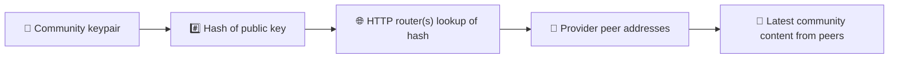
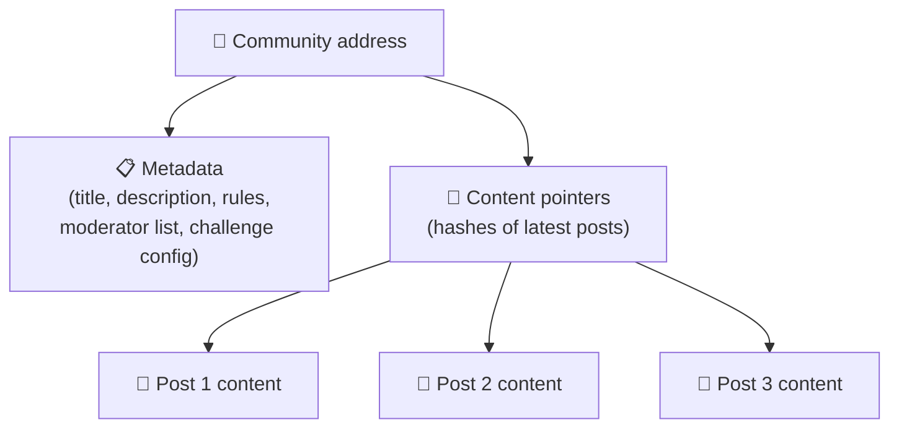
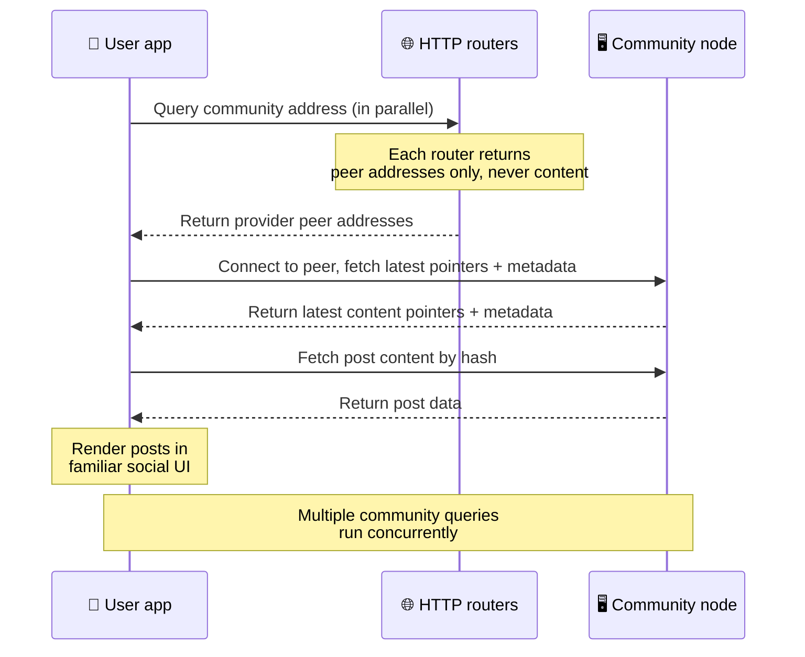
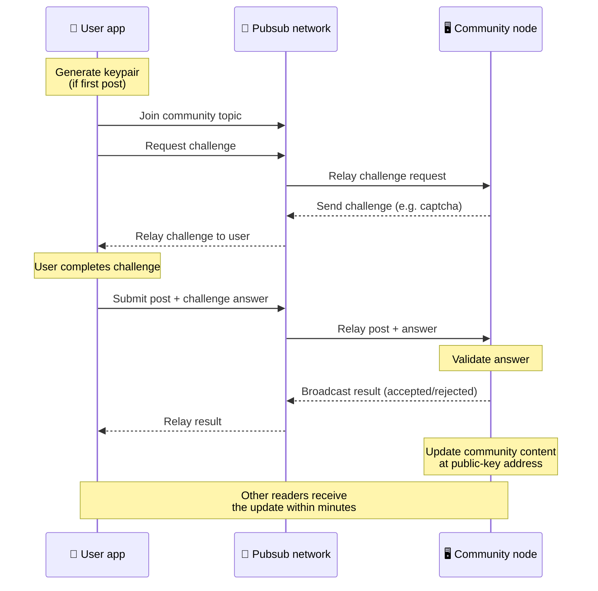
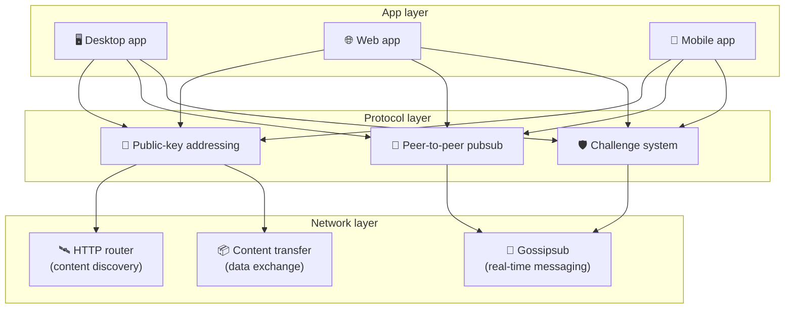

# Peer-to-peer-protokol

Bitsocial bruger hverken en blockchain, en fødereringsserver eller en centraliseret backend. I
stedet bruger projektet IPFS/libp2p-stakken til at kombinere to idéer: **adressering baseret på
offentlige nøgler** og **peer-to-peer-pubsub**. Tilsammen gør de det muligt for enhver at hoste et
fællesskab på almindeligt forbrugerudstyr, mens brugerne læser og skriver indlæg uden konti hos
nogen virksomhedsstyret tjeneste.

For en mindre teknisk gennemgang kan du læse
[En komplet lægmandsforklaring af Bitsocial-protokollen](./layman-protocol-explanation.md).

## Bruger Bitsocial IPFS?

Ja. Bitsocial-noder bruger IPFS/libp2p-primitiver til peer-to-peer-laget: fællesskabsposter
adresseret via offentlige nøgler, indholdsoverførsel mellem peers og gossipsub-pubsub til
realtidsbeskeder. Når denne dokumentation skriver "pubsub", menes IPFS/libp2p-pubsub og ikke en
separat, centraliseret beskedmægler.

Protokollen beskriver i øjeblikket opdagelse via HTTP-routere, fordi Bitsocial-klienter forespørger
router-endpoints om adresser på udbyder-peers i stedet for at læne sig op ad en browserfjendtlig DHT
ved hvert opslag. Routere returnerer kun peers; indholdsoverførsel og pubsub-trafik løber fortsat
gennem peer-to-peer-netværket.

## De to problemer

Et decentraliseret socialt netværk skal besvare to spørgsmål:

1. **Data** — hvordan gemmer og udleverer man verdens sociale indhold uden en central database?
2. **Spam** — hvordan forhindrer man misbrug og holder samtidig netværket gratis at bruge?

Bitsocial løser dataproblemet ved helt at droppe blockchain: sociale medier har ikke brug for global
rækkefølge på transaktioner eller permanent tilgængelighed af hvert eneste gamle indlæg.
Spamproblemet løses ved at lade hvert fællesskab køre sin egen anti-spam-udfordring hen over
peer-to-peer-netværket.

For opdagelsesmodellen oven på dette netværkslag, se [Opdagelse af indhold](./content-discovery.md).

---

## Adressering baseret på offentlige nøgler {#public-key-based-addressing}

I BitTorrent bliver en fils hash til dens adresse (_indholdsbaseret adressering_). Bitsocial bruger
en tilsvarende idé med offentlige nøgler: hashen af et fællesskabs offentlige nøgle bliver dets
netværksadresse.

Enhver peer på netværket kan forespørge en **HTTP-router** om den adresse: routeren svarer med en
liste over netværksadresser på de peers, der lige nu udbyder fællesskabets hash, og klienten
forbinder direkte til disse peers for at hente fællesskabets seneste tilstand. Hver gang indholdet
opdateres, stiger versionsnummeret. Netværket beholder kun den nyeste version — der er ingen grund
til at bevare hver eneste historiske tilstand, og det er netop det, der gør denne tilgang let
sammenlignet med en blockchain.

> **Hvad en HTTP-router faktisk indeholder.** En HTTP-router er et tyndt indeks. For hver
> indholdsadresse, den kender, gemmer den kun netværksadresserne på de peers, der har annonceret sig
> selv som udbydere (IP/port-par, libp2p-multiadresser og den slags). Den gemmer **ikke**
> fællesskabets indhold, dets metadata, indlægstekst, medlemsliste eller bare den læsbare betegnelse
> for det, der ligger på adressen; den svarer kun på "hvilke peers hævder at have denne hash?". Det
> gør routere billige at drive, nemme at udskifte og uden ansvar for det, brugerne publicerer — nogenlunde
> som en BitTorrent-tracker, blot uden torrent-metadata: en tracker knytter infohashes til peers,
> mens en HTTP-router kun knytter en indholdsadresse til adresser på udbyder-peers.
>
> Af hensyn til redundans forespørger klienten **flere HTTP-routere parallelt** og fletter de
> udbyderlister, den får tilbage. Alle kan køre en router, og det at udskifte eller tilføje routere
> er en konfigurationsændring uden datamigrering.
>
> Bitsocial bruger HTTP-routere frem for en DHT, fordi det er dyrt at drive en DHT i den skala,
> indholdsopdagelse kræver, ikke mindst på mobil. En DHT virker heller ikke i browseren, da browsere
> ikke kan deltage direkte i en libp2p-DHT. En HTTP-router kører billigt på almindelig
> HTTP-infrastruktur og fungerer lige godt fra en telefon som fra en browser.

### Hvad der gemmes på adressen

Fællesskabsadressen indeholder ikke det fulde indhold af indlæggene direkte. Den gemmer i stedet en
liste over indholdsidentifikatorer — hashes, der peger på de faktiske data. Klienten henter derefter
hvert stykke indhold direkte fra de peers, som HTTP-routerne returnerede. Routerne ser eller gemmer
aldrig selve indholdet.

Mindst én peer har altid dataene: fællesskabsoperatørens node. Er fællesskabet populært, har mange
andre peers dem også, og belastningen fordeler sig selv — på samme måde som populære torrents er
hurtigere at hente.

---

## Peer-to-peer-pubsub

Pubsub (publish-subscribe) er et beskedmønster, hvor peers abonnerer på et emne og modtager hver
besked, der publiceres til det emne. Bitsocial bruger et peer-to-peer-pubsub-netværk — alle kan
publicere, alle kan abonnere, og der findes ingen central beskedmægler.

For at publicere et indlæg til et fællesskab udsender brugeren en besked, hvis emne svarer til
fællesskabets offentlige nøgle. Fællesskabsoperatørens node opfanger den, validerer den og
inkluderer den i den næste indholdsopdatering, hvis den består anti-spam-udfordringen.

---

## Anti-spam: udfordringer over pubsub

Et åbent pubsub-netværk er sårbart over for spamoversvømmelser. Bitsocial løser det ved at kræve, at
afsendere gennemfører en **udfordring**, før deres indhold accepteres.

Udfordringssystemet er fleksibelt: hver fællesskabsoperatør konfigurerer sin egen politik.
Mulighederne omfatter:

| Udfordringstype           | Sådan fungerer den                                |
| ------------------------- | ------------------------------------------------- |
| **Captcha**               | Visuel eller interaktiv opgave, der vises i appen |
| **Hastighedsbegrænsning** | Begræns antal indlæg pr. tidsvindue pr. identitet |
| **Token gate**            | Kræv bevis for saldo af et bestemt token          |
| **Betaling**              | Kræv en lille betaling pr. indlæg                 |
| **Tilladelsesliste**      | Kun forhåndsgodkendte identiteter kan skrive      |
| **Brugerdefineret kode**  | Enhver politik, der kan udtrykkes i kode          |

Peers, der videresender for mange mislykkede udfordringsforsøg, bliver blokeret fra pubsub-emnet, og
det forhindrer denial-of-service-angreb på netværkslaget.

---

## Livscyklus: at læse et fællesskab

Sådan foregår det, når en bruger åbner appen og ser et fællesskabs seneste indlæg.

**Trin for trin:**

1. Brugeren åbner appen og ser en social brugerflade.
2. Klienten forespørger flere HTTP-routere parallelt for hvert fællesskab, brugeren følger; hver
   router returnerer kun peer-adresser, aldrig indhold. Svartiden afhænger af netværksforholdene og
   routerbelastningen; under typiske forhold med lav latenstid svarer forespørgslerne ofte inden for
   cirka et sekund, og de kører samtidigt.
3. Når klienten har peer-adresser, forbinder den til disse peers og henter fællesskabets seneste
   indholdspointere og metadata (titel, beskrivelse, moderatorliste,
   udfordringskonfiguration).
4. Klienten henter det faktiske indhold i indlæggene ved hjælp af pointerne og viser derefter det
   hele i en velkendt social brugerflade.

---

## Livscyklus: at publicere et indlæg

Publicering indebærer et udfordring-svar-håndtryk over pubsub, før indlægget accepteres.

**Trin for trin:**

1. Appen genererer et nøglepar til brugeren, hvis vedkommende ikke allerede har et.
2. Brugeren skriver et indlæg til et fællesskab.
3. Klienten tilslutter sig pubsub-emnet for det fællesskab (nøglet til fællesskabets offentlige
   nøgle).
4. Klienten anmoder om en udfordring over pubsub.
5. Fællesskabsoperatørens node sender en udfordring tilbage, for eksempel en captcha.
6. Brugeren gennemfører udfordringen.
7. Klienten indsender indlægget sammen med svaret på udfordringen over pubsub.
8. Fællesskabsoperatørens node validerer svaret. Er det korrekt, accepteres indlægget.
9. Noden udsender resultatet over pubsub, så netværkets peers ved, at de skal blive ved med at
   videresende beskeder fra denne bruger.
10. Noden opdaterer fællesskabets indhold på dets offentlige nøgleadresse.
11. I løbet af få minutter modtager alle fællesskabets læsere opdateringen.

---

## Arkitekturoverblik

Hele systemet består af tre lag, der arbejder sammen:

| Lag          | Rolle                                                                                                                                              |
| ------------ | -------------------------------------------------------------------------------------------------------------------------------------------------- |
| **App**      | Brugerfladen. Der kan findes flere apps, hver med sit eget design, men alle deler de samme fællesskaber og identiteter.                            |
| **Protokol** | Definerer, hvordan fællesskaber adresseres, hvordan indlæg publiceres, og hvordan spam forhindres.                                                 |
| **Netværk**  | Den underliggende peer-to-peer-infrastruktur: HTTP-routere til opdagelse, gossipsub til realtidsbeskeder og indholdsoverførsel til dataudveksling. |

---

## Privatliv: at adskille forfattere fra IP-adresser

Når en bruger publicerer et indlæg, bliver indholdet **krypteret med fællesskabsoperatørens
offentlige nøgle**, før det går ud i pubsub-netværket. Det betyder, at observatører på netværket godt
kan se, at en peer har publiceret _noget_, men de kan ikke afgøre:

- hvad indholdet siger
- hvilken forfatteridentitet der publicerede det

Det minder om, hvordan BitTorrent gør det muligt at se, hvilke IP-adresser der seeder en torrent, men
ikke hvem der oprindeligt lavede den. Krypteringslaget lægger en ekstra privatlivsgaranti oven på
det udgangspunkt.

---

## Peer-to-peer i browseren

P2P i browseren er nu muligt i Bitsocial-klienter. En browserapp kan køre en
[Helia](https://helia.io/)-node, bruge den samme Bitsocial-protokolstak som andre apps og hente
indhold fra peers i stedet for at bede en centraliseret IPFS-gateway om at levere det. Browseren kan
også deltage direkte i pubsub, så publicering i det normale forløb ikke kræver en platformsejet
pubsub-udbyder.

Det er den vigtige milepæl for distribution på nettet: et helt almindeligt HTTPS-websted kan åbne op
som en levende social P2P-klient. Brugerne behøver ikke installere en desktop-app, før de kan læse
fra netværket, og app-operatøren behøver ikke drive en central gateway, der bliver censur- eller
modereringsflaskehals for hver eneste browserbruger.

Browservejen har andre begrænsninger end en desktop- eller servernode:

- en browsernode kan normalt ikke tage imod vilkårlige indgående forbindelser fra det åbne internet
- den kan hente, validere, cache og publicere data, mens appen er åben
- den bør ikke betragtes som den langtidsholdbare vært for et fællesskabs data
- fuld hosting af et fællesskab håndteres fortsat bedst af en desktop-app, `bitsocial-cli` eller en
  anden node, der altid er tændt

HTTP-routere har fortsat betydning for indholdsopdagelse: de returnerer udbyderadresser for et
fællesskabs hash. De er ikke IPFS-gateways, for de leverer ikke selve indholdet. Efter opdagelsen
forbinder browserklienten til peers og henter dataene gennem P2P-stakken.

P2P i browseren er nu standardvejen på nettet og ikke et eksperiment bag en kontakt. 5chan kører som
standard ren browser-P2P på 5chan.app, og Bitsocial-bloggen på bitsocial.net gør det samme.
Browser-peers ringer op over sikre WebSockets; `pkc-js` afviser som standard opkald via WebRTC og
WebTransport, fordi deres forbindelsesopbygning er langsom og upålidelig i browseren. Den
opstrømsændring, der gjorde publicering fra browseren praktisk mulig i 2026, var rettelsen af
gossipsub-sekvensnummeret i `@libp2p/gossipsub` 15.0.21, som fik Kubo-peers til at holde op med at
kassere beskeder publiceret af JavaScript-noder.

Se hele billedet, herunder hvad en browsernode fortsat ikke kan, under
[Peer-to-peer i browseren](/browser-p2p/).

## Gateway-fallback {#gateway-fallback}

Browseradgang via gateway er stadig nyttig som kompatibilitets- og udrulningsfallback. En gateway kan
videresende data mellem P2P-netværket og en browserklient, når en browser ikke kan deltage direkte i
netværket, eller når appen bevidst vælger den ældre vej. Disse gateways:

- kan drives af hvem som helst
- kræver ikke brugerkonti eller betaling
- får ikke kontrol over brugernes identiteter eller fællesskaber
- kan udskiftes uden tab af data

Målarkitekturen er browser-P2P først, med gateways som en valgfri fallback frem for den forvalgte
flaskehals.

---

## Hvorfor ikke en blockchain?

Blockchains løser problemet med dobbeltforbrug: de skal kende den nøjagtige rækkefølge af hver
transaktion for at forhindre, at nogen bruger den samme mønt to gange.

Sociale medier har ikke et dobbeltforbrugsproblem. Det er uden betydning, om indlæg A blev
publiceret et millisekund før indlæg B, og gamle indlæg behøver ikke være permanent tilgængelige på
hver eneste node.

Ved at droppe blockchain undgår Bitsocial:

- **gasgebyrer** — det er gratis at skrive indlæg
- **gennemløbsgrænser** — ingen flaskehals i blokstørrelse eller bloktid
- **lageropsvulmning** — noder gemmer kun det, de har brug for
- **konsensus-overhead** — hverken minere, validatorer eller staking er nødvendigt

Prisen er, at Bitsocial ikke garanterer permanent tilgængelighed af gammelt indhold. Men for sociale
medier er det en acceptabel pris: fællesskabsoperatørens node har dataene, populært indhold spreder
sig til mange peers, og meget gamle indlæg falmer af sig selv — præcis som de gør på enhver social
platform.

## Hvorfor ikke føderering?

Fødererede netværk (som e-mail eller ActivityPub-baserede platforme) er et fremskridt i forhold til
centralisering, men har stadig strukturelle begrænsninger:

- **Serverafhængighed** — hvert fællesskab kræver en server med et domæne, TLS og løbende
  vedligeholdelse
- **Tillid til administratoren** — serveradministratoren har fuld kontrol over brugerkonti og indhold
- **Fragmentering** — at flytte mellem servere betyder ofte, at man mister følgere, historik eller
  identitet
- **Omkostninger** — nogen skal betale for hosting, og det skaber et pres mod konsolidering

Bitsocials peer-to-peer-tilgang fjerner serveren helt fra ligningen. En fællesskabsnode kan køre på
en bærbar computer, en Raspberry Pi eller en billig VPS. Operatøren styrer modereringspolitikken, men
kan ikke beslaglægge brugernes identiteter, fordi identiteter styres af nøglepar og ikke tildeles af
en server.

## Hvad med Nostr?

Nostr passer ikke rent ind i nogen af kasserne. Det er ikke føderering i ActivityPub-stil, for
brugerne får ikke tildelt konti af instanser, og identiteten er ikke bundet til én server. Det er
heller ikke blockchain-baserede sociale medier, for der findes hverken kæde, konsensus, gas eller
global transaktionsrækkefølge.

Nostr beskrives bedre som **relæbaserede sociale medier**. I basisprotokollen
([NIP-01](https://github.com/nostr-protocol/nips/blob/master/01.md)) har brugerne nøglepar, signerer
begivenheder og publicerer disse begivenheder til WebSocket-relæer. Klienter abonnerer på relæer med
filtre, henter matchende begivenheder og verificerer signaturer lokalt. Brugerne kan også publicere
metadata med relælister
([NIP-65](https://github.com/nostr-protocol/nips/blob/master/65.md)), der fortæller klienter, hvilke
relæer de normalt skriver til, og hvilke relæer de foretrækker at læse omtaler fra.

Det placerer Nostr tættere på Bitsocial end fødererede systemer og blockchain-systemer på ét vigtigt
punkt: identiteten er kryptografisk og flytbar. Den væsentligste forskel ligger i datalaget. I Nostr
er relæer det normale lag til lagring og levering. I Bitsocial hjælper HTTP-routere kun klienter med
at finde peers. Routerne gemmer hverken indlæg, profiler, fællesskabsmetadata eller
modereringstilstand; de returnerer adresser på udbyder-peers, hvorefter klienterne henter indholdet
fra peers.

Fællesskaber viser den samme opdeling. Nostr har valgfrie mønstre for
[relæbaserede grupper](https://github.com/nostr-protocol/nips/blob/master/29.md) og
[moderatorgodkendte fællesskaber](https://github.com/nostr-protocol/nips/blob/master/72.md), men de
afhænger stadig af relæpolitik, gruppetilstand hostet på relæer eller klienternes valg af, hvilke
godkendelser de vil respektere. Bitsocial behandler fællesskaber som førsteklasses kryptografiske
objekter, hvis operatørnode validerer indlæg, kører fællesskabets udfordringspolitik og publicerer
den senest accepterede tilstand ud i peer-to-peer-netværket.

| Spørgsmål            | Nostr                                                                                                  | Bitsocial                                                                  |
| -------------------- | ------------------------------------------------------------------------------------------------------ | -------------------------------------------------------------------------- |
| Kategori             | Relæbaseret protokol                                                                                   | Peer-to-peer-fællesskabsnetværk                                            |
| Identitet            | Brugerens offentlige nøgle                                                                             | Nøglepar for brugere og fællesskaber                                       |
| Datavej              | Signerede begivenheder publiceret til relæer                                                           | Adressen fra den offentlige nøgle peger på peers; indhold hentes fra peers |
| Hvem holder det oppe | Relæer valgt af brugere og klienter                                                                    | Fællesskabsejerens node plus hjælpeseedere                                 |
| Fællesskaber         | Valgfrie relæbaserede grupper eller moderatorgodkendte fællesskaber                                    | Førsteklasses fællesskabsobjekter med operatørstyret moderering            |
| Anti-spam            | Relæpolitik, autentificering, betaling, proof-of-work, klientfiltre eller godkendelser fra moderatorer | Fællesskabsdefineret udfordringslogik, før indhold optages                 |
| Vigtigste afvejning  | Flytbar identitet, men relæafhængig tilgængelighed og politik                                          | Mindre relæafhængighed, men gammelt indhold er ikke garanteret for evigt   |

---

## Opsummering

Bitsocial er bygget på to primitiver: adressering baseret på offentlige nøgler til indholdsopdagelse
og peer-to-peer-pubsub til kommunikation i realtid. Sammen giver de et socialt netværk, hvor:

- fællesskaber identificeres af kryptografiske nøgler og ikke af domænenavne
- indhold spredes mellem peers som en torrent i stedet for at blive leveret fra én database
- spammodstand er lokal for hvert fællesskab og ikke pålagt af en platform
- brugerne ejer deres identiteter via nøglepar og ikke via konti, der kan inddrages
- hele systemet kører uden servere, blockchains eller platformsgebyrer
