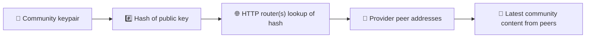
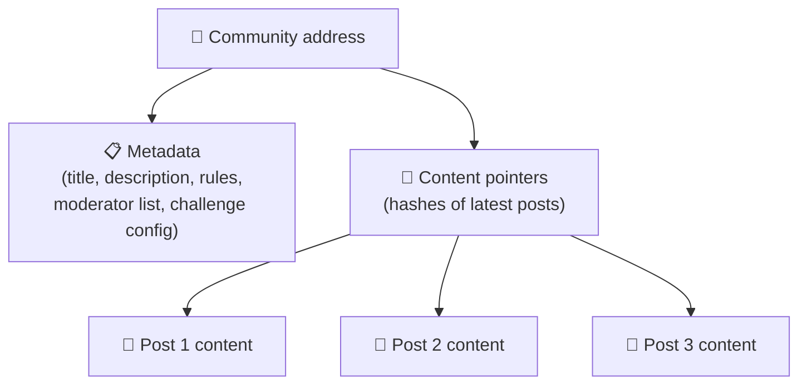
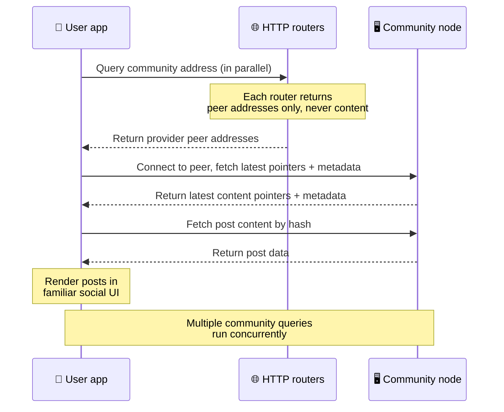
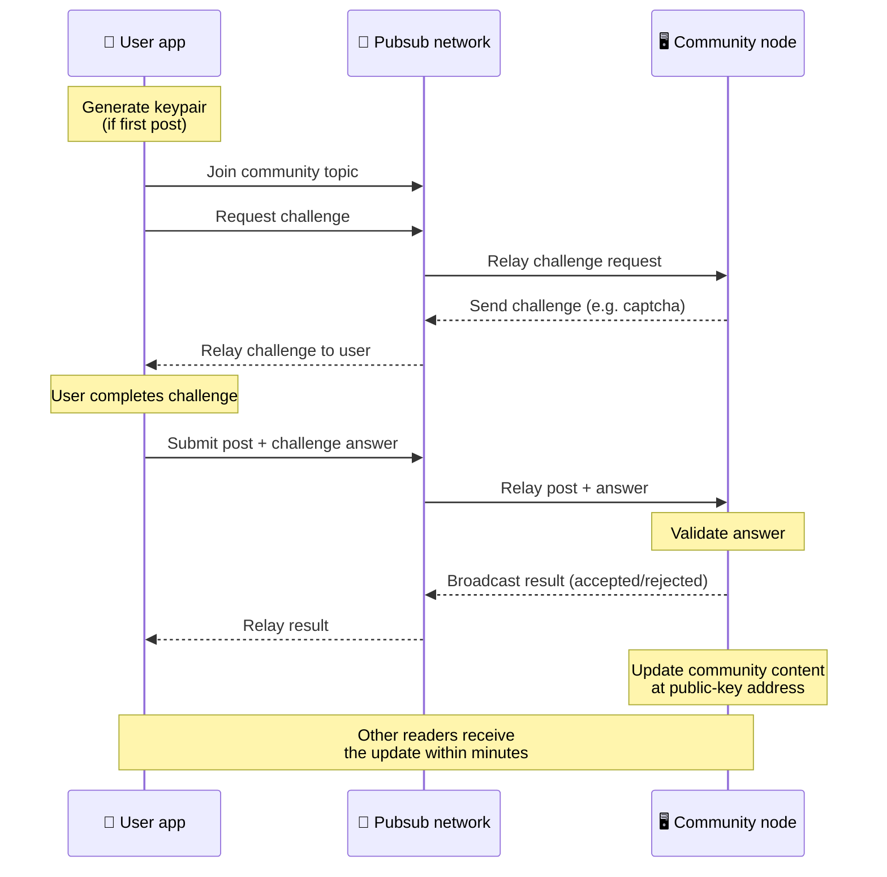
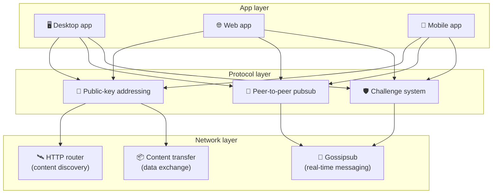

# Peer-to-Peer-Protokoll

Bitsocial verwendet weder eine Blockchain noch einen Föderationsserver oder ein zentrales Backend.
Stattdessen kombiniert es mit dem IPFS/libp2p-Stack zwei Ideen: **Adressierung über öffentliche
Schlüssel** und **Peer-to-Peer-Pubsub**. Zusammen erlauben sie es, eine Community von handelsüblicher
Hardware aus zu betreiben, während Nutzer ohne Konto bei einem firmeneigenen Dienst lesen und
veröffentlichen.

Eine weniger technische Einführung bietet
[Eine vollständige Erklärung des Bitsocial-Protokolls für Laien](./layman-protocol-explanation.md).

## Verwendet Bitsocial IPFS?

Ja. Bitsocial-Nodes nutzen IPFS/libp2p-Primitive für die Peer-to-Peer-Schicht: über öffentliche
Schlüssel adressierte Community-Datensätze, Inhaltsübertragung zwischen Peers und gossipsub-Pubsub
für Echtzeitnachrichten. Wenn in dieser Dokumentation von „Pubsub“ die Rede ist, ist IPFS/libp2p-Pubsub
gemeint und kein separater zentraler Message-Broker.

Das Protokoll beschreibt die Suche derzeit über HTTP-Router, weil Bitsocial-Clients Router-Endpunkte
nach den Adressen anbietender Peers fragen, statt sich für jede Abfrage auf eine für Browser
ungeeignete DHT zu verlassen. Router liefern ausschließlich Peers zurück; Inhaltsübertragung und
Pubsub-Verkehr laufen weiterhin über das Peer-to-Peer-Netzwerk.

## Die zwei Probleme

Ein dezentrales soziales Netzwerk muss zwei Fragen beantworten:

1. **Daten** — wie speichert und liefert man die sozialen Inhalte der ganzen Welt ohne zentrale Datenbank?
2. **Spam** — wie verhindert man Missbrauch, während das Netzwerk frei nutzbar bleibt?

Bitsocial löst das Datenproblem, indem es die Blockchain vollständig weglässt: Soziale Medien
brauchen weder eine globale Transaktionsreihenfolge noch die dauerhafte Verfügbarkeit jedes alten
Beitrags. Das Spam-Problem löst es, indem jede Community ihre eigene Anti-Spam-Challenge über das
Peer-to-Peer-Netzwerk abwickelt.

Zum Erkennungsmodell oberhalb dieser Netzwerkschicht siehe [Inhaltserkennung](./content-discovery.md).

---

## Adressierung über öffentliche Schlüssel {#public-key-based-addressing}

Bei BitTorrent wird der Hash einer Datei zu ihrer Adresse (_inhaltsbasierte Adressierung_). Bitsocial
überträgt diese Idee auf öffentliche Schlüssel: Der Hash des öffentlichen Schlüssels einer Community
wird zu ihrer Netzwerkadresse.

Jeder Peer im Netzwerk kann einen **HTTP-Router** nach dieser Adresse fragen: Der Router antwortet
mit einer Liste von Netzwerkadressen der Peers, die den Hash der Community gerade anbieten, und der
Client verbindet sich direkt mit diesen Peers, um den aktuellen Stand der Community abzurufen. Mit
jeder Aktualisierung des Inhalts erhöht sich dessen Versionsnummer. Das Netzwerk behält nur die
neueste Version — es ist nicht nötig, jeden historischen Zustand aufzubewahren, und genau das macht
diesen Ansatz im Vergleich zu einer Blockchain leichtgewichtig.

> **Was ein HTTP-Router tatsächlich vorhält.** Ein HTTP-Router ist ein schlanker Index. Zu jeder
> Inhaltsadresse, die er kennt, speichert er ausschließlich die Netzwerkadressen der Peers, die sich
> als Anbieter gemeldet haben (IP/Port-Paare, libp2p-Multiaddrs und Ähnliches). Er speichert **nicht**
> die Inhalte der Community, ihre Metadaten, Beitragstexte, Mitgliederlisten oder auch nur die für
> Menschen lesbare Bezeichnung dessen, was unter dieser Adresse liegt; er beantwortet lediglich die
> Frage „welche Peers behaupten, diesen Hash zu haben?“. Das macht Router günstig im Betrieb, leicht
> austauschbar und nicht haftbar für das, was Nutzer veröffentlichen — ähnlich einem
> BitTorrent-Tracker, aber ohne Torrent-Metadaten: Ein Tracker bildet Infohashes auf Peers ab,
> während ein HTTP-Router nur eine Inhaltsadresse auf die Adressen anbietender Peers abbildet.
>
> Zur Redundanz fragt der Client **mehrere HTTP-Router parallel** ab und führt die zurückgelieferten
> Anbieterlisten zusammen. Jeder kann einen Router betreiben, und Router zu ersetzen oder
> hinzuzufügen ist eine Konfigurationsänderung ohne Datenmigration.
>
> Bitsocial nutzt HTTP-Router statt einer DHT, weil der Betrieb einer DHT in der für die Inhaltssuche
> nötigen Größenordnung teuer ist, besonders auf Mobilgeräten. Eine DHT funktioniert außerdem nicht
> im Browser, da Browser einer libp2p-DHT nicht direkt beitreten können. Ein HTTP-Router läuft
> günstig auf gewöhnlicher HTTP-Infrastruktur und funktioniert vom Telefon aus genauso gut wie im
> Browser.

### Was unter der Adresse gespeichert wird

Die Community-Adresse enthält nicht direkt die vollständigen Beitragsinhalte. Stattdessen speichert
sie eine Liste von Content-Identifiern — Hashes, die auf die eigentlichen Daten verweisen. Der Client
holt sich dann jedes einzelne Inhaltsstück direkt von den Peers, die die HTTP-Router zurückgegeben
haben. Die Router selbst sehen oder speichern die Inhalte nie.

Mindestens ein Peer hat die Daten immer: der Node des Community-Betreibers. Ist die Community
beliebt, halten viele weitere Peers sie ebenfalls vor und die Last verteilt sich von selbst — so wie
beliebte Torrents schneller herunterzuladen sind.

---

## Peer-to-Peer-Pubsub

Pubsub (Publish-Subscribe) ist ein Nachrichtenmuster, bei dem Peers ein Topic abonnieren und jede
darin veröffentlichte Nachricht erhalten. Bitsocial nutzt ein Peer-to-Peer-Pubsub-Netzwerk — jeder
kann veröffentlichen, jeder kann abonnieren, und es gibt keinen zentralen Message-Broker.

Um einen Beitrag in einer Community zu veröffentlichen, sendet ein Nutzer eine Nachricht, deren Topic
dem öffentlichen Schlüssel der Community entspricht. Der Node des Community-Betreibers greift sie
auf, validiert sie und nimmt sie — sofern die Anti-Spam-Challenge bestanden ist — in die nächste
Inhaltsaktualisierung auf.

---

## Anti-Spam: Challenges über Pubsub

Ein offenes Pubsub-Netzwerk ist anfällig für Spamfluten. Bitsocial löst das, indem Veröffentlichende
eine **Challenge** bestehen müssen, bevor ihr Inhalt angenommen wird.

Das Challenge-System ist flexibel: Jeder Community-Betreiber konfiguriert seine eigene Richtlinie.
Möglich sind unter anderem:

| Challenge-Typ     | Funktionsweise                                             |
| ----------------- | ---------------------------------------------------------- |
| **Captcha**       | Visuelles oder interaktives Rätsel in der App              |
| **Rate Limiting** | Beiträge pro Zeitfenster und Identität begrenzen           |
| **Token-Gate**    | Nachweis eines Guthabens eines bestimmten Tokens verlangen |
| **Bezahlung**     | Eine kleine Zahlung pro Beitrag verlangen                  |
| **Allowlist**     | Nur vorab freigegebene Identitäten dürfen veröffentlichen  |
| **Eigener Code**  | Jede in Code ausdrückbare Richtlinie                       |

Peers, die zu viele fehlgeschlagene Challenge-Versuche weiterleiten, werden vom Pubsub-Topic
ausgeschlossen. Das verhindert Denial-of-Service-Angriffe auf der Netzwerkschicht.

---

## Lebenszyklus: eine Community lesen

So läuft es ab, wenn ein Nutzer die App öffnet und die neuesten Beiträge einer Community ansieht.

**Schritt für Schritt:**

1. Der Nutzer öffnet die App und sieht eine soziale Oberfläche.
2. Der Client fragt für jede Community, der der Nutzer folgt, mehrere HTTP-Router parallel ab; jeder
   Router liefert nur Peer-Adressen zurück, niemals Inhalte. Die Antwortzeit hängt von den
   Netzwerkbedingungen und der Auslastung der Router ab; unter typischen Bedingungen mit geringer
   Latenz antworten Abfragen oft innerhalb von etwa einer Sekunde und laufen nebenläufig.
3. Sobald der Client Peer-Adressen hat, verbindet er sich mit diesen Peers und ruft die aktuellen
   Inhaltszeiger und Metadaten der Community ab (Titel, Beschreibung, Moderatorenliste,
   Challenge-Konfiguration).
4. Der Client lädt anhand dieser Zeiger die eigentlichen Beitragsinhalte und stellt alles in einer
   vertrauten sozialen Oberfläche dar.

---

## Lebenszyklus: einen Beitrag veröffentlichen

Vor der Annahme eines Beitrags findet über Pubsub ein Challenge-Response-Handshake statt.

**Schritt für Schritt:**

1. Die App erzeugt ein Schlüsselpaar für den Nutzer, falls er noch keines hat.
2. Der Nutzer schreibt einen Beitrag für eine Community.
3. Der Client tritt dem Pubsub-Topic dieser Community bei (abgeleitet vom öffentlichen Schlüssel der
   Community).
4. Der Client fordert über Pubsub eine Challenge an.
5. Der Node des Community-Betreibers schickt eine Challenge zurück (zum Beispiel ein Captcha).
6. Der Nutzer löst die Challenge.
7. Der Client übermittelt den Beitrag zusammen mit der Antwort auf die Challenge über Pubsub.
8. Der Node des Community-Betreibers prüft die Antwort. Ist sie korrekt, wird der Beitrag angenommen.
9. Der Node verbreitet das Ergebnis über Pubsub, damit die Peers im Netzwerk wissen, dass sie
   Nachrichten dieses Nutzers weiterhin weiterleiten sollen.
10. Der Node aktualisiert die Inhalte der Community unter ihrer Public-Key-Adresse.
11. Innerhalb weniger Minuten erhalten alle Leser der Community die Aktualisierung.

---

## Architekturüberblick

Das Gesamtsystem besteht aus drei Schichten, die zusammenspielen:

| Schicht       | Rolle                                                                                                                                                         |
| ------------- | ------------------------------------------------------------------------------------------------------------------------------------------------------------- |
| **App**       | Benutzeroberfläche. Es kann mehrere Apps geben, jede mit eigenem Design, die sich alle dieselben Communities und Identitäten teilen.                          |
| **Protokoll** | Legt fest, wie Communities adressiert werden, wie Beiträge veröffentlicht werden und wie Spam verhindert wird.                                                |
| **Netzwerk**  | Die zugrunde liegende Peer-to-Peer-Infrastruktur: HTTP-Router für die Suche, gossipsub für Echtzeitnachrichten und Inhaltsübertragung für den Datenaustausch. |

---

## Privatsphäre: Autoren von IP-Adressen entkoppeln

Wenn ein Nutzer einen Beitrag veröffentlicht, wird der Inhalt **mit dem öffentlichen Schlüssel des
Community-Betreibers verschlüsselt**, bevor er in das Pubsub-Netzwerk gelangt. Beobachter im Netzwerk
können also zwar sehen, dass ein Peer _etwas_ veröffentlicht hat, aber nicht feststellen:

- was der Inhalt aussagt
- welche Autorenidentität ihn veröffentlicht hat

Das ähnelt BitTorrent, wo sich zwar herausfinden lässt, welche IPs einen Torrent seeden, nicht aber,
wer ihn ursprünglich erstellt hat. Die Verschlüsselungsschicht ergänzt diese Grundlage um eine
zusätzliche Garantie für die Privatsphäre.

---

## Peer-to-Peer im Browser

Browser-P2P ist in Bitsocial-Clients inzwischen möglich. Eine Browser-App kann einen
[Helia](https://helia.io/)-Node betreiben, denselben Bitsocial-Protokoll-Client-Stack wie andere Apps
verwenden und Inhalte von Peers beziehen, statt ein zentrales IPFS-Gateway um Auslieferung zu bitten.
Der Browser kann außerdem direkt am Pubsub teilnehmen, sodass für das Veröffentlichen im Normalfall
kein plattformeigener Pubsub-Anbieter nötig ist.

Das ist der entscheidende Meilenstein für die Verbreitung im Web: Eine gewöhnliche HTTPS-Website kann
sich in einen laufenden sozialen P2P-Client verwandeln. Nutzer müssen keine Desktop-App
installieren, bevor sie aus dem Netzwerk lesen können, und der App-Betreiber muss kein zentrales
Gateway betreiben, das für jeden Browser-Nutzer zum Nadelöhr für Zensur und Moderation wird.

Der Weg über den Browser hat andere Grenzen als ein Desktop- oder Server-Node:

- ein Browser-Node kann in der Regel keine beliebigen eingehenden Verbindungen aus dem öffentlichen
  Internet annehmen
- er kann Daten laden, validieren, zwischenspeichern und veröffentlichen, solange die App geöffnet ist
- er sollte nicht als langlebiger Host für die Daten einer Community betrachtet werden
- das vollständige Hosten einer Community übernimmt weiterhin am besten eine Desktop-App,
  `bitsocial-cli` oder ein anderer dauerhaft laufender Node

HTTP-Router bleiben für die Inhaltssuche wichtig: Sie liefern die Adressen der Anbieter zu einem
Community-Hash. Sie sind keine IPFS-Gateways, denn sie liefern die Inhalte selbst nicht aus. Nach der
Suche verbindet sich der Browser-Client mit Peers und holt die Daten über den P2P-Stack.

Browser-P2P ist inzwischen der Standardweg im Web und kein Experiment hinter einem Schalter. 5chan
läuft unter 5chan.app standardmäßig als reines Browser-P2P, und der Bitsocial-Blog auf bitsocial.net
tut dasselbe. Browser-Peers verbinden sich über sichere WebSockets; `pkc-js` lehnt Verbindungsversuche
über WebRTC und WebTransport standardmäßig ab, weil deren Verbindungsaufbau im Browser langsam und
unzuverlässig ist. Die Upstream-Änderung, die das Veröffentlichen aus dem Browser 2026 praktikabel
gemacht hat, war die Korrektur der gossipsub-Sequenznummern in `@libp2p/gossipsub` 15.0.21, die dafür
sorgte, dass Kubo-Peers Nachrichten von JavaScript-Nodes nicht mehr verwerfen.

Den vollständigen Überblick, auch dazu, was ein Browser-Node weiterhin nicht kann, finden Sie unter
[Peer-to-Peer im Browser](/browser-p2p/).

## Gateway-Fallback {#gateway-fallback}

Gateway-gestützter Zugang über den Browser bleibt als Kompatibilitäts- und Übergangslösung nützlich.
Ein Gateway kann Daten zwischen dem P2P-Netzwerk und einem Browser-Client vermitteln, wenn ein
Browser dem Netzwerk nicht direkt beitreten kann oder die App bewusst den älteren Weg wählt. Diese
Gateways:

- können von jedem betrieben werden
- benötigen keine Nutzerkonten und keine Zahlungen
- erlangen keine Verfügungsgewalt über Identitäten oder Communities der Nutzer
- lassen sich austauschen, ohne dass Daten verloren gehen

Die Zielarchitektur setzt zuerst auf Browser-P2P, mit Gateways als optionalem Fallback statt als
standardmäßigem Engpass.

---

## Warum keine Blockchain?

Blockchains lösen das Double-Spending-Problem: Sie müssen die genaue Reihenfolge jeder Transaktion
kennen, um zu verhindern, dass jemand dieselbe Münze zweimal ausgibt.

Soziale Medien haben kein Double-Spending-Problem. Es spielt keine Rolle, ob Beitrag A eine
Millisekunde vor Beitrag B veröffentlicht wurde, und alte Beiträge müssen nicht dauerhaft auf jedem
Node verfügbar sein.

Weil Bitsocial auf eine Blockchain verzichtet, entfallen:

- **Gas-Gebühren** — das Veröffentlichen ist kostenlos
- **Durchsatzgrenzen** — kein Engpass durch Blockgröße oder Blockzeit
- **aufgeblähter Speicher** — Nodes behalten nur, was sie brauchen
- **Konsens-Overhead** — keine Miner, Validatoren oder Staking nötig

Der Preis dafür ist, dass Bitsocial keine dauerhafte Verfügbarkeit alter Inhalte garantiert. Für
soziale Medien ist das aber ein vertretbarer Kompromiss: Der Node des Community-Betreibers hält die
Daten, beliebte Inhalte verteilen sich über viele Peers, und sehr alte Beiträge verblassen von selbst
— genau wie auf jeder anderen sozialen Plattform.

## Warum keine Föderation?

Föderierte Netzwerke (wie E-Mail oder Plattformen auf ActivityPub-Basis) sind ein Fortschritt
gegenüber der Zentralisierung, haben aber weiterhin strukturelle Grenzen:

- **Serverabhängigkeit** — jede Community braucht einen Server mit Domain, TLS und laufender
  Wartung
- **Vertrauen in Admins** — der Serveradmin hat volle Kontrolle über Nutzerkonten und Inhalte
- **Fragmentierung** — ein Wechsel zwischen Servern bedeutet oft den Verlust von Followern, Verlauf
  oder Identität
- **Kosten** — jemand muss das Hosting bezahlen, und das erzeugt Druck in Richtung Konsolidierung

Der Peer-to-Peer-Ansatz von Bitsocial nimmt den Server vollständig aus der Gleichung. Ein
Community-Node läuft auf einem Laptop, einem Raspberry Pi oder einem günstigen VPS. Der Betreiber
bestimmt die Moderationsrichtlinie, kann aber keine Nutzeridentitäten an sich reißen, denn
Identitäten werden über Schlüsselpaare kontrolliert und nicht vom Server vergeben.

## Was ist mit Nostr?

Nostr passt in keine der beiden Schubladen. Es ist keine Föderation im Stil von ActivityPub, denn
Nutzer bekommen ihre Konten nicht von Instanzen zugeteilt und die Identität hängt nicht an einem
einzelnen Server. Es ist aber auch keine Blockchain-basierte soziale Plattform, denn es gibt weder
Chain noch Konsens, Gas oder globale Transaktionsreihenfolge.

Nostr lässt sich besser als **Relay-basierte soziale Medien** beschreiben. Im Basisprotokoll
([NIP-01](https://github.com/nostr-protocol/nips/blob/master/01.md)) halten Nutzer Schlüsselpaare,
signieren Events und veröffentlichen diese Events an WebSocket-Relays. Clients abonnieren Relays mit
Filtern, holen passende Events ab und prüfen die Signaturen lokal. Nutzer können außerdem
Relay-Listen als Metadaten veröffentlichen
([NIP-65](https://github.com/nostr-protocol/nips/blob/master/65.md)), die Clients mitteilen, an
welche Relays sie üblicherweise schreiben und welche Relays sie zum Lesen von Erwähnungen bevorzugen.

Damit steht Nostr in einem wichtigen Punkt näher an Bitsocial als föderierte oder Blockchain-Systeme:
Die Identität ist kryptografisch und portabel. Der Hauptunterschied liegt in der Datenschicht. Bei
Nostr sind Relays die normale Speicher- und Auslieferungsschicht. Bei Bitsocial helfen HTTP-Router
den Clients lediglich dabei, Peers zu finden. Die Router speichern weder Beiträge noch Profile,
Community-Metadaten oder Moderationszustände; sie geben die Adressen anbietender Peers zurück, und
die Clients holen die Inhalte anschließend von den Peers.

Bei Communities zeigt sich dieselbe Trennung. Nostr kennt optionale Muster für
[Relay-basierte Gruppen](https://github.com/nostr-protocol/nips/blob/master/29.md) und
[von Moderatoren freigegebene Communities](https://github.com/nostr-protocol/nips/blob/master/72.md),
die aber weiterhin von der Relay-Richtlinie, vom relaygehosteten Gruppenzustand oder von
Client-Entscheidungen darüber abhängen, welche Freigaben anerkannt werden. Bitsocial behandelt
Communities als vollwertige kryptografische Objekte, deren Betreiber-Node Beiträge validiert, die
Challenge-Richtlinie der Community durchsetzt und den zuletzt akzeptierten Stand in das
Peer-to-Peer-Netzwerk veröffentlicht.

| Frage                  | Nostr                                                                                     | Bitsocial                                                                     |
| ---------------------- | ----------------------------------------------------------------------------------------- | ----------------------------------------------------------------------------- |
| Kategorie              | Relay-basiertes Protokoll                                                                 | Peer-to-Peer-Community-Netzwerk                                               |
| Identität              | Öffentlicher Schlüssel des Nutzers                                                        | Schlüsselpaare von Nutzern und Communities                                    |
| Datenpfad              | Signierte Events, die an Relays veröffentlicht werden                                     | Public-Key-Adresse löst zu Peers auf; Inhalte werden von Peers geholt         |
| Wer hält es online     | Von Nutzern und Clients gewählte Relays                                                   | Node des Community-Eigentümers plus helfende Seeder                           |
| Communities            | Optionale Relay-basierte Gruppen oder von Moderatoren freigegebene Communities            | Vollwertige Community-Objekte mit betreibergesteuerter Moderation             |
| Anti-Spam              | Relay-Richtlinie, Auth, Bezahlung, Proof-of-Work, Client-Filter oder Moderatorenfreigaben | Von der Community definierte Challenge-Logik vor der Aufnahme                 |
| Wichtigster Kompromiss | Portable Identität, aber relayabhängige Verfügbarkeit und Richtlinien                     | Weniger Relay-Abhängigkeit, aber alte Inhalte sind nicht dauerhaft garantiert |

---

## Zusammenfassung

Bitsocial baut auf zwei Primitiven auf: Adressierung über öffentliche Schlüssel für die Inhaltssuche
und Peer-to-Peer-Pubsub für die Echtzeitkommunikation. Zusammen ergeben sie ein soziales Netzwerk, in
dem:

- Communities durch kryptografische Schlüssel identifiziert werden, nicht durch Domainnamen
- Inhalte sich wie ein Torrent über Peers verbreiten, statt aus einer einzigen Datenbank
  ausgeliefert zu werden
- die Spam-Abwehr lokal in jeder Community geregelt wird, statt von einer Plattform vorgegeben zu sein
- Nutzer ihre Identitäten über Schlüsselpaare besitzen, nicht über widerrufbare Konten
- das ganze System ohne Server, Blockchains oder Plattformgebühren läuft
