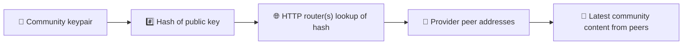
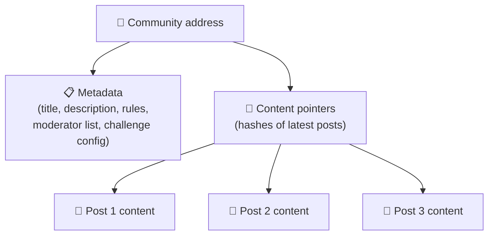
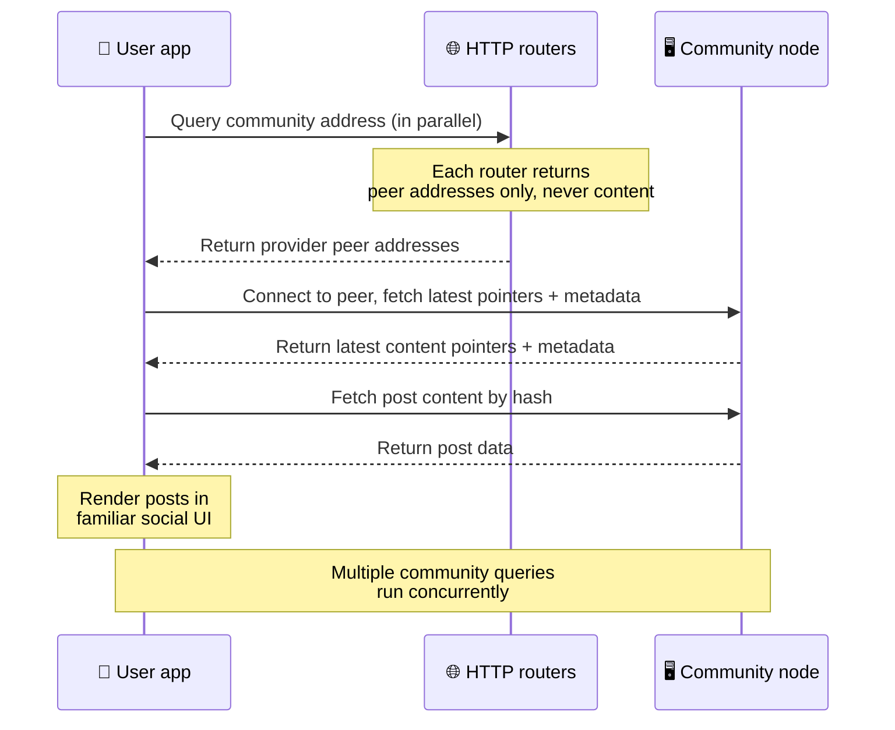
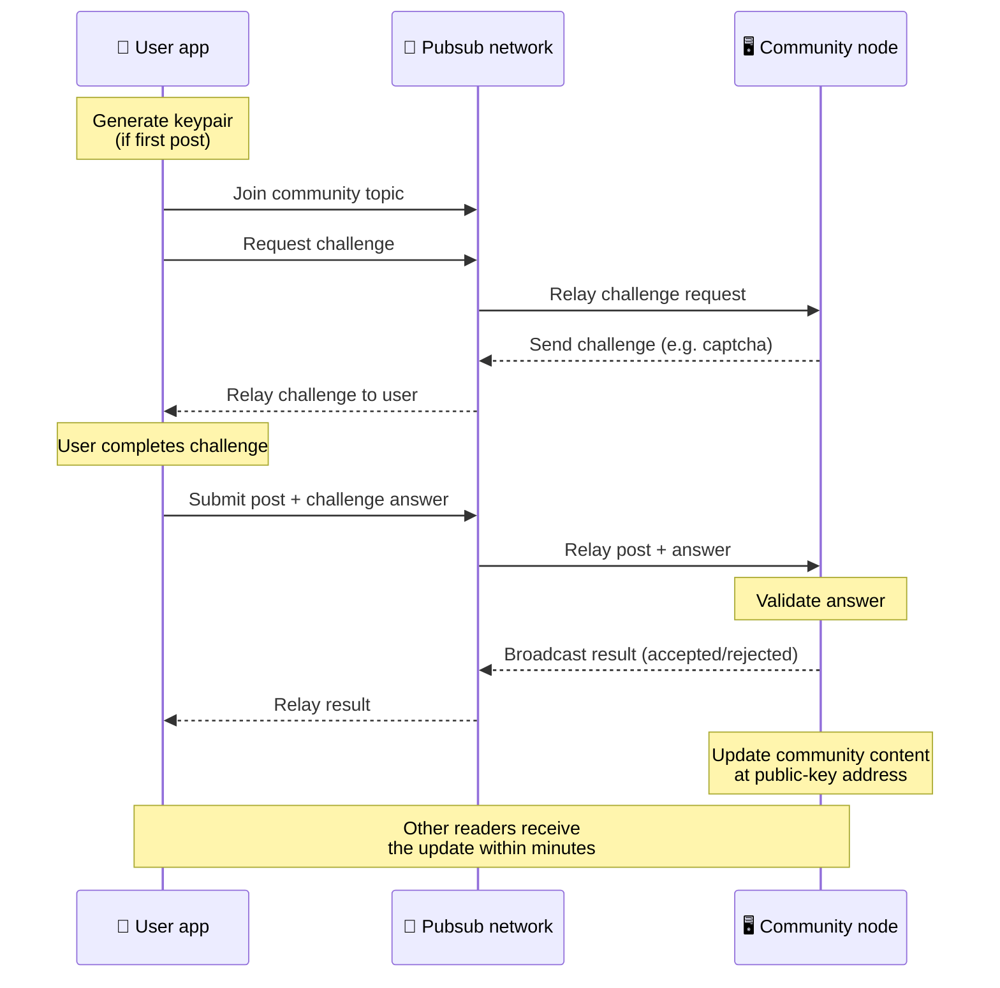
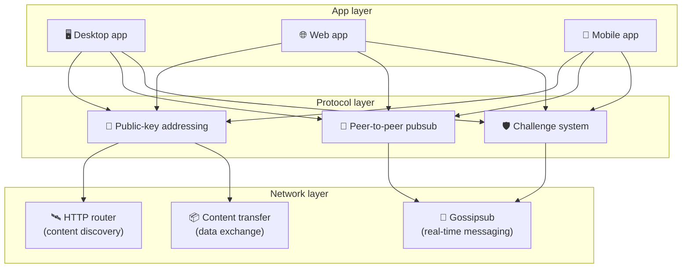

# Πρωτόκολλο Peer-to-Peer

Το Bitsocial δεν χρησιμοποιεί blockchain, διακομιστή ομοσπονδίας ούτε κεντρικό backend. Αντ' αυτού
αξιοποιεί τη στοίβα IPFS/libp2p για να συνδυάσει δύο ιδέες: τη **διευθυνσιοδότηση με βάση δημόσια
κλειδιά** και το **peer-to-peer pubsub**. Μαζί επιτρέπουν σε οποιονδήποτε να φιλοξενεί μια κοινότητα
από απλό οικιακό εξοπλισμό, ενώ οι χρήστες διαβάζουν και δημοσιεύουν χωρίς λογαριασμούς σε καμία
υπηρεσία που ελέγχεται από εταιρεία.

Για μια λιγότερο τεχνική περιγραφή, διαβάστε
[Μια πλήρης εξήγηση του πρωτοκόλλου Bitsocial για μη ειδικούς](./layman-protocol-explanation.md).

## Χρησιμοποιεί το Bitsocial IPFS;

Ναι. Οι κόμβοι Bitsocial χρησιμοποιούν τα βασικά δομικά στοιχεία του IPFS/libp2p για το
peer-to-peer επίπεδο: εγγραφές κοινοτήτων που διευθυνσιοδοτούνται από δημόσια κλειδιά, μεταφορά
περιεχομένου ανάμεσα σε ομότιμους κόμβους και gossipsub pubsub για μηνύματα σε πραγματικό χρόνο.
Όταν αυτή η τεκμηρίωση γράφει «pubsub», εννοεί το pubsub του IPFS/libp2p και όχι κάποιον ξεχωριστό,
κεντρικό διαμεσολαβητή μηνυμάτων.

Το πρωτόκολλο περιγράφει προς το παρόν την ανακάλυψη μέσω δρομολογητών HTTP, επειδή οι πελάτες
Bitsocial ρωτούν τα τελικά σημεία των δρομολογητών για διευθύνσεις κόμβων-παρόχων, αντί να
βασίζονται σε ένα DHT εχθρικό προς το πρόγραμμα περιήγησης για κάθε αναζήτηση. Οι δρομολογητές
επιστρέφουν μόνο κόμβους· η μεταφορά περιεχομένου και η κίνηση pubsub εξακολουθούν να κινούνται μέσα
από το peer-to-peer δίκτυο.

## Τα δύο προβλήματα

Ένα αποκεντρωμένο κοινωνικό δίκτυο πρέπει να απαντήσει σε δύο ερωτήματα:

1. **Δεδομένα** — πώς αποθηκεύεται και διατίθεται το κοινωνικό περιεχόμενο ολόκληρου του κόσμου χωρίς κεντρική βάση δεδομένων;
2. **Spam** — πώς αποτρέπεται η κατάχρηση, ενώ το δίκτυο παραμένει ελεύθερο στη χρήση;

Το Bitsocial λύνει το πρόβλημα των δεδομένων παρακάμπτοντας εντελώς το blockchain: τα κοινωνικά μέσα
δεν χρειάζονται καθολική σειρά συναλλαγών ούτε μόνιμη διαθεσιμότητα κάθε παλιάς ανάρτησης. Λύνει το
πρόβλημα του spam αφήνοντας κάθε κοινότητα να εκτελεί τη δική της πρόκληση κατά του spam πάνω από το
peer-to-peer δίκτυο.

Για το μοντέλο ανακάλυψης πάνω από αυτό το επίπεδο δικτύου, δείτε
[Ανακάλυψη περιεχομένου](./content-discovery.md).

---

## Διευθυνσιοδότηση με βάση δημόσια κλειδιά {#public-key-based-addressing}

Στο BitTorrent, το hash ενός αρχείου γίνεται η διεύθυνσή του (_διευθυνσιοδότηση με βάση το
περιεχόμενο_). Το Bitsocial χρησιμοποιεί μια παρόμοια ιδέα με δημόσια κλειδιά: το hash του δημόσιου
κλειδιού μιας κοινότητας γίνεται η διεύθυνσή της στο δίκτυο.

Οποιοσδήποτε κόμβος του δικτύου μπορεί να ρωτήσει έναν **δρομολογητή HTTP** για αυτή τη διεύθυνση: ο
δρομολογητής απαντά με μια λίστα διευθύνσεων δικτύου των κόμβων που παρέχουν αυτή τη στιγμή το hash
της κοινότητας, και ο πελάτης συνδέεται απευθείας σε αυτούς τους κόμβους για να ανακτήσει την πιο
πρόσφατη κατάσταση της κοινότητας. Κάθε φορά που το περιεχόμενο ενημερώνεται, ο αριθμός έκδοσής του
αυξάνεται. Το δίκτυο κρατά μόνο την πιο πρόσφατη έκδοση — δεν χρειάζεται να διατηρείται κάθε
ιστορική κατάσταση, και αυτό ακριβώς κάνει την προσέγγιση ελαφριά σε σύγκριση με ένα blockchain.

> **Τι κρατά στην πραγματικότητα ένας δρομολογητής HTTP.** Ένας δρομολογητής HTTP είναι ένα λιτό
> ευρετήριο. Για κάθε διεύθυνση περιεχομένου που γνωρίζει, αποθηκεύει μόνο τις διευθύνσεις δικτύου
> των κόμβων που δήλωσαν ότι την παρέχουν (ζεύγη IP/θύρας, libp2p multiaddrs και τα συναφή). **Δεν**
> αποθηκεύει το περιεχόμενο της κοινότητας, τα μεταδεδομένα της, το κείμενο των αναρτήσεων, τη λίστα
> μελών ούτε καν την ευανάγνωστη ονομασία εκείνου που βρίσκεται σε αυτή τη διεύθυνση· απαντά απλώς
> στο ερώτημα «ποιοι κόμβοι ισχυρίζονται ότι έχουν αυτό το hash;». Αυτό κάνει τους δρομολογητές
> φθηνούς στη λειτουργία, εύκολα αντικαταστάσιμους και μη υπεύθυνους για όσα δημοσιεύουν οι χρήστες,
> κάτι ανάλογο με έναν tracker του BitTorrent αλλά χωρίς μεταδεδομένα torrent: ένας tracker
> αντιστοιχίζει infohashes σε κόμβους, ενώ ένας δρομολογητής HTTP αντιστοιχίζει μόνο μια διεύθυνση
> περιεχομένου σε διευθύνσεις κόμβων-παρόχων.
>
> Για πλεονασμό, ο πελάτης ρωτά **αρκετούς δρομολογητές HTTP παράλληλα** και συγχωνεύει τις λίστες
> παρόχων που λαμβάνει πίσω. Οποιοσδήποτε μπορεί να λειτουργήσει έναν δρομολογητή, και η
> αντικατάσταση ή η προσθήκη δρομολογητών είναι απλή αλλαγή ρύθμισης, χωρίς μετάπτωση δεδομένων.
>
> Το Bitsocial χρησιμοποιεί δρομολογητές HTTP αντί για DHT, επειδή η λειτουργία ενός DHT στην
> κλίμακα που απαιτεί η ανακάλυψη περιεχομένου είναι ακριβή, ιδίως για κινητά. Ένα DHT επίσης δεν
> λειτουργεί μέσα στο πρόγραμμα περιήγησης, καθώς τα προγράμματα περιήγησης δεν μπορούν να
> συμμετάσχουν απευθείας σε ένα DHT του libp2p. Ένας δρομολογητής HTTP τρέχει φθηνά πάνω σε κοινή
> υποδομή HTTP και λειτουργεί εξίσου καλά από κινητό ή από πρόγραμμα περιήγησης.

### Τι αποθηκεύεται στη διεύθυνση

Η διεύθυνση της κοινότητας δεν περιέχει απευθείας το πλήρες περιεχόμενο των αναρτήσεων. Αντ' αυτού
αποθηκεύει μια λίστα αναγνωριστικών περιεχομένου — hashes που δείχνουν στα πραγματικά δεδομένα. Ο
πελάτης ανακτά έπειτα κάθε κομμάτι περιεχομένου απευθείας από τους κόμβους που επέστρεψαν οι
δρομολογητές HTTP. Οι ίδιοι οι δρομολογητές δεν βλέπουν ούτε αποθηκεύουν ποτέ το περιεχόμενο.

Τουλάχιστον ένας κόμβος έχει πάντοτε τα δεδομένα: ο κόμβος του διαχειριστή της κοινότητας. Αν η
κοινότητα είναι δημοφιλής, θα τα έχουν και πολλοί άλλοι κόμβοι και το φορτίο κατανέμεται από μόνο
του, όπως ακριβώς τα δημοφιλή torrent κατεβαίνουν πιο γρήγορα.

---

## Peer-to-peer pubsub

Το pubsub (δημοσίευση-συνδρομή) είναι ένα μοτίβο ανταλλαγής μηνυμάτων όπου οι κόμβοι εγγράφονται σε
ένα θέμα και λαμβάνουν κάθε μήνυμα που δημοσιεύεται σε αυτό. Το Bitsocial χρησιμοποιεί ένα
peer-to-peer δίκτυο pubsub — οποιοσδήποτε μπορεί να δημοσιεύσει, οποιοσδήποτε μπορεί να εγγραφεί και
δεν υπάρχει κεντρικός διαμεσολαβητής μηνυμάτων.

Για να δημοσιεύσει μια ανάρτηση σε μια κοινότητα, ο χρήστης στέλνει ένα μήνυμα του οποίου το θέμα
ταυτίζεται με το δημόσιο κλειδί της κοινότητας. Ο κόμβος του διαχειριστή της κοινότητας το
παραλαμβάνει, το επικυρώνει και — αν περάσει την πρόκληση κατά του spam — το συμπεριλαμβάνει στην
επόμενη ενημέρωση περιεχομένου.

---

## Anti-spam: προκλήσεις μέσω pubsub

Ένα ανοιχτό δίκτυο pubsub είναι ευάλωτο σε καταιγισμούς spam. Το Bitsocial το αντιμετωπίζει
απαιτώντας από όσους δημοσιεύουν να ολοκληρώσουν μια **πρόκληση** προτού γίνει δεκτό το περιεχόμενό
τους.

Το σύστημα προκλήσεων είναι ευέλικτο: κάθε διαχειριστής κοινότητας ρυθμίζει τη δική του πολιτική. Οι
επιλογές περιλαμβάνουν:

| Τύπος πρόκλησης            | Πώς λειτουργεί                                              |
| -------------------------- | ----------------------------------------------------------- |
| **Captcha**                | Οπτικός ή διαδραστικός γρίφος που εμφανίζεται στην εφαρμογή |
| **Περιορισμός ρυθμού**     | Όριο αναρτήσεων ανά χρονικό παράθυρο και ανά ταυτότητα      |
| **Πύλη token**             | Απαιτείται απόδειξη υπολοίπου ενός συγκεκριμένου token      |
| **Πληρωμή**                | Απαιτείται μια μικρή πληρωμή ανά ανάρτηση                   |
| **Λίστα επιτρεπόμενων**    | Μόνο προεγκεκριμένες ταυτότητες μπορούν να δημοσιεύουν      |
| **Προσαρμοσμένος κώδικας** | Οποιαδήποτε πολιτική εκφράσιμη σε κώδικα                    |

Οι κόμβοι που αναμεταδίδουν υπερβολικά πολλές αποτυχημένες προσπάθειες πρόκλησης αποκλείονται από το
θέμα pubsub, κάτι που αποτρέπει επιθέσεις άρνησης υπηρεσίας στο επίπεδο δικτύου.

---

## Κύκλος ζωής: ανάγνωση μιας κοινότητας

Να τι συμβαίνει όταν ένας χρήστης ανοίγει την εφαρμογή και βλέπει τις πιο πρόσφατες αναρτήσεις μιας
κοινότητας.

**Βήμα προς βήμα:**

1. Ο χρήστης ανοίγει την εφαρμογή και βλέπει μια κοινωνική διεπαφή.
2. Ο πελάτης ρωτά παράλληλα αρκετούς δρομολογητές HTTP για κάθε κοινότητα που ακολουθεί ο χρήστης·
   κάθε δρομολογητής επιστρέφει μόνο διευθύνσεις κόμβων, ποτέ περιεχόμενο. Ο χρόνος απόκρισης
   εξαρτάται από τις συνθήκες του δικτύου και το φορτίο των δρομολογητών· σε τυπικές συνθήκες
   χαμηλής καθυστέρησης, τα ερωτήματα απαντούν συχνά μέσα σε περίπου ένα δευτερόλεπτο και εκτελούνται
   ταυτόχρονα.
3. Μόλις ο πελάτης έχει διευθύνσεις κόμβων, συνδέεται σε αυτούς και ανακτά τους πιο πρόσφατους
   δείκτες περιεχομένου και τα μεταδεδομένα της κοινότητας (τίτλος, περιγραφή, λίστα συντονιστών,
   ρύθμιση προκλήσεων).
4. Ο πελάτης ανακτά το πραγματικό περιεχόμενο των αναρτήσεων μέσω αυτών των δεικτών και έπειτα τα
   εμφανίζει όλα σε μια οικεία κοινωνική διεπαφή.

---

## Κύκλος ζωής: δημοσίευση μιας ανάρτησης

Η δημοσίευση περιλαμβάνει μια χειραψία πρόκλησης-απόκρισης μέσω pubsub προτού γίνει δεκτή η
ανάρτηση.

**Βήμα προς βήμα:**

1. Η εφαρμογή δημιουργεί ένα ζεύγος κλειδιών για τον χρήστη, αν δεν έχει ήδη.
2. Ο χρήστης γράφει μια ανάρτηση για μια κοινότητα.
3. Ο πελάτης εντάσσεται στο θέμα pubsub εκείνης της κοινότητας (με βάση το δημόσιο κλειδί της).
4. Ο πελάτης ζητά μια πρόκληση μέσω pubsub.
5. Ο κόμβος του διαχειριστή της κοινότητας στέλνει πίσω μια πρόκληση (για παράδειγμα, ένα captcha).
6. Ο χρήστης ολοκληρώνει την πρόκληση.
7. Ο πελάτης υποβάλλει την ανάρτηση μαζί με την απάντηση στην πρόκληση μέσω pubsub.
8. Ο κόμβος του διαχειριστή της κοινότητας επικυρώνει την απάντηση. Αν είναι σωστή, η ανάρτηση
   γίνεται δεκτή.
9. Ο κόμβος μεταδίδει το αποτέλεσμα μέσω pubsub, ώστε οι κόμβοι του δικτύου να γνωρίζουν ότι πρέπει
   να συνεχίσουν να αναμεταδίδουν μηνύματα αυτού του χρήστη.
10. Ο κόμβος ενημερώνει το περιεχόμενο της κοινότητας στη διεύθυνση του δημόσιου κλειδιού της.
11. Μέσα σε λίγα λεπτά, κάθε αναγνώστης της κοινότητας λαμβάνει την ενημέρωση.

---

## Επισκόπηση της αρχιτεκτονικής

Το πλήρες σύστημα έχει τρία επίπεδα που συνεργάζονται:

| Επίπεδο        | Ρόλος                                                                                                                                                                        |
| -------------- | ---------------------------------------------------------------------------------------------------------------------------------------------------------------------------- |
| **Εφαρμογή**   | Η διεπαφή χρήστη. Μπορούν να υπάρχουν πολλές εφαρμογές, καθεμία με τον δικό της σχεδιασμό, που μοιράζονται όλες τις ίδιες κοινότητες και ταυτότητες.                         |
| **Πρωτόκολλο** | Ορίζει πώς διευθυνσιοδοτούνται οι κοινότητες, πώς δημοσιεύονται οι αναρτήσεις και πώς αποτρέπεται το spam.                                                                   |
| **Δίκτυο**     | Η υποκείμενη peer-to-peer υποδομή: δρομολογητές HTTP για την ανακάλυψη, gossipsub για τα μηνύματα σε πραγματικό χρόνο και μεταφορά περιεχομένου για την ανταλλαγή δεδομένων. |

---

## Ιδιωτικότητα: αποσύνδεση των συντακτών από τις διευθύνσεις IP

Όταν ένας χρήστης δημοσιεύει μια ανάρτηση, το περιεχόμενο **κρυπτογραφείται με το δημόσιο κλειδί του
διαχειριστή της κοινότητας** προτού μπει στο δίκτυο pubsub. Αυτό σημαίνει ότι, ενώ όποιος
παρακολουθεί το δίκτυο μπορεί να δει ότι κάποιος κόμβος δημοσίευσε _κάτι_, δεν μπορεί να
προσδιορίσει:

- τι λέει το περιεχόμενο
- ποια ταυτότητα συντάκτη το δημοσίευσε

Κάτι αντίστοιχο συμβαίνει στο BitTorrent, όπου μπορεί κανείς να δει ποιες IP διαμοιράζουν ένα
torrent, αλλά όχι ποιος το δημιούργησε αρχικά. Το επίπεδο κρυπτογράφησης προσθέτει μια επιπλέον
εγγύηση ιδιωτικότητας πάνω σε αυτή τη βάση.

---

## Peer-to-peer στο πρόγραμμα περιήγησης

Το P2P μέσα στο πρόγραμμα περιήγησης είναι πλέον εφικτό στους πελάτες Bitsocial. Μια εφαρμογή στο
πρόγραμμα περιήγησης μπορεί να τρέξει έναν κόμβο [Helia](https://helia.io/), να χρησιμοποιήσει την
ίδια στοίβα πελάτη του πρωτοκόλλου Bitsocial με τις υπόλοιπες εφαρμογές και να ανακτά περιεχόμενο
από κόμβους αντί να ζητά από ένα κεντρικό gateway IPFS να της το σερβίρει. Το πρόγραμμα περιήγησης
μπορεί επίσης να συμμετέχει απευθείας στο pubsub, οπότε η δημοσίευση δεν χρειάζεται πάροχο pubsub
ελεγχόμενο από πλατφόρμα στη συνηθισμένη διαδρομή.

Αυτό είναι το σημαντικό ορόσημο για τη διανομή μέσω web: ένας απλός ιστότοπος HTTPS μπορεί να
ανοίξει σε έναν ζωντανό κοινωνικό πελάτη P2P. Οι χρήστες δεν χρειάζεται να εγκαταστήσουν εφαρμογή
για υπολογιστή για να διαβάσουν από το δίκτυο, και όποιος λειτουργεί την εφαρμογή δεν χρειάζεται να
συντηρεί ένα κεντρικό gateway που καταλήγει να είναι το σημείο ελέγχου για τη λογοκρισία και την
εποπτεία κάθε χρήστη προγράμματος περιήγησης.

Η διαδρομή του προγράμματος περιήγησης έχει διαφορετικά όρια από έναν κόμβο σε υπολογιστή ή
διακομιστή:

- ένας κόμβος στο πρόγραμμα περιήγησης συνήθως δεν μπορεί να δεχτεί αυθαίρετες εισερχόμενες
  συνδέσεις από το δημόσιο διαδίκτυο
- μπορεί να φορτώνει, να επικυρώνει, να αποθηκεύει προσωρινά και να δημοσιεύει δεδομένα όσο η
  εφαρμογή είναι ανοιχτή
- δεν πρέπει να θεωρείται ο μακροχρόνιος φιλοξενητής των δεδομένων μιας κοινότητας
- η πλήρης φιλοξενία μιας κοινότητας εξυπηρετείται ακόμη καλύτερα από μια εφαρμογή υπολογιστή, το
  `bitsocial-cli` ή κάποιον άλλο κόμβο σε συνεχή λειτουργία

Οι δρομολογητές HTTP εξακολουθούν να έχουν σημασία για την ανακάλυψη περιεχομένου: επιστρέφουν
διευθύνσεις παρόχων για το hash μιας κοινότητας. Δεν είναι gateways IPFS, γιατί δεν σερβίρουν οι
ίδιοι το περιεχόμενο. Μετά την ανακάλυψη, ο πελάτης στο πρόγραμμα περιήγησης συνδέεται στους κόμβους
και ανακτά τα δεδομένα μέσα από τη στοίβα P2P.

Το P2P στο πρόγραμμα περιήγησης είναι πλέον η προεπιλεγμένη διαδρομή για το web, όχι πείραμα πίσω
από διακόπτη. Το 5chan τρέχει εξ ορισμού καθαρό P2P στο πρόγραμμα περιήγησης στο 5chan.app, και το
ίδιο κάνει και το blog του Bitsocial στο bitsocial.net. Οι κόμβοι στο πρόγραμμα περιήγησης συνδέονται
μέσω ασφαλών WebSockets· το `pkc-js` απορρίπτει εξ ορισμού τις συνδέσεις WebRTC και WebTransport,
επειδή οι διαδικασίες εγκαθίδρυσης σύνδεσης είναι αργές και αναξιόπιστες στο πρόγραμμα περιήγησης. Η
αλλαγή στο upstream που έκανε πρακτική τη δημοσίευση από το πρόγραμμα περιήγησης το 2026 ήταν η
διόρθωση του αριθμού ακολουθίας του gossipsub στο `@libp2p/gossipsub` 15.0.21, η οποία σταμάτησε
τους κόμβους Kubo να απορρίπτουν μηνύματα δημοσιευμένα από κόμβους JavaScript.

Για την πλήρη εικόνα, μαζί με όσα ένας κόμβος στο πρόγραμμα περιήγησης εξακολουθεί να μην μπορεί να
κάνει, δείτε [Peer-to-Peer στο πρόγραμμα περιήγησης](/browser-p2p/).

## Εφεδρική λύση μέσω gateway {#gateway-fallback}

Η πρόσβαση από το πρόγραμμα περιήγησης μέσω gateway παραμένει χρήσιμη ως εφεδρική λύση συμβατότητας
και σταδιακής μετάβασης. Ένα gateway μπορεί να αναμεταδίδει δεδομένα ανάμεσα στο δίκτυο P2P και σε
έναν πελάτη προγράμματος περιήγησης, όταν το πρόγραμμα περιήγησης δεν μπορεί να συνδεθεί απευθείας
στο δίκτυο ή όταν η εφαρμογή επιλέγει σκόπιμα την παλαιότερη διαδρομή. Αυτά τα gateways:

- μπορούν να λειτουργούν από οποιονδήποτε
- δεν απαιτούν λογαριασμούς χρηστών ή πληρωμές
- δεν αποκτούν κηδεμονία πάνω στις ταυτότητες ή τις κοινότητες των χρηστών
- μπορούν να αντικατασταθούν χωρίς απώλεια δεδομένων

Η αρχιτεκτονική-στόχος βάζει πρώτο το P2P στο πρόγραμμα περιήγησης, με τα gateways ως προαιρετική
εφεδρική λύση και όχι ως προεπιλεγμένο σημείο συμφόρησης.

---

## Γιατί όχι blockchain;

Τα blockchains λύνουν το πρόβλημα της διπλής δαπάνης: χρειάζεται να γνωρίζουν την ακριβή σειρά κάθε
συναλλαγής, ώστε να μην μπορεί κάποιος να ξοδέψει δύο φορές το ίδιο νόμισμα.

Τα κοινωνικά μέσα δεν έχουν πρόβλημα διπλής δαπάνης. Δεν έχει σημασία αν η ανάρτηση Α δημοσιεύτηκε
ένα χιλιοστό του δευτερολέπτου πριν από την ανάρτηση Β, και οι παλιές αναρτήσεις δεν χρειάζεται να
είναι μόνιμα διαθέσιμες σε κάθε κόμβο.

Παρακάμπτοντας το blockchain, το Bitsocial αποφεύγει:

- **τα τέλη gas** — η δημοσίευση είναι δωρεάν
- **τα όρια ρυθμού διεκπεραίωσης** — κανένα σημείο συμφόρησης από το μέγεθος ή τον χρόνο των μπλοκ
- **τη διόγκωση του αποθηκευτικού χώρου** — οι κόμβοι κρατούν μόνο ό,τι χρειάζονται
- **το κόστος της συναίνεσης** — δεν απαιτούνται miners, validators ή staking

Το αντάλλαγμα είναι ότι το Bitsocial δεν εγγυάται μόνιμη διαθεσιμότητα του παλιού περιεχομένου. Για
τα κοινωνικά μέσα, όμως, αυτό είναι αποδεκτό: ο κόμβος του διαχειριστή της κοινότητας κρατά τα
δεδομένα, το δημοφιλές περιεχόμενο εξαπλώνεται σε πολλούς κόμβους και οι πολύ παλιές αναρτήσεις
σβήνουν φυσιολογικά — όπως ακριβώς συμβαίνει σε κάθε κοινωνική πλατφόρμα.

## Γιατί όχι ομοσπονδία;

Τα ομοσπονδιακά δίκτυα (όπως το email ή οι πλατφόρμες που βασίζονται στο ActivityPub) βελτιώνουν τη
συγκεντρωτική προσέγγιση, αλλά εξακολουθούν να έχουν δομικούς περιορισμούς:

- **Εξάρτηση από διακομιστή** — κάθε κοινότητα χρειάζεται έναν διακομιστή με domain, TLS και συνεχή
  συντήρηση
- **Εμπιστοσύνη στον διαχειριστή** — ο διαχειριστής του διακομιστή έχει πλήρη έλεγχο των λογαριασμών
  και του περιεχομένου των χρηστών
- **Διάσπαση** — η μετακίνηση από διακομιστή σε διακομιστή συχνά σημαίνει απώλεια ακολούθων,
  ιστορικού ή ταυτότητας
- **Κόστος** — κάποιος πρέπει να πληρώνει τη φιλοξενία, κάτι που δημιουργεί πίεση προς τη
  συγκέντρωση

Η peer-to-peer προσέγγιση του Bitsocial αφαιρεί εντελώς τον διακομιστή από την εξίσωση. Ένας κόμβος
κοινότητας μπορεί να τρέχει σε φορητό υπολογιστή, σε ένα Raspberry Pi ή σε ένα φθηνό VPS. Ο
διαχειριστής ελέγχει την πολιτική εποπτείας, αλλά δεν μπορεί να κατασχέσει τις ταυτότητες των
χρηστών, επειδή οι ταυτότητες ελέγχονται από ζεύγη κλειδιών και δεν παραχωρούνται από διακομιστή.

## Τι γίνεται με το Nostr;

Το Nostr δεν εντάσσεται καθαρά σε καμία από τις δύο κατηγορίες. Δεν είναι ομοσπονδία τύπου
ActivityPub, επειδή οι χρήστες δεν λαμβάνουν λογαριασμούς από instances και η ταυτότητα δεν δένεται
με έναν διακομιστή. Δεν είναι ούτε κοινωνικό δίκτυο πάνω σε blockchain, επειδή δεν υπάρχει αλυσίδα,
συναίνεση, gas ή καθολική σειρά συναλλαγών.

Το Nostr περιγράφεται καλύτερα ως **κοινωνικό δίκτυο βασισμένο σε relays**. Στο βασικό πρωτόκολλο
([NIP-01](https://github.com/nostr-protocol/nips/blob/master/01.md)), οι χρήστες κρατούν ζεύγη
κλειδιών, υπογράφουν events και τα δημοσιεύουν σε relays WebSocket. Οι πελάτες εγγράφονται σε relays
με φίλτρα, ανακτούν τα events που ταιριάζουν και επαληθεύουν τις υπογραφές τοπικά. Οι χρήστες
μπορούν επίσης να δημοσιεύουν μεταδεδομένα λίστας relays
([NIP-65](https://github.com/nostr-protocol/nips/blob/master/65.md)) που δηλώνουν στους πελάτες σε
ποια relays γράφουν συνήθως και ποια προτιμούν για την ανάγνωση αναφορών.

Αυτό φέρνει το Nostr πιο κοντά στο Bitsocial απ' ό,τι τα ομοσπονδιακά συστήματα ή εκείνα που
βασίζονται σε blockchain, σε ένα σημαντικό σημείο: η ταυτότητα είναι κρυπτογραφική και φορητή. Η
βασική διαφορά βρίσκεται στο επίπεδο δεδομένων. Στο Nostr, τα relays είναι το κανονικό επίπεδο
αποθήκευσης και παράδοσης. Στο Bitsocial, οι δρομολογητές HTTP βοηθούν μόνο τους πελάτες να βρουν
κόμβους. Οι δρομολογητές δεν αποθηκεύουν αναρτήσεις, προφίλ, μεταδεδομένα κοινοτήτων ή κατάσταση
εποπτείας· επιστρέφουν διευθύνσεις κόμβων-παρόχων και έπειτα οι πελάτες ανακτούν το περιεχόμενο από
τους κόμβους.

Το ίδιο μοτίβο εμφανίζεται και στις κοινότητες. Το Nostr έχει προαιρετικά σχήματα για
[ομάδες βασισμένες σε relays](https://github.com/nostr-protocol/nips/blob/master/29.md) και
[κοινότητες με έγκριση συντονιστών](https://github.com/nostr-protocol/nips/blob/master/72.md), αλλά
εξακολουθούν να εξαρτώνται από την πολιτική των relays, από κατάσταση ομάδας που φιλοξενείται σε
relay ή από τις επιλογές του κάθε πελάτη για το ποιες εγκρίσεις θα τιμήσει. Το Bitsocial αντιμετωπίζει
τις κοινότητες ως κρυπτογραφικά αντικείμενα πρώτης τάξης, των οποίων ο κόμβος του διαχειριστή
επικυρώνει τις αναρτήσεις, εφαρμόζει την πολιτική προκλήσεων της κοινότητας και δημοσιεύει την πιο
πρόσφατη αποδεκτή κατάσταση στο peer-to-peer δίκτυο.

| Ερώτημα               | Nostr                                                                               | Bitsocial                                                                             |
| --------------------- | ----------------------------------------------------------------------------------- | ------------------------------------------------------------------------------------- |
| Κατηγορία             | Πρωτόκολλο βασισμένο σε relays                                                      | Peer-to-peer δίκτυο κοινοτήτων                                                        |
| Ταυτότητα             | Δημόσιο κλειδί χρήστη                                                               | Ζεύγη κλειδιών χρηστών και κοινοτήτων                                                 |
| Διαδρομή δεδομένων    | Υπογεγραμμένα events που δημοσιεύονται σε relays                                    | Η διεύθυνση δημόσιου κλειδιού οδηγεί σε κόμβους· το περιεχόμενο ανακτάται από αυτούς  |
| Ποιος το κρατά online | Relays που επιλέγουν οι χρήστες και οι πελάτες                                      | Ο κόμβος του ιδιοκτήτη της κοινότητας και βοηθητικοί seeders                          |
| Κοινότητες            | Προαιρετικές ομάδες σε relays ή κοινότητες με έγκριση συντονιστών                   | Κοινότητες ως αντικείμενα πρώτης τάξης, με εποπτεία που ελέγχει ο διαχειριστής        |
| Anti-spam             | Πολιτική relay, auth, πληρωμή, proof-of-work, φίλτρα πελάτη ή εγκρίσεις συντονιστών | Λογική προκλήσεων ορισμένη από την κοινότητα πριν από την ένταξη                      |
| Βασικό αντάλλαγμα     | Φορητή ταυτότητα, αλλά διαθεσιμότητα και πολιτική εξαρτημένες από τα relays         | Λιγότερη εξάρτηση από relays, αλλά το παλιό περιεχόμενο δεν είναι εγγυημένο για πάντα |

---

## Σύνοψη

Το Bitsocial στηρίζεται σε δύο θεμελιώδη στοιχεία: τη διευθυνσιοδότηση με βάση δημόσια κλειδιά για
την ανακάλυψη περιεχομένου και το peer-to-peer pubsub για την επικοινωνία σε πραγματικό χρόνο. Μαζί
παράγουν ένα κοινωνικό δίκτυο όπου:

- οι κοινότητες αναγνωρίζονται από κρυπτογραφικά κλειδιά, όχι από ονόματα domain
- το περιεχόμενο εξαπλώνεται από κόμβο σε κόμβο σαν torrent, αντί να σερβίρεται από μία βάση
  δεδομένων
- η αντίσταση στο spam ορίζεται τοπικά σε κάθε κοινότητα, αντί να επιβάλλεται από μια πλατφόρμα
- οι χρήστες κατέχουν τις ταυτότητές τους μέσω ζευγών κλειδιών, όχι μέσω ανακλητών λογαριασμών
- ολόκληρο το σύστημα λειτουργεί χωρίς διακομιστές, blockchains ή τέλη πλατφόρμας
