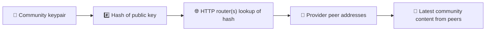
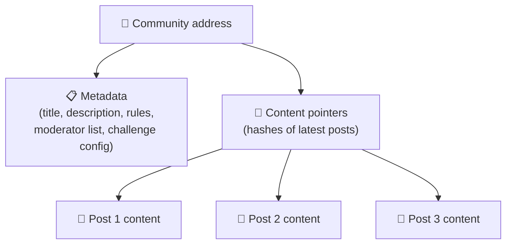
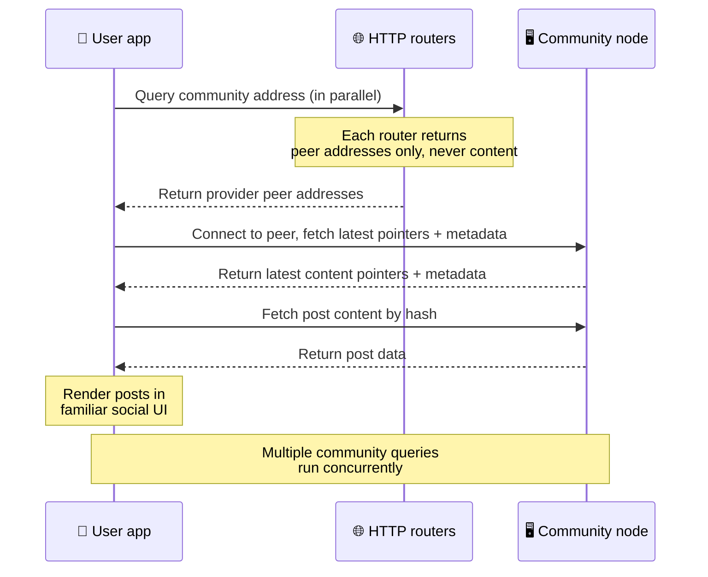
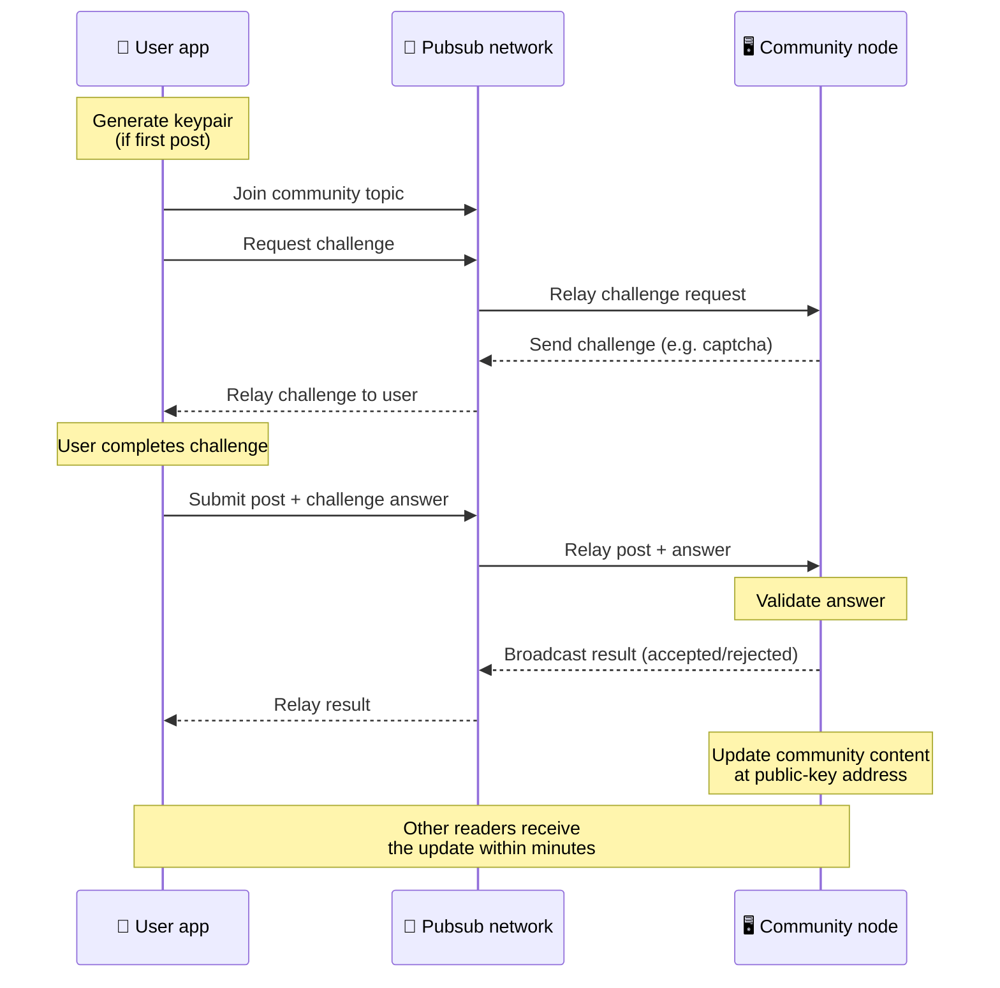
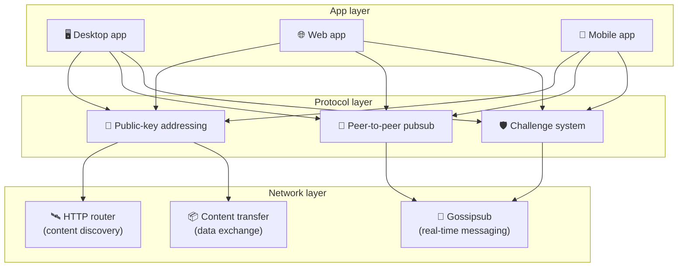

# Protocolo peer-to-peer

Bitsocial no usa una blockchain, ni un servidor de federación, ni un backend centralizado. En su
lugar usa la pila IPFS/libp2p para combinar dos ideas: **direccionamiento basado en claves
públicas** y **pubsub peer-to-peer**. Juntas permiten que cualquiera aloje una comunidad desde
hardware doméstico mientras los usuarios leen y publican sin cuentas en ningún servicio controlado
por una empresa.

Para un recorrido menos técnico, lee
[Una explicación completa y sencilla del protocolo Bitsocial](./layman-protocol-explanation.md).

## ¿Bitsocial usa IPFS?

Sí. Los nodos de Bitsocial usan primitivas de IPFS/libp2p para la capa peer-to-peer: registros de
comunidad direccionados por clave pública, transferencia de contenido entre pares y pubsub de
gossipsub para los mensajes en tiempo real. Cuando esta documentación dice «pubsub» se refiere al
pubsub de IPFS/libp2p, no a un broker de mensajes centralizado aparte.

Actualmente el protocolo describe el descubrimiento a través de enrutadores HTTP porque los
clientes de Bitsocial consultan los endpoints de los enrutadores para obtener las direcciones de
los pares proveedores, en lugar de depender de una DHT poco compatible con el navegador en cada
búsqueda. Los enrutadores solo devuelven pares; la transferencia de contenido y el tráfico de
pubsub siguen circulando por la red peer-to-peer.

## Los dos problemas

Una red social descentralizada tiene que responder a dos preguntas:

1. **Datos** — ¿cómo se almacena y se sirve el contenido social de todo el mundo sin una base de
   datos central?
2. **Spam** — ¿cómo se evita el abuso manteniendo el uso de la red gratuito?

Bitsocial resuelve el problema de los datos prescindiendo por completo de la blockchain: las redes
sociales no necesitan un orden global de transacciones ni la disponibilidad permanente de cada
publicación antigua. Resuelve el problema del spam dejando que cada comunidad ejecute su propio
desafío antispam sobre la red peer-to-peer.

Para conocer el modelo de descubrimiento que se sitúa por encima de esta capa de red, consulta
[Descubrimiento de contenido](./content-discovery.md).

---

## Direccionamiento basado en claves públicas {#public-key-based-addressing}

En BitTorrent, el hash de un archivo se convierte en su dirección (_direccionamiento basado en
contenido_). Bitsocial usa una idea parecida con las claves públicas: el hash de la clave pública
de una comunidad se convierte en su dirección de red.

Cualquier par de la red puede consultar esa dirección a un **enrutador HTTP**: el enrutador
responde con una lista de direcciones de red de los pares que en ese momento proporcionan el hash
de la comunidad, y el cliente se conecta directamente a esos pares para obtener el último estado de
la comunidad. Cada vez que el contenido se actualiza, su número de versión aumenta. La red solo
conserva la última versión — no hace falta preservar todos los estados históricos, y eso es lo que
hace que este enfoque sea ligero en comparación con una blockchain.

> **Qué guarda realmente un enrutador HTTP.** Un enrutador HTTP es un índice ligero. Para cada
> dirección de contenido que conoce almacena únicamente las direcciones de red de los pares que se
> anunciaron como proveedores (pares IP/puerto, multiaddrs de libp2p y cosas por el estilo). **No**
> almacena el contenido de la comunidad, ni sus metadatos, ni el texto de las publicaciones, ni la
> lista de miembros, ni siquiera la etiqueta legible de lo que hay en esa dirección; solo responde
> a la pregunta «¿qué pares dicen tener este hash?». Esto hace que los enrutadores sean baratos de
> operar, fáciles de sustituir y no responsables de lo que publican los usuarios, algo parecido a
> un tracker de BitTorrent pero sin metadatos de torrent: un tracker asocia infohashes con pares,
> mientras que un enrutador HTTP solo asocia una dirección de contenido con direcciones de pares
> proveedores.
>
> Para tener redundancia, el cliente consulta **varios enrutadores HTTP en paralelo** y fusiona las
> listas de proveedores que recibe. Cualquiera puede operar un enrutador, y sustituir o añadir
> enrutadores es un cambio de configuración sin migración de datos.
>
> Bitsocial usa enrutadores HTTP en lugar de una DHT porque mantener una DHT a la escala que exige
> el descubrimiento de contenido resulta caro, sobre todo en móvil. Una DHT tampoco funciona en el
> navegador, ya que los navegadores no pueden unirse directamente a una DHT de libp2p. Un enrutador
> HTTP se ejecuta de forma barata sobre infraestructura HTTP común y funciona igual de bien desde
> un teléfono que desde un navegador.

### Qué se almacena en la dirección

La dirección de la comunidad no contiene directamente el contenido completo de las publicaciones.
En su lugar almacena una lista de identificadores de contenido: hashes que apuntan a los datos
reales. Después el cliente obtiene cada fragmento de contenido directamente de los pares que
devolvieron los enrutadores HTTP. Los propios enrutadores nunca ven ni almacenan el contenido.

Siempre hay al menos un par que tiene los datos: el nodo del operador de la comunidad. Si la
comunidad es popular, muchos otros pares también los tendrán y la carga se reparte sola, igual que
los torrents populares se descargan más rápido.

---

## Pubsub peer-to-peer

El pubsub (publicación-suscripción) es un patrón de mensajería en el que los pares se suscriben a
un tema y reciben todos los mensajes publicados en ese tema. Bitsocial usa una red pubsub
peer-to-peer: cualquiera puede publicar, cualquiera puede suscribirse y no hay ningún broker de
mensajes central.

Para publicar una entrada en una comunidad, un usuario publica un mensaje cuyo tema es igual a la
clave pública de la comunidad. El nodo del operador de la comunidad lo recoge, lo valida y, si
supera el desafío antispam, lo incluye en la siguiente actualización de contenido.

---

## Antispam: desafíos sobre pubsub

Una red pubsub abierta es vulnerable a avalanchas de spam. Bitsocial lo resuelve exigiendo que
quien publica complete un **desafío** antes de que se acepte su contenido.

El sistema de desafíos es flexible: cada operador de comunidad configura su propia política. Entre
las opciones están:

| Tipo de desafío          | Cómo funciona                                               |
| ------------------------ | ----------------------------------------------------------- |
| **Captcha**              | Puzle visual o interactivo presentado en la aplicación      |
| **Límite de frecuencia** | Limitar las publicaciones por ventana de tiempo e identidad |
| **Acceso por token**     | Exigir la prueba del saldo de un token concreto             |
| **Pago**                 | Exigir un pequeño pago por publicación                      |
| **Lista de permitidos**  | Solo pueden publicar las identidades aprobadas de antemano  |
| **Código propio**        | Cualquier política que se pueda expresar en código          |

Los pares que retransmiten demasiados intentos fallidos de desafío quedan bloqueados del tema de
pubsub, lo que evita ataques de denegación de servicio en la capa de red.

---

## Ciclo de vida: leer una comunidad

Esto es lo que ocurre cuando un usuario abre la aplicación y ve las últimas publicaciones de una
comunidad.

**Paso a paso:**

1. El usuario abre la aplicación y ve una interfaz social.
2. El cliente consulta varios enrutadores HTTP en paralelo para cada comunidad que sigue el
   usuario; cada enrutador devuelve solo direcciones de pares, nunca contenido. La latencia de la
   consulta depende de las condiciones de la red y de la carga del enrutador; en condiciones
   típicas de baja latencia, las consultas suelen responder en alrededor de un segundo y se
   ejecutan de forma concurrente.
3. Una vez que el cliente tiene direcciones de pares, se conecta a esos pares y obtiene los últimos
   punteros de contenido y los metadatos de la comunidad (título, descripción, lista de
   moderadores, configuración del desafío).
4. El cliente obtiene el contenido real de las publicaciones mediante esos punteros y después lo
   muestra todo en una interfaz social familiar.

---

## Ciclo de vida: publicar una entrada

Publicar implica un intercambio de desafío-respuesta sobre pubsub antes de que se acepte la
publicación.

**Paso a paso:**

1. La aplicación genera un par de claves para el usuario si todavía no tiene uno.
2. El usuario escribe una publicación para una comunidad.
3. El cliente se une al tema de pubsub de esa comunidad (vinculado a la clave pública de la
   comunidad).
4. El cliente solicita un desafío por pubsub.
5. El nodo del operador de la comunidad devuelve un desafío (por ejemplo, un captcha).
6. El usuario completa el desafío.
7. El cliente envía la publicación junto con la respuesta al desafío por pubsub.
8. El nodo del operador de la comunidad valida la respuesta. Si es correcta, la publicación se
   acepta.
9. El nodo difunde el resultado por pubsub para que los pares de la red sepan que deben seguir
   retransmitiendo los mensajes de este usuario.
10. El nodo actualiza el contenido de la comunidad en su dirección de clave pública.
11. En unos minutos, todos los lectores de la comunidad reciben la actualización.

---

## Visión general de la arquitectura

El sistema completo tiene tres capas que funcionan juntas:

| Capa           | Función                                                                                                                                                                                     |
| -------------- | ------------------------------------------------------------------------------------------------------------------------------------------------------------------------------------------- |
| **Aplicación** | Interfaz de usuario. Pueden existir varias aplicaciones, cada una con su propio diseño, y todas comparten las mismas comunidades e identidades.                                             |
| **Protocolo**  | Define cómo se direccionan las comunidades, cómo se publican las entradas y cómo se evita el spam.                                                                                          |
| **Red**        | La infraestructura peer-to-peer subyacente: enrutadores HTTP para el descubrimiento, gossipsub para la mensajería en tiempo real y transferencia de contenido para el intercambio de datos. |

---

## Privacidad: desvincular a los autores de las direcciones IP

Cuando un usuario publica una entrada, el contenido se **cifra con la clave pública del operador de
la comunidad** antes de entrar en la red pubsub. Esto significa que, aunque quien observa la red
puede ver que un par publicó _algo_, no puede determinar:

- qué dice el contenido
- qué identidad de autor lo publicó

Es parecido a cómo BitTorrent permite descubrir qué IP siembran un torrent, pero no quién lo creó
originalmente. La capa de cifrado añade una garantía de privacidad adicional sobre esa base.

---

## Peer-to-peer en el navegador

El P2P en el navegador ya es posible en los clientes de Bitsocial. Una aplicación de navegador
puede ejecutar un nodo [Helia](https://helia.io/), usar la misma pila de cliente del protocolo
Bitsocial que las demás aplicaciones y obtener el contenido de los pares en lugar de pedir a una
gateway centralizada de IPFS que lo sirva. El navegador también puede participar directamente en el
pubsub, así que publicar no necesita un proveedor de pubsub propiedad de una plataforma en el flujo
normal.

Este es el hito importante para la distribución web: un sitio web HTTPS normal puede abrirse como
un cliente social P2P en vivo. Los usuarios no necesitan instalar una aplicación de escritorio
antes de poder leer de la red, y el operador de la aplicación no necesita mantener una gateway
central que se convierta en el cuello de botella de censura o moderación de todos los usuarios de
navegador.

El camino del navegador tiene límites distintos a los de un nodo de escritorio o de servidor:

- normalmente un nodo de navegador no puede aceptar conexiones entrantes arbitrarias desde la
  internet pública
- puede cargar, validar, cachear y publicar datos mientras la aplicación está abierta
- no debería tratarse como el alojamiento duradero de los datos de una comunidad
- el alojamiento completo de una comunidad sigue estando mejor atendido por una aplicación de
  escritorio, `bitsocial-cli` u otro nodo siempre activo

Los enrutadores HTTP siguen siendo importantes para el descubrimiento de contenido: devuelven las
direcciones de los proveedores del hash de una comunidad. No son gateways de IPFS, porque no sirven
el contenido en sí. Tras el descubrimiento, el cliente del navegador se conecta a los pares y
obtiene los datos a través de la pila P2P.

El P2P en el navegador ya es el camino web por defecto, no un experimento detrás de un interruptor.
5chan funciona por defecto con P2P puro en el navegador en 5chan.app, y el blog de Bitsocial en
bitsocial.net hace lo mismo. Los pares de navegador se conectan mediante WebSockets seguros;
`pkc-js` rechaza por defecto las conexiones WebRTC y WebTransport porque sus rutas de
establecimiento de conexión son lentas y poco fiables en el navegador. El cambio upstream que hizo
práctica la publicación desde el navegador en 2026 fue la corrección del número de secuencia de
gossipsub en `@libp2p/gossipsub` 15.0.21, que dejó de provocar que los pares de Kubo descartaran
los mensajes publicados por nodos de JavaScript.

Para tener el panorama completo, incluido lo que un nodo de navegador todavía no puede hacer,
consulta [Peer-to-peer en el navegador](/browser-p2p/).

## Respaldo mediante gateway {#gateway-fallback}

El acceso desde el navegador a través de una gateway sigue siendo útil como respaldo de
compatibilidad y de despliegue progresivo. Una gateway puede retransmitir datos entre la red P2P y
un cliente de navegador cuando el navegador no puede unirse directamente a la red o cuando la
aplicación elige a propósito el camino antiguo. Estas gateways:

- puede operarlas cualquiera
- no requieren cuentas de usuario ni pagos
- no obtienen la custodia de las identidades ni de las comunidades de los usuarios
- se pueden sustituir sin perder datos

La arquitectura objetivo es P2P en el navegador primero, con las gateways como respaldo opcional en
lugar de como cuello de botella por defecto.

---

## ¿Por qué no una blockchain?

Las blockchains resuelven el problema del doble gasto: necesitan conocer el orden exacto de cada
transacción para impedir que alguien gaste dos veces la misma moneda.

Las redes sociales no tienen un problema de doble gasto. Da igual que la publicación A se publicara
un milisegundo antes que la publicación B, y las publicaciones antiguas no necesitan estar
disponibles de forma permanente en todos los nodos.

Al prescindir de la blockchain, Bitsocial evita:

- **las comisiones de gas** — publicar es gratis
- **los límites de rendimiento** — sin cuellos de botella de tamaño de bloque ni de tiempo de
  bloque
- **el crecimiento del almacenamiento** — los nodos solo conservan lo que necesitan
- **la sobrecarga del consenso** — no hacen falta mineros, validadores ni staking

La contrapartida es que Bitsocial no garantiza la disponibilidad permanente del contenido antiguo.
Pero para las redes sociales es una contrapartida aceptable: el nodo del operador de la comunidad
conserva los datos, el contenido popular se reparte entre muchos pares y las publicaciones muy
antiguas se apagan de forma natural, igual que ocurre en cualquier plataforma social.

## ¿Por qué no la federación?

Las redes federadas (como el correo electrónico o las plataformas basadas en ActivityPub) mejoran
la centralización, pero siguen teniendo limitaciones estructurales:

- **Dependencia del servidor** — cada comunidad necesita un servidor con dominio, TLS y
  mantenimiento continuo
- **Confianza en el administrador** — el administrador del servidor tiene control total sobre las
  cuentas de usuario y el contenido
- **Fragmentación** — cambiar de servidor suele implicar perder seguidores, historial o identidad
- **Coste** — alguien tiene que pagar el alojamiento, lo que genera presión hacia la consolidación

El enfoque peer-to-peer de Bitsocial elimina el servidor de la ecuación por completo. Un nodo de
comunidad puede ejecutarse en un portátil, en una Raspberry Pi o en un VPS barato. El operador
controla la política de moderación, pero no puede apropiarse de las identidades de los usuarios,
porque las identidades las controla un par de claves y no las concede un servidor.

## ¿Y Nostr?

Nostr no encaja del todo en ninguna de las dos categorías. No es federación al estilo de
ActivityPub, porque las instancias no emiten cuentas a los usuarios y la identidad no está atada a
un servidor. Tampoco es una red social sobre blockchain, porque no hay cadena, ni consenso, ni gas,
ni un orden global de transacciones.

Nostr se describe mejor como **red social basada en relés**. En el protocolo base
([NIP-01](https://github.com/nostr-protocol/nips/blob/master/01.md)), los usuarios tienen pares de
claves, firman eventos y publican esos eventos en relés de WebSocket. Los clientes se suscriben a
los relés con filtros, obtienen los eventos que coinciden y verifican las firmas localmente. Los
usuarios también pueden publicar metadatos de lista de relés
([NIP-65](https://github.com/nostr-protocol/nips/blob/master/65.md)) que indican a los clientes en
qué relés escriben normalmente y qué relés prefieren para leer menciones.

Eso sitúa a Nostr más cerca de Bitsocial que los sistemas federados o basados en blockchain en un
aspecto importante: la identidad es criptográfica y portátil. La diferencia principal está en la
capa de datos. En Nostr, los relés son la capa habitual de almacenamiento y entrega. En Bitsocial,
los enrutadores HTTP solo ayudan a los clientes a encontrar pares. Los enrutadores no almacenan
publicaciones, perfiles, metadatos de comunidad ni estado de moderación; devuelven direcciones de
pares proveedores y después los clientes obtienen el contenido de esos pares.

Con las comunidades ocurre lo mismo. Nostr tiene patrones opcionales para
[grupos basados en relés](https://github.com/nostr-protocol/nips/blob/master/29.md) y
[comunidades aprobadas por moderadores](https://github.com/nostr-protocol/nips/blob/master/72.md),
pero siguen dependiendo de la política del relé, del estado del grupo alojado en el relé o de las
decisiones del cliente sobre qué aprobaciones respetar. Bitsocial trata las comunidades como
objetos criptográficos de primera clase cuyo nodo operador valida las publicaciones, ejecuta la
política de desafíos de la comunidad y publica el último estado aceptado en la red peer-to-peer.

| Pregunta                     | Nostr                                                                                                        | Bitsocial                                                                              |
| ---------------------------- | ------------------------------------------------------------------------------------------------------------ | -------------------------------------------------------------------------------------- |
| Categoría                    | Protocolo basado en relés                                                                                    | Red comunitaria peer-to-peer                                                           |
| Identidad                    | Clave pública del usuario                                                                                    | Pares de claves de usuario y de comunidad                                              |
| Ruta de los datos            | Eventos firmados publicados en relés                                                                         | La dirección de clave pública resuelve a pares; el contenido se obtiene de los pares   |
| Quién lo mantiene disponible | Relés elegidos por los usuarios y los clientes                                                               | El nodo del propietario de la comunidad más seeders auxiliares                         |
| Comunidades                  | Grupos opcionales basados en relés o comunidades aprobadas por moderadores                                   | Objetos de comunidad de primera clase con moderación controlada por el operador        |
| Antispam                     | Política del relé, autenticación, pago, prueba de trabajo, filtros del cliente o aprobaciones de moderadores | Lógica de desafío definida por la comunidad antes de la inclusión                      |
| Contrapartida principal      | Identidad portátil, pero disponibilidad y política dependientes de los relés                                 | Menos dependencia de relés, pero el contenido antiguo no está garantizado para siempre |

---

## Resumen

Bitsocial se apoya en dos primitivas: el direccionamiento basado en claves públicas para el
descubrimiento de contenido y el pubsub peer-to-peer para la comunicación en tiempo real. Juntas
producen una red social donde:

- las comunidades se identifican mediante claves criptográficas, no mediante nombres de dominio
- el contenido se reparte entre pares como un torrent, en lugar de servirse desde una única base de
  datos
- la resistencia al spam es local a cada comunidad, no la impone una plataforma
- los usuarios son dueños de su identidad mediante pares de claves, no mediante cuentas revocables
- todo el sistema funciona sin servidores, sin blockchains y sin comisiones de plataforma
