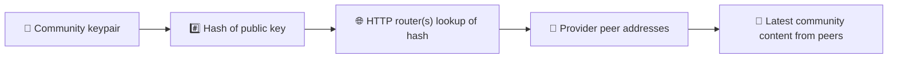
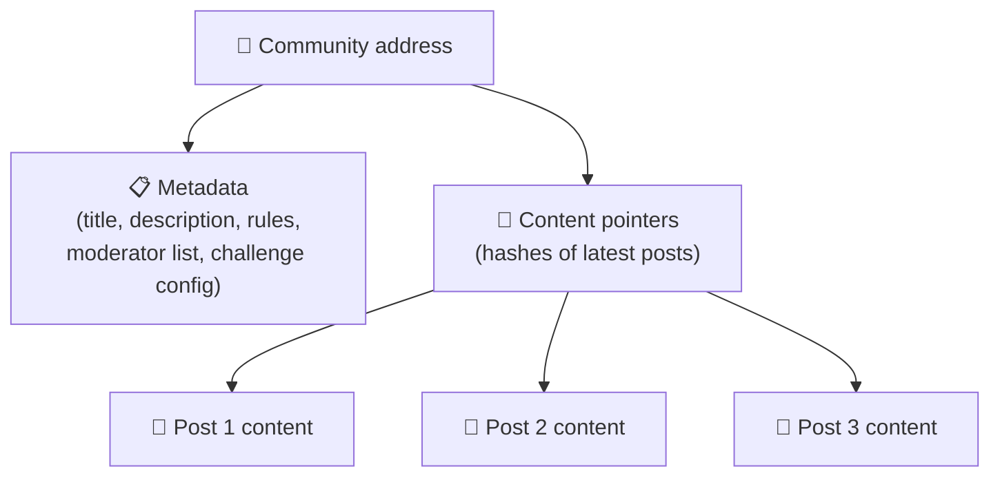
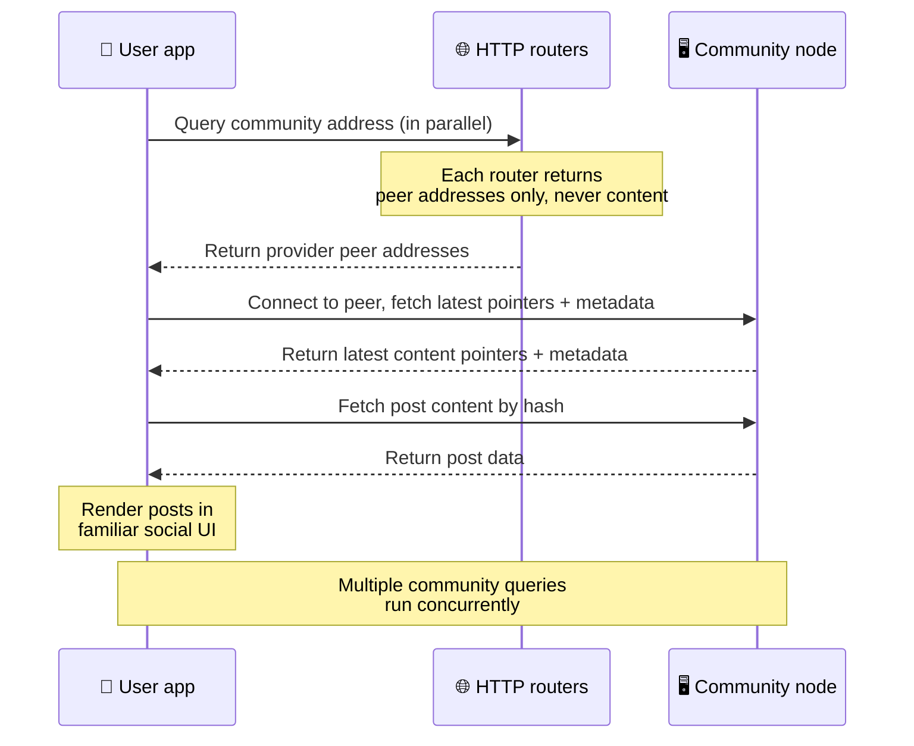
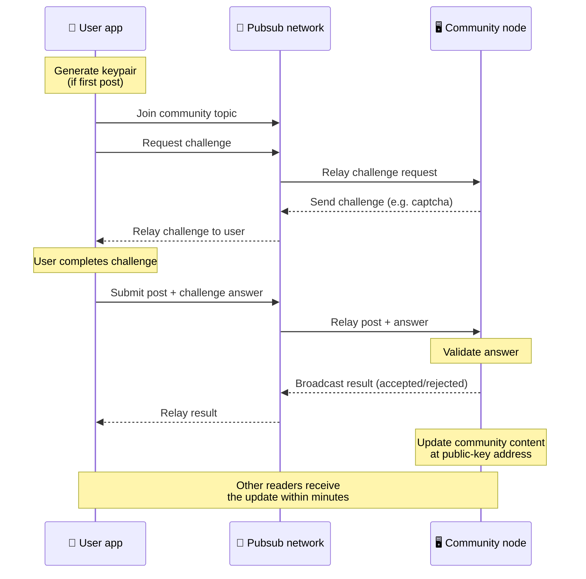

# پروتکل همتا به همتا

Bitsocial از بلاک‌چین، سرور فدراسیون یا بک‌اند متمرکز استفاده نمی‌کند. به جای آن‌ها از پشتهٔ
IPFS/libp2p بهره می‌گیرد تا دو ایده را کنار هم بگذارد: **آدرس‌دهی مبتنی بر کلید عمومی** و
**pubsub همتا به همتا**. این دو با هم به هر کسی امکان می‌دهند انجمنی را روی سخت‌افزار خانگی
میزبانی کند، در حالی که کاربران بدون داشتن حساب روی هیچ سرویس تحت کنترل یک شرکت، می‌خوانند و
پست می‌گذارند.

برای مروری کم‌فنی‌تر،
[توضیح کامل پروتکل Bitsocial به زبان ساده](./layman-protocol-explanation.md) را بخوانید.

## آیا Bitsocial از IPFS استفاده می‌کند؟

بله. گره‌های Bitsocial برای لایهٔ همتا به همتا از عناصر پایهٔ IPFS/libp2p استفاده می‌کنند:
رکوردهای انجمن که با کلید عمومی آدرس‌دهی می‌شوند، انتقال محتوا میان همتاها، و pubsub مبتنی بر
gossipsub برای پیام‌های بی‌درنگ. وقتی در این مستندات از «pubsub» صحبت می‌شود، منظور pubsub در
IPFS/libp2p است، نه یک کارگزار پیام متمرکز جداگانه.

پروتکل در حال حاضر کشف را از طریق روترهای HTTP توصیف می‌کند، چون کلاینت‌های Bitsocial آدرس
همتاهای ارائه‌دهنده را از نقاط انتهایی روتر می‌پرسند و برای هر جست‌وجو به DHT — که با مرورگر
سازگار نیست — تکیه نمی‌کنند. روترها فقط همتاها را برمی‌گردانند؛ انتقال محتوا و ترافیک pubsub
همچنان از دل شبکهٔ همتا به همتا عبور می‌کنند.

## دو مسئله

یک شبکهٔ اجتماعی غیرمتمرکز باید به دو پرسش پاسخ دهد:

1. **داده** — چگونه می‌توان محتوای اجتماعی کل دنیا را بدون یک پایگاه دادهٔ مرکزی ذخیره و ارائه کرد؟
2. **اسپم** — چگونه می‌توان جلوی سوءاستفاده را گرفت و در عین حال استفاده از شبکه را رایگان نگه داشت؟

Bitsocial مسئلهٔ داده را با کنار گذاشتن کامل بلاک‌چین حل می‌کند: رسانهٔ اجتماعی به ترتیب‌دهی
سراسری تراکنش‌ها یا دسترس‌پذیری دائمی هر پست قدیمی نیاز ندارد. مسئلهٔ اسپم را هم با این حل
می‌کند که هر انجمن چالش ضد اسپم خودش را روی شبکهٔ همتا به همتا اجرا کند.

برای مدل کشف در لایهٔ بالاتر از این لایهٔ شبکه، [کشف محتوا](./content-discovery.md) را ببینید.

---

## آدرس‌دهی مبتنی بر کلید عمومی {#public-key-based-addressing}

در BitTorrent، هش یک فایل به آدرس آن تبدیل می‌شود (_آدرس‌دهی مبتنی بر محتوا_). Bitsocial ایدهٔ
مشابهی را با کلیدهای عمومی به کار می‌گیرد: هش کلید عمومی یک انجمن به آدرس شبکه‌ای آن تبدیل
می‌شود.

هر همتایی در شبکه می‌تواند آن آدرس را از یک **روتر HTTP** بپرسد: روتر فهرستی از آدرس‌های
شبکه‌ای همتاهایی را برمی‌گرداند که در آن لحظه هش انجمن را ارائه می‌کنند، و کلاینت مستقیماً به آن
همتاها وصل می‌شود تا آخرین وضعیت انجمن را بگیرد. هر بار که محتوا به‌روزرسانی می‌شود، شمارهٔ
نسخهٔ آن افزایش می‌یابد. شبکه فقط آخرین نسخه را نگه می‌دارد — نیازی به حفظ تک‌تک وضعیت‌های
گذشته نیست، و همین است که این رویکرد را در مقایسه با بلاک‌چین سبک می‌کند.

> **یک روتر HTTP واقعاً چه چیزی نگه می‌دارد.** روتر HTTP یک نمایهٔ نازک است. برای هر آدرس
> محتوایی که می‌شناسد، فقط آدرس‌های شبکه‌ای همتاهایی را ذخیره می‌کند که خود را ارائه‌دهنده
> معرفی کرده‌اند (جفت‌های IP و پورت، مالتی‌آدرس‌های libp2p و چیزهایی از این دست). این روتر
> محتوای انجمن، فرادادهٔ آن، متن پست‌ها، فهرست اعضا یا حتی برچسب خوانا برای انسانِ آنچه در آن
> آدرس قرار دارد را ذخیره **نمی‌کند**؛ فقط به این پرسش پاسخ می‌دهد که «کدام همتاها ادعا
> می‌کنند این هش را دارند؟». همین باعث می‌شود اجرای روترها ارزان باشد، جایگزینی‌شان ساده باشد
> و در برابر آنچه کاربران منتشر می‌کنند مسئولیتی نداشته باشند؛ شبیه به ترکر BitTorrent اما بدون
> فرادادهٔ تورنت: ترکر اینفوهش‌ها را به همتاها نگاشت می‌کند، در حالی که روتر HTTP فقط یک آدرس
> محتوا را به آدرس همتاهای ارائه‌دهنده نگاشت می‌کند.
>
> برای افزونگی، کلاینت **چند روتر HTTP را به‌صورت موازی** می‌پرسد و فهرست‌های ارائه‌دهنده‌ای را
> که دریافت می‌کند با هم ادغام می‌کند. هر کسی می‌تواند یک روتر اجرا کند، و جایگزینی یا افزودن
> روتر فقط یک تغییر پیکربندی است، بدون هیچ مهاجرت داده‌ای.
>
> Bitsocial به جای DHT از روترهای HTTP استفاده می‌کند، چون اجرای DHT در مقیاسی که کشف محتوا
> لازم دارد پرهزینه است، به‌ویژه روی موبایل. DHT در مرورگر هم کار نمی‌کند، چون مرورگرها
> نمی‌توانند مستقیماً به یک DHT از جنس libp2p بپیوندند. اما روتر HTTP روی زیرساخت معمولی HTTP
> ارزان اجرا می‌شود و از روی گوشی یا مرورگر هم به همان خوبی کار می‌کند.

### آنچه در آن آدرس ذخیره می‌شود

آدرس انجمن مستقیماً محتوای کامل پست‌ها را در خود ندارد. به جای آن فهرستی از شناسه‌های محتوا را
نگه می‌دارد — هش‌هایی که به دادهٔ واقعی اشاره می‌کنند. سپس کلاینت هر تکه از محتوا را مستقیماً از
همتاهایی می‌گیرد که روترهای HTTP برگردانده‌اند. خود روترها هرگز محتوا را نمی‌بینند و ذخیره
نمی‌کنند.

دست‌کم یک همتا همیشه داده را دارد: گرهٔ گردانندهٔ انجمن. اگر انجمن محبوب باشد، همتاهای بسیار
دیگری هم آن را خواهند داشت و بار به‌خودی‌خود توزیع می‌شود، درست همان‌طور که تورنت‌های محبوب
سریع‌تر دانلود می‌شوند.

---

## pubsub همتا به همتا

pubsub (انتشار-اشتراک) الگویی برای پیام‌رسانی است که در آن همتاها در یک موضوع مشترک می‌شوند و هر
پیامی را که در آن موضوع منتشر شود دریافت می‌کنند. Bitsocial از یک شبکهٔ pubsub همتا به همتا
استفاده می‌کند — هر کسی می‌تواند منتشر کند، هر کسی می‌تواند مشترک شود، و هیچ کارگزار پیام مرکزی
در کار نیست.

برای انتشار یک پست در یک انجمن، کاربر پیامی منتشر می‌کند که موضوع آن برابر با کلید عمومی انجمن
است. گرهٔ گردانندهٔ انجمن آن را برمی‌دارد، اعتبارسنجی می‌کند و — اگر از چالش ضد اسپم عبور کند —
آن را در به‌روزرسانی بعدی محتوا می‌گنجاند.

---

## ضد اسپم: چالش‌ها روی pubsub

یک شبکهٔ pubsub باز در برابر سیل اسپم آسیب‌پذیر است. Bitsocial این را با الزام منتشرکنندگان به
گذراندن یک **چالش** پیش از پذیرش محتوایشان حل می‌کند.

سامانهٔ چالش انعطاف‌پذیر است: هر گردانندهٔ انجمن سیاست خودش را پیکربندی می‌کند. از جمله گزینه‌ها:

| نوع چالش          | چطور کار می‌کند                                         |
| ----------------- | ------------------------------------------------------- |
| **کپچا**          | معمای دیداری یا تعاملی که درون برنامه نمایش داده می‌شود |
| **محدودسازی نرخ** | محدود کردن تعداد پست در هر بازهٔ زمانی برای هر هویت     |
| **دروازهٔ توکن**  | نیاز به اثبات موجودی یک توکن مشخص                       |
| **پرداخت**        | نیاز به یک پرداخت کوچک برای هر پست                      |
| **فهرست مجاز**    | فقط هویت‌های ازپیش‌تأییدشده می‌توانند پست بگذارند       |
| **کد سفارشی**     | هر سیاستی که بتوان آن را با کد بیان کرد                 |

همتاهایی که تلاش‌های ناموفق چالش را بیش از حد بازپخش کنند از موضوع pubsub مسدود می‌شوند، و همین
جلوی حمله‌های منع سرویس روی لایهٔ شبکه را می‌گیرد.

---

## چرخهٔ عمر: خواندن یک انجمن

این همان چیزی است که وقتی کاربر برنامه را باز می‌کند و آخرین پست‌های یک انجمن را می‌بیند اتفاق
می‌افتد.

**گام به گام:**

1. کاربر برنامه را باز می‌کند و یک رابط اجتماعی می‌بیند.
2. کلاینت برای هر انجمنی که کاربر دنبال می‌کند، چند روتر HTTP را به‌صورت موازی می‌پرسد؛ هر روتر
   فقط آدرس همتاها را برمی‌گرداند، نه محتوا. تأخیر پرس‌وجو به شرایط شبکه و بار روتر بستگی دارد؛
   در شرایط معمولِ کم‌تأخیر، پاسخ‌ها اغلب در حدود یک ثانیه برمی‌گردند و به‌صورت هم‌زمان اجرا
   می‌شوند.
3. وقتی کلاینت آدرس همتاها را در اختیار داشت، به آن همتاها وصل می‌شود و آخرین اشاره‌گرهای محتوا و
   فرادادهٔ انجمن (عنوان، توضیح، فهرست ناظران، پیکربندی چالش) را می‌گیرد.
4. کلاینت با استفاده از آن اشاره‌گرها محتوای واقعی پست‌ها را می‌گیرد و سپس همه چیز را در یک رابط
   اجتماعی آشنا نمایش می‌دهد.

---

## چرخهٔ عمر: انتشار یک پست

انتشار شامل یک دست‌دهی چالش-پاسخ روی pubsub است، پیش از آنکه پست پذیرفته شود.

**گام به گام:**

1. اگر کاربر هنوز جفت‌کلید نداشته باشد، برنامه یکی برایش می‌سازد.
2. کاربر پستی برای یک انجمن می‌نویسد.
3. کلاینت به موضوع pubsub آن انجمن می‌پیوندد (موضوعی که کلید آن، کلید عمومی انجمن است).
4. کلاینت روی pubsub درخواست چالش می‌دهد.
5. گرهٔ گردانندهٔ انجمن یک چالش پس می‌فرستد (برای نمونه یک کپچا).
6. کاربر چالش را انجام می‌دهد.
7. کلاینت پست را همراه با پاسخ چالش روی pubsub ارسال می‌کند.
8. گرهٔ گردانندهٔ انجمن پاسخ را اعتبارسنجی می‌کند. اگر درست باشد، پست پذیرفته می‌شود.
9. گره نتیجه را روی pubsub پخش می‌کند تا همتاهای شبکه بدانند باید به بازپخش پیام‌های این کاربر
   ادامه دهند.
10. گره محتوای انجمن را در آدرس کلید عمومی‌اش به‌روزرسانی می‌کند.
11. ظرف چند دقیقه، هر خوانندهٔ آن انجمن به‌روزرسانی را دریافت می‌کند.

---

## نمای کلی معماری

کل سامانه سه لایه دارد که با هم کار می‌کنند:

```mermaid
graph TB
    subgraph Apps ["App layer"]
        A1["🖥️ Desktop app"]
        A2["🌐 Web app"]
        A3["📱 Mobile app"]
    end

    subgraph Protocol ["Protocol layer"]
        PK["🔑 Public-key addressing"]
        PS["📡 Peer-to-peer pubsub"]
        CH["🛡️ Challenge system"]
    end

    subgraph Network ["Network layer"]
        Router["🛰️ HTTP router<br/>(content discovery)"]
        GS["💬 Gossipsub<br/>(real-time messaging)"]
        TR["📦 Content transfer<br/>(data exchange)"]
    end

    A1 & A2 & A3 --> PK & PS & CH
    PK --> Router
    PS --> GS
    CH --> GS
    PK --> TR
```

| لایه       | نقش                                                                                                                            |
| ---------- | ------------------------------------------------------------------------------------------------------------------------------ |
| **برنامه** | رابط کاربری. برنامه‌های متعددی می‌توانند وجود داشته باشند، هر کدام با طراحی خودش، و همه در همان انجمن‌ها و هویت‌ها شریک باشند. |
| **پروتکل** | تعریف می‌کند که انجمن‌ها چطور آدرس‌دهی می‌شوند، پست‌ها چطور منتشر می‌شوند و چطور جلوی اسپم گرفته می‌شود.                       |
| **شبکه**   | زیرساخت همتا به همتای زیرین: روترهای HTTP برای کشف، gossipsub برای پیام‌رسانی بی‌درنگ، و انتقال محتوا برای تبادل داده.         |

---

## حریم خصوصی: جدا کردن نویسندگان از نشانی‌های IP

وقتی کاربری پستی منتشر می‌کند، محتوا پیش از ورود به شبکهٔ pubsub **با کلید عمومی گردانندهٔ
انجمن رمزگذاری می‌شود**. یعنی رصدکنندگان شبکه می‌توانند ببینند که یک همتا _چیزی_ منتشر کرده،
اما نمی‌توانند تشخیص دهند:

- محتوا چه می‌گوید
- کدام هویتِ نویسنده آن را منتشر کرده است

این شبیه به آن است که در BitTorrent می‌توان فهمید کدام IPها یک تورنت را seed می‌کنند، اما
نمی‌توان فهمید چه کسی در ابتدا آن را ساخته است. لایهٔ رمزگذاری روی همین پایه یک تضمین حریم
خصوصی اضافه هم می‌گذارد.

---

## همتا به همتا در مرورگر

P2P در مرورگر حالا در کلاینت‌های Bitsocial ممکن است. یک برنامهٔ مرورگری می‌تواند گرهٔ
[Helia](https://helia.io/) اجرا کند، از همان پشتهٔ کلاینتِ پروتکل Bitsocial که برنامه‌های دیگر
به کار می‌گیرند استفاده کند، و محتوا را به جای درخواست از یک دروازهٔ متمرکز IPFS، از همتاها
بگیرد. مرورگر می‌تواند مستقیماً در pubsub هم شرکت کند، بنابراین در مسیر عادی، پست گذاشتن به یک
ارائه‌دهندهٔ pubsub تحت مالکیت پلتفرم نیاز ندارد.

این نقطهٔ عطف مهم برای توزیع روی وب است: یک وب‌سایت معمولی HTTPS می‌تواند به یک کلاینت اجتماعی
زندهٔ P2P باز شود. کاربران برای خواندن از شبکه نیازی به نصب برنامهٔ دسکتاپ ندارند، و گردانندهٔ
برنامه هم لازم نیست دروازه‌ای مرکزی اجرا کند که برای همهٔ کاربران مرورگر به گلوگاه سانسور یا
مدیریت محتوا تبدیل شود.

مسیر مرورگر محدودیت‌هایی متفاوت از یک گرهٔ دسکتاپ یا سرور دارد:

- یک گرهٔ مرورگری معمولاً نمی‌تواند اتصال‌های ورودی دلخواه از اینترنت عمومی را بپذیرد
- می‌تواند تا وقتی برنامه باز است داده را بارگذاری، اعتبارسنجی، کش و منتشر کند
- نباید به‌عنوان میزبان بلندمدت دادهٔ یک انجمن در نظر گرفته شود
- میزبانی کامل یک انجمن همچنان بهتر است با یک برنامهٔ دسکتاپ، `bitsocial-cli` یا گرهٔ
  همیشه‌روشن دیگری انجام شود

روترهای HTTP همچنان برای کشف محتوا اهمیت دارند: آن‌ها آدرس ارائه‌دهندگان را برای هش یک انجمن
برمی‌گردانند. آن‌ها دروازهٔ IPFS نیستند، چون خود محتوا را ارائه نمی‌کنند. پس از کشف، کلاینت
مرورگری به همتاها وصل می‌شود و داده را از طریق پشتهٔ P2P می‌گیرد.

P2P در مرورگر حالا مسیر پیش‌فرض وب است، نه آزمایشی پشت یک کلید. 5chan به‌صورت پیش‌فرض روی
5chan.app کاملاً P2P مرورگری اجرا می‌شود، و وبلاگ Bitsocial روی bitsocial.net هم همین کار را
می‌کند. همتاهای مرورگری از طریق WebSockets امن شماره‌گیری می‌کنند؛ `pkc-js` به‌صورت پیش‌فرض
شماره‌گیری WebRTC و WebTransport را رد می‌کند، چون مسیرهای برقراری اتصالشان در مرورگر کند و
غیرقابل‌اتکا هستند. تغییر بالادستی که انتشار از مرورگر را در سال ۲۰۲۶ عملی کرد، اصلاح شمارهٔ
توالی gossipsub در `@libp2p/gossipsub` نسخهٔ 15.0.21 بود که جلوی دور انداختن پیام‌های
منتشرشده توسط گره‌های JavaScript را در همتاهای Kubo گرفت.

برای تصویر کامل، از جمله کارهایی که یک گرهٔ مرورگری هنوز نمی‌تواند انجام دهد،
[همتا به همتا در مرورگر](/browser-p2p/) را ببینید.

## مسیر جایگزین دروازه‌ای {#gateway-fallback}

دسترسی مرورگری از راه دروازه همچنان به‌عنوان مسیر جایگزین برای سازگاری و عرضهٔ تدریجی مفید است.
یک دروازه می‌تواند داده را میان شبکهٔ P2P و کلاینت مرورگری بازپخش کند، وقتی مرورگر نمی‌تواند
مستقیماً به شبکه بپیوندد یا وقتی برنامه عمداً مسیر قدیمی‌تر را انتخاب می‌کند. این دروازه‌ها:

- می‌توانند توسط هر کسی اجرا شوند
- به حساب کاربری یا پرداخت نیاز ندارند
- سرپرستی هویت‌ها یا انجمن‌های کاربران را به دست نمی‌گیرند
- می‌توانند بدون از دست رفتن داده جایگزین شوند

معماری هدف این است: نخست P2P در مرورگر، و دروازه‌ها به‌عنوان مسیر جایگزین اختیاری، نه گلوگاه
پیش‌فرض.

---

## چرا بلاک‌چین نه؟

بلاک‌چین‌ها مسئلهٔ خرج دوباره را حل می‌کنند: باید ترتیب دقیق هر تراکنش را بدانند تا جلوی خرج
کردن یک سکه برای دو بار را بگیرند.

رسانهٔ اجتماعی مسئلهٔ خرج دوباره ندارد. مهم نیست که پست A یک هزارم ثانیه پیش از پست B منتشر شده
باشد، و پست‌های قدیمی لازم نیست برای همیشه روی هر گره در دسترس بمانند.

Bitsocial با کنار گذاشتن بلاک‌چین از این موارد پرهیز می‌کند:

- **کارمزد گس** — پست گذاشتن رایگان است
- **سقف توان عبوری** — هیچ گلوگاهی از جنس اندازهٔ بلاک یا زمان بلاک وجود ندارد
- **تورم فضای ذخیره‌سازی** — گره‌ها فقط چیزی را نگه می‌دارند که لازم دارند
- **سربار اجماع** — نیازی به ماینر، اعتبارسنج یا استیکینگ نیست

بهای این انتخاب آن است که Bitsocial دسترس‌پذیری دائمی محتوای قدیمی را تضمین نمی‌کند. اما برای
رسانهٔ اجتماعی این معاوضهٔ قابل‌قبولی است: گرهٔ گردانندهٔ انجمن داده را نگه می‌دارد، محتوای
محبوب میان همتاهای بسیاری پخش می‌شود، و پست‌های خیلی قدیمی به‌طور طبیعی محو می‌شوند — درست
همان‌طور که در هر پلتفرم اجتماعی دیگری اتفاق می‌افتد.

## چرا فدراسیون نه؟

شبکه‌های فدرال (مانند ایمیل یا پلتفرم‌های مبتنی بر ActivityPub) نسبت به تمرکزگرایی یک گام جلوترند،
اما همچنان محدودیت‌های ساختاری دارند:

- **وابستگی به سرور** — هر انجمن به سروری با دامنه، TLS و نگهداری مداوم نیاز دارد
- **اعتماد به مدیر** — مدیر سرور کنترل کامل بر حساب‌های کاربری و محتوا دارد
- **چندپارگی** — جابه‌جایی میان سرورها اغلب یعنی از دست دادن دنبال‌کننده‌ها، تاریخچه یا هویت
- **هزینه** — کسی باید هزینهٔ میزبانی را بپردازد، و همین فشاری به سمت تجمیع می‌سازد

رویکرد همتا به همتای Bitsocial سرور را به‌کلی از معادله حذف می‌کند. یک گرهٔ انجمن می‌تواند روی
یک لپ‌تاپ، یک Raspberry Pi یا یک VPS ارزان اجرا شود. گرداننده سیاست نظارت بر محتوا را تعیین
می‌کند اما نمی‌تواند هویت کاربران را تصاحب کند، چون هویت‌ها با جفت‌کلید کنترل می‌شوند، نه با
اعطای سرور.

## Nostr چطور؟

Nostr به‌روشنی در هیچ‌یک از این دو دسته نمی‌گنجد. فدراسیون از جنس ActivityPub نیست، چون
نمونه‌ها به کاربران حساب نمی‌دهند و هویت به یک سرور گره نخورده است. رسانهٔ اجتماعی بلاک‌چینی هم
نیست، چون زنجیره، اجماع، گس یا ترتیب سراسری تراکنش‌ها در کار نیست.

توصیف بهتر آن است که Nostr را **رسانهٔ اجتماعی مبتنی بر رله** بنامیم. در پروتکل پایه
([NIP-01](https://github.com/nostr-protocol/nips/blob/master/01.md))، کاربران جفت‌کلید دارند،
رویدادها را امضا می‌کنند و آن رویدادها را روی رله‌های WebSocket منتشر می‌کنند. کلاینت‌ها با
فیلترهایی به رله‌ها مشترک می‌شوند، رویدادهای منطبق را می‌گیرند و امضاها را به‌صورت محلی
راستی‌آزمایی می‌کنند. کاربران همچنین می‌توانند فرادادهٔ فهرست رله
([NIP-65](https://github.com/nostr-protocol/nips/blob/master/65.md)) منتشر کنند که به کلاینت‌ها
می‌گوید معمولاً روی کدام رله‌ها می‌نویسند و برای خواندن منشن‌ها کدام رله‌ها را ترجیح می‌دهند.

همین از یک جهت مهم Nostr را به Bitsocial نزدیک‌تر می‌کند تا به سامانه‌های فدرال یا بلاک‌چینی:
هویت رمزنگارانه و قابل‌حمل است. تفاوت اصلی در لایهٔ داده است. در Nostr، رله‌ها لایهٔ عادی
ذخیره‌سازی و تحویل‌اند. در Bitsocial، روترهای HTTP فقط به کلاینت‌ها کمک می‌کنند همتاها را پیدا
کنند. روترها پست، پروفایل، فرادادهٔ انجمن یا وضعیت نظارت را ذخیره نمی‌کنند؛ آن‌ها آدرس همتاهای
ارائه‌دهنده را برمی‌گردانند و سپس کلاینت‌ها محتوا را از همتاها می‌گیرند.

انجمن‌ها هم همین شکاف را نشان می‌دهند. Nostr الگوهای اختیاری‌ای برای
[گروه‌های مبتنی بر رله](https://github.com/nostr-protocol/nips/blob/master/29.md) و
[انجمن‌های تأییدشده توسط ناظر](https://github.com/nostr-protocol/nips/blob/master/72.md) دارد،
اما این‌ها همچنان به سیاست رله، وضعیت گروه که روی رله میزبانی می‌شود، یا انتخاب کلاینت دربارهٔ
اینکه کدام تأییدها را بپذیرد وابسته‌اند. Bitsocial انجمن‌ها را اشیای رمزنگارانهٔ درجه‌یک
می‌داند که گرهٔ گرداننده‌شان پست‌ها را اعتبارسنجی می‌کند، سیاست چالش انجمن را اجرا می‌کند و
آخرین وضعیت پذیرفته‌شده را در شبکهٔ همتا به همتا منتشر می‌کند.

| پرسش                       | Nostr                                                                     | Bitsocial                                                         |
| -------------------------- | ------------------------------------------------------------------------- | ----------------------------------------------------------------- |
| دسته                       | پروتکل مبتنی بر رله                                                       | شبکهٔ انجمنی همتا به همتا                                         |
| هویت                       | کلید عمومی کاربر                                                          | جفت‌کلید کاربر و انجمن                                            |
| مسیر داده                  | رویدادهای امضاشده که روی رله‌ها منتشر می‌شوند                             | آدرس کلید عمومی به همتاها حل می‌شود؛ محتوا از همتاها گرفته می‌شود |
| چه کسی آنلاین نگهش می‌دارد | رله‌هایی که کاربران و کلاینت‌ها انتخاب می‌کنند                            | گرهٔ مالک انجمن به‌علاوهٔ seederهای کمکی                          |
| انجمن‌ها                   | گروه‌های اختیاری مبتنی بر رله یا انجمن‌های تأییدشده توسط ناظر             | اشیای انجمنی درجه‌یک با نظارتِ تحت کنترل گرداننده                 |
| ضد اسپم                    | سیاست رله، احراز هویت، پرداخت، اثبات کار، فیلترهای کلاینت یا تأیید ناظران | منطق چالشِ تعریف‌شده توسط انجمن پیش از درج                        |
| معاوضهٔ اصلی               | هویت قابل‌حمل، اما دسترس‌پذیری و سیاست وابسته به رله                      | وابستگی کمتر به رله، اما محتوای قدیمی برای همیشه تضمین نمی‌شود    |

---

## خلاصه

Bitsocial روی دو عنصر پایه ساخته شده است: آدرس‌دهی مبتنی بر کلید عمومی برای کشف محتوا، و pubsub
همتا به همتا برای ارتباط بی‌درنگ. این دو با هم شبکه‌ای اجتماعی می‌سازند که در آن:

- انجمن‌ها با کلیدهای رمزنگارانه شناخته می‌شوند، نه با نام دامنه
- محتوا مانند یک تورنت میان همتاها پخش می‌شود و از یک پایگاه دادهٔ واحد ارائه نمی‌شود
- مقاومت در برابر اسپم محلیِ هر انجمن است و از سوی یک پلتفرم تحمیل نمی‌شود
- کاربران هویتشان را از راه جفت‌کلید مالک‌اند، نه از راه حساب‌های قابل‌ابطال
- کل سامانه بدون سرور، بلاک‌چین یا کارمزد پلتفرم کار می‌کند
