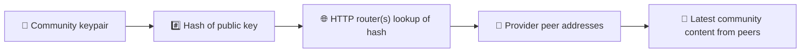
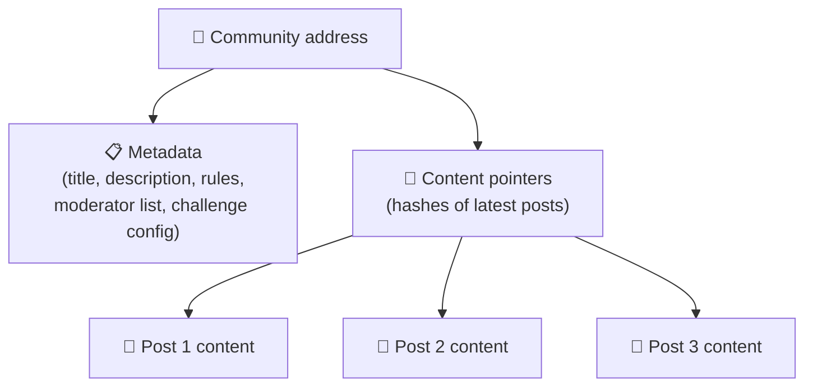
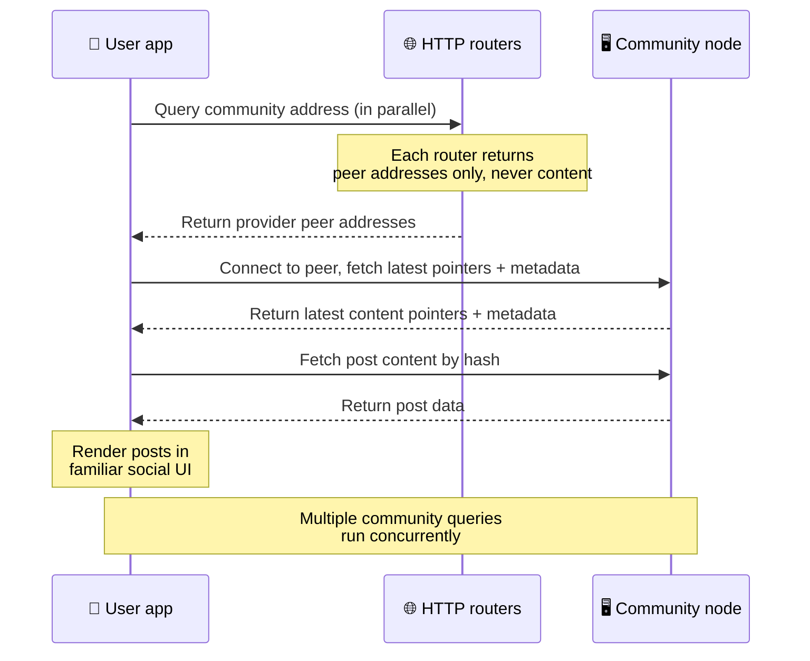
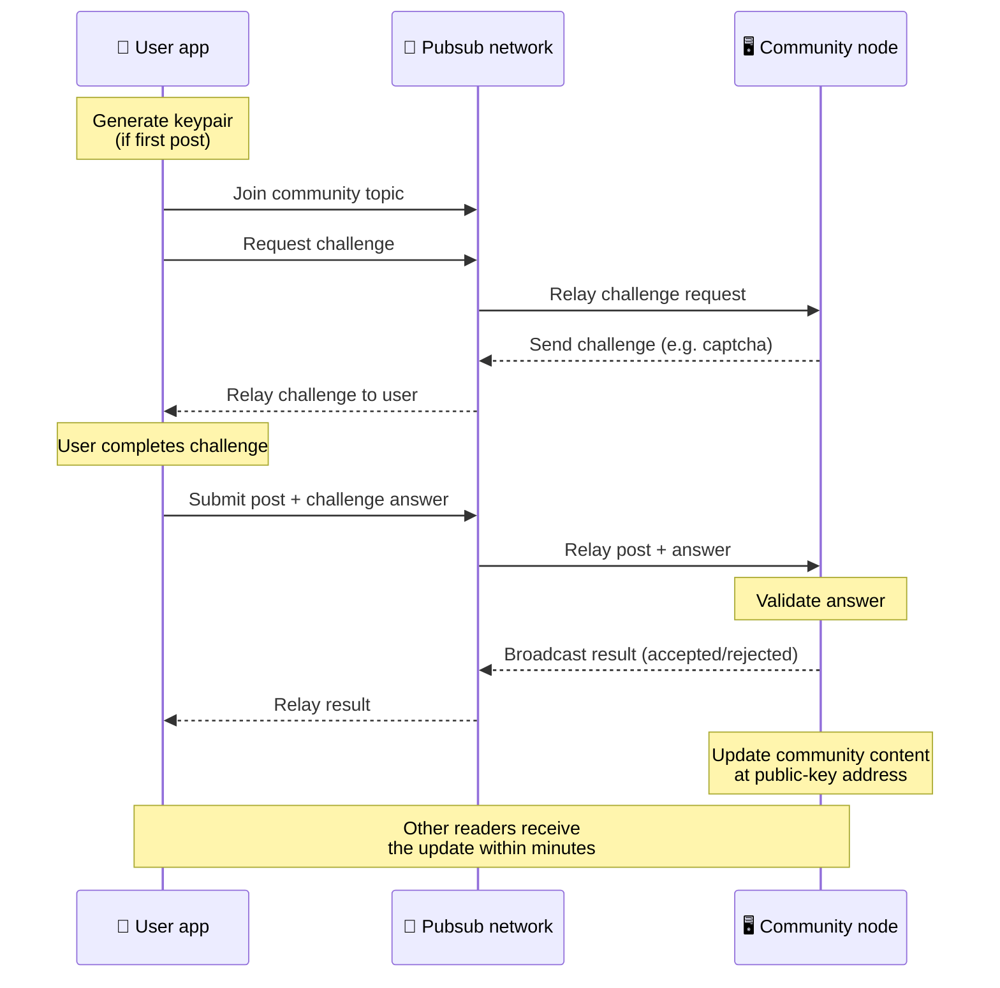
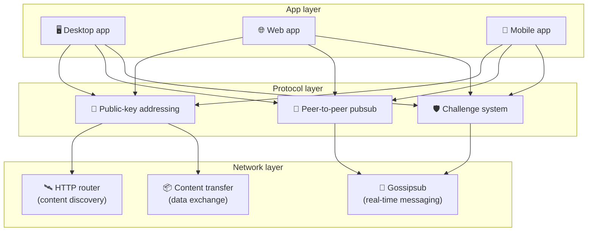

# Vertaisverkkoprotokolla

Bitsocial ei käytä lohkoketjua, federaatiopalvelinta eikä keskitettyä taustajärjestelmää. Sen sijaan
se yhdistää IPFS/libp2p-pinon avulla kaksi ideaa: **julkiseen avaimeen perustuvan osoitteistuksen**
ja **vertaisverkon pubsubin**. Yhdessä ne antavat kenen tahansa ylläpitää yhteisöä tavallisella
kuluttajalaitteistolla, kun taas käyttäjät lukevat ja julkaisevat ilman tilejä minkään yrityksen
hallitsemassa palvelussa.

Vähemmän teknisen läpikäynnin löydät sivulta
[Täydellinen maallikon selitys Bitsocial-protokollasta](./layman-protocol-explanation.md).

## Käyttääkö Bitsocial IPFS:ää?

Kyllä. Bitsocial-solmut käyttävät IPFS/libp2p-primitiivejä vertaisverkkokerroksessa: julkisella
avaimella osoitetut yhteisötietueet, sisällön siirto vertaisten välillä ja gossipsub-pubsub
reaaliaikaisille viesteille. Kun näissä ohjeissa puhutaan pubsubista, tarkoitetaan
IPFS/libp2p-pubsubia, ei erillistä keskitettyä viestivälittäjää.

Protokolla kuvaa tällä hetkellä löytämisen HTTP-reitittimien kautta, koska Bitsocial-asiakkaat
kysyvät tarjoajavertaisten osoitteita reititinpäätepisteiltä sen sijaan, että ne turvautuisivat
jokaisessa haussa selaimelle hankalaan DHT:hen. Reitittimet palauttavat vain vertaisia; sisällön
siirto ja pubsub-liikenne kulkevat edelleen vertaisverkon läpi.

## Kaksi ongelmaa

Hajautetun sosiaalisen verkon on vastattava kahteen kysymykseen:

1. **Data** — miten maailman sosiaalinen sisältö tallennetaan ja tarjoillaan ilman keskitettyä
   tietokantaa?
2. **Roskaposti** — miten väärinkäyttö estetään pitäen verkko silti maksuttomana käyttää?

Bitsocial ratkaisee dataongelman ohittamalla lohkoketjun kokonaan: sosiaalinen media ei tarvitse
globaalia tapahtumien järjestystä eikä jokaisen vanhan julkaisun pysyvää saatavuutta.
Roskapostiongelman se ratkaisee antamalla jokaisen yhteisön ajaa oman roskapostin
torjuntahaasteensa vertaisverkon yli.

Tämän verkkokerroksen yläpuolella toimivasta löytämismallista kerrotaan sivulla
[Sisällön löytäminen](./content-discovery.md).

---

## Julkiseen avaimeen perustuva osoitteistus {#public-key-based-addressing}

BitTorrentissa tiedoston tiiviste toimii sen osoitteena (_sisältöpohjainen osoitteistus_). Bitsocial
soveltaa samaa ideaa julkisiin avaimiin: yhteisön julkisen avaimen tiivisteestä tulee sen
verkko-osoite.

Kuka tahansa verkon vertainen voi kysyä tuota osoitetta **HTTP-reitittimeltä**: reititin vastaa
listalla niiden vertaisten verkko-osoitteista, jotka tällä hetkellä tarjoavat yhteisön tiivistettä,
ja asiakas yhdistää suoraan noihin vertaisiin hakeakseen yhteisön uusimman tilan. Aina kun sisältöä
päivitetään, sen versionumero kasvaa. Verkko säilyttää vain uusimman version — jokaista
historiallista tilaa ei tarvitse säilyttää, ja juuri se tekee tästä ratkaisusta kevyen lohkoketjuun
verrattuna.

> **Mitä HTTP-reititin oikeasti sisältää.** HTTP-reititin on ohut indeksi. Jokaisesta tuntemastaan
> sisältöosoitteesta se tallentaa vain niiden vertaisten verkko-osoitteet, jotka ovat ilmoittautuneet
> tarjoajiksi (IP-osoite–portti-pareja, libp2p-multiaddreja ja vastaavia). Se **ei** tallenna
> yhteisön sisältöä, sen metatietoja, julkaisujen tekstiä, jäsenlistaa eikä edes ihmisluettavaa
> nimeä sille, mitä kyseisessä osoitteessa on; se vastaa vain kysymykseen "mitkä vertaiset väittävät
> omistavansa tämän tiivisteen?". Tämä tekee reitittimien ylläpidosta halpaa ja niiden vaihtamisesta
> helppoa, eikä aseta niitä vastuuseen käyttäjien julkaisemasta sisällöstä. Ratkaisu muistuttaa
> BitTorrent-trackeria, mutta ilman torrent-metatietoja: tracker yhdistää infohash-arvot vertaisiin,
> kun taas HTTP-reititin yhdistää vain sisältöosoitteen tarjoajavertaisten osoitteisiin.
>
> Vikasietoisuuden vuoksi asiakas kysyy **useilta HTTP-reitittimiltä rinnakkain** ja yhdistää
> saamansa tarjoajalistat. Kuka tahansa voi ylläpitää reititintä, ja reitittimen vaihtaminen tai
> lisääminen on pelkkä asetusmuutos ilman datan siirtoa.
>
> Bitsocial käyttää HTTP-reitittimiä DHT:n sijaan, koska DHT:n ajaminen sisällön löytämiseen
> vaadittavassa mittakaavassa on kallista, erityisesti mobiilissa. DHT ei myöskään toimi selaimessa,
> koska selaimet eivät voi liittyä libp2p-DHT:hen suoraan. HTTP-reititin pyörii edullisesti
> tavallisella HTTP-infrastruktuurilla ja toimii yhtä hyvin puhelimesta kuin selaimestakin.

### Mitä osoitteeseen tallennetaan

Yhteisön osoite ei sisällä julkaisujen koko sisältöä suoraan. Sen sijaan siihen tallennetaan lista
sisältötunnisteista — tiivisteitä, jotka osoittavat varsinaiseen dataan. Asiakas hakee sitten
jokaisen sisältöpalan suoraan niiltä vertaisilta, jotka HTTP-reitittimet palauttivat. Reitittimet
itse eivät koskaan näe eivätkä tallenna sisältöä.

Vähintään yhdellä vertaisella on data aina hallussaan: yhteisön ylläpitäjän solmulla. Jos yhteisö on
suosittu, myös monella muulla vertaisella on se, ja kuorma jakautuu itsestään — samaan tapaan kuin
suositut torrentit latautuvat nopeammin.

---

## Vertaisverkon pubsub

Pubsub (publish-subscribe) on viestintämalli, jossa vertaiset tilaavat aiheen ja vastaanottavat
kaikki kyseiseen aiheeseen julkaistut viestit. Bitsocial käyttää vertaisverkon pubsubia — kuka
tahansa voi julkaista, kuka tahansa voi tilata, eikä keskitettyä viestivälittäjää ole.

Julkaistakseen viestin yhteisöön käyttäjä lähettää viestin, jonka aihe on sama kuin yhteisön
julkinen avain. Yhteisön ylläpitäjän solmu poimii sen, tarkistaa sen ja — jos se läpäisee roskapostin
torjuntahaasteen — sisällyttää sen seuraavaan sisältöpäivitykseen.

---

## Roskapostin torjunta: haasteet pubsubin yli

Avoin pubsub-verkko on altis roskapostitulville. Bitsocial ratkaisee tämän vaatimalla julkaisijoilta
**haasteen** suorittamista ennen kuin sisältö hyväksytään.

Haastejärjestelmä on joustava: jokainen yhteisön ylläpitäjä määrittää oman käytäntönsä.
Vaihtoehtoja ovat esimerkiksi:

| Haastetyyppi          | Miten se toimii                                                    |
| --------------------- | ------------------------------------------------------------------ |
| **Captcha**           | Sovelluksessa esitettävä visuaalinen tai vuorovaikutteinen tehtävä |
| **Nopeusrajoitus**    | Rajaa julkaisujen määrää aikaikkunassa identiteettiä kohden        |
| **Token-portti**      | Vaadi todiste tietyn tokenin saldosta                              |
| **Maksu**             | Vaadi pieni maksu jokaisesta julkaisusta                           |
| **Sallittujen lista** | Vain ennalta hyväksytyt identiteetit voivat julkaista              |
| **Mukautettu koodi**  | Mikä tahansa koodilla ilmaistavissa oleva käytäntö                 |

Vertaiset, jotka välittävät liikaa epäonnistuneita haasteyrityksiä, estetään pubsub-aiheesta, mikä
ehkäisee palvelunestohyökkäykset verkkokerroksella.

---

## Elinkaari: yhteisön lukeminen

Näin tapahtuu, kun käyttäjä avaa sovelluksen ja katsoo yhteisön uusimpia julkaisuja.

**Vaihe vaiheelta:**

1. Käyttäjä avaa sovelluksen ja näkee sosiaalisen käyttöliittymän.
2. Asiakas kysyy useilta HTTP-reitittimiltä rinnakkain jokaisesta yhteisöstä, jota käyttäjä seuraa;
   jokainen reititin palauttaa vain vertaisosoitteita, ei koskaan sisältöä. Kyselyn viive riippuu
   verkon olosuhteista ja reitittimen kuormasta; tavanomaisissa matalan viiveen oloissa kyselyt
   palaavat usein noin sekunnissa ja etenevät rinnakkain.
3. Kun asiakkaalla on vertaisosoitteet, se yhdistää noihin vertaisiin ja hakee yhteisön uusimmat
   sisältöosoittimet ja metatiedot (otsikko, kuvaus, moderaattorilista, haasteen asetukset).
4. Asiakas hakee varsinaisen julkaisusisällön näiden osoittimien avulla ja piirtää sitten kaiken
   tuttuun sosiaaliseen käyttöliittymään.

---

## Elinkaari: julkaisun lähettäminen

Julkaisemiseen kuuluu haaste–vastaus-kättely pubsubin yli ennen kuin julkaisu hyväksytään.

**Vaihe vaiheelta:**

1. Sovellus luo käyttäjälle avainparin, jos hänellä ei vielä ole sellaista.
2. Käyttäjä kirjoittaa julkaisun yhteisöön.
3. Asiakas liittyy kyseisen yhteisön pubsub-aiheeseen (joka on sidottu yhteisön julkiseen avaimeen).
4. Asiakas pyytää haastetta pubsubin yli.
5. Yhteisön ylläpitäjän solmu lähettää takaisin haasteen, esimerkiksi captchan.
6. Käyttäjä suorittaa haasteen.
7. Asiakas lähettää julkaisun ja haasteen vastauksen pubsubin yli.
8. Yhteisön ylläpitäjän solmu tarkistaa vastauksen. Jos se on oikein, julkaisu hyväksytään.
9. Solmu lähettää tuloksen pubsubin yli, jotta verkon vertaiset tietävät jatkaa tämän käyttäjän
   viestien välittämistä.
10. Solmu päivittää yhteisön sisällön sen julkisen avaimen osoitteeseen.
11. Muutaman minuutin kuluessa jokainen yhteisön lukija saa päivityksen.

---

## Arkkitehtuurin yleiskuva

Koko järjestelmässä on kolme yhdessä toimivaa kerrosta:

| Kerros         | Rooli                                                                                                                                                |
| -------------- | ---------------------------------------------------------------------------------------------------------------------------------------------------- |
| **Sovellus**   | Käyttöliittymä. Sovelluksia voi olla useita, kullakin oma muotoilunsa, ja kaikki jakavat samat yhteisöt ja identiteetit.                             |
| **Protokolla** | Määrittelee, miten yhteisöt osoitetaan, miten julkaisut lähetetään ja miten roskaposti estetään.                                                     |
| **Verkko**     | Taustalla oleva vertaisverkkoinfrastruktuuri: HTTP-reitittimet löytämiseen, gossipsub reaaliaikaiseen viestintään ja sisällön siirto datan vaihtoon. |

---

## Yksityisyys: tekijöiden irrottaminen IP-osoitteista

Kun käyttäjä lähettää julkaisun, sisältö **salataan yhteisön ylläpitäjän julkisella avaimella**
ennen kuin se päätyy pubsub-verkkoon. Tämä tarkoittaa, että vaikka verkon tarkkailijat näkevät
vertaisen julkaisseen _jotain_, he eivät voi päätellä:

- mitä sisällössä lukee
- mikä tekijäidentiteetti sen julkaisi

Tämä muistuttaa sitä, miten BitTorrentissa voi selvittää, mitkä IP-osoitteet jakavat torrenttia,
muttei sitä, kuka sen alun perin loi. Salauskerros lisää tämän perustason päälle vielä yhden
yksityisyystakuun.

---

## Selainpohjainen vertaisverkko

Selain-P2P on nyt mahdollista Bitsocial-asiakkaissa. Selainsovellus voi ajaa
[Helia](https://helia.io/)-solmua, käyttää samaa Bitsocial-protokollapinoa kuin muutkin sovellukset
ja hakea sisältöä vertaisilta sen sijaan, että pyytäisi keskitettyä IPFS-yhdyskäytävää tarjoilemaan
sen. Selain voi myös osallistua pubsubiin suoraan, joten julkaiseminen ei normaalissa
toimintapolussa tarvitse alustan omistamaa pubsub-tarjoajaa.

Tämä on verkkojakelun kannalta ratkaiseva virstanpylväs: tavallinen HTTPS-sivusto voi avautua
eläväksi P2P-sosiaaliasiakkaaksi. Käyttäjien ei tarvitse asentaa työpöytäsovellusta ennen kuin he
voivat lukea verkosta, eikä sovelluksen ylläpitäjän tarvitse pyörittää keskitettyä yhdyskäytävää,
josta tulisi sensuurin tai moderoinnin pullonkaula jokaiselle selainkäyttäjälle.

Selainpolulla on eri rajoitteet kuin työpöytä- tai palvelinsolmulla:

- selainsolmu ei yleensä voi ottaa vastaan mielivaltaisia saapuvia yhteyksiä julkisesta internetistä
- se voi ladata, tarkistaa, välimuistittaa ja julkaista dataa niin kauan kuin sovellus on auki
- sitä ei pidä pitää yhteisön datan pitkäaikaisena isäntänä
- yhteisön täysimittainen ylläpito hoituu edelleen parhaiten työpöytäsovelluksella,
  `bitsocial-cli`-työkalulla tai muulla jatkuvasti päällä olevalla solmulla

HTTP-reitittimillä on edelleen merkitystä sisällön löytämisessä: ne palauttavat yhteisön tiivisteen
tarjoajaosoitteet. Ne eivät ole IPFS-yhdyskäytäviä, koska ne eivät tarjoile itse sisältöä.
Löytämisen jälkeen selainasiakas yhdistää vertaisiin ja hakee datan P2P-pinon kautta.

Selain-P2P on nyt oletusarvoinen verkkopolku, ei kytkimen takana piilevä kokeilu. 5chan ajaa
oletuksena puhdasta selain-P2P:tä osoitteessa 5chan.app, ja Bitsocialin blogi bitsocial.net-sivustolla
tekee saman. Selainvertaiset muodostavat yhteydet suojattujen WebSocketien yli; `pkc-js` estää
oletuksena WebRTC- ja WebTransport-yhteydenotot, koska niiden yhteydenmuodostus on selaimessa hidasta
ja epäluotettavaa. Vuonna 2026 selaimesta julkaisemisen teki käytännölliseksi gossipsubin
järjestysnumerokorjaus paketissa `@libp2p/gossipsub` 15.0.21, joka lopetti sen, että Kubo-vertaiset
hylkäsivät JavaScript-solmujen julkaisemat viestit.

Koko kuvan, mukaan lukien sen mitä selainsolmu ei vieläkään pysty tekemään, löydät sivulta
[Selainpohjainen vertaisverkko](/browser-p2p/).

## Yhdyskäytävä varapolkuna {#gateway-fallback}

Yhdyskäytävän kautta toimiva selainkäyttö on edelleen hyödyllistä yhteensopivuuden ja
käyttöönoton varapolkuna. Yhdyskäytävä voi välittää dataa P2P-verkon ja selainasiakkaan välillä,
kun selain ei voi liittyä verkkoon suoraan tai kun sovellus tarkoituksella valitsee vanhemman polun.
Nämä yhdyskäytävät:

- voi ottaa käyttöön kuka tahansa
- eivät vaadi käyttäjätilejä tai maksuja
- eivät saa haltuunsa käyttäjien identiteettejä tai yhteisöjä
- voidaan vaihtaa toisiin ilman datan menetystä

Tavoitearkkitehtuurissa selain-P2P on ensisijainen ja yhdyskäytävät ovat valinnainen varapolku, ei
oletusarvoinen pullonkaula.

---

## Miksi ei lohkoketjua?

Lohkoketjut ratkaisevat kaksinkertaisen käytön ongelman: niiden on tiedettävä jokaisen tapahtuman
tarkka järjestys, jottei kukaan voi käyttää samaa kolikkoa kahdesti.

Sosiaalisessa mediassa ei ole kaksinkertaisen käytön ongelmaa. Sillä ei ole väliä, julkaistiinko
julkaisu A millisekuntia ennen julkaisua B, eikä vanhojen julkaisujen tarvitse olla pysyvästi
saatavilla jokaisella solmulla.

Ohittamalla lohkoketjun Bitsocial välttää seuraavat:

- **gas-maksut** — julkaiseminen on ilmaista
- **läpäisyrajat** — ei lohkokoon tai lohkoajan pullonkaulaa
- **tallennustilan paisuminen** — solmut säilyttävät vain sen, mitä tarvitsevat
- **konsensuksen yleiskustannukset** — ei louhijoita, validaattoreita eikä stakingia

Kompromissina Bitsocial ei takaa vanhan sisällön pysyvää saatavuutta. Sosiaaliselle medialle se on
hyväksyttävä kompromissi: yhteisön ylläpitäjän solmu säilyttää datan, suosittu sisältö leviää usealle
vertaiselle, ja hyvin vanhat julkaisut haipuvat luonnostaan — aivan kuten jokaisella sosiaalisella
alustalla.

## Miksi ei federaatiota?

Federoidut verkot (kuten sähköposti tai ActivityPub-pohjaiset alustat) ovat parannus keskitettyyn
malliin, mutta niissä on silti rakenteellisia rajoitteita:

- **Palvelinriippuvuus** — jokainen yhteisö tarvitsee palvelimen, jolla on verkkotunnus, TLS ja
  jatkuva ylläpito
- **Luottamus ylläpitäjään** — palvelimen ylläpitäjällä on täysi valta käyttäjätileihin ja sisältöön
- **Pirstaloituminen** — palvelimelta toiselle siirtyminen tarkoittaa usein seuraajien, historian
  tai identiteetin menettämistä
- **Kustannukset** — jonkun on maksettava ylläpidosta, mikä luo painetta keskittymiseen

Bitsocialin vertaisverkkomalli poistaa palvelimen yhtälöstä kokonaan. Yhteisösolmu voi pyöriä
kannettavalla, Raspberry Pi:llä tai halvalla VPS:llä. Ylläpitäjä hallitsee moderointikäytäntöä,
mutta ei voi ottaa haltuunsa käyttäjien identiteettejä, koska identiteettejä hallitaan avainpareilla
eikä niitä myönnetä palvelimelta.

## Entä Nostr?

Nostr ei asetu siististi kumpaankaan lokeroon. Se ei ole ActivityPub-tyylistä federaatiota, koska
instanssit eivät myönnä käyttäjille tilejä eikä identiteetti ole sidottu yhteen palvelimeen. Se ei
ole myöskään lohkoketjupohjaista sosiaalista mediaa, koska ketjua, konsensusta, gasia tai globaalia
tapahtumajärjestystä ei ole.

Nostria kuvaa paremmin **välityspalvelinpohjainen sosiaalinen media**. Perusprotokollassa
([NIP-01](https://github.com/nostr-protocol/nips/blob/master/01.md)) käyttäjillä on avainparit, he
allekirjoittavat tapahtumia ja julkaisevat ne WebSocket-välityspalvelimille. Asiakkaat tilaavat
välityspalvelimilta suodattimilla, hakevat vastaavat tapahtumat ja tarkistavat allekirjoitukset
paikallisesti. Käyttäjät voivat myös julkaista välityspalvelinlistan metatietoja
([NIP-65](https://github.com/nostr-protocol/nips/blob/master/65.md)), jotka kertovat asiakkaille,
mille välityspalvelimille he yleensä kirjoittavat ja miltä he lukevat mainintoja mieluiten.

Yhdessä tärkeässä suhteessa se asettaa Nostrin lähemmäs Bitsocialia kuin federoidut tai
lohkoketjupohjaiset järjestelmät: identiteetti on kryptografinen ja siirrettävä. Pääero on
datakerroksessa. Nostrissa välityspalvelimet ovat tavanomainen tallennus- ja jakelukerros.
Bitsocialissa HTTP-reitittimet vain auttavat asiakkaita löytämään vertaisia. Reitittimet eivät
säilytä julkaisuja, profiileja, yhteisöjen metatietoja tai moderointitilaa; ne palauttavat
tarjoajavertaisten osoitteet, ja asiakkaat hakevat sisällön vertaisilta.

Yhteisöissä näkyy sama jako. Nostrissa on valinnaisia malleja
[välityspalvelinpohjaisille ryhmille](https://github.com/nostr-protocol/nips/blob/master/29.md) ja
[moderaattorien hyväksymille yhteisöille](https://github.com/nostr-protocol/nips/blob/master/72.md),
mutta ne nojaavat edelleen välityspalvelinten käytäntöihin, välityspalvelimella isännöityyn
ryhmätilaan tai asiakkaan valintoihin siitä, mitä hyväksyntöjä kunnioitetaan. Bitsocial kohtelee
yhteisöjä ensiluokkaisina kryptografisina objekteina, joiden ylläpitäjän solmu tarkistaa julkaisut,
ajaa yhteisön haastekäytäntöä ja julkaisee viimeisimmän hyväksytyn tilan vertaisverkkoon.

| Kysymys                 | Nostr                                                                                               | Bitsocial                                                                                      |
| ----------------------- | --------------------------------------------------------------------------------------------------- | ---------------------------------------------------------------------------------------------- |
| Kategoria               | Välityspalvelinpohjainen protokolla                                                                 | Vertaisverkkopohjainen yhteisöverkko                                                           |
| Identiteetti            | Käyttäjän julkinen avain                                                                            | Käyttäjien ja yhteisöjen avainparit                                                            |
| Datapolku               | Allekirjoitetut tapahtumat julkaistaan välityspalvelimille                                          | Julkisen avaimen osoite ratkeaa vertaisiksi; sisältö haetaan vertaisilta                       |
| Kuka pitää sen verkossa | Käyttäjien ja asiakkaiden valitsemat välityspalvelimet                                              | Yhteisön omistajan solmu sekä avustavat jakajat                                                |
| Yhteisöt                | Valinnaiset välityspalvelinpohjaiset ryhmät tai moderaattorien hyväksymät yhteisöt                  | Ensiluokkaiset yhteisöobjektit, joiden moderointia ylläpitäjä hallitsee                        |
| Roskapostin torjunta    | Välityspalvelinkäytäntö, tunnistautuminen, maksu, proof-of-work, asiakassuodattimet tai hyväksynnät | Yhteisön määrittelemä haastelogiikka ennen sisällyttämistä                                     |
| Tärkein kompromissi     | Siirrettävä identiteetti, mutta saatavuus ja käytännöt riippuvat välityspalvelimista                | Vähemmän riippuvuutta välityspalvelimista, mutta vanhan sisällön säilymistä ei taata ikuisesti |

---

## Yhteenveto

Bitsocial rakentuu kahdelle primitiiville: julkiseen avaimeen perustuvalle osoitteistukselle sisällön
löytämisessä ja vertaisverkon pubsubille reaaliaikaisessa viestinnässä. Yhdessä ne tuottavat
sosiaalisen verkon, jossa:

- yhteisöt tunnistetaan kryptografisilla avaimilla, ei verkkotunnuksilla
- sisältö leviää vertaisten kesken kuin torrentti, sitä ei tarjoilla yhdestä tietokannasta
- roskapostin torjunta on kunkin yhteisön oma asia, ei alustan sanelema
- käyttäjät omistavat identiteettinsä avainparien kautta, eivät peruutettavissa olevien tilien kautta
- koko järjestelmä toimii ilman palvelimia, lohkoketjuja tai alustamaksuja
