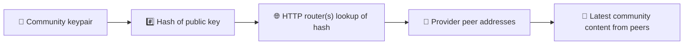
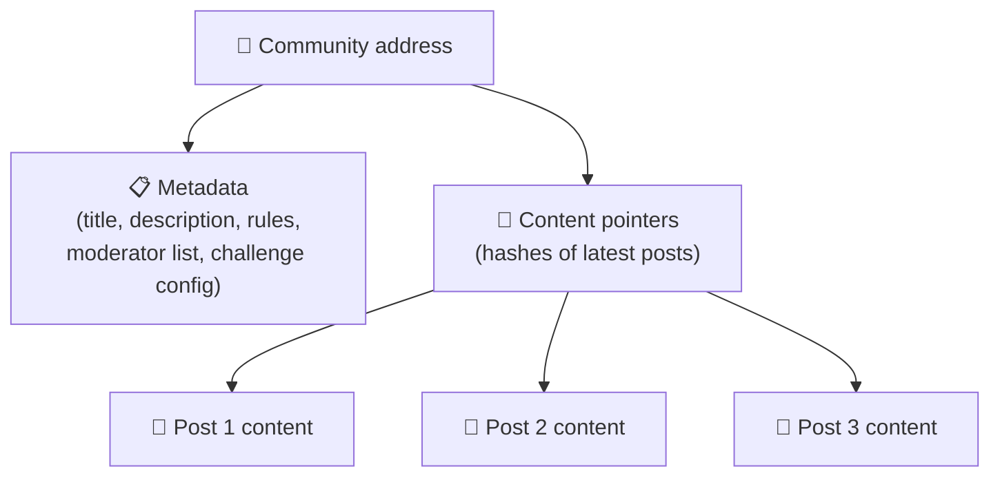
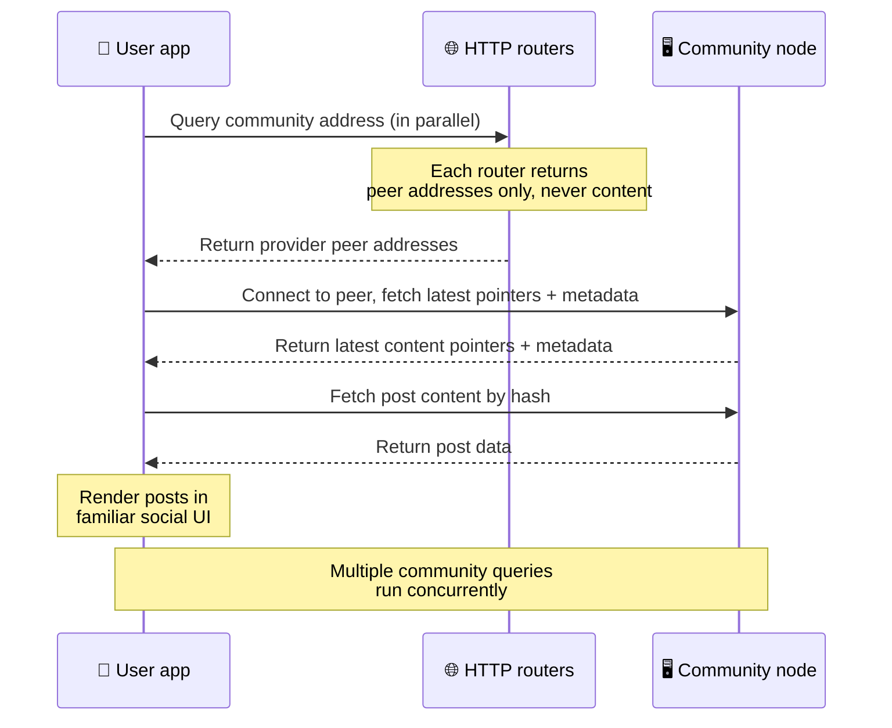
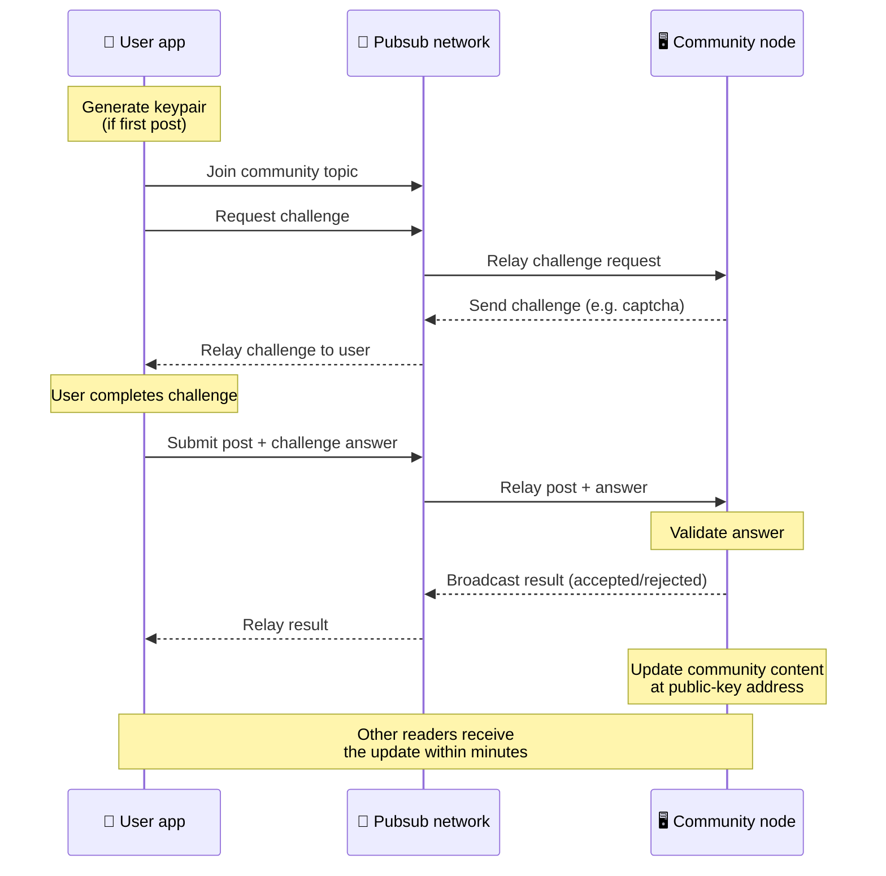
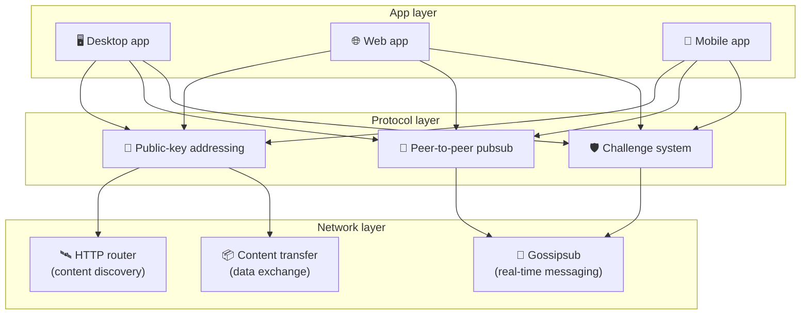

# Protokol ng Peer-to-Peer

Hindi gumagamit ang Bitsocial ng blockchain, federation server, o sentralisadong backend. Sa halip,
ginagamit nito ang IPFS/libp2p stack upang pagsamahin ang dalawang ideya: **addressing na nakabatay
sa pampublikong key** at **peer-to-peer pubsub**. Magkasama, pinapayagan ng dalawang ito ang sinuman
na mag-host ng komunidad mula sa consumer hardware habang nagbabasa at nagpo-post ang mga user nang
walang account sa anumang serbisyong kontrolado ng kumpanya.

Para sa paliwanag na hindi gaanong teknikal, basahin ang
[Isang kumpletong paliwanag ng protocol ng Bitsocial para sa karaniwang tao](./layman-protocol-explanation.md).

## Gumagamit ba ng IPFS ang Bitsocial?

Oo. Gumagamit ang mga node ng Bitsocial ng mga primitive ng IPFS/libp2p para sa peer-to-peer layer:
mga record ng komunidad na naka-address sa pampublikong key, paglipat ng nilalaman sa pagitan ng mga
peer, at gossipsub pubsub para sa mga real-time na mensahe. Kapag sinasabi ng dokumentasyong ito na
"pubsub," ang tinutukoy nito ay ang pubsub ng IPFS/libp2p, hindi isang hiwalay na sentralisadong
message broker.

Sa kasalukuyan, inilalarawan ng protocol ang pagtuklas sa pamamagitan ng mga HTTP router dahil
nagtatanong ang mga kliyente ng Bitsocial sa mga router endpoint para sa mga address ng provider peer
sa halip na umasa sa isang DHT na mahirap gamitin sa browser para sa bawat paghahanap. Mga peer lang
ang ibinabalik ng mga router; ang paglipat ng nilalaman at ang trapiko ng pubsub ay dumadaan pa rin
sa peer-to-peer network.

## Ang dalawang problema

Dalawang tanong ang kailangang sagutin ng isang desentralisadong social network:

1. **Data** — paano mo iimbak at ihahatid ang social content ng buong mundo nang walang sentral na database?
2. **Spam** — paano mo mapipigilan ang pang-aabuso habang libreng nananatiling gamitin ang network?

Nilulutas ng Bitsocial ang problema sa data sa pamamagitan ng ganap na paglaktaw sa blockchain: hindi
kailangan ng social media ang pandaigdigang pagkakasunod-sunod ng mga transaksyon o ang permanenteng
availability ng bawat lumang post. Nilulutas nito ang problema sa spam sa pamamagitan ng
pagpapahintulot sa bawat komunidad na magpatakbo ng sarili nitong anti-spam na hamon sa ibabaw ng
peer-to-peer network.

Para sa modelo ng pagtuklas sa itaas ng network layer na ito, tingnan ang [Pagtuklas ng Nilalaman](./content-discovery.md).

---

## Addressing na nakabatay sa pampublikong key {#public-key-based-addressing}

Sa BitTorrent, ang hash ng isang file ang nagiging address nito (_content-based addressing_).
Gumagamit ang Bitsocial ng katulad na ideya gamit ang mga pampublikong key: ang hash ng pampublikong
key ng isang komunidad ang nagiging network address nito.

Maaaring magtanong ang sinumang peer sa network sa isang **HTTP router** para sa address na iyon:
sumasagot ang router ng listahan ng mga network address ng mga peer na kasalukuyang nagbibigay ng
hash ng komunidad, at direktang kumokonekta ang kliyente sa mga peer na iyon upang kunin ang
pinakabagong estado ng komunidad. Sa tuwing ina-update ang nilalaman, tumataas ang numero ng bersyon
nito. Ang pinakabagong bersyon lang ang pinapanatili ng network — hindi kailangang ingatan ang bawat
makasaysayang estado, at iyon ang dahilan kung bakit magaan ang paraang ito kumpara sa isang
blockchain.

> **Ano talaga ang hawak ng isang HTTP router.** Ang HTTP router ay isang manipis na index. Para sa
> bawat content address na alam nito, ang iniimbak lang nito ay ang mga network address ng mga peer
> na nag-anunsyo ng kanilang sarili bilang mga provider (mga pares ng IP/port, mga libp2p multiaddr,
> at iba pang ganoon). **Hindi** nito iniimbak ang nilalaman ng komunidad, ang metadata nito, ang
> teksto ng mga post, ang listahan ng miyembro, o kahit ang nababasa ng tao na label ng kung ano ang
> nasa address na iyon; sinasagot lang nito ang tanong na "aling mga peer ang nagsasabing hawak nila
> ang hash na ito?". Dahil dito, mura ang mga router na patakbuhin, madaling palitan, at hindi
> mananagot sa kung ano ang inilalathala ng mga user, katulad ng isang BitTorrent tracker ngunit
> walang torrent metadata: nagmamapa ang tracker ng mga infohash sa mga peer, samantalang nagmamapa
> lang ang HTTP router ng content address sa mga address ng provider peer.
>
> Para sa redundancy, nagtatanong ang kliyente sa **ilang HTTP router nang sabay-sabay** at
> pinagsasama ang mga listahan ng provider na natanggap nito. Kahit sino ay maaaring magpatakbo ng
> router, at ang pagpapalit o pagdaragdag ng mga router ay isang pagbabago lang sa config na walang
> paglilipat ng data.
>
> Gumagamit ang Bitsocial ng mga HTTP router sa halip na DHT dahil magastos ang pagpapatakbo ng DHT
> sa sukat na kailangan para sa pagtuklas ng nilalaman, lalo na para sa mobile. Hindi rin gumagana
> ang DHT sa browser, dahil hindi direktang makakasali ang mga browser sa isang libp2p DHT. Mura ang
> takbo ng HTTP router sa karaniwang imprastrukturang HTTP at pantay itong gumagana mula sa telepono
> o mula sa browser.

### Ano ang iniimbak sa address

Hindi direktang nilalaman ng address ng komunidad ang buong laman ng mga post. Sa halip, nag-iimbak
ito ng listahan ng mga content identifier — mga hash na tumuturo sa aktwal na data. Kinukuha
pagkatapos ng kliyente ang bawat piraso ng nilalaman nang direkta mula sa mga peer na ibinalik ng mga
HTTP router. Ang mga router mismo ay hindi kailanman nakakakita o nag-iimbak ng nilalaman.

Palaging may kahit isang peer na hawak ang data: ang node ng operator ng komunidad. Kung sikat ang
komunidad, marami pang ibang peer ang magkakaroon nito at kusang mahahati ang load, tulad ng mga
sikat na torrent na mas mabilis i-download.

---

## Peer-to-peer na pubsub

Ang pubsub (publish-subscribe) ay isang pattern ng pagmemensahe kung saan nagsa-subscribe ang mga
peer sa isang topic at natatanggap nila ang bawat mensaheng inilalathala sa topic na iyon. Gumagamit
ang Bitsocial ng peer-to-peer na pubsub network — kahit sino ay maaaring maglathala, kahit sino ay
maaaring mag-subscribe, at walang sentral na message broker.

Upang maglathala ng post sa isang komunidad, naglalathala ang user ng mensahe na ang topic ay katumbas
ng pampublikong key ng komunidad. Kinukuha ito ng node ng operator ng komunidad, bine-validate ito,
at — kung nakapasa ito sa anti-spam na hamon — isinasama ito sa susunod na update ng nilalaman.

---

## Anti-spam: mga hamon sa ibabaw ng pubsub

Bukas ang isang pubsub network sa mga baha ng spam. Nilulutas ito ng Bitsocial sa pamamagitan ng
pag-atas sa mga naglalathala na kumpletuhin ang isang **hamon** bago tanggapin ang kanilang nilalaman.

Nababaluktot ang sistema ng hamon: kino-configure ng bawat operator ng komunidad ang sarili niyang
patakaran. Kabilang sa mga opsyon ang:

| Uri ng hamon       | Paano ito gumagana                                               |
| ------------------ | ---------------------------------------------------------------- |
| **Captcha**        | Biswal o interaktibong palaisipan na ipinapakita sa app          |
| **Rate limiting**  | Limitahan ang bilang ng post kada yugto ng panahon kada identity |
| **Token gate**     | Humingi ng patunay ng balanse ng isang partikular na token       |
| **Bayad**          | Humingi ng maliit na bayad kada post                             |
| **Allowlist**      | Mga naunang naaprubahang identity lang ang makakapag-post        |
| **Custom na code** | Anumang patakarang maipapahayag sa code                          |

Ang mga peer na nagre-relay ng napakaraming bigong pagtatangka sa hamon ay hinaharangan mula sa
pubsub topic, at pinipigilan nito ang mga denial-of-service na pag-atake sa network layer.

---

## Siklo ng buhay: pagbabasa ng isang komunidad

Ito ang nangyayari kapag binuksan ng user ang app at tiningnan ang pinakabagong mga post ng isang
komunidad.

**Hakbang-hakbang:**

1. Binubuksan ng user ang app at nakikita niya ang isang social na interface.
2. Nagtatanong ang kliyente sa ilang HTTP router nang sabay-sabay para sa bawat komunidad na
   sinusundan ng user; mga address lang ng peer ang ibinabalik ng bawat router, hindi kailanman
   nilalaman. Nakadepende ang latency ng tanong sa kalagayan ng network at sa load ng router; sa
   karaniwang kondisyong mababa ang latency, madalas na bumabalik ang mga tanong sa loob ng humigit-
   kumulang isang segundo at magkakasabay silang tumatakbo.
3. Kapag mayroon na ang kliyente ng mga address ng peer, kumokonekta ito sa mga peer na iyon at
   kinukuha ang pinakabagong mga content pointer at metadata ng komunidad (pamagat, paglalarawan,
   listahan ng moderator, configuration ng hamon).
4. Kinukuha ng kliyente ang aktwal na nilalaman ng post gamit ang mga pointer na iyon, at pagkatapos
   ay isinasalarawan ang lahat sa isang pamilyar na social na interface.

---

## Siklo ng buhay: paglalathala ng post

May kasamang challenge-response na handshake sa ibabaw ng pubsub ang paglalathala bago tanggapin ang
post.

**Hakbang-hakbang:**

1. Bumubuo ang app ng keypair para sa user kung wala pa siyang isa.
2. Sumusulat ang user ng post para sa isang komunidad.
3. Sumasali ang kliyente sa pubsub topic para sa komunidad na iyon (naka-key sa pampublikong key ng
   komunidad).
4. Humihingi ang kliyente ng hamon sa ibabaw ng pubsub.
5. Nagpapadala pabalik ng hamon ang node ng operator ng komunidad (halimbawa, isang captcha).
6. Kinukumpleto ng user ang hamon.
7. Isinusumite ng kliyente ang post kasama ang sagot sa hamon sa ibabaw ng pubsub.
8. Bine-validate ng node ng operator ng komunidad ang sagot. Kung tama ito, tinatanggap ang post.
9. Ibinobrodkast ng node ang resulta sa ibabaw ng pubsub upang malaman ng mga peer sa network na
   dapat nilang ipagpatuloy ang pag-relay ng mga mensahe mula sa user na ito.
10. Ina-update ng node ang nilalaman ng komunidad sa address nitong nakabatay sa pampublikong key.
11. Sa loob ng ilang minuto, natatanggap ng bawat mambabasa ng komunidad ang update.

---

## Pangkalahatang-tanaw ng arkitektura

May tatlong layer ang buong sistema na nagtutulungan:

| Layer        | Papel                                                                                                                                                                            |
| ------------ | -------------------------------------------------------------------------------------------------------------------------------------------------------------------------------- |
| **App**      | Interface ng user. Maaaring umiral ang maraming app, bawat isa ay may sariling disenyo, at pare-pareho ang komunidad at identity na ibinabahagi nila.                            |
| **Protocol** | Itinatakda kung paano ina-address ang mga komunidad, kung paano inilalathala ang mga post, at kung paano napipigilan ang spam.                                                   |
| **Network**  | Ang pinagbabatayang peer-to-peer na imprastraktura: mga HTTP router para sa pagtuklas, gossipsub para sa real-time na pagmemensahe, at content transfer para sa palitan ng data. |

---

## Privacy: pag-alis ng ugnayan ng mga may-akda sa mga IP address

Kapag naglathala ng post ang isang user, ang nilalaman ay **ini-encrypt gamit ang pampublikong key ng
operator ng komunidad** bago ito pumasok sa pubsub network. Ibig sabihin, bagaman nakikita ng mga
tagamasid sa network na may inilathalang _isang bagay_ ang isang peer, hindi nila matutukoy:

- kung ano ang sinasabi ng nilalaman
- kung aling identity ng may-akda ang naglathala nito

Katulad ito ng paraan kung paano nagiging posible sa BitTorrent na matuklasan kung aling mga IP ang
nag-se-seed ng isang torrent ngunit hindi kung sino ang orihinal na gumawa nito. Nagdaragdag ang
layer ng encryption ng karagdagang garantiya ng privacy sa ibabaw ng baseline na iyon.

---

## Peer-to-peer sa browser

Posible na ngayon ang browser P2P sa mga kliyente ng Bitsocial. Maaaring magpatakbo ang isang browser
app ng [Helia](https://helia.io/) node, gamitin ang parehong client stack ng protocol ng Bitsocial na
ginagamit ng ibang app, at kumuha ng nilalaman mula sa mga peer sa halip na hilingin sa isang
sentralisadong IPFS gateway na ihatid ito. Maaari ring direktang lumahok ang browser sa pubsub,
kaya't hindi kailangan ng pagpo-post ng isang pubsub provider na pag-aari ng platform sa karaniwang
daloy.

Ito ang mahalagang milestone para sa pamamahagi sa web: maaaring buksan ang isang ordinaryong HTTPS
website bilang isang buhay na P2P social client. Hindi kailangang mag-install ng desktop app ang mga
user bago sila makabasa mula sa network, at hindi kailangang magpatakbo ang operator ng app ng
sentral na gateway na nagiging tanging kontrolado at masikip na daanan para sa bawat user sa browser.

May ibang mga limitasyon ang landas ng browser kumpara sa isang desktop o server node:

- karaniwang hindi makakatanggap ang isang browser node ng basta-bastang papasok na koneksyon mula sa pampublikong internet
- kaya nitong mag-load, mag-validate, mag-cache, at maglathala ng data habang bukas ang app
- hindi ito dapat ituring na pangmatagalang host ng data ng isang komunidad
- ang buong pag-host ng komunidad ay pinakamainam pa ring hawakan ng isang desktop app, ng
  `bitsocial-cli`, o ng ibang node na laging nakabukas

Mahalaga pa rin ang mga HTTP router para sa pagtuklas ng nilalaman: ibinabalik nila ang mga address
ng provider para sa hash ng isang komunidad. Hindi sila mga IPFS gateway, dahil hindi nila
inihahatid ang nilalaman mismo. Pagkatapos ng pagtuklas, kumokonekta ang kliyente sa browser sa mga
peer at kinukuha ang data sa pamamagitan ng P2P stack.

Ang browser P2P na ngayon ang default na landas sa web, hindi isang eksperimentong nakatago sa likod
ng isang switch. Purong browser P2P ang default na takbo ng 5chan sa 5chan.app, at ganoon din ang
blog ng Bitsocial sa bitsocial.net. Nagda-dial ang mga browser peer sa pamamagitan ng secure na
WebSockets; tinatanggihan ng `pkc-js` ang mga dial sa WebRTC at WebTransport bilang default dahil
mabagal at hindi maaasahan sa browser ang kanilang mga landas sa pagtatatag ng koneksyon. Ang
pagbabago sa upstream na nagpapraktikal sa paglalathala mula sa browser noong 2026 ay ang pag-aayos
sa sequence number ng gossipsub sa `@libp2p/gossipsub` 15.0.21, na tumigil sa pagtatapon ng mga Kubo
peer sa mga mensaheng inilathala ng mga JavaScript node.

Para sa buong larawan, kasama ang kung ano ang hindi pa rin kayang gawin ng isang browser node,
tingnan ang [Peer-to-Peer sa Browser](/browser-p2p/).

## Gateway bilang fallback {#gateway-fallback}

Kapaki-pakinabang pa rin ang pag-access sa browser na nakasalalay sa gateway bilang fallback para sa
compatibility at rollout. Kaya ng isang gateway na mag-relay ng data sa pagitan ng P2P network at ng
isang kliyente sa browser kapag hindi direktang makasali ang browser sa network o kapag sadyang
pinili ng app ang mas lumang landas. Ang mga gateway na ito:

- maaaring patakbuhin ng kahit sino
- hindi nangangailangan ng account o bayad ng user
- hindi nakakakuha ng kustodiya sa mga identity o komunidad ng user
- maaaring palitan nang hindi nawawala ang data

Ang target na arkitektura ay browser P2P muna, kung saan ang mga gateway ay opsyonal na fallback sa
halip na ang default na sagabal.

---

## Bakit hindi blockchain?

Nilulutas ng mga blockchain ang problema ng double-spend: kailangan nilang malaman ang eksaktong
pagkakasunod-sunod ng bawat transaksyon upang pigilan ang isang tao na gamitin ang parehong barya
nang dalawang beses.

Walang problema sa double-spend ang social media. Hindi mahalaga kung nailathala ang post A nang
isang milisegundo bago ang post B, at hindi kailangang permanenteng available ang mga lumang post sa
bawat node.

Sa pamamagitan ng paglaktaw sa blockchain, naiiwasan ng Bitsocial ang:

- **gas fee** — libre ang pagpo-post
- **limitasyon sa throughput** — walang sagabal na dulot ng laki o oras ng block
- **pamamaga ng storage** — ang kailangan lang nila ang itinatago ng mga node
- **overhead ng consensus** — walang kailangang miner, validator, o staking

Ang katumbas nito ay hindi ginagarantiya ng Bitsocial ang permanenteng availability ng lumang
nilalaman. Ngunit para sa social media, katanggap-tanggap ang palitang iyon: hawak ng node ng
operator ng komunidad ang data, kumakalat ang sikat na nilalaman sa maraming peer, at natural na
kumukupas ang napakalumang mga post — tulad ng nangyayari sa bawat social platform.

## Bakit hindi federation?

Ang mga federated na network (tulad ng email o mga platform na nakabatay sa ActivityPub) ay mas mabuti
kaysa sa sentralisasyon ngunit may mga istrukturang limitasyon pa rin:

- **Pagdepende sa server** — kailangan ng bawat komunidad ng server na may domain, TLS, at tuluy-tuloy
  na pagpapanatili
- **Tiwala sa admin** — may buong kontrol ang admin ng server sa mga account at nilalaman ng user
- **Pagkakawatak-watak** — ang paglipat sa pagitan ng mga server ay kadalasang nangangahulugan ng
  pagkawala ng mga tagasunod, kasaysayan, o identity
- **Gastos** — may kailangang magbayad para sa hosting, at lumilikha ito ng presyur tungo sa
  konsolidasyon

Tuluyang inaalis ng peer-to-peer na paraan ng Bitsocial ang server sa ekwasyon. Maaaring tumakbo ang
isang node ng komunidad sa isang laptop, sa isang Raspberry Pi, o sa isang murang VPS. Kontrolado ng
operator ang patakaran sa pagmo-moderate ngunit hindi niya maaagaw ang mga identity ng user, dahil
kontrolado ng keypair ang mga identity at hindi ipinagkakaloob ng server.

## Paano naman ang Nostr?

Hindi maayos na kasya ang Nostr sa alinman sa dalawang kategorya. Hindi ito federation na tulad ng
ActivityPub, dahil hindi binibigyan ng account ang mga user ng mga instance at hindi nakatali ang
identity sa iisang server. Hindi rin ito blockchain social media, dahil walang chain, consensus, gas,
o pandaigdigang pagkakasunod-sunod ng transaksyon.

Mas mainam ilarawan ang Nostr bilang **social media na nakabatay sa relay**. Sa base na protocol
([NIP-01](https://github.com/nostr-protocol/nips/blob/master/01.md)), hawak ng mga user ang kanilang
keypair, pinipirmahan nila ang mga event, at inilalathala nila ang mga event na iyon sa mga WebSocket
relay. Nagsa-subscribe ang mga kliyente sa mga relay na may mga filter, kinukuha ang mga tugmang
event, at bine-verify ang mga pirma nang lokal. Maaari ring maglathala ang mga user ng metadata ng
listahan ng relay ([NIP-65](https://github.com/nostr-protocol/nips/blob/master/65.md)) na nagsasabi
sa mga kliyente kung aling mga relay ang karaniwan nilang sinusulatan at kung aling mga relay ang
mas gusto nila para sa pagbabasa ng mga banggit.

Dahil dito, mas malapit ang Nostr sa Bitsocial kaysa sa mga federated o blockchain na sistema sa isang
mahalagang aspeto: kriptograpiko at portable ang identity. Ang pangunahing pagkakaiba ay ang layer ng
data. Sa Nostr, ang mga relay ang karaniwang layer ng imbakan at paghahatid. Sa Bitsocial, tinutulungan
lang ng mga HTTP router ang mga kliyente na makahanap ng mga peer. Hindi nag-iimbak ang mga router ng
mga post, profile, metadata ng komunidad, o estado ng pagmo-moderate; nagbabalik sila ng mga address
ng provider peer, at pagkatapos ay kinukuha ng mga kliyente ang nilalaman mula sa mga peer.

Makikita ang parehong hati sa mga komunidad. May mga opsyonal na pattern ang Nostr para sa
[mga grupong nakabatay sa relay](https://github.com/nostr-protocol/nips/blob/master/29.md) at
[mga komunidad na inaprubahan ng moderator](https://github.com/nostr-protocol/nips/blob/master/72.md),
ngunit nakadepende pa rin ang mga ito sa patakaran ng relay, sa estado ng grupong naka-host sa relay,
o sa desisyon ng kliyente kung aling mga pag-apruba ang igagalang. Itinuturing ng Bitsocial ang mga
komunidad bilang first-class na kriptograpikong bagay na ang node ng operator ang bumabalida sa mga
post, nagpapatakbo sa patakaran ng hamon ng komunidad, at naglalathala ng pinakabagong tinanggap na
estado sa peer-to-peer network.

| Tanong                         | Nostr                                                                                             | Bitsocial                                                                                                     |
| ------------------------------ | ------------------------------------------------------------------------------------------------- | ------------------------------------------------------------------------------------------------------------- |
| Kategorya                      | Protocol na nakabatay sa relay                                                                    | Peer-to-peer na network ng komunidad                                                                          |
| Identity                       | Pampublikong key ng user                                                                          | Mga keypair ng user at ng komunidad                                                                           |
| Daanan ng data                 | Mga pirmadong event na inilathala sa mga relay                                                    | Nireresolba ng address na nakabatay sa pampublikong key ang mga peer; kinukuha ang nilalaman mula sa mga peer |
| Sino ang nagpapanatiling buhay | Mga relay na pinipili ng mga user at kliyente                                                     | Node ng may-ari ng komunidad kasama ang mga katulong na seeder                                                |
| Mga komunidad                  | Opsyonal na mga grupong nakabatay sa relay o mga komunidad na inaprubahan ng moderator            | First-class na mga bagay na komunidad na kontrolado ng operator ang pagmo-moderate                            |
| Anti-spam                      | Patakaran ng relay, auth, bayad, proof-of-work, mga filter ng kliyente, o pag-apruba ng moderator | Lohika ng hamon na itinakda ng komunidad bago ang pagsasama                                                   |
| Pangunahing palitan            | Portable na identity, ngunit nakadepende sa relay ang availability at patakaran                   | Mas maliit na pagdepende sa relay, ngunit hindi garantisadong panghabambuhay ang lumang nilalaman             |

---

## Buod

Nakatayo ang Bitsocial sa dalawang primitive: addressing na nakabatay sa pampublikong key para sa
pagtuklas ng nilalaman, at peer-to-peer na pubsub para sa real-time na komunikasyon. Magkasama,
lumilikha sila ng social network kung saan:

- kinikilala ang mga komunidad sa pamamagitan ng mga kriptograpikong key, hindi sa pamamagitan ng mga domain name
- kumakalat ang nilalaman sa mga peer tulad ng isang torrent, hindi inihahatid mula sa iisang database
- lokal sa bawat komunidad ang paglaban sa spam, hindi ipinapataw ng isang platform
- pag-aari ng mga user ang kanilang identity sa pamamagitan ng mga keypair, hindi sa pamamagitan ng mga account na maaaring bawiin
- tumatakbo ang buong sistema nang walang server, blockchain, o bayad sa platform
