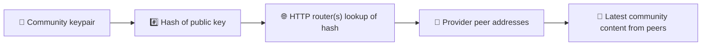
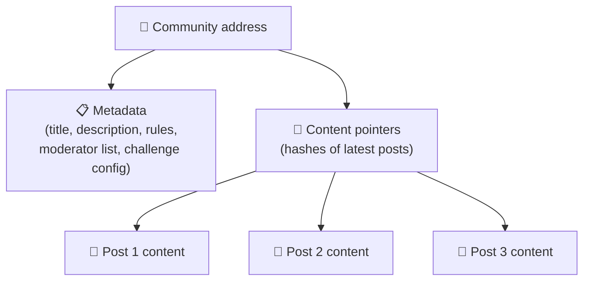
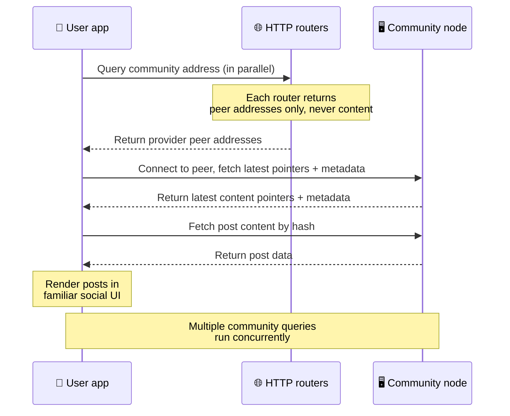
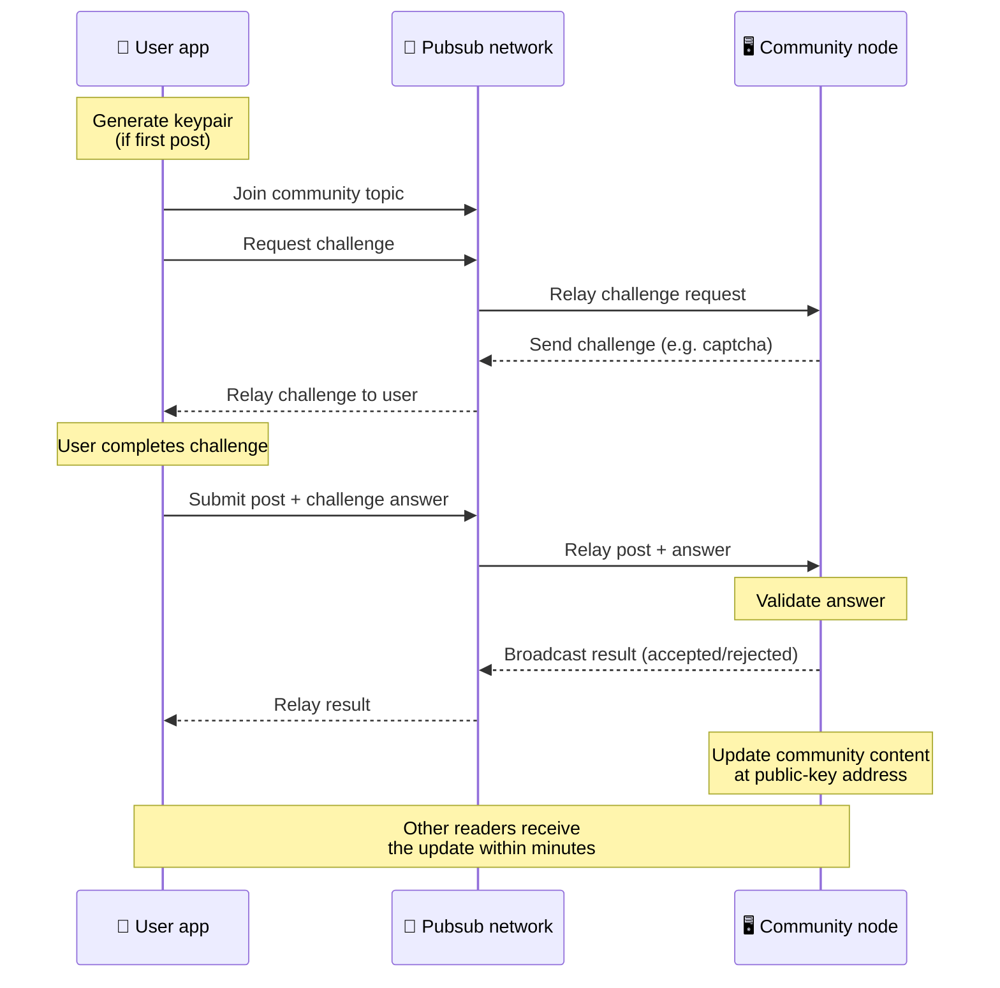
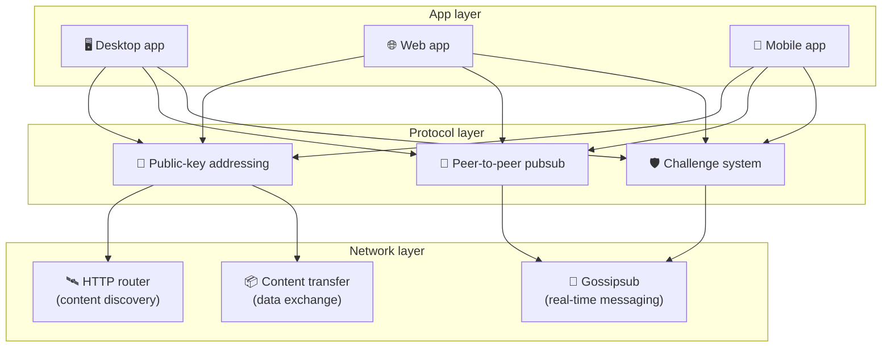

# Protocole peer-to-peer

Bitsocial n'utilise ni blockchain, ni serveur de fédération, ni backend centralisé. Il s'appuie
plutôt sur la pile IPFS/libp2p pour combiner deux idées : l'**adressage par clé publique** et le
**pubsub peer-to-peer**. Ensemble, elles permettent à n'importe qui d'héberger une communauté depuis
du matériel grand public, pendant que les utilisateurs lisent et publient sans compte sur un service
contrôlé par une entreprise.

Pour une présentation moins technique, lisez
[Une explication profane complète du protocole Bitsocial](./layman-protocol-explanation.md).

## Bitsocial utilise-t-il IPFS ?

Oui. Les nœuds Bitsocial utilisent les primitives IPFS/libp2p pour la couche peer-to-peer :
enregistrements de communauté adressés par clé publique, transfert de contenu entre pairs et pubsub
gossipsub pour les messages en temps réel. Lorsque cette documentation parle de « pubsub », il
s'agit du pubsub IPFS/libp2p, et non d'un courtier de messages centralisé distinct.

Le protocole décrit aujourd'hui la découverte via des routeurs HTTP parce que les clients Bitsocial
interrogent des points de terminaison de routeur pour obtenir les adresses des pairs fournisseurs,
au lieu de dépendre à chaque recherche d'une DHT hostile aux navigateurs. Les routeurs ne renvoient
que des pairs ; le transfert de contenu et le trafic pubsub continuent de circuler sur le réseau
peer-to-peer.

## Les deux problèmes

Un réseau social décentralisé doit répondre à deux questions :

1. **Données** — comment stocker et diffuser le contenu social du monde entier sans base de données centrale ?
2. **Spam** — comment empêcher les abus tout en gardant le réseau gratuit ?

Bitsocial résout le problème des données en se passant complètement de blockchain : les médias
sociaux n'ont besoin ni d'un ordre global des transactions, ni de la disponibilité permanente de
chaque ancienne publication. Il résout le problème du spam en laissant chaque communauté exécuter
son propre défi anti-spam sur le réseau peer-to-peer.

Pour le modèle de découverte situé au-dessus de cette couche réseau, voir
[Découverte de contenu](./content-discovery.md).

---

## Adressage par clé publique {#public-key-based-addressing}

Dans BitTorrent, le hachage d'un fichier devient son adresse (_adressage par le contenu_). Bitsocial
applique une idée similaire aux clés publiques : le hachage de la clé publique d'une communauté
devient son adresse réseau.

N'importe quel pair du réseau peut interroger un **routeur HTTP** pour cette adresse : le routeur
répond par la liste des adresses réseau des pairs qui fournissent actuellement le hachage de la
communauté, et le client se connecte directement à ces pairs pour récupérer le dernier état de la
communauté. À chaque mise à jour du contenu, son numéro de version augmente. Le réseau ne conserve
que la dernière version — il n'est pas nécessaire de préserver chaque état historique, et c'est ce
qui rend cette approche légère comparée à une blockchain.

> **Ce que contient réellement un routeur HTTP.** Un routeur HTTP est un index minimal. Pour chaque
> adresse de contenu qu'il connaît, il ne stocke que les adresses réseau des pairs qui se sont
> annoncés comme fournisseurs (couples IP/port, multiadresses libp2p, ce genre de choses). Il ne
> stocke **pas** le contenu de la communauté, ses métadonnées, le texte des publications, la liste
> des membres, ni même le libellé lisible de ce qui se trouve à cette adresse ; il se contente de
> répondre à la question « quels pairs prétendent avoir ce hachage ? ». Les routeurs sont donc peu
> coûteux à faire tourner, faciles à remplacer, et non responsables de ce que les utilisateurs
> publient, un peu comme un tracker BitTorrent mais sans les métadonnées de torrent : un tracker
> associe des infohashes à des pairs, tandis qu'un routeur HTTP associe seulement une adresse de
> contenu à des adresses de pairs fournisseurs.
>
> Par redondance, le client interroge **plusieurs routeurs HTTP en parallèle** et fusionne les
> listes de fournisseurs qu'il reçoit. N'importe qui peut faire tourner un routeur, et remplacer ou
> ajouter des routeurs relève d'un changement de configuration, sans migration de données.
>
> Bitsocial utilise des routeurs HTTP plutôt qu'une DHT parce qu'exploiter une DHT à l'échelle
> nécessaire pour la découverte de contenu coûte cher, en particulier sur mobile. Une DHT ne
> fonctionne pas non plus dans le navigateur, puisque les navigateurs ne peuvent pas rejoindre
> directement une DHT libp2p. Un routeur HTTP tourne à faible coût sur une infrastructure HTTP
> banale et fonctionne aussi bien depuis un téléphone que depuis un navigateur.

### Ce qui est stocké à l'adresse

L'adresse de la communauté ne contient pas directement le contenu complet des publications. Elle
stocke plutôt une liste d'identifiants de contenu — des hachages qui pointent vers les données
réelles. Le client récupère ensuite chaque élément de contenu directement auprès des pairs renvoyés
par les routeurs HTTP. Les routeurs eux-mêmes ne voient ni ne stockent jamais le contenu.

Au moins un pair possède toujours les données : le nœud de l'opérateur de la communauté. Si la
communauté est populaire, beaucoup d'autres pairs les auront aussi et la charge se répartit
d'elle-même, de la même façon que les torrents populaires se téléchargent plus vite.

---

## Pubsub peer-to-peer

Le pubsub (publication-abonnement) est un modèle de messagerie où les pairs s'abonnent à un sujet et
reçoivent tous les messages publiés sur ce sujet. Bitsocial utilise un réseau pubsub peer-to-peer —
tout le monde peut publier, tout le monde peut s'abonner, et il n'existe aucun courtier de messages
central.

Pour envoyer une publication dans une communauté, un utilisateur émet un message dont le sujet
correspond à la clé publique de la communauté. Le nœud de l'opérateur de la communauté le récupère,
le valide et — s'il passe le défi anti-spam — l'inclut dans la prochaine mise à jour du contenu.

---

## Anti-spam : les défis via pubsub

Un réseau pubsub ouvert est vulnérable aux vagues de spam. Bitsocial résout ce problème en exigeant
des auteurs qu'ils réussissent un **défi** avant que leur contenu ne soit accepté.

Le système de défis est souple : chaque opérateur de communauté configure sa propre politique. Parmi
les options possibles :

| Type de défi             | Fonctionnement                                                |
| ------------------------ | ------------------------------------------------------------- |
| **Captcha**              | Énigme visuelle ou interactive présentée dans l'application   |
| **Limitation de débit**  | Limiter les publications par fenêtre de temps et par identité |
| **Jeton requis**         | Exiger la preuve du solde d'un jeton donné                    |
| **Paiement**             | Exiger un petit paiement par publication                      |
| **Liste d'autorisation** | Seules les identités préapprouvées peuvent publier            |
| **Code personnalisé**    | Toute politique exprimable en code                            |

Les pairs qui relaient trop de tentatives de défi échouées sont bloqués du sujet pubsub, ce qui
empêche les attaques par déni de service sur la couche réseau.

---

## Cycle de vie : lire une communauté

Voici ce qui se passe lorsqu'un utilisateur ouvre l'application et consulte les dernières
publications d'une communauté.

**Étape par étape :**

1. L'utilisateur ouvre l'application et voit une interface sociale.
2. Le client interroge plusieurs routeurs HTTP en parallèle pour chaque communauté suivie par
   l'utilisateur ; chaque routeur ne renvoie que des adresses de pairs, jamais de contenu. La
   latence des requêtes dépend des conditions réseau et de la charge des routeurs ; dans des
   conditions habituelles de faible latence, les requêtes aboutissent souvent en une seconde
   environ et s'exécutent simultanément.
3. Une fois qu'il dispose des adresses de pairs, le client se connecte à ces pairs et récupère les
   derniers pointeurs de contenu ainsi que les métadonnées de la communauté (titre, description,
   liste des modérateurs, configuration des défis).
4. Le client récupère le contenu réel des publications à l'aide de ces pointeurs, puis affiche
   l'ensemble dans une interface sociale familière.

---

## Cycle de vie : envoyer une publication

L'envoi passe par une négociation défi-réponse via pubsub avant que la publication ne soit acceptée.

**Étape par étape :**

1. L'application génère une paire de clés pour l'utilisateur s'il n'en a pas encore.
2. L'utilisateur rédige une publication destinée à une communauté.
3. Le client rejoint le sujet pubsub de cette communauté (indexé sur la clé publique de la communauté).
4. Le client demande un défi via pubsub.
5. Le nœud de l'opérateur de la communauté renvoie un défi (par exemple un captcha).
6. L'utilisateur résout le défi.
7. Le client soumet la publication accompagnée de la réponse au défi, via pubsub.
8. Le nœud de l'opérateur de la communauté valide la réponse. Si elle est correcte, la publication est acceptée.
9. Le nœud diffuse le résultat via pubsub afin que les pairs du réseau sachent qu'ils doivent
   continuer à relayer les messages de cet utilisateur.
10. Le nœud met à jour le contenu de la communauté à son adresse de clé publique.
11. En quelques minutes, chaque lecteur de la communauté reçoit la mise à jour.

---

## Vue d'ensemble de l'architecture

Le système complet comporte trois couches qui fonctionnent ensemble :

| Couche          | Rôle                                                                                                                                                                          |
| --------------- | ----------------------------------------------------------------------------------------------------------------------------------------------------------------------------- |
| **Application** | Interface utilisateur. Plusieurs applications peuvent coexister, chacune avec son propre design, toutes partageant les mêmes communautés et les mêmes identités.              |
| **Protocole**   | Définit comment les communautés sont adressées, comment les publications sont diffusées et comment le spam est empêché.                                                       |
| **Réseau**      | L'infrastructure peer-to-peer sous-jacente : routeurs HTTP pour la découverte, gossipsub pour la messagerie en temps réel, et transfert de contenu pour l'échange de données. |

---

## Confidentialité : dissocier les auteurs des adresses IP

Lorsqu'un utilisateur envoie une publication, le contenu est **chiffré avec la clé publique de
l'opérateur de la communauté** avant d'entrer dans le réseau pubsub. Autrement dit, les observateurs
du réseau peuvent constater qu'un pair a publié _quelque chose_, mais ils ne peuvent pas
déterminer :

- ce que dit ce contenu
- quelle identité d'auteur l'a publié

C'est comparable à BitTorrent, où l'on peut découvrir quelles adresses IP partagent un torrent, mais
pas qui l'a créé à l'origine. La couche de chiffrement ajoute une garantie de confidentialité
supplémentaire par-dessus cette base.

---

## Peer-to-peer dans le navigateur

Le P2P dans le navigateur est désormais possible dans les clients Bitsocial. Une application web
peut exécuter un nœud [Helia](https://helia.io/), utiliser la même pile cliente du protocole
Bitsocial que les autres applications, et récupérer le contenu auprès des pairs au lieu de demander
à une passerelle IPFS centralisée de le servir. Le navigateur peut aussi participer directement au
pubsub, si bien que la publication n'a pas besoin d'un fournisseur pubsub appartenant à la
plateforme dans le cas nominal.

C'est le jalon décisif pour la distribution web : un site HTTPS ordinaire peut s'ouvrir sur un
client social P2P actif. Les utilisateurs n'ont pas besoin d'installer une application de bureau
avant de pouvoir lire depuis le réseau, et l'opérateur de l'application n'a pas besoin d'exploiter
une passerelle centrale qui deviendrait le point de blocage, en matière de censure ou de
modération, pour tous les utilisateurs de navigateur.

Le chemin navigateur connaît des limites différentes de celles d'un nœud de bureau ou de serveur :

- un nœud de navigateur ne peut généralement pas accepter de connexions entrantes arbitraires depuis l'internet public
- il peut charger, valider, mettre en cache et publier des données tant que l'application est ouverte
- il ne doit pas être considéré comme l'hôte durable des données d'une communauté
- l'hébergement complet d'une communauté reste mieux assuré par une application de bureau,
  `bitsocial-cli` ou un autre nœud toujours actif

Les routeurs HTTP restent importants pour la découverte de contenu : ils renvoient les adresses des
fournisseurs pour le hachage d'une communauté. Ce ne sont pas des passerelles IPFS, car ils ne
servent pas le contenu eux-mêmes. Après la découverte, le client navigateur se connecte aux pairs et
récupère les données via la pile P2P.

Le P2P dans le navigateur est aujourd'hui le chemin web par défaut, et non une expérimentation
cachée derrière un interrupteur. 5chan fonctionne par défaut en P2P navigateur pur sur 5chan.app, et
le blog Bitsocial sur bitsocial.net fait de même. Les pairs navigateur se connectent via des
WebSockets sécurisés ; `pkc-js` refuse par défaut les connexions WebRTC et WebTransport, car leurs
procédures d'établissement de connexion sont lentes et peu fiables dans le navigateur. Le changement
en amont qui a rendu la publication depuis le navigateur praticable en 2026 est la correction du
numéro de séquence gossipsub dans `@libp2p/gossipsub` 15.0.21, qui a mis fin au rejet, par les pairs
Kubo, des messages publiés par des nœuds JavaScript.

Pour le tableau complet, y compris ce qu'un nœud de navigateur ne sait toujours pas faire, voir
[Peer-to-peer dans le navigateur](/browser-p2p/).

## Repli sur passerelle {#gateway-fallback}

L'accès navigateur via passerelle reste utile comme solution de repli, pour la compatibilité et le
déploiement progressif. Une passerelle peut relayer les données entre le réseau P2P et un client
navigateur lorsque celui-ci ne peut pas rejoindre le réseau directement, ou lorsque l'application
choisit délibérément l'ancien chemin. Ces passerelles :

- peuvent être exploitées par n'importe qui
- ne nécessitent ni compte utilisateur ni paiement
- n'acquièrent aucune garde sur les identités ou les communautés des utilisateurs
- peuvent être remplacées sans perte de données

L'architecture visée place le P2P navigateur en premier, les passerelles n'étant qu'un repli
facultatif plutôt que le goulot d'étranglement par défaut.

---

## Pourquoi pas une blockchain ?

Les blockchains résolvent le problème de la double dépense : elles doivent connaître l'ordre exact
de chaque transaction pour empêcher quelqu'un de dépenser deux fois la même pièce.

Les médias sociaux n'ont pas de problème de double dépense. Peu importe que la publication A ait été
émise une milliseconde avant la publication B, et les anciennes publications n'ont pas besoin d'être
disponibles en permanence sur chaque nœud.

En se passant de blockchain, Bitsocial évite :

- **les frais de gas** — publier est gratuit
- **les limites de débit** — aucun goulot d'étranglement lié à la taille ou au temps de bloc
- **l'inflation du stockage** — les nœuds ne conservent que ce dont ils ont besoin
- **le surcoût du consensus** — ni mineurs, ni validateurs, ni staking

Le compromis, c'est que Bitsocial ne garantit pas la disponibilité permanente des anciens contenus.
Mais pour des médias sociaux, le compromis est acceptable : le nœud de l'opérateur de la communauté
conserve les données, le contenu populaire se propage chez de nombreux pairs, et les publications
très anciennes s'effacent naturellement — exactement comme sur toutes les plateformes sociales.

## Pourquoi pas la fédération ?

Les réseaux fédérés (comme l'e-mail ou les plateformes fondées sur ActivityPub) font mieux que la
centralisation, mais conservent des limites structurelles :

- **Dépendance à un serveur** — chaque communauté a besoin d'un serveur avec un domaine, du TLS et
  une maintenance continue
- **Confiance envers l'administrateur** — l'administrateur du serveur a un contrôle total sur les comptes et les contenus
- **Fragmentation** — changer de serveur signifie souvent perdre ses abonnés, son historique ou son identité
- **Coût** — quelqu'un doit payer l'hébergement, ce qui pousse à la consolidation

L'approche peer-to-peer de Bitsocial retire complètement le serveur de l'équation. Un nœud de
communauté peut tourner sur un ordinateur portable, un Raspberry Pi ou un VPS bon marché.
L'opérateur contrôle la politique de modération mais ne peut pas s'approprier les identités des
utilisateurs, car celles-ci sont contrôlées par des paires de clés et non octroyées par un serveur.

## Et Nostr ?

Nostr n'entre proprement dans aucune de ces deux catégories. Ce n'est pas de la fédération à la
ActivityPub, car les instances ne délivrent pas de comptes aux utilisateurs et l'identité n'est pas
liée à un serveur. Ce n'est pas non plus un réseau social sur blockchain, car il n'y a ni chaîne, ni
consensus, ni gas, ni ordre global des transactions.

On décrit mieux Nostr comme un **réseau social fondé sur des relais**. Dans le protocole de base
([NIP-01](https://github.com/nostr-protocol/nips/blob/master/01.md)), les utilisateurs détiennent
des paires de clés, signent des événements et publient ces événements vers des relais WebSocket. Les
clients s'abonnent aux relais avec des filtres, récupèrent les événements correspondants et
vérifient les signatures localement. Les utilisateurs peuvent aussi publier des métadonnées de liste
de relais ([NIP-65](https://github.com/nostr-protocol/nips/blob/master/65.md)) qui indiquent aux
clients vers quels relais ils écrivent habituellement et quels relais ils préfèrent pour lire les
mentions.

Cela rapproche Nostr de Bitsocial, davantage que les systèmes fédérés ou blockchain, sur un point
important : l'identité y est cryptographique et portable. La principale différence tient à la couche
de données. Dans Nostr, les relais constituent la couche normale de stockage et de diffusion. Dans
Bitsocial, les routeurs HTTP aident seulement les clients à trouver des pairs. Les routeurs ne
stockent ni publications, ni profils, ni métadonnées de communauté, ni état de modération ; ils
renvoient des adresses de pairs fournisseurs, puis les clients récupèrent le contenu auprès des
pairs.

Les communautés font apparaître la même séparation. Nostr propose des schémas optionnels pour les
[groupes fondés sur des relais](https://github.com/nostr-protocol/nips/blob/master/29.md) et les
[communautés approuvées par des modérateurs](https://github.com/nostr-protocol/nips/blob/master/72.md),
mais ceux-ci restent tributaires de la politique des relais, d'un état de groupe hébergé par les
relais, ou des choix du client quant aux approbations à honorer. Bitsocial traite les communautés
comme des objets cryptographiques de premier ordre, dont le nœud opérateur valide les publications,
applique la politique de défis de la communauté et publie le dernier état accepté sur le réseau
peer-to-peer.

| Question                  | Nostr                                                                                                             | Bitsocial                                                                                 |
| ------------------------- | ----------------------------------------------------------------------------------------------------------------- | ----------------------------------------------------------------------------------------- |
| Catégorie                 | Protocole fondé sur des relais                                                                                    | Réseau de communautés peer-to-peer                                                        |
| Identité                  | Clé publique de l'utilisateur                                                                                     | Paires de clés d'utilisateur et de communauté                                             |
| Chemin des données        | Événements signés publiés vers des relais                                                                         | L'adresse de clé publique se résout en pairs ; le contenu est récupéré auprès des pairs   |
| Qui le maintient en ligne | Des relais choisis par les utilisateurs et les clients                                                            | Le nœud propriétaire de la communauté, plus des seeders auxiliaires                       |
| Communautés               | Groupes optionnels fondés sur des relais, ou communautés approuvées par des modérateurs                           | Objets de communauté de premier ordre, avec modération contrôlée par l'opérateur          |
| Anti-spam                 | Politique de relais, authentification, paiement, preuve de travail, filtres client ou approbations de modérateurs | Logique de défi définie par la communauté, appliquée avant inclusion                      |
| Compromis principal       | Identité portable, mais disponibilité et politique dépendantes des relais                                         | Moins de dépendance aux relais, mais aucune garantie de conservation des anciens contenus |

---

## Résumé

Bitsocial repose sur deux primitives : l'adressage par clé publique pour la découverte de contenu,
et le pubsub peer-to-peer pour la communication en temps réel. Ensemble, elles produisent un réseau
social où :

- les communautés sont identifiées par des clés cryptographiques, et non par des noms de domaine
- le contenu se propage entre pairs comme un torrent, au lieu d'être servi depuis une base de données unique
- la résistance au spam est locale à chaque communauté, et non imposée par une plateforme
- les utilisateurs possèdent leur identité grâce à des paires de clés, et non via des comptes révocables
- l'ensemble du système fonctionne sans serveurs, sans blockchains et sans frais de plateforme
