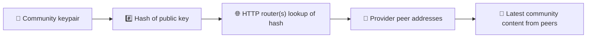
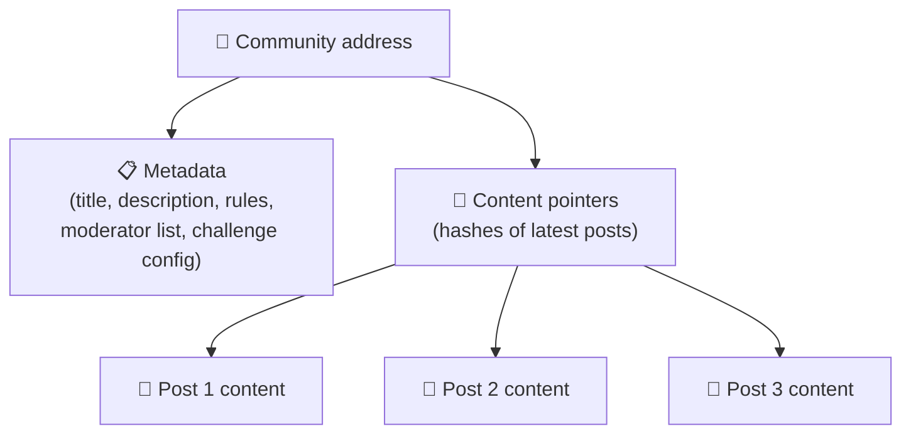
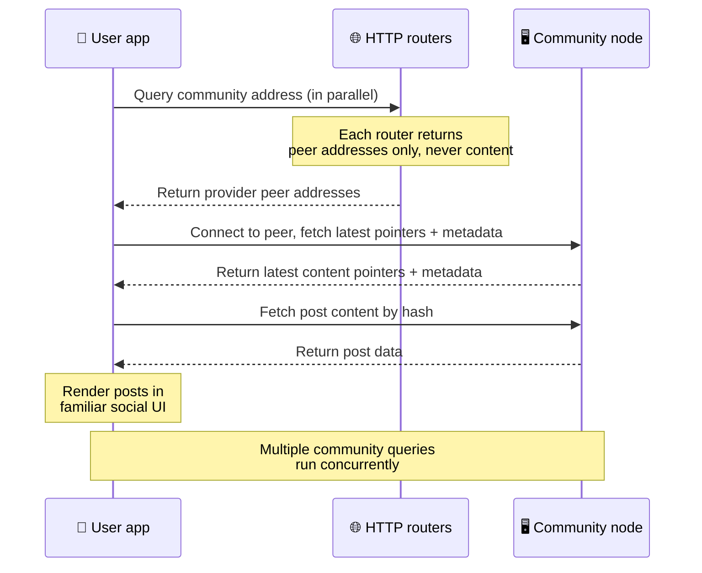
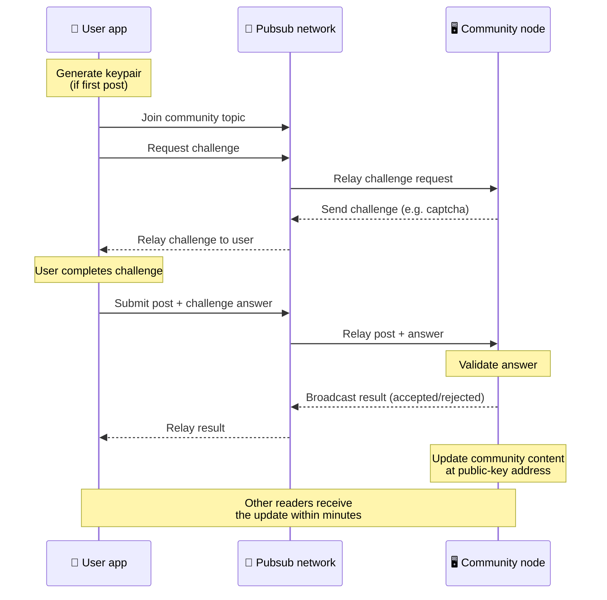
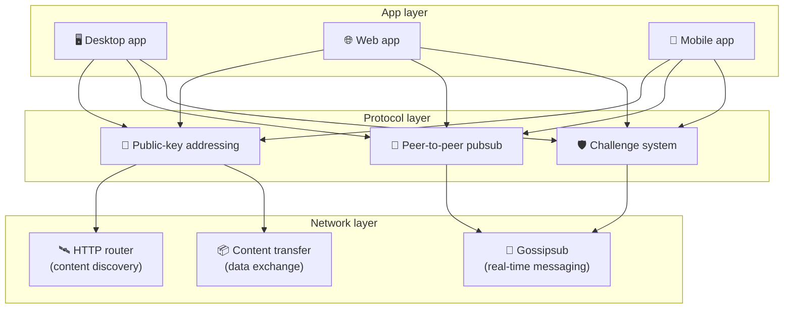

# פרוטוקול עמית לעמית

Bitsocial לא משתמש בבלוקצ'יין, בשרת פדרציה או ב-backend מרוכז. במקום זאת הוא נשען על מחסנית
IPFS/libp2p כדי לשלב שני רעיונות: **מיעון מבוסס מפתח ציבורי** ו-**pubsub עמית לעמית**. יחד הם
מאפשרים לכל אחד לארח קהילה מחומרה ביתית, בזמן שמשתמשים קוראים ומפרסמים בלי חשבונות באף שירות
שנמצא בשליטת חברה.

להסבר טכני פחות, קראו את
[הסבר מלא של פרוטוקול Bitsocial בשפה פשוטה](./layman-protocol-explanation.md).

## האם Bitsocial משתמש ב-IPFS?

כן. צמתי Bitsocial משתמשים בפרימיטיבים של IPFS/libp2p לשכבת העמית לעמית: רשומות קהילה הממוענות לפי
מפתח ציבורי, העברת תוכן בין עמיתים, ו-pubsub מסוג gossipsub להודעות בזמן אמת. כשהתיעוד הזה אומר
"pubsub", הכוונה היא ל-pubsub של IPFS/libp2p ולא למתווך הודעות מרוכז ונפרד.

הפרוטוקול מתאר כיום גילוי דרך נתבי HTTP, משום שלקוחות Bitsocial מתשאלים נקודות קצה של נתבים כדי
לקבל כתובות של עמיתים ספקים במקום להסתמך בכל חיפוש על DHT שאינו ידידותי לדפדפן. הנתבים מחזירים
עמיתים בלבד; העברת התוכן ותעבורת ה-pubsub ממשיכות לזרום דרך רשת העמית לעמית.

## שתי הבעיות

רשת חברתית מבוזרת חייבת לענות על שתי שאלות:

1. **נתונים** — איך מאחסנים ומגישים את התוכן החברתי של העולם בלי מסד נתונים מרכזי?
2. **ספאם** — איך מונעים שימוש לרעה ובו בזמן שומרים על רשת חופשית לשימוש?

Bitsocial פותר את בעיית הנתונים בכך שהוא מוותר על הבלוקצ'יין לחלוטין: מדיה חברתית לא זקוקה לסדר
עסקאות גלובלי ולא לזמינות תמידית של כל פוסט ישן. את בעיית הספאם הוא פותר בכך שכל קהילה מפעילה אתגר
אנטי-ספאם משלה מעל רשת העמית לעמית.

למודל הגילוי שמעל שכבת הרשת הזו, ראו [גילוי תוכן](./content-discovery.md).

---

## מיעון מבוסס מפתח ציבורי {#public-key-based-addressing}

ב-BitTorrent, ה-hash של קובץ הוא הכתובת שלו (_מיעון מבוסס תוכן_). Bitsocial משתמש ברעיון דומה עם
מפתחות ציבוריים: ה-hash של המפתח הציבורי של קהילה הופך לכתובת הרשת שלה.

כל עמית ברשת יכול לתשאל **נתב HTTP** על הכתובת הזו: הנתב מחזיר רשימה של כתובות רשת של עמיתים
שמספקים כרגע את ה-hash של הקהילה, והלקוח מתחבר לאותם עמיתים ישירות כדי למשוך את המצב העדכני של
הקהילה. בכל פעם שהתוכן מתעדכן, מספר הגרסה שלו עולה. הרשת שומרת רק את הגרסה האחרונה — אין צורך לשמר
כל מצב היסטורי, וזה מה שהופך את הגישה הזו לקלה בהרבה מבלוקצ'יין.

> **מה נתב HTTP באמת מחזיק.** נתב HTTP הוא אינדקס דק. לכל כתובת תוכן שהוא מכיר הוא שומר רק את כתובות
> הרשת של העמיתים שהכריזו על עצמם כספקים (זוגות IP/פורט, כתובות multiaddr של libp2p וכדומה). הוא
> **לא** מאחסן את תוכן הקהילה, את המטא-נתונים שלה, את טקסט הפוסטים, את רשימת החברים ואפילו לא את
> התווית הקריאה לבני אדם של מה שנמצא בכתובת הזו; הוא רק עונה על השאלה "אילו עמיתים טוענים שיש להם את
> ה-hash הזה?". זה הופך את הנתבים לזולים להפעלה, קלים להחלפה ולא אחראים למה שמשתמשים מפרסמים, בדומה
> ל-tracker של BitTorrent אך בלי מטא-נתוני טורנט: tracker ממפה infohash לעמיתים, בעוד שנתב HTTP ממפה
> כתובת תוכן בלבד לכתובות של עמיתים ספקים.
>
> לצורך יתירות, הלקוח מתשאל **כמה נתבי HTTP במקביל** וממזג את רשימות הספקים שהוא מקבל בחזרה. כל אחד
> יכול להפעיל נתב, והחלפה או הוספה של נתבים היא שינוי תצורה בלבד, בלי הגירת נתונים.
>
> Bitsocial משתמש בנתבי HTTP במקום ב-DHT, כי הפעלת DHT בקנה המידה הדרוש לגילוי תוכן היא יקרה,
> במיוחד במובייל. DHT גם לא עובד בדפדפן, מכיוון שדפדפנים לא יכולים להצטרף ישירות ל-DHT של libp2p.
> נתב HTTP רץ בזול על תשתית HTTP סטנדרטית ועובד באותה מידה מטלפון או מדפדפן.

### מה נשמר בכתובת

כתובת הקהילה לא מכילה ישירות את תוכן הפוסטים המלא. במקום זאת היא מאחסנת רשימה של מזהי תוכן — ערכי
hash שמצביעים על הנתונים עצמם. הלקוח מושך אז כל פיסת תוכן ישירות מהעמיתים שנתבי ה-HTTP החזירו.
הנתבים עצמם אף פעם לא רואים את התוכן ולא מאחסנים אותו.

לפחות לעמית אחד תמיד יש את הנתונים: הצומת של מפעיל הקהילה. אם הקהילה פופולרית, גם לעמיתים רבים
אחרים יהיו הנתונים והעומס יתחלק מעצמו, בדיוק כפי שטורנטים פופולריים יורדים מהר יותר.

---

## pubsub עמית לעמית

Pubsub (פרסום-מנוי) הוא דפוס הודעות שבו עמיתים נרשמים לנושא ומקבלים כל הודעה שמתפרסמת בו. Bitsocial
משתמש ברשת pubsub עמית לעמית — כל אחד יכול לפרסם, כל אחד יכול להירשם, ואין מתווך הודעות מרכזי.

כדי לפרסם פוסט בקהילה, המשתמש מפרסם הודעה שהנושא שלה זהה למפתח הציבורי של הקהילה. הצומת של מפעיל
הקהילה קולט אותה, מאמת אותה, ואם היא עוברת את אתגר האנטי-ספאם — מכליל אותה בעדכון התוכן הבא.

---

## אנטי-ספאם: אתגרים מעל pubsub

רשת pubsub פתוחה חשופה להצפות ספאם. Bitsocial פותר זאת בכך שהוא דורש מהמפרסמים להשלים **אתגר** לפני
שהתוכן שלהם מתקבל.

מערכת האתגרים גמישה: כל מפעיל קהילה מגדיר מדיניות משלו. בין האפשרויות:

| סוג האתגר           | איך זה עובד                                  |
| ------------------- | -------------------------------------------- |
| **קפצ'ה**           | חידה חזותית או אינטראקטיבית שמוצגת באפליקציה |
| **הגבלת קצב**       | הגבלת מספר הפוסטים לכל זהות בחלון זמן נתון   |
| **שער אסימונים**    | דרישה להוכחת יתרה של אסימון מסוים            |
| **תשלום**           | דרישה לתשלום קטן על כל פוסט                  |
| **רשימת היתר**      | רק זהויות שאושרו מראש יכולות לפרסם           |
| **קוד מותאם אישית** | כל מדיניות שאפשר לבטא בקוד                   |

עמיתים שמעבירים יותר מדי ניסיונות אתגר כושלים נחסמים מנושא ה-pubsub, וכך נמנעות התקפות מניעת שירות
על שכבת הרשת.

---

## מחזור חיים: קריאת קהילה

כך נראים הדברים כשמשתמש פותח את האפליקציה וצופה בפוסטים האחרונים של קהילה.

**שלב אחר שלב:**

1. המשתמש פותח את האפליקציה ורואה ממשק חברתי.
2. הלקוח מתשאל כמה נתבי HTTP במקביל עבור כל קהילה שהמשתמש עוקב אחריה; כל נתב מחזיר כתובות של עמיתים
   בלבד, אף פעם לא תוכן. זמן התגובה של שאילתה תלוי בתנאי הרשת ובעומס על הנתב; בתנאים טיפוסיים של
   השהיה נמוכה, שאילתות חוזרות לרוב בתוך כשנייה ורצות במקביל.
3. ברגע שיש ללקוח כתובות של עמיתים, הוא מתחבר לאותם עמיתים ומושך את מצביעי התוכן והמטא-נתונים
   העדכניים של הקהילה (כותרת, תיאור, רשימת מודרטורים, תצורת האתגר).
4. הלקוח מושך את תוכן הפוסטים עצמו באמצעות המצביעים האלה, ואז מציג את הכול בממשק חברתי מוכר.

---

## מחזור חיים: פרסום פוסט

פרסום כרוך בלחיצת יד של אתגר-ותשובה מעל pubsub לפני שהפוסט מתקבל.

**שלב אחר שלב:**

1. האפליקציה מייצרת זוג מפתחות עבור המשתמש אם עדיין אין לו כזה.
2. המשתמש כותב פוסט עבור קהילה.
3. הלקוח מצטרף לנושא ה-pubsub של אותה קהילה (הנושא נגזר מהמפתח הציבורי של הקהילה).
4. הלקוח מבקש אתגר מעל pubsub.
5. הצומת של מפעיל הקהילה שולח בחזרה אתגר (למשל קפצ'ה).
6. המשתמש פותר את האתגר.
7. הלקוח שולח את הפוסט יחד עם התשובה לאתגר מעל pubsub.
8. הצומת של מפעיל הקהילה מאמת את התשובה. אם היא נכונה, הפוסט מתקבל.
9. הצומת משדר את התוצאה מעל pubsub כדי שעמיתי הרשת ידעו להמשיך להעביר הודעות
   מהמשתמש הזה.
10. הצומת מעדכן את תוכן הקהילה בכתובת המבוססת על המפתח הציבורי שלה.
11. בתוך דקות ספורות, כל קורא של הקהילה מקבל את העדכון.

---

## סקירת הארכיטקטורה

למערכת המלאה יש שלוש שכבות שעובדות יחד:

| שכבה         | תפקיד                                                                                                 |
| ------------ | ----------------------------------------------------------------------------------------------------- |
| **אפליקציה** | ממשק המשתמש. יכולות להתקיים כמה אפליקציות, לכל אחת עיצוב משלה, וכולן חולקות אותן קהילות ואותן זהויות. |
| **פרוטוקול** | מגדיר איך ממענים קהילות, איך מפרסמים פוסטים ואיך מונעים ספאם.                                         |
| **רשת**      | תשתית העמית לעמית שמתחת: נתבי HTTP לגילוי, gossipsub להודעות בזמן אמת, והעברת תוכן לחילופי נתונים.    |

---

## פרטיות: ניתוק הקשר בין מחברים לכתובות IP

כשמשתמש מפרסם פוסט, התוכן **מוצפן במפתח הציבורי של מפעיל הקהילה** לפני שהוא נכנס לרשת ה-pubsub.
כלומר, בעוד שמשקיפים ברשת יכולים לראות שעמית מסוים פרסם _משהו_, הם לא יכולים לקבוע:

- מה כתוב בתוכן
- איזו זהות של מחבר פרסמה אותו

זה דומה לאופן שבו ב-BitTorrent אפשר לגלות אילו כתובות IP מזרימות טורנט, אבל לא מי יצר אותו במקור.
שכבת ההצפנה מוסיפה הבטחת פרטיות נוספת מעל הבסיס הזה.

---

## עמית לעמית בדפדפן

P2P בדפדפן כבר אפשרי בלקוחות Bitsocial. אפליקציית דפדפן יכולה להריץ צומת
[Helia](https://helia.io/), להשתמש באותה מחסנית לקוח של פרוטוקול Bitsocial כמו שאר האפליקציות,
ולמשוך תוכן מעמיתים במקום לבקש משער IPFS מרוכז להגיש אותו. הדפדפן יכול גם להשתתף ב-pubsub ישירות,
כך שפרסום לא מצריך ספק pubsub בבעלות פלטפורמה במסלול התקין.

זו אבן הדרך המשמעותית להפצה בווב: אתר HTTPS רגיל יכול להיפתח כלקוח חברתי P2P חי. משתמשים לא צריכים
להתקין אפליקציית דסקטופ כדי לקרוא מהרשת, ומפעיל האפליקציה לא צריך להפעיל שער מרכזי שהופך לנקודת החנק
של הצנזורה או המודרציה עבור כל משתמשי הדפדפן.

למסלול הדפדפן יש מגבלות שונות מאלה של צומת דסקטופ או שרת:

- צומת בדפדפן בדרך כלל לא יכול לקבל חיבורים נכנסים שרירותיים מהאינטרנט הציבורי
- הוא יכול לטעון, לאמת, לשמור במטמון ולפרסם נתונים כל עוד האפליקציה פתוחה
- אין להתייחס אליו כאל המארח ארוך-הטווח של נתוני הקהילה
- אירוח קהילה מלא עדיין נעשה בצורה הטובה ביותר באמצעות אפליקציית דסקטופ, `bitsocial-cli` או צומת אחר
  שפעיל תמיד

נתבי HTTP עדיין חשובים לגילוי תוכן: הם מחזירים כתובות של ספקים עבור ה-hash של הקהילה. הם אינם שערי
IPFS, כי הם לא מגישים את התוכן עצמו. אחרי הגילוי, לקוח הדפדפן מתחבר לעמיתים ומושך את הנתונים דרך
מחסנית ה-P2P.

P2P בדפדפן הוא כיום מסלול הווב שמוגדר כברירת מחדל, ולא ניסוי מאחורי מתג. 5chan מריץ P2P טהור בדפדפן
כברירת מחדל בכתובת 5chan.app, והבלוג של Bitsocial ב-bitsocial.net עושה את אותו הדבר. עמיתים בדפדפן
מחייגים מעל WebSockets מאובטחים; `pkc-js` חוסם כברירת מחדל חיוג ב-WebRTC וב-WebTransport, מכיוון
שמסלולי יצירת החיבור שלהם איטיים ולא אמינים בדפדפן. השינוי במעלה הזרם שהפך את הפרסום מהדפדפן למעשי
ב-2026 היה תיקון מספר הסידור של gossipsub בגרסה 15.0.21 של `@libp2p/gossipsub`, שהפסיק מצב שבו
עמיתי Kubo השליכו הודעות שפורסמו על ידי צמתי JavaScript.

לתמונה המלאה, כולל מה שצומת בדפדפן עדיין לא יכול לעשות, ראו
[עמית לעמית בדפדפן](/browser-p2p/).

## גיבוי דרך שער {#gateway-fallback}

גישה מהדפדפן דרך שער עדיין שימושית כמסלול גיבוי לתאימות ולהשקה הדרגתית. שער יכול להעביר נתונים בין
רשת ה-P2P לבין לקוח הדפדפן כשהדפדפן לא מצליח להצטרף לרשת ישירות, או כשהאפליקציה בוחרת במכוון במסלול
הישן. השערים האלה:

- יכולים להיות מופעלים על ידי כל אחד
- לא דורשים חשבונות משתמש או תשלומים
- לא מקבלים חזקה על זהויות של משתמשים או על קהילות
- ניתנים להחלפה בלי לאבד נתונים

ארכיטקטורת היעד היא P2P בדפדפן קודם כול, עם שערים כגיבוי אופציונלי ולא כצוואר בקבוק שמוגדר כברירת
מחדל.

---

## למה לא בלוקצ'יין?

בלוקצ'יינים פותרים את בעיית ההוצאה הכפולה: הם צריכים לדעת את הסדר המדויק של כל עסקה כדי למנוע ממישהו
להוציא את אותו מטבע פעמיים.

למדיה חברתית אין בעיית הוצאה כפולה. לא משנה אם פוסט א' פורסם מילישנייה אחת לפני פוסט ב', ופוסטים
ישנים לא חייבים להיות זמינים לצמיתות בכל צומת.

הוויתור על הבלוקצ'יין חוסך ל-Bitsocial את אלה:

- **עמלות גז** — הפרסום חינמי
- **מגבלות תפוקה** — אין צוואר בקבוק של גודל בלוק או זמן בלוק
- **התנפחות אחסון** — צמתים שומרים רק את מה שהם צריכים
- **תקורת קונצנזוס** — אין צורך בכורים, במאמתים או בהפקדת ערבונות

הפשרה היא ש-Bitsocial לא מבטיח זמינות תמידית של תוכן ישן. אבל עבור מדיה חברתית זו פשרה סבירה: הצומת
של מפעיל הקהילה מחזיק את הנתונים, תוכן פופולרי מתפזר בין עמיתים רבים, ופוסטים ישנים מאוד דוהים באופן
טבעי — בדיוק כפי שקורה בכל פלטפורמה חברתית.

## למה לא פדרציה?

רשתות פדרטיביות (כמו דוא"ל או פלטפורמות מבוססות ActivityPub) משפרות את המצב לעומת ריכוזיות, אבל עדיין
סובלות ממגבלות מבניות:

- **תלות בשרת** — כל קהילה זקוקה לשרת עם דומיין, TLS ותחזוקה
  שוטפת
- **אמון במנהל** — למנהל השרת יש שליטה מלאה על חשבונות המשתמשים ועל התוכן
- **פיצול** — מעבר בין שרתים פירושו לעיתים קרובות אובדן עוקבים, היסטוריה או זהות
- **עלות** — מישהו צריך לשלם על האירוח, וזה יוצר לחץ לכיוון ריכוז

הגישה של Bitsocial, עמית לעמית, מוציאה את השרת מהמשוואה לגמרי. צומת קהילה יכול לרוץ על מחשב נייד, על
Raspberry Pi או על VPS זול. המפעיל שולט במדיניות המודרציה אך לא יכול לתפוס זהויות של משתמשים, כי
הזהויות נשלטות בזוג מפתחות ולא ניתנות על ידי שרת.

## מה לגבי Nostr?

Nostr לא נכנס בצורה נקייה לאף אחת מהקטגוריות. זו לא פדרציה בסגנון ActivityPub, כי משתמשים לא מקבלים
חשבונות ממופעים והזהות לא קשורה לשרת אחד. זו גם לא מדיה חברתית מבוססת בלוקצ'יין, כי אין שרשרת,
קונצנזוס, גז או סדר עסקאות גלובלי.

עדיף לתאר את Nostr כמדיה חברתית **מבוססת ממסרים**. בפרוטוקול הבסיסי
([NIP-01](https://github.com/nostr-protocol/nips/blob/master/01.md)), משתמשים מחזיקים זוגות מפתחות,
חותמים על אירועים ומפרסמים את האירועים האלה לממסרי WebSocket. לקוחות נרשמים לממסרים עם מסננים,
מושכים אירועים תואמים ומאמתים חתימות מקומית. משתמשים יכולים גם לפרסם מטא-נתונים של רשימת ממסרים
([NIP-65](https://github.com/nostr-protocol/nips/blob/master/65.md)) שמספרים ללקוחות לאילו ממסרים הם
כותבים בדרך כלל ואילו ממסרים הם מעדיפים לקריאת אזכורים.

זה מקרב את Nostr ל-Bitsocial יותר מאשר מערכות פדרטיביות או מבוססות בלוקצ'יין בהיבט אחד חשוב: הזהות
היא קריפטוגרפית וניידת. ההבדל העיקרי הוא שכבת הנתונים. ב-Nostr, הממסרים הם שכבת האחסון וההגשה
הרגילה. ב-Bitsocial, נתבי HTTP רק עוזרים ללקוחות למצוא עמיתים. הנתבים לא מאחסנים פוסטים, פרופילים,
מטא-נתונים של קהילות או מצב מודרציה; הם מחזירים כתובות של עמיתים ספקים, ואז הלקוחות מושכים את התוכן
מהעמיתים.

בקהילות מופיע אותו פיצול בדיוק. ל-Nostr יש דפוסים אופציונליים של
[קבוצות מבוססות ממסרים](https://github.com/nostr-protocol/nips/blob/master/29.md) ושל
[קהילות באישור מודרטורים](https://github.com/nostr-protocol/nips/blob/master/72.md), אבל הם עדיין
תלויים במדיניות הממסר, במצב קבוצה שמאוחסן בממסר, או בהחלטות של הלקוח אילו אישורים לכבד. Bitsocial
מתייחס לקהילות כאל אובייקטים קריפטוגרפיים מהמעלה הראשונה, שצומת המפעיל שלהם מאמת פוסטים, מפעיל את
מדיניות האתגר של הקהילה ומפרסם את המצב המאושר העדכני אל רשת העמית לעמית.

| שאלה                 | Nostr                                                                     | Bitsocial                                                    |
| -------------------- | ------------------------------------------------------------------------- | ------------------------------------------------------------ |
| קטגוריה              | פרוטוקול מבוסס ממסרים                                                     | רשת קהילות עמית לעמית                                        |
| זהות                 | המפתח הציבורי של המשתמש                                                   | זוגות מפתחות של משתמשים ושל קהילות                           |
| מסלול הנתונים        | אירועים חתומים שמתפרסמים לממסרים                                          | כתובת מבוססת מפתח ציבורי מובילה לעמיתים; התוכן נמשך מהעמיתים |
| מי משאיר את זה מקוון | ממסרים שנבחרים על ידי משתמשים ולקוחות                                     | הצומת של בעל הקהילה בתוספת צמתי seeder עוזרים                |
| קהילות               | קבוצות אופציונליות מבוססות ממסרים או קהילות באישור מודרטורים              | אובייקטי קהילה מהמעלה הראשונה עם מודרציה בשליטת המפעיל       |
| אנטי-ספאם            | מדיניות ממסר, אימות, תשלום, proof-of-work, מסנני לקוח או אישורי מודרטורים | לוגיקת אתגר שהקהילה מגדירה, עוד לפני ההכללה                  |
| הפשרה העיקרית        | זהות ניידת, אך זמינות ומדיניות שתלויות בממסרים                            | פחות תלות בממסרים, אך אין ערובה שתוכן ישן יישמר לנצח         |

---

## סיכום

Bitsocial בנוי על שני פרימיטיבים: מיעון מבוסס מפתח ציבורי לגילוי תוכן, ו-pubsub עמית לעמית לתקשורת
בזמן אמת. יחד הם יוצרים רשת חברתית שבה:

- קהילות מזוהות באמצעות מפתחות קריפטוגרפיים, ולא באמצעות שמות דומיין
- תוכן מתפזר בין עמיתים כמו טורנט, במקום להיות מוגש ממסד נתונים יחיד
- העמידות לספאם היא מקומית לכל קהילה, ולא נכפית על ידי פלטפורמה
- משתמשים מחזיקים בזהויות שלהם דרך זוגות מפתחות, ולא דרך חשבונות שאפשר לשלול
- המערכת כולה פועלת בלי שרתים, בלי בלוקצ'יין ובלי עמלות פלטפורמה
