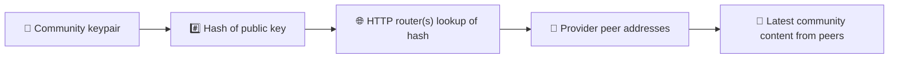
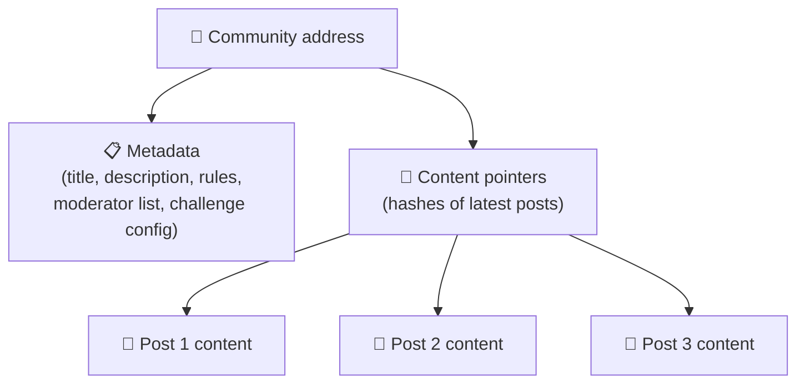
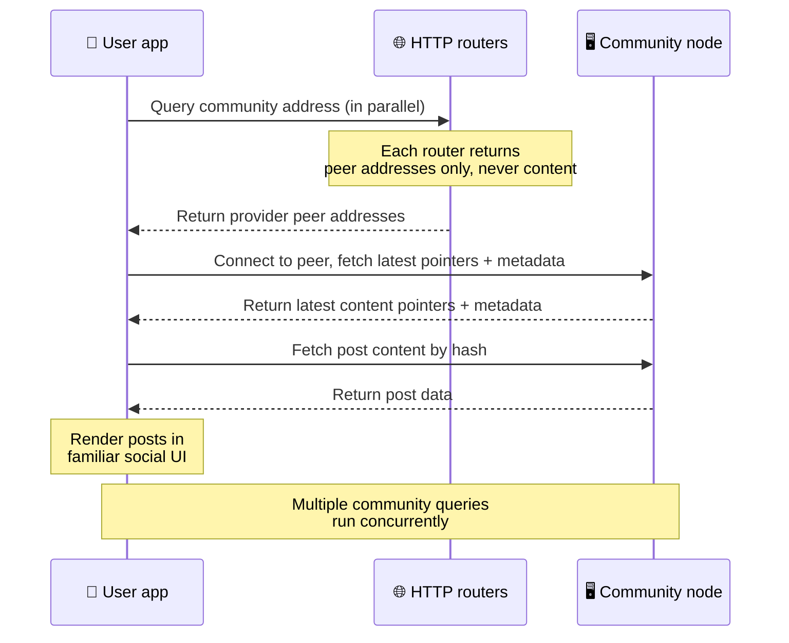
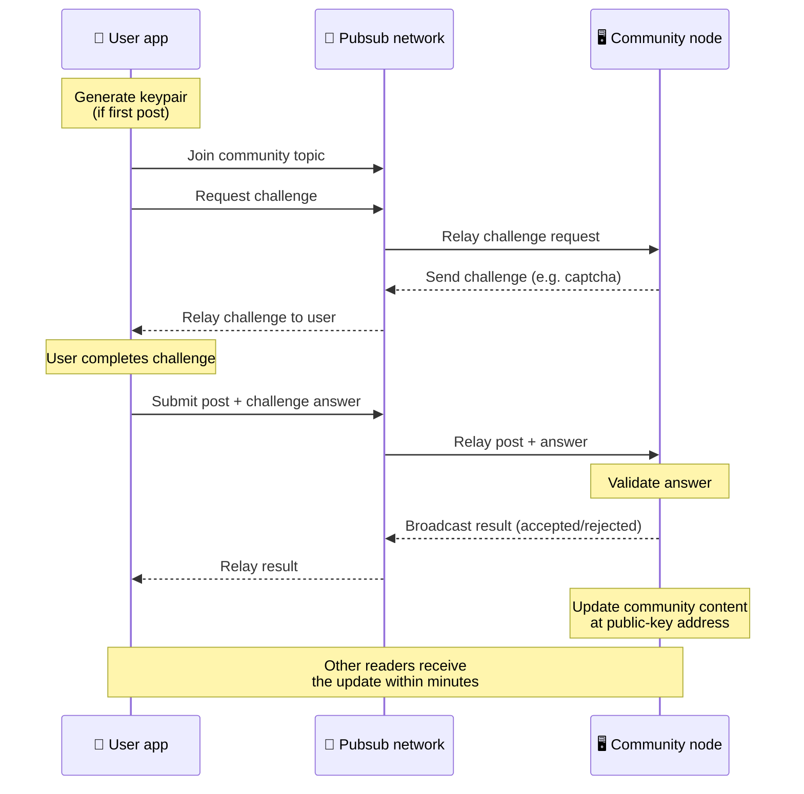
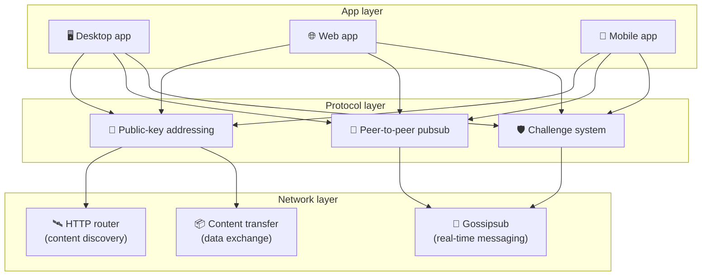

# पीयर-टू-पीयर प्रोटोकॉल

Bitsocial न तो किसी ब्लॉकचेन का उपयोग करता है, न किसी फ़ेडरेशन सर्वर का और न ही किसी केंद्रीकृत बैकएंड
का। इसके बजाय वह IPFS/libp2p स्टैक के सहारे दो विचारों को जोड़ता है — **सार्वजनिक-कुंजी-आधारित एड्रेसिंग**
और **पीयर-टू-पीयर pubsub**। दोनों मिलकर किसी को भी आम उपभोक्ता हार्डवेयर से समुदाय होस्ट करने देते हैं,
जबकि उपयोगकर्ता किसी कंपनी-नियंत्रित सेवा पर खाता बनाए बिना पढ़ते और पोस्ट करते हैं।

कम तकनीकी विवरण के लिए
[Bitsocial प्रोटोकॉल की पूरी सरल व्याख्या](./layman-protocol-explanation.md) पढ़ें।

## क्या Bitsocial IPFS का उपयोग करता है?

हाँ। Bitsocial नोड्स पीयर-टू-पीयर परत के लिए IPFS/libp2p प्रिमिटिव्स का उपयोग करते हैं — सार्वजनिक-कुंजी
से एड्रेस किए गए समुदाय रिकॉर्ड, पीयर्स के बीच सामग्री का स्थानांतरण, और रीयल-टाइम संदेशों के लिए
gossipsub pubsub। जब ये दस्तावेज़ "pubsub" कहते हैं, तो उनका मतलब IPFS/libp2p pubsub होता है, किसी अलग
केंद्रीकृत मैसेज ब्रोकर से नहीं।

प्रोटोकॉल फ़िलहाल खोज को HTTP राउटर्स के ज़रिए बताता है, क्योंकि Bitsocial क्लाइंट हर लुकअप के लिए
ब्राउज़र-विरोधी DHT पर निर्भर रहने के बजाय प्रदाता पीयर पते पाने के लिए राउटर एंडपॉइंट्स से पूछते हैं।
राउटर केवल पीयर लौटाते हैं; सामग्री का स्थानांतरण और pubsub ट्रैफ़िक अब भी पीयर-टू-पीयर नेटवर्क से ही
गुज़रता है।

## दो समस्याएँ

एक विकेंद्रीकृत सोशल नेटवर्क को दो सवालों के जवाब देने होते हैं:

1. **डेटा** — केंद्रीय डेटाबेस के बिना दुनिया की सामाजिक सामग्री को संग्रहित और वितरित कैसे किया जाए?
2. **स्पैम** — नेटवर्क को मुफ़्त रखते हुए दुरुपयोग को कैसे रोका जाए?

Bitsocial ब्लॉकचेन को पूरी तरह छोड़कर डेटा की समस्या हल करता है: सोशल मीडिया को न वैश्विक लेनदेन क्रम
चाहिए और न हर पुरानी पोस्ट की स्थायी उपलब्धता। स्पैम की समस्या वह हर समुदाय को पीयर-टू-पीयर नेटवर्क पर
अपनी एंटी-स्पैम चुनौती चलाने देकर हल करता है।

इस नेटवर्क परत के ऊपर बैठने वाले खोज मॉडल के लिए [सामग्री खोज](./content-discovery.md) देखें।

---

## सार्वजनिक-कुंजी-आधारित एड्रेसिंग {#public-key-based-addressing}

BitTorrent में किसी फ़ाइल का हैश ही उसका पता बन जाता है (_सामग्री-आधारित एड्रेसिंग_)। Bitsocial
सार्वजनिक कुंजियों के साथ यही विचार अपनाता है: किसी समुदाय की सार्वजनिक कुंजी का हैश उसका नेटवर्क पता
बन जाता है।

नेटवर्क का कोई भी पीयर उस पते के लिए किसी **HTTP राउटर** से पूछ सकता है: राउटर उन पीयर नेटवर्क पतों की
सूची लौटाता है जो इस समय समुदाय का हैश उपलब्ध करा रहे हैं, और क्लाइंट सीधे उन पीयर्स से जुड़कर समुदाय की
नवीनतम स्थिति ले आता है। जब भी सामग्री अपडेट होती है, उसका संस्करण नंबर बढ़ जाता है। नेटवर्क केवल नवीनतम
संस्करण रखता है — हर पुरानी स्थिति सहेजने की ज़रूरत नहीं होती, और यही बात इस तरीके को ब्लॉकचेन की तुलना
में हल्का बनाती है।

> **HTTP राउटर असल में क्या रखता है।** HTTP राउटर एक पतला इंडेक्स भर है। वह जिस भी सामग्री पते को जानता
> है, उसके लिए केवल उन पीयर्स के नेटवर्क पते रखता है जिन्होंने खुद को प्रदाता घोषित किया है (IP/पोर्ट
> जोड़े, libp2p multiaddrs, इसी तरह की चीज़ें)। वह समुदाय की सामग्री, उसका मेटाडेटा, पोस्ट का टेक्स्ट,
> सदस्य सूची, या उस पते पर क्या है इसका मानव-पठनीय नाम तक संग्रहित **नहीं** करता; वह सिर्फ़ इतना बताता
> है कि "इस हैश के होने का दावा कौन-से पीयर करते हैं?"। इससे राउटर चलाना सस्ता रहता है, उन्हें बदलना
> आसान रहता है, और उपयोगकर्ताओं द्वारा प्रकाशित सामग्री के लिए वे ज़िम्मेदार नहीं होते — कुछ-कुछ
> BitTorrent ट्रैकर जैसा, पर टॉरेंट मेटाडेटा के बिना: ट्रैकर इन्फ़ोहैश को पीयर्स से जोड़ता है, जबकि HTTP
> राउटर सिर्फ़ एक सामग्री पते को प्रदाता पीयर पतों से जोड़ता है।
>
> अतिरिक्त भरोसे के लिए क्लाइंट **कई HTTP राउटर्स से समानांतर में** पूछता है और वापस मिली प्रदाता सूचियों
> को आपस में मिला देता है। राउटर कोई भी चला सकता है, और राउटर बदलना या जोड़ना महज़ एक कॉन्फ़िग बदलाव है
> जिसमें कोई डेटा माइग्रेशन नहीं लगता।
>
> Bitsocial DHT के बजाय HTTP राउटर्स का उपयोग करता है क्योंकि सामग्री खोज के लिए ज़रूरी पैमाने पर DHT
> चलाना महँगा है, खासकर मोबाइल पर। DHT ब्राउज़र में काम भी नहीं करता, क्योंकि ब्राउज़र सीधे libp2p DHT
> से नहीं जुड़ सकते। HTTP राउटर सामान्य HTTP इन्फ़्रास्ट्रक्चर पर सस्ते में चलता है और फ़ोन या ब्राउज़र
> से भी उतनी ही अच्छी तरह काम करता है।

### पते पर क्या संग्रहित होता है

समुदाय के पते में पोस्ट की पूरी सामग्री सीधे नहीं रखी जाती। उसकी जगह वहाँ सामग्री पहचानकर्ताओं की सूची
रहती है — ऐसे हैश जो असली डेटा की ओर इशारा करते हैं। इसके बाद क्लाइंट हर हिस्से को सीधे उन पीयर्स से लाता
है जो HTTP राउटर्स ने लौटाए थे। राउटर खुद न कभी सामग्री देखते हैं और न उसे संग्रहित करते हैं।

कम से कम एक पीयर के पास डेटा हमेशा रहता है: समुदाय संचालक का नोड। अगर समुदाय लोकप्रिय है, तो कई दूसरे
पीयर्स के पास भी वह डेटा होगा और भार अपने आप बँट जाएगा — ठीक वैसे ही जैसे लोकप्रिय टॉरेंट तेज़ी से
डाउनलोड होते हैं।

---

## पीयर-टू-पीयर pubsub

Pubsub (पब्लिश-सब्सक्राइब) एक मैसेजिंग पैटर्न है जिसमें पीयर किसी विषय की सदस्यता लेते हैं और उस विषय पर
प्रकाशित हर संदेश उन्हें मिलता है। Bitsocial एक पीयर-टू-पीयर pubsub नेटवर्क का उपयोग करता है — कोई भी
प्रकाशित कर सकता है, कोई भी सदस्यता ले सकता है, और बीच में कोई केंद्रीय मैसेज ब्रोकर नहीं होता।

किसी समुदाय में पोस्ट प्रकाशित करने के लिए उपयोगकर्ता ऐसा संदेश प्रकाशित करता है जिसका विषय उस समुदाय की
सार्वजनिक कुंजी होता है। समुदाय संचालक का नोड उसे उठाता है, जाँचता है, और अगर वह एंटी-स्पैम चुनौती पार कर
लेता है तो उसे अगले सामग्री अपडेट में शामिल कर लेता है।

---

## एंटी-स्पैम: pubsub पर चुनौतियाँ

खुला pubsub नेटवर्क स्पैम की बाढ़ के प्रति कमज़ोर होता है। Bitsocial इसे इस तरह हल करता है कि प्रकाशकों को
उनकी सामग्री स्वीकार होने से पहले एक **चुनौती** पूरी करनी पड़ती है।

चुनौती प्रणाली लचीली है: हर समुदाय संचालक अपनी नीति खुद तय करता है। विकल्पों में शामिल हैं:

| चुनौती का प्रकार | यह कैसे काम करती है                                    |
| ---------------- | ------------------------------------------------------ |
| **कैप्चा**       | ऐप में दिखाई जाने वाली विज़ुअल या इंटरैक्टिव पहेली     |
| **दर सीमा**      | प्रति पहचान, प्रति समय-अवधि पोस्ट की संख्या सीमित करना |
| **टोकन गेट**     | किसी खास टोकन के बैलेंस का प्रमाण अनिवार्य करना        |
| **भुगतान**       | प्रति पोस्ट एक छोटा भुगतान अनिवार्य करना               |
| **अनुमति-सूची**  | केवल पहले से स्वीकृत पहचानें ही पोस्ट कर सकती हैं      |
| **कस्टम कोड**    | कोड में व्यक्त की जा सकने वाली कोई भी नीति             |

जो पीयर बहुत ज़्यादा असफल चुनौती प्रयास आगे बढ़ाते हैं, उन्हें pubsub विषय से रोक दिया जाता है, जिससे
नेटवर्क परत पर सेवा-अवरोध हमले नहीं हो पाते।

---

## जीवनचक्र: किसी समुदाय को पढ़ना

जब कोई उपयोगकर्ता ऐप खोलकर किसी समुदाय की नवीनतम पोस्ट देखता है, तब यह सब होता है।

**चरण दर चरण:**

1. उपयोगकर्ता ऐप खोलता है और उसे एक सोशल इंटरफ़ेस दिखता है।
2. क्लाइंट उपयोगकर्ता द्वारा फ़ॉलो किए गए हर समुदाय के लिए कई HTTP राउटर्स से समानांतर में पूछता है; हर
   राउटर केवल पीयर पते लौटाता है, सामग्री कभी नहीं। क्वेरी की लेटेंसी नेटवर्क की स्थिति और राउटर के भार
   पर निर्भर करती है; सामान्य कम-लेटेंसी हालात में क्वेरी अक्सर लगभग एक सेकंड के भीतर लौट आती हैं और
   साथ-साथ चलती हैं।
3. पीयर पते मिल जाने के बाद क्लाइंट उन पीयर्स से जुड़ता है और समुदाय के नवीनतम सामग्री पॉइंटर तथा
   मेटाडेटा (शीर्षक, विवरण, मॉडरेटर सूची, चुनौती कॉन्फ़िगरेशन) ले आता है।
4. फिर क्लाइंट उन पॉइंटर्स की मदद से असली पोस्ट सामग्री लाता है और सब कुछ एक परिचित सोशल इंटरफ़ेस में
   दिखाता है।

---

## जीवनचक्र: पोस्ट प्रकाशित करना

पोस्ट स्वीकार होने से पहले pubsub पर एक चुनौती-प्रत्युत्तर हैंडशेक होता है।

**चरण दर चरण:**

1. अगर उपयोगकर्ता के पास कीपेयर नहीं है, तो ऐप उसके लिए एक कीपेयर बना देता है।
2. उपयोगकर्ता किसी समुदाय के लिए पोस्ट लिखता है।
3. क्लाइंट उस समुदाय के pubsub विषय से जुड़ता है (जो समुदाय की सार्वजनिक कुंजी से बनता है)।
4. क्लाइंट pubsub पर एक चुनौती माँगता है।
5. समुदाय संचालक का नोड जवाब में चुनौती भेजता है (उदाहरण के लिए, एक कैप्चा)।
6. उपयोगकर्ता चुनौती पूरी करता है।
7. क्लाइंट pubsub पर पोस्ट के साथ चुनौती का उत्तर भेजता है।
8. समुदाय संचालक का नोड उत्तर जाँचता है। सही होने पर पोस्ट स्वीकार कर ली जाती है।
9. नोड परिणाम pubsub पर प्रसारित करता है ताकि नेटवर्क के पीयर्स को पता चले कि इस उपयोगकर्ता के संदेश आगे
   बढ़ाते रहना है।
10. नोड समुदाय की सामग्री को उसके सार्वजनिक-कुंजी पते पर अपडेट कर देता है।
11. कुछ ही मिनटों में समुदाय के हर पाठक तक यह अपडेट पहुँच जाता है।

---

## आर्किटेक्चर का अवलोकन

पूरी प्रणाली में तीन परतें हैं जो मिलकर काम करती हैं:

| परत           | भूमिका                                                                                                                                                |
| ------------- | ----------------------------------------------------------------------------------------------------------------------------------------------------- |
| **ऐप**        | उपयोगकर्ता इंटरफ़ेस। कई ऐप मौजूद हो सकते हैं, हर एक अपनी डिज़ाइन के साथ, और सभी वही समुदाय तथा पहचानें साझा करते हैं।                                 |
| **प्रोटोकॉल** | तय करता है कि समुदायों को कैसे एड्रेस किया जाता है, पोस्ट कैसे प्रकाशित होती हैं, और स्पैम कैसे रोका जाता है।                                         |
| **नेटवर्क**   | अंतर्निहित पीयर-टू-पीयर इन्फ़्रास्ट्रक्चर: खोज के लिए HTTP राउटर, रीयल-टाइम मैसेजिंग के लिए gossipsub, और डेटा आदान-प्रदान के लिए सामग्री स्थानांतरण। |

---

## निजता: लेखकों को IP पतों से अलग रखना

जब कोई उपयोगकर्ता पोस्ट प्रकाशित करता है, तो pubsub नेटवर्क में जाने से पहले सामग्री **समुदाय संचालक की
सार्वजनिक कुंजी से एन्क्रिप्ट कर दी जाती है**। इसका मतलब है कि नेटवर्क पर नज़र रखने वाले भले ही देख लें कि
किसी पीयर ने _कुछ_ प्रकाशित किया है, वे यह तय नहीं कर सकते:

- सामग्री में क्या लिखा है
- किस लेखक पहचान ने उसे प्रकाशित किया

यह कुछ वैसा ही है जैसे BitTorrent में यह पता लगाया जा सकता है कि कौन-से IP किसी टॉरेंट को सीड कर रहे हैं,
पर यह नहीं कि उसे मूल रूप से बनाया किसने था। एन्क्रिप्शन परत उस बुनियादी स्तर के ऊपर निजता की एक और
गारंटी जोड़ देती है।

---

## ब्राउज़र पीयर-टू-पीयर

Bitsocial क्लाइंट्स में ब्राउज़र P2P अब संभव है। कोई ब्राउज़र ऐप [Helia](https://helia.io/) नोड चला सकता
है, बाकी ऐप्स जैसा ही Bitsocial प्रोटोकॉल क्लाइंट स्टैक इस्तेमाल कर सकता है, और किसी केंद्रीकृत IPFS
गेटवे से सामग्री माँगने के बजाय उसे सीधे पीयर्स से ला सकता है। ब्राउज़र सीधे pubsub में भी हिस्सा ले सकता
है, इसलिए सामान्य स्थिति में पोस्ट करने के लिए किसी प्लेटफ़ॉर्म-स्वामित्व वाले pubsub प्रदाता की ज़रूरत
नहीं रहती।

वेब वितरण के लिए यही अहम पड़ाव है: एक सामान्य HTTPS वेबसाइट खुलते ही जीवंत P2P सोशल क्लाइंट बन सकती है।
नेटवर्क से पढ़ने के लिए उपयोगकर्ताओं को पहले डेस्कटॉप ऐप इंस्टॉल करने की ज़रूरत नहीं, और ऐप संचालक को ऐसा
केंद्रीय गेटवे चलाने की ज़रूरत नहीं जो हर ब्राउज़र उपयोगकर्ता के लिए नियंत्रण या मॉडरेशन की अड़चन बन जाए।

ब्राउज़र वाले रास्ते की सीमाएँ डेस्कटॉप या सर्वर नोड से अलग हैं:

- ब्राउज़र नोड आमतौर पर सार्वजनिक इंटरनेट से आने वाले मनमाने कनेक्शन स्वीकार नहीं कर सकता
- ऐप खुला रहने तक वह डेटा लोड कर सकता है, जाँच सकता है, कैश कर सकता है और प्रकाशित कर सकता है
- उसे किसी समुदाय के डेटा का दीर्घकालिक होस्ट नहीं माना जाना चाहिए
- पूरा समुदाय होस्ट करना आज भी डेस्कटॉप ऐप, `bitsocial-cli`, या किसी और हमेशा-चालू नोड से ही सबसे अच्छा
  होता है

सामग्री खोज के लिए HTTP राउटर अब भी मायने रखते हैं: वे किसी समुदाय हैश के लिए प्रदाता पते लौटाते हैं। वे
IPFS गेटवे नहीं हैं, क्योंकि वे सामग्री खुद नहीं परोसते। खोज के बाद ब्राउज़र क्लाइंट पीयर्स से जुड़ता है
और P2P स्टैक के ज़रिए डेटा ले आता है।

ब्राउज़र P2P अब किसी स्विच के पीछे छिपा प्रयोग नहीं, बल्कि डिफ़ॉल्ट वेब रास्ता है। 5chan डिफ़ॉल्ट रूप से
5chan.app पर शुद्ध ब्राउज़र P2P चलाता है, और bitsocial.net पर Bitsocial ब्लॉग भी यही करता है। ब्राउज़र
पीयर सुरक्षित WebSockets पर डायल करते हैं; `pkc-js` डिफ़ॉल्ट रूप से WebRTC और WebTransport डायल मना कर
देता है, क्योंकि ब्राउज़र में उनके कनेक्शन बनाने के रास्ते धीमे और अविश्वसनीय हैं। 2026 में ब्राउज़र से
प्रकाशन को व्यावहारिक बनाने वाला अपस्ट्रीम बदलाव `@libp2p/gossipsub` 15.0.21 में आया gossipsub
सीक्वेंस-नंबर फ़िक्स था, जिसके बाद Kubo पीयर्स ने JavaScript नोड्स द्वारा प्रकाशित संदेश फेंकना बंद कर
दिया।

पूरी तस्वीर के लिए, जिसमें यह भी शामिल है कि ब्राउज़र नोड आज भी क्या नहीं कर सकता, देखें
[ब्राउज़र पीयर-टू-पीयर](/browser-p2p/)।

## गेटवे फ़ॉलबैक {#gateway-fallback}

गेटवे-आधारित ब्राउज़र पहुँच अब भी अनुकूलता और क्रमिक रोलआउट के फ़ॉलबैक के रूप में उपयोगी है। जब कोई
ब्राउज़र सीधे नेटवर्क से नहीं जुड़ पाता, या जब ऐप जानबूझकर पुराना रास्ता चुनता है, तब गेटवे P2P नेटवर्क
और ब्राउज़र क्लाइंट के बीच डेटा पहुँचा सकता है। ये गेटवे:

- कोई भी चला सकता है
- उपयोगकर्ता खाते या भुगतान की माँग नहीं करते
- उपयोगकर्ता पहचानों या समुदायों पर कब्ज़ा नहीं पाते
- डेटा खोए बिना बदले जा सकते हैं

लक्षित आर्किटेक्चर ब्राउज़र P2P को पहले रखता है, और गेटवे को डिफ़ॉल्ट अड़चन बनाने के बजाय एक वैकल्पिक
फ़ॉलबैक भर मानता है।

---

## ब्लॉकचेन क्यों नहीं?

ब्लॉकचेन डबल-स्पेंड की समस्या हल करते हैं: उन्हें हर लेनदेन का सटीक क्रम जानना पड़ता है ताकि कोई एक ही
सिक्का दो बार खर्च न कर सके।

सोशल मीडिया में डबल-स्पेंड जैसी कोई समस्या है ही नहीं। इससे कोई फ़र्क नहीं पड़ता कि पोस्ट A, पोस्ट B से एक
मिलीसेकंड पहले प्रकाशित हुई थी, और पुरानी पोस्ट का हर नोड पर हमेशा उपलब्ध रहना भी ज़रूरी नहीं।

ब्लॉकचेन छोड़ देने से Bitsocial इन चीज़ों से बच जाता है:

- **गैस शुल्क** — पोस्ट करना मुफ़्त है
- **थ्रूपुट की सीमाएँ** — न ब्लॉक साइज़ की अड़चन, न ब्लॉक टाइम की
- **स्टोरेज का फैलाव** — नोड सिर्फ़ वही रखते हैं जिसकी उन्हें ज़रूरत है
- **कंसेंसस का बोझ** — किसी माइनर, वैलिडेटर या स्टेकिंग की ज़रूरत नहीं

इसका समझौता यह है कि Bitsocial पुरानी सामग्री की स्थायी उपलब्धता की गारंटी नहीं देता। पर सोशल मीडिया के
लिए यह स्वीकार्य समझौता है: डेटा समुदाय संचालक के नोड के पास रहता है, लोकप्रिय सामग्री कई पीयर्स तक फैल
जाती है, और बहुत पुरानी पोस्ट स्वाभाविक रूप से ओझल हो जाती हैं — ठीक वैसे ही जैसे हर सोशल प्लेटफ़ॉर्म पर
होता है।

## फ़ेडरेशन क्यों नहीं?

फ़ेडरेटेड नेटवर्क (जैसे ईमेल या ActivityPub पर बने प्लेटफ़ॉर्म) केंद्रीकरण से बेहतर तो हैं, पर उनकी
संरचनात्मक सीमाएँ बनी रहती हैं:

- **सर्वर पर निर्भरता** — हर समुदाय को डोमेन, TLS और लगातार रखरखाव वाला एक सर्वर चाहिए
- **एडमिन पर भरोसा** — सर्वर एडमिन का उपयोगकर्ता खातों और सामग्री पर पूरा नियंत्रण होता है
- **बिखराव** — एक सर्वर से दूसरे पर जाने का मतलब अक्सर फ़ॉलोअर, इतिहास या पहचान खो देना होता है
- **लागत** — होस्टिंग का खर्च किसी को उठाना पड़ता है, जिससे कुछ बड़े सर्वरों में सिमटने का दबाव बनता है

Bitsocial का पीयर-टू-पीयर तरीका सर्वर को समीकरण से पूरी तरह हटा देता है। समुदाय का नोड लैपटॉप, Raspberry
Pi या सस्ते VPS पर चल सकता है। संचालक मॉडरेशन नीति तय करता है, पर उपयोगकर्ताओं की पहचान नहीं छीन सकता,
क्योंकि पहचानें कीपेयर से नियंत्रित होती हैं, सर्वर से दी हुई नहीं।

## Nostr के बारे में क्या?

Nostr इन दोनों खानों में साफ़-साफ़ नहीं बैठता। यह ActivityPub जैसी फ़ेडरेशन नहीं है, क्योंकि उपयोगकर्ताओं
को इंस्टेंस से खाते नहीं मिलते और पहचान किसी एक सर्वर से बँधी नहीं होती। यह ब्लॉकचेन सोशल मीडिया भी नहीं
है, क्योंकि इसमें न कोई चेन है, न कंसेंसस, न गैस और न वैश्विक लेनदेन क्रम।

Nostr को **रिले-आधारित सोशल मीडिया** कहना ज़्यादा सही होगा। मूल प्रोटोकॉल
([NIP-01](https://github.com/nostr-protocol/nips/blob/master/01.md)) में उपयोगकर्ता कीपेयर रखते हैं,
इवेंट पर हस्ताक्षर करते हैं, और उन इवेंट को WebSocket रिले पर प्रकाशित करते हैं। क्लाइंट फ़िल्टर के साथ
रिले की सदस्यता लेते हैं, मेल खाते इवेंट लाते हैं, और हस्ताक्षर स्थानीय रूप से जाँचते हैं। उपयोगकर्ता
रिले-सूची मेटाडेटा ([NIP-65](https://github.com/nostr-protocol/nips/blob/master/65.md)) भी प्रकाशित कर
सकते हैं, जो क्लाइंट को बताता है कि वे आमतौर पर किन रिले पर लिखते हैं और मेंशन पढ़ने के लिए कौन-से रिले
पसंद करते हैं।

इससे एक अहम मायने में Nostr, फ़ेडरेटेड या ब्लॉकचेन प्रणालियों की तुलना में Bitsocial के ज़्यादा करीब आ
जाता है: पहचान क्रिप्टोग्राफ़िक और पोर्टेबल है। मुख्य अंतर डेटा परत का है। Nostr में रिले ही सामान्य
भंडारण और वितरण परत हैं। Bitsocial में HTTP राउटर सिर्फ़ क्लाइंट को पीयर ढूँढने में मदद करते हैं। राउटर
न पोस्ट रखते हैं, न प्रोफ़ाइल, न समुदाय मेटाडेटा और न मॉडरेशन की स्थिति; वे प्रदाता पीयर पते लौटाते हैं,
और फिर क्लाइंट सामग्री पीयर्स से ले आते हैं।

समुदायों के मामले में भी यही फ़र्क दिखता है। Nostr में
[रिले-आधारित समूहों](https://github.com/nostr-protocol/nips/blob/master/29.md) और
[मॉडरेटर-स्वीकृत समुदायों](https://github.com/nostr-protocol/nips/blob/master/72.md) के वैकल्पिक पैटर्न
हैं, पर वे आज भी रिले की नीति, रिले पर रखी समूह-स्थिति, या इस बात पर निर्भर करते हैं कि क्लाइंट किन
स्वीकृतियों को मानता है। Bitsocial समुदायों को प्रथम-श्रेणी क्रिप्टोग्राफ़िक वस्तु मानता है, जिनका
संचालक नोड पोस्ट की जाँच करता है, समुदाय की चुनौती नीति चलाता है, और नवीनतम स्वीकृत स्थिति
पीयर-टू-पीयर नेटवर्क में प्रकाशित करता है।

| सवाल                   | Nostr                                                                          | Bitsocial                                                          |
| ---------------------- | ------------------------------------------------------------------------------ | ------------------------------------------------------------------ |
| श्रेणी                 | रिले-आधारित प्रोटोकॉल                                                          | पीयर-टू-पीयर समुदाय नेटवर्क                                        |
| पहचान                  | उपयोगकर्ता की सार्वजनिक कुंजी                                                  | उपयोगकर्ता और समुदाय के कीपेयर                                     |
| डेटा का रास्ता         | रिले पर प्रकाशित हस्ताक्षरित इवेंट                                             | सार्वजनिक-कुंजी पता पीयर्स तक ले जाता है; सामग्री पीयर्स से आती है |
| इसे ऑनलाइन कौन रखता है | उपयोगकर्ताओं और क्लाइंट द्वारा चुने गए रिले                                    | समुदाय के मालिक का नोड और सहायक सीडर                               |
| समुदाय                 | वैकल्पिक रिले-आधारित समूह या मॉडरेटर-स्वीकृत समुदाय                            | संचालक-नियंत्रित मॉडरेशन वाले प्रथम-श्रेणी समुदाय ऑब्जेक्ट         |
| एंटी-स्पैम             | रिले नीति, ऑथ, भुगतान, प्रूफ़-ऑफ़-वर्क, क्लाइंट फ़िल्टर या मॉडरेटर की स्वीकृति | शामिल करने से पहले समुदाय द्वारा तय की गई चुनौती                   |
| मुख्य समझौता           | पहचान पोर्टेबल, पर उपलब्धता और नीति रिले पर निर्भर                             | रिले पर निर्भरता कम, पर पुरानी सामग्री हमेशा के लिए सुरक्षित नहीं  |

---

## सारांश

Bitsocial दो बुनियादी चीज़ों पर टिका है: सामग्री खोज के लिए सार्वजनिक-कुंजी-आधारित एड्रेसिंग, और
रीयल-टाइम संवाद के लिए पीयर-टू-पीयर pubsub। दोनों मिलकर ऐसा सोशल नेटवर्क बनाते हैं जहाँ:

- समुदायों की पहचान डोमेन नामों से नहीं, क्रिप्टोग्राफ़िक कुंजियों से होती है
- सामग्री किसी एक डेटाबेस से नहीं परोसी जाती, बल्कि टॉरेंट की तरह पीयर्स के बीच फैलती है
- स्पैम से बचाव प्लेटफ़ॉर्म द्वारा थोपा नहीं जाता, हर समुदाय अपने स्तर पर तय करता है
- उपयोगकर्ता अपनी पहचान के मालिक कीपेयर के ज़रिए होते हैं, रद्द किए जा सकने वाले खातों के ज़रिए नहीं
- पूरी व्यवस्था बिना सर्वर, बिना ब्लॉकचेन और बिना प्लेटफ़ॉर्म शुल्क के चलती है
