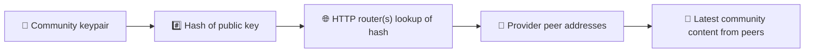
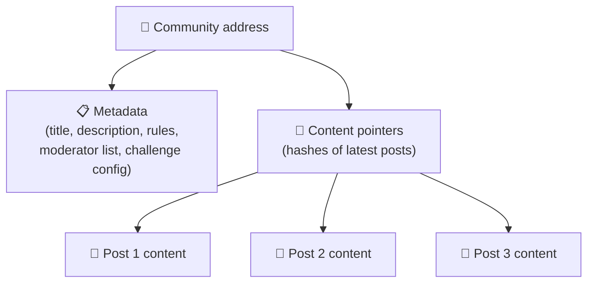
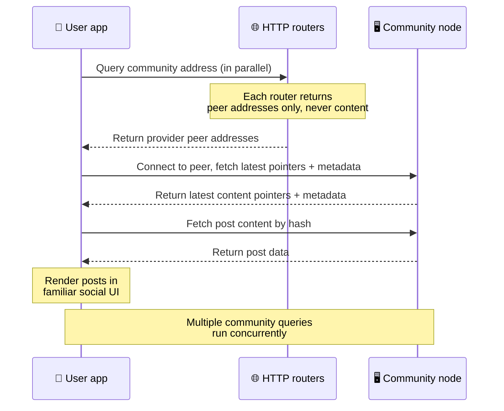
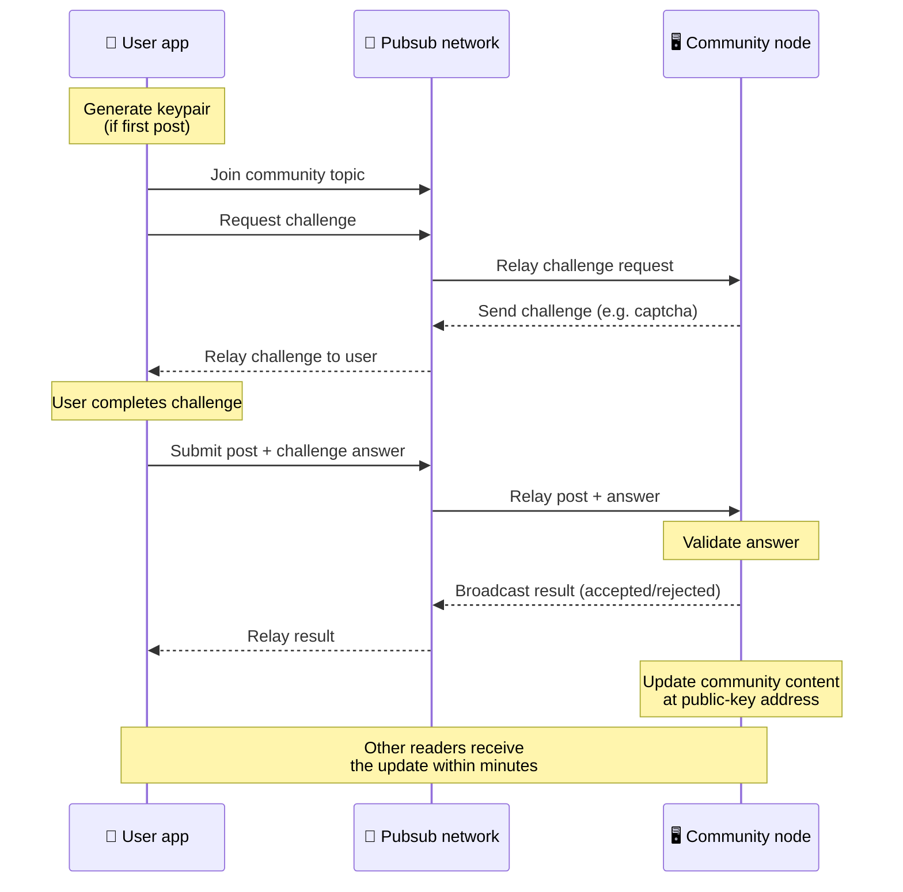
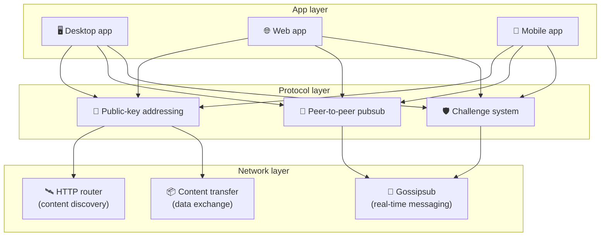

# Peer-to-peer protokoll

A Bitsocial nem használ blokkláncot, föderációs szervert vagy központi háttérrendszert. Ehelyett az
IPFS/libp2p készletre épít, és két ötletet kapcsol össze: a **nyilvános kulcson alapuló címzést** és
a **peer-to-peer pubsubot**. Együtt lehetővé teszik, hogy bárki hétköznapi hardverről üzemeltessen
közösséget, a felhasználók pedig úgy olvassanak és tegyenek közzé bejegyzéseket, hogy egyetlen cég
által felügyelt szolgáltatásban sincs fiókjuk.

Kevésbé technikai áttekintésért olvassa el
[A Bitsocial protokoll teljes laikus magyarázata](./layman-protocol-explanation.md) oldalt.

## Használ a Bitsocial IPFS-t?

Igen. A Bitsocial csomópontjai IPFS/libp2p primitíveket használnak a peer-to-peer réteghez:
nyilvános kulccsal címzett közösségi rekordokat, társak közötti tartalomátvitelt és gossipsub
pubsubot a valós idejű üzenetekhez. Amikor ez a dokumentáció „pubsubot” említ, IPFS/libp2p pubsubra
gondol, nem pedig külön, központi üzenetközvetítőre.

A protokoll jelenleg HTTP-útválasztókon keresztüli felderítést ír le, mert a Bitsocial kliensei az
útválasztók végpontjaitól kérik le a szolgáltató társak címeit, ahelyett hogy minden egyes
kereséshez a böngészők számára nehezen használható DHT-re támaszkodnának. Az útválasztók csak
társakat adnak vissza; a tartalomátvitel és a pubsub forgalma továbbra is a peer-to-peer hálózaton
halad.

## A két probléma

Egy decentralizált közösségi hálózatnak két kérdésre kell választ adnia:

1. **Adat** — hogyan tárolható és szolgálható ki a világ közösségi tartalma központi adatbázis
   nélkül?
2. **Spam** — hogyan előzhető meg a visszaélés úgy, hogy a hálózat használata ingyenes maradjon?

A Bitsocial az adatproblémát a blokklánc teljes kihagyásával oldja meg: a közösségi médiának nincs
szüksége globális tranzakciósorrendre, sem arra, hogy minden régi bejegyzés tartósan elérhető
maradjon. A spamproblémát pedig azzal oldja meg, hogy minden közösség a saját spamellenes kihívását
futtathatja a peer-to-peer hálózaton.

Az e hálózati réteg fölé épülő felderítési modellről lásd a
[Tartalom felfedezése](./content-discovery.md) oldalt.

---

## Nyilvános kulcson alapuló címzés {#public-key-based-addressing}

A BitTorrentben egy fájl hash-e lesz a címe (_tartalomalapú címzés_). A Bitsocial hasonló ötletet
alkalmaz nyilvános kulcsokkal: egy közösség nyilvános kulcsának hash-e lesz a hálózati címe.

A hálózat bármelyik társa lekérdezheti ezt a címet egy **HTTP-útválasztónál**: az útválasztó
azoknak a társaknak a hálózati címeit adja vissza, amelyek éppen szolgáltatják a közösség hash-ét, a
kliens pedig közvetlenül ezekhez a társakhoz csatlakozik, hogy lekérje a közösség legfrissebb
állapotát. A tartalom minden frissítésekor nő a verziószám. A hálózat csak a legutóbbi verziót
őrzi meg — nem kell megőrizni minden korábbi állapotot, és éppen ettől lesz ez a megközelítés
könnyűsúlyú a blokklánchoz képest.

> **Mit tárol valójában egy HTTP-útválasztó.** A HTTP-útválasztó vékony index. Minden általa ismert
> tartalomcímhez kizárólag azoknak a társaknak a hálózati címét tárolja, amelyek szolgáltatóként
> bejelentkeztek (IP/port párok, libp2p multiaddrok és hasonlók). **Nem** tárolja a közösség
> tartalmát, metaadatait, a bejegyzések szövegét, a tagok listáját, de még annak ember által
> olvasható megnevezését sem, ami az adott címen található; csupán arra válaszol, hogy „mely társak
> állítják, hogy náluk megvan ez a hash?”. Ettől lesznek az útválasztók olcsón üzemeltethetők,
> könnyen cserélhetők, és nem felelnek azért, amit a felhasználók közzétesznek — hasonlóan egy
> BitTorrent trackerhez, csak torrent-metaadatok nélkül: a tracker infohasheket képez le társakra,
> míg a HTTP-útválasztó csak egy tartalomcímet képez le szolgáltató társak címeire.
>
> A redundancia érdekében a kliens **több HTTP-útválasztót párhuzamosan** kérdez le, és összefésüli
> a visszakapott szolgáltatólistákat. Útválasztót bárki üzemeltethet, útválasztó cseréje vagy
> hozzáadása pedig konfigurációs változtatás, adatmigráció nélkül.
>
> A Bitsocial azért használ DHT helyett HTTP-útválasztókat, mert a tartalomfelderítéshez szükséges
> méretben DHT-t üzemeltetni drága, különösen mobilon. A DHT ráadásul böngészőben nem működik,
> mivel a böngészők nem tudnak közvetlenül csatlakozni egy libp2p DHT-hez. A HTTP-útválasztó olcsón
> fut hétköznapi HTTP-infrastruktúrán, és telefonról vagy böngészőből ugyanolyan jól működik.

### Mi kerül tárolásra a címen

A közösség címe nem közvetlenül a teljes bejegyzéstartalmat tartalmazza. Ehelyett
tartalomazonosítók listáját tárolja — hash-eket, amelyek a tényleges adatokra mutatnak. A kliens
ezután minden egyes tartalomrészletet közvetlenül azoktól a társaktól kér le, amelyeket a
HTTP-útválasztók adtak vissza. Maguk az útválasztók soha nem látják és nem tárolják a tartalmat.

Legalább egy társnál mindig megvan az adat: a közösség üzemeltetőjének csomópontjánál. Ha a
közösség népszerű, sok további társnál is megvan, és a terhelés magától eloszlik — ugyanúgy, ahogy
a népszerű torrentek gyorsabban töltődnek le.

---

## Peer-to-peer pubsub

A pubsub (közzététel-feliratkozás) olyan üzenetküldési minta, amelyben a társak feliratkoznak egy
témára, és megkapnak minden abban a témában közzétett üzenetet. A Bitsocial peer-to-peer pubsub
hálózatot használ — bárki közzétehet, bárki feliratkozhat, és nincs központi üzenetközvetítő.

Ahhoz, hogy valaki bejegyzést tegyen közzé egy közösségben, olyan üzenetet publikál, amelynek témája
megegyezik a közösség nyilvános kulcsával. A közösség üzemeltetőjének csomópontja felveszi,
ellenőrzi, és — ha átmegy a spamellenes kihíváson — beleveszi a következő tartalomfrissítésbe.

---

## Spamvédelem: kihívások pubsubon keresztül

A nyílt pubsub hálózat sebezhető a spamáradattal szemben. A Bitsocial ezt úgy oldja meg, hogy a
közzétevőknek egy **kihívást** kell teljesíteniük, mielőtt a tartalmukat elfogadják.

A kihívásrendszer rugalmas: minden közösség üzemeltetője a saját szabályzatát állítja be. A
lehetőségek között szerepel:

| Kihívás típusa       | Hogyan működik                                                  |
| -------------------- | --------------------------------------------------------------- |
| **Captcha**          | Az alkalmazásban megjelenő vizuális vagy interaktív feladvány   |
| **Sebességkorlát**   | Bejegyzések korlátozása identitásonként, adott időablakon belül |
| **Token gate**       | Egy adott token egyenlegének igazolása                          |
| **Fizetés**          | Kis összegű fizetés megkövetelése bejegyzésenként               |
| **Engedélyezőlista** | Csak előre jóváhagyott identitások tehetnek közzé               |
| **Egyéni kód**       | Bármilyen szabályzat, amely kódban kifejezhető                  |

A túl sok sikertelen kihívási kísérletet továbbító társakat a hálózat kizárja a pubsub témából, ami
megakadályozza a szolgáltatásmegtagadási támadásokat a hálózati rétegen.

---

## Életciklus: közösség olvasása

Ez történik, amikor a felhasználó megnyitja az alkalmazást, és megnézi egy közösség legfrissebb
bejegyzéseit.

**Lépésről lépésre:**

1. A felhasználó megnyitja az alkalmazást, és közösségi felületet lát.
2. A kliens minden követett közösséghez párhuzamosan több HTTP-útválasztót kérdez le; minden
   útválasztó kizárólag társcímeket ad vissza, tartalmat soha. A lekérdezés késleltetése a hálózati
   körülményektől és az útválasztók terhelésétől függ; szokásos, alacsony késleltetésű
   körülmények között a lekérdezések gyakran körülbelül egy másodpercen belül visszatérnek, és
   párhuzamosan futnak.
3. Amint a kliensnek megvannak a társcímek, csatlakozik ezekhez a társakhoz, és lekéri a közösség
   legfrissebb tartalommutatóit és metaadatait (cím, leírás, moderátorlista, kihívás
   konfigurációja).
4. A kliens ezekkel a mutatókkal lekéri a tényleges bejegyzéstartalmat, majd mindent megjelenít egy
   megszokott közösségi felületen.

---

## Életciklus: bejegyzés közzététele

A közzététel a bejegyzés elfogadása előtt egy pubsubon keresztül zajló kihívás-válasz kézfogást is
magában foglal.

**Lépésről lépésre:**

1. Az alkalmazás kulcspárt generál a felhasználónak, ha még nincs neki.
2. A felhasználó megír egy bejegyzést egy közösségbe.
3. A kliens csatlakozik az adott közösség pubsub témájához (amelynek kulcsa a közösség nyilvános
   kulcsa).
4. A kliens pubsubon keresztül kihívást kér.
5. A közösség üzemeltetőjének csomópontja visszaküld egy kihívást (például egy captchát).
6. A felhasználó teljesíti a kihívást.
7. A kliens a kihívásra adott válasszal együtt beküldi a bejegyzést pubsubon keresztül.
8. A közösség üzemeltetőjének csomópontja ellenőrzi a választ. Ha helyes, a bejegyzést elfogadja.
9. A csomópont pubsubon keresztül közzéteszi az eredményt, hogy a hálózat társai tudják: továbbra is
   továbbíthatják ennek a felhasználónak az üzeneteit.
10. A csomópont frissíti a közösség tartalmát a nyilvános kulcsú címén.
11. Néhány percen belül a közösség minden olvasója megkapja a frissítést.

---

## Az architektúra áttekintése

A teljes rendszer három, egymással együttműködő rétegből áll:

| Réteg          | Szerep                                                                                                                                                      |
| -------------- | ----------------------------------------------------------------------------------------------------------------------------------------------------------- |
| **Alkalmazás** | Felhasználói felület. Több alkalmazás is létezhet, mindegyik saját arculattal, és mind ugyanazokon a közösségeken és identitásokon osztozik.                |
| **Protokoll**  | Meghatározza, hogyan címezhetők a közösségek, hogyan tehetők közzé a bejegyzések, és hogyan előzhető meg a spam.                                            |
| **Hálózat**    | Az alapul szolgáló peer-to-peer infrastruktúra: HTTP-útválasztók a felderítéshez, gossipsub a valós idejű üzenetküldéshez, tartalomátvitel az adatcseréhez. |

---

## Adatvédelem: a szerzők és az IP-címek szétválasztása

Amikor egy felhasználó bejegyzést tesz közzé, a tartalom **a közösség üzemeltetőjének nyilvános
kulcsával titkosítva** kerül be a pubsub hálózatba. Ez azt jelenti, hogy bár a hálózat megfigyelői
látják, hogy egy társ közzétett _valamit_, azt nem tudják megállapítani:

- hogy mi áll a tartalomban
- melyik szerzői identitás tette közzé

Ez ahhoz hasonlít, ahogy a BitTorrentnél kideríthető, mely IP-címek osztanak meg egy torrentet, az
viszont nem, hogy eredetileg ki hozta létre. A titkosítási réteg ezen az alapszinten felül további
adatvédelmi garanciát ad.

---

## Böngészős peer-to-peer

A böngészős P2P immár megvalósítható a Bitsocial klienseiben. Egy böngészőben futó alkalmazás
elindíthat egy [Helia](https://helia.io/) csomópontot, ugyanazt a Bitsocial protokollkliens-készletet
használhatja, mint a többi alkalmazás, és a tartalmat társaktól kérheti le ahelyett, hogy egy
központi IPFS-átjárótól kérné a kiszolgálását. A böngésző közvetlenül részt vehet a pubsubban is,
így a közzétételhez a szokásos úton nincs szükség platformtulajdonban lévő pubsub-szolgáltatóra.

Ez a webes terjesztés fontos mérföldköve: egy hétköznapi HTTPS-webhely élő P2P közösségi klienssé
tud megnyílni. A felhasználóknak nem kell asztali alkalmazást telepíteniük ahhoz, hogy olvassanak a
hálózatról, az alkalmazás üzemeltetőjének pedig nem kell központi átjárót futtatnia, amely minden
böngészős felhasználó számára a cenzúra vagy a moderálás szűk keresztmetszetévé válna.

A böngészős út más korlátokkal jár, mint egy asztali vagy szerveres csomópont:

- egy böngészőcsomópont általában nem tud tetszőleges bejövő kapcsolatot fogadni a nyílt internetről
- amíg az alkalmazás nyitva van, be tud tölteni, ellenőrizni, gyorsítótárazni és közzétenni adatokat
- nem szabad úgy tekinteni rá, mint egy közösség adatainak hosszú életű gazdájára
- egy közösség teljes tárhelyszolgáltatását továbbra is asztali alkalmazás, a `bitsocial-cli` vagy
  más, folyamatosan futó csomópont látja el a legjobban

A HTTP-útválasztók a tartalomfelderítéshez továbbra is fontosak: egy közösség hash-éhez szolgáltatói
címeket adnak vissza. Nem IPFS-átjárók, mert magát a tartalmat nem szolgálják ki. A felderítés után
a böngészőkliens csatlakozik a társakhoz, és a P2P-készleten keresztül kéri le az adatokat.

A böngészős P2P mostanra az alapértelmezett webes út, nem pedig kapcsoló mögé rejtett kísérlet. Az
5chan alapértelmezés szerint tiszta böngészős P2P-vel fut az 5chan.app címen, és ugyanezt teszi a
bitsocial.net oldalon futó Bitsocial blog is. A böngészőben futó társak biztonságos WebSocketeken
keresztül építenek kapcsolatot; a `pkc-js` alapértelmezés szerint elutasítja a WebRTC- és
WebTransport-kapcsolódásokat, mert ezek kapcsolatfelépítési útvonalai lassúak és megbízhatatlanok a
böngészőben. Az a felsőbb szintű változás, amely 2026-ban gyakorlativá tette a böngészőből való
közzétételt, a gossipsub sorszámjavítása volt a `@libp2p/gossipsub` 15.0.21-es verziójában: ezután a
Kubo társak már nem dobták el a JavaScript csomópontok által közzétett üzeneteket.

A teljes képért — beleértve azt is, hogy egy böngészőcsomópont mire továbbra sem képes — lásd a
[Böngészős peer-to-peer](/browser-p2p/) oldalt.

## Átjárós tartalék {#gateway-fallback}

Az átjáróra épülő böngészős hozzáférés kompatibilitási és bevezetési tartalékként továbbra is
hasznos. Az átjáró adatot tud közvetíteni a P2P-hálózat és egy böngészőkliens között, ha a böngésző
nem tud közvetlenül csatlakozni a hálózathoz, vagy ha az alkalmazás szándékosan a régebbi utat
választja. Ezek az átjárók:

- bárki által üzemeltethetők
- nem igényelnek felhasználói fiókot vagy fizetést
- nem szereznek rendelkezési jogot a felhasználói identitások vagy közösségek felett
- adatvesztés nélkül cserélhetők

A cél olyan architektúra, amelyben a böngészős P2P az elsődleges, az átjárók pedig opcionális
tartalékként szolgálnak, nem pedig alapértelmezett szűk keresztmetszetként.

---

## Miért nem blokklánc?

A blokkláncok a kettős költés problémáját oldják meg: ismerniük kell minden tranzakció pontos
sorrendjét, hogy senki ne költhesse el kétszer ugyanazt az érmét.

A közösségi médiában nincs kettős költés. Nem számít, hogy az A bejegyzés egy ezredmásodperccel a B
bejegyzés előtt jelent-e meg, és a régi bejegyzéseknek sem kell tartósan elérhetőnek maradniuk
minden csomóponton.

A blokklánc kihagyásával a Bitsocial elkerüli a következőket:

- **gázdíjak** — a közzététel ingyenes
- **átbocsátási korlátok** — nincs blokkméretből vagy blokkidőből eredő szűk keresztmetszet
- **tárolási felduzzadás** — a csomópontok csak azt tartják meg, amire szükségük van
- **konszenzus többletterhelése** — nincs szükség bányászokra, validátorokra vagy letétbe helyezésre

A kompromisszum az, hogy a Bitsocial nem garantálja a régi tartalom állandó elérhetőségét. A
közösségi média esetében azonban ez elfogadható kompromisszum: az adat a közösség üzemeltetőjének
csomópontján van, a népszerű tartalom sok társ között terjed, a nagyon régi bejegyzések pedig
természetes módon halványulnak el — ugyanúgy, ahogy minden más közösségi platformon.

## Miért nem föderáció?

A föderált hálózatok (mint az e-mail vagy az ActivityPub-alapú platformok) előrelépést jelentenek a
központosításhoz képest, de szerkezeti korlátaik továbbra is vannak:

- **Szerverfüggőség** — minden közösségnek szüksége van egy szerverre domainnel, TLS-sel és
  folyamatos karbantartással
- **Adminisztrátori bizalom** — a szerver adminisztrátora teljes ellenőrzést gyakorol a
  felhasználói fiókok és a tartalom felett
- **Széttöredezettség** — a szerverek közötti költözés gyakran a követők, az előzmények vagy az
  identitás elvesztésével jár
- **Költség** — valakinek fizetnie kell a tárhelyet, ami a koncentráció felé tolja a hálózatot

A Bitsocial peer-to-peer megközelítése teljesen kiveszi a szervert a képletből. Egy közösségi
csomópont futhat laptopon, Raspberry Pi-n vagy olcsó VPS-en. Az üzemeltető a moderálási szabályzat
felett rendelkezik, de a felhasználói identitásokat nem tudja elvenni, mert az identitásokat
kulcspárok vezérlik, nem a szerver osztja ki őket.

## Mi a helyzet a Nostrral?

A Nostr egyik kategóriába sem illik bele tisztán. Nem ActivityPub-stílusú föderáció, mert a
felhasználók nem az egyes példányoktól kapnak fiókot, és az identitás nem kötődik egyetlen
szerverhez. De blokklánc-alapú közösségi média sem, mert nincs benne lánc, konszenzus, gáz vagy
globális tranzakciósorrend.

A Nostrt pontosabb **relay-alapú közösségi médiaként** leírni. Az alapprotokollban
([NIP-01](https://github.com/nostr-protocol/nips/blob/master/01.md)) a felhasználók kulcspárokat
birtokolnak, eseményeket írnak alá, és ezeket az eseményeket WebSocket relayekre teszik közzé. A
kliensek szűrőkkel iratkoznak fel a relayekre, lekérik az illeszkedő eseményeket, és helyben
ellenőrzik az aláírásokat. A felhasználók relaylista-metaadatokat is közzétehetnek
([NIP-65](https://github.com/nostr-protocol/nips/blob/master/65.md)), amelyek megmondják a
klienseknek, hogy általában mely relayekre írnak, és mely relayeket részesítik előnyben az
említések olvasásához.

Ez egy fontos szempontból közelebb helyezi a Nostrt a Bitsocialhoz, mint a föderált vagy
blokklánc-alapú rendszereket: az identitás kriptográfiai és hordozható. A fő különbség az adatréteg.
A Nostrban a relayek jelentik a szokásos tároló- és kézbesítési réteget. A Bitsocialban a
HTTP-útválasztók csak abban segítenek a klienseknek, hogy megtalálják a társakat. Az útválasztók nem
tárolnak bejegyzéseket, profilokat, közösségi metaadatokat vagy moderálási állapotot; szolgáltató
társak címeit adják vissza, a kliensek pedig ezt követően a társaktól kérik le a tartalmat.

A közösségeknél ugyanez a kettősség figyelhető meg. A Nostrban vannak opcionális minták a
[relay-alapú csoportokra](https://github.com/nostr-protocol/nips/blob/master/29.md) és a
[moderátor által jóváhagyott közösségekre](https://github.com/nostr-protocol/nips/blob/master/72.md),
ezek azonban továbbra is a relayek szabályzatától, a relayen tárolt csoportállapottól vagy attól
függenek, hogy a kliens mely jóváhagyásokat veszi figyelembe. A Bitsocial a közösségeket elsőrangú
kriptográfiai objektumként kezeli: az üzemeltető csomópontja ellenőrzi a bejegyzéseket, futtatja a
közösség kihívási szabályzatát, és közzéteszi a legfrissebb elfogadott állapotot a peer-to-peer
hálózatba.

| Kérdés           | Nostr                                                                                                 | Bitsocial                                                                   |
| ---------------- | ----------------------------------------------------------------------------------------------------- | --------------------------------------------------------------------------- |
| Kategória        | Relay-alapú protokoll                                                                                 | Peer-to-peer közösségi hálózat                                              |
| Identitás        | Felhasználói nyilvános kulcs                                                                          | Felhasználói és közösségi kulcspárok                                        |
| Adatútvonal      | Relayekre közzétett aláírt események                                                                  | A nyilvános kulcsú cím társakra oldódik fel; a tartalom a társaktól érkezik |
| Ki tartja online | A felhasználók és a kliensek által választott relayek                                                 | A közösség tulajdonosának csomópontja és a segítő seederek                  |
| Közösségek       | Opcionális relay-alapú csoportok vagy moderátor által jóváhagyott közösségek                          | Elsőrangú közösségi objektumok, üzemeltető által vezérelt moderálással      |
| Spamvédelem      | Relay-szabályzat, hitelesítés, fizetés, proof-of-work, kliensoldali szűrők vagy moderátori jóváhagyás | Közösség által meghatározott kihíváslogika a befogadás előtt                |
| Fő kompromisszum | Hordozható identitás, de relayfüggő elérhetőség és szabályzat                                         | Kevesebb relayfüggőség, de a régi tartalom nem marad meg garantáltan örökre |

---

## Összefoglalás

A Bitsocial két primitívre épül: a tartalomfelderítéshez nyilvános kulcson alapuló címzésre, a valós
idejű kommunikációhoz pedig peer-to-peer pubsubra. Ezek együtt olyan közösségi hálózatot hoznak
létre, ahol:

- a közösségeket kriptográfiai kulcsok azonosítják, nem domainnevek
- a tartalom torrentszerűen terjed a társak között, nem egyetlen adatbázisból szolgálják ki
- a spamvédelem közösségenként helyi, nem egy platform kényszeríti rá
- a felhasználók kulcspárokon keresztül birtokolják az identitásukat, nem visszavonható fiókokon át
- az egész rendszer szerverek, blokkláncok és platformdíjak nélkül működik
