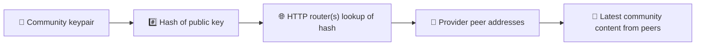
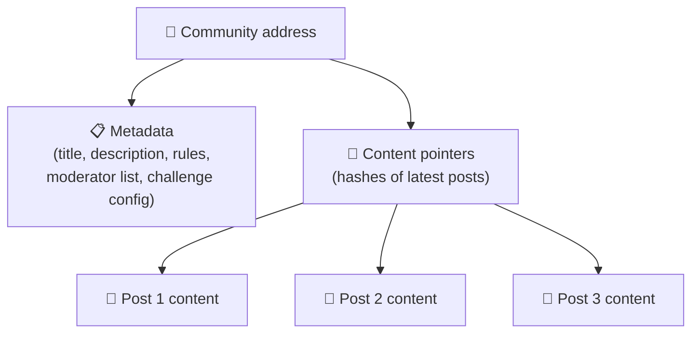
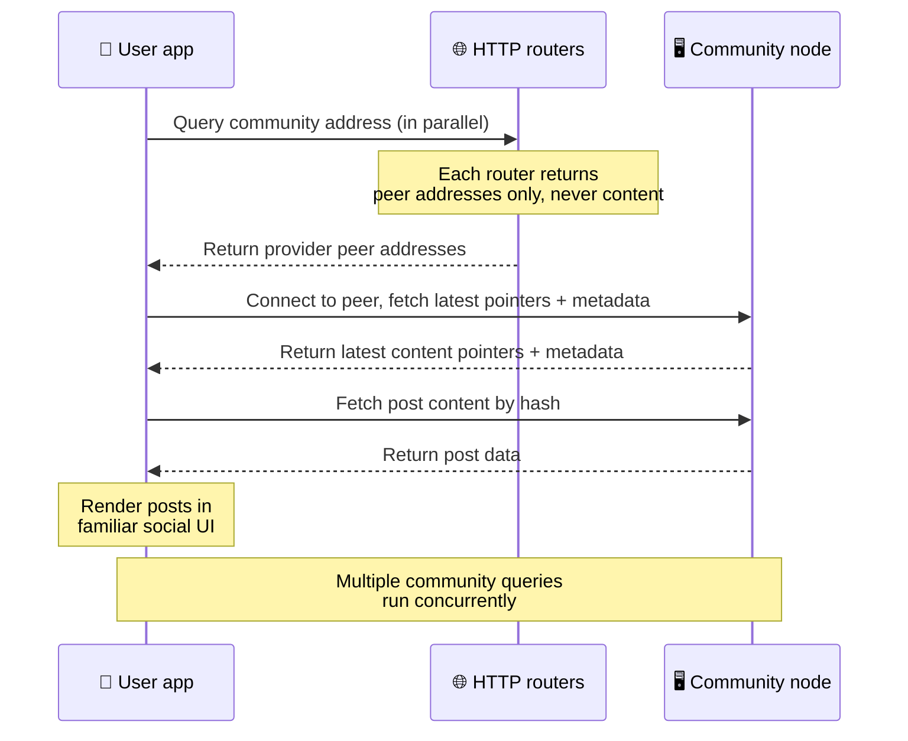
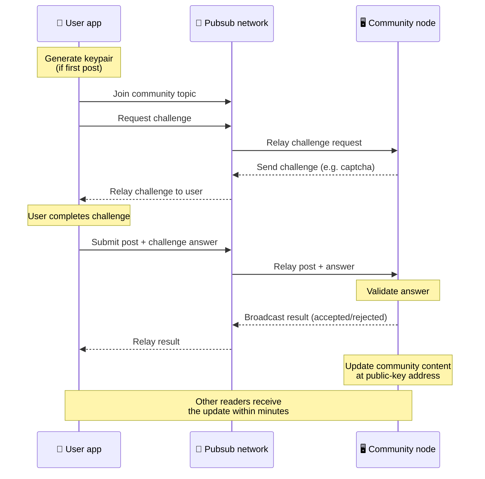
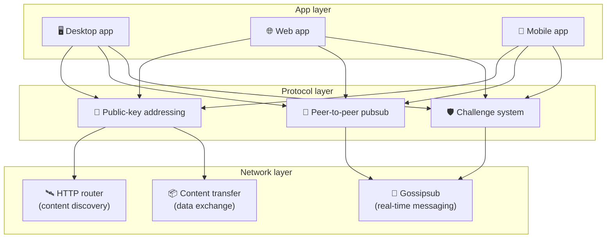

# Protokol Peer-to-Peer

Bitsocial tidak memakai blockchain, server federasi, maupun backend terpusat. Sebagai gantinya,
Bitsocial memakai tumpukan IPFS/libp2p untuk menggabungkan dua gagasan: **pengalamatan berbasis
kunci publik** dan **pubsub peer-to-peer**. Keduanya memungkinkan siapa pun menghosting komunitas
dari perangkat keras konsumen, sementara pengguna membaca dan memposting tanpa akun di layanan mana
pun yang dikendalikan perusahaan.

Untuk penjelasan yang tidak terlalu teknis, baca
[Penjelasan lengkap protokol Bitsocial untuk orang awam](./layman-protocol-explanation.md).

## Apakah Bitsocial memakai IPFS?

Ya. Node Bitsocial memakai primitif IPFS/libp2p untuk lapisan peer-to-peer: catatan komunitas yang
dialamatkan dengan kunci publik, transfer konten antarpeer, dan pubsub gossipsub untuk pesan
real-time. Ketika dokumentasi ini menyebut "pubsub", yang dimaksud adalah pubsub IPFS/libp2p, bukan
broker pesan terpusat yang terpisah.

Saat ini protokol menjelaskan penemuan melalui router HTTP karena klien Bitsocial menanyakan
endpoint router untuk mendapatkan alamat peer penyedia, alih-alih mengandalkan DHT yang tidak ramah
browser untuk setiap pencarian. Router hanya mengembalikan peer; transfer konten dan lalu lintas
pubsub tetap berjalan melalui jaringan peer-to-peer.

## Dua masalah

Sebuah jejaring sosial terdesentralisasi harus menjawab dua pertanyaan:

1. **Data** — bagaimana menyimpan dan menyajikan konten sosial sedunia tanpa basis data pusat?
2. **Spam** — bagaimana mencegah penyalahgunaan sambil menjaga jaringan tetap gratis dipakai?

Bitsocial menyelesaikan masalah data dengan melewatkan blockchain sepenuhnya: media sosial tidak
membutuhkan pengurutan transaksi global maupun ketersediaan permanen setiap postingan lama. Masalah
spam diselesaikan dengan membiarkan tiap komunitas menjalankan tantangan anti-spamnya sendiri di
atas jaringan peer-to-peer.

Untuk model penemuan di atas lapisan jaringan ini, lihat [Penemuan Konten](./content-discovery.md).

---

## Pengalamatan berbasis kunci publik {#public-key-based-addressing}

Di BitTorrent, hash sebuah berkas menjadi alamatnya (_pengalamatan berbasis konten_). Bitsocial
memakai gagasan serupa dengan kunci publik: hash dari kunci publik sebuah komunitas menjadi alamat
jaringannya.

Peer mana pun di jaringan dapat menanyakan sebuah **router HTTP** untuk alamat tersebut: router
membalas dengan daftar alamat jaringan peer yang saat ini menyediakan hash komunitas itu, lalu klien
terhubung langsung ke peer tersebut untuk mengambil status terbaru komunitas. Setiap kali konten
diperbarui, nomor versinya bertambah. Jaringan hanya menyimpan versi terbaru — tidak perlu
mempertahankan setiap status historis, dan justru itulah yang membuat pendekatan ini ringan
dibandingkan blockchain.

> **Apa yang sebenarnya disimpan router HTTP.** Router HTTP adalah indeks yang sangat tipis. Untuk
> tiap alamat konten yang diketahuinya, router hanya menyimpan alamat jaringan peer yang mengumumkan
> diri sebagai penyedia (pasangan IP/port, multiaddr libp2p, dan sejenisnya). Router **tidak**
> menyimpan konten komunitas, metadatanya, teks postingan, daftar anggota, bahkan label yang bisa
> dibaca manusia tentang apa yang ada di alamat itu; router hanya menjawab "peer mana yang mengaku
> punya hash ini?". Hal ini membuat router murah dijalankan, mudah diganti, dan tidak bertanggung
> jawab atas apa yang dipublikasikan pengguna, mirip tracker BitTorrent tetapi tanpa metadata
> torrent: tracker memetakan infohash ke peer, sedangkan router HTTP hanya memetakan alamat konten
> ke alamat peer penyedia.
>
> Demi redundansi, klien menanyakan **beberapa router HTTP secara paralel** dan menggabungkan daftar
> penyedia yang diterimanya. Siapa pun boleh menjalankan router, dan mengganti atau menambah router
> hanyalah perubahan konfigurasi tanpa migrasi data.
>
> Bitsocial memakai router HTTP alih-alih DHT karena menjalankan DHT pada skala yang dibutuhkan
> untuk penemuan konten itu mahal, terutama bagi perangkat seluler. DHT juga tidak berfungsi di
> browser, karena browser tidak dapat bergabung langsung ke DHT libp2p. Router HTTP berjalan murah
> di atas infrastruktur HTTP biasa dan bekerja sama baiknya dari ponsel maupun dari browser.

### Apa yang disimpan di alamat tersebut

Alamat komunitas tidak memuat konten postingan lengkap secara langsung. Yang disimpan adalah daftar
pengenal konten — hash yang menunjuk ke data sebenarnya. Klien lalu mengambil tiap potongan konten
langsung dari peer yang dikembalikan router HTTP. Router itu sendiri tidak pernah melihat maupun
menyimpan kontennya.

Setidaknya satu peer selalu memiliki datanya: node operator komunitas. Jika komunitasnya populer,
banyak peer lain juga akan memilikinya dan bebannya terbagi dengan sendirinya, sama seperti torrent
populer yang lebih cepat diunduh.

---

## Pubsub peer-to-peer

Pubsub (publish-subscribe) adalah pola pesan di mana peer berlangganan sebuah topik dan menerima
setiap pesan yang dipublikasikan ke topik itu. Bitsocial memakai jaringan pubsub peer-to-peer —
siapa pun dapat mempublikasikan, siapa pun dapat berlangganan, dan tidak ada broker pesan pusat.

Untuk mempublikasikan postingan ke sebuah komunitas, pengguna mempublikasikan pesan yang topiknya
sama dengan kunci publik komunitas tersebut. Node operator komunitas menangkapnya, memvalidasinya,
dan — jika lolos tantangan anti-spam — memasukkannya ke pembaruan konten berikutnya.

---

## Anti-spam: tantangan lewat pubsub

Jaringan pubsub terbuka rentan terhadap banjir spam. Bitsocial mengatasinya dengan mewajibkan
penerbit menyelesaikan sebuah **tantangan** sebelum kontennya diterima.

Sistem tantangan ini fleksibel: tiap operator komunitas mengonfigurasi kebijakannya sendiri.
Pilihannya antara lain:

| Jenis tantangan     | Cara kerjanya                                                   |
| ------------------- | --------------------------------------------------------------- |
| **Captcha**         | Teka-teki visual atau interaktif yang ditampilkan di aplikasi   |
| **Pembatasan laju** | Membatasi jumlah postingan per rentang waktu per identitas      |
| **Gerbang token**   | Meminta bukti kepemilikan saldo token tertentu                  |
| **Pembayaran**      | Meminta pembayaran kecil untuk tiap postingan                   |
| **Daftar izin**     | Hanya identitas yang disetujui lebih dulu yang boleh memposting |
| **Kode khusus**     | Kebijakan apa pun yang bisa dinyatakan dalam kode               |

Peer yang meneruskan terlalu banyak percobaan tantangan yang gagal akan diblokir dari topik pubsub,
sehingga serangan penolakan layanan di lapisan jaringan bisa dicegah.

---

## Siklus hidup: membaca komunitas

Inilah yang terjadi saat pengguna membuka aplikasi dan melihat postingan terbaru sebuah komunitas.

**Langkah demi langkah:**

1. Pengguna membuka aplikasi dan melihat antarmuka sosial.
2. Klien menanyakan beberapa router HTTP secara paralel untuk tiap komunitas yang diikuti pengguna;
   tiap router hanya mengembalikan alamat peer, tidak pernah konten. Latensi kueri bergantung pada
   kondisi jaringan dan beban router; pada kondisi latensi rendah yang umum, kueri sering kembali
   dalam waktu sekitar satu detik dan berjalan bersamaan.
3. Setelah klien punya alamat peer, klien terhubung ke peer tersebut lalu mengambil penunjuk konten
   terbaru serta metadata komunitas (judul, deskripsi, daftar moderator, konfigurasi tantangan).
4. Klien mengambil konten postingan yang sebenarnya memakai penunjuk itu, lalu merender semuanya
   dalam antarmuka sosial yang sudah familier.

---

## Siklus hidup: mempublikasikan postingan

Publikasi melibatkan jabat tangan tantangan-jawaban lewat pubsub sebelum postingan diterima.

**Langkah demi langkah:**

1. Aplikasi membuatkan pasangan kunci untuk pengguna jika mereka belum punya.
2. Pengguna menulis postingan untuk sebuah komunitas.
3. Klien bergabung ke topik pubsub komunitas tersebut (terkunci pada kunci publik komunitas).
4. Klien meminta tantangan lewat pubsub.
5. Node operator komunitas mengirim balik sebuah tantangan (misalnya captcha).
6. Pengguna menyelesaikan tantangan tersebut.
7. Klien mengirimkan postingan beserta jawaban tantangan lewat pubsub.
8. Node operator komunitas memvalidasi jawabannya. Jika benar, postingan diterima.
9. Node menyiarkan hasilnya lewat pubsub agar peer jaringan tahu bahwa mereka harus terus
   meneruskan pesan dari pengguna ini.
10. Node memperbarui konten komunitas di alamat kunci publiknya.
11. Dalam beberapa menit, setiap pembaca komunitas menerima pembaruan tersebut.

---

## Ikhtisar arsitektur

Sistem lengkapnya punya tiga lapisan yang bekerja bersama:

| Lapisan      | Peran                                                                                                                                                    |
| ------------ | -------------------------------------------------------------------------------------------------------------------------------------------------------- |
| **Aplikasi** | Antarmuka pengguna. Banyak aplikasi bisa hidup berdampingan, masing-masing dengan desainnya sendiri, semuanya berbagi komunitas dan identitas yang sama. |
| **Protokol** | Menentukan cara komunitas dialamatkan, cara postingan dipublikasikan, dan cara spam dicegah.                                                             |
| **Jaringan** | Infrastruktur peer-to-peer yang mendasarinya: router HTTP untuk penemuan, gossipsub untuk pesan real-time, dan transfer konten untuk pertukaran data.    |

---

## Privasi: memutus kaitan penulis dengan alamat IP

Saat pengguna mempublikasikan postingan, kontennya **dienkripsi dengan kunci publik operator
komunitas** sebelum masuk ke jaringan pubsub. Artinya, meskipun pengamat jaringan bisa melihat bahwa
suatu peer mempublikasikan _sesuatu_, mereka tidak bisa menentukan:

- apa isi konten tersebut
- identitas penulis mana yang mempublikasikannya

Ini mirip dengan cara BitTorrent memungkinkan orang mengetahui IP mana yang menyemai sebuah torrent,
tetapi bukan siapa yang pertama kali membuatnya. Lapisan enkripsi menambahkan jaminan privasi
tambahan di atas dasar tersebut.

---

## Peer-to-peer di browser

P2P di browser kini sudah bisa dilakukan pada klien Bitsocial. Aplikasi browser dapat menjalankan
node [Helia](https://helia.io/), memakai tumpukan klien protokol Bitsocial yang sama dengan aplikasi
lain, dan mengambil konten dari peer alih-alih meminta gateway IPFS terpusat untuk menyajikannya.
Browser juga dapat ikut serta langsung dalam pubsub, jadi pada jalur normal memposting tidak
memerlukan penyedia pubsub milik platform.

Inilah tonggak penting untuk distribusi lewat web: situs HTTPS biasa bisa terbuka menjadi klien
sosial P2P yang hidup. Pengguna tidak perlu memasang aplikasi desktop sebelum bisa membaca dari
jaringan, dan operator aplikasi tidak perlu menjalankan gateway pusat yang menjadi titik sempit
penyensoran atau moderasi bagi setiap pengguna browser.

Jalur browser punya batasan yang berbeda dari node desktop atau server:

- node browser biasanya tidak bisa menerima koneksi masuk sembarangan dari internet publik
- node browser bisa memuat, memvalidasi, menyimpan cache, dan mempublikasikan data selama aplikasi
  terbuka
- node browser sebaiknya tidak diperlakukan sebagai penampung jangka panjang data sebuah komunitas
- hosting komunitas sepenuhnya tetap paling baik ditangani aplikasi desktop, `bitsocial-cli`, atau
  node lain yang selalu aktif

Router HTTP tetap penting untuk penemuan konten: router mengembalikan alamat penyedia untuk hash
sebuah komunitas. Router bukan gateway IPFS, karena tidak menyajikan kontennya sendiri. Setelah
penemuan, klien browser terhubung ke peer dan mengambil datanya lewat tumpukan P2P.

P2P di browser kini menjadi jalur web bawaan, bukan eksperimen di balik sakelar. 5chan menjalankan
P2P browser murni secara bawaan di 5chan.app, dan blog Bitsocial di bitsocial.net melakukan hal yang
sama. Peer browser melakukan dial lewat WebSockets aman; `pkc-js` menolak dial WebRTC dan
WebTransport secara bawaan karena jalur pembentukan koneksinya lambat dan tidak andal di browser.
Perubahan upstream yang membuat publikasi dari browser jadi praktis pada 2026 adalah perbaikan nomor
urut gossipsub di `@libp2p/gossipsub` 15.0.21, yang menghentikan peer Kubo membuang pesan yang
dipublikasikan node JavaScript.

Untuk gambaran lengkapnya, termasuk apa yang masih belum bisa dilakukan node browser, lihat
[Peer-to-Peer di Browser](/browser-p2p/).

## Cadangan gateway {#gateway-fallback}

Akses browser yang ditopang gateway masih berguna sebagai cadangan untuk kompatibilitas dan
peluncuran bertahap. Gateway bisa meneruskan data antara jaringan P2P dan klien browser ketika
browser tidak dapat bergabung ke jaringan secara langsung atau ketika aplikasi sengaja memilih jalur
yang lama. Gateway seperti ini:

- bisa dijalankan siapa saja
- tidak memerlukan akun pengguna atau pembayaran
- tidak mendapat penguasaan atas identitas pengguna maupun komunitas
- bisa diganti tanpa kehilangan data

Arsitektur yang dituju adalah P2P browser lebih dulu, dengan gateway sebagai cadangan opsional,
bukan sebagai titik sempit bawaan.

---

## Mengapa bukan blockchain?

Blockchain menyelesaikan masalah pembelanjaan ganda: blockchain perlu mengetahui urutan persis
setiap transaksi agar seseorang tidak bisa membelanjakan koin yang sama dua kali.

Media sosial tidak punya masalah pembelanjaan ganda. Tidak jadi soal apakah postingan A
dipublikasikan satu milidetik sebelum postingan B, dan postingan lama tidak perlu tersedia secara
permanen di setiap node.

Dengan melewatkan blockchain, Bitsocial terhindar dari:

- **biaya gas** — memposting itu gratis
- **batas throughput** — tidak ada hambatan ukuran blok atau waktu blok
- **pembengkakan penyimpanan** — node hanya menyimpan yang dibutuhkannya
- **beban konsensus** — tidak perlu penambang, validator, atau staking

Konsekuensinya, Bitsocial tidak menjamin ketersediaan permanen konten lama. Namun untuk media
sosial, itu konsekuensi yang wajar: node operator komunitas menyimpan datanya, konten populer
menyebar ke banyak peer, dan postingan yang sangat lama memudar dengan sendirinya — sama seperti di
setiap platform sosial.

## Mengapa bukan federasi?

Jaringan federasi (seperti email atau platform berbasis ActivityPub) lebih baik daripada
sentralisasi, tetapi tetap punya keterbatasan struktural:

- **Ketergantungan pada server** — tiap komunitas butuh server dengan domain, TLS, dan pemeliharaan
  berkelanjutan
- **Kepercayaan pada admin** — admin server punya kendali penuh atas akun pengguna dan konten
- **Fragmentasi** — pindah antarserver sering berarti kehilangan pengikut, riwayat, atau identitas
- **Biaya** — ada pihak yang harus membayar hosting, dan itu menciptakan tekanan ke arah konsolidasi

Pendekatan peer-to-peer Bitsocial menghilangkan server dari persamaan sama sekali. Node komunitas
bisa berjalan di laptop, Raspberry Pi, atau VPS murah. Operator mengendalikan kebijakan moderasi,
tetapi tidak bisa merampas identitas pengguna, karena identitas dikendalikan pasangan kunci, bukan
diberikan server.

## Bagaimana dengan Nostr?

Nostr tidak masuk rapi ke salah satu kategori itu. Nostr bukan federasi bergaya ActivityPub, karena
pengguna tidak diberi akun oleh instance dan identitasnya tidak terikat pada satu server. Nostr juga
bukan media sosial berbasis blockchain, karena tidak ada rantai, konsensus, gas, maupun urutan
transaksi global.

Nostr lebih tepat disebut **media sosial berbasis relay**. Pada protokol dasarnya
([NIP-01](https://github.com/nostr-protocol/nips/blob/master/01.md)), pengguna memegang pasangan
kunci, menandatangani event, lalu mempublikasikan event tersebut ke relay WebSocket. Klien
berlangganan ke relay dengan filter, mengambil event yang cocok, dan memverifikasi tanda tangan
secara lokal. Pengguna juga bisa mempublikasikan metadata daftar relay
([NIP-65](https://github.com/nostr-protocol/nips/blob/master/65.md)) yang memberi tahu klien relay
mana yang biasanya mereka pakai untuk menulis dan relay mana yang mereka pilih untuk membaca
penyebutan.

Hal itu menempatkan Nostr lebih dekat ke Bitsocial daripada sistem federasi atau blockchain dalam
satu hal penting: identitasnya kriptografis dan bisa dibawa pindah. Perbedaan utamanya ada di
lapisan data. Di Nostr, relay adalah lapisan penyimpanan dan pengiriman yang normal. Di Bitsocial,
router HTTP hanya membantu klien menemukan peer. Router tidak menyimpan postingan, profil, metadata
komunitas, atau status moderasi; router mengembalikan alamat peer penyedia, lalu klien mengambil
kontennya dari peer.

Komunitas menunjukkan pemisahan yang sama. Nostr punya pola opsional untuk
[grup berbasis relay](https://github.com/nostr-protocol/nips/blob/master/29.md) dan
[komunitas dengan persetujuan moderator](https://github.com/nostr-protocol/nips/blob/master/72.md),
tetapi semuanya tetap bergantung pada kebijakan relay, status grup yang ditampung relay, atau
pilihan klien tentang persetujuan mana yang dihormati. Bitsocial memperlakukan komunitas sebagai
objek kriptografis kelas satu yang node operatornya memvalidasi postingan, menjalankan kebijakan
tantangan komunitas, dan mempublikasikan status terbaru yang diterima ke jaringan peer-to-peer.

| Pertanyaan                   | Nostr                                                                                      | Bitsocial                                                                     |
| ---------------------------- | ------------------------------------------------------------------------------------------ | ----------------------------------------------------------------------------- |
| Kategori                     | Protokol berbasis relay                                                                    | Jaringan komunitas peer-to-peer                                               |
| Identitas                    | Kunci publik pengguna                                                                      | Pasangan kunci pengguna dan komunitas                                         |
| Jalur data                   | Event bertanda tangan yang dipublikasikan ke relay                                         | Alamat kunci publik diresolusi jadi peer; konten diambil dari peer            |
| Siapa yang menjaganya online | Relay yang dipilih pengguna dan klien                                                      | Node pemilik komunitas plus seeder pembantu                                   |
| Komunitas                    | Grup berbasis relay opsional atau komunitas dengan persetujuan moderator                   | Objek komunitas kelas satu dengan moderasi yang dikendalikan operator         |
| Anti-spam                    | Kebijakan relay, auth, pembayaran, proof-of-work, filter klien, atau persetujuan moderator | Logika tantangan yang ditentukan komunitas sebelum konten dimasukkan          |
| Konsekuensi utama            | Identitas bisa dibawa pindah, tetapi ketersediaan dan kebijakan bergantung pada relay      | Ketergantungan pada relay lebih kecil, tetapi konten lama tidak dijamin abadi |

---

## Ringkasan

Bitsocial dibangun di atas dua primitif: pengalamatan berbasis kunci publik untuk penemuan konten,
dan pubsub peer-to-peer untuk komunikasi real-time. Keduanya menghasilkan jejaring sosial dengan
ciri:

- komunitas dikenali lewat kunci kriptografis, bukan nama domain
- konten menyebar antarpeer seperti torrent, bukan disajikan dari satu basis data
- ketahanan terhadap spam bersifat lokal di tiap komunitas, bukan dipaksakan oleh platform
- pengguna memiliki identitasnya melalui pasangan kunci, bukan melalui akun yang bisa dicabut
- keseluruhan sistem berjalan tanpa server, blockchain, atau biaya platform
