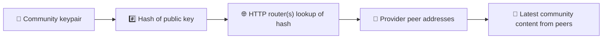
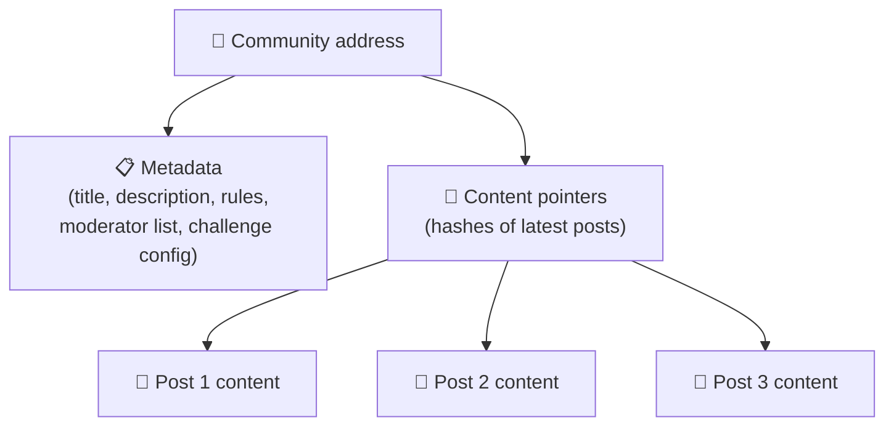
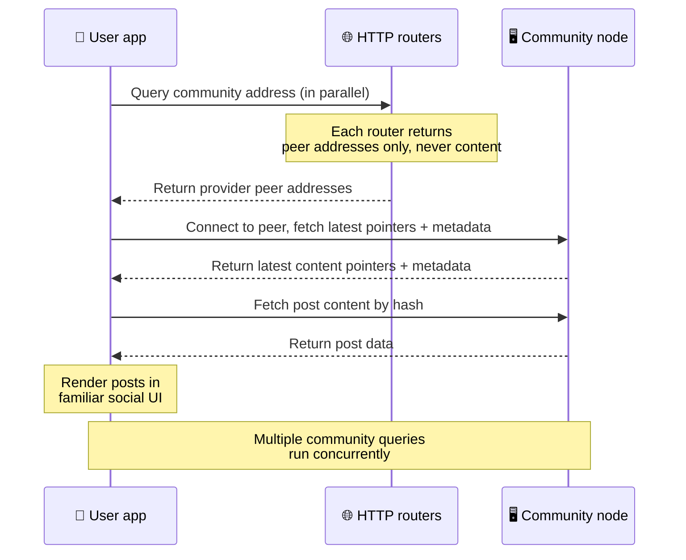
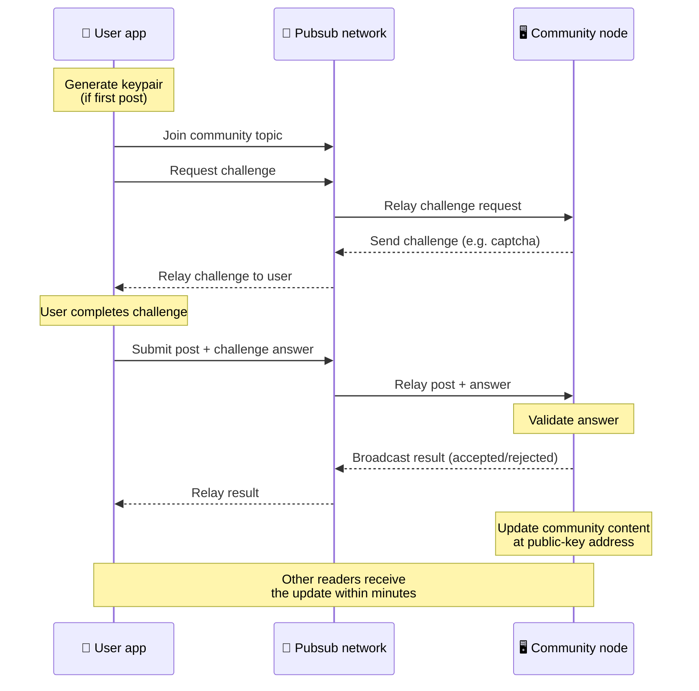
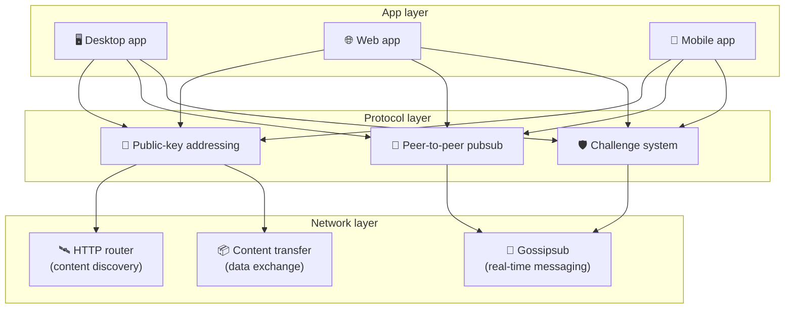

# Protocollo peer-to-peer

Bitsocial non usa una blockchain, un server di federazione o un backend centralizzato. Utilizza invece
lo stack IPFS/libp2p per combinare due idee: **l'indirizzamento basato su chiave pubblica** e il
**pubsub peer-to-peer**. Insieme permettono a chiunque di ospitare una comunità con hardware di
consumo, mentre gli utenti leggono e pubblicano senza account su un servizio controllato da un'azienda.

Per una spiegazione meno tecnica, leggi
[Una spiegazione completa per i non addetti ai lavori del protocollo Bitsocial](./layman-protocol-explanation.md).

## Bitsocial usa IPFS?

Sì. I nodi Bitsocial usano le primitive IPFS/libp2p per il livello peer-to-peer: record di comunità
indirizzati tramite chiave pubblica, trasferimento di contenuti tra peer e pubsub gossipsub per i
messaggi in tempo reale. Quando questa documentazione parla di «pubsub», intende il pubsub di
IPFS/libp2p, non un broker di messaggi centralizzato separato.

Al momento il protocollo descrive la scoperta dei contenuti attraverso router HTTP, perché i client
Bitsocial interrogano gli endpoint dei router per ottenere gli indirizzi dei peer fornitori invece di
affidarsi a una DHT ostile ai browser per ogni ricerca. I router restituiscono soltanto peer; il
trasferimento dei contenuti e il traffico pubsub continuano a passare attraverso la rete peer-to-peer.

## I due problemi

Una rete sociale decentralizzata deve rispondere a due domande:

1. **Dati** — come si archiviano e si servono i contenuti sociali di tutto il mondo senza un database centrale?
2. **Spam** — come si impedisce l'abuso mantenendo la rete gratuita da usare?

Bitsocial risolve il problema dei dati saltando del tutto la blockchain: i social media non hanno
bisogno di un ordinamento globale delle transazioni né della disponibilità permanente di ogni vecchio
post. Risolve il problema dello spam lasciando che ogni comunità gestisca la propria sfida anti-spam
sulla rete peer-to-peer.

Per il modello di scoperta che sta sopra questo livello di rete, vedi [Scoperta dei contenuti](./content-discovery.md).

---

## Indirizzamento basato su chiave pubblica {#public-key-based-addressing}

In BitTorrent l'hash di un file diventa il suo indirizzo (_indirizzamento basato sul contenuto_).
Bitsocial usa un'idea simile con le chiavi pubbliche: l'hash della chiave pubblica di una comunità
diventa il suo indirizzo di rete.

Qualsiasi peer della rete può interrogare un **router HTTP** per quell'indirizzo: il router risponde
con un elenco di indirizzi di rete dei peer che in quel momento forniscono l'hash della comunità, e il
client si collega direttamente a quei peer per recuperare lo stato più recente della comunità. Ogni
volta che il contenuto viene aggiornato, il suo numero di versione aumenta. La rete conserva solo
l'ultima versione — non serve preservare ogni stato storico, ed è questo che rende l'approccio
leggero rispetto a una blockchain.

> **Che cosa contiene davvero un router HTTP.** Un router HTTP è un indice minimale. Per ogni
> indirizzo di contenuto che conosce memorizza soltanto gli indirizzi di rete dei peer che si sono
> annunciati come fornitori (coppie IP/porta, multiaddr libp2p e simili). **Non** memorizza il
> contenuto della comunità, i suoi metadati, il testo dei post, l'elenco dei membri e nemmeno
> l'etichetta leggibile di ciò che si trova a quell'indirizzo; risponde soltanto alla domanda «quali
> peer dichiarano di avere questo hash?». Questo rende i router economici da gestire, facili da
> sostituire e non responsabili di ciò che gli utenti pubblicano, in modo simile a un tracker
> BitTorrent ma senza i metadati del torrent: un tracker mappa gli infohash sui peer, mentre un
> router HTTP mappa soltanto un indirizzo di contenuto sugli indirizzi dei peer fornitori.
>
> Per ridondanza il client interroga **diversi router HTTP in parallelo** e unisce gli elenchi di
> fornitori che riceve. Chiunque può gestire un router, e sostituire o aggiungere router è una
> modifica di configurazione che non richiede migrazione dei dati.
>
> Bitsocial usa router HTTP invece di una DHT perché gestire una DHT alla scala necessaria per la
> scoperta dei contenuti è costoso, soprattutto su mobile. Una DHT inoltre non funziona nel browser,
> dato che i browser non possono unirsi direttamente a una DHT libp2p. Un router HTTP gira a basso
> costo su normale infrastruttura HTTP e funziona altrettanto bene da un telefono o da un browser.

### Che cosa viene memorizzato all'indirizzo

L'indirizzo della comunità non contiene direttamente il contenuto completo dei post. Memorizza invece
un elenco di identificatori di contenuto — hash che puntano ai dati veri e propri. Il client recupera
poi ogni pezzo di contenuto direttamente dai peer restituiti dai router HTTP. I router stessi non
vedono né memorizzano mai il contenuto.

Almeno un peer ha sempre i dati: il nodo dell'operatore della comunità. Se la comunità è popolare,
molti altri peer li avranno a loro volta e il carico si distribuisce da sé, allo stesso modo in cui i
torrent popolari si scaricano più in fretta.

---

## Pubsub peer-to-peer

Il pubsub (publish-subscribe) è un modello di messaggistica in cui i peer si iscrivono a un topic e
ricevono ogni messaggio pubblicato su quel topic. Bitsocial usa una rete pubsub peer-to-peer: chiunque
può pubblicare, chiunque può iscriversi e non esiste un broker di messaggi centrale.

Per pubblicare un post in una comunità, un utente pubblica un messaggio il cui topic corrisponde alla
chiave pubblica della comunità. Il nodo dell'operatore della comunità lo raccoglie, lo convalida e —
se supera la sfida anti-spam — lo include nel successivo aggiornamento dei contenuti.

---

## Anti-spam: sfide tramite pubsub

Una rete pubsub aperta è vulnerabile alle ondate di spam. Bitsocial risolve il problema chiedendo a
chi pubblica di completare una **sfida** prima che il contenuto venga accettato.

Il sistema di sfide è flessibile: ogni operatore di comunità configura la propria politica. Tra le
opzioni disponibili:

| Tipo di sfida             | Come funziona                                       |
| ------------------------- | --------------------------------------------------- |
| **Captcha**               | Rompicapo visivo o interattivo presentato nell'app  |
| **Rate limiting**         | Limita i post per finestra temporale e per identità |
| **Token gate**            | Richiede la prova del saldo di un token specifico   |
| **Pagamento**             | Richiede un piccolo pagamento per ogni post         |
| **Allowlist**             | Solo le identità pre-approvate possono pubblicare   |
| **Codice personalizzato** | Qualsiasi politica esprimibile in codice            |

I peer che ritrasmettono troppi tentativi di sfida falliti vengono bloccati dal topic pubsub, il che
impedisce attacchi denial-of-service sul livello di rete.

---

## Ciclo di vita: leggere una comunità

Ecco che cosa succede quando un utente apre l'app e visualizza i post più recenti di una comunità.

**Passo dopo passo:**

1. L'utente apre l'app e vede un'interfaccia social.
2. Il client interroga in parallelo diversi router HTTP per ogni comunità seguita dall'utente; ogni
   router restituisce soltanto indirizzi di peer, mai contenuti. La latenza delle interrogazioni
   dipende dalle condizioni di rete e dal carico dei router; in condizioni tipiche di bassa latenza
   le risposte arrivano spesso entro circa un secondo e le interrogazioni procedono in modo
   concorrente.
3. Una volta ottenuti gli indirizzi dei peer, il client si collega a quei peer e recupera i puntatori
   ai contenuti più recenti della comunità e i suoi metadati (titolo, descrizione, elenco dei
   moderatori, configurazione della sfida).
4. Il client recupera il contenuto vero e proprio dei post usando quei puntatori, poi mostra tutto in
   un'interfaccia social familiare.

---

## Ciclo di vita: pubblicare un post

La pubblicazione prevede un handshake di sfida-risposta tramite pubsub prima che il post venga
accettato.

**Passo dopo passo:**

1. L'app genera una coppia di chiavi per l'utente, se non ne ha ancora una.
2. L'utente scrive un post per una comunità.
3. Il client si unisce al topic pubsub di quella comunità (derivato dalla chiave pubblica della
   comunità).
4. Il client richiede una sfida tramite pubsub.
5. Il nodo dell'operatore della comunità risponde con una sfida (per esempio un captcha).
6. L'utente completa la sfida.
7. Il client invia il post insieme alla risposta alla sfida tramite pubsub.
8. Il nodo dell'operatore della comunità convalida la risposta. Se è corretta, il post viene accettato.
9. Il nodo trasmette il risultato tramite pubsub, così i peer della rete sanno di dover continuare a
   ritrasmettere i messaggi di questo utente.
10. Il nodo aggiorna i contenuti della comunità al suo indirizzo basato su chiave pubblica.
11. Nel giro di pochi minuti ogni lettore della comunità riceve l'aggiornamento.

---

## Panoramica dell'architettura

Il sistema completo ha tre livelli che lavorano insieme:

| Livello        | Ruolo                                                                                                                                                                         |
| -------------- | ----------------------------------------------------------------------------------------------------------------------------------------------------------------------------- |
| **App**        | Interfaccia utente. Possono esistere più app, ognuna con il proprio design, tutte con le stesse comunità e le stesse identità.                                                |
| **Protocollo** | Definisce come vengono indirizzate le comunità, come vengono pubblicati i post e come viene impedito lo spam.                                                                 |
| **Rete**       | L'infrastruttura peer-to-peer sottostante: router HTTP per la scoperta, gossipsub per la messaggistica in tempo reale e il trasferimento di contenuti per lo scambio di dati. |

---

## Privacy: scollegare gli autori dagli indirizzi IP

Quando un utente pubblica un post, il contenuto viene **cifrato con la chiave pubblica dell'operatore
della comunità** prima di entrare nella rete pubsub. Questo significa che, mentre chi osserva la rete
può vedere che un peer ha pubblicato _qualcosa_, non può determinare:

- che cosa dice il contenuto
- quale identità autore lo ha pubblicato

È lo stesso principio per cui in BitTorrent è possibile scoprire quali IP fanno seeding di un torrent
ma non chi lo ha creato in origine. Il livello di cifratura aggiunge un'ulteriore garanzia di privacy
sopra questa base.

---

## Peer-to-peer nel browser

Il P2P nel browser è ormai possibile nei client Bitsocial. Un'app browser può eseguire un nodo
[Helia](https://helia.io/), usare lo stesso stack client del protocollo Bitsocial delle altre app e
recuperare i contenuti dai peer invece di chiedere a un gateway IPFS centralizzato di servirli. Il
browser può anche partecipare direttamente al pubsub, quindi nel percorso ottimale la pubblicazione
non ha bisogno di un provider pubsub di proprietà della piattaforma.

È questo il traguardo importante per la distribuzione sul web: un normale sito HTTPS può aprirsi come
client social P2P attivo. Gli utenti non devono installare un'app desktop per poter leggere dalla
rete, e chi gestisce l'app non deve mantenere un gateway centrale che diventa il punto di strozzatura
per la censura o la moderazione di ogni utente browser.

Il percorso browser ha limiti diversi da quelli di un nodo desktop o server:

- di norma un nodo browser non può accettare connessioni in ingresso arbitrarie da internet pubblico
- può caricare, convalidare, mettere in cache e pubblicare dati mentre l'app è aperta
- non va considerato l'host di lunga durata per i dati di una comunità
- l'hosting completo di una comunità resta gestito al meglio da un'app desktop, da `bitsocial-cli` o
  da un altro nodo sempre attivo

I router HTTP restano importanti per la scoperta dei contenuti: restituiscono gli indirizzi dei
fornitori per l'hash di una comunità. Non sono gateway IPFS, perché non servono il contenuto stesso.
Dopo la scoperta, il client browser si collega ai peer e recupera i dati attraverso lo stack P2P.

Il P2P nel browser è ormai il percorso web predefinito, non un esperimento nascosto dietro un
interruttore. 5chan usa in modo predefinito il P2P puro nel browser su 5chan.app, e il blog di
Bitsocial su bitsocial.net fa lo stesso. I peer nel browser stabiliscono connessioni tramite
WebSockets sicuri; `pkc-js` rifiuta in modo predefinito le connessioni WebRTC e WebTransport perché i
loro percorsi di apertura della connessione sono lenti e inaffidabili nel browser. La modifica
upstream che nel 2026 ha reso pratica la pubblicazione dal browser è stata la correzione del numero
di sequenza di gossipsub in `@libp2p/gossipsub` 15.0.21, che ha impedito ai peer Kubo di scartare i
messaggi pubblicati dai nodi JavaScript.

Per il quadro completo, incluso ciò che un nodo browser ancora non può fare, vedi
[Peer-to-peer nel browser](/browser-p2p/).

## Fallback tramite gateway {#gateway-fallback}

L'accesso da browser tramite gateway resta utile come fallback di compatibilità e di transizione. Un
gateway può inoltrare dati tra la rete P2P e un client browser quando il browser non può unirsi
direttamente alla rete o quando l'app sceglie deliberatamente il percorso più vecchio. Questi gateway:

- possono essere gestiti da chiunque
- non richiedono account utente né pagamenti
- non ottengono la custodia delle identità o delle comunità degli utenti
- possono essere sostituiti senza perdere dati

L'architettura di riferimento è prima il P2P nel browser, con i gateway come fallback opzionale
anziché come collo di bottiglia predefinito.

---

## Perché non una blockchain?

Le blockchain risolvono il problema della doppia spesa: hanno bisogno di conoscere l'ordine esatto di
ogni transazione per impedire che qualcuno spenda due volte la stessa moneta.

I social media non hanno un problema di doppia spesa. Non ha importanza se il post A è stato
pubblicato un millisecondo prima del post B, e i vecchi post non devono restare disponibili per
sempre su ogni nodo.

Saltando la blockchain, Bitsocial evita:

- **commissioni di gas** — pubblicare è gratuito
- **limiti di throughput** — nessun collo di bottiglia dovuto alla dimensione o al tempo di blocco
- **crescita incontrollata dello storage** — i nodi conservano solo ciò che serve loro
- **overhead di consenso** — nessun miner, validatore o staking richiesto

Il compromesso è che Bitsocial non garantisce la disponibilità permanente dei vecchi contenuti. Ma
per i social media è un compromesso accettabile: il nodo dell'operatore della comunità conserva i
dati, i contenuti popolari si diffondono su molti peer e i post molto vecchi svaniscono naturalmente
— proprio come accade su qualsiasi piattaforma social.

## Perché non la federazione?

Le reti federate (come l'email o le piattaforme basate su ActivityPub) migliorano rispetto alla
centralizzazione, ma hanno comunque limiti strutturali:

- **Dipendenza da un server** — ogni comunità ha bisogno di un server con un dominio, TLS e
  manutenzione continua
- **Fiducia nell'amministratore** — chi amministra il server ha pieno controllo sugli account e sui
  contenuti degli utenti
- **Frammentazione** — spostarsi da un server all'altro spesso significa perdere follower, cronologia
  o identità
- **Costo** — qualcuno deve pagare l'hosting, e questo crea una pressione verso il consolidamento

L'approccio peer-to-peer di Bitsocial elimina del tutto il server dall'equazione. Un nodo di comunità
può girare su un portatile, su un Raspberry Pi o su un VPS economico. L'operatore controlla la
politica di moderazione ma non può appropriarsi delle identità degli utenti, perché le identità sono
controllate da coppie di chiavi, non concesse da un server.

## E Nostr?

Nostr non rientra pulitamente in nessuna delle due categorie. Non è federazione in stile ActivityPub,
perché gli utenti non ricevono account dalle istanze e l'identità non è legata a un singolo server. E
non è nemmeno social media su blockchain, perché non ci sono catena, consenso, gas o ordine globale
delle transazioni.

Nostr si descrive meglio come **social media basato su relay**. Nel protocollo di base
([NIP-01](https://github.com/nostr-protocol/nips/blob/master/01.md)) gli utenti detengono coppie di
chiavi, firmano eventi e pubblicano quegli eventi su relay WebSocket. I client si iscrivono ai relay
con dei filtri, recuperano gli eventi corrispondenti e verificano le firme in locale. Gli utenti
possono anche pubblicare metadati con il proprio elenco di relay
([NIP-65](https://github.com/nostr-protocol/nips/blob/master/65.md)) che indicano ai client su quali
relay scrivono di solito e quali preferiscono per leggere le menzioni.

Questo avvicina Nostr a Bitsocial più di quanto facciano i sistemi federati o blockchain sotto un
aspetto importante: l'identità è crittografica e portabile. La differenza principale sta nel livello
dei dati. In Nostr i relay sono il normale livello di archiviazione e consegna. In Bitsocial i router
HTTP aiutano soltanto i client a trovare i peer. I router non memorizzano post, profili, metadati
delle comunità o stato di moderazione; restituiscono gli indirizzi dei peer fornitori, e poi sono i
client a recuperare i contenuti dai peer.

Le comunità mostrano la stessa divisione. Nostr ha schemi opzionali per
[gruppi basati su relay](https://github.com/nostr-protocol/nips/blob/master/29.md) e
[comunità approvate dai moderatori](https://github.com/nostr-protocol/nips/blob/master/72.md), ma
dipendono comunque dalla politica dei relay, dallo stato dei gruppi ospitato sui relay o dalle
scelte dei client su quali approvazioni rispettare. Bitsocial tratta le comunità come oggetti
crittografici di prima classe, il cui nodo operatore convalida i post, applica la politica di sfida
della comunità e pubblica nella rete peer-to-peer l'ultimo stato accettato.

| Domanda                | Nostr                                                                                                          | Bitsocial                                                                         |
| ---------------------- | -------------------------------------------------------------------------------------------------------------- | --------------------------------------------------------------------------------- |
| Categoria              | Protocollo basato su relay                                                                                     | Rete di comunità peer-to-peer                                                     |
| Identità               | Chiave pubblica dell'utente                                                                                    | Coppie di chiavi di utenti e comunità                                             |
| Percorso dei dati      | Eventi firmati pubblicati sui relay                                                                            | L'indirizzo a chiave pubblica risolve in peer; i contenuti si recuperano dai peer |
| Chi lo tiene online    | Relay scelti da utenti e client                                                                                | Nodo del proprietario della comunità più i seeder di supporto                     |
| Comunità               | Gruppi opzionali basati su relay o comunità approvate dai moderatori                                           | Comunità come oggetti di prima classe, con moderazione controllata dall'operatore |
| Anti-spam              | Politica dei relay, autenticazione, pagamento, proof-of-work, filtri lato client o approvazioni dei moderatori | Logica di sfida definita dalla comunità prima dell'inclusione                     |
| Compromesso principale | Identità portabile, ma disponibilità e politiche dipendenti dai relay                                          | Minore dipendenza dai relay, ma i vecchi contenuti non sono garantiti per sempre  |

---

## Riepilogo

Bitsocial è costruito su due primitive: l'indirizzamento basato su chiave pubblica per la scoperta
dei contenuti e il pubsub peer-to-peer per la comunicazione in tempo reale. Insieme producono una
rete sociale in cui:

- le comunità sono identificate da chiavi crittografiche, non da nomi di dominio
- i contenuti si diffondono tra i peer come un torrent, invece di essere serviti da un unico database
- la resistenza allo spam è locale a ogni comunità, non imposta da una piattaforma
- gli utenti possiedono la propria identità tramite coppie di chiavi, non tramite account revocabili
- l'intero sistema funziona senza server, blockchain o commissioni di piattaforma
