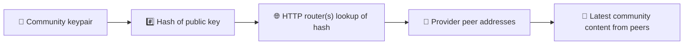
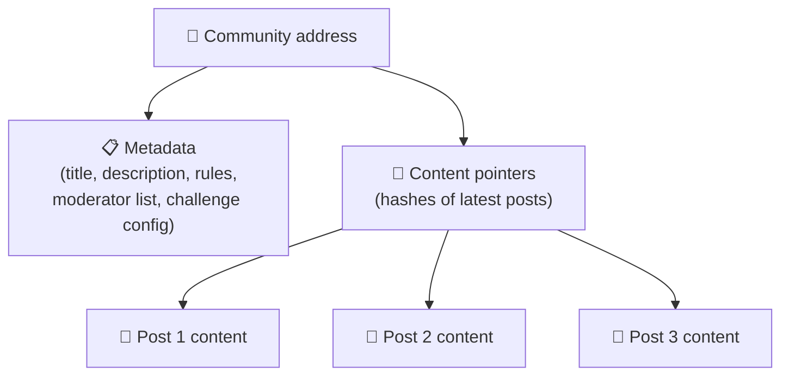
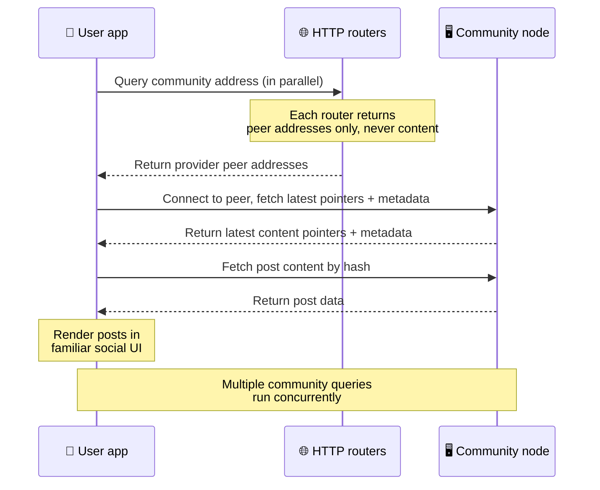
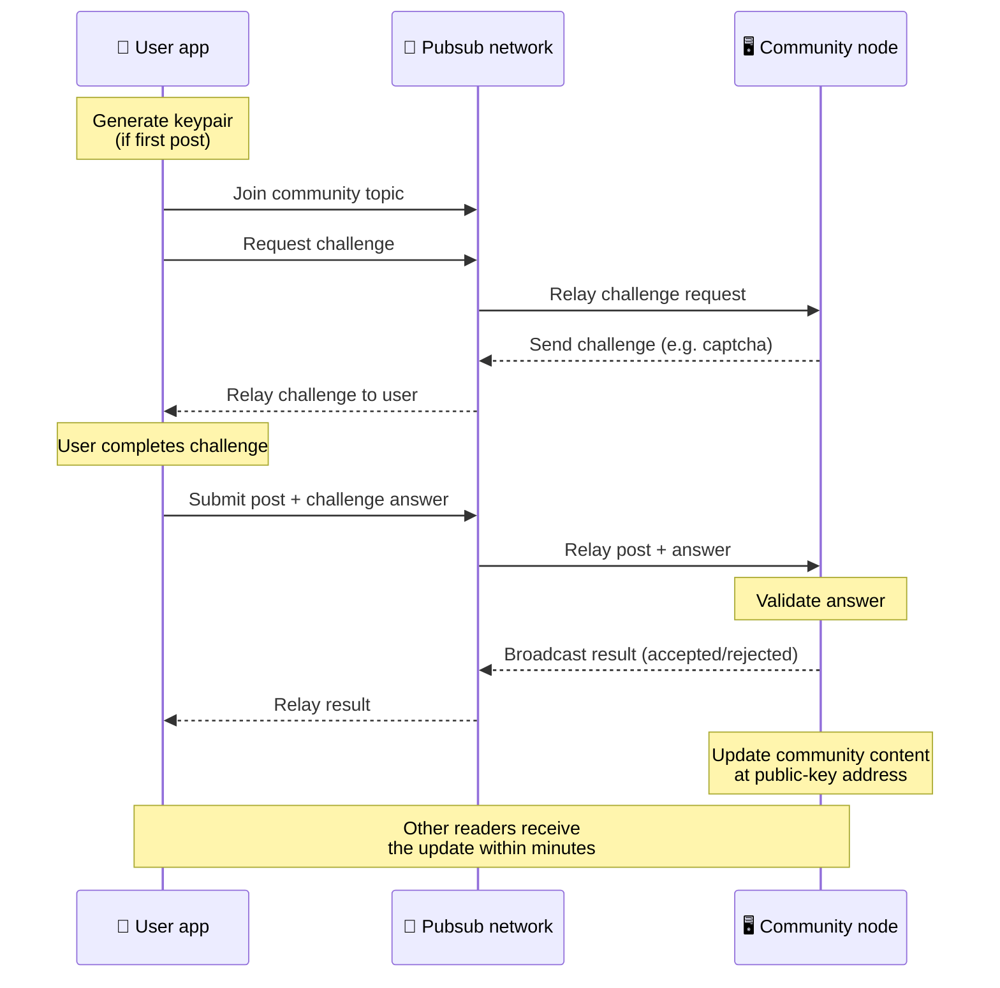
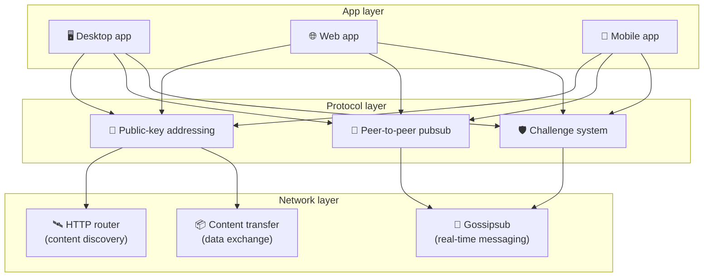

# ピアツーピアプロトコル

Bitsocial はブロックチェーンもフェデレーションサーバーも中央集権的なバックエンドも使いません。代わりに
IPFS/libp2p スタックを用いて、**公開鍵ベースのアドレッシング** と **ピアツーピア pubsub** という 2 つの
発想を組み合わせます。この 2 つによって、誰もが一般向けのハードウェアからコミュニティをホストでき、
利用者は企業が管理するサービスのアカウントなしに読み書きできるようになります。

より技術寄りでない解説は、
[Bitsocial プロトコルの完全な一般向け解説](./layman-protocol-explanation.md) を参照してください。

## Bitsocial は IPFS を使っていますか？

はい。Bitsocial のノードはピアツーピア層に IPFS/libp2p のプリミティブを使います。公開鍵でアドレス指定
されるコミュニティレコード、ピア間のコンテンツ転送、そしてリアルタイムメッセージのための gossipsub
pubsub です。このドキュメントで「pubsub」と言うときは、独立した中央集権的なメッセージブローカーでは
なく、IPFS/libp2p の pubsub を指します。

現在のプロトコルがディスカバリーを HTTP ルーター経由として説明しているのは、Bitsocial のクライアントが、
ルックアップのたびにブラウザと相性の悪い DHT に頼るのではなく、ルーターのエンドポイントにプロバイダー
ピアのアドレスを問い合わせるからです。ルーターが返すのはピアだけで、コンテンツ転送と pubsub の
トラフィックは引き続きピアツーピアネットワークを流れます。

## 2 つの課題

分散型のソーシャルネットワークは、次の 2 つの問いに答えなければなりません。

1. **データ** — 中央データベースなしに、世界中のソーシャルコンテンツをどう保存し配信するのか？
2. **スパム** — ネットワークを無料で使えるまま、どう悪用を防ぐのか？

Bitsocial はブロックチェーンを丸ごと省くことでデータの課題を解きます。ソーシャルメディアには、
グローバルなトランザクション順序も、古い投稿すべての恒久的な可用性も必要ないからです。スパムの課題は、
各コミュニティが独自のスパム対策チャレンジをピアツーピアネットワーク上で実行できるようにすることで
解決します。

このネットワーク層の上に載るディスカバリーのモデルについては、
[コンテンツディスカバリー](./content-discovery.md) を参照してください。

---

## 公開鍵ベースのアドレッシング {#public-key-based-addressing}

BitTorrent では、ファイルのハッシュがそのアドレスになります (_コンテンツベースのアドレッシング_)。
Bitsocial は公開鍵で似たことを行います。コミュニティの公開鍵のハッシュが、そのネットワークアドレスに
なります。

ネットワーク上のどのピアも、そのアドレスについて **HTTP ルーター** に問い合わせできます。ルーターは、
そのコミュニティのハッシュを現在提供しているピアのネットワークアドレスの一覧を返し、クライアントは
それらのピアに直接接続してコミュニティの最新状態を取得します。コンテンツが更新されるたびに、その
バージョン番号は増えていきます。ネットワークが保持するのは最新バージョンだけで、過去の状態をすべて
残す必要はありません。これがブロックチェーンと比べてこの方式を軽量にしている点です。

> **HTTP ルーターが実際に保持しているもの。** HTTP ルーターは薄いインデックスです。知っている
> コンテンツアドレスごとに、自らをプロバイダーとして告知したピアのネットワークアドレス (IP とポートの
> 組、libp2p の multiaddr といったもの) だけを保存します。コミュニティのコンテンツも、そのメタデータも、
> 投稿の本文も、メンバー一覧も、そのアドレスに何があるのかを示す人間可読なラベルさえ保存 **しません**。
> ただ「どのピアがこのハッシュを持っていると主張しているか？」に答えるだけです。そのためルーターは
> 運用が安く、差し替えやすく、利用者が公開する内容に責任を負いません。BitTorrent のトラッカーに
> 似ていますが、torrent のメタデータはありません。トラッカーが infohash をピアに対応づけるのに対し、
> HTTP ルーターはコンテンツアドレスをプロバイダーピアのアドレスに対応づけるだけです。
>
> 冗長性のため、クライアントは **複数の HTTP ルーターに並行して** 問い合わせ、返ってきたプロバイダーの
> 一覧をマージします。ルーターは誰でも運用でき、差し替えや追加は設定変更だけで済み、データ移行は
> 不要です。
>
> Bitsocial が DHT ではなく HTTP ルーターを使うのは、コンテンツディスカバリーに必要な規模で DHT を
> 動かすとコストが高く、特にモバイルで負担が大きいからです。DHT はブラウザでも動きません。ブラウザは
> libp2p の DHT に直接参加できないためです。HTTP ルーターは汎用の HTTP インフラ上で安価に動き、
> スマートフォンからでもブラウザからでも同じように機能します。

### アドレスに保存されるもの

コミュニティのアドレスは、投稿の本文をそのまま含んでいるわけではありません。代わりに、実際のデータを
指すハッシュであるコンテンツ識別子の一覧を保存します。クライアントはそのうえで、HTTP ルーターが返した
ピアから各コンテンツを直接取得します。ルーター自身がコンテンツを見ることも保存することもありません。

少なくとも 1 つのピアは常にそのデータを持っています。コミュニティ運用者のノードです。コミュニティに
人気があれば、ほかの多くのピアもそれを持つようになり、負荷は自然に分散します。人気のある torrent ほど
ダウンロードが速いのと同じです。

---

## ピアツーピア pubsub

Pubsub (publish-subscribe) は、ピアがトピックを購読し、そのトピックに公開されたすべてのメッセージを
受け取るというメッセージングのパターンです。Bitsocial はピアツーピアの pubsub ネットワークを使います。
誰でも公開でき、誰でも購読でき、中央のメッセージブローカーは存在しません。

コミュニティに投稿を公開するとき、利用者はそのコミュニティの公開鍵をトピックとするメッセージを公開
します。コミュニティ運用者のノードがそれを拾い、検証し、スパム対策チャレンジを通過していれば次の
コンテンツ更新に含めます。

---

## スパム対策: pubsub 上のチャレンジ

オープンな pubsub ネットワークはスパムの洪水に弱いものです。Bitsocial はこれを、コンテンツが受け入れ
られる前に公開者へ **チャレンジ** の完了を求めることで解決します。

チャレンジの仕組みは柔軟で、コミュニティ運用者がそれぞれ自分のポリシーを設定します。選択肢には次の
ようなものがあります。

| チャレンジの種類   | 仕組み                                             |
| ------------------ | -------------------------------------------------- |
| **Captcha**        | アプリ内で提示される視覚的または対話的なパズル     |
| **レート制限**     | アイデンティティごとに一定時間内の投稿数を制限する |
| **トークンゲート** | 特定のトークンの残高の証明を要求する               |
| **支払い**         | 投稿ごとに少額の支払いを要求する                   |
| **許可リスト**     | 事前に承認されたアイデンティティだけが投稿できる   |
| **カスタムコード** | コードで表現できる任意のポリシー                   |

失敗したチャレンジ試行をあまりに多く中継するピアは pubsub トピックからブロックされ、これによって
ネットワーク層へのサービス拒否攻撃を防ぎます。

---

## ライフサイクル: コミュニティを読む

利用者がアプリを開いてコミュニティの最新の投稿を見るとき、何が起きるのかを示します。

**手順:**

1. 利用者がアプリを開くと、ソーシャルなインターフェースが表示されます。
2. クライアントは、利用者がフォローしているコミュニティごとに複数の HTTP ルーターへ並行して問い合わせ
   ます。各ルーターが返すのはピアのアドレスだけで、コンテンツは決して返しません。問い合わせの遅延は
   ネットワークの状況とルーターの負荷に左右されますが、一般的な低遅延の条件下では、およそ 1 秒以内に
   結果が返ることが多く、問い合わせは同時並行で実行されます。
3. ピアのアドレスが手に入ると、クライアントはそれらのピアに接続し、コミュニティの最新のコンテンツ
   ポインターとメタデータ (タイトル、説明、モデレーター一覧、チャレンジ設定) を取得します。
4. クライアントはそのポインターを使って実際の投稿の本文を取得し、すべてを見慣れたソーシャルな
   インターフェースで描画します。

---

## ライフサイクル: 投稿を公開する

公開の際には、投稿が受け入れられる前に pubsub 上でチャレンジとレスポンスのやり取りが行われます。

**手順:**

1. 利用者がまだ鍵ペアを持っていなければ、アプリが鍵ペアを生成します。
2. 利用者があるコミュニティ向けの投稿を書きます。
3. クライアントがそのコミュニティの pubsub トピック (コミュニティの公開鍵に紐づく) に参加します。
4. クライアントが pubsub 経由でチャレンジを要求します。
5. コミュニティ運用者のノードがチャレンジ (たとえば captcha) を返します。
6. 利用者がチャレンジを完了します。
7. クライアントがチャレンジの回答とともに投稿を pubsub 経由で送信します。
8. コミュニティ運用者のノードが回答を検証します。正しければ投稿は受理されます。
9. ノードは結果を pubsub 経由でブロードキャストし、ネットワークのピアがこの利用者のメッセージを
   引き続き中継してよいことを知らせます。
10. ノードは自身の公開鍵アドレスにあるコミュニティのコンテンツを更新します。
11. 数分以内に、そのコミュニティのすべての読み手が更新を受け取ります。

---

## アーキテクチャの全体像

システム全体は、連携して動く 3 つの層で構成されます。

| 層               | 役割                                                                                                                                                         |
| ---------------- | ------------------------------------------------------------------------------------------------------------------------------------------------------------ |
| **アプリ**       | ユーザーインターフェース。複数のアプリが存在でき、それぞれ独自のデザインを持ちながら、同じコミュニティとアイデンティティを共有します。                       |
| **プロトコル**   | コミュニティのアドレス指定の方法、投稿の公開の方法、スパムの防ぎ方を定義します。                                                                             |
| **ネットワーク** | 土台となるピアツーピアのインフラ。ディスカバリーのための HTTP ルーター、リアルタイムメッセージングのための gossipsub、データ交換のためのコンテンツ転送です。 |

---

## プライバシー: 投稿者と IP アドレスの結びつきを断つ

利用者が投稿を公開するとき、その内容は pubsub ネットワークに入る前に
**コミュニティ運用者の公開鍵で暗号化** されます。つまり、ネットワークの観測者は、あるピアが _何か_ を
公開したことは分かっても、次のことは判別できません。

- コンテンツに何が書かれているか
- どの投稿者アイデンティティが公開したか

これは、BitTorrent である torrent をシードしている IP は分かっても、それを最初に作ったのが誰かは
分からないのと似ています。暗号化の層は、その土台の上にさらなるプライバシーの保証を加えます。

---

## ブラウザピアツーピア

Bitsocial のクライアントでは、ブラウザ P2P がすでに実現しています。ブラウザアプリは
[Helia](https://helia.io/) ノードを動かし、ほかのアプリと同じ Bitsocial プロトコルのクライアント
スタックを使い、中央集権的な IPFS ゲートウェイに配信を頼るのではなくピアからコンテンツを取得できます。
ブラウザは pubsub にも直接参加できるため、正常系では投稿にプラットフォーム所有の pubsub プロバイダーを
必要としません。

これはウェブでの配布にとって重要な節目です。ふつうの HTTPS のウェブサイトが、そのまま生きた P2P の
ソーシャルクライアントとして開けるということです。利用者はネットワークから読むためにデスクトップアプリを
入れる必要がなく、アプリの運用者も、すべてのブラウザ利用者にとっての検閲やモデレーションの
ボトルネックになる中央ゲートウェイを動かす必要がありません。

ブラウザの経路には、デスクトップやサーバーのノードとは異なる制約があります。

- ブラウザノードは通常、公開インターネットからの任意の受信接続を受け付けられません
- アプリが開いている間は、データの読み込み、検証、キャッシュ、公開ができます
- コミュニティのデータを長期にわたってホストする役割を任せるべきではありません
- コミュニティの完全なホスティングは、今もデスクトップアプリ、`bitsocial-cli`、あるいは常時稼働の
  別のノードに任せるのが最適です

HTTP ルーターは今もコンテンツディスカバリーで重要な役割を果たします。コミュニティのハッシュに対して
プロバイダーのアドレスを返すからです。コンテンツ自体を配信しないので、これらは IPFS ゲートウェイでは
ありません。ディスカバリーのあと、ブラウザのクライアントはピアに接続し、P2P スタック経由でデータを
取得します。

ブラウザ P2P は、いまやスイッチの裏に隠れた実験ではなく、ウェブの既定の経路です。5chan は 5chan.app で
既定として純粋なブラウザ P2P を動かしており、bitsocial.net の Bitsocial ブログも同様です。ブラウザの
ピアはセキュアな WebSockets でダイヤルします。`pkc-js` が WebRTC と WebTransport によるダイヤルを既定で
拒否するのは、ブラウザではそれらの接続確立の経路が遅く、信頼性に欠けるからです。2026 年にブラウザからの
公開を実用的にした上流の変更は、`@libp2p/gossipsub` 15.0.21 における gossipsub のシーケンス番号の修正で、
これにより Kubo のピアが JavaScript ノードの公開したメッセージを破棄しなくなりました。

ブラウザノードに今なおできないことを含む全体像は、
[ブラウザピアツーピア](/browser-p2p/) を参照してください。

## ゲートウェイによるフォールバック {#gateway-fallback}

ゲートウェイを介したブラウザからのアクセスは、互換性と移行のためのフォールバックとして今も有用です。
ブラウザがネットワークに直接参加できない場合や、アプリがあえて従来の経路を選ぶ場合、ゲートウェイは
P2P ネットワークとブラウザのクライアントの間でデータを中継できます。こうしたゲートウェイは:

- 誰でも運用できます
- 利用者のアカウントや支払いを必要としません
- 利用者のアイデンティティやコミュニティを預かることはありません
- データを失うことなく差し替えられます

目指すアーキテクチャは、ブラウザ P2P を第一とし、ゲートウェイは既定のボトルネックではなく任意の
フォールバックとして位置づけるものです。

---

## なぜブロックチェーンではないのか？

ブロックチェーンは二重支払いの問題を解決します。同じコインが二度使われるのを防ぐため、すべての
トランザクションの正確な順序を知る必要があるからです。

ソーシャルメディアに二重支払いの問題はありません。投稿 A が投稿 B の 1 ミリ秒前に公開されたかどうかは
重要ではありませんし、古い投稿がすべてのノードで恒久的に利用可能である必要もありません。

ブロックチェーンを省くことで、Bitsocial は次を避けられます。

- **ガス代** — 投稿は無料です
- **スループットの上限** — ブロックサイズやブロック生成時間のボトルネックがありません
- **ストレージの肥大化** — ノードは必要なものだけを保持します
- **コンセンサスのオーバーヘッド** — マイナーもバリデーターもステーキングも不要です

その代わり、Bitsocial は古いコンテンツの恒久的な可用性を保証しません。しかしソーシャルメディアに
とって、それは受け入れられるトレードオフです。コミュニティ運用者のノードがデータを保持し、人気のある
コンテンツは多くのピアへ広がり、とても古い投稿は自然に薄れていきます。どのソーシャルプラット
フォームでも起きているのと同じことです。

## なぜフェデレーションではないのか？

フェデレーション型のネットワーク (電子メールや ActivityPub ベースのプラットフォームなど) は中央集権
より改善されていますが、それでも構造的な制約を抱えています。

- **サーバー依存** — コミュニティごとに、ドメインと TLS と継続的な運用を伴うサーバーが必要です
- **管理者への信頼** — サーバー管理者が利用者のアカウントとコンテンツを完全に掌握します
- **分断** — サーバーを移ると、フォロワーや履歴、アイデンティティを失うことがよくあります
- **コスト** — 誰かがホスティング費用を払う必要があり、それが集約への圧力を生みます

Bitsocial のピアツーピアのアプローチは、サーバーという要素そのものを取り除きます。コミュニティの
ノードはノートパソコン、Raspberry Pi、安価な VPS で動かせます。運用者はモデレーションの方針を決められ
ますが、利用者のアイデンティティを取り上げることはできません。アイデンティティは鍵ペアによって制御
され、サーバーから与えられるものではないからです。

## Nostr はどうなのか？

Nostr はどちらの分類にもきれいには収まりません。インスタンスが利用者にアカウントを発行するわけでも、
アイデンティティが 1 つのサーバーに縛られるわけでもないので、ActivityPub 型のフェデレーションでは
ありません。チェーンもコンセンサスもガスもグローバルなトランザクション順序も存在しないので、
ブロックチェーン型のソーシャルメディアでもありません。

Nostr は **リレーベースのソーシャルメディア** と表現するのが適切です。基本プロトコル
([NIP-01](https://github.com/nostr-protocol/nips/blob/master/01.md)) では、利用者は鍵ペアを持ち、
イベントに署名し、そのイベントを WebSocket のリレーへ公開します。クライアントはフィルター付きで
リレーを購読し、条件に合うイベントを取得して、署名をローカルで検証します。利用者はリレーリストの
メタデータ ([NIP-65](https://github.com/nostr-protocol/nips/blob/master/65.md)) を公開することもでき、
そこには自分がふだん書き込むリレーと、メンションを読むために好んで使うリレーが示されます。

この点で Nostr は、フェデレーション型やブロックチェーン型のシステムよりも Bitsocial に近いと言えます。
アイデンティティが暗号学的で、持ち運べるからです。主な違いはデータ層にあります。Nostr では、リレーが
通常の保存と配信の層です。Bitsocial では、HTTP ルーターはクライアントがピアを見つける手助けをするだけ
です。ルーターは投稿もプロフィールもコミュニティのメタデータもモデレーションの状態も保存せず、
プロバイダーピアのアドレスを返し、そのあとクライアントがピアからコンテンツを取得します。

コミュニティについても同じ違いが表れます。Nostr には
[リレーベースのグループ](https://github.com/nostr-protocol/nips/blob/master/29.md) や
[モデレーター承認制のコミュニティ](https://github.com/nostr-protocol/nips/blob/master/72.md) といった
任意のパターンがありますが、いずれもリレーのポリシー、リレーが保持するグループの状態、あるいはどの
承認を尊重するかというクライアント側の判断に依存します。Bitsocial はコミュニティを第一級の暗号学的
オブジェクトとして扱い、その運用者ノードが投稿を検証し、コミュニティのチャレンジ方針を実行し、受理
された最新の状態をピアツーピアネットワークへ公開します。

| 論点                 | Nostr                                                                                              | Bitsocial                                                        |
| -------------------- | -------------------------------------------------------------------------------------------------- | ---------------------------------------------------------------- |
| 分類                 | リレーベースのプロトコル                                                                           | ピアツーピアのコミュニティネットワーク                           |
| アイデンティティ     | 利用者の公開鍵                                                                                     | 利用者とコミュニティの鍵ペア                                     |
| データの経路         | 署名済みイベントをリレーへ公開                                                                     | 公開鍵アドレスがピアに解決され、コンテンツはピアから取得         |
| 誰が公開を維持するか | 利用者とクライアントが選んだリレー                                                                 | コミュニティ所有者のノードと補助のシーダー                       |
| コミュニティ         | 任意のリレーベースのグループ、またはモデレーター承認制のコミュニティ                               | 運用者がモデレーションを管理する第一級のコミュニティオブジェクト |
| スパム対策           | リレーのポリシー、認証、支払い、プルーフオブワーク、クライアント側のフィルター、モデレーターの承認 | 取り込み前に実行されるコミュニティ定義のチャレンジロジック       |
| 主なトレードオフ     | アイデンティティは持ち運べるが、可用性と方針はリレーに依存                                         | リレーへの依存は少ないが、古いコンテンツが永続する保証はない     |

---

## まとめ

Bitsocial は 2 つのプリミティブの上に築かれています。コンテンツディスカバリーのための公開鍵ベースの
アドレッシングと、リアルタイムなやり取りのためのピアツーピア pubsub です。この 2 つが合わさって、次の
ようなソーシャルネットワークが生まれます。

- コミュニティはドメイン名ではなく暗号鍵で識別されます
- コンテンツは単一のデータベースから配信されるのではなく、torrent のようにピアの間へ広がります
- スパム耐性はプラットフォームに押し付けられるものではなく、コミュニティごとにローカルです
- 利用者は取り消し可能なアカウントではなく、鍵ペアを通じて自分のアイデンティティを所有します
- システム全体がサーバーもブロックチェーンもプラットフォーム手数料もなしに動きます
