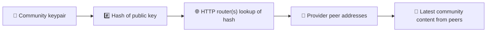
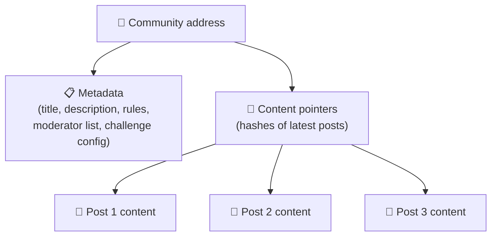
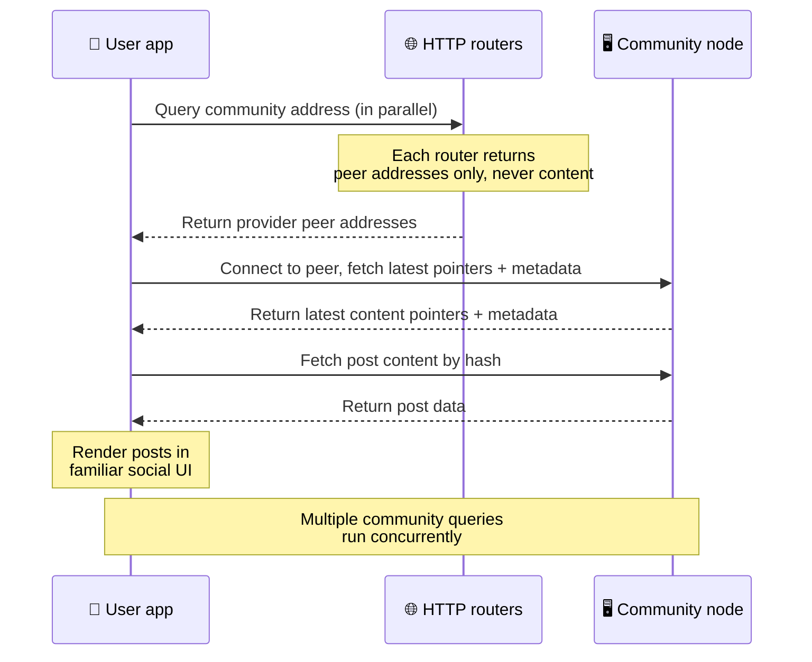
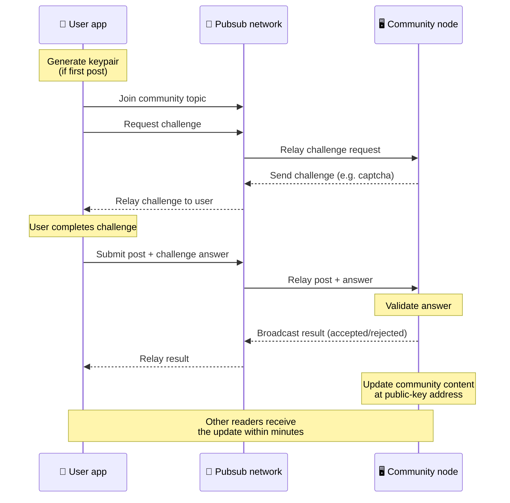
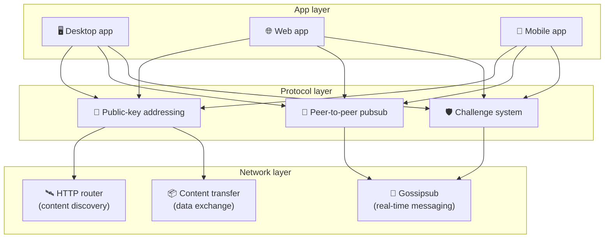

# P2P 프로토콜

Bitsocial은 블록체인도, 연합 서버도, 중앙 집중식 백엔드도 사용하지 않습니다. 대신 IPFS/libp2p 스택
위에서 **공개 키 기반 주소 지정**과 **P2P pubsub**이라는 두 가지 아이디어를 결합합니다. 이 둘이 합쳐지면
누구나 일반 소비자용 하드웨어로 커뮤니티를 호스팅할 수 있고, 사용자는 특정 회사가 통제하는 서비스에
계정을 만들지 않고도 글을 읽고 올릴 수 있습니다.

기술적 배경이 덜 필요한 설명을 원한다면
[Bitsocial 프로토콜에 대한 완전한 비전문가용 설명](./layman-protocol-explanation.md)을 읽어보세요.

## Bitsocial은 IPFS를 사용하나요?

네. Bitsocial 노드는 P2P 계층에 IPFS/libp2p 기본 요소를 사용합니다. 공개 키로 주소가 지정되는 커뮤니티
레코드, 피어 간 콘텐츠 전송, 실시간 메시지를 위한 gossipsub pubsub이 여기에 해당합니다. 이 문서에서
"pubsub"이라고 하면 별도의 중앙 집중식 메시지 브로커가 아니라 IPFS/libp2p pubsub을 뜻합니다.

현재 프로토콜이 HTTP 라우터를 통한 발견을 설명하는 이유는, Bitsocial 클라이언트가 조회할 때마다 브라우저
환경에 적대적인 DHT에 의존하는 대신 라우터 엔드포인트에 공급자 피어 주소를 질의하기 때문입니다. 라우터는
피어 주소만 돌려줍니다. 콘텐츠 전송과 pubsub 트래픽은 여전히 P2P 네트워크를 통해 오갑니다.

## 두 가지 문제

탈중앙화 소셜 네트워크는 두 가지 질문에 답해야 합니다.

1. **데이터** — 중앙 데이터베이스 없이 전 세계의 소셜 콘텐츠를 어떻게 저장하고 제공할 것인가?
2. **스팸** — 네트워크를 누구나 무료로 쓰게 하면서 어떻게 남용을 막을 것인가?

Bitsocial은 블록체인을 아예 건너뛰는 방식으로 데이터 문제를 해결합니다. 소셜 미디어에는 전역 트랜잭션
순서도, 모든 옛 게시물의 영구적인 가용성도 필요하지 않기 때문입니다. 스팸 문제는 각 커뮤니티가 P2P
네트워크 위에서 자체 스팸 방지 챌린지를 운영하도록 해서 해결합니다.

이 네트워크 계층 위에서 동작하는 발견 모델은 [콘텐츠 발견](./content-discovery.md)을 참고하세요.

---

## 공개 키 기반 주소 지정 {#public-key-based-addressing}

BitTorrent에서는 파일의 해시가 곧 그 파일의 주소가 됩니다(_콘텐츠 기반 주소 지정_). Bitsocial은 공개 키로
같은 발상을 적용합니다. 커뮤니티 공개 키의 해시가 그 커뮤니티의 네트워크 주소가 됩니다.

네트워크의 어떤 피어든 그 주소를 **HTTP 라우터**에 질의할 수 있습니다. 라우터는 현재 그 커뮤니티 해시를
제공하고 있는 피어들의 네트워크 주소 목록을 응답하고, 클라이언트는 그 피어들에 직접 연결해 커뮤니티의 최신
상태를 가져옵니다. 콘텐츠가 갱신될 때마다 버전 번호가 올라갑니다. 네트워크는 최신 버전만 보관합니다. 과거
상태를 전부 보존할 필요가 없다는 점이 이 방식을 블록체인보다 가볍게 만듭니다.

> **HTTP 라우터가 실제로 보관하는 것.** HTTP 라우터는 얇은 색인일 뿐입니다. 자신이 아는 콘텐츠 주소마다,
> 스스로를 공급자라고 알린 피어들의 네트워크 주소(IP/포트 쌍, libp2p 멀티어드레스 같은 것)만 저장합니다.
> 커뮤니티의 콘텐츠나 메타데이터, 게시물 본문, 구성원 목록은 물론이고 그 주소에 무엇이 있는지 사람이 읽을
> 수 있는 이름조차 저장하지 **않습니다**. 그저 "이 해시를 가지고 있다고 주장하는 피어는 누구인가?"에만
> 답합니다. 덕분에 라우터는 운영 비용이 낮고, 갈아 끼우기 쉬우며, 사용자가 게시한 내용에 대해 책임을 지지
> 않습니다. BitTorrent 트래커와 비슷하되 토렌트 메타데이터는 없는 셈입니다. 트래커는 인포해시를 피어에
> 매핑하지만, HTTP 라우터는 콘텐츠 주소를 공급자 피어 주소에만 매핑합니다.
>
> 이중화를 위해 클라이언트는 **여러 HTTP 라우터에 동시에** 질의하고 돌려받은 공급자 목록을 병합합니다.
> 누구나 라우터를 운영할 수 있고, 라우터를 교체하거나 추가하는 일은 데이터 마이그레이션이 필요 없는 설정
> 변경에 불과합니다.
>
> Bitsocial이 DHT 대신 HTTP 라우터를 쓰는 이유는 콘텐츠 발견에 필요한 규모로 DHT를 운영하는 비용이 크기
> 때문이며, 특히 모바일에서 그렇습니다. 게다가 브라우저는 libp2p DHT에 직접 참여할 수 없어 DHT는 브라우저
> 안에서 아예 동작하지 않습니다. HTTP 라우터는 흔한 HTTP 인프라 위에서 저렴하게 돌아가고, 휴대폰에서든
> 브라우저에서든 똑같이 잘 동작합니다.

### 주소에 저장되는 것

커뮤니티 주소에 게시물 본문 전체가 직접 담기지는 않습니다. 대신 실제 데이터를 가리키는 해시, 즉 콘텐츠
식별자 목록을 저장합니다. 그러면 클라이언트는 HTTP 라우터가 알려준 피어들로부터 각 콘텐츠를 직접
가져옵니다. 라우터 자체는 그 콘텐츠를 보지도, 저장하지도 않습니다.

최소한 한 피어는 언제나 데이터를 가지고 있습니다. 바로 커뮤니티 운영자의 노드입니다. 커뮤니티가 인기를
얻으면 다른 많은 피어도 데이터를 갖게 되어 부하가 저절로 분산됩니다. 인기 있는 토렌트일수록 내려받기가
빠른 것과 같은 원리입니다.

---

## P2P pubsub

Pubsub(발행-구독)은 피어가 토픽을 구독하면 그 토픽에 발행된 모든 메시지를 받아보는 메시징 패턴입니다.
Bitsocial은 P2P pubsub 네트워크를 사용합니다. 누구나 발행할 수 있고 누구나 구독할 수 있으며, 중앙 메시지
브로커는 없습니다.

커뮤니티에 글을 올리려면 사용자는 커뮤니티의 공개 키를 토픽으로 삼아 메시지를 발행합니다. 커뮤니티 운영자의
노드가 이를 받아 검증하고, 스팸 방지 챌린지를 통과했다면 다음 콘텐츠 갱신에 포함합니다.

---

## 스팸 방지: pubsub을 통한 챌린지

열려 있는 pubsub 네트워크는 스팸 폭주에 취약합니다. Bitsocial은 발행자가 콘텐츠를 인정받기 전에
**챌린지**를 통과하도록 요구해 이 문제를 해결합니다.

챌린지 시스템은 유연합니다. 커뮤니티 운영자마다 자기 정책을 설정합니다. 선택지는 다음과 같습니다.

| 챌린지 종류          | 동작 방식                                  |
| -------------------- | ------------------------------------------ |
| **캡차**             | 앱에 표시되는 시각적 또는 상호작용형 퍼즐  |
| **속도 제한**        | 신원별로 일정 시간 동안의 게시 횟수를 제한 |
| **토큰 게이트**      | 특정 토큰의 잔액 증명을 요구               |
| **결제**             | 게시물마다 소액 결제를 요구                |
| **허용 목록**        | 사전 승인된 신원만 게시 가능               |
| **사용자 정의 코드** | 코드로 표현할 수 있는 모든 정책            |

실패한 챌린지 시도를 지나치게 많이 중계하는 피어는 해당 pubsub 토픽에서 차단되며, 이를 통해 네트워크 계층에
대한 서비스 거부 공격을 막습니다.

---

## 수명 주기: 커뮤니티 읽기

사용자가 앱을 열고 커뮤니티의 최신 게시물을 볼 때 일어나는 일입니다.

**단계별 흐름:**

1. 사용자가 앱을 열면 소셜 인터페이스가 나타납니다.
2. 클라이언트는 사용자가 팔로우하는 커뮤니티마다 여러 HTTP 라우터에 동시에 질의합니다. 각 라우터는 콘텐츠가
   아니라 피어 주소만 돌려줍니다. 질의 지연 시간은 네트워크 상태와 라우터 부하에 따라 달라지며, 지연이 낮은
   일반적인 환경에서는 대개 1초 안팎에 응답이 돌아오고 여러 질의가 동시에 진행됩니다.
3. 피어 주소를 확보한 클라이언트는 그 피어들에 연결해 커뮤니티의 최신 콘텐츠 포인터와 메타데이터(제목, 설명,
   모더레이터 목록, 챌린지 설정)를 가져옵니다.
4. 클라이언트는 그 포인터로 실제 게시물 콘텐츠를 가져온 다음, 익숙한 소셜 인터페이스로 전부 렌더링합니다.

---

## 수명 주기: 게시물 발행

발행 과정에서는 게시물이 받아들여지기 전에 pubsub을 통한 챌린지-응답 핸드셰이크가 이루어집니다.

**단계별 흐름:**

1. 사용자에게 키페어가 아직 없다면 앱이 하나 만들어 줍니다.
2. 사용자가 커뮤니티에 올릴 글을 작성합니다.
3. 클라이언트가 그 커뮤니티의 pubsub 토픽(커뮤니티 공개 키를 키로 사용)에 참여합니다.
4. 클라이언트가 pubsub을 통해 챌린지를 요청합니다.
5. 커뮤니티 운영자의 노드가 챌린지(예를 들면 캡차)를 돌려보냅니다.
6. 사용자가 챌린지를 통과합니다.
7. 클라이언트가 챌린지 답과 함께 게시물을 pubsub으로 제출합니다.
8. 커뮤니티 운영자의 노드가 답을 검증합니다. 답이 맞으면 게시물이 받아들여집니다.
9. 노드는 결과를 pubsub으로 알려, 네트워크 피어들이 이 사용자의 메시지를 계속 중계해도 된다는 사실을 알게
   합니다.
10. 노드는 자신의 공개 키 주소에 있는 커뮤니티 콘텐츠를 갱신합니다.
11. 몇 분 안에 그 커뮤니티의 모든 독자가 갱신 내용을 받습니다.

---

## 아키텍처 개요

전체 시스템은 서로 맞물려 동작하는 세 계층으로 이루어집니다.

| 계층         | 역할                                                                                                                        |
| ------------ | --------------------------------------------------------------------------------------------------------------------------- |
| **앱**       | 사용자 인터페이스. 앱은 여러 개 존재할 수 있고 저마다 디자인이 다르지만, 모두 같은 커뮤니티와 신원을 공유합니다.            |
| **프로토콜** | 커뮤니티에 어떻게 주소를 부여하고, 게시물을 어떻게 발행하며, 스팸을 어떻게 막는지 정의합니다.                               |
| **네트워크** | 그 아래를 받치는 P2P 인프라. 발견을 맡는 HTTP 라우터, 실시간 메시징을 맡는 gossipsub, 데이터 교환을 맡는 콘텐츠 전송입니다. |

---

## 프라이버시: 작성자와 IP 주소의 연결 끊기

사용자가 게시물을 발행하면, 그 콘텐츠는 pubsub 네트워크에 들어가기 전에 **커뮤니티 운영자의 공개 키로
암호화**됩니다. 그래서 네트워크를 지켜보는 쪽에서는 어떤 피어가 _무언가를_ 발행했다는 사실은 볼 수 있어도
다음은 알아낼 수 없습니다.

- 그 콘텐츠에 무슨 내용이 담겨 있는지
- 어떤 작성자 신원이 그것을 발행했는지

이는 BitTorrent에서 어떤 IP가 토렌트를 시딩하는지는 알아낼 수 있어도 원래 누가 그것을 만들었는지는 알 수
없는 것과 비슷합니다. 암호화 계층은 그 기본선 위에 프라이버시 보장을 한 겹 더 얹습니다.

---

## 브라우저 P2P

이제 Bitsocial 클라이언트에서 브라우저 P2P가 가능합니다. 브라우저 앱은 [Helia](https://helia.io/) 노드를
실행하고, 다른 앱과 동일한 Bitsocial 프로토콜 클라이언트 스택을 사용하며, 중앙 집중식 IPFS 게이트웨이에
콘텐츠 제공을 요청하는 대신 피어에서 직접 콘텐츠를 가져올 수 있습니다. 브라우저는 pubsub에도 직접 참여할 수
있으므로, 정상 경로에서는 글을 올릴 때 플랫폼이 소유한 pubsub 공급자가 필요하지 않습니다.

이것이 웹 배포에서 중요한 이정표입니다. 평범한 HTTPS 웹사이트가 그대로 살아 있는 P2P 소셜 클라이언트로
열립니다. 사용자는 네트워크에서 글을 읽기 위해 데스크톱 앱을 먼저 설치할 필요가 없고, 앱 운영자는 모든
브라우저 사용자에게 검열이나 모더레이션의 병목이 되는 중앙 게이트웨이를 운영할 필요가 없습니다.

브라우저 경로에는 데스크톱이나 서버 노드와는 다른 제약이 있습니다.

- 브라우저 노드는 대개 공개 인터넷에서 오는 임의의 인바운드 연결을 받을 수 없습니다
- 앱이 열려 있는 동안에는 데이터를 불러오고, 검증하고, 캐시하고, 발행할 수 있습니다
- 커뮤니티 데이터를 오래 보관하는 호스트로 취급해서는 안 됩니다
- 커뮤니티 전체 호스팅은 여전히 데스크톱 앱, `bitsocial-cli`, 또는 상시 가동되는 다른 노드가 맡는 것이
  가장 좋습니다

콘텐츠 발견에는 여전히 HTTP 라우터가 필요합니다. 라우터는 커뮤니티 해시에 대한 공급자 주소를 돌려줍니다.
콘텐츠 자체를 제공하지는 않으므로 IPFS 게이트웨이와는 다릅니다. 발견이 끝나면 브라우저 클라이언트는 피어에
연결해 P2P 스택으로 데이터를 가져옵니다.

브라우저 P2P는 이제 스위치 뒤에 숨겨진 실험이 아니라 기본 웹 경로입니다. 5chan은 5chan.app에서 기본적으로
순수 브라우저 P2P로 동작하고, bitsocial.net의 Bitsocial 블로그도 마찬가지입니다. 브라우저 피어는 보안
WebSockets로 다이얼합니다. `pkc-js`는 WebRTC와 WebTransport 다이얼을 기본적으로 거부하는데, 브라우저에서
이들의 연결 수립 경로가 느리고 불안정하기 때문입니다. 2026년에 브라우저 발행을 실용적으로 만든 업스트림
변경은 `@libp2p/gossipsub` 15.0.21의 gossipsub 시퀀스 번호 수정이었고, 이 수정으로 Kubo 피어가 JavaScript
노드가 발행한 메시지를 버리지 않게 되었습니다.

브라우저 노드가 아직 할 수 없는 일까지 포함한 전체 그림은 [브라우저 P2P](/browser-p2p/)를 참고하세요.

## 게이트웨이 폴백 {#gateway-fallback}

게이트웨이를 거치는 브라우저 접근은 호환성과 점진적 전환을 위한 폴백으로 여전히 쓸모가 있습니다. 브라우저가
네트워크에 직접 참여할 수 없거나 앱이 의도적으로 예전 경로를 고를 때, 게이트웨이가 P2P 네트워크와 브라우저
클라이언트 사이에서 데이터를 중계할 수 있습니다. 이런 게이트웨이는

- 누구나 운영할 수 있고
- 사용자 계정이나 결제를 요구하지 않으며
- 사용자 신원이나 커뮤니티를 넘겨받지 않고
- 데이터를 잃지 않고 교체할 수 있습니다

목표로 삼는 아키텍처는 브라우저 P2P를 우선하고, 게이트웨이는 기본 병목이 아니라 선택적 폴백으로 두는
것입니다.

---

## 왜 블록체인이 아닌가?

블록체인은 이중 지불 문제를 해결합니다. 같은 코인을 두 번 쓰지 못하게 하려면 모든 트랜잭션의 정확한 순서를
알아야 하기 때문입니다.

소셜 미디어에는 이중 지불 문제가 없습니다. 게시물 A가 게시물 B보다 1밀리초 먼저 발행되었는지는 중요하지
않고, 오래된 게시물이 모든 노드에 영구히 남아 있을 필요도 없습니다.

블록체인을 건너뜀으로써 Bitsocial은 다음을 피합니다.

- **가스 수수료** — 글을 올리는 데 돈이 들지 않습니다
- **처리량 한계** — 블록 크기나 블록 생성 시간이라는 병목이 없습니다
- **저장소 비대화** — 노드는 필요한 것만 보관합니다
- **합의 비용** — 채굴자도, 검증자도, 스테이킹도 필요 없습니다

그 대가로 Bitsocial은 오래된 콘텐츠의 영구적인 가용성을 보장하지 않습니다. 하지만 소셜 미디어에서는 받아들일
만한 절충입니다. 커뮤니티 운영자의 노드가 데이터를 보관하고, 인기 있는 콘텐츠는 여러 피어로 퍼지며, 아주
오래된 게시물은 자연스럽게 잊힙니다. 어느 소셜 플랫폼에서나 일어나는 일과 같습니다.

## 왜 연합이 아닌가?

연합 네트워크(이메일이나 ActivityPub 기반 플랫폼 등)는 중앙 집중보다 나아진 형태이지만 여전히 구조적인
한계가 있습니다.

- **서버 의존** — 커뮤니티마다 도메인과 TLS, 지속적인 유지보수가 필요한 서버가 있어야 합니다
- **관리자 신뢰** — 서버 관리자가 사용자 계정과 콘텐츠를 전적으로 통제합니다
- **파편화** — 서버를 옮기면 팔로워나 기록, 신원을 잃는 경우가 많습니다
- **비용** — 누군가는 호스팅 비용을 내야 하고, 이는 소수 서버로의 집중을 부추깁니다

Bitsocial의 P2P 방식은 이 그림에서 서버를 아예 걷어냅니다. 커뮤니티 노드는 노트북에서도, Raspberry Pi에서도,
값싼 VPS에서도 돌아갑니다. 운영자는 모더레이션 정책을 정하지만 사용자 신원을 빼앗을 수는 없습니다. 신원은
서버가 발급하는 것이 아니라 키페어가 통제하기 때문입니다.

## Nostr는 어떤가요?

Nostr는 두 범주 어느 쪽에도 깔끔하게 들어맞지 않습니다. 인스턴스가 사용자에게 계정을 발급하지 않고 신원이
특정 서버에 묶이지도 않으므로 ActivityPub 스타일의 연합은 아닙니다. 체인도, 합의도, 가스도, 전역 트랜잭션
순서도 없으므로 블록체인 소셜 미디어도 아닙니다.

Nostr는 **릴레이 기반 소셜 미디어**라고 부르는 편이 더 정확합니다. 기본 프로토콜([NIP-01](https://github.com/nostr-protocol/nips/blob/master/01.md))에서
사용자는 키페어를 보유하고, 이벤트에 서명하고, 그 이벤트를 WebSocket 릴레이에 발행합니다. 클라이언트는
필터를 걸어 릴레이를 구독하고, 조건에 맞는 이벤트를 가져와, 서명을 로컬에서 검증합니다. 사용자는 자신이
평소 어떤 릴레이에 쓰는지, 멘션을 읽을 때 어떤 릴레이를 선호하는지 클라이언트에 알려주는 릴레이 목록
메타데이터([NIP-65](https://github.com/nostr-protocol/nips/blob/master/65.md))를 발행할 수도 있습니다.

그래서 Nostr는 한 가지 중요한 측면에서 연합 시스템이나 블록체인 시스템보다 Bitsocial에 가깝습니다. 신원이
암호학적이고 이동 가능하다는 점입니다. 가장 큰 차이는 데이터 계층에 있습니다. Nostr에서 릴레이는 평상시의
저장·전달 계층입니다. Bitsocial에서 HTTP 라우터는 클라이언트가 피어를 찾도록 돕기만 합니다. 라우터는
게시물이나 프로필, 커뮤니티 메타데이터, 모더레이션 상태를 저장하지 않고 공급자 피어 주소를 돌려줄 뿐이며,
그다음 클라이언트가 피어에서 콘텐츠를 가져옵니다.

커뮤니티에서도 같은 차이가 드러납니다. Nostr에는
[릴레이 기반 그룹](https://github.com/nostr-protocol/nips/blob/master/29.md)과
[모더레이터 승인 커뮤니티](https://github.com/nostr-protocol/nips/blob/master/72.md)를 위한 선택적 패턴이
있지만, 여전히 릴레이 정책이나 릴레이가 보관하는 그룹 상태, 어떤 승인을 인정할지에 대한 클라이언트의 선택에
기댑니다. Bitsocial은 커뮤니티를 일급 암호학적 객체로 다루며, 그 운영자 노드가 게시물을 검증하고 커뮤니티의
챌린지 정책을 실행하며 최신 승인 상태를 P2P 네트워크에 발행합니다.

| 질문             | Nostr                                                                | Bitsocial                                                   |
| ---------------- | -------------------------------------------------------------------- | ----------------------------------------------------------- |
| 분류             | 릴레이 기반 프로토콜                                                 | P2P 커뮤니티 네트워크                                       |
| 신원             | 사용자 공개 키                                                       | 사용자 키페어와 커뮤니티 키페어                             |
| 데이터 경로      | 릴레이에 발행되는 서명된 이벤트                                      | 공개 키 주소가 피어로 해석되고, 콘텐츠는 피어에서 가져옴    |
| 온라인 유지 주체 | 사용자와 클라이언트가 고른 릴레이                                    | 커뮤니티 소유자 노드와 보조 시더                            |
| 커뮤니티         | 선택적인 릴레이 기반 그룹 또는 모더레이터 승인 커뮤니티              | 운영자가 모더레이션을 통제하는 일급 커뮤니티 객체           |
| 스팸 방지        | 릴레이 정책, 인증, 결제, 작업 증명, 클라이언트 필터, 모더레이터 승인 | 포함 이전에 실행되는 커뮤니티 정의 챌린지 로직              |
| 주요 절충        | 이동 가능한 신원, 그러나 릴레이에 좌우되는 가용성과 정책             | 릴레이 의존은 적지만 오래된 콘텐츠가 영구히 보장되지는 않음 |

---

## 요약

Bitsocial은 두 가지 기본 요소 위에 세워졌습니다. 콘텐츠 발견을 위한 공개 키 기반 주소 지정, 그리고 실시간
통신을 위한 P2P pubsub입니다. 이 둘이 만나 다음과 같은 소셜 네트워크가 만들어집니다.

- 커뮤니티는 도메인 이름이 아니라 암호학적 키로 식별됩니다
- 콘텐츠는 하나의 데이터베이스에서 제공되는 대신 토렌트처럼 피어들 사이로 퍼집니다
- 스팸 저항은 플랫폼이 강제하는 것이 아니라 커뮤니티마다 자체적으로 정합니다
- 사용자는 취소될 수 있는 계정이 아니라 키페어를 통해 자신의 신원을 소유합니다
- 시스템 전체가 서버도, 블록체인도, 플랫폼 수수료도 없이 돌아갑니다
