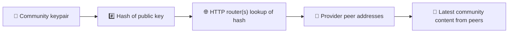
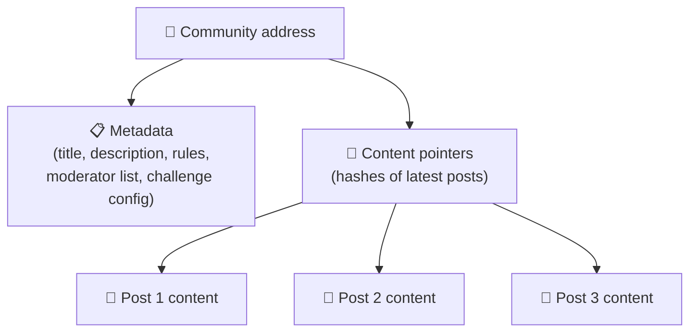
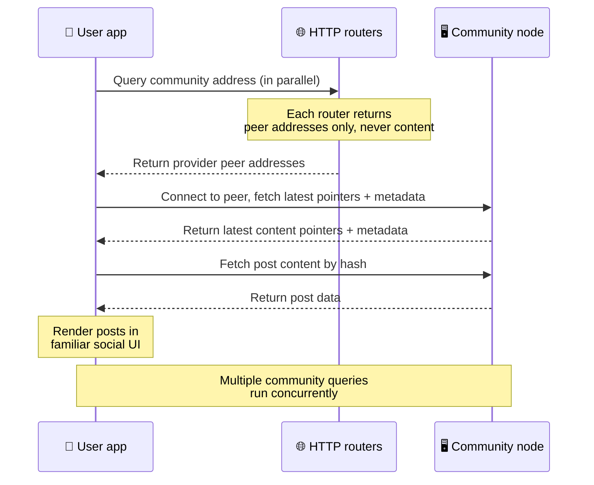
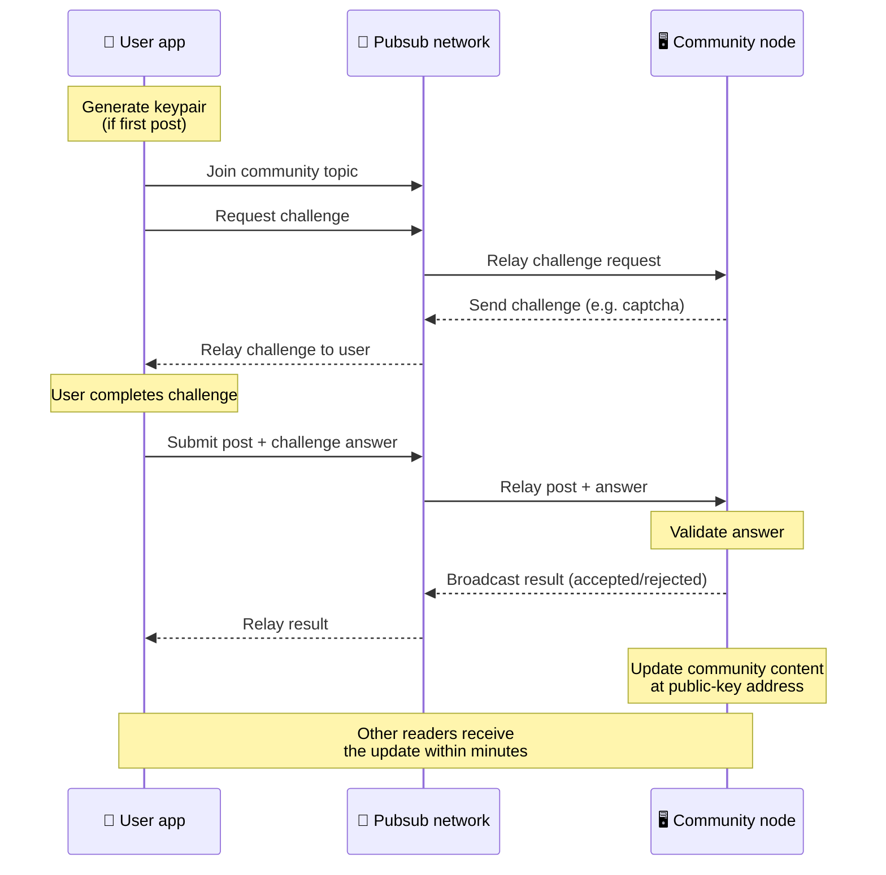
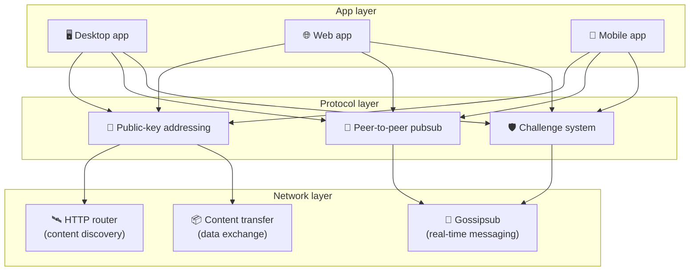

# Peer-to-Peer प्रोटोकॉल

Bitsocial ब्लॉकचेन, फेडरेशन सर्व्हर किंवा केंद्रीकृत बॅकएंड वापरत नाही. त्याऐवजी ते दोन कल्पना एकत्र
आणण्यासाठी IPFS/libp2p स्टॅक वापरते: **सार्वजनिक-की-आधारित ॲड्रेसिंग** आणि **peer-to-peer pubsub**.
या दोन्हींमुळे कोणालाही सामान्य ग्राहक हार्डवेअरवरून समुदाय होस्ट करता येतो, आणि वापरकर्ते कोणत्याही
कंपनी-नियंत्रित सेवेवर खाते न काढता वाचू आणि पोस्ट करू शकतात.

कमी तांत्रिक स्पष्टीकरणासाठी
[Bitsocial प्रोटोकॉलचे संपूर्ण सोप्या भाषेतील स्पष्टीकरण](./layman-protocol-explanation.md) वाचा.

## Bitsocial IPFS वापरते का?

होय. Bitsocial नोड्स peer-to-peer लेयरसाठी IPFS/libp2p प्रिमिटिव्ह्ज वापरतात: सार्वजनिक-कीने ॲड्रेस
केलेले समुदाय रेकॉर्ड, पीअरदरम्यान सामग्रीचे हस्तांतरण, आणि रिअल-टाइम संदेशांसाठी gossipsub pubsub.
या दस्तऐवजांत "pubsub" असे म्हटले जाते तेव्हा त्याचा अर्थ IPFS/libp2p pubsub असा असतो, वेगळा
केंद्रीकृत मेसेज ब्रोकर नव्हे.

सध्या प्रोटोकॉल शोध HTTP राउटरमार्फत होतो असे वर्णन करतो, कारण Bitsocial क्लायंट प्रत्येक लुकअपसाठी
ब्राउझरला प्रतिकूल असणाऱ्या DHT वर अवलंबून राहण्याऐवजी प्रदाता पीअर पत्त्यांसाठी राउटर एंडपॉइंटना
विचारणा करतात. राउटर फक्त पीअर परत करतात; सामग्रीचे हस्तांतरण आणि pubsub ट्रॅफिक अजूनही
peer-to-peer नेटवर्कमधूनच जाते.

## दोन समस्या

विकेंद्रित सोशल नेटवर्कला दोन प्रश्नांची उत्तरे द्यावी लागतात:

1. **डेटा** — केंद्रीय डेटाबेसशिवाय जगातील सोशल सामग्री कशी साठवायची आणि पुरवायची?
2. **स्पॅम** — नेटवर्क वापरायला मोफत ठेवत असतानाच गैरवापर कसा रोखायचा?

Bitsocial ब्लॉकचेन पूर्णपणे टाळून डेटाची समस्या सोडवते: सोशल मीडियाला जागतिक व्यवहार-क्रमवारीची किंवा
प्रत्येक जुन्या पोस्टच्या कायमस्वरूपी उपलब्धतेची गरज नसते. प्रत्येक समुदायाला peer-to-peer नेटवर्कवर
स्वतःचे अँटी-स्पॅम चॅलेंज चालवू देऊन ते स्पॅमची समस्या सोडवते.

या नेटवर्क लेयरच्या वरच्या शोध मॉडेलसाठी [सामग्री शोध](./content-discovery.md) पाहा.

---

## सार्वजनिक-की-आधारित ॲड्रेसिंग {#public-key-based-addressing}

BitTorrent मध्ये फाइलचा हॅश हाच तिचा पत्ता बनतो (_सामग्री-आधारित ॲड्रेसिंग_). Bitsocial सार्वजनिक
कींसह अशीच कल्पना वापरते: समुदायाच्या सार्वजनिक कीचा हॅश हाच त्याचा नेटवर्क पत्ता बनतो.

नेटवर्कवरील कोणताही पीअर त्या पत्त्यासाठी **HTTP राउटर**ला विचारणा करू शकतो: राउटर सध्या त्या
समुदायाचा हॅश पुरवणाऱ्या पीअरच्या नेटवर्क पत्त्यांची यादी परत पाठवतो, आणि क्लायंट समुदायाची नवीनतम
स्थिती मिळवण्यासाठी थेट त्या पीअरशी जोडला जातो. सामग्री दर वेळी अद्ययावत झाली की तिचा आवृत्ती क्रमांक
वाढतो. नेटवर्क फक्त नवीनतम आवृत्तीच ठेवते — प्रत्येक ऐतिहासिक स्थिती जपून ठेवण्याची गरज नाही, आणि
त्यामुळेच ब्लॉकचेनच्या तुलनेत हा दृष्टिकोन हलका ठरतो.

> **HTTP राउटरकडे प्रत्यक्षात काय असते.** HTTP राउटर हा एक पातळ इंडेक्स आहे. त्याला माहीत असलेल्या
> प्रत्येक सामग्री पत्त्यासाठी तो फक्त स्वतःला प्रदाता म्हणून जाहीर केलेल्या पीअरचे नेटवर्क पत्ते
> साठवतो (IP/पोर्ट जोड्या, libp2p मल्टिॲड्रेस, अशा प्रकारचे). तो समुदायाची सामग्री, तिचा मेटाडेटा,
> पोस्टचा मजकूर, सदस्यांची यादी, किंवा त्या पत्त्यावर काय आहे याचे मानवी-वाचनीय नावसुद्धा साठवत
> **नाही**; तो फक्त "हा हॅश आपल्याकडे असल्याचा दावा कोणते पीअर करतात?" एवढ्याच प्रश्नाचे उत्तर देतो.
> त्यामुळे राउटर चालवणे स्वस्त होते, ते बदलणे सोपे होते, आणि वापरकर्ते जे प्रकाशित करतात त्यासाठी ते
> जबाबदार राहत नाहीत — हे BitTorrent ट्रॅकरसारखेच आहे, पण टॉरेंट मेटाडेटाशिवाय: ट्रॅकर इन्फोहॅशना
> पीअरशी जोडतो, तर HTTP राउटर फक्त सामग्री पत्त्याला प्रदाता पीअर पत्त्यांशी जोडतो.
>
> अधिक विश्वासार्हतेसाठी क्लायंट **एकाच वेळी अनेक HTTP राउटरना** विचारणा करतो आणि परत मिळालेल्या
> प्रदाता याद्या एकत्र करतो. राउटर कोणीही चालवू शकते, आणि राउटर बदलणे किंवा नवीन जोडणे हा डेटा
> स्थलांतराशिवाय होणारा फक्त कॉन्फिग बदल आहे.
>
> Bitsocial DHT ऐवजी HTTP राउटर वापरते, कारण सामग्री शोधासाठी लागणाऱ्या प्रमाणावर DHT चालवणे
> खर्चिक असते, विशेषतः मोबाइलसाठी. शिवाय DHT ब्राउझरमध्ये चालत नाही, कारण ब्राउझर थेट libp2p DHT
> मध्ये सहभागी होऊ शकत नाहीत. HTTP राउटर सामान्य HTTP पायाभूत सुविधांवर स्वस्तात चालतो आणि फोनवरून
> किंवा ब्राउझरमधून सारखाच चांगला काम करतो.

### पत्त्यावर काय साठवले जाते

समुदायाच्या पत्त्यात पोस्टची पूर्ण सामग्री थेट नसते. त्याऐवजी त्यात सामग्री ओळखकांची यादी असते —
म्हणजे प्रत्यक्ष डेटाकडे निर्देश करणारे हॅश. त्यानंतर क्लायंट प्रत्येक सामग्री HTTP राउटरनी परत
केलेल्या पीअरकडून थेट मिळवतो. राउटर स्वतः ती सामग्री कधीही पाहत नाहीत किंवा साठवत नाहीत.

किमान एका पीअरकडे डेटा नेहमी असतो: समुदाय चालकाचा नोड. समुदाय लोकप्रिय असेल तर इतर अनेक पीअरकडेही तो
असेल आणि भार आपोआप वाटला जातो — ज्या पद्धतीने लोकप्रिय टॉरेंट अधिक वेगाने डाउनलोड होतात तसेच.

---

## Peer-to-peer pubsub

Pubsub (publish-subscribe) हा संदेशवहनाचा एक नमुना आहे, ज्यात पीअर एखाद्या टॉपिकचे सदस्य होतात आणि
त्या टॉपिकवर प्रकाशित होणारा प्रत्येक संदेश त्यांना मिळतो. Bitsocial peer-to-peer pubsub नेटवर्क
वापरते — कोणीही प्रकाशित करू शकते, कोणीही सदस्य होऊ शकते, आणि मध्यवर्ती मेसेज ब्रोकर नाही.

एखाद्या समुदायात पोस्ट प्रकाशित करण्यासाठी वापरकर्ता असा संदेश प्रकाशित करतो ज्याचा टॉपिक त्या
समुदायाची सार्वजनिक की असतो. समुदाय चालकाचा नोड तो उचलतो, तपासतो, आणि — अँटी-स्पॅम चॅलेंज पार पडल्यास
— पुढील सामग्री अद्ययावतीकरणात त्याचा समावेश करतो.

---

## अँटी-स्पॅम: pubsub वरील चॅलेंज

खुले pubsub नेटवर्क स्पॅमच्या लाटांना बळी पडू शकते. प्रकाशकांची सामग्री स्वीकारण्यापूर्वी त्यांना एक
**चॅलेंज** पूर्ण करणे बंधनकारक करून Bitsocial हे सोडवते.

चॅलेंज प्रणाली लवचिक आहे: प्रत्येक समुदाय चालक स्वतःचे धोरण ठरवतो. पर्यायांमध्ये हे समाविष्ट आहे:

| चॅलेंजचा प्रकार  | ते कसे चालते                                      |
| ---------------- | ------------------------------------------------- |
| **कॅप्चा**       | ॲपमध्ये दाखवले जाणारे दृश्य किंवा संवादात्मक कोडे |
| **रेट लिमिटिंग** | प्रति ओळख, प्रति कालावधी पोस्टवर मर्यादा          |
| **टोकन गेट**     | विशिष्ट टोकनच्या शिल्लकेचा पुरावा आवश्यक          |
| **पेमेंट**       | प्रत्येक पोस्टसाठी छोटे शुल्क आवश्यक              |
| **अलाऊलिस्ट**    | फक्त पूर्वमान्यता दिलेल्या ओळखीच पोस्ट करू शकतात  |
| **कस्टम कोड**    | कोडमध्ये व्यक्त करता येईल असे कोणतेही धोरण        |

जे पीअर खूप जास्त अयशस्वी चॅलेंज प्रयत्न पुढे पाठवतात त्यांना pubsub टॉपिकमधून अवरोधित केले जाते,
ज्यामुळे नेटवर्क लेयरवरील denial-of-service हल्ले टाळले जातात.

---

## जीवनचक्र: समुदाय वाचणे

वापरकर्ता ॲप उघडून एखाद्या समुदायाच्या नवीनतम पोस्ट पाहतो तेव्हा असे घडते.

**टप्प्याटप्प्याने:**

1. वापरकर्ता ॲप उघडतो आणि त्याला सोशल इंटरफेस दिसतो.
2. वापरकर्ता फॉलो करत असलेल्या प्रत्येक समुदायासाठी क्लायंट एकाच वेळी अनेक HTTP राउटरना विचारणा
   करतो; प्रत्येक राउटर फक्त पीअर पत्ते परत करतो, सामग्री कधीच नाही. विचारणेला लागणारा वेळ नेटवर्कची
   स्थिती आणि राउटरवरील भार यावर अवलंबून असतो; सामान्य कमी-विलंबाच्या परिस्थितीत विचारणा अनेकदा
   साधारण एका सेकंदात परत येतात आणि त्या समांतर चालतात.
3. क्लायंटकडे पीअर पत्ते आल्यावर तो त्या पीअरशी जोडला जातो आणि समुदायाचे नवीनतम सामग्री पॉइंटर व
   मेटाडेटा (शीर्षक, वर्णन, मॉडरेटर यादी, चॅलेंज कॉन्फिगरेशन) मिळवतो.
4. त्या पॉइंटरचा वापर करून क्लायंट प्रत्यक्ष पोस्ट सामग्री मिळवतो आणि नंतर सर्व काही परिचित सोशल
   इंटरफेसमध्ये दाखवतो.

---

## जीवनचक्र: पोस्ट प्रकाशित करणे

पोस्ट स्वीकारली जाण्यापूर्वी pubsub वर चॅलेंज-प्रतिसाद हँडशेक होतो.

**टप्प्याटप्प्याने:**

1. वापरकर्त्याकडे अजून की-जोडी नसेल तर ॲप त्याच्यासाठी एक तयार करते.
2. वापरकर्ता एखाद्या समुदायासाठी पोस्ट लिहितो.
3. क्लायंट त्या समुदायाच्या pubsub टॉपिकमध्ये सामील होतो (जो समुदायाच्या सार्वजनिक कीवर आधारित असतो).
4. क्लायंट pubsub वर चॅलेंजची विनंती करतो.
5. समुदाय चालकाचा नोड चॅलेंज परत पाठवतो (उदाहरणार्थ, कॅप्चा).
6. वापरकर्ता चॅलेंज पूर्ण करतो.
7. क्लायंट चॅलेंजच्या उत्तरासह पोस्ट pubsub वर सादर करतो.
8. समुदाय चालकाचा नोड ते उत्तर तपासतो. उत्तर बरोबर असल्यास पोस्ट स्वीकारली जाते.
9. नोड निकाल pubsub वर प्रसारित करतो, जेणेकरून नेटवर्कवरील पीअरना या वापरकर्त्याचे संदेश पुढे पाठवत
   राहायचे आहे हे कळते.
10. नोड समुदायाची सामग्री तिच्या सार्वजनिक-की पत्त्यावर अद्ययावत करतो.
11. काही मिनिटांतच समुदायाच्या प्रत्येक वाचकाला हे अद्ययावतीकरण मिळते.

---

## आर्किटेक्चरचा आढावा

संपूर्ण प्रणालीमध्ये एकत्र काम करणारे तीन लेयर आहेत:

| लेयर          | भूमिका                                                                                                                                        |
| ------------- | --------------------------------------------------------------------------------------------------------------------------------------------- |
| **ॲप**        | वापरकर्ता इंटरफेस. प्रत्येकाची स्वतःची रचना असलेली अनेक ॲप्स असू शकतात, आणि ती सर्व एकच समुदाय व ओळखी वापरतात.                                |
| **प्रोटोकॉल** | समुदायांना पत्ता कसा दिला जातो, पोस्ट कशा प्रकाशित होतात आणि स्पॅम कसा रोखला जातो हे ठरवतो.                                                   |
| **नेटवर्क**   | अंतर्निहित peer-to-peer पायाभूत सुविधा: शोधासाठी HTTP राउटर, रिअल-टाइम संदेशवहनासाठी gossipsub, आणि डेटा देवाणघेवाणीसाठी सामग्रीचे हस्तांतरण. |

---

## गोपनीयता: लेखकांना IP पत्त्यांपासून वेगळे ठेवणे

वापरकर्ता पोस्ट प्रकाशित करतो तेव्हा ती सामग्री pubsub नेटवर्कमध्ये जाण्यापूर्वी **समुदाय चालकाच्या
सार्वजनिक कीने एन्क्रिप्ट केली जाते**. याचा अर्थ, नेटवर्कवर लक्ष ठेवणाऱ्यांना एखाद्या पीअरने
_काहीतरी_ प्रकाशित केले एवढे दिसू शकते, पण त्यांना हे ठरवता येत नाही:

- त्या सामग्रीत काय म्हटले आहे
- ती कोणत्या लेखक-ओळखीने प्रकाशित केली

हे BitTorrent सारखेच आहे: एखादा टॉरेंट कोणते IP सीड करत आहेत हे शोधता येते, पण तो मुळात कोणी तयार
केला हे कळत नाही. एन्क्रिप्शन लेयर त्या पायाभूत पातळीवर आणखी एक गोपनीयतेची हमी जोडतो.

---

## ब्राउझर peer-to-peer

Bitsocial क्लायंटमध्ये आता ब्राउझर P2P शक्य आहे. ब्राउझर ॲप [Helia](https://helia.io/) नोड चालवू
शकते, इतर ॲप्ससारखाच Bitsocial प्रोटोकॉल क्लायंट स्टॅक वापरू शकते, आणि केंद्रीकृत IPFS गेटवेकडे
सामग्री मागण्याऐवजी ती थेट पीअरकडून मिळवू शकते. ब्राउझर pubsub मध्येही थेट सहभागी होऊ शकतो, त्यामुळे
सर्व सुरळीत असताना पोस्ट करण्यासाठी प्लॅटफॉर्म-मालकीच्या pubsub प्रदात्याची गरज पडत नाही.

वेब वितरणासाठी हा महत्त्वाचा टप्पा आहे: एक सामान्य HTTPS वेबसाइट थेट जिवंत P2P सोशल क्लायंट म्हणून
उघडू शकते. नेटवर्कमधून वाचण्यासाठी वापरकर्त्यांना आधी डेस्कटॉप ॲप इन्स्टॉल करण्याची गरज नाही, आणि ॲप
चालकालाही असे मध्यवर्ती गेटवे चालवण्याची गरज नाही जे प्रत्येक ब्राउझर वापरकर्त्यासाठी सेन्सॉरशिप
किंवा मॉडरेशनचा अडथळा बनते.

ब्राउझर मार्गाच्या मर्यादा डेस्कटॉप किंवा सर्व्हर नोडपेक्षा वेगळ्या आहेत:

- ब्राउझर नोड सहसा सार्वजनिक इंटरनेटवरून येणाऱ्या कोणत्याही इनबाउंड जोडण्या स्वीकारू शकत नाही
- ॲप उघडे असेपर्यंत तो डेटा लोड करू शकतो, तपासू शकतो, कॅशे करू शकतो आणि प्रकाशित करू शकतो
- समुदायाच्या डेटाचा दीर्घकाळ टिकणारा होस्ट म्हणून त्याकडे पाहू नये
- संपूर्ण समुदाय होस्टिंग अजूनही डेस्कटॉप ॲप, `bitsocial-cli`, किंवा सतत चालू असणारा दुसरा नोड
  यांच्याकडून उत्तम प्रकारे होते

सामग्री शोधासाठी HTTP राउटर अजूनही महत्त्वाचे आहेत: ते समुदायाच्या हॅशसाठी प्रदाता पत्ते परत करतात. ते
IPFS गेटवे नाहीत, कारण ते सामग्री स्वतः पुरवत नाहीत. शोध झाल्यानंतर ब्राउझर क्लायंट पीअरशी जोडला जातो
आणि P2P स्टॅकमधून डेटा मिळवतो.

ब्राउझर P2P आता डीफॉल्ट वेब मार्ग आहे, स्विचमागे लपवलेला प्रयोग नाही. 5chan हे 5chan.app वर
डीफॉल्टपणे पूर्णतः ब्राउझर P2P चालवते, आणि bitsocial.net वरील Bitsocial ब्लॉगही तेच करतो. ब्राउझर
पीअर सुरक्षित WebSockets वरून जोडणी करतात; `pkc-js` डीफॉल्टपणे WebRTC आणि WebTransport जोडण्या
नाकारते, कारण त्यांचे कनेक्शन प्रस्थापित करण्याचे मार्ग ब्राउझरमध्ये संथ आणि अविश्वसनीय आहेत. 2026
मध्ये ब्राउझरमधून प्रकाशन व्यवहार्य करणारा अपस्ट्रीम बदल म्हणजे `@libp2p/gossipsub` 15.0.21 मधील
gossipsub सीक्वेन्स-नंबर दुरुस्ती, जिच्यामुळे Kubo पीअरने JavaScript नोड्सनी प्रकाशित केलेले संदेश
टाकून देणे थांबले.

ब्राउझर नोड अजूनही काय करू शकत नाही यासह संपूर्ण चित्रासाठी
[ब्राउझर Peer-to-Peer](/browser-p2p/) पाहा.

## गेटवे फॉलबॅक {#gateway-fallback}

गेटवे-आधारित ब्राउझर प्रवेश सुसंगततेसाठी आणि टप्प्याटप्प्याने सुरू करण्यासाठी फॉलबॅक म्हणून अजूनही
उपयुक्त आहे. ब्राउझर थेट नेटवर्कमध्ये सामील होऊ शकत नसेल किंवा ॲपने मुद्दाम जुना मार्ग निवडला असेल,
तेव्हा गेटवे P2P नेटवर्क आणि ब्राउझर क्लायंट यांच्यात डेटा पुढे पाठवू शकतो. हे गेटवे:

- कोणीही चालवू शकते
- वापरकर्ता खाती किंवा पैसे यांची मागणी करत नाहीत
- वापरकर्त्यांच्या ओळखींवर किंवा समुदायांवर ताबा मिळवत नाहीत
- डेटा न गमावता बदलता येतात

लक्ष्यित आर्किटेक्चर ब्राउझर P2P ला प्राधान्य देते; त्यात गेटवे डीफॉल्ट अडथळा न राहता ऐच्छिक फॉलबॅक
म्हणून राहतात.

---

## ब्लॉकचेन का नाही?

ब्लॉकचेन डबल-स्पेंडची समस्या सोडवतात: कोणी एकच नाणे दोनदा खर्च करू नये यासाठी त्यांना प्रत्येक
व्यवहाराचा नेमका क्रम माहीत असावा लागतो.

सोशल मीडियाला डबल-स्पेंडची समस्या नसते. पोस्ट A ही पोस्ट B च्या एक मिलिसेकंद आधी प्रकाशित झाली की
नाही याने फरक पडत नाही, आणि जुन्या पोस्ट प्रत्येक नोडवर कायमस्वरूपी उपलब्ध असण्याची गरज नाही.

ब्लॉकचेन टाळल्यामुळे Bitsocial या गोष्टी टाळते:

- **गॅस शुल्क** — पोस्ट करणे मोफत आहे
- **थ्रूपुट मर्यादा** — ब्लॉक आकाराचा किंवा ब्लॉक वेळेचा अडथळा नाही
- **स्टोरेजचा फुगवटा** — नोड फक्त त्यांना लागणारेच ठेवतात
- **सहमतीचा अतिरिक्त भार** — मायनर, व्हॅलिडेटर किंवा स्टेकिंगची गरज नाही

याची किंमत अशी की Bitsocial जुन्या सामग्रीच्या कायमस्वरूपी उपलब्धतेची हमी देत नाही. पण सोशल
मीडियासाठी ही स्वीकारार्ह तडजोड आहे: समुदाय चालकाच्या नोडकडे डेटा असतो, लोकप्रिय सामग्री अनेक पीअरमध्ये
पसरते, आणि खूप जुन्या पोस्ट नैसर्गिकरीत्या मागे पडतात — जसे प्रत्येक सोशल प्लॅटफॉर्मवर होते तसेच.

## फेडरेशन का नाही?

फेडरेटेड नेटवर्क (उदाहरणार्थ ईमेल किंवा ActivityPub-आधारित प्लॅटफॉर्म) केंद्रीकरणापेक्षा सुधारणा
आहेत, पण त्यांना अजूनही संरचनात्मक मर्यादा आहेत:

- **सर्व्हरवरील अवलंबित्व** — प्रत्येक समुदायाला डोमेन, TLS आणि सतत देखभाल असलेला सर्व्हर लागतो
- **ॲडमिनवरील विश्वास** — सर्व्हर ॲडमिनचे वापरकर्ता खाती आणि सामग्रीवर पूर्ण नियंत्रण असते
- **विखंडन** — एका सर्व्हरवरून दुसऱ्यावर जाताना अनेकदा फॉलोअर, इतिहास किंवा ओळख गमवावी लागते
- **खर्च** — होस्टिंगचा खर्च कोणालातरी उचलावा लागतो, ज्यातून एकत्रीकरणाकडे दबाव तयार होतो

Bitsocial चा peer-to-peer दृष्टिकोन सर्व्हरला समीकरणातून पूर्णपणे वगळतो. समुदाय नोड लॅपटॉपवर,
Raspberry Pi वर किंवा स्वस्त VPS वर चालू शकतो. चालक मॉडरेशन धोरण ठरवतो, पण वापरकर्त्यांच्या ओळखी
ताब्यात घेऊ शकत नाही, कारण ओळखी की-जोडीने नियंत्रित असतात, सर्व्हरने दिलेल्या नसतात.

## Nostr चे काय?

Nostr या दोन्हींपैकी कोणत्याच गटात नीट बसत नाही. ते ActivityPub-शैलीचे फेडरेशन नाही, कारण
वापरकर्त्यांना इन्स्टन्सकडून खाती दिली जात नाहीत आणि ओळख एका सर्व्हरशी बांधलेली नसते. ते ब्लॉकचेन
सोशल मीडियाही नाही, कारण तिथे चेन, सहमती, गॅस किंवा जागतिक व्यवहार-क्रम असे काहीही नाही.

Nostr चे वर्णन **रिले-आधारित सोशल मीडिया** असे करणे अधिक योग्य ठरते. मूळ प्रोटोकॉलमध्ये
([NIP-01](https://github.com/nostr-protocol/nips/blob/master/01.md)) वापरकर्ते की-जोड्या बाळगतात,
इव्हेंटवर स्वाक्षरी करतात आणि ते इव्हेंट WebSocket रिलेवर प्रकाशित करतात. क्लायंट फिल्टरसह रिलेचे
सदस्य होतात, जुळणारे इव्हेंट मिळवतात आणि स्वाक्षऱ्या स्थानिक पातळीवर पडताळतात. वापरकर्ते
रिले-यादीचा मेटाडेटा ([NIP-65](https://github.com/nostr-protocol/nips/blob/master/65.md)) देखील
प्रकाशित करू शकतात, जो क्लायंटला सांगतो की ते सहसा कोणत्या रिलेवर लिहितात आणि उल्लेख वाचण्यासाठी
कोणते रिले पसंत करतात.

यामुळे एका महत्त्वाच्या बाबतीत Nostr हे फेडरेटेड किंवा ब्लॉकचेन प्रणालींपेक्षा Bitsocial च्या अधिक
जवळ येते: ओळख क्रिप्टोग्राफिक आणि पोर्टेबल असते. मुख्य फरक डेटा लेयरमध्ये आहे. Nostr मध्ये रिले हाच
नेहमीचा साठवण आणि वितरण लेयर असतो. Bitsocial मध्ये HTTP राउटर फक्त क्लायंटला पीअर शोधण्यात मदत
करतात. राउटर पोस्ट, प्रोफाइल, समुदाय मेटाडेटा किंवा मॉडरेशन स्थिती साठवत नाहीत; ते प्रदाता पीअर पत्ते
परत करतात, आणि नंतर क्लायंट सामग्री पीअरकडून मिळवतात.

समुदायांच्या बाबतीतही तोच फरक दिसतो. Nostr मध्ये
[रिले-आधारित गट](https://github.com/nostr-protocol/nips/blob/master/29.md) आणि
[मॉडरेटर-मान्यताप्राप्त समुदाय](https://github.com/nostr-protocol/nips/blob/master/72.md) यांसाठी
ऐच्छिक पद्धती आहेत, पण त्या अजूनही रिले धोरण, रिलेवर ठेवलेली गट-स्थिती, किंवा कोणत्या मान्यता ग्राह्य
धरायच्या याविषयीच्या क्लायंटच्या निवडींवर अवलंबून असतात. Bitsocial समुदायांना प्रथम-श्रेणीच्या
क्रिप्टोग्राफिक वस्तू मानते, ज्यांचा चालक नोड पोस्ट तपासतो, समुदायाचे चॅलेंज धोरण चालवतो आणि नवीनतम
स्वीकारलेली स्थिती peer-to-peer नेटवर्कमध्ये प्रकाशित करतो.

| प्रश्न              | Nostr                                                                      | Bitsocial                                                      |
| ------------------- | -------------------------------------------------------------------------- | -------------------------------------------------------------- |
| वर्ग                | रिले-आधारित प्रोटोकॉल                                                      | Peer-to-peer समुदाय नेटवर्क                                    |
| ओळख                 | वापरकर्त्याची सार्वजनिक की                                                 | वापरकर्ता आणि समुदाय की-जोड्या                                 |
| डेटा मार्ग          | रिलेवर प्रकाशित केलेले स्वाक्षरीबद्ध इव्हेंट                               | सार्वजनिक-की पत्ता पीअरपर्यंत पोहोचवतो; सामग्री पीअरकडून मिळते |
| ते ऑनलाइन कोण ठेवते | वापरकर्ते आणि क्लायंटनी निवडलेले रिले                                      | समुदाय मालकाचा नोड आणि मदतनीस सीडर                             |
| समुदाय              | ऐच्छिक रिले-आधारित गट किंवा मॉडरेटर-मान्यताप्राप्त समुदाय                  | चालक-नियंत्रित मॉडरेशनसह प्रथम-श्रेणी समुदाय वस्तू             |
| अँटी-स्पॅम          | रिले धोरण, ऑथ, पेमेंट, proof-of-work, क्लायंट फिल्टर किंवा मॉडरेटर मान्यता | समावेशापूर्वी समुदायाने ठरवलेले चॅलेंज तर्कशास्त्र             |
| मुख्य तडजोड         | पोर्टेबल ओळख, पण उपलब्धता आणि धोरण रिलेवर अवलंबून                          | रिलेवरील अवलंबित्व कमी, पण जुन्या सामग्रीची कायमची हमी नाही    |

---

## सारांश

Bitsocial दोन प्रिमिटिव्ह्जवर उभे आहे: सामग्री शोधासाठी सार्वजनिक-की-आधारित ॲड्रेसिंग, आणि रिअल-टाइम
संवादासाठी peer-to-peer pubsub. या दोन्हींतून असे सोशल नेटवर्क तयार होते जिथे:

- समुदाय डोमेन नावांनी नव्हे, तर क्रिप्टोग्राफिक कींनी ओळखले जातात
- सामग्री एकाच डेटाबेसमधून पुरवली जात नाही, तर टॉरेंटप्रमाणे पीअरमध्ये पसरते
- स्पॅमविरोधी उपाय प्लॅटफॉर्मकडून लादले जात नाहीत, तर प्रत्येक समुदायाचे स्वतःचे असतात
- वापरकर्ते रद्द करता येणाऱ्या खात्यांद्वारे नव्हे, तर की-जोड्यांद्वारे स्वतःच्या ओळखींचे मालक असतात
- संपूर्ण प्रणाली सर्व्हर, ब्लॉकचेन किंवा प्लॅटफॉर्म शुल्काशिवाय चालते
