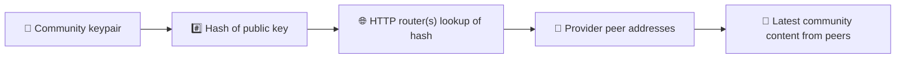
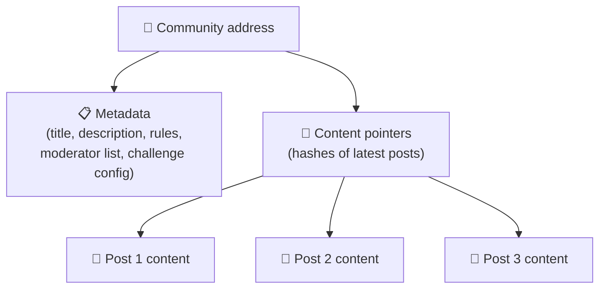
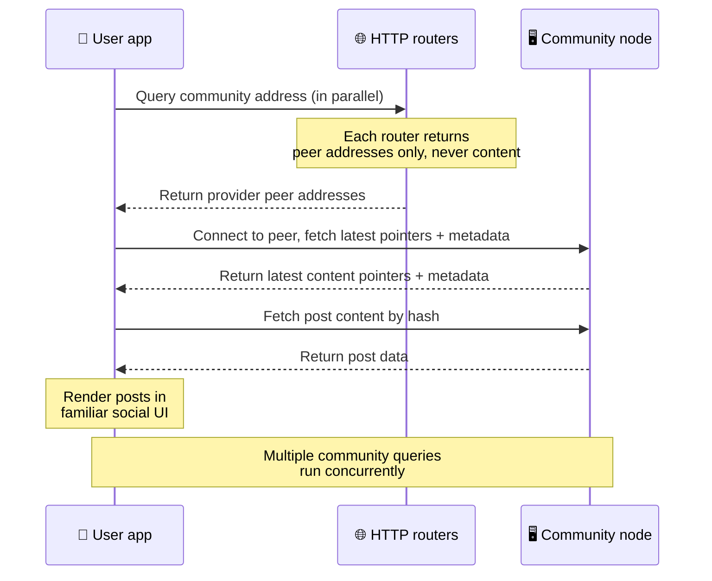
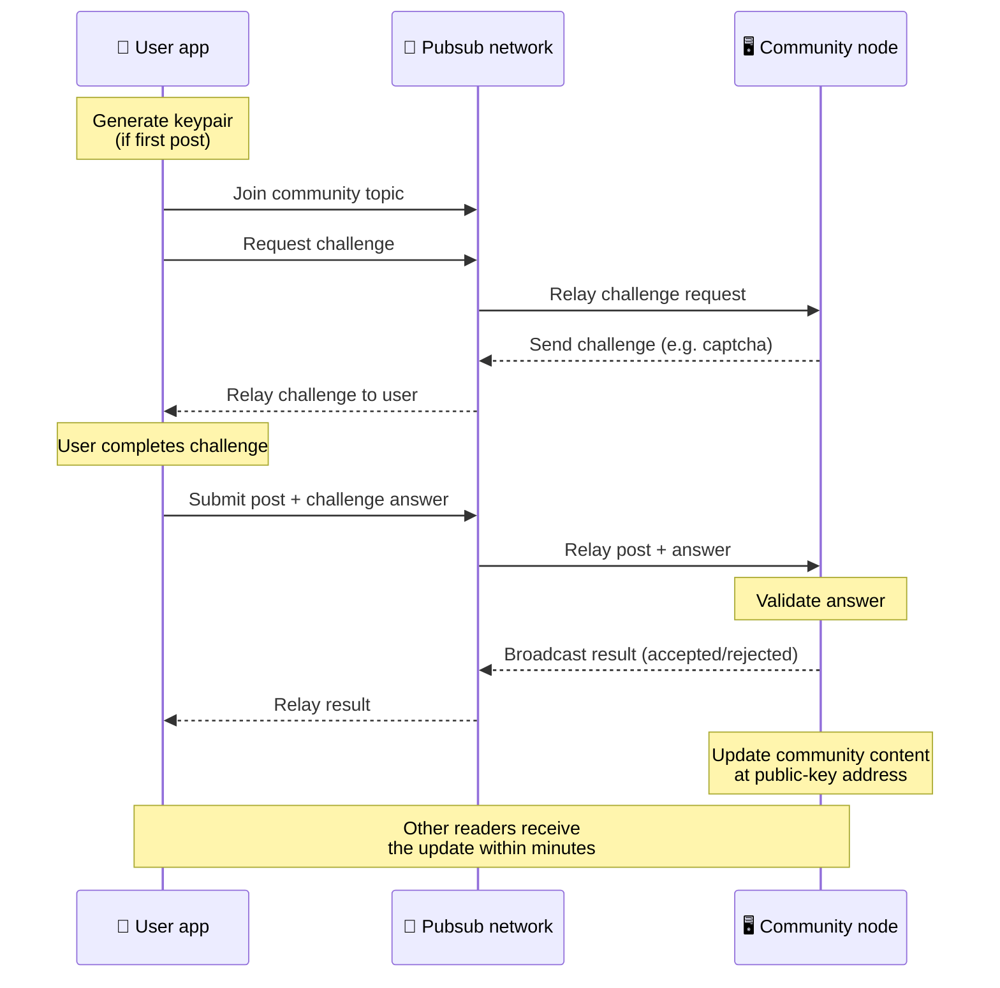
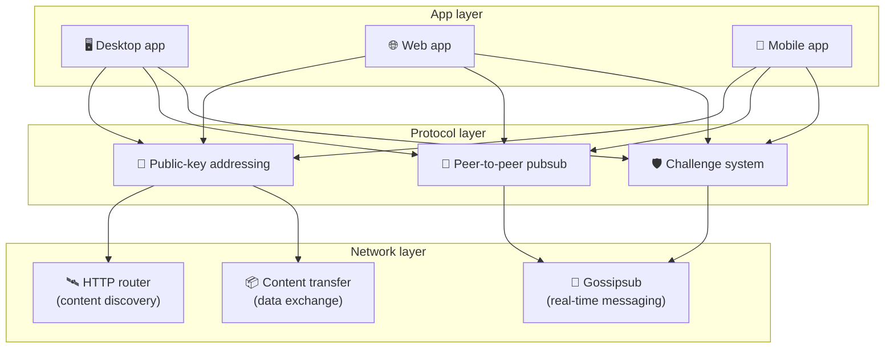

# Peer-to-peer-protocol

Bitsocial gebruikt geen blockchain, geen federatieserver en geen gecentraliseerde backend. In plaats
daarvan combineert het via de IPFS/libp2p-stack twee ideeën: **adressering op basis van publieke
sleutels** en **peer-to-peer pubsub**. Samen zorgen ze ervoor dat iedereen een community kan hosten
op gewone consumentenhardware, terwijl gebruikers lezen en posten zonder account bij een dienst die
in handen is van een bedrijf.

Lees voor een minder technische uitleg
[Een volledige uitleg voor leken van het Bitsocial-protocol](./layman-protocol-explanation.md).

## Gebruikt Bitsocial IPFS?

Ja. Bitsocial-nodes gebruiken IPFS/libp2p-primitieven voor de peer-to-peer-laag: community-records
die via een publieke sleutel geadresseerd worden, inhoudsoverdracht tussen peers en gossipsub-pubsub
voor realtime berichten. Waar deze documentatie "pubsub" zegt, wordt IPFS/libp2p-pubsub bedoeld en
niet een aparte, gecentraliseerde message broker.

Het protocol beschrijft het vinden van inhoud op dit moment via HTTP-routers, omdat Bitsocial-clients
router-endpoints bevragen om adressen van aanbiedende peers te krijgen in plaats van voor elke
opzoeking te leunen op een DHT die slecht werkt in de browser. Routers geven alleen peers terug;
inhoudsoverdracht en pubsub-verkeer lopen nog steeds via het peer-to-peer-netwerk.

## De twee problemen

Een gedecentraliseerd sociaal netwerk moet twee vragen beantwoorden:

1. **Data** — hoe sla je de sociale inhoud van de hele wereld op en lever je die uit zonder centrale database?
2. **Spam** — hoe voorkom je misbruik terwijl het netwerk gratis te gebruiken blijft?

Bitsocial lost het dataprobleem op door de blockchain volledig over te slaan: sociale media hebben
geen globale transactievolgorde nodig, en ook geen permanente beschikbaarheid van elk oud bericht.
Het spamprobleem lost het op door elke community een eigen anti-spam-challenge te laten draaien over
het peer-to-peer-netwerk.

Zie [Inhoud ontdekken](./content-discovery.md) voor het ontdekkingsmodel boven deze netwerklaag.

---

## Adressering op basis van publieke sleutels {#public-key-based-addressing}

In BitTorrent wordt de hash van een bestand het adres ervan (_adressering op basis van inhoud_).
Bitsocial gebruikt een vergelijkbaar idee met publieke sleutels: de hash van de publieke sleutel van
een community wordt het netwerkadres.

Elke peer op het netwerk kan een **HTTP-router** om dat adres vragen: de router antwoordt met een
lijst netwerkadressen van peers die de hash van de community op dat moment aanbieden, en de client
verbindt rechtstreeks met die peers om de nieuwste staat van de community op te halen. Elke keer dat
de inhoud wordt bijgewerkt, gaat het versienummer omhoog. Het netwerk bewaart alleen de nieuwste
versie — elke historische staat hoeft niet bewaard te blijven, en dat maakt deze aanpak licht
vergeleken met een blockchain.

> **Wat een HTTP-router werkelijk bevat.** Een HTTP-router is een dunne index. Voor elk inhoudsadres
> dat hij kent, bewaart hij alleen de netwerkadressen van peers die zichzelf hebben aangekondigd als
> aanbieder (IP/poort-combinaties, libp2p-multiaddrs, dat soort dingen). Hij bewaart **niet** de
> inhoud van de community, en evenmin de metadata, berichtteksten, ledenlijst of zelfs maar het voor
> mensen leesbare label van wat er op dat adres staat; hij beantwoordt alleen de vraag "welke peers
> beweren deze hash te hebben?". Daardoor zijn routers goedkoop om te draaien, makkelijk te
> vervangen en niet aansprakelijk voor wat gebruikers publiceren, vergelijkbaar met een
> BitTorrent-tracker maar zonder torrent-metadata: een tracker koppelt infohashes aan peers, terwijl
> een HTTP-router alleen een inhoudsadres koppelt aan adressen van aanbiedende peers.
>
> Voor redundantie bevraagt de client **meerdere HTTP-routers tegelijk** en voegt hij de
> providerlijsten samen die hij terugkrijgt. Iedereen kan een router draaien, en routers vervangen
> of toevoegen is een configuratiewijziging zonder datamigratie.
>
> Bitsocial gebruikt HTTP-routers in plaats van een DHT, omdat een DHT draaien op de schaal die
> nodig is om inhoud te vinden duur is, zeker voor mobiel. Een DHT werkt bovendien niet in de
> browser, omdat browsers niet rechtstreeks kunnen deelnemen aan een libp2p-DHT. Een HTTP-router
> draait goedkoop op gangbare HTTP-infrastructuur en werkt net zo goed vanaf een telefoon als vanuit
> een browser.

### Wat er op het adres wordt opgeslagen

Het community-adres bevat niet rechtstreeks de volledige inhoud van berichten. Het bewaart in plaats
daarvan een lijst met inhoudsidentificatoren — hashes die naar de eigenlijke data verwijzen. De
client haalt elk stuk inhoud vervolgens rechtstreeks op bij de peers die de HTTP-routers hebben
teruggegeven. De routers zelf zien of bewaren de inhoud nooit.

Er is altijd minstens één peer die de data heeft: de node van de beheerder van de community. Is de
community populair, dan hebben veel andere peers de data ook en verdeelt de belasting zichzelf, net
zoals populaire torrents sneller te downloaden zijn.

---

## Peer-to-peer pubsub

Pubsub (publish-subscribe) is een berichtenpatroon waarbij peers zich abonneren op een topic en elk
bericht ontvangen dat op dat topic wordt gepubliceerd. Bitsocial gebruikt een peer-to-peer
pubsub-netwerk — iedereen kan publiceren, iedereen kan zich abonneren, en er is geen centrale
message broker.

Om een bericht in een community te plaatsen, publiceert een gebruiker een bericht waarvan het topic
gelijk is aan de publieke sleutel van de community. De node van de beheerder van de community pikt
het op, valideert het en neemt het — als het de anti-spam-challenge doorstaat — mee in de volgende
inhoudsupdate.

---

## Anti-spam: challenges via pubsub

Een open pubsub-netwerk is kwetsbaar voor spamgolven. Bitsocial lost dit op door publicerende
gebruikers te verplichten eerst een **challenge** te voltooien voordat hun inhoud wordt geaccepteerd.

Het challengesysteem is flexibel: elke beheerder van een community stelt het eigen beleid in.
Mogelijkheden zijn onder meer:

| Soort challenge   | Hoe het werkt                                              |
| ----------------- | ---------------------------------------------------------- |
| **Captcha**       | Visuele of interactieve puzzel die in de app wordt getoond |
| **Rate limiting** | Beperk het aantal berichten per tijdvenster per identiteit |
| **Token gate**    | Vraag bewijs van een saldo van een specifiek token         |
| **Betaling**      | Vraag een kleine betaling per bericht                      |
| **Toegangslijst** | Alleen vooraf goedgekeurde identiteiten mogen posten       |
| **Eigen code**    | Elk beleid dat in code uit te drukken is                   |

Peers die te veel mislukte challengepogingen doorsturen, worden geblokkeerd van het pubsub-topic. Dat
voorkomt denial-of-service-aanvallen op de netwerklaag.

---

## Levenscyclus: een community lezen

Dit gebeurt er wanneer een gebruiker de app opent en de nieuwste berichten van een community bekijkt.

**Stap voor stap:**

1. De gebruiker opent de app en ziet een sociale interface.
2. De client bevraagt voor elke community die de gebruiker volgt meerdere HTTP-routers tegelijk; elke
   router geeft alleen peer-adressen terug, nooit inhoud. De vertraging hangt af van de
   netwerkomstandigheden en de belasting van de routers; onder gebruikelijke omstandigheden met lage
   latentie komen antwoorden vaak binnen ongeveer een seconde terug, en de opvragingen lopen parallel.
3. Zodra de client peer-adressen heeft, verbindt hij met die peers en haalt hij de nieuwste
   inhoudsverwijzingen en metadata van de community op (titel, beschrijving, moderatorlijst,
   challengeconfiguratie).
4. De client haalt met die verwijzingen de eigenlijke inhoud van de berichten op en toont alles
   vervolgens in een vertrouwde sociale interface.

---

## Levenscyclus: een bericht publiceren

Bij publiceren hoort een challenge-response-uitwisseling via pubsub voordat het bericht wordt
geaccepteerd.

**Stap voor stap:**

1. De app genereert een sleutelpaar voor de gebruiker als die er nog geen heeft.
2. De gebruiker schrijft een bericht voor een community.
3. De client sluit zich aan bij het pubsub-topic van die community (gekoppeld aan de publieke sleutel
   van de community).
4. De client vraagt via pubsub om een challenge.
5. De node van de beheerder van de community stuurt een challenge terug, bijvoorbeeld een captcha.
6. De gebruiker voltooit de challenge.
7. De client dient het bericht samen met het antwoord op de challenge in via pubsub.
8. De node van de beheerder van de community valideert het antwoord. Klopt het, dan wordt het bericht
   geaccepteerd.
9. De node zendt het resultaat uit over pubsub, zodat peers in het netwerk weten dat ze berichten van
   deze gebruiker mogen blijven doorsturen.
10. De node werkt de inhoud van de community bij op het adres van de publieke sleutel.
11. Binnen een paar minuten ontvangt elke lezer van de community de update.

---

## Architectuuroverzicht

Het volledige systeem heeft drie lagen die samenwerken:

| Laag         | Rol                                                                                                                                                            |
| ------------ | -------------------------------------------------------------------------------------------------------------------------------------------------------------- |
| **App**      | Gebruikersinterface. Er kunnen meerdere apps bestaan, elk met een eigen ontwerp, die allemaal dezelfde communities en identiteiten delen.                      |
| **Protocol** | Bepaalt hoe communities worden geadresseerd, hoe berichten worden gepubliceerd en hoe spam wordt voorkomen.                                                    |
| **Netwerk**  | De onderliggende peer-to-peer-infrastructuur: HTTP-routers om inhoud te vinden, gossipsub voor realtime berichten en inhoudsoverdracht voor data-uitwisseling. |

---

## Privacy: auteurs loskoppelen van IP-adressen

Wanneer een gebruiker een bericht publiceert, wordt de inhoud **versleuteld met de publieke sleutel
van de beheerder van de community** voordat die het pubsub-netwerk in gaat. Waarnemers op het netwerk
kunnen dus wel zien dat een peer _iets_ heeft gepubliceerd, maar ze kunnen niet vaststellen:

- wat er in de inhoud staat
- welke auteursidentiteit het heeft gepubliceerd

Dit lijkt op de manier waarop je bij BitTorrent wel kunt achterhalen welke IP-adressen een torrent
seeden, maar niet wie hem oorspronkelijk heeft gemaakt. De versleutelingslaag voegt daar bovenop nog
een extra privacygarantie toe.

---

## Peer-to-peer in de browser

P2P in de browser is nu mogelijk in Bitsocial-clients. Een browserapp kan een
[Helia](https://helia.io/)-node draaien, dezelfde Bitsocial-protocolstack gebruiken als andere apps
en inhoud bij peers ophalen in plaats van een gecentraliseerde IPFS-gateway te vragen die uit te
leveren. De browser kan ook rechtstreeks meedoen aan pubsub, zodat publiceren in het normale geval
geen pubsub-provider nodig heeft die eigendom is van een platform.

Dat is de belangrijke mijlpaal voor distributie via het web: een gewone HTTPS-website kan opengaan
als een levende sociale P2P-client. Gebruikers hoeven geen desktopapp te installeren voordat ze van
het netwerk kunnen lezen, en de beheerder van de app hoeft geen centrale gateway te draaien die voor
elke browsergebruiker het knelpunt voor censuur of moderatie wordt.

Het browserpad kent andere grenzen dan een desktop- of servernode:

- een browsernode kan meestal geen willekeurige inkomende verbindingen vanaf het publieke internet
  accepteren
- hij kan data laden, valideren, cachen en publiceren zolang de app open staat
- hij is niet bedoeld als langdurige host voor de data van een community
- een community volledig hosten kan nog steeds het best via een desktopapp, `bitsocial-cli` of een
  andere node die altijd aan staat

HTTP-routers blijven belangrijk om inhoud te vinden: ze geven de adressen van aanbieders terug voor
een community-hash. Het zijn geen IPFS-gateways, want ze leveren de inhoud zelf niet uit. Zodra de
peers gevonden zijn, verbindt de browserclient met die peers en haalt hij de data op via de P2P-stack.

P2P in de browser is nu het standaardpad voor het web, geen experiment achter een schakelaar. 5chan
draait standaard puur browser-P2P op 5chan.app, en de Bitsocial-blog op bitsocial.net doet hetzelfde.
Browserpeers verbinden via beveiligde WebSockets; `pkc-js` weigert standaard verbindingspogingen via
WebRTC en WebTransport, omdat het opzetten van die verbindingen in de browser traag en onbetrouwbaar
is. De upstream-wijziging die publiceren vanuit de browser in 2026 praktisch maakte, was de correctie
van het gossipsub-volgnummer in `@libp2p/gossipsub` 15.0.21, waardoor Kubo-peers geen berichten meer
weggooien die door JavaScript-nodes zijn gepubliceerd.

Zie [Browser Peer-to-Peer](/browser-p2p/) voor het volledige beeld, inclusief wat een browsernode nog
steeds niet kan.

## Gateway-fallback {#gateway-fallback}

Browsertoegang via een gateway blijft nuttig als terugvaloptie voor compatibiliteit en uitrol. Een
gateway kan data doorgeven tussen het P2P-netwerk en een browserclient wanneer een browser niet
rechtstreeks aan het netwerk kan deelnemen, of wanneer de app bewust voor het oudere pad kiest. Deze
gateways:

- kunnen door iedereen worden gedraaid
- vereisen geen gebruikersaccounts of betalingen
- krijgen geen zeggenschap over identiteiten of communities van gebruikers
- kunnen worden vervangen zonder dat er data verloren gaat

De beoogde architectuur is P2P in de browser als eerste keuze, met gateways als optionele terugvaloptie
in plaats van als standaardknelpunt.

---

## Waarom geen blockchain?

Blockchains lossen het double-spend-probleem op: ze moeten de exacte volgorde van elke transactie
kennen om te voorkomen dat iemand dezelfde munt twee keer uitgeeft.

Sociale media hebben geen double-spend-probleem. Het maakt niet uit of bericht A een milliseconde
voor bericht B is gepubliceerd, en oude berichten hoeven niet permanent op elke node beschikbaar te
blijven.

Door de blockchain over te slaan vermijdt Bitsocial:

- **gas fees** — posten is gratis
- **doorvoerlimieten** — geen knelpunt door blokgrootte of bloktijd
- **opslagvervuiling** — nodes bewaren alleen wat ze nodig hebben
- **consensusoverhead** — geen miners, validators of staking nodig

De afweging is dat Bitsocial geen permanente beschikbaarheid van oude inhoud garandeert. Maar voor
sociale media is dat een acceptabele afweging: de node van de beheerder van de community bewaart de
data, populaire inhoud verspreidt zich over veel peers, en heel oude berichten vervagen vanzelf — net
zoals op elk sociaal platform.

## Waarom geen federatie?

Gefedereerde netwerken (zoals e-mail of platforms op basis van ActivityPub) zijn een verbetering ten
opzichte van centralisatie, maar kennen nog steeds structurele beperkingen:

- **Serverafhankelijkheid** — elke community heeft een server nodig met een domein, TLS en doorlopend
  onderhoud
- **Vertrouwen in beheerders** — de serverbeheerder heeft volledige controle over gebruikersaccounts
  en inhoud
- **Versnippering** — verhuizen tussen servers betekent vaak het verlies van volgers, geschiedenis of
  identiteit
- **Kosten** — iemand moet de hosting betalen, en dat legt druk richting consolidatie

De peer-to-peer-aanpak van Bitsocial haalt de server volledig uit de vergelijking. Een community-node
kan draaien op een laptop, een Raspberry Pi of een goedkope VPS. De beheerder bepaalt het
moderatiebeleid, maar kan geen identiteiten van gebruikers afnemen, omdat identiteiten door
sleutelparen worden beheerd en niet door een server worden uitgegeven.

## Hoe zit het met Nostr?

Nostr past niet netjes in een van beide categorieën. Het is geen federatie in ActivityPub-stijl, want
gebruikers krijgen geen account van een instance en identiteit is niet aan één server gebonden. Het
is ook geen blockchain-sociale-media, want er is geen chain, geen consensus, geen gas en geen globale
transactievolgorde.

Nostr kun je beter omschrijven als **sociale media op basis van relays**. In het basisprotocol
([NIP-01](https://github.com/nostr-protocol/nips/blob/master/01.md)) houden gebruikers sleutelparen
aan, ondertekenen ze events en publiceren ze die events naar WebSocket-relays. Clients abonneren zich
met filters op relays, halen bijpassende events op en verifiëren de handtekeningen lokaal. Gebruikers
kunnen ook metadata met relaylijsten publiceren
([NIP-65](https://github.com/nostr-protocol/nips/blob/master/65.md)) die clients vertelt naar welke
relays ze normaal schrijven en welke relays ze het liefst gebruiken om vermeldingen te lezen.

Daarmee staat Nostr op één belangrijk punt dichter bij Bitsocial dan gefedereerde of
blockchainsystemen: identiteit is cryptografisch en overdraagbaar. Het grote verschil zit in de
datalaag. Bij Nostr zijn relays de normale opslag- en bezorglaag. Bij Bitsocial helpen HTTP-routers
clients alleen om peers te vinden. De routers bewaren geen berichten, profielen, community-metadata
of moderatiestatus; ze geven adressen van aanbiedende peers terug, waarna clients de inhoud bij die
peers ophalen.

Bij communities zie je dezelfde scheiding. Nostr kent optionele patronen voor
[groepen op basis van relays](https://github.com/nostr-protocol/nips/blob/master/29.md) en
[communities met moderatorgoedkeuring](https://github.com/nostr-protocol/nips/blob/master/72.md),
maar die blijven afhankelijk van relaybeleid, groepsstatus die op een relay staat, of keuzes van
clients over welke goedkeuringen ze honoreren. Bitsocial behandelt communities als volwaardige
cryptografische objecten: de node van de beheerder valideert berichten, voert het challengebeleid van
de community uit en publiceert de nieuwste geaccepteerde staat naar het peer-to-peer-netwerk.

| Vraag                  | Nostr                                                                                    | Bitsocial                                                                     |
| ---------------------- | ---------------------------------------------------------------------------------------- | ----------------------------------------------------------------------------- |
| Categorie              | Protocol op basis van relays                                                             | Peer-to-peer community-netwerk                                                |
| Identiteit             | Publieke sleutel van de gebruiker                                                        | Sleutelparen van gebruikers en communities                                    |
| Datapad                | Ondertekende events gepubliceerd naar relays                                             | Adres van de publieke sleutel leidt naar peers; inhoud komt van die peers     |
| Wie houdt het online   | Relays die gebruikers en clients kiezen                                                  | Node van de community-eigenaar plus helpende seeders                          |
| Communities            | Optionele groepen op basis van relays of communities met moderatorgoedkeuring            | Volwaardige community-objecten met moderatie door de beheerder                |
| Anti-spam              | Relaybeleid, auth, betaling, proof-of-work, clientfilters of goedkeuring door moderators | Door de community bepaalde challengelogica vóór opname                        |
| Belangrijkste afweging | Overdraagbare identiteit, maar beschikbaarheid en beleid hangen af van relays            | Minder afhankelijk van relays, maar oude inhoud is niet voor altijd verzekerd |

---

## Samenvatting

Bitsocial is gebouwd op twee primitieven: adressering op basis van publieke sleutels om inhoud te
vinden, en peer-to-peer pubsub voor realtime communicatie. Samen leveren ze een sociaal netwerk op
waarin:

- communities worden geïdentificeerd door cryptografische sleutels, niet door domeinnamen
- inhoud zich als een torrent over peers verspreidt in plaats van vanuit één database te worden
  uitgeleverd
- spamweerbaarheid per community lokaal geregeld is en niet door een platform wordt opgelegd
- gebruikers hun identiteit bezitten via sleutelparen, niet via intrekbare accounts
- het hele systeem draait zonder servers, blockchains of platformkosten
