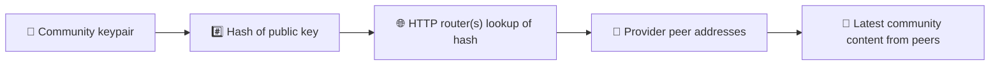
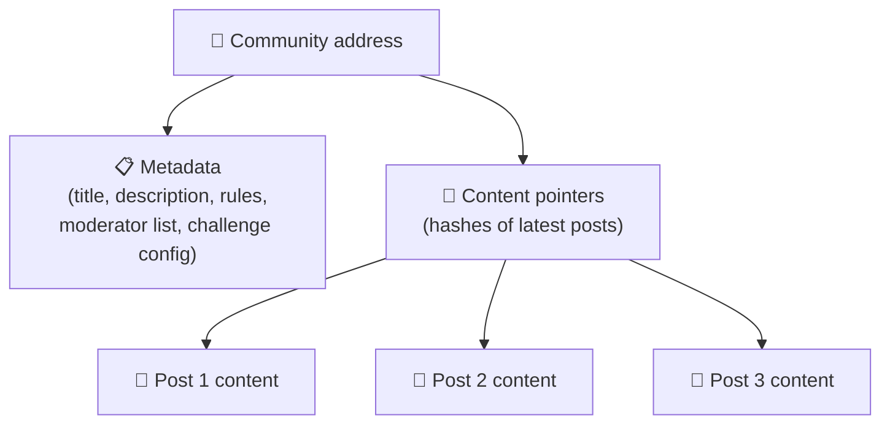
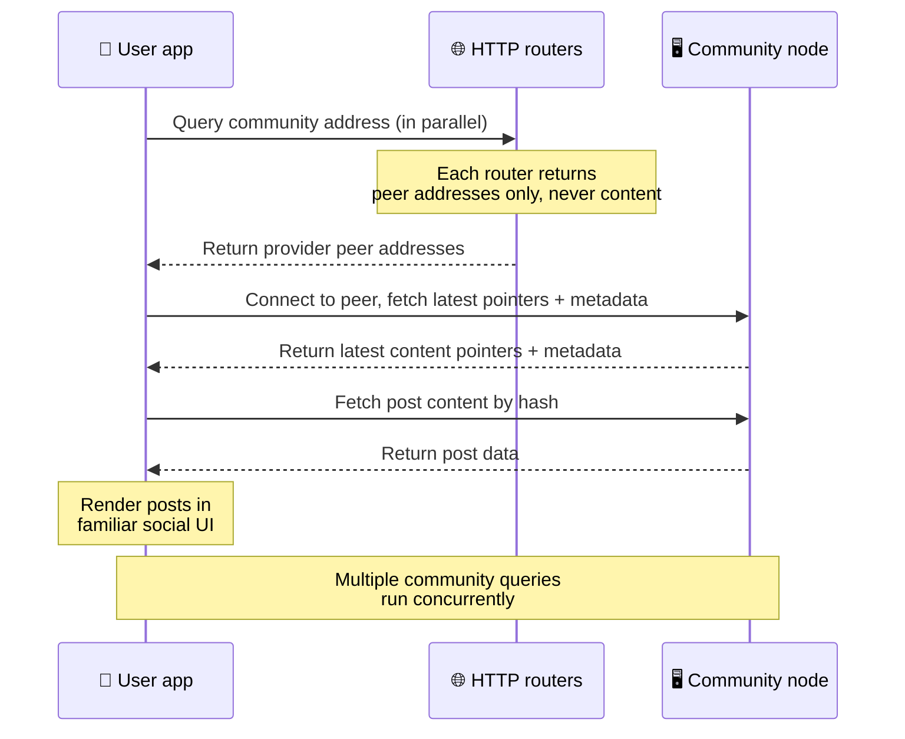
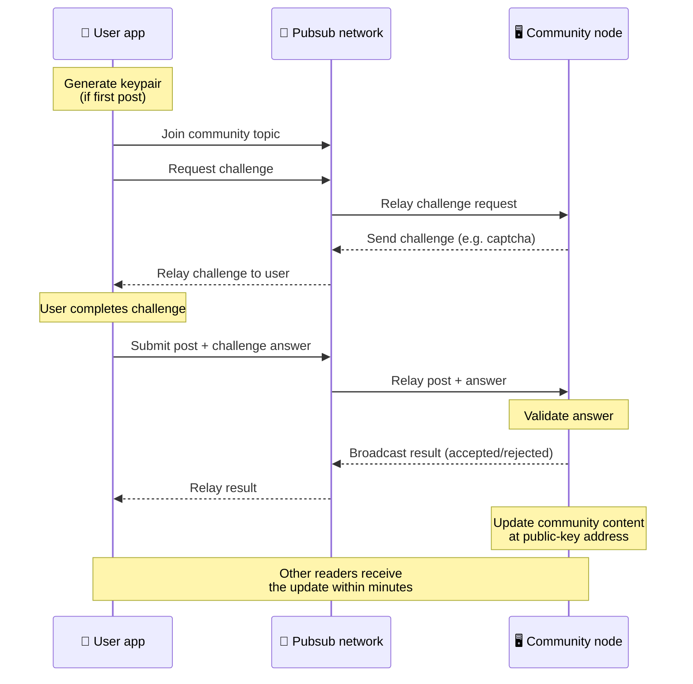
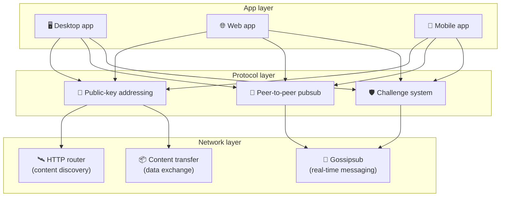

# Peer-to-peer-protokoll

Bitsocial bruker verken blokkjede, føderasjonsserver eller en sentralisert backend. I stedet brukes
IPFS/libp2p-stacken til å kombinere to ideer: **adressering basert på offentlig nøkkel** og
**peer-to-peer-pubsub**. Sammen lar de hvem som helst drifte et fellesskap fra vanlig
forbrukermaskinvare, mens brukerne leser og publiserer uten kontoer hos noen selskapskontrollert
tjeneste.

For en mindre teknisk gjennomgang kan du lese
[En fullstendig lekmannsforklaring av Bitsocial-protokollen](./layman-protocol-explanation.md).

## Bruker Bitsocial IPFS?

Ja. Bitsocial-noder bruker primitiver fra IPFS/libp2p til peer-to-peer-laget: fellesskapsoppføringer
adressert med offentlig nøkkel, innholdsoverføring mellom peers og gossipsub-pubsub for
sanntidsmeldinger. Når denne dokumentasjonen sier «pubsub», menes IPFS/libp2p-pubsub, ikke en egen
sentralisert meldingsmegler.

Protokollen beskriver i dag oppdagelse gjennom HTTP-rutere fordi Bitsocial-klienter spør
ruter-endepunkter om adressene til peers som leverer innholdet, i stedet for å basere hvert oppslag
på en DHT som fungerer dårlig i nettleseren. Rutere returnerer bare peers; innholdsoverføring og
pubsub-trafikk går fortsatt gjennom peer-to-peer-nettverket.

## De to problemene

Et desentralisert sosialt nettverk må svare på to spørsmål:

1. **Data** — hvordan lagrer og leverer man verdens sosiale innhold uten en sentral database?
2. **Spam** — hvordan hindrer man misbruk samtidig som nettverket er gratis å bruke?

Bitsocial løser dataproblemet ved å droppe blokkjeden fullstendig: sosiale medier trenger verken
global transaksjonsrekkefølge eller permanent tilgjengelighet for hvert eneste gamle innlegg.
Spamproblemet løses ved å la hvert fellesskap kjøre sin egen anti-spam-utfordring over
peer-to-peer-nettverket.

For oppdagelsesmodellen som ligger over dette nettverkslaget, se
[Oppdagelse av innhold](./content-discovery.md).

---

## Adressering basert på offentlig nøkkel {#public-key-based-addressing}

I BitTorrent blir hashen til en fil selve adressen til filen (_innholdsbasert adressering_).
Bitsocial bruker en lignende idé med offentlige nøkler: hashen til et fellesskaps offentlige nøkkel
blir nettverksadressen.

Enhver peer i nettverket kan spørre en **HTTP-ruter** om den adressen: ruteren svarer med en liste
over nettverksadressene til de peerne som akkurat nå leverer hashen til fellesskapet, og klienten
kobler seg direkte til dem for å hente fellesskapets nyeste tilstand. Hver gang innholdet
oppdateres, øker versjonsnummeret. Nettverket beholder bare den nyeste versjonen — det er ikke
nødvendig å ta vare på hver historiske tilstand, og det er nettopp dette som gjør tilnærmingen lett
sammenlignet med en blokkjede.

> **Hva en HTTP-ruter faktisk inneholder.** En HTTP-ruter er en tynn indeks. For hver innholdsadresse
> den kjenner til, lagrer den bare nettverksadressene til peers som har annonsert seg selv som
> leverandører (IP/port-par, libp2p-multiadresser og lignende). Den lagrer **ikke** fellesskapets
> innhold, metadata, innleggstekst, medlemsliste eller engang den lesbare merkelappen for det som
> ligger på adressen; den svarer bare på «hvilke peers hevder å ha denne hashen?». Det gjør rutere
> billige å drifte, enkle å bytte ut og uten ansvar for det brukerne publiserer, omtrent som en
> BitTorrent-tracker, men uten torrent-metadata: en tracker kobler infohasher til peers, mens en
> HTTP-ruter bare kobler en innholdsadresse til adressene til de peerne som leverer den.
>
> For redundans spør klienten **flere HTTP-rutere parallelt** og slår sammen leverandørlistene den
> får tilbake. Hvem som helst kan drifte en ruter, og å bytte ut eller legge til rutere er en
> konfigurasjonsendring uten datamigrering.
>
> Bitsocial bruker HTTP-rutere i stedet for en DHT fordi det er dyrt å kjøre en DHT i den skalaen
> innholdsoppdagelse krever, særlig på mobil. En DHT fungerer heller ikke i nettleseren, siden
> nettlesere ikke kan koble seg direkte til en libp2p-DHT. En HTTP-ruter kjører billig på alminnelig
> HTTP-infrastruktur og fungerer like godt fra en telefon som fra en nettleser.

### Hva som lagres på adressen

Fellesskapsadressen inneholder ikke selve innleggene. I stedet lagrer den en liste med
innholdsidentifikatorer — hasher som peker til de faktiske dataene. Klienten henter så hver del av
innholdet direkte fra de peerne HTTP-ruterne returnerte. Ruterne selv ser aldri innholdet og lagrer
det aldri.

Minst én peer har alltid dataene: noden til fellesskapets operatør. Er fellesskapet populært, vil
mange andre peers også ha dem, og lasten fordeler seg av seg selv, på samme måte som populære
torrenter går raskere å laste ned.

---

## Peer-to-peer-pubsub

Pubsub (publish-subscribe) er et meldingsmønster der peers abonnerer på et emne og mottar hver
melding som publiseres til det emnet. Bitsocial bruker et peer-to-peer-pubsub-nettverk — hvem som
helst kan publisere, hvem som helst kan abonnere, og det finnes ingen sentral meldingsmegler.

For å publisere et innlegg i et fellesskap publiserer brukeren en melding der emnet er fellesskapets
offentlige nøkkel. Noden til fellesskapets operatør plukker den opp, validerer den og — hvis den
består anti-spam-utfordringen — tar den med i neste innholdsoppdatering.

---

## Anti-spam: utfordringer over pubsub

Et åpent pubsub-nettverk er sårbart for spamflommer. Bitsocial løser dette ved å kreve at de som
publiserer, fullfører en **utfordring** før innholdet deres godtas.

Utfordringssystemet er fleksibelt: hver fellesskapsoperatør konfigurerer sine egne regler.
Alternativene inkluderer:

| Type utfordring      | Slik fungerer den                                  |
| -------------------- | -------------------------------------------------- |
| **Captcha**          | Visuell eller interaktiv oppgave som vises i appen |
| **Ratebegrensning**  | Begrens antall innlegg per tidsvindu per identitet |
| **Token-port**       | Krev bevis på beholdning av et bestemt token       |
| **Betaling**         | Krev en liten betaling per innlegg                 |
| **Tillatelsesliste** | Bare forhåndsgodkjente identiteter kan publisere   |
| **Egen kode**        | Enhver regel som kan uttrykkes i kode              |

Peers som videreformidler for mange mislykkede utfordringsforsøk, blir blokkert fra pubsub-emnet, og
det hindrer tjenestenektangrep på nettverkslaget.

---

## Livssyklus: å lese et fellesskap

Dette er hva som skjer når en bruker åpner appen og ser de nyeste innleggene i et fellesskap.

**Steg for steg:**

1. Brukeren åpner appen og ser et sosialt grensesnitt.
2. Klienten spør flere HTTP-rutere parallelt for hvert fellesskap brukeren følger; hver ruter
   returnerer bare peer-adresser, aldri innhold. Svartiden avhenger av nettverksforholdene og
   belastningen på ruterne; under typiske forhold med lav latens svarer forespørslene ofte innen
   omtrent ett sekund, og de kjører samtidig.
3. Når klienten har peer-adressene, kobler den seg til disse peerne og henter fellesskapets nyeste
   innholdspekere og metadata (tittel, beskrivelse, moderatorliste, oppsett for utfordringen).
4. Klienten henter selve innleggene ved hjelp av disse pekerne, og viser deretter alt i et velkjent
   sosialt grensesnitt.

---

## Livssyklus: å publisere et innlegg

Publisering innebærer et utfordring-og-svar-håndtrykk over pubsub før innlegget godtas.

**Steg for steg:**

1. Appen genererer et nøkkelpar for brukeren hvis brukeren ikke har et fra før.
2. Brukeren skriver et innlegg til et fellesskap.
3. Klienten blir med i pubsub-emnet for det fellesskapet (knyttet til fellesskapets offentlige
   nøkkel).
4. Klienten ber om en utfordring over pubsub.
5. Noden til fellesskapets operatør sender tilbake en utfordring, for eksempel en captcha.
6. Brukeren fullfører utfordringen.
7. Klienten sender inn innlegget sammen med svaret på utfordringen over pubsub.
8. Noden til fellesskapets operatør validerer svaret. Er det riktig, godtas innlegget.
9. Noden kringkaster resultatet over pubsub slik at peerne i nettverket vet at de skal fortsette å
   videreformidle meldinger fra denne brukeren.
10. Noden oppdaterer fellesskapets innhold på adressen som er utledet av den offentlige nøkkelen.
11. I løpet av noen få minutter mottar alle som leser fellesskapet, oppdateringen.

---

## Arkitekturoversikt

Hele systemet består av tre lag som virker sammen:

| Lag           | Rolle                                                                                                                                                     |
| ------------- | --------------------------------------------------------------------------------------------------------------------------------------------------------- |
| **App**       | Brukergrensesnittet. Det kan finnes flere apper, hver med sitt eget design, som alle deler de samme fellesskapene og identitetene.                        |
| **Protokoll** | Definerer hvordan fellesskap adresseres, hvordan innlegg publiseres, og hvordan spam hindres.                                                             |
| **Nettverk**  | Den underliggende peer-to-peer-infrastrukturen: HTTP-rutere for oppdagelse, gossipsub for sanntidsmeldinger og innholdsoverføring for utveksling av data. |

---

## Personvern: å løsrive forfattere fra IP-adresser

Når en bruker publiserer et innlegg, blir innholdet **kryptert med den offentlige nøkkelen til
fellesskapets operatør** før det går inn i pubsub-nettverket. Det betyr at selv om observatører i
nettverket kan se at en peer har publisert _noe_, kan de ikke fastslå:

- hva innholdet sier
- hvilken forfatteridentitet som publiserte det

Dette ligner på hvordan BitTorrent gjør det mulig å finne ut hvilke IP-adresser som deler en
torrent, men ikke hvem som opprinnelig laget den. Krypteringslaget gir en ekstra personverngaranti
oppå det utgangspunktet.

---

## Peer-to-peer i nettleseren

P2P i nettleseren er nå mulig i Bitsocial-klienter. En nettleserapp kan kjøre en
[Helia](https://helia.io/)-node, bruke den samme protokollstacken for Bitsocial som andre apper, og
hente innhold fra peers i stedet for å be en sentralisert IPFS-gateway om å levere det. Nettleseren
kan også delta direkte i pubsub, slik at publisering ikke trenger en plattformeid pubsub-leverandør
i normaltilfellet.

Dette er den viktige milepælen for distribusjon på nettet: et helt vanlig HTTPS-nettsted kan åpne
seg som en levende sosial P2P-klient. Brukerne trenger ikke installere en skrivebordsapp før de kan
lese fra nettverket, og appoperatøren trenger ikke drifte en sentral gateway som blir flaskehalsen
for sensur eller moderering av hver eneste nettleserbruker.

Veien gjennom nettleseren har andre begrensninger enn en node på skrivebordet eller på en server:

- en nettlesernode kan vanligvis ikke ta imot vilkårlige innkommende tilkoblinger fra det åpne
  internettet
- den kan laste, validere, mellomlagre og publisere data mens appen er åpen
- den bør ikke behandles som en langvarig vert for et fellesskaps data
- full drift av et fellesskap håndteres fortsatt best av en skrivebordsapp, `bitsocial-cli` eller en
  annen node som alltid er på

HTTP-rutere har fortsatt betydning for innholdsoppdagelse: de returnerer leverandøradresser for en
fellesskapshash. De er ikke IPFS-gatewayer, siden de ikke leverer selve innholdet. Etter
oppdagelsen kobler nettleserklienten seg til peers og henter dataene gjennom P2P-stacken.

P2P i nettleseren er nå standardveien på nettet, ikke et eksperiment bak en bryter. 5chan kjører ren
nettleser-P2P som standard på 5chan.app, og Bitsocial-bloggen på bitsocial.net gjør det samme.
Nettleser-peers kobler seg opp over sikre WebSockets; `pkc-js` avviser oppkoblinger over WebRTC og
WebTransport som standard fordi måten de etablerer forbindelser på, er treg og upålitelig i
nettleseren. Endringen oppstrøms som gjorde publisering fra nettleseren praktisk mulig i 2026, var
rettelsen av gossipsub-sekvensnummeret i `@libp2p/gossipsub` 15.0.21, som gjorde at Kubo-peers
sluttet å forkaste meldinger publisert av JavaScript-noder.

For hele bildet, inkludert hva en nettlesernode fortsatt ikke kan gjøre, se
[Peer-to-peer i nettleseren](/browser-p2p/).

## Reserveløsning med gateway {#gateway-fallback}

Nettlesertilgang via gateway er fortsatt nyttig som reserveløsning for kompatibilitet og utrulling.
En gateway kan videreformidle data mellom P2P-nettverket og en nettleserklient når nettleseren ikke
kan koble seg direkte til nettverket, eller når appen bevisst velger den eldre veien. Disse
gatewayene:

- kan driftes av hvem som helst
- krever verken brukerkontoer eller betaling
- får ikke råderett over brukeridentiteter eller fellesskap
- kan byttes ut uten at data går tapt

Målarkitekturen er P2P i nettleseren først, med gatewayer som et valgfritt reservealternativ i
stedet for en flaskehals som standard.

---

## Hvorfor ikke en blokkjede?

Blokkjeder løser problemet med dobbeltbruk: de må kjenne den nøyaktige rekkefølgen på hver
transaksjon for å hindre at noen bruker den samme mynten to ganger.

Sosiale medier har ikke noe problem med dobbeltbruk. Det spiller ingen rolle om innlegg A ble
publisert ett millisekund før innlegg B, og gamle innlegg trenger ikke være permanent tilgjengelige
på hver eneste node.

Ved å droppe blokkjeden unngår Bitsocial:

- **gassavgifter** — det er gratis å publisere
- **kapasitetsgrenser** — ingen flaskehals i blokkstørrelse eller blokktid
- **lagringsvekst** — noder beholder bare det de trenger
- **kostnader ved konsensus** — verken utvinnere, validatorer eller staking kreves

Avveiningen er at Bitsocial ikke garanterer at gammelt innhold alltid er tilgjengelig. Men for
sosiale medier er det en akseptabel avveining: noden til fellesskapets operatør har dataene,
populært innhold sprer seg til mange peers, og svært gamle innlegg blekner naturlig — akkurat som de
gjør på enhver sosial plattform.

## Hvorfor ikke føderasjon?

Fødererte nettverk (som e-post eller ActivityPub-baserte plattformer) er et framskritt fra
sentralisering, men har fortsatt strukturelle begrensninger:

- **Serveravhengighet** — hvert fellesskap trenger en server med domene, TLS og løpende vedlikehold
- **Tillit til administrator** — serveradministratoren har full kontroll over brukerkontoer og
  innhold
- **Fragmentering** — å flytte mellom servere betyr ofte å miste følgere, historikk eller identitet
- **Kostnad** — noen må betale for driften, og det skaper press mot konsolidering

Bitsocials peer-to-peer-tilnærming fjerner serveren fra likningen helt. En fellesskapsnode kan kjøre
på en bærbar PC, en Raspberry Pi eller en billig VPS. Operatøren styrer modereringsreglene, men kan
ikke beslaglegge brukeridentiteter, fordi identiteter styres av nøkkelpar og ikke tildeles av en
server.

## Hva med Nostr?

Nostr passer ikke rent inn i noen av kategoriene. Det er ikke føderasjon av ActivityPub-typen, for
brukerne får ikke kontoer tildelt av instanser, og identiteten er ikke knyttet til én server. Det er
heller ikke sosiale medier på blokkjede, for det finnes verken kjede, konsensus, gass eller global
transaksjonsrekkefølge.

Nostr beskrives bedre som **relébaserte sosiale medier**. I basisprotokollen
([NIP-01](https://github.com/nostr-protocol/nips/blob/master/01.md)) har brukerne nøkkelpar,
signerer hendelser og publiserer hendelsene til WebSocket-reléer. Klienter abonnerer på reléer med
filtre, henter hendelsene som passer, og verifiserer signaturene lokalt. Brukere kan også publisere
metadata med relélister ([NIP-65](https://github.com/nostr-protocol/nips/blob/master/65.md)) som
forteller klientene hvilke reléer de vanligvis skriver til, og hvilke reléer de foretrekker når de
leser omtaler av seg selv.

Det plasserer Nostr nærmere Bitsocial enn både fødererte systemer og blokkjedesystemer på ett
viktig punkt: identiteten er kryptografisk og flyttbar. Hovedforskjellen ligger i datalaget. I
Nostr er reléene det normale laget for lagring og levering. I Bitsocial hjelper HTTP-rutere bare
klientene med å finne peers. Ruterne lagrer verken innlegg, profiler, fellesskapsmetadata eller
modereringstilstand; de returnerer adressene til peers som leverer innholdet, og deretter henter
klientene innholdet fra disse peerne.

Fellesskap viser den samme forskjellen. Nostr har valgfrie mønstre for
[relébaserte grupper](https://github.com/nostr-protocol/nips/blob/master/29.md) og
[fellesskap med moderatorgodkjenning](https://github.com/nostr-protocol/nips/blob/master/72.md), men
de avhenger fortsatt av relépolicy, gruppetilstand lagret på reléet, eller klientens valg av hvilke
godkjenninger den skal respektere. Bitsocial behandler fellesskap som førsteklasses kryptografiske
objekter, der operatørnoden validerer innlegg, kjører fellesskapets regler for utfordringer og
publiserer den nyeste godkjente tilstanden ut i peer-to-peer-nettverket.

| Spørsmål                     | Nostr                                                                                       | Bitsocial                                                                            |
| ---------------------------- | ------------------------------------------------------------------------------------------- | ------------------------------------------------------------------------------------ |
| Kategori                     | Relébasert protokoll                                                                        | Peer-to-peer-nettverk av fellesskap                                                  |
| Identitet                    | Brukerens offentlige nøkkel                                                                 | Nøkkelpar for både bruker og fellesskap                                              |
| Datavei                      | Signerte hendelser publisert til reléer                                                     | Adressen fra den offentlige nøkkelen løses opp til peers; innholdet hentes fra peers |
| Hvem holder det tilgjengelig | Reléer valgt av brukere og klienter                                                         | Noden til fellesskapets eier pluss seedere som hjelper til                           |
| Fellesskap                   | Valgfrie relébaserte grupper eller fellesskap med moderatorgodkjenning                      | Fellesskap som førsteklasses objekter med moderering styrt av operatøren             |
| Anti-spam                    | Relépolicy, autentisering, betaling, proof-of-work, klientfiltre eller moderatorgodkjenning | Utfordringslogikk definert av fellesskapet før innlegget tas med                     |
| Viktigste avveining          | Flyttbar identitet, men tilgjengelighet og regler avhenger av reléene                       | Mindre avhengighet av reléer, men gammelt innhold er ikke garantert for alltid       |

---

## Oppsummering

Bitsocial er bygget på to primitiver: adressering basert på offentlig nøkkel for innholdsoppdagelse,
og peer-to-peer-pubsub for sanntidskommunikasjon. Sammen gir de et sosialt nettverk der:

- fellesskap identifiseres av kryptografiske nøkler, ikke av domenenavn
- innhold sprer seg mellom peers som en torrent, i stedet for å leveres fra én enkelt database
- spammotstand er lokal for hvert fellesskap, ikke pålagt av en plattform
- brukerne eier identitetene sine gjennom nøkkelpar, ikke gjennom kontoer som kan trekkes tilbake
- hele systemet kjører uten servere, blokkjeder eller plattformavgifter
