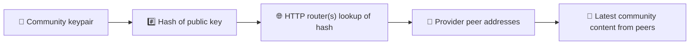
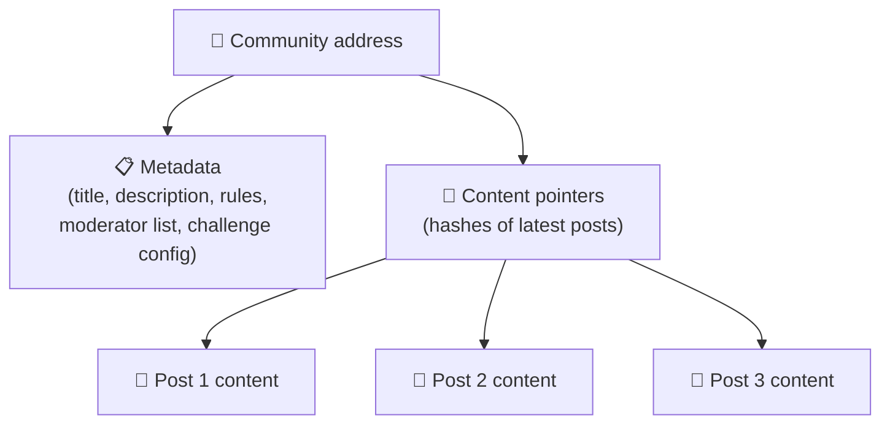
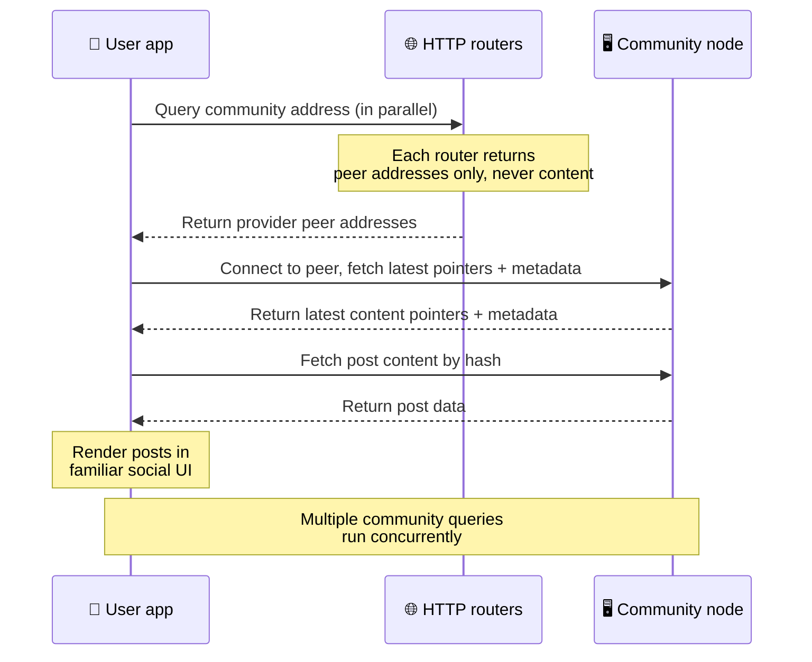
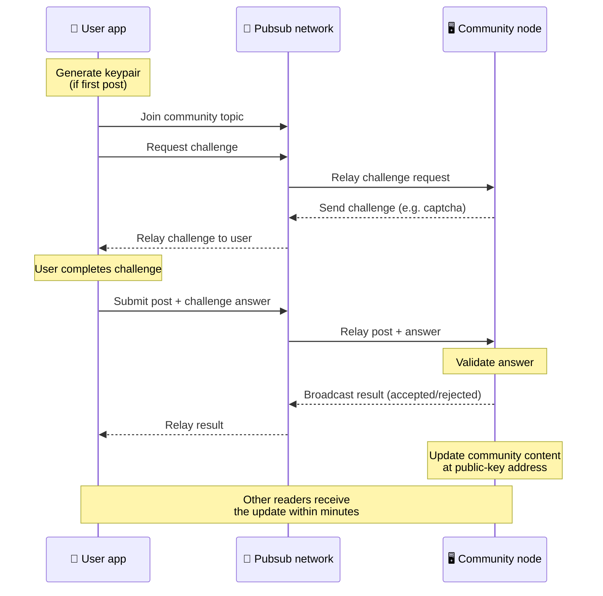
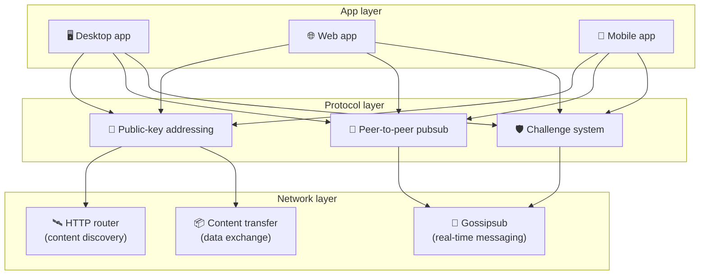

# Protokół peer-to-peer

Bitsocial nie korzysta z blockchaina, serwera federacyjnego ani scentralizowanego backendu. Zamiast
tego wykorzystuje stos IPFS/libp2p, aby połączyć dwa pomysły: **adresowanie oparte na kluczu
publicznym** i **pubsub peer-to-peer**. Razem pozwalają one każdemu hostować społeczność na zwykłym
sprzęcie domowym, podczas gdy użytkownicy czytają i publikują bez zakładania kont w jakiejkolwiek
usłudze kontrolowanej przez firmę.

Mniej techniczne omówienie znajdziesz w tekście
[Kompletne wyjaśnienie protokołu Bitsocial dla laika](./layman-protocol-explanation.md).

## Czy Bitsocial używa IPFS?

Tak. Węzły Bitsocial wykorzystują w warstwie peer-to-peer prymitywy IPFS/libp2p: rekordy
społeczności adresowane kluczem publicznym, przesyłanie treści między peerami oraz pubsub gossipsub
do wiadomości w czasie rzeczywistym. Kiedy ta dokumentacja mówi „pubsub”, chodzi o pubsub
IPFS/libp2p, a nie o osobnego, scentralizowanego brokera wiadomości.

Protokół opisuje obecnie odkrywanie przez routery HTTP, ponieważ klienci Bitsocial pytają o adresy
peerów-dostawców końcówki routerów, zamiast przy każdym wyszukiwaniu polegać na nieprzyjaznym
przeglądarkom DHT. Routery zwracają wyłącznie peery; transfer treści i ruch pubsub nadal
przechodzą przez sieć peer-to-peer.

## Dwa problemy

Zdecentralizowana sieć społecznościowa musi odpowiedzieć na dwa pytania:

1. **Dane** — jak przechowywać i udostępniać treści społecznościowe całego świata bez centralnej bazy danych?
2. **Spam** — jak zapobiegać nadużyciom, zachowując bezpłatny dostęp do sieci?

Bitsocial rozwiązuje problem danych, całkowicie pomijając blockchain: media społecznościowe nie
potrzebują globalnego porządkowania transakcji ani trwałej dostępności każdego starego posta.
Problem spamu rozwiązuje, pozwalając każdej społeczności prowadzić własne wyzwanie antyspamowe w
sieci peer-to-peer.

Model odkrywania treści ponad tą warstwą sieciową opisuje [Odkrywanie treści](./content-discovery.md).

---

## Adresowanie oparte na kluczu publicznym {#public-key-based-addressing}

W BitTorrencie adresem pliku staje się jego hash (_adresowanie oparte na treści_). Bitsocial stosuje
podobny pomysł do kluczy publicznych: adresem sieciowym społeczności staje się hash jej klucza
publicznego.

Każdy peer w sieci może zapytać o ten adres **router HTTP**: router odpowiada listą adresów
sieciowych peerów, które aktualnie udostępniają hash danej społeczności, a klient łączy się z nimi
bezpośrednio, aby pobrać jej najnowszy stan. Przy każdej aktualizacji treści rośnie numer jej
wersji. Sieć przechowuje wyłącznie najnowszą wersję — nie trzeba zachowywać każdego stanu
historycznego i właśnie to czyni to podejście lekkim w porównaniu z blockchainem.

> **Co naprawdę przechowuje router HTTP.** Router HTTP to cienki indeks. Dla każdego znanego mu
> adresu treści przechowuje jedynie adresy sieciowe peerów, które zgłosiły się jako dostawcy (pary
> IP/port, multiadresy libp2p i tym podobne). **Nie** przechowuje treści społeczności, jej
> metadanych, tekstu postów, listy członków ani nawet czytelnej dla człowieka nazwy tego, co znajduje
> się pod danym adresem; odpowiada tylko na pytanie „które peery twierdzą, że mają ten hash?”. Dzięki
> temu routery są tanie w utrzymaniu, łatwe do podmiany i nie odpowiadają za to, co publikują
> użytkownicy — podobnie jak tracker BitTorrent, ale bez metadanych torrenta: tracker mapuje
> infohashe na peery, a router HTTP mapuje wyłącznie adres treści na adresy peerów-dostawców.
>
> Dla redundancji klient odpytuje **kilka routerów HTTP równolegle** i scala otrzymane listy
> dostawców. Router może uruchomić każdy, a wymiana lub dodanie routerów to zmiana konfiguracji, bez
> migracji danych.
>
> Bitsocial używa routerów HTTP zamiast DHT, ponieważ utrzymanie DHT w skali potrzebnej do
> odkrywania treści jest kosztowne, zwłaszcza na urządzeniach mobilnych. DHT nie działa też w
> przeglądarce, bo przeglądarki nie mogą bezpośrednio dołączyć do DHT libp2p. Router HTTP działa
> tanio na standardowej infrastrukturze HTTP i sprawdza się równie dobrze na telefonie, jak i w
> przeglądarce.

### Co jest przechowywane pod adresem

Adres społeczności nie zawiera bezpośrednio pełnej treści postów. Zamiast tego przechowuje listę
identyfikatorów treści — hashy wskazujących właściwe dane. Klient pobiera następnie każdy fragment
treści bezpośrednio od peerów zwróconych przez routery HTTP. Same routery nigdy nie widzą treści ani
jej nie przechowują.

Co najmniej jeden peer zawsze ma dane: węzeł operatora społeczności. Jeśli społeczność jest
popularna, będzie je miało także wiele innych peerów, a obciążenie rozłoży się samo — tak samo jak
popularne torrenty pobierają się szybciej.

---

## Pubsub peer-to-peer

Pubsub (publish-subscribe) to wzorzec komunikacji, w którym peery subskrybują temat i otrzymują
każdą wiadomość opublikowaną w tym temacie. Bitsocial korzysta z sieci pubsub peer-to-peer — każdy
może publikować, każdy może subskrybować i nie ma centralnego brokera wiadomości.

Aby opublikować post w społeczności, użytkownik wysyła wiadomość, której temat odpowiada kluczowi
publicznemu tej społeczności. Węzeł operatora społeczności ją odbiera, weryfikuje i — jeśli przejdzie
wyzwanie antyspamowe — dołącza ją do kolejnej aktualizacji treści.

---

## Ochrona przed spamem: wyzwania przez pubsub

Otwarta sieć pubsub jest podatna na zalew spamu. Bitsocial rozwiązuje to, wymagając od publikujących
ukończenia **wyzwania**, zanim ich treść zostanie przyjęta.

System wyzwań jest elastyczny: każdy operator społeczności konfiguruje własną politykę. Do wyboru
są między innymi:

| Rodzaj wyzwania       | Jak działa                                                  |
| --------------------- | ----------------------------------------------------------- |
| **Captcha**           | Wizualna lub interaktywna łamigłówka pokazywana w aplikacji |
| **Limit tempa**       | Ograniczenie liczby postów na tożsamość w oknie czasowym    |
| **Bramka tokenowa**   | Wymóg udowodnienia salda określonego tokena                 |
| **Płatność**          | Wymóg niewielkiej opłaty za post                            |
| **Lista dozwolonych** | Publikować mogą tylko wcześniej zatwierdzone tożsamości     |
| **Własny kod**        | Dowolna polityka dająca się wyrazić w kodzie                |

Peery, które przekazują zbyt wiele nieudanych prób wyzwania, są blokowane w temacie pubsub, co
zapobiega atakom typu odmowa usługi na warstwę sieciową.

---

## Cykl życia: czytanie społeczności

Oto co dzieje się, gdy użytkownik otwiera aplikację i przegląda najnowsze posty społeczności.

**Krok po kroku:**

1. Użytkownik otwiera aplikację i widzi interfejs społecznościowy.
2. Klient odpytuje równolegle kilka routerów HTTP dla każdej społeczności obserwowanej przez
   użytkownika; każdy router zwraca wyłącznie adresy peerów, nigdy treść. Czas odpowiedzi zależy od
   warunków sieciowych i obciążenia routerów; w typowych warunkach niskich opóźnień zapytania zwykle
   wracają w około sekundę i wykonują się równolegle.
3. Gdy klient ma już adresy peerów, łączy się z nimi i pobiera najnowsze wskaźniki treści oraz
   metadane społeczności (tytuł, opis, listę moderatorów, konfigurację wyzwania).
4. Na podstawie tych wskaźników klient pobiera właściwą treść postów, a następnie renderuje wszystko
   w znajomym interfejsie społecznościowym.

---

## Cykl życia: publikowanie posta

Publikowanie wymaga wymiany wyzwanie-odpowiedź przez pubsub, zanim post zostanie przyjęty.

**Krok po kroku:**

1. Aplikacja generuje dla użytkownika parę kluczy, jeśli jeszcze jej nie ma.
2. Użytkownik pisze post dla społeczności.
3. Klient dołącza do tematu pubsub tej społeczności (powiązanego z jej kluczem publicznym).
4. Klient prosi przez pubsub o wyzwanie.
5. Węzeł operatora społeczności odsyła wyzwanie (na przykład captcha).
6. Użytkownik rozwiązuje wyzwanie.
7. Klient przesyła przez pubsub post razem z odpowiedzią na wyzwanie.
8. Węzeł operatora społeczności weryfikuje odpowiedź. Jeśli jest poprawna, post zostaje przyjęty.
9. Węzeł rozgłasza wynik przez pubsub, aby peery w sieci wiedziały, że mają dalej przekazywać
   wiadomości od tego użytkownika.
10. Węzeł aktualizuje treść społeczności pod jej adresem opartym na kluczu publicznym.
11. W ciągu kilku minut aktualizację otrzymuje każdy czytelnik społeczności.

---

## Przegląd architektury

Cały system składa się z trzech współpracujących warstw:

| Warstwa       | Rola                                                                                                                                                         |
| ------------- | ------------------------------------------------------------------------------------------------------------------------------------------------------------ |
| **Aplikacja** | Interfejs użytkownika. Aplikacji może być wiele, każda z własnym wyglądem, a wszystkie korzystają z tych samych społeczności i tożsamości.                   |
| **Protokół**  | Określa, jak adresowane są społeczności, jak publikuje się posty i jak zapobiega się spamowi.                                                                |
| **Sieć**      | Leżąca u podstaw infrastruktura peer-to-peer: routery HTTP do odkrywania, gossipsub do wiadomości w czasie rzeczywistym i transfer treści do wymiany danych. |

---

## Prywatność: rozdzielenie autorów i adresów IP

Gdy użytkownik publikuje post, jego treść jest **szyfrowana kluczem publicznym operatora
społeczności**, zanim trafi do sieci pubsub. Oznacza to, że obserwatorzy sieci widzą wprawdzie, że
dany peer coś opublikował, ale nie są w stanie ustalić:

- co zawiera ta treść
- która tożsamość autora ją opublikowała

Przypomina to sposób, w jaki BitTorrent pozwala ustalić, które adresy IP seedują torrent, ale nie
kto go pierwotnie stworzył. Warstwa szyfrowania dokłada do tego poziomu bazowego dodatkową gwarancję
prywatności.

---

## Peer-to-peer w przeglądarce

P2P w przeglądarce jest już możliwe w klientach Bitsocial. Aplikacja przeglądarkowa może uruchomić
węzeł [Helia](https://helia.io/), używać tego samego stosu klienckiego protokołu Bitsocial co
pozostałe aplikacje i pobierać treści od peerów, zamiast prosić o ich udostępnienie scentralizowaną
bramę IPFS. Przeglądarka może też bezpośrednio uczestniczyć w pubsubie, więc w podstawowym
scenariuszu publikowanie nie wymaga dostawcy pubsuba należącego do platformy.

To ważny kamień milowy dla dystrybucji przez WWW: zwykła witryna HTTPS może otworzyć się jako
działający klient społecznościowy P2P. Użytkownicy nie muszą instalować aplikacji desktopowej, żeby
czytać z sieci, a operator aplikacji nie musi utrzymywać centralnej bramy, która dla każdego
użytkownika przeglądarki staje się wąskim gardłem cenzury lub moderacji.

Ścieżka przeglądarkowa ma inne ograniczenia niż węzeł desktopowy czy serwerowy:

- węzeł w przeglądarce zwykle nie może przyjmować dowolnych połączeń przychodzących z publicznego internetu
- może wczytywać, weryfikować, buforować i publikować dane, dopóki aplikacja jest otwarta
- nie należy traktować go jako długowiecznego hosta danych społeczności
- pełny hosting społeczności nadal najlepiej realizuje aplikacja desktopowa, `bitsocial-cli` lub inny
  stale działający węzeł

Routery HTTP wciąż mają znaczenie dla odkrywania treści: zwracają adresy dostawców dla hasha
społeczności. Nie są bramami IPFS, ponieważ same nie serwują treści. Po odkryciu klient w
przeglądarce łączy się z peerami i pobiera dane przez stos P2P.

P2P w przeglądarce jest teraz domyślną ścieżką webową, a nie eksperymentem ukrytym za przełącznikiem.
5chan domyślnie działa w czystym trybie P2P w przeglądarce pod adresem 5chan.app, a blog Bitsocial na
bitsocial.net robi to samo. Peery w przeglądarce łączą się przez bezpieczne WebSockets; `pkc-js`
domyślnie odrzuca połączenia WebRTC i WebTransport, ponieważ ich ścieżki nawiązywania połączenia są w
przeglądarce wolne i zawodne. Zmianą po stronie upstreamu, dzięki której publikowanie z przeglądarki
stało się w 2026 roku praktyczne, była poprawka numerów sekwencyjnych gossipsub w
`@libp2p/gossipsub` 15.0.21 — sprawiła ona, że peery Kubo przestały odrzucać wiadomości publikowane
przez węzły JavaScript.

Pełny obraz, w tym to, czego węzeł w przeglądarce nadal nie potrafi, znajdziesz w tekście
[Peer-to-peer w przeglądarce](/browser-p2p/).

## Awaryjne wykorzystanie bramy {#gateway-fallback}

Dostęp z przeglądarki oparty na bramie jest nadal przydatny jako rozwiązanie zgodnościowe i awaryjne
na czas wdrażania. Brama może przekazywać dane między siecią P2P a klientem w przeglądarce, gdy
przeglądarka nie może dołączyć do sieci bezpośrednio albo gdy aplikacja świadomie wybiera starszą
ścieżkę. Takie bramy:

- może uruchomić każdy
- nie wymagają kont użytkowników ani płatności
- nie przejmują kontroli nad tożsamościami użytkowników ani społecznościami
- można wymienić bez utraty danych

Docelowa architektura stawia w pierwszej kolejności na P2P w przeglądarce, a bramy traktuje jako
opcjonalne rozwiązanie awaryjne, a nie domyślne wąskie gardło.

---

## Dlaczego nie blockchain?

Blockchainy rozwiązują problem podwójnego wydatkowania: muszą znać dokładną kolejność każdej
transakcji, żeby nikt nie wydał tej samej monety dwa razy.

W mediach społecznościowych problem podwójnego wydatkowania nie istnieje. Nie ma znaczenia, czy post
A został opublikowany milisekundę przed postem B, a stare posty nie muszą być trwale dostępne na
każdym węźle.

Pomijając blockchain, Bitsocial unika:

- **opłat za gaz** — publikowanie jest darmowe
- **limitów przepustowości** — brak wąskiego gardła w postaci rozmiaru bloku czy czasu bloku
- **rozrostu danych** — węzły trzymają tylko to, czego potrzebują
- **narzutu konsensusu** — nie są potrzebni górnicy, walidatorzy ani staking

Kompromisem jest to, że Bitsocial nie gwarantuje trwałej dostępności starych treści. Dla mediów
społecznościowych to jednak akceptowalny kompromis: dane trzyma węzeł operatora społeczności,
popularne treści rozchodzą się po wielu peerach, a bardzo stare posty naturalnie zanikają — tak samo
jak na każdej platformie społecznościowej.

## Dlaczego nie federacja?

Sieci federacyjne (jak poczta e-mail czy platformy oparte na ActivityPub) są krokiem naprzód wobec
centralizacji, ale wciąż mają ograniczenia strukturalne:

- **Zależność od serwera** — każda społeczność potrzebuje serwera z domeną, TLS-em i bieżącym
  utrzymaniem
- **Zaufanie do administratora** — administrator serwera ma pełną kontrolę nad kontami i treściami użytkowników
- **Fragmentacja** — przenosiny między serwerami często oznaczają utratę obserwujących, historii lub tożsamości
- **Koszt** — ktoś musi płacić za hosting, co wywołuje presję na konsolidację

Podejście peer-to-peer Bitsocial całkowicie usuwa serwer z równania. Węzeł społeczności może działać
na laptopie, Raspberry Pi albo tanim VPS. Operator kontroluje politykę moderacji, ale nie może
przejąć tożsamości użytkowników, bo są one kontrolowane parą kluczy, a nie przyznawane przez serwer.

## A co z Nostr?

Nostr nie mieści się dobrze w żadnej z tych kategorii. To nie jest federacja w stylu ActivityPub, bo
instancje nie wydają użytkownikom kont, a tożsamość nie jest przywiązana do jednego serwera. To nie
są też blockchainowe media społecznościowe, bo nie ma tu łańcucha, konsensusu, gazu ani globalnej
kolejności transakcji.

Nostr lepiej opisać jako **media społecznościowe oparte na przekaźnikach**. W bazowym protokole
([NIP-01](https://github.com/nostr-protocol/nips/blob/master/01.md)) użytkownicy trzymają pary
kluczy, podpisują zdarzenia i publikują je do przekaźników WebSocket. Klienci subskrybują
przekaźniki z filtrami, pobierają pasujące zdarzenia i lokalnie weryfikują podpisy. Użytkownicy mogą
też publikować metadane z listą przekaźników
([NIP-65](https://github.com/nostr-protocol/nips/blob/master/65.md)), które mówią klientom, do
których przekaźników zwykle piszą i z których wolą czytać wzmianki.

Pod jednym ważnym względem stawia to Nostr bliżej Bitsocial niż systemów federacyjnych czy
blockchainowych: tożsamość jest kryptograficzna i przenośna. Główna różnica leży w warstwie danych. W
Nostr przekaźniki są zwyczajną warstwą przechowywania i dostarczania. W Bitsocial routery HTTP
jedynie pomagają klientom znaleźć peery. Routery nie przechowują postów, profili, metadanych
społeczności ani stanu moderacji; zwracają adresy peerów-dostawców, a treść klienci pobierają już od
peerów.

Ten sam podział widać w społecznościach. Nostr ma opcjonalne wzorce dla
[grup opartych na przekaźnikach](https://github.com/nostr-protocol/nips/blob/master/29.md) i
[społeczności zatwierdzanych przez moderatorów](https://github.com/nostr-protocol/nips/blob/master/72.md),
ale i one zależą od polityki przekaźnika, stanu grupy trzymanego na przekaźniku albo od tego, które
zatwierdzenia klient zdecyduje się respektować. Bitsocial traktuje społeczności jako pełnoprawne
obiekty kryptograficzne, których węzeł operatora weryfikuje posty, prowadzi politykę wyzwań
społeczności i publikuje najnowszy przyjęty stan do sieci peer-to-peer.

| Pytanie                  | Nostr                                                                                                         | Bitsocial                                                                          |
| ------------------------ | ------------------------------------------------------------------------------------------------------------- | ---------------------------------------------------------------------------------- |
| Kategoria                | Protokół oparty na przekaźnikach                                                                              | Sieć społeczności peer-to-peer                                                     |
| Tożsamość                | Klucz publiczny użytkownika                                                                                   | Pary kluczy użytkownika i społeczności                                             |
| Ścieżka danych           | Podpisane zdarzenia publikowane do przekaźników                                                               | Adres oparty na kluczu publicznym wskazuje peery; treść pobierana od peerów        |
| Kto utrzymuje dostępność | Przekaźniki wybrane przez użytkowników i klientów                                                             | Węzeł właściciela społeczności plus pomocnicze węzły seedujące                     |
| Społeczności             | Opcjonalne grupy na przekaźnikach lub społeczności zatwierdzane przez moderatorów                             | Pełnoprawne obiekty społeczności z moderacją kontrolowaną przez operatora          |
| Ochrona przed spamem     | Polityka przekaźnika, uwierzytelnianie, płatność, proof-of-work, filtry klienta lub zatwierdzenia moderatorów | Logika wyzwań zdefiniowana przez społeczność przed przyjęciem treści               |
| Główny kompromis         | Przenośna tożsamość, ale dostępność i polityka zależne od przekaźników                                        | Mniejsza zależność od przekaźników, ale stare treści nie są gwarantowane na zawsze |

---

## Podsumowanie

Bitsocial opiera się na dwóch prymitywach: adresowaniu opartym na kluczu publicznym do odkrywania
treści i pubsubie peer-to-peer do komunikacji w czasie rzeczywistym. Razem tworzą sieć
społecznościową, w której:

- społeczności są identyfikowane kluczami kryptograficznymi, a nie nazwami domen
- treści rozchodzą się po peerach jak torrent, zamiast być serwowane z jednej bazy danych
- odporność na spam jest lokalna dla każdej społeczności, a nie narzucona przez platformę
- użytkownicy posiadają swoje tożsamości dzięki parom kluczy, a nie dzięki odwoływalnym kontom
- cały system działa bez serwerów, blockchainów i opłat platformowych
