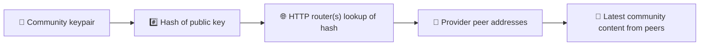
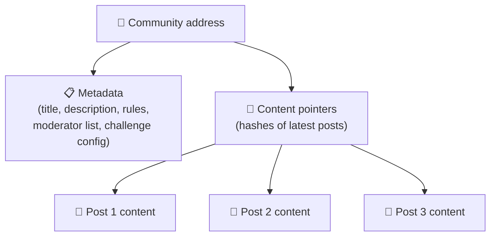
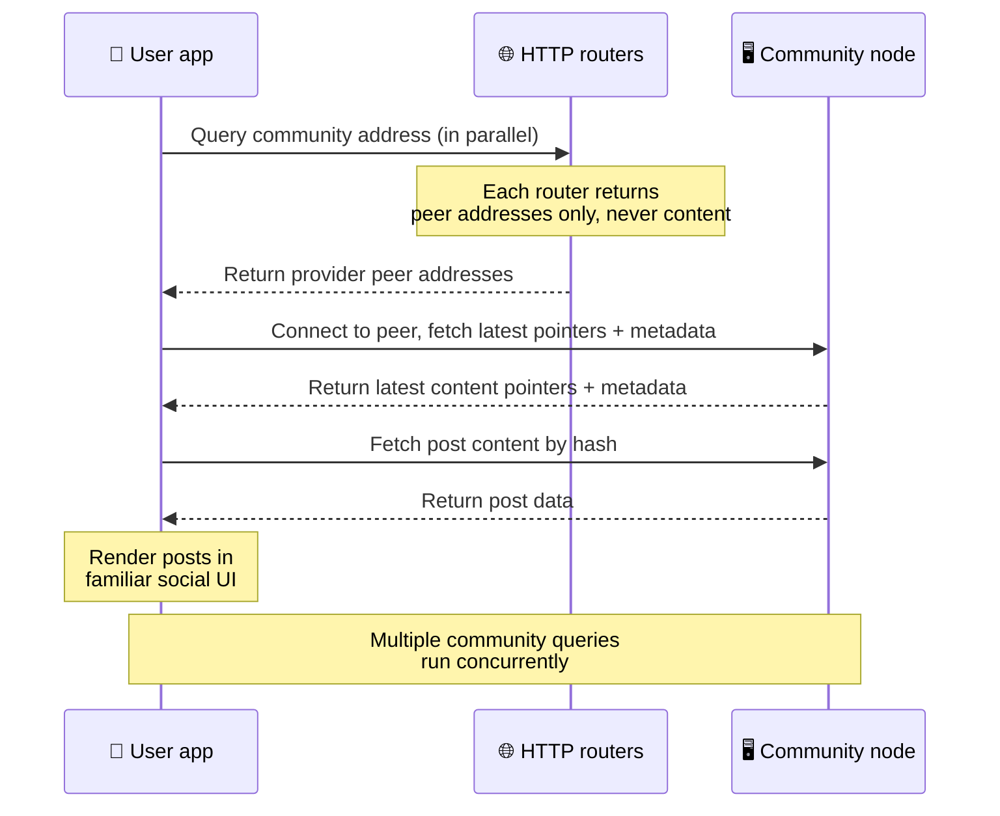
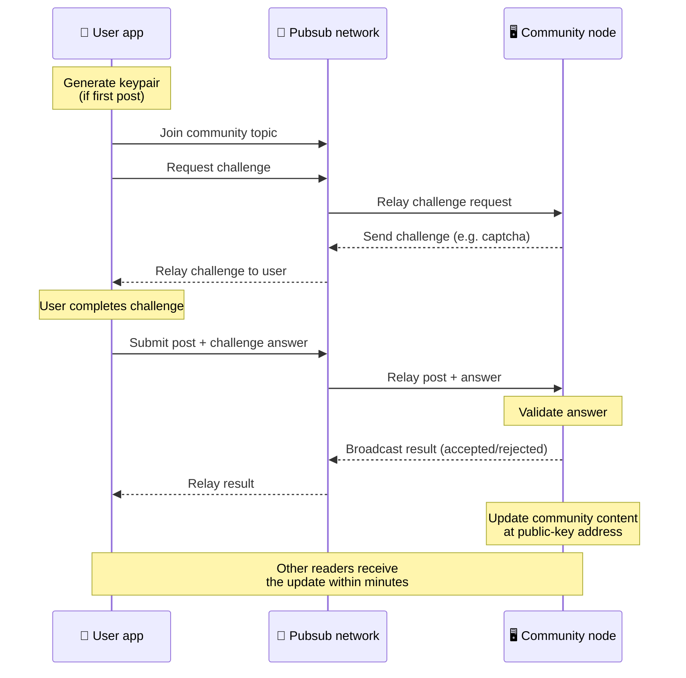
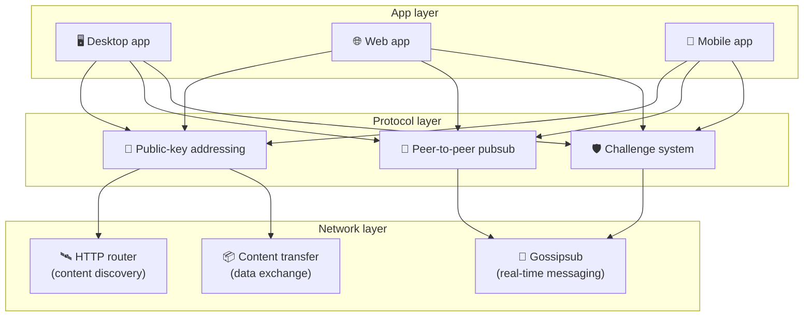

# Protocolo ponto a ponto

O Bitsocial não usa blockchain, servidor de federação nem backend centralizado. Em vez disso, ele
usa a pilha IPFS/libp2p para combinar duas ideias: **endereçamento baseado em chave pública** e
**pubsub ponto a ponto**. Juntas, elas permitem que qualquer pessoa hospede uma comunidade a partir
de hardware comum, enquanto os usuários leem e publicam sem contas em nenhum serviço controlado por
uma empresa.

Para um passo a passo menos técnico, leia
[Uma explicação completa do protocolo Bitsocial para leigos](./layman-protocol-explanation.md).

## O Bitsocial usa IPFS?

Sim. Os nós do Bitsocial usam primitivas IPFS/libp2p na camada ponto a ponto: registros de
comunidade endereçados por chave pública, transferência de conteúdo entre pares e pubsub gossipsub
para mensagens em tempo real. Quando esta documentação diz "pubsub", ela se refere ao pubsub do
IPFS/libp2p, e não a um intermediário de mensagens centralizado à parte.

Hoje o protocolo descreve a descoberta por meio de roteadores HTTP porque os clientes Bitsocial
consultam endpoints de roteador em busca dos endereços dos pares provedores, em vez de depender de
uma DHT hostil ao navegador a cada consulta. Os roteadores devolvem apenas pares; a transferência de
conteúdo e o tráfego de pubsub continuam passando pela rede ponto a ponto.

## Os dois problemas

Uma rede social descentralizada precisa responder a duas perguntas:

1. **Dados** — como armazenar e servir o conteúdo social do mundo inteiro sem um banco de dados central?
2. **Spam** — como impedir abusos mantendo o uso da rede gratuito?

O Bitsocial resolve o problema dos dados dispensando a blockchain por completo: mídia social não
precisa de ordenação global de transações nem de disponibilidade permanente de toda publicação
antiga. E resolve o problema do spam permitindo que cada comunidade execute seu próprio desafio
anti-spam na rede ponto a ponto.

Para o modelo de descoberta acima desta camada de rede, veja [Descoberta de conteúdo](./content-discovery.md).

---

## Endereçamento baseado em chave pública {#public-key-based-addressing}

No BitTorrent, o hash de um arquivo se torna seu endereço (_endereçamento baseado em conteúdo_). O
Bitsocial usa uma ideia parecida com chaves públicas: o hash da chave pública de uma comunidade se
torna seu endereço de rede.

Qualquer par da rede pode consultar um **roteador HTTP** por esse endereço: o roteador responde com
uma lista dos endereços de rede dos pares que estão fornecendo o hash da comunidade naquele momento,
e o cliente se conecta diretamente a esses pares para buscar o estado mais recente da comunidade.
Cada vez que o conteúdo é atualizado, seu número de versão aumenta. A rede guarda apenas a versão
mais recente — não é preciso preservar cada estado histórico, e é isso que torna essa abordagem leve
em comparação com uma blockchain.

> **O que um roteador HTTP realmente guarda.** Um roteador HTTP é um índice enxuto. Para cada
> endereço de conteúdo que conhece, ele armazena apenas os endereços de rede dos pares que se
> anunciaram como provedores (pares de IP/porta, multiaddrs libp2p, esse tipo de coisa). Ele
> **não** armazena o conteúdo da comunidade, seus metadados, o texto das publicações, a lista de
> membros nem sequer o rótulo legível daquilo que está naquele endereço; ele só responde "quais
> pares afirmam ter este hash?". Isso torna os roteadores baratos de operar, fáceis de trocar e não
> responsáveis pelo que os usuários publicam, de forma parecida com um tracker de BitTorrent, mas
> sem metadados de torrent: um tracker mapeia infohashes para pares, enquanto um roteador HTTP
> mapeia apenas um endereço de conteúdo para endereços de pares provedores.
>
> Por redundância, o cliente consulta **vários roteadores HTTP em paralelo** e mescla as listas de
> provedores que recebe de volta. Qualquer pessoa pode operar um roteador, e substituir ou
> acrescentar roteadores é uma mudança de configuração, sem migração de dados.
>
> O Bitsocial usa roteadores HTTP em vez de uma DHT porque manter uma DHT na escala necessária para
> a descoberta de conteúdo é caro, especialmente em dispositivos móveis. Uma DHT também não funciona
> no navegador, já que navegadores não conseguem entrar diretamente em uma DHT libp2p. Um roteador
> HTTP roda de forma barata em infraestrutura HTTP comum e funciona igualmente bem a partir de um
> celular ou de um navegador.

### O que fica armazenado no endereço

O endereço da comunidade não contém diretamente o conteúdo completo das publicações. Em vez disso,
ele guarda uma lista de identificadores de conteúdo — hashes que apontam para os dados reais. O
cliente então busca cada parte do conteúdo diretamente dos pares devolvidos pelos roteadores HTTP.
Os próprios roteadores nunca veem nem armazenam o conteúdo.

Pelo menos um par sempre tem os dados: o nó do operador da comunidade. Se a comunidade for popular,
muitos outros pares também os terão e a carga se distribui sozinha, do mesmo jeito que torrents
populares são mais rápidos de baixar.

---

## Pubsub ponto a ponto

Pubsub (publicação-assinatura) é um padrão de mensagens em que os pares assinam um tópico e recebem
toda mensagem publicada nesse tópico. O Bitsocial usa uma rede pubsub ponto a ponto — qualquer um
pode publicar, qualquer um pode assinar e não existe um intermediário central de mensagens.

Para publicar em uma comunidade, o usuário publica uma mensagem cujo tópico é igual à chave pública
da comunidade. O nó do operador da comunidade a recebe, valida e — se ela passar no desafio
anti-spam — a inclui na próxima atualização de conteúdo.

---

## Anti-spam: desafios via pubsub

Uma rede pubsub aberta é vulnerável a enxurradas de spam. O Bitsocial resolve isso exigindo que quem
publica complete um **desafio** antes de seu conteúdo ser aceito.

O sistema de desafios é flexível: cada operador de comunidade configura sua própria política. As
opções incluem:

| Tipo de desafio          | Como funciona                                                |
| ------------------------ | ------------------------------------------------------------ |
| **Captcha**              | Quebra-cabeça visual ou interativo apresentado no aplicativo |
| **Limite de frequência** | Limitar publicações por janela de tempo e por identidade     |
| **Barreira por token**   | Exigir prova de saldo de um token específico                 |
| **Pagamento**            | Exigir um pequeno pagamento por publicação                   |
| **Lista de permissões**  | Apenas identidades pré-aprovadas podem publicar              |
| **Código personalizado** | Qualquer política que possa ser expressa em código           |

Pares que retransmitem tentativas de desafio malsucedidas em excesso são bloqueados do tópico
pubsub, o que evita ataques de negação de serviço na camada de rede.

---

## Ciclo de vida: ler uma comunidade

É isto que acontece quando um usuário abre o aplicativo e vê as publicações mais recentes de uma
comunidade.

**Passo a passo:**

1. O usuário abre o aplicativo e vê uma interface social.
2. O cliente consulta vários roteadores HTTP em paralelo para cada comunidade que o usuário
   acompanha; cada roteador devolve apenas endereços de pares, nunca conteúdo. A latência da
   consulta depende das condições da rede e da carga do roteador; em condições típicas de baixa
   latência, as consultas costumam responder em cerca de um segundo e são executadas
   simultaneamente.
3. Assim que tem os endereços dos pares, o cliente se conecta a eles e busca os ponteiros de
   conteúdo e os metadados mais recentes da comunidade (título, descrição, lista de moderadores,
   configuração dos desafios).
4. O cliente busca o conteúdo real das publicações usando esses ponteiros e depois renderiza tudo em
   uma interface social familiar.

---

## Ciclo de vida: publicar uma postagem

Publicar envolve um handshake de desafio e resposta via pubsub antes de a publicação ser aceita.

**Passo a passo:**

1. O aplicativo gera um par de chaves para o usuário, caso ele ainda não tenha um.
2. O usuário escreve uma publicação para uma comunidade.
3. O cliente entra no tópico pubsub daquela comunidade (associado à chave pública da comunidade).
4. O cliente pede um desafio via pubsub.
5. O nó do operador da comunidade devolve um desafio (por exemplo, um captcha).
6. O usuário completa o desafio.
7. O cliente envia a publicação junto com a resposta do desafio via pubsub.
8. O nó do operador da comunidade valida a resposta. Se estiver correta, a publicação é aceita.
9. O nó transmite o resultado via pubsub para que os pares da rede saibam que devem continuar
   retransmitindo mensagens desse usuário.
10. O nó atualiza o conteúdo da comunidade no endereço de chave pública.
11. Em poucos minutos, todos os leitores da comunidade recebem a atualização.

---

## Visão geral da arquitetura

O sistema completo tem três camadas que funcionam em conjunto:

| Camada         | Papel                                                                                                                                                               |
| -------------- | ------------------------------------------------------------------------------------------------------------------------------------------------------------------- |
| **Aplicativo** | Interface do usuário. Podem existir vários aplicativos, cada um com seu próprio design, todos compartilhando as mesmas comunidades e identidades.                   |
| **Protocolo**  | Define como as comunidades são endereçadas, como as publicações são feitas e como o spam é evitado.                                                                 |
| **Rede**       | A infraestrutura ponto a ponto subjacente: roteadores HTTP para descoberta, gossipsub para mensagens em tempo real e transferência de conteúdo para troca de dados. |

---

## Privacidade: desvincular autores de endereços IP

Quando um usuário publica algo, o conteúdo é **criptografado com a chave pública do operador da
comunidade** antes de entrar na rede pubsub. Isso significa que, embora quem observa a rede consiga
ver que um par publicou _alguma coisa_, não consegue determinar:

- o que o conteúdo diz
- qual identidade de autor o publicou

É parecido com o modo como o BitTorrent permite descobrir quais IPs semeiam um torrent, mas não quem
o criou originalmente. A camada de criptografia acrescenta uma garantia de privacidade adicional
sobre essa base.

---

## Ponto a ponto no navegador

O P2P no navegador já é possível nos clientes Bitsocial. Um aplicativo de navegador pode rodar um nó
[Helia](https://helia.io/), usar a mesma pilha de cliente do protocolo Bitsocial que os outros
aplicativos e buscar conteúdo dos pares em vez de pedir a um gateway IPFS centralizado que o
entregue. O navegador também pode participar diretamente do pubsub, então publicar não depende de um
provedor de pubsub controlado por uma plataforma no caminho normal.

Este é o marco importante para a distribuição na web: um site HTTPS comum pode se abrir como um
cliente social P2P ativo. Os usuários não precisam instalar um aplicativo de desktop para conseguir
ler da rede, e quem opera o aplicativo não precisa manter um gateway central que se torna o ponto de
estrangulamento de censura ou moderação de todos os usuários de navegador.

O caminho do navegador tem limites diferentes dos de um nó de desktop ou de servidor:

- um nó de navegador normalmente não consegue aceitar conexões de entrada arbitrárias vindas da internet pública
- ele consegue carregar, validar, armazenar em cache e publicar dados enquanto o aplicativo está aberto
- ele não deve ser tratado como o hospedeiro de longa duração dos dados de uma comunidade
- a hospedagem completa de uma comunidade ainda é mais bem atendida por um aplicativo de desktop,
  pelo `bitsocial-cli` ou por outro nó sempre ligado

Os roteadores HTTP continuam importantes para a descoberta de conteúdo: eles devolvem os endereços
dos provedores de um hash de comunidade. Eles não são gateways IPFS, porque não servem o conteúdo em
si. Depois da descoberta, o cliente de navegador se conecta aos pares e busca os dados pela pilha
P2P.

O P2P no navegador é hoje o caminho web padrão, e não um experimento atrás de uma chave. O 5chan
roda P2P puro no navegador por padrão em 5chan.app, e o blog do Bitsocial em bitsocial.net faz o
mesmo. Os pares de navegador discam por WebSockets seguros; o `pkc-js` recusa por padrão as
discagens WebRTC e WebTransport, porque seus caminhos de estabelecimento de conexão são lentos e
pouco confiáveis no navegador. A mudança upstream que tornou a publicação pelo navegador viável em
2026 foi a correção do número de sequência do gossipsub no `@libp2p/gossipsub` 15.0.21, que impediu
que pares Kubo descartassem mensagens publicadas por nós JavaScript.

Para o panorama completo, incluindo o que um nó de navegador ainda não consegue fazer, veja
[Ponto a ponto no navegador](/browser-p2p/).

## Alternativa via gateway {#gateway-fallback}

O acesso pelo navegador apoiado em gateway continua útil como alternativa de compatibilidade e de
transição. Um gateway pode retransmitir dados entre a rede P2P e um cliente de navegador quando o
navegador não consegue entrar diretamente na rede ou quando o aplicativo escolhe intencionalmente o
caminho antigo. Esses gateways:

- podem ser operados por qualquer pessoa
- não exigem contas de usuário nem pagamentos
- não obtêm custódia sobre as identidades ou as comunidades dos usuários
- podem ser substituídos sem perda de dados

A arquitetura almejada é P2P no navegador em primeiro lugar, com gateways como alternativa opcional,
e não como gargalo padrão.

---

## Por que não uma blockchain?

Blockchains resolvem o problema do gasto duplo: elas precisam saber a ordem exata de cada transação
para impedir que alguém gaste a mesma moeda duas vezes.

Mídia social não tem problema de gasto duplo. Não faz diferença se a publicação A saiu um
milissegundo antes da publicação B, e publicações antigas não precisam ficar permanentemente
disponíveis em todos os nós.

Ao dispensar a blockchain, o Bitsocial evita:

- **taxas de gás** — publicar é gratuito
- **limites de vazão** — sem gargalo de tamanho de bloco ou de tempo de bloco
- **inchaço de armazenamento** — os nós guardam apenas o que precisam
- **custo de consenso** — sem mineradores, validadores ou staking

A contrapartida é que o Bitsocial não garante disponibilidade permanente do conteúdo antigo. Mas,
para mídia social, essa é uma contrapartida aceitável: o nó do operador da comunidade guarda os
dados, o conteúdo popular se espalha por muitos pares e as publicações muito antigas somem
naturalmente — do mesmo jeito que acontece em qualquer plataforma social.

## Por que não federação?

Redes federadas (como o e-mail ou plataformas baseadas em ActivityPub) melhoram em relação à
centralização, mas ainda têm limitações estruturais:

- **Dependência de servidor** — cada comunidade precisa de um servidor com domínio, TLS e
  manutenção contínua
- **Confiança no administrador** — o administrador do servidor tem controle total sobre as contas e
  o conteúdo dos usuários
- **Fragmentação** — mudar de servidor costuma significar perder seguidores, histórico ou identidade
- **Custo** — alguém precisa pagar pela hospedagem, o que gera pressão por consolidação

A abordagem ponto a ponto do Bitsocial tira o servidor da equação por completo. Um nó de comunidade
pode rodar em um laptop, em um Raspberry Pi ou em um VPS barato. O operador controla a política de
moderação, mas não pode tomar as identidades dos usuários, porque as identidades são controladas por
pares de chaves, e não concedidas por um servidor.

## E o Nostr?

O Nostr não se encaixa direito em nenhuma das duas caixas. Não é federação no estilo ActivityPub,
porque os usuários não recebem contas de instâncias e a identidade não fica presa a um servidor.
Também não é mídia social em blockchain, porque não há cadeia, consenso, gás nem ordem global de
transações.

O Nostr é mais bem descrito como **mídia social baseada em relays**. No protocolo base
([NIP-01](https://github.com/nostr-protocol/nips/blob/master/01.md)), os usuários mantêm pares de
chaves, assinam eventos e publicam esses eventos em relays WebSocket. Os clientes assinam relays com
filtros, buscam os eventos correspondentes e verificam as assinaturas localmente. Os usuários também
podem publicar metadados de lista de relays
([NIP-65](https://github.com/nostr-protocol/nips/blob/master/65.md)) que dizem aos clientes em quais
relays eles costumam escrever e quais preferem para ler menções.

Isso coloca o Nostr mais perto do Bitsocial do que os sistemas federados ou em blockchain em um
ponto importante: a identidade é criptográfica e portátil. A diferença principal está na camada de
dados. No Nostr, os relays são a camada normal de armazenamento e entrega. No Bitsocial, os
roteadores HTTP apenas ajudam os clientes a encontrar pares. Os roteadores não armazenam
publicações, perfis, metadados de comunidade nem estado de moderação; eles devolvem endereços de
pares provedores, e então os clientes buscam o conteúdo nos pares.

As comunidades mostram a mesma divisão. O Nostr tem padrões opcionais para
[grupos baseados em relays](https://github.com/nostr-protocol/nips/blob/master/29.md) e
[comunidades aprovadas por moderadores](https://github.com/nostr-protocol/nips/blob/master/72.md),
mas eles ainda dependem da política do relay, do estado de grupo hospedado no relay ou de escolhas
do cliente sobre quais aprovações honrar. O Bitsocial trata as comunidades como objetos
criptográficos de primeira classe, cujo nó operador valida as publicações, executa a política de
desafios da comunidade e publica o estado aceito mais recente na rede ponto a ponto.

| Pergunta                | Nostr                                                                                                          | Bitsocial                                                                       |
| ----------------------- | -------------------------------------------------------------------------------------------------------------- | ------------------------------------------------------------------------------- |
| Categoria               | Protocolo baseado em relays                                                                                    | Rede de comunidades ponto a ponto                                               |
| Identidade              | Chave pública do usuário                                                                                       | Pares de chaves de usuário e de comunidade                                      |
| Caminho dos dados       | Eventos assinados publicados em relays                                                                         | O endereço de chave pública resolve para pares; o conteúdo é buscado nos pares  |
| Quem mantém no ar       | Relays escolhidos por usuários e clientes                                                                      | Nó do dono da comunidade mais seeders auxiliares                                |
| Comunidades             | Grupos opcionais baseados em relays ou comunidades aprovadas por moderadores                                   | Objetos de comunidade de primeira classe com moderação controlada pelo operador |
| Anti-spam               | Política do relay, autenticação, pagamento, prova de trabalho, filtros do cliente ou aprovações de moderadores | Lógica de desafio definida pela comunidade antes da inclusão                    |
| Contrapartida principal | Identidade portátil, mas disponibilidade e política dependentes dos relays                                     | Menos dependência de relays, mas o conteúdo antigo não é garantido para sempre  |

---

## Resumo

O Bitsocial é construído sobre duas primitivas: endereçamento baseado em chave pública para a
descoberta de conteúdo e pubsub ponto a ponto para a comunicação em tempo real. Juntas, elas
produzem uma rede social em que:

- as comunidades são identificadas por chaves criptográficas, não por nomes de domínio
- o conteúdo se espalha entre pares como um torrent, em vez de ser servido a partir de um único banco de dados
- a resistência a spam é local a cada comunidade, não imposta por uma plataforma
- os usuários são donos de suas identidades por meio de pares de chaves, não por meio de contas revogáveis
- todo o sistema funciona sem servidores, blockchains ou taxas de plataforma
