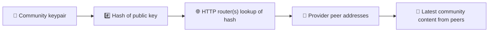
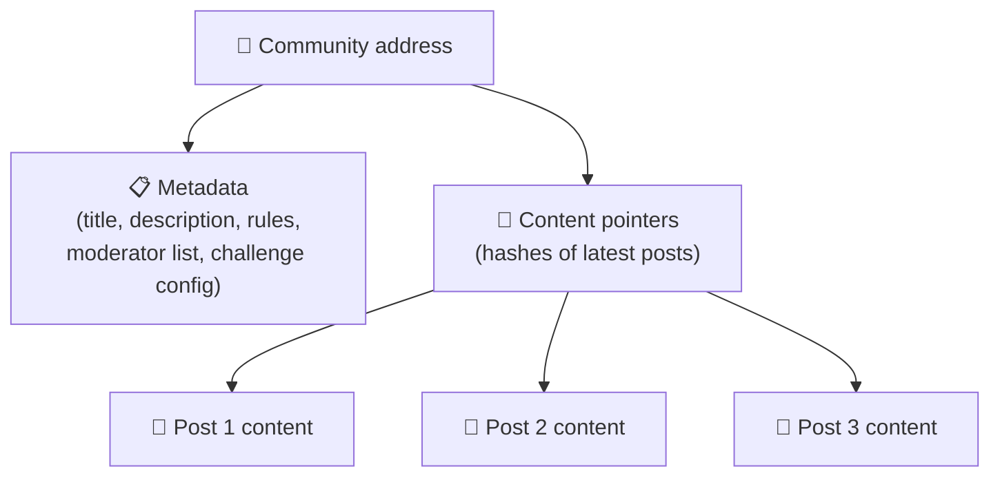
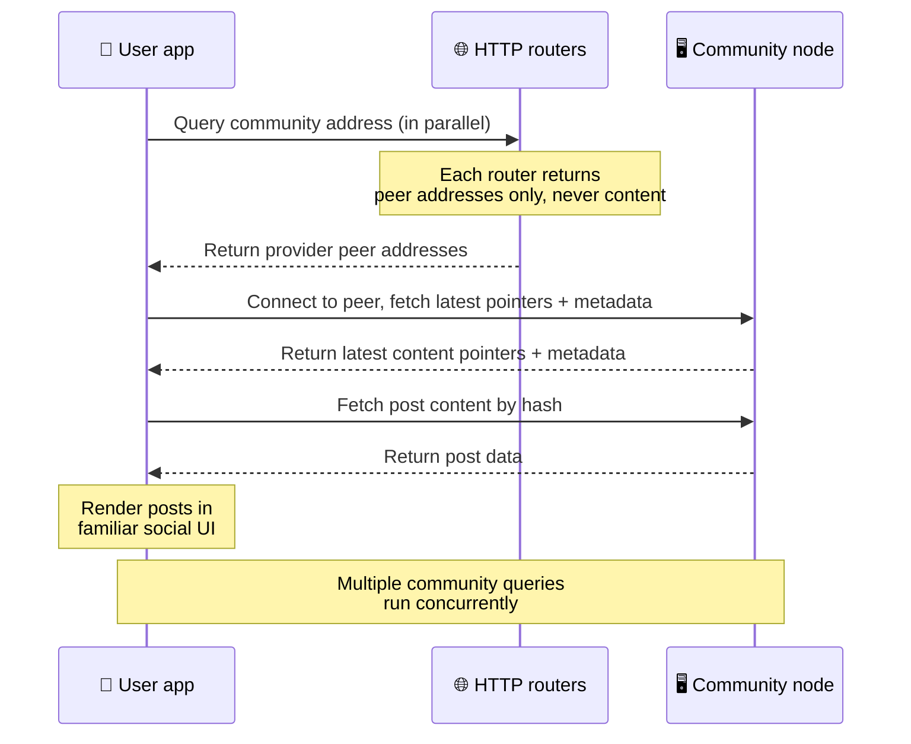
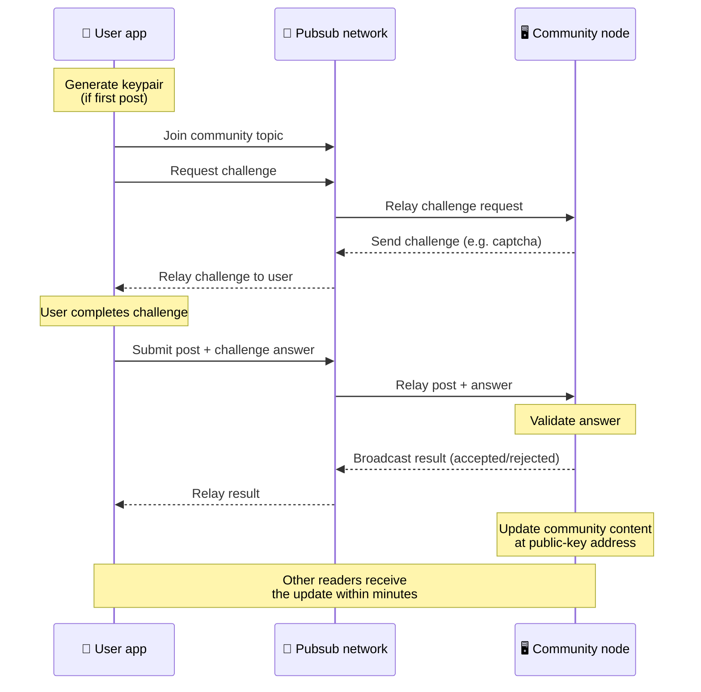
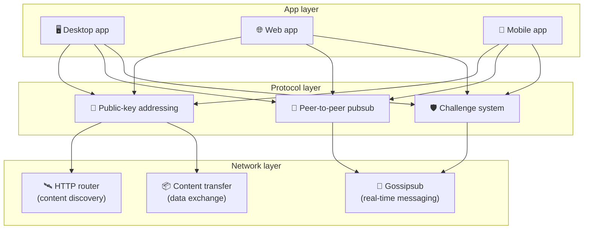

# Protocolul peer-to-peer

Bitsocial nu folosește un blockchain, un server de federație sau un backend centralizat. În schimb,
folosește stiva IPFS/libp2p pentru a combina două idei: **adresarea bazată pe cheie publică** și
**pubsub-ul peer-to-peer**. Împreună, ele permit oricui să găzduiască o comunitate de pe hardware
obișnuit, în timp ce utilizatorii citesc și publică fără conturi pe vreun serviciu controlat de o
companie.

Pentru o prezentare mai puțin tehnică, citește
[O explicație completă, pe înțelesul tuturor, a protocolului Bitsocial](./layman-protocol-explanation.md).

## Folosește Bitsocial IPFS?

Da. Nodurile Bitsocial folosesc primitive IPFS/libp2p pentru stratul peer-to-peer: înregistrări de
comunitate adresate prin cheie publică, transfer de conținut între noduri și pubsub gossipsub pentru
mesaje în timp real. Când documentația spune „pubsub”, se referă la pubsub-ul IPFS/libp2p, nu la un
broker de mesaje centralizat separat.

Protocolul descrie în prezent descoperirea prin routere HTTP, deoarece clienții Bitsocial interoghează
endpointuri de router pentru adresele nodurilor furnizoare, în loc să se bazeze la fiecare căutare pe
un DHT ostil browserului. Routerele returnează doar noduri; transferul de conținut și traficul pubsub
circulă în continuare prin rețeaua peer-to-peer.

## Cele două probleme

O rețea socială descentralizată trebuie să răspundă la două întrebări:

1. **Date** — cum stochezi și servești conținutul social al lumii fără o bază de date centrală?
2. **Spam** — cum previi abuzurile, păstrând în același timp rețeaua gratuită?

Bitsocial rezolvă problema datelor sărind complet peste blockchain: rețelele sociale nu au nevoie de
o ordonare globală a tranzacțiilor și nici de disponibilitatea permanentă a fiecărei postări vechi.
Problema spamului o rezolvă lăsând fiecare comunitate să ruleze propria provocare anti-spam prin
rețeaua peer-to-peer.

Pentru modelul de descoperire situat deasupra acestui strat de rețea, vezi
[Descoperirea conținutului](./content-discovery.md).

---

## Adresarea bazată pe cheie publică {#public-key-based-addressing}

În BitTorrent, hash-ul unui fișier devine adresa lui (_adresare bazată pe conținut_). Bitsocial
folosește o idee similară, dar cu chei publice: hash-ul cheii publice a unei comunități devine adresa
ei de rețea.

Orice nod din rețea poate interoga un **router HTTP** pentru acea adresă: routerul răspunde cu o
listă de adrese de rețea ale nodurilor care furnizează în acel moment hash-ul comunității, iar
clientul se conectează direct la acele noduri pentru a prelua cea mai recentă stare a comunității. De
fiecare dată când conținutul este actualizat, numărul lui de versiune crește. Rețeaua păstrează doar
cea mai recentă versiune — nu este nevoie să fie conservată fiecare stare istorică, iar exact asta
face abordarea ușoară în comparație cu un blockchain.

> **Ce conține de fapt un router HTTP.** Un router HTTP este un index subțire. Pentru fiecare adresă
> de conținut pe care o cunoaște, stochează doar adresele de rețea ale nodurilor care s-au anunțat ca
> furnizori (perechi IP/port, multiadrese libp2p și altele asemenea). **Nu** stochează conținutul
> comunității, metadatele ei, textul postărilor, lista membrilor și nici măcar eticheta lizibilă a
> ceea ce se află la acea adresă; răspunde doar la întrebarea „ce noduri susțin că au acest hash?”.
> Asta face routerele ieftine de rulat, ușor de înlocuit și fără răspundere pentru ce publică
> utilizatorii, similar cu un tracker BitTorrent, dar fără metadate de torrent: un tracker mapează
> infohash-uri la noduri, în timp ce un router HTTP mapează doar o adresă de conținut la adresele
> nodurilor furnizoare.
>
> Pentru redundanță, clientul interoghează **mai multe routere HTTP în paralel** și reunește listele
> de furnizori primite. Oricine poate rula un router, iar înlocuirea sau adăugarea de routere este o
> modificare de configurație, fără migrare de date.
>
> Bitsocial folosește routere HTTP în locul unui DHT, pentru că rularea unui DHT la scara necesară
> descoperirii conținutului este costisitoare, mai ales pe mobil. În plus, un DHT nu funcționează în
> browser, fiindcă browserele nu se pot alătura direct unui DHT libp2p. Un router HTTP rulează ieftin
> pe infrastructură HTTP obișnuită și funcționează la fel de bine de pe un telefon sau dintr-un
> browser.

### Ce se stochează la adresă

Adresa comunității nu conține direct conținutul complet al postărilor. În schimb, stochează o listă
de identificatori de conținut — hash-uri care indică datele propriu-zise. Clientul preia apoi fiecare
fragment de conținut direct de la nodurile returnate de routerele HTTP. Routerele nu văd și nu
stochează niciodată conținutul.

Cel puțin un nod are întotdeauna datele: nodul operatorului comunității. Dacă o comunitate este
populară, multe alte noduri le vor avea la rândul lor, iar încărcarea se distribuie singură, la fel
cum torentele populare se descarcă mai repede.

---

## Pubsub peer-to-peer

Pubsub (publish-subscribe) este un tipar de mesagerie în care nodurile se abonează la un subiect și
primesc fiecare mesaj publicat pe acel subiect. Bitsocial folosește o rețea pubsub peer-to-peer —
oricine poate publica, oricine se poate abona și nu există un broker central de mesaje.

Pentru a publica o postare într-o comunitate, un utilizator publică un mesaj al cărui subiect este
egal cu cheia publică a comunității. Nodul operatorului comunității îl preia, îl validează și — dacă
trece de provocarea anti-spam — îl include în următoarea actualizare de conținut.

---

## Anti-spam: provocări prin pubsub

O rețea pubsub deschisă este vulnerabilă la valuri de spam. Bitsocial rezolvă asta cerându-le celor
care publică să treacă de o **provocare** înainte ca materialul lor să fie acceptat.

Sistemul de provocări este flexibil: fiecare operator de comunitate își configurează propria politică.
Opțiunile includ:

| Tip de provocare     | Cum funcționează                                                   |
| -------------------- | ------------------------------------------------------------------ |
| **Captcha**          | Puzzle vizual sau interactiv prezentat în aplicație                |
| **Limitare de ritm** | Limitează postările pe interval de timp, pentru fiecare identitate |
| **Acces prin token** | Cere dovada deținerii unui anumit token                            |
| **Plată**            | Cere o plată mică pentru fiecare postare                           |
| **Listă permisă**    | Doar identitățile preaprobate pot publica                          |
| **Cod personalizat** | Orice politică ce poate fi exprimată în cod                        |

Nodurile care retransmit prea multe încercări eșuate de provocare sunt blocate de la subiectul
pubsub, ceea ce previne atacurile de tip denial-of-service asupra stratului de rețea.

---

## Ciclul de viață: citirea unei comunități

Iată ce se întâmplă când un utilizator deschide aplicația și vede cele mai recente postări ale unei
comunități.

**Pas cu pas:**

1. Utilizatorul deschide aplicația și vede o interfață socială.
2. Clientul interoghează în paralel mai multe routere HTTP pentru fiecare comunitate urmărită de
   utilizator; fiecare router returnează doar adrese de noduri, niciodată conținut. Latența
   interogării depinde de condițiile rețelei și de încărcarea routerelor; în condiții obișnuite, cu
   latență mică, interogările returnează adesea într-o secundă și rulează concurent.
3. Odată ce clientul are adresele nodurilor, se conectează la ele și preia cei mai recenți
   indicatori de conținut și metadatele comunității (titlu, descriere, listă de moderatori,
   configurația provocării).
4. Clientul preia conținutul propriu-zis al postărilor folosind acei indicatori, apoi afișează totul
   într-o interfață socială familiară.

---

## Ciclul de viață: publicarea unei postări

Publicarea presupune un schimb de tip provocare-răspuns prin pubsub înainte ca postarea să fie
acceptată.

**Pas cu pas:**

1. Aplicația generează o pereche de chei pentru utilizator, dacă acesta nu are deja una.
2. Utilizatorul scrie o postare pentru o comunitate.
3. Clientul se alătură subiectului pubsub al acelei comunități (legat de cheia publică a
   comunității).
4. Clientul cere o provocare prin pubsub.
5. Nodul operatorului comunității trimite înapoi o provocare (de exemplu, un captcha).
6. Utilizatorul rezolvă provocarea.
7. Clientul trimite postarea împreună cu răspunsul la provocare prin pubsub.
8. Nodul operatorului comunității validează răspunsul. Dacă este corect, postarea este acceptată.
9. Nodul difuzează rezultatul prin pubsub, astfel încât nodurile din rețea să știe că pot continua să
   retransmită mesajele acestui utilizator.
10. Nodul actualizează conținutul comunității la adresa lui bazată pe cheie publică.
11. În câteva minute, fiecare cititor al comunității primește actualizarea.

---

## Prezentare generală a arhitecturii

Sistemul complet are trei straturi care lucrează împreună:

| Strat         | Rol                                                                                                                                                                |
| ------------- | ------------------------------------------------------------------------------------------------------------------------------------------------------------------ |
| **Aplicație** | Interfața cu utilizatorul. Pot exista mai multe aplicații, fiecare cu designul ei, toate folosind aceleași comunități și identități.                               |
| **Protocol**  | Definește cum sunt adresate comunitățile, cum sunt publicate postările și cum este împiedicat spamul.                                                              |
| **Rețea**     | Infrastructura peer-to-peer de dedesubt: routere HTTP pentru descoperire, gossipsub pentru mesagerie în timp real și transfer de conținut pentru schimbul de date. |

---

## Confidențialitate: desprinderea autorilor de adresele IP

Când un utilizator publică o postare, conținutul este **criptat cu cheia publică a operatorului
comunității** înainte de a intra în rețeaua pubsub. Asta înseamnă că, deși observatorii rețelei pot
vedea că un nod a publicat _ceva_, ei nu pot determina:

- ce spune conținutul
- ce identitate de autor l-a publicat

Este similar cu felul în care BitTorrent permite să afli ce IP-uri seedează un torent, dar nu și cine
l-a creat inițial. Stratul de criptare adaugă o garanție suplimentară de confidențialitate peste
această bază.

---

## Peer-to-peer în browser

P2P în browser este acum posibil în clienții Bitsocial. O aplicație de browser poate rula un nod
[Helia](https://helia.io/), poate folosi aceeași stivă de client al protocolului Bitsocial ca
celelalte aplicații și poate prelua conținut de la noduri, în loc să ceară unui gateway IPFS
centralizat să îl servească. Browserul poate participa și direct la pubsub, astfel încât publicarea
nu are nevoie, în scenariul obișnuit, de un furnizor de pubsub deținut de o platformă.

Acesta este reperul important pentru distribuția pe web: un site HTTPS obișnuit se poate deschide
direct într-un client social P2P activ. Utilizatorii nu trebuie să instaleze o aplicație desktop
înainte de a putea citi din rețea, iar operatorul aplicației nu trebuie să ruleze un gateway central
care devine punctul de blocaj pentru cenzură sau moderare pentru fiecare utilizator de browser.

Calea din browser are alte limite decât un nod desktop sau de server:

- un nod din browser de obicei nu poate accepta conexiuni de intrare arbitrare din internetul public
- poate încărca, valida, păstra în cache și publica date cât timp aplicația este deschisă
- nu ar trebui tratat ca gazdă de durată pentru datele unei comunități
- găzduirea completă a unei comunități rămâne cel mai bine acoperită de o aplicație desktop, de
  `bitsocial-cli` sau de un alt nod mereu pornit

Routerele HTTP contează în continuare pentru descoperirea conținutului: ele returnează adresele
furnizorilor pentru hash-ul unei comunități. Nu sunt gateway-uri IPFS, pentru că nu servesc ele
însele conținutul. După descoperire, clientul din browser se conectează la noduri și preia datele
prin stiva P2P.

P2P în browser este acum calea web implicită, nu un experiment ascuns în spatele unui comutator.
5chan rulează implicit P2P pur din browser la 5chan.app, iar blogul Bitsocial de pe bitsocial.net
face la fel. Nodurile din browser se conectează prin WebSockets securizate; `pkc-js` refuză implicit
conexiunile WebRTC și WebTransport, pentru că modul lor de stabilire a conexiunii este lent și
nesigur în browser. Modificarea din upstream care a făcut publicarea din browser practicabilă în 2026
a fost corectarea numerelor de secvență gossipsub din `@libp2p/gossipsub` 15.0.21, care a oprit
nodurile Kubo să mai arunce mesajele publicate de nodurile JavaScript.

Pentru imaginea completă, inclusiv ce nu poate face încă un nod din browser, vezi
[Peer-to-peer în browser](/browser-p2p/).

## Rezervă prin gateway {#gateway-fallback}

Accesul din browser prin gateway rămâne util ca soluție de compatibilitate și de tranziție. Un
gateway poate transmite date între rețeaua P2P și un client de browser atunci când browserul nu se
poate alătura direct rețelei sau când aplicația alege intenționat calea mai veche. Aceste gateway-uri:

- pot fi rulate de oricine
- nu necesită conturi de utilizator sau plăți
- nu preiau custodia identităților sau a comunităților utilizatorilor
- pot fi înlocuite fără pierderea datelor

Arhitectura țintă pune P2P în browser pe primul loc, cu gateway-uri ca rezervă opțională, nu ca
blocaj implicit.

---

## De ce nu un blockchain?

Blockchain-urile rezolvă problema dublei cheltuieli: ele trebuie să cunoască ordinea exactă a
fiecărei tranzacții, pentru a împiedica pe cineva să cheltuiască aceeași monedă de două ori.

Rețelele sociale nu au o problemă a dublei cheltuieli. Nu contează dacă postarea A a fost publicată
cu o milisecundă înaintea postării B, iar postările vechi nu trebuie să fie disponibile permanent pe
fiecare nod.

Sărind peste blockchain, Bitsocial evită:

- **taxele de gas** — publicarea este gratuită
- **limitele de debit** — niciun blocaj legat de dimensiunea sau intervalul blocurilor
- **umflarea stocării** — nodurile păstrează doar ce le trebuie
- **costul consensului** — fără mineri, validatori sau staking

Compromisul este că Bitsocial nu garantează disponibilitatea permanentă a conținutului vechi. Dar
pentru rețelele sociale acesta este un compromis acceptabil: nodul operatorului comunității păstrează
datele, conținutul popular se răspândește pe multe noduri, iar postările foarte vechi se estompează
natural — exact cum se întâmplă pe orice platformă socială.

## De ce nu federație?

Rețelele federate (precum e-mailul sau platformele bazate pe ActivityPub) sunt un progres față de
centralizare, dar au în continuare limitări structurale:

- **Dependența de server** — fiecare comunitate are nevoie de un server cu domeniu, TLS și
  întreținere continuă
- **Încrederea în administrator** — administratorul serverului deține control complet asupra
  conturilor și conținutului utilizatorilor
- **Fragmentarea** — mutarea între servere înseamnă adesea pierderea urmăritorilor, a istoricului sau
  a identității
- **Costul** — cineva trebuie să plătească găzduirea, ceea ce creează presiune spre consolidare

Abordarea peer-to-peer a Bitsocial scoate complet serverul din ecuație. Un nod de comunitate poate
rula pe un laptop, pe un Raspberry Pi sau pe un VPS ieftin. Operatorul controlează politica de
moderare, dar nu poate confisca identitățile utilizatorilor, pentru că identitățile sunt controlate
prin perechi de chei, nu acordate de server.

## Dar Nostr?

Nostr nu se încadrează clar în niciuna dintre cele două categorii. Nu este federație în stil
ActivityPub, pentru că utilizatorilor nu li se emit conturi de către instanțe, iar identitatea nu
este legată de un singur server. Nu este nici rețea socială pe blockchain, pentru că nu există lanț,
consens, gas sau ordine globală a tranzacțiilor.

Nostr este descris mai bine ca **rețea socială bazată pe relee**. În protocolul de bază
([NIP-01](https://github.com/nostr-protocol/nips/blob/master/01.md)), utilizatorii dețin perechi de
chei, semnează evenimente și publică acele evenimente către relee WebSocket. Clienții se abonează la
relee cu filtre, preiau evenimentele care se potrivesc și verifică semnăturile local. Utilizatorii
pot publica și metadate cu lista releelor
([NIP-65](https://github.com/nostr-protocol/nips/blob/master/65.md)), care le spun clienților către
ce relee scriu de obicei și ce relee preferă pentru citirea mențiunilor.

Asta apropie Nostr de Bitsocial mai mult decât sistemele federate sau cele bazate pe blockchain
într-o privință importantă: identitatea este criptografică și portabilă. Principala diferență este
stratul de date. În Nostr, releele sunt stratul obișnuit de stocare și livrare. În Bitsocial,
routerele HTTP doar ajută clienții să găsească noduri. Routerele nu stochează postări, profiluri,
metadate de comunitate sau stare de moderare; ele returnează adresele nodurilor furnizoare, iar apoi
clienții preiau conținutul de la noduri.

Comunitățile arată aceeași separare. Nostr are tipare opționale pentru
[grupuri bazate pe relee](https://github.com/nostr-protocol/nips/blob/master/29.md) și
[comunități aprobate de moderatori](https://github.com/nostr-protocol/nips/blob/master/72.md), dar
acestea depind în continuare de politica releelor, de starea grupurilor găzduită pe relee sau de
alegerile clienților privind aprobările pe care le respectă. Bitsocial tratează comunitățile ca
obiecte criptografice de prim rang, al căror nod operator validează postările, aplică politica de
provocări a comunității și publică în rețeaua peer-to-peer cea mai recentă stare acceptată.

| Întrebare             | Nostr                                                                                               | Bitsocial                                                                             |
| --------------------- | --------------------------------------------------------------------------------------------------- | ------------------------------------------------------------------------------------- |
| Categorie             | Protocol bazat pe relee                                                                             | Rețea de comunități peer-to-peer                                                      |
| Identitate            | Cheia publică a utilizatorului                                                                      | Perechi de chei pentru utilizatori și comunități                                      |
| Calea datelor         | Evenimente semnate publicate către relee                                                            | Adresa bazată pe cheie publică se rezolvă în noduri; conținutul se preia de la noduri |
| Cine îl ține online   | Releele alese de utilizatori și de clienți                                                          | Nodul proprietarului comunității, plus seederi ajutători                              |
| Comunități            | Grupuri opționale bazate pe relee sau comunități aprobate de moderatori                             | Obiecte de comunitate de prim rang, cu moderare controlată de operator                |
| Anti-spam             | Politica releelor, autentificare, plată, proof-of-work, filtre de client sau aprobări de moderatori | Logică de provocare definită de comunitate, aplicată înainte de includere             |
| Compromisul principal | Identitate portabilă, dar disponibilitate și politici dependente de relee                           | Dependență mai mică de relee, dar conținutul vechi nu este garantat pentru totdeauna  |

---

## Rezumat

Bitsocial este construit pe două primitive: adresarea bazată pe cheie publică pentru descoperirea
conținutului și pubsub-ul peer-to-peer pentru comunicarea în timp real. Împreună, ele produc o rețea
socială în care:

- comunitățile sunt identificate prin chei criptografice, nu prin nume de domeniu
- conținutul se răspândește între noduri ca un torent, în loc să fie servit dintr-o singură bază de date
- rezistența la spam este locală fiecărei comunități, nu impusă de o platformă
- utilizatorii își dețin identitățile prin perechi de chei, nu prin conturi revocabile
- întregul sistem funcționează fără servere, fără blockchain-uri și fără taxe de platformă
