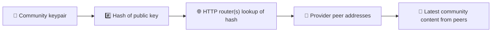
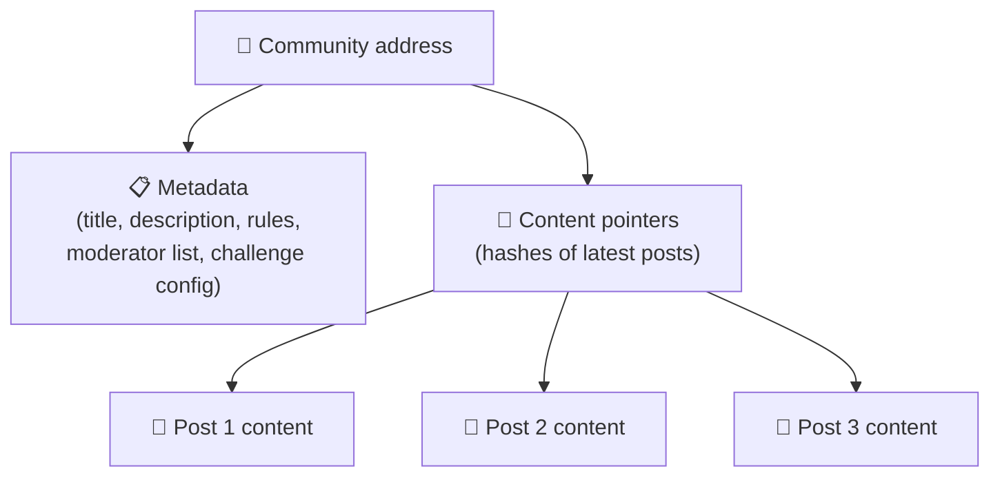
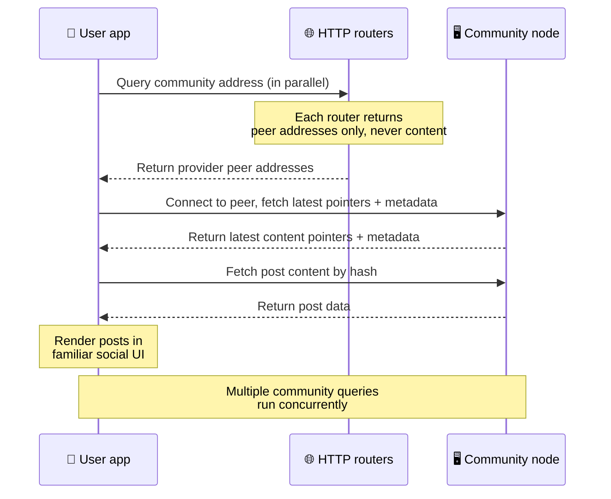
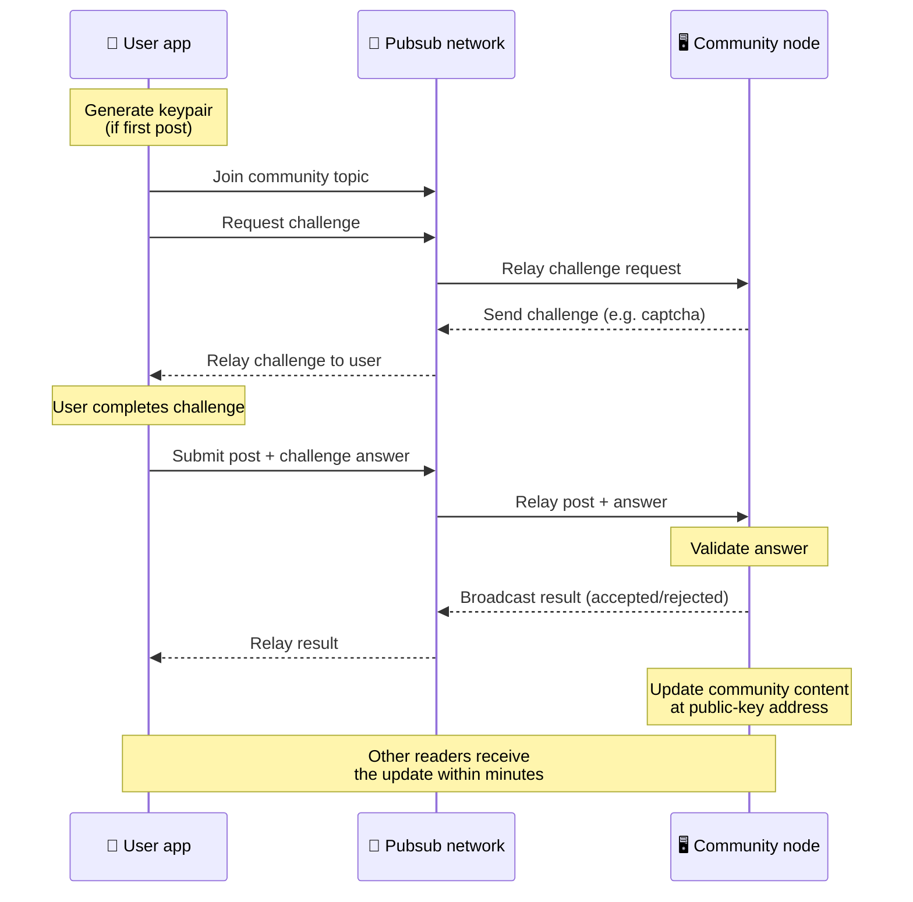
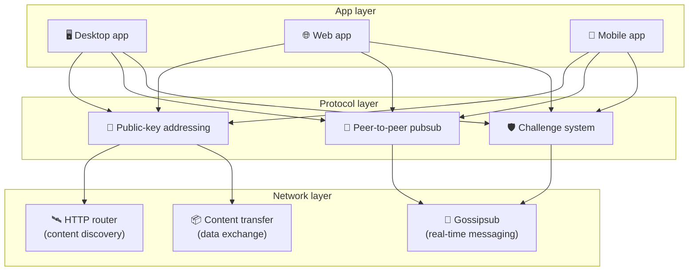

# P2P-протокол

Bitsocial не использует ни блокчейн, ни сервер федерации, ни централизованный бэкенд. Вместо этого
он берёт стек IPFS/libp2p и соединяет две идеи: **адресацию по открытому ключу** и **P2P-pubsub**.
Вместе они позволяют кому угодно держать сообщество на обычном домашнем железе, а пользователям —
читать и публиковать записи без учётных записей в каком-либо подконтрольном компании сервисе.

Менее техническое изложение читайте в статье
[Полное объяснение протокола Bitsocial простыми словами](./layman-protocol-explanation.md).

## Использует ли Bitsocial IPFS?

Да. Узлы Bitsocial используют примитивы IPFS/libp2p для P2P-уровня: записи сообществ, адресуемые по
открытому ключу, передачу контента между пирами и gossipsub-pubsub для сообщений в реальном времени.
Когда в этой документации говорится «pubsub», имеется в виду pubsub из IPFS/libp2p, а не отдельный
централизованный брокер сообщений.

Сейчас протокол описывает обнаружение через HTTP-маршрутизаторы, потому что клиенты Bitsocial
запрашивают адреса пиров-провайдеров у эндпоинтов маршрутизаторов, а не полагаются при каждом поиске
на DHT, недружелюбную к браузеру. Маршрутизаторы возвращают только пиров; передача контента и трафик
pubsub по-прежнему идут через P2P-сеть.

## Две задачи

Децентрализованная социальная сеть должна ответить на два вопроса:

1. **Данные** — как хранить и раздавать социальный контент всего мира без центральной базы данных?
2. **Спам** — как противостоять злоупотреблениям, оставляя сеть бесплатной в использовании?

Задачу данных Bitsocial решает, полностью отказавшись от блокчейна: социальным медиа не нужны ни
глобальный порядок транзакций, ни вечная доступность каждого старого поста. Задачу спама он решает
так: каждое сообщество проводит собственную антиспам-проверку поверх P2P-сети.

О модели обнаружения, которая надстраивается над этим сетевым уровнем, см.
[Обнаружение контента](./content-discovery.md).

---

## Адресация по открытому ключу {#public-key-based-addressing}

В BitTorrent адресом файла становится его хеш (_адресация по содержимому_). Bitsocial применяет
похожую идею к открытым ключам: сетевым адресом сообщества становится хеш его открытого ключа.

Любой пир сети может запросить этот адрес у **HTTP-маршрутизатора**: маршрутизатор отвечает списком
сетевых адресов пиров, которые сейчас раздают хеш сообщества, и клиент подключается к этим пирам
напрямую, чтобы забрать актуальное состояние сообщества. При каждом обновлении контента номер его
версии увеличивается. Сеть хранит только последнюю версию — сохранять каждое историческое состояние
не нужно, и именно поэтому такой подход легковеснее блокчейна.

> **Что на самом деле хранит HTTP-маршрутизатор.** HTTP-маршрутизатор — это тонкий индекс. Для
> каждого известного ему адреса контента он хранит только сетевые адреса пиров, объявивших себя
> провайдерами (пары IP/порт, мультиадреса libp2p и тому подобное). Он **не** хранит ни контент
> сообщества, ни его метаданные, ни тексты постов, ни список участников, ни даже читаемое человеком
> название того, что находится по этому адресу; он лишь отвечает на вопрос «какие пиры утверждают,
> что у них есть этот хеш?». Поэтому маршрутизаторы дёшевы в эксплуатации, легко заменяемы и не
> отвечают за то, что публикуют пользователи, — примерно как трекер BitTorrent, но без
> торрент-метаданных: трекер сопоставляет инфохеши с пирами, а HTTP-маршрутизатор сопоставляет адрес
> контента только с адресами пиров-провайдеров.
>
> Ради избыточности клиент опрашивает **несколько HTTP-маршрутизаторов параллельно** и объединяет
> полученные списки провайдеров. Запустить маршрутизатор может кто угодно, а заменить или добавить
> маршрутизаторы — это правка конфигурации без миграции данных.
>
> Bitsocial использует HTTP-маршрутизаторы вместо DHT, потому что эксплуатация DHT в масштабе,
> нужном для обнаружения контента, обходится дорого, особенно на мобильных устройствах. К тому же
> DHT не работает в браузере: браузеры не могут напрямую подключиться к DHT libp2p.
> HTTP-маршрутизатор дёшево работает на обычной HTTP-инфраструктуре и одинаково хорошо доступен и с
> телефона, и из браузера.

### Что хранится по этому адресу

Адрес сообщества не содержит полный текст постов напрямую. Вместо этого по нему хранится список
идентификаторов контента — хешей, указывающих на сами данные. Затем клиент забирает каждый фрагмент
контента напрямую у пиров, полученных от HTTP-маршрутизаторов. Сами маршрутизаторы никогда не видят
и не хранят контент.

Хотя бы у одного пира данные есть всегда — это узел оператора сообщества. Если сообщество популярно,
данные будут и у многих других пиров, и нагрузка распределится сама собой, ровно так же как
популярные торренты скачиваются быстрее.

---

## P2P-pubsub

Pubsub (публикация-подписка) — это схема обмена сообщениями, при которой пиры подписываются на тему
и получают каждое опубликованное в ней сообщение. Bitsocial использует P2P-сеть pubsub: публиковать
может кто угодно, подписываться может кто угодно, и центрального брокера сообщений нет.

Чтобы опубликовать пост в сообществе, пользователь публикует сообщение, тема которого равна
открытому ключу этого сообщества. Узел оператора сообщества подхватывает его, проверяет и — если
антиспам-проверка пройдена — включает его в следующее обновление контента.

---

## Антиспам: проверки поверх pubsub

Открытая сеть pubsub уязвима для спам-потоков. Bitsocial решает это так: прежде чем контент будет
принят, публикующий должен пройти **проверку**.

Система проверок гибкая: каждый оператор сообщества настраивает собственную политику. Например:

| Тип проверки            | Как это работает                                              |
| ----------------------- | ------------------------------------------------------------- |
| **Капча**               | Визуальная или интерактивная головоломка в приложении         |
| **Ограничение частоты** | Лимит числа постов за интервал времени для одной идентичности |
| **Токен-гейт**          | Требование подтвердить баланс определённого токена            |
| **Оплата**              | Требование небольшой оплаты за каждый пост                    |
| **Список разрешённых**  | Публиковать могут только заранее одобренные идентичности      |
| **Произвольный код**    | Любая политика, которую можно выразить в коде                 |

Пиры, которые ретранслируют слишком много неудачных попыток пройти проверку, блокируются в теме
pubsub, что предотвращает атаки на отказ в обслуживании на сетевом уровне.

---

## Жизненный цикл: чтение сообщества

Вот что происходит, когда пользователь открывает приложение и смотрит последние посты сообщества.

**Шаг за шагом:**

1. Пользователь открывает приложение и видит социальный интерфейс.
2. Клиент параллельно опрашивает несколько HTTP-маршрутизаторов по каждому сообществу, на которое
   подписан пользователь; каждый маршрутизатор возвращает только адреса пиров, но не контент.
   Задержка запроса зависит от состояния сети и нагрузки на маршрутизаторы; при типичных условиях с
   низкой задержкой ответы обычно приходят примерно за секунду, а сами запросы идут параллельно.
3. Получив адреса пиров, клиент подключается к ним и забирает актуальные указатели на контент и
   метаданные сообщества (название, описание, список модераторов, конфигурацию проверок).
4. По этим указателям клиент забирает сам текст постов и отрисовывает всё в привычном социальном
   интерфейсе.

---

## Жизненный цикл: публикация поста

Прежде чем пост будет принят, происходит рукопожатие «запрос — ответ» поверх pubsub.

**Шаг за шагом:**

1. Приложение генерирует пользователю пару ключей, если её ещё нет.
2. Пользователь пишет пост для сообщества.
3. Клиент подписывается на тему pubsub этого сообщества (привязанную к открытому ключу сообщества).
4. Клиент запрашивает проверку через pubsub.
5. Узел оператора сообщества присылает в ответ проверку (например, капчу).
6. Пользователь проходит проверку.
7. Клиент отправляет пост вместе с ответом на проверку через pubsub.
8. Узел оператора сообщества проверяет ответ. Если он верный, пост принимается.
9. Узел рассылает результат через pubsub, чтобы пиры сети знали, что сообщения этого пользователя
   можно ретранслировать дальше.
10. Узел обновляет контент сообщества по его адресу на основе открытого ключа.
11. За несколько минут обновление получает каждый читатель сообщества.

---

## Обзор архитектуры

В полной системе три уровня, которые работают вместе:

| Уровень        | Роль                                                                                                                                                             |
| -------------- | ---------------------------------------------------------------------------------------------------------------------------------------------------------------- |
| **Приложение** | Пользовательский интерфейс. Приложений может быть несколько, у каждого свой дизайн, но все они работают с одними и теми же сообществами и идентичностями.        |
| **Протокол**   | Определяет, как адресуются сообщества, как публикуются посты и как пресекается спам.                                                                             |
| **Сеть**       | Нижележащая P2P-инфраструктура: HTTP-маршрутизаторы для обнаружения, gossipsub для обмена сообщениями в реальном времени и передача контента для обмена данными. |

---

## Приватность: авторов не связать с IP-адресами

Когда пользователь публикует пост, контент **шифруется открытым ключом оператора сообщества** ещё до
попадания в сеть pubsub. Это значит, что наблюдатели в сети видят факт публикации пиром _чего-то_,
но не могут определить:

- что именно сказано в этом контенте
- какая авторская идентичность его опубликовала

Похожим образом в BitTorrent можно узнать, какие IP раздают торрент, но не кто его изначально
создал. Слой шифрования добавляет к этой базовой гарантии ещё немного приватности.

---

## P2P в браузере

P2P в браузере теперь доступен в клиентах Bitsocial. Браузерное приложение может запустить узел
[Helia](https://helia.io/), использовать тот же клиентский стек протокола Bitsocial, что и остальные
приложения, и забирать контент у пиров вместо того, чтобы просить его раздать централизованный шлюз
IPFS. Браузер также может напрямую участвовать в pubsub, поэтому в обычном сценарии публикация не
требует принадлежащего платформе pubsub-провайдера.

Это важная веха для распространения через веб: обычный HTTPS-сайт может открыться как живой
P2P-клиент социальной сети. Пользователям не нужно ставить десктопное приложение, чтобы начать
читать из сети, а оператору приложения не нужно держать центральный шлюз, который становится точкой
цензуры или модерации для всех браузерных пользователей.

У браузерного пути ограничения не такие, как у десктопного или серверного узла:

- браузерный узел обычно не может принимать произвольные входящие соединения из публичного интернета
- он может загружать, проверять, кешировать и публиковать данные, пока приложение открыто
- его не стоит считать долговременным хранителем данных сообщества
- полноценный хостинг сообщества по-прежнему лучше доверить десктопному приложению, `bitsocial-cli`
  или другому постоянно работающему узлу

HTTP-маршрутизаторы по-прежнему важны для обнаружения контента: они возвращают адреса провайдеров по
хешу сообщества. Это не шлюзы IPFS, потому что сам контент они не раздают. После обнаружения
браузерный клиент подключается к пирам и забирает данные через P2P-стек.

P2P в браузере теперь путь по умолчанию для веба, а не эксперимент за флагом. 5chan по умолчанию
работает как чистый браузерный P2P на 5chan.app, и блог Bitsocial на bitsocial.net делает то же
самое. Браузерные пиры соединяются по защищённым WebSockets; `pkc-js` по умолчанию запрещает
соединения по WebRTC и WebTransport, потому что в браузере они устанавливаются медленно и
ненадёжно. Изменением в апстриме, сделавшим публикацию из браузера практичной в 2026 году, стало
исправление порядковых номеров gossipsub в `@libp2p/gossipsub` 15.0.21: после него узлы Kubo
перестали отбрасывать сообщения, опубликованные узлами на JavaScript.

Полная картина, включая то, чего браузерный узел всё ещё не умеет, — в разделе
[P2P в браузере](/browser-p2p/).

## Запасной путь через шлюз {#gateway-fallback}

Доступ из браузера через шлюз всё ещё полезен как совместимость и как запасной путь на время
перехода. Шлюз может передавать данные между P2P-сетью и браузерным клиентом, когда браузер не может
подключиться к сети напрямую или когда приложение сознательно выбирает старый путь. Такие шлюзы:

- может запустить кто угодно
- не требуют учётных записей или оплаты
- не получают опеки над идентичностями и сообществами пользователей
- можно заменить без потери данных

Целевая архитектура — сначала браузерный P2P, а шлюзы как необязательный запасной путь, а не как
узкое место по умолчанию.

---

## Почему не блокчейн?

Блокчейны решают задачу двойной траты: им нужно знать точный порядок каждой транзакции, чтобы никто
не потратил одну и ту же монету дважды.

У социальных медиа задачи двойной траты нет. Неважно, вышел ли пост A на миллисекунду раньше поста
B, и старые посты не обязаны быть вечно доступными на каждом узле.

Отказавшись от блокчейна, Bitsocial избегает:

- **комиссий за газ** — публикация бесплатна
- **ограничений пропускной способности** — нет узкого места в размере или времени блока
- **разрастания хранилища** — узлы хранят только то, что им нужно
- **накладных расходов на консенсус** — не нужны ни майнеры, ни валидаторы, ни стейкинг

Расплата за это в том, что Bitsocial не гарантирует вечную доступность старого контента. Но для
социальных медиа такой размен приемлем: данные держит узел оператора сообщества, популярный контент
расходится по множеству пиров, а очень старые посты естественным образом уходят из виду — ровно так
же, как на любой социальной платформе.

## Почему не федерация?

Федеративные сети (вроде электронной почты или платформ на ActivityPub) лучше централизации, но у
них остаются структурные ограничения:

- **Зависимость от сервера** — каждому сообществу нужен сервер с доменом, TLS и постоянным
  обслуживанием
- **Доверие к администратору** — администратор сервера полностью управляет учётными записями и
  контентом пользователей
- **Фрагментация** — переезд между серверами часто означает потерю подписчиков, истории или
  идентичности
- **Стоимость** — кто-то должен платить за хостинг, а это создаёт давление в сторону укрупнения

P2P-подход Bitsocial убирает сервер из уравнения целиком. Узел сообщества может работать на
ноутбуке, Raspberry Pi или дешёвом VPS. Оператор задаёт политику модерации, но не может отобрать
идентичности пользователей, потому что они контролируются парами ключей, а не выдаются сервером.

## А что насчёт Nostr?

Nostr не укладывается чётко ни в одну из этих категорий. Это не федерация в стиле ActivityPub,
потому что инстансы не выдают пользователям учётные записи, а идентичность не привязана к одному
серверу. Это и не блокчейн-соцсеть, потому что здесь нет ни цепочки, ни консенсуса, ни газа, ни
глобального порядка транзакций.

Nostr точнее описать как **социальную сеть на релеях**. В базовом протоколе
([NIP-01](https://github.com/nostr-protocol/nips/blob/master/01.md)) пользователи владеют парами
ключей, подписывают события и публикуют эти события на WebSocket-релеи. Клиенты подписываются на
релеи с фильтрами, получают подходящие события и проверяют подписи локально. Пользователи могут
также публиковать метаданные со списком релеев
([NIP-65](https://github.com/nostr-protocol/nips/blob/master/65.md)), которые сообщают клиентам, на
какие релеи они обычно пишут и какие предпочитают для чтения упоминаний.

В одном важном отношении это ставит Nostr ближе к Bitsocial, чем федеративные или блокчейн-системы:
идентичность криптографическая и переносимая. Главное различие — уровень данных. В Nostr релеи и
есть обычный уровень хранения и доставки. В Bitsocial HTTP-маршрутизаторы лишь помогают клиентам
найти пиров. Маршрутизаторы не хранят ни постов, ни профилей, ни метаданных сообществ, ни состояния
модерации; они возвращают адреса пиров-провайдеров, а дальше клиенты забирают контент у пиров.

С сообществами та же картина. В Nostr есть необязательные схемы для
[групп на релеях](https://github.com/nostr-protocol/nips/blob/master/29.md) и
[сообществ с одобрением модераторов](https://github.com/nostr-protocol/nips/blob/master/72.md), но
они всё равно зависят от политики релея, состояния группы на релее или от решения клиента, чьи
одобрения учитывать. Bitsocial рассматривает сообщества как полноценные криптографические объекты:
узел их оператора проверяет посты, применяет политику проверок сообщества и публикует последнее
принятое состояние в P2P-сеть.

| Вопрос                | Nostr                                                                                            | Bitsocial                                                                    |
| --------------------- | ------------------------------------------------------------------------------------------------ | ---------------------------------------------------------------------------- |
| Категория             | Протокол на релеях                                                                               | P2P-сеть сообществ                                                           |
| Идентичность          | Открытый ключ пользователя                                                                       | Пары ключей пользователя и сообщества                                        |
| Путь данных           | Подписанные события публикуются на релеи                                                         | Адрес на основе открытого ключа приводит к пирам; контент забирается у пиров |
| Кто держит это онлайн | Релеи, выбранные пользователями и клиентами                                                      | Узел владельца сообщества плюс вспомогательные сидеры                        |
| Сообщества            | Необязательные группы на релеях или сообщества с одобрением модераторов                          | Полноценные объекты сообществ с модерацией под контролем оператора           |
| Антиспам              | Политика релея, аутентификация, оплата, proof-of-work, фильтры клиента или одобрения модераторов | Заданная сообществом логика проверок до включения контента                   |
| Главный размен        | Переносимая идентичность, но доступность и политика зависят от релеев                            | Меньше зависимости от релеев, но старый контент не гарантирован навсегда     |

---

## Итог

Bitsocial стоит на двух примитивах: адресации по открытому ключу для обнаружения контента и
P2P-pubsub для общения в реальном времени. Вместе они дают социальную сеть, где:

- сообщества определяются криптографическими ключами, а не доменными именами
- контент расходится по пирам как торрент, а не раздаётся из одной базы данных
- устойчивость к спаму локальна для каждого сообщества, а не навязана платформой
- пользователи владеют своими идентичностями через пары ключей, а не через отзывные учётные записи
- вся система работает без серверов, блокчейнов и платформенных комиссий
