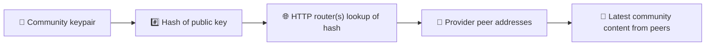
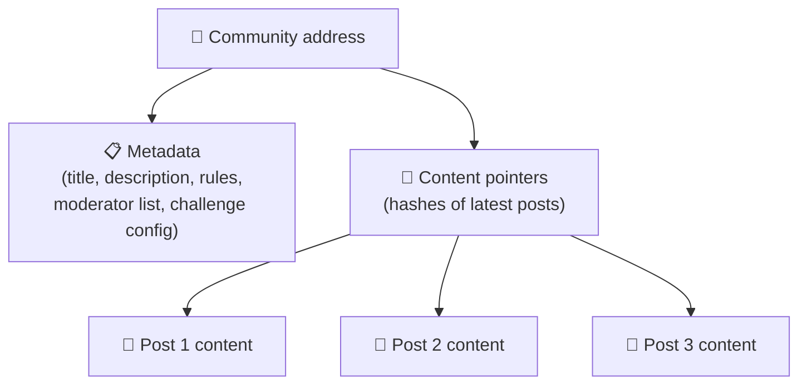
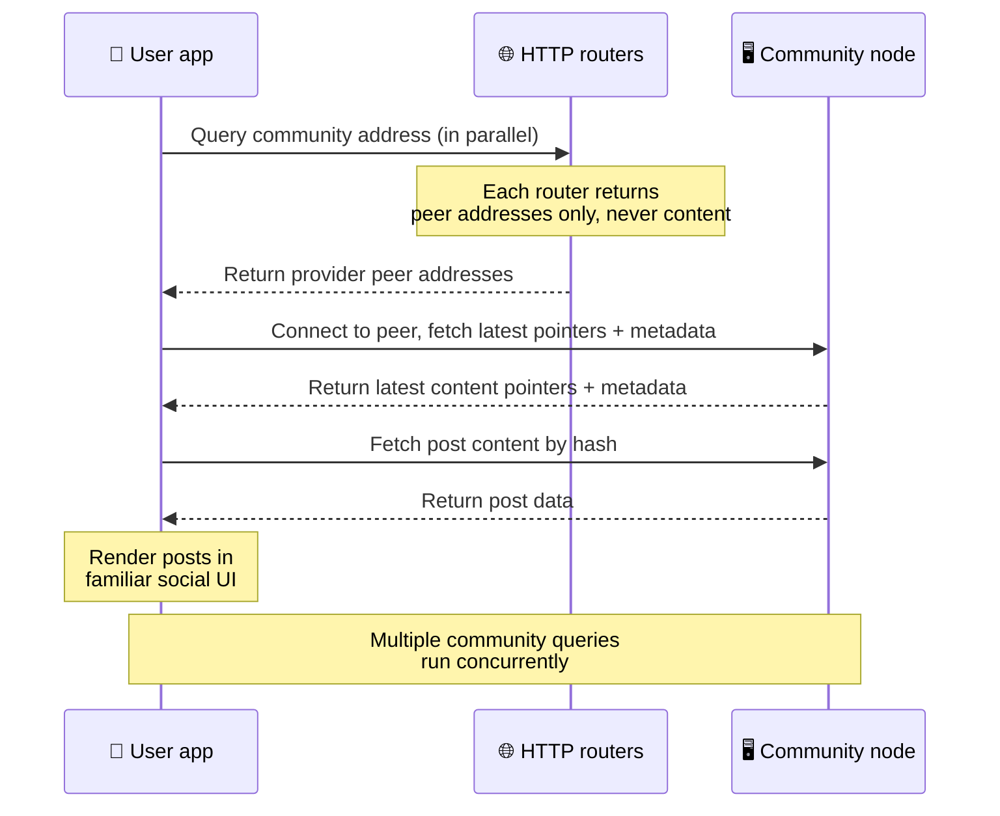
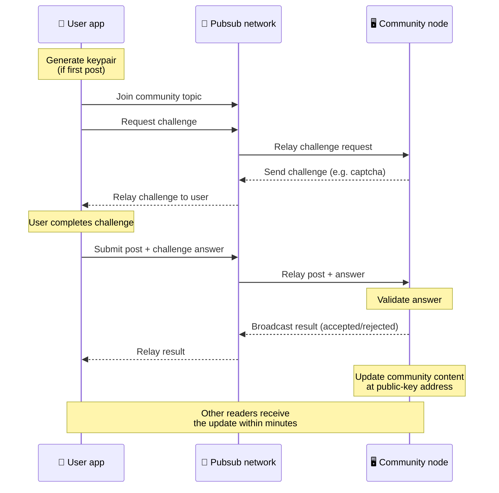
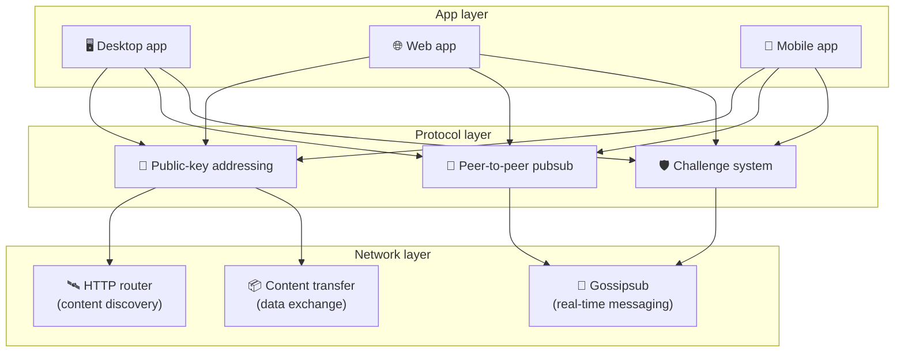

# Protokolli Peer-to-Peer

Bitsocial nuk përdor blockchain, server federimi apo backend të centralizuar. Në vend të tyre përdor
grumbullin IPFS/libp2p për të bashkuar dy ide: **adresimin e bazuar në çelës publik** dhe
**pubsub-in peer-to-peer**. Së bashku ato i japin mundësi kujtdo të mbajë një komunitet nga pajisje
të zakonshme, ndërsa përdoruesit lexojnë dhe postojnë pa llogari në ndonjë shërbim të kontrolluar nga
një kompani.

Për një shtjellim më pak teknik, lexoni
[Një shpjegim i plotë laik i protokollit Bitsocial](./layman-protocol-explanation.md).

## A e përdor Bitsocial IPFS?

Po. Nyjet Bitsocial përdorin primitivat IPFS/libp2p për shtresën peer-to-peer: regjistrime
komunitetesh të adresuara me çelës publik, transferim përmbajtjeje mes nyjeve dhe pubsub gossipsub
për mesazhet në kohë reale. Kur këto dokumente thonë "pubsub", nënkuptojnë pubsub-in e IPFS/libp2p,
jo një ndërmjetës mesazhesh të centralizuar më vete.

Protokolli aktualisht e përshkruan zbulimin përmes ruterëve HTTP, sepse klientët Bitsocial u kërkojnë
pikave fundore të ruterëve adresat e nyjeve ofruese, në vend që të mbështeten te një DHT armiqësor
ndaj shfletuesit për çdo kërkim. Ruterët kthejnë vetëm nyje; transferimi i përmbajtjes dhe trafiku i
pubsub-it vazhdojnë të lëvizin nëpër rrjetin peer-to-peer.

## Dy problemet

Një rrjet social i decentralizuar duhet t'u përgjigjet dy pyetjeve:

1. **Të dhënat** — si i ruani dhe i shërbeni përmbajtjet sociale të botës pa një bazë të dhënash
   qendrore?
2. **Spami** — si e parandaloni abuzimin duke e mbajtur rrjetin falas për t'u përdorur?

Bitsocial e zgjidh problemin e të dhënave duke e anashkaluar krejtësisht blockchain-in: media sociale
nuk ka nevojë për renditje globale të transaksioneve, as për disponueshmëri të përhershme të çdo
postimi të vjetër. Problemin e spamit e zgjidh duke e lënë çdo komunitet të zbatojë sfidën e vet
kundër spamit mbi rrjetin peer-to-peer.

Për modelin e zbulimit mbi këtë shtresë rrjeti, shihni [Zbulimi i përmbajtjes](./content-discovery.md).

---

## Adresimi i bazuar në çelës publik {#public-key-based-addressing}

Te BitTorrent, hash-i i një skedari bëhet adresa e tij (_adresim i bazuar në përmbajtje_). Bitsocial
përdor një ide të ngjashme me çelësat publikë: hash-i i çelësit publik të një komuniteti bëhet adresa
e tij në rrjet.

Çdo nyje në rrjet mund t'i kërkojë atë adresë një **ruteri HTTP**: ruteri përgjigjet me një listë
adresash rrjeti të nyjeve që aktualisht ofrojnë hash-in e komunitetit, dhe klienti lidhet
drejtpërdrejt me ato nyje për të marrë gjendjen më të fundit të komunitetit. Sa herë që përmbajtja
përditësohet, numri i versionit të saj rritet. Rrjeti mban vetëm versionin më të fundit — nuk ka
nevojë të ruhet çdo gjendje historike, dhe pikërisht kjo e bën këtë qasje të lehtë krahasuar me një
blockchain.

> **Çfarë mban në të vërtetë një ruter HTTP.** Një ruter HTTP është një indeks i hollë. Për çdo
> adresë përmbajtjeje që njeh, ai ruan vetëm adresat e rrjetit të nyjeve që janë shpallur si ofruese
> (çifte IP/port, multiadresa libp2p dhe të ngjashme). Ai **nuk** ruan përmbajtjen e komunitetit, as
> meta të dhënat, tekstin e postimeve, listën e anëtarëve apo etiketën e lexueshme nga njeriu për
> atë që ndodhet në atë adresë; ai thjesht i përgjigjet pyetjes "cilat nyje pretendojnë se e kanë
> këtë hash?". Kjo i bën ruterët të lirë për t'u mbajtur në punë, të lehtë për t'u zëvendësuar dhe jo
> përgjegjës për atë që publikojnë përdoruesit, ngjashëm me një tracker BitTorrent, por pa meta të
> dhënat e torrentit: një tracker lidh infohash-et me nyjet, ndërsa një ruter HTTP lidh vetëm një
> adresë përmbajtjeje me adresat e nyjeve ofruese.
>
> Për tepricë, klienti pyet **disa ruterë HTTP paralelisht** dhe i bashkon listat e ofruesve që merr
> si përgjigje. Kushdo mund të mbajë një ruter, dhe zëvendësimi ose shtimi i ruterëve është një
> ndryshim konfigurimi pa migrim të dhënash.
>
> Bitsocial përdor ruterë HTTP në vend të një DHT-je, sepse mbajtja e një DHT-je në shkallën e
> nevojshme për zbulimin e përmbajtjes është e kushtueshme, sidomos për celularët. Një DHT as nuk
> funksionon në shfletues, sepse shfletuesit nuk mund t'i bashkohen drejtpërdrejt një DHT-je libp2p.
> Një ruter HTTP funksionon lirë mbi infrastrukturë HTTP të zakonshme dhe punon njësoj mirë nga një
> telefon apo nga një shfletues.

### Çfarë ruhet te adresa

Adresa e komunitetit nuk e përmban drejtpërdrejt përmbajtjen e plotë të postimeve. Ajo ruan një listë
identifikuesish përmbajtjeje — hash-e që tregojnë te të dhënat e vërteta. Klienti më pas e merr çdo
pjesë të përmbajtjes drejtpërdrejt nga nyjet e kthyera prej ruterëve HTTP. Vetë ruterët nuk e shohin
dhe nuk e ruajnë kurrë përmbajtjen.

Të paktën një nyje i ka gjithmonë të dhënat: nyja e operatorit të komunitetit. Nëse komuniteti është
i popullarizuar, edhe shumë nyje të tjera do t'i kenë dhe ngarkesa shpërndahet vetvetiu, njësoj siç
shkarkohen më shpejt torrentet e popullarizuara.

---

## Pubsub-i peer-to-peer

Pubsub (publikim-abonim) është një model mesazhimi ku nyjet abonohen në një temë dhe marrin çdo
mesazh të publikuar në atë temë. Bitsocial përdor një rrjet pubsub peer-to-peer — kushdo mund të
publikojë, kushdo mund të abonohet dhe nuk ka ndërmjetës qendror mesazhesh.

Për të publikuar një postim në një komunitet, përdoruesi publikon një mesazh temën e të cilit e ka
çelësi publik i komunitetit. Nyja e operatorit të komunitetit e kap atë, e vlerëson dhe — nëse e
kalon sfidën kundër spamit — e përfshin në përditësimin e radhës të përmbajtjes.

---

## Kundër spamit: sfida përmes pubsub-it

Një rrjet pubsub i hapur është i cenueshëm ndaj vërshimeve të spamit. Bitsocial e zgjidh këtë duke u
kërkuar publikuesve të plotësojnë një **sfidë** përpara se përmbajtja e tyre të pranohet.

Sistemi i sfidave është fleksibël: çdo operator komuniteti konfiguron politikën e vet. Ndër mundësitë
janë:

| Lloji i sfidës         | Si funksionon                                                 |
| ---------------------- | ------------------------------------------------------------- |
| **Captcha**            | Enigmë pamore ose ndërvepruese e paraqitur në aplikacion      |
| **Kufizim shpejtësie** | Kufizon postimet për çdo identitet brenda një intervali kohor |
| **Portë tokeni**       | Kërkon provë të gjendjes së një tokeni të caktuar             |
| **Pagesë**             | Kërkon një pagesë të vogël për çdo postim                     |
| **Listë lejimi**       | Vetëm identitetet e miratuara paraprakisht mund të postojnë   |
| **Kod i posaçëm**      | Çdo politikë që shprehet dot në kod                           |

Nyjet që përcjellin shumë përpjekje të dështuara për sfidat bllokohen nga tema e pubsub-it, gjë që
parandalon sulmet e mohimit të shërbimit në shtresën e rrjetit.

---

## Cikli i jetës: leximi i një komuniteti

Ja çfarë ndodh kur një përdorues hap aplikacionin dhe shikon postimet më të fundit të një komuniteti.

**Hap pas hapi:**

1. Përdoruesi hap aplikacionin dhe sheh një ndërfaqe sociale.
2. Klienti pyet disa ruterë HTTP paralelisht për çdo komunitet që ndjek përdoruesi; çdo ruter kthen
   vetëm adresa nyjesh, kurrë përmbajtje. Vonesa e kërkesave varet nga kushtet e rrjetit dhe nga
   ngarkesa e ruterëve; në kushte tipike me vonesë të ulët, përgjigjet vijnë shpesh brenda rreth një
   sekonde dhe kërkesat kryhen njëkohësisht.
3. Sapo klienti ka adresat e nyjeve, lidhet me ato nyje dhe merr treguesit e përmbajtjes më të fundit
   dhe meta të dhënat e komunitetit (titull, përshkrim, listë moderatorësh, konfigurim të sfidës).
4. Klienti merr përmbajtjen e vërtetë të postimeve me anë të atyre treguesve, pastaj e paraqet
   gjithçka në një ndërfaqe sociale të njohur.

---

## Cikli i jetës: publikimi i një postimi

Publikimi përfshin një shkëmbim sfidë-përgjigje mbi pubsub përpara se postimi të pranohet.

**Hap pas hapi:**

1. Aplikacioni gjeneron një çift çelësash për përdoruesin nëse ai nuk ka ende një të tillë.
2. Përdoruesi shkruan një postim për një komunitet.
3. Klienti i bashkohet temës së pubsub-it për atë komunitet (e lidhur me çelësin publik të
   komunitetit).
4. Klienti kërkon një sfidë përmes pubsub-it.
5. Nyja e operatorit të komunitetit kthen një sfidë (për shembull, një captcha).
6. Përdoruesi e plotëson sfidën.
7. Klienti dërgon postimin bashkë me përgjigjen e sfidës përmes pubsub-it.
8. Nyja e operatorit të komunitetit e vlerëson përgjigjen. Nëse është e saktë, postimi pranohet.
9. Nyja e transmeton rezultatin përmes pubsub-it, që nyjet e rrjetit ta dinë se duhet të vazhdojnë
   t'i përcjellin mesazhet e këtij përdoruesi.
10. Nyja e përditëson përmbajtjen e komunitetit te adresa e tij me çelës publik.
11. Brenda pak minutash, çdo lexues i komunitetit e merr përditësimin.

---

## Pamje e përgjithshme e arkitekturës

Sistemi i plotë ka tri shtresa që punojnë së bashku:

| Shtresa         | Roli                                                                                                                                                             |
| --------------- | ---------------------------------------------------------------------------------------------------------------------------------------------------------------- |
| **Aplikacioni** | Ndërfaqja e përdoruesit. Mund të bashkëjetojnë shumë aplikacione, secili me dizajnin e vet, të gjitha me të njëjtat komunitete dhe identitete.                   |
| **Protokolli**  | Përcakton si adresohen komunitetet, si publikohen postimet dhe si parandalohet spami.                                                                            |
| **Rrjeti**      | Infrastruktura peer-to-peer në themel: ruterë HTTP për zbulimin, gossipsub për mesazhimin në kohë reale dhe transferim përmbajtjeje për shkëmbimin e të dhënave. |

---

## Privatësia: shkëputja e autorëve nga adresat IP

Kur një përdorues publikon një postim, përmbajtja **enkriptohet me çelësin publik të operatorit të
komunitetit** përpara se të hyjë në rrjetin pubsub. Kjo do të thotë se, ndonëse vëzhguesit e rrjetit
mund të shohin që një nyje publikoi _diçka_, ata nuk mund të përcaktojnë:

- çfarë thotë përmbajtja
- cili identitet autori e publikoi

Kjo është e ngjashme me mënyrën si BitTorrent e bën të mundur të zbulohet cilat IP e mbjellin një
torrent, por jo kush e krijoi fillimisht. Shtresa e enkriptimit shton një garanci privatësie mbi këtë
bazë.

---

## Peer-to-peer në shfletues

P2P në shfletues tashmë është i mundur në klientët Bitsocial. Një aplikacion në shfletues mund të
ngrejë një nyje [Helia](https://helia.io/), të përdorë të njëjtin grumbull klienti të protokollit
Bitsocial si aplikacionet e tjera dhe të marrë përmbajtje nga nyjet, në vend që t'i kërkojë një
gateway-i të centralizuar IPFS t'ia shërbejë. Shfletuesi mund të marrë pjesë edhe drejtpërdrejt në
pubsub, kështu që publikimi nuk ka nevojë për një ofrues pubsub-i në pronësi të një platforme kur
gjithçka shkon si duhet.

Ky është momenti i rëndësishëm për shpërndarjen në ueb: një faqe e zakonshme HTTPS mund të hapet si
një klient social P2P i gjallë. Përdoruesit nuk kanë nevojë të instalojnë një aplikacion desktopi
përpara se të lexojnë nga rrjeti, dhe operatori i aplikacionit nuk ka nevojë të mbajë një gateway
qendror që bëhet pika e ngushtë e censurës ose e moderimit për çdo përdorues në shfletues.

Rruga e shfletuesit ka kufizime të ndryshme nga një nyje desktopi ose serveri:

- një nyje në shfletues zakonisht nuk mund të pranojë lidhje hyrëse arbitrare nga interneti publik
- ajo mund të ngarkojë, vlerësojë, ruajë në memorie dhe publikojë të dhëna sa kohë që aplikacioni
  është i hapur
- nuk duhet të trajtohet si strehuesi afatgjatë i të dhënave të një komuniteti
- strehimin e plotë të një komuniteti e mban ende më mirë një aplikacion desktopi, `bitsocial-cli`
  ose një nyje tjetër gjithnjë aktive

Ruterët HTTP kanë ende rëndësi për zbulimin e përmbajtjes: ata kthejnë adresat e ofruesve për hash-in
e një komuniteti. Ata nuk janë gateway IPFS, sepse nuk e shërbejnë vetë përmbajtjen. Pas zbulimit,
klienti në shfletues lidhet me nyjet dhe i merr të dhënat përmes grumbullit P2P.

P2P në shfletues tani është rruga e parazgjedhur e uebit, jo një eksperiment pas një çelësi. 5chan
funksionon si parazgjedhje me P2P të pastër në shfletues te 5chan.app, dhe blogu i Bitsocial në
bitsocial.net bën të njëjtën gjë. Nyjet në shfletues lidhen përmes WebSockets të sigurta; `pkc-js` i
refuzon si parazgjedhje thirrjet WebRTC dhe WebTransport, sepse rrugët e tyre për vendosjen e lidhjes
janë të ngadalta dhe të pabesueshme në shfletues. Ndryshimi në rrjedhën e sipërme që e bëri praktik
publikimin nga shfletuesi në vitin 2026 ishte rregullimi i numrit sekuencial të gossipsub-it në
`@libp2p/gossipsub` 15.0.21, i cili i ndaloi nyjet Kubo të hidhnin poshtë mesazhet e publikuara nga
nyjet JavaScript.

Për pamjen e plotë, përfshirë atë që një nyje në shfletues ende nuk mund ta bëjë, shihni
[Peer-to-Peer në shfletues](/browser-p2p/).

## Rezerva me gateway {#gateway-fallback}

Qasja në shfletues përmes një gateway-i mbetet e dobishme si rrugë përputhshmërie dhe si rezervë
gjatë kalimit. Një gateway mund të përcjellë të dhëna mes rrjetit P2P dhe një klienti në shfletues
kur shfletuesi nuk mund t'i bashkohet drejtpërdrejt rrjetit ose kur aplikacioni zgjedh me qëllim
rrugën e vjetër. Këto gateway:

- mund të mbahen nga kushdo
- nuk kërkojnë llogari përdoruesish apo pagesa
- nuk marrin kujdestari mbi identitetet apo komunitetet e përdoruesve
- mund të zëvendësohen pa humbur të dhëna

Arkitektura e synuar është P2P në shfletues në radhë të parë, me gateway-t si rezervë opsionale dhe
jo si pikë e ngushtë e parazgjedhur.

---

## Pse jo një blockchain?

Blockchain-et zgjidhin problemin e shpenzimit të dyfishtë: ato duhet të dinë renditjen e saktë të çdo
transaksioni, që askush të mos e shpenzojë dy herë të njëjtën monedhë.

Media sociale nuk e ka problemin e shpenzimit të dyfishtë. Nuk ka rëndësi nëse postimi A u publikua
një milisekondë përpara postimit B, dhe postimet e vjetra nuk kanë nevojë të jenë përherë të
disponueshme në çdo nyje.

Duke e anashkaluar blockchain-in, Bitsocial i shmang:

- **tarifat e gazit** — publikimi është falas
- **kufijtë e kapacitetit** — pa pika të ngushta të madhësisë apo kohës së blloqeve
- **fryrjen e ruajtjes** — nyjet mbajnë vetëm atë që u nevojitet
- **koston e konsensusit** — pa minatorë, validatorë apo staking

Kompromisi është që Bitsocial nuk garanton disponueshmëri të përhershme të përmbajtjes së vjetër. Por
për median sociale ky është një kompromis i pranueshëm: nyja e operatorit të komunitetit i mban të
dhënat, përmbajtja e popullarizuar përhapet nëpër shumë nyje dhe postimet shumë të vjetra zbehen
natyrshëm — njësoj siç ndodh në çdo platformë sociale.

## Pse jo federimi?

Rrjetet e federuara (si emaili ose platformat e bazuara në ActivityPub) janë një hap përpara ndaj
centralizimit, por kanë ende kufizime strukturore:

- **Varësia nga serveri** — çdo komunitet ka nevojë për një server me domen, TLS dhe mirëmbajtje të
  vazhdueshme
- **Besimi te administratori** — administratori i serverit ka kontroll të plotë mbi llogaritë dhe
  përmbajtjen e përdoruesve
- **Fragmentimi** — kalimi nga një server te tjetri shpesh do të thotë humbje ndjekësish, historiku
  ose identiteti
- **Kostoja** — dikush duhet të paguajë strehimin, gjë që krijon presion drejt konsolidimit

Qasja peer-to-peer e Bitsocial-it e heq krejtësisht serverin nga ekuacioni. Një nyje komuniteti mund
të funksionojë në një laptop, në një Raspberry Pi ose në një VPS të lirë. Operatori kontrollon
politikën e moderimit, por nuk mund t'i marrë identitetet e përdoruesve, sepse identitetet
kontrollohen nga çifte çelësash dhe nuk jepen nga serveri.

## Po Nostr?

Nostr nuk hyn pastër në asnjërën kategori. Nuk është federim në stilin e ActivityPub, sepse
përdoruesve nuk u jepen llogari nga instancat dhe identiteti nuk lidhet me një server të vetëm. Nuk
është as media sociale mbi blockchain, sepse nuk ka zinxhir, konsensus, gaz apo renditje globale
transaksionesh.

Nostr përshkruhet më mirë si **media sociale e bazuar në rele**. Në protokollin bazë
([NIP-01](https://github.com/nostr-protocol/nips/blob/master/01.md)), përdoruesit mbajnë çifte
çelësash, nënshkruajnë ngjarje dhe i publikojnë ato ngjarje te rele WebSocket. Klientët abonohen te
relet me filtra, marrin ngjarjet që përputhen dhe i verifikojnë nënshkrimet lokalisht. Përdoruesit
mund të publikojnë gjithashtu meta të dhëna me listën e releve
([NIP-65](https://github.com/nostr-protocol/nips/blob/master/65.md)), të cilat u tregojnë klientëve
te cilat rele shkruajnë zakonisht dhe cilat rele preferojnë për të lexuar përmendjet.

Kjo e vendos Nostr-in më afër Bitsocial-it sesa sistemet e federuara ose ato mbi blockchain në një
pikë të rëndësishme: identiteti është kriptografik dhe i transportueshëm. Dallimi kryesor është
shtresa e të dhënave. Te Nostr, relet janë shtresa e zakonshme e ruajtjes dhe e shpërndarjes. Te
Bitsocial, ruterët HTTP thjesht i ndihmojnë klientët të gjejnë nyje. Ruterët nuk ruajnë postime,
profile, meta të dhëna komunitetesh apo gjendje moderimi; ata kthejnë adresa nyjesh ofruese, pastaj
klientët e marrin përmbajtjen nga nyjet.

Të njëjtën ndarje e tregojnë edhe komunitetet. Nostr ka modele opsionale për
[grupe të bazuara në rele](https://github.com/nostr-protocol/nips/blob/master/29.md) dhe
[komunitete të miratuara nga moderatorët](https://github.com/nostr-protocol/nips/blob/master/72.md),
por ato varen ende nga politika e releve, nga gjendja e grupeve e strehuar te relet ose nga zgjedhjet
e klientëve se cilat miratime t'i njohin. Bitsocial i trajton komunitetet si objekte kriptografike të
klasit të parë, nyja e operatorit të të cilëve i vlerëson postimet, zbaton politikën e sfidave të
komunitetit dhe publikon gjendjen më të fundit të pranuar në rrjetin peer-to-peer.

| Pyetja               | Nostr                                                                                          | Bitsocial                                                                    |
| -------------------- | ---------------------------------------------------------------------------------------------- | ---------------------------------------------------------------------------- |
| Kategoria            | Protokoll i bazuar në rele                                                                     | Rrjet komunitetesh peer-to-peer                                              |
| Identiteti           | Çelësi publik i përdoruesit                                                                    | Çifte çelësash të përdoruesit dhe të komunitetit                             |
| Rruga e të dhënave   | Ngjarje të nënshkruara të publikuara te relet                                                  | Adresa me çelës publik të çon te nyjet; përmbajtja merret nga nyjet          |
| Kush e mban në linjë | Rele të zgjedhura nga përdoruesit dhe klientët                                                 | Nyja e pronarit të komunitetit plus seeder-a ndihmës                         |
| Komunitetet          | Grupe opsionale të bazuara në rele ose komunitete të miratuara nga moderatorët                 | Objekte komuniteti të klasit të parë me moderim të kontrolluar nga operatori |
| Kundër spamit        | Politikë relesh, autentikim, pagesë, proof-of-work, filtra klientësh ose miratime moderatorësh | Logjikë sfide e përcaktuar nga komuniteti përpara përfshirjes                |
| Kompromisi kryesor   | Identitet i transportueshëm, por disponueshmëri dhe politika që varen nga relet                | Më pak varësi nga relet, por përmbajtja e vjetër nuk garantohet përgjithmonë |

---

## Përmbledhje

Bitsocial ngrihet mbi dy primitiva: adresimin e bazuar në çelës publik për zbulimin e përmbajtjes dhe
pubsub-in peer-to-peer për komunikimin në kohë reale. Së bashku ato krijojnë një rrjet social ku:

- komunitetet identifikohen nga çelësa kriptografikë, jo nga emra domenesh
- përmbajtja përhapet nëpër nyje si një torrent, në vend që të shërbehet nga një bazë të dhënash e
  vetme
- rezistenca ndaj spamit është lokale për çdo komunitet, jo e imponuar nga një platformë
- përdoruesit i zotërojnë identitetet e tyre përmes çifteve të çelësave, jo përmes llogarive të
  revokueshme
- i gjithë sistemi funksionon pa serverë, pa blockchain dhe pa tarifa platforme
