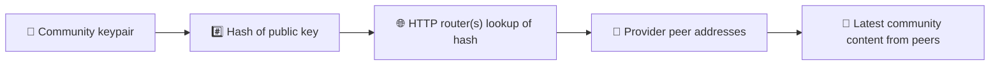
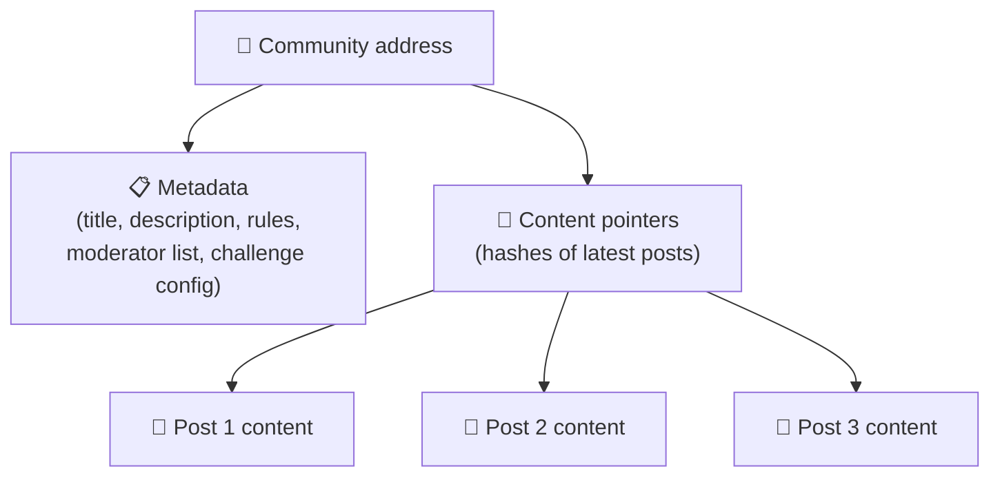
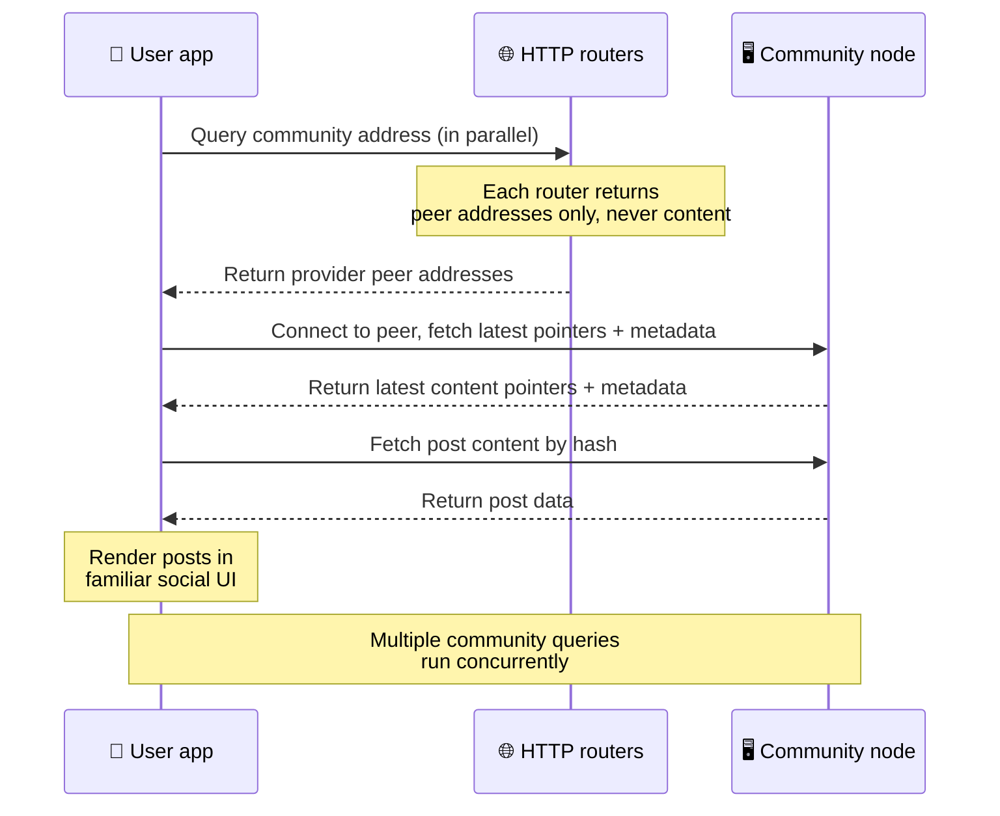
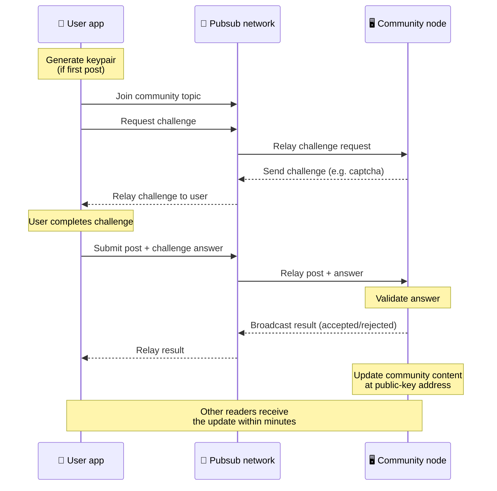
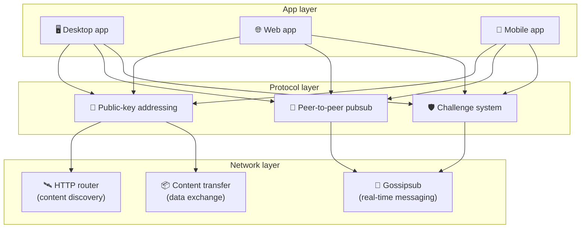

# Peer-to-peer-protokoll

Bitsocial använder varken blockkedja, federationsserver eller centraliserad backend. I stället
används IPFS/libp2p-stacken för att kombinera två idéer: **adressering baserad på publika nycklar**
och **peer-to-peer-pubsub**. Tillsammans gör de att vem som helst kan driva en community på vanlig
konsumenthårdvara, medan användarna läser och publicerar utan konton hos någon företagsstyrd tjänst.

För en mindre teknisk genomgång, läs
[En komplett lekmannaförklaring av Bitsocial-protokollet](./layman-protocol-explanation.md).

## Använder Bitsocial IPFS?

Ja. Bitsocial-noder använder primitiver från IPFS/libp2p för peer-to-peer-lagret: community-poster
adresserade med publik nyckel, innehållsöverföring mellan peers och gossipsub-pubsub för meddelanden
i realtid. När den här dokumentationen säger "pubsub" avses IPFS/libp2p-pubsub, inte en separat
centraliserad meddelandemäklare.

Protokollet beskriver för närvarande upptäckt via HTTP-routrar, eftersom Bitsocial-klienter frågar
routrarnas endpoints efter leverantörers peer-adresser i stället för att förlita sig på en
webbläsarfientlig DHT vid varje uppslagning. Routrarna returnerar bara peers; innehållsöverföring
och pubsub-trafik går fortfarande genom peer-to-peer-nätverket.

## De två problemen

Ett decentraliserat socialt nätverk måste besvara två frågor:

1. **Data** — hur lagrar och levererar man världens sociala innehåll utan en central databas?
2. **Spam** — hur förhindrar man missbruk samtidigt som nätverket förblir gratis att använda?

Bitsocial löser dataproblemet genom att helt hoppa över blockkedjan: sociala medier behöver varken
global transaktionsordning eller permanent tillgänglighet för varje gammalt inlägg. Spamproblemet
löses genom att varje community kör sin egen anti-spam-utmaning över peer-to-peer-nätverket.

För upptäcktsmodellen ovanför det här nätverkslagret, se [Innehållsupptäckt](./content-discovery.md).

---

## Adressering baserad på publik nyckel {#public-key-based-addressing}

I BitTorrent blir en fils hash dess adress (_innehållsbaserad adressering_). Bitsocial använder en
liknande idé med publika nycklar: hashen av en communitys publika nyckel blir dess nätverksadress.

Vilken peer som helst i nätverket kan fråga en **HTTP-router** efter den adressen: routern svarar med
en lista över nätverksadresser till de peers som just nu tillhandahåller communityns hash, och
klienten ansluter direkt till dessa peers för att hämta communityns senaste tillstånd. Varje gång
innehållet uppdateras ökar dess versionsnummer. Nätverket behåller bara den senaste versionen — det
finns inget behov av att bevara varje historiskt tillstånd, och det är det som gör metoden lättviktig
jämfört med en blockkedja.

> **Vad en HTTP-router faktiskt innehåller.** En HTTP-router är ett tunt index. För varje
> innehållsadress den känner till lagrar den bara nätverksadresserna till de peers som anmält sig som
> leverantörer (IP/port-par, libp2p-multiadresser och liknande). Den lagrar **inte** communityns
> innehåll, dess metadata, inläggstexter, medlemslistor eller ens den läsbara etiketten för vad som
> finns på adressen; den svarar bara på frågan "vilka peers påstår sig ha den här hashen?". Det gör
> routrar billiga att driva, enkla att byta ut och inte ansvariga för vad användarna publicerar,
> ungefär som en BitTorrent-tracker men utan torrent-metadata: en tracker mappar infohashar till
> peers, medan en HTTP-router bara mappar en innehållsadress till leverantörers peer-adresser.
>
> För redundans frågar klienten **flera HTTP-routrar parallellt** och slår ihop de leverantörslistor
> den får tillbaka. Vem som helst kan driva en router, och att byta ut eller lägga till routrar är en
> konfigurationsändring utan datamigrering.
>
> Bitsocial använder HTTP-routrar i stället för en DHT eftersom det är dyrt att driva en DHT i den
> skala som innehållsupptäckt kräver, särskilt på mobil. En DHT fungerar dessutom inte i webbläsaren,
> eftersom webbläsare inte kan ansluta direkt till en libp2p-DHT. En HTTP-router körs billigt på
> vanlig HTTP-infrastruktur och fungerar lika bra från en telefon som från en webbläsare.

### Vad som lagras på adressen

Community-adressen innehåller inte hela inläggsinnehållet direkt. I stället lagrar den en lista med
innehållsidentifierare — hashar som pekar på de faktiska datan. Klienten hämtar sedan varje
innehållsdel direkt från de peers som HTTP-routrarna returnerade. Routrarna själva ser aldrig
innehållet och lagrar det aldrig.

Minst en peer har alltid datan: community-operatörens nod. Om communityn är populär kommer många
andra peers också att ha den, och belastningen fördelar sig av sig själv — på samma sätt som populära
torrents går snabbare att ladda ner.

---

## Peer-to-peer-pubsub

Pubsub (publish-subscribe) är ett meddelandemönster där peers prenumererar på ett ämne och tar emot
varje meddelande som publiceras till det ämnet. Bitsocial använder ett peer-to-peer-pubsub-nätverk —
vem som helst kan publicera, vem som helst kan prenumerera, och det finns ingen central
meddelandemäklare.

För att publicera ett inlägg i en community publicerar användaren ett meddelande vars ämne är
communityns publika nyckel. Community-operatörens nod plockar upp det, validerar det och — om det
klarar anti-spam-utmaningen — tar med det i nästa innehållsuppdatering.

---

## Anti-spam: utmaningar över pubsub

Ett öppet pubsub-nätverk är sårbart för spamfloder. Bitsocial löser det genom att kräva att den som
publicerar först klarar en **utmaning** innan innehållet accepteras.

Utmaningssystemet är flexibelt: varje community-operatör konfigurerar sin egen policy. Alternativen
omfattar:

| Utmaningstyp            | Så fungerar det                                     |
| ----------------------- | --------------------------------------------------- |
| **Captcha**             | Visuellt eller interaktivt pussel som visas i appen |
| **Frekvensbegränsning** | Begränsa antal inlägg per tidsfönster och identitet |
| **Tokenkrav**           | Kräv bevis på innehav av en viss token              |
| **Betalning**           | Kräv en liten betalning per inlägg                  |
| **Tillåtelselista**     | Endast förhandsgodkända identiteter får publicera   |
| **Egen kod**            | Vilken policy som helst som går att uttrycka i kod  |

Peers som vidarebefordrar för många misslyckade utmaningsförsök blockeras från pubsub-ämnet, vilket
förhindrar överbelastningsattacker mot nätverkslagret.

---

## Livscykel: läsa en community

Så här går det till när en användare öppnar appen och tittar på en communitys senaste inlägg.

**Steg för steg:**

1. Användaren öppnar appen och ser ett socialt gränssnitt.
2. Klienten frågar flera HTTP-routrar parallellt för varje community som användaren följer; varje
   router returnerar bara peer-adresser, aldrig innehåll. Svarstiden beror på nätverksförhållanden
   och routerbelastning; under typiska förhållanden med låg latens svarar frågorna ofta inom ungefär
   en sekund, och de körs samtidigt.
3. När klienten har peer-adresserna ansluter den till dessa peers och hämtar communityns senaste
   innehållspekare och metadata (titel, beskrivning, moderatorlista, utmaningskonfiguration).
4. Klienten hämtar det faktiska inläggsinnehållet med hjälp av pekarna och renderar sedan allt i ett
   välbekant socialt gränssnitt.

---

## Livscykel: publicera ett inlägg

Publicering innebär en utmaning-svar-handskakning över pubsub innan inlägget accepteras.

**Steg för steg:**

1. Appen genererar ett nyckelpar åt användaren om hen inte redan har ett.
2. Användaren skriver ett inlägg till en community.
3. Klienten ansluter till pubsub-ämnet för den communityn (kopplat till communityns publika nyckel).
4. Klienten begär en utmaning över pubsub.
5. Community-operatörens nod skickar tillbaka en utmaning (till exempel en captcha).
6. Användaren löser utmaningen.
7. Klienten skickar inlägget tillsammans med utmaningssvaret över pubsub.
8. Community-operatörens nod validerar svaret. Om det stämmer accepteras inlägget.
9. Noden sänder ut resultatet över pubsub så att nätverkets peers vet att de ska fortsätta
   vidarebefordra meddelanden från den här användaren.
10. Noden uppdaterar communityns innehåll på dess publika nyckeladress.
11. Inom några minuter har alla läsare av communityn fått uppdateringen.

---

## Arkitekturöversikt

Hela systemet består av tre lager som samverkar:

| Lager         | Roll                                                                                                                                                   |
| ------------- | ------------------------------------------------------------------------------------------------------------------------------------------------------ |
| **App**       | Användargränssnittet. Det kan finnas flera appar, var och en med sin egen design, som alla delar samma communityer och identiteter.                    |
| **Protokoll** | Definierar hur communityer adresseras, hur inlägg publiceras och hur spam förhindras.                                                                  |
| **Nätverk**   | Den underliggande peer-to-peer-infrastrukturen: HTTP-routrar för upptäckt, gossipsub för meddelanden i realtid och innehållsöverföring för datautbyte. |

---

## Integritet: att koppla loss författare från IP-adresser

När en användare publicerar ett inlägg **krypteras innehållet med community-operatörens publika
nyckel** innan det går in i pubsub-nätverket. Det betyder att nätverksobservatörer visserligen kan se
att en peer publicerade _något_, men inte kan avgöra:

- vad innehållet säger
- vilken författaridentitet som publicerade det

Det liknar hur BitTorrent gör det möjligt att se vilka IP-adresser som seedar en torrent, men inte
vem som ursprungligen skapade den. Krypteringslagret lägger till ytterligare en integritetsgaranti
ovanpå den utgångspunkten.

---

## Peer-to-peer i webbläsaren

P2P i webbläsaren är numera möjligt i Bitsocial-klienter. En webbläsarapp kan köra en
[Helia](https://helia.io/)-nod, använda samma klientstack för Bitsocial-protokollet som andra appar
och hämta innehåll från peers i stället för att be en centraliserad IPFS-gateway att leverera det.
Webbläsaren kan också delta i pubsub direkt, så publicering behöver ingen plattformsägd
pubsub-leverantör i det normala flödet.

Det här är den viktiga milstolpen för webbdistribution: en vanlig HTTPS-webbplats kan öppnas som en
levande social P2P-klient. Användare behöver inte installera en skrivbordsapp för att kunna läsa från
nätverket, och appoperatören behöver inte driva en central gateway som blir censur- eller
modereringsflaskhalsen för varje webbläsaranvändare.

Webbläsarvägen har andra begränsningar än en skrivbords- eller servernod:

- en webbläsarnod kan normalt inte ta emot godtyckliga inkommande anslutningar från det öppna
  internet
- den kan ladda, validera, cacha och publicera data så länge appen är öppen
- den bör inte betraktas som långlivad värd för en communitys data
- fullständig community-hosting sköts fortfarande bäst av en skrivbordsapp, `bitsocial-cli` eller en
  annan nod som alltid är igång

HTTP-routrar har fortfarande betydelse för innehållsupptäckt: de returnerar leverantörsadresser för
en community-hash. De är inte IPFS-gateways, eftersom de inte levererar själva innehållet. Efter
upptäckten ansluter webbläsarklienten till peers och hämtar datan via P2P-stacken.

P2P i webbläsaren är numera standardvägen på webben, inte ett experiment bakom en inställning. 5chan
kör ren webbläsar-P2P som standard på 5chan.app, och Bitsocial-bloggen på bitsocial.net gör samma
sak. Webbläsarens peers kopplar upp sig över säkra WebSockets; `pkc-js` nekar som standard
uppkopplingar via WebRTC och WebTransport, eftersom deras sätt att upprätta anslutningar är långsamt
och opålitligt i webbläsaren. Den uppströmsändring som gjorde publicering från webbläsaren praktiskt
användbar under 2026 var korrigeringen av gossipsubs sekvensnummer i `@libp2p/gossipsub` 15.0.21, som
fick Kubo-peers att sluta kasta meddelanden publicerade av JavaScript-noder.

För hela bilden, inklusive vad en webbläsarnod fortfarande inte klarar, se
[Peer-to-peer i webbläsaren](/browser-p2p/).

## Gateway som reservväg {#gateway-fallback}

Webbläsaråtkomst via gateway är fortfarande användbar som reservväg för kompatibilitet och
utrullning. En gateway kan vidarebefordra data mellan P2P-nätverket och en webbläsarklient när
webbläsaren inte kan ansluta direkt till nätverket, eller när appen medvetet väljer den äldre vägen.
Dessa gateways:

- kan drivas av vem som helst
- kräver varken användarkonton eller betalningar
- får ingen kontroll över användaridentiteter eller communityer
- kan bytas ut utan att data går förlorade

Målarkitekturen är P2P i webbläsaren först, med gateways som ett valfritt reservalternativ i stället
för standardflaskhalsen.

---

## Varför inte en blockkedja?

Blockkedjor löser problemet med dubbelspendering: de måste känna till den exakta ordningen för varje
transaktion för att hindra någon från att spendera samma mynt två gånger.

Sociala medier har inget dubbelspenderingsproblem. Det spelar ingen roll om inlägg A publicerades en
millisekund före inlägg B, och gamla inlägg behöver inte vara permanent tillgängliga på varje nod.

Genom att hoppa över blockkedjan slipper Bitsocial:

- **gasavgifter** — det är gratis att publicera
- **genomströmningsgränser** — ingen flaskhals i blockstorlek eller blocktid
- **lagringssvällning** — noder behåller bara det de behöver
- **konsensusoverhead** — inga miners, validatorer eller staking krävs

Avvägningen är att Bitsocial inte garanterar permanent tillgänglighet för gammalt innehåll. Men för
sociala medier är det en acceptabel avvägning: community-operatörens nod håller datan, populärt
innehåll sprids över många peers och mycket gamla inlägg tonar naturligt bort — precis som de gör på
alla andra sociala plattformar.

## Varför inte federation?

Federerade nätverk (som e-post eller ActivityPub-baserade plattformar) är ett steg upp från
centralisering, men har fortfarande strukturella begränsningar:

- **Serverberoende** — varje community behöver en server med domän, TLS och löpande
  underhåll
- **Förtroende för administratören** — serveradministratören har full kontroll över användarkonton
  och innehåll
- **Fragmentering** — att flytta mellan servrar innebär ofta att man förlorar följare, historik eller
  identitet
- **Kostnad** — någon måste betala för driften, vilket skapar tryck mot konsolidering

Bitsocials peer-to-peer-modell tar bort servern ur ekvationen helt. En community-nod kan köras på en
bärbar dator, en Raspberry Pi eller en billig VPS. Operatören bestämmer modereringspolicyn men kan
inte beslagta användaridentiteter, eftersom identiteter styrs av nyckelpar och inte delas ut av en
server.

## Hur är det med Nostr?

Nostr passar inte prydligt in i någon av kategorierna. Det är inte federation i ActivityPub-stil,
eftersom användare inte tilldelas konton av instanser och identiteten inte är knuten till en enskild
server. Det är inte heller blockkedjebaserade sociala medier, eftersom det varken finns kedja,
konsensus, gas eller global transaktionsordning.

Nostr beskrivs bättre som **reläbaserade sociala medier**. I basprotokollet
([NIP-01](https://github.com/nostr-protocol/nips/blob/master/01.md)) håller användarna nyckelpar,
signerar händelser och publicerar dessa händelser till WebSocket-reläer. Klienter prenumererar på
reläer med filter, hämtar matchande händelser och verifierar signaturer lokalt. Användare kan också
publicera metadata med relälistor
([NIP-65](https://github.com/nostr-protocol/nips/blob/master/65.md)) som talar om för klienterna
vilka reläer de normalt skriver till och vilka reläer de föredrar när de läser omnämnanden.

Det placerar Nostr närmare Bitsocial än federerade eller blockkedjebaserade system på en viktig
punkt: identiteten är kryptografisk och portabel. Den stora skillnaden ligger i datalagret. I Nostr
är reläerna det normala lagrings- och leveranslagret. I Bitsocial hjälper HTTP-routrarna bara
klienterna att hitta peers. Routrarna lagrar varken inlägg, profiler, community-metadata eller
modereringstillstånd; de returnerar leverantörers peer-adresser, och sedan hämtar klienterna
innehållet från peers.

Communityer visar samma uppdelning. Nostr har valfria mönster för
[reläbaserade grupper](https://github.com/nostr-protocol/nips/blob/master/29.md) och
[moderatorgodkända communityer](https://github.com/nostr-protocol/nips/blob/master/72.md), men de är
fortfarande beroende av reläets policy, gruppdata som ligger hos reläet eller klientens val av vilka
godkännanden som ska respekteras. Bitsocial behandlar communityer som förstklassiga kryptografiska
objekt vars operatörsnod validerar inlägg, kör communityns utmaningspolicy och publicerar det senaste
accepterade tillståndet till peer-to-peer-nätverket.

| Fråga                  | Nostr                                                                                         | Bitsocial                                                              |
| ---------------------- | --------------------------------------------------------------------------------------------- | ---------------------------------------------------------------------- |
| Kategori               | Reläbaserat protokoll                                                                         | Peer-to-peer-nätverk av communityer                                    |
| Identitet              | Användarens publika nyckel                                                                    | Nyckelpar för användare och communityer                                |
| Dataväg                | Signerade händelser publiceras till reläer                                                    | Publik nyckeladress löses upp till peers; innehållet hämtas från peers |
| Vem håller det uppe    | Reläer som användare och klienter väljer                                                      | Communityns ägarnod plus hjälpande seeders                             |
| Communityer            | Valfria reläbaserade grupper eller moderatorgodkända communityer                              | Förstklassiga community-objekt med operatörsstyrd moderering           |
| Anti-spam              | Reläpolicy, autentisering, betalning, proof-of-work, klientfilter eller moderatorgodkännanden | Communitydefinierad utmaningslogik före inkludering                    |
| Viktigaste avvägningen | Portabel identitet, men tillgänglighet och policy beror på reläer                             | Mindre reläberoende, men gammalt innehåll garanteras inte för alltid   |

---

## Sammanfattning

Bitsocial bygger på två primitiver: adressering baserad på publika nycklar för innehållsupptäckt, och
peer-to-peer-pubsub för kommunikation i realtid. Tillsammans skapar de ett socialt nätverk där:

- communityer identifieras av kryptografiska nycklar, inte av domännamn
- innehåll sprids mellan peers som en torrent i stället för att levereras från en enda databas
- spamskyddet är lokalt för varje community och inte påtvingat av en plattform
- användare äger sina identiteter genom nyckelpar, inte genom konton som kan återkallas
- hela systemet fungerar utan servrar, blockkedjor eller plattformsavgifter
