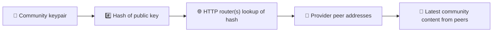
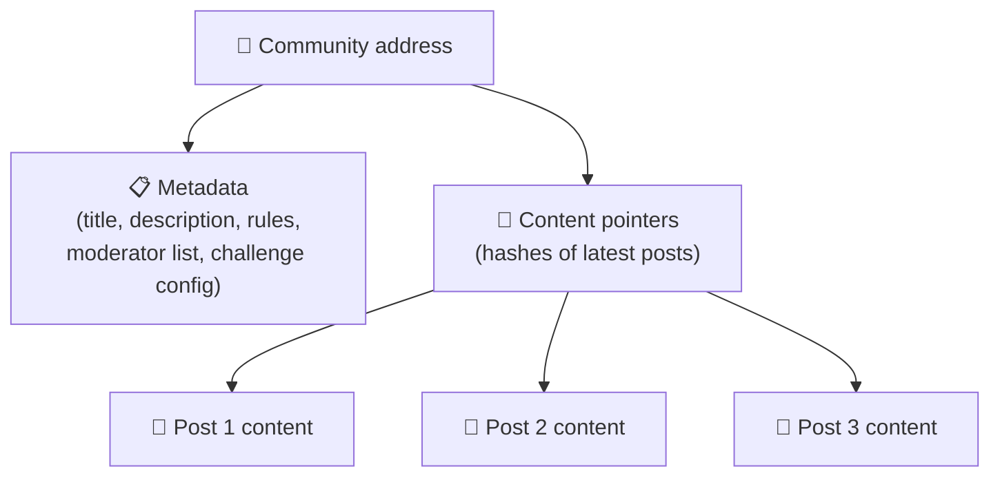
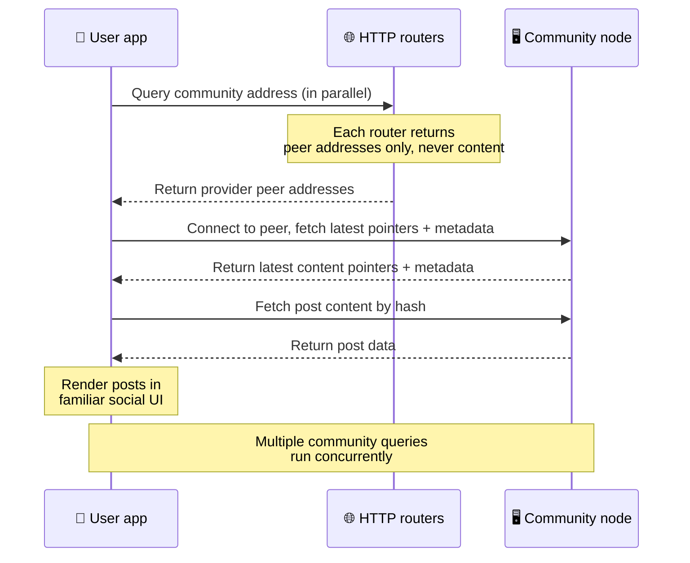
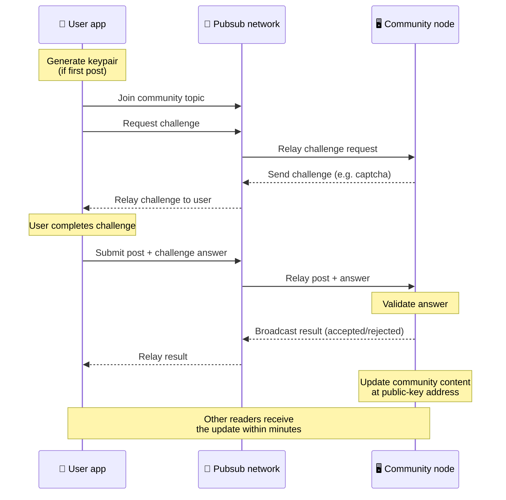
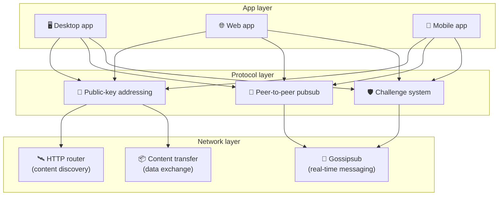

# పీర్-టు-పీర్ ప్రోటోకాల్

Bitsocial బ్లాక్‌చెయిన్‌ను, ఫెడరేషన్ సర్వర్‌ను లేదా కేంద్రీకృత బ్యాకెండ్‌ను ఉపయోగించదు. బదులుగా ఇది
IPFS/libp2p స్టాక్‌తో రెండు ఆలోచనలను కలుపుతుంది: **పబ్లిక్-కీ ఆధారిత చిరునామా** మరియు
**పీర్-టు-పీర్ pubsub**. ఈ రెండూ కలిసి, సాధారణ కన్స్యూమర్ హార్డ్‌వేర్ నుండే ఎవరైనా ఒక కమ్యూనిటీని
హోస్ట్ చేయగలిగేలా చేస్తాయి; అదే సమయంలో వినియోగదారులు ఏ కంపెనీ నియంత్రణలోని సేవలోనూ ఖాతాలు
లేకుండానే చదవగలరు, పోస్ట్ చేయగలరు.

తక్కువ సాంకేతికమైన వివరణ కోసం
[Bitsocial ప్రోటోకాల్ గురించి పూర్తి సామాన్య వివరణ](./layman-protocol-explanation.md) చదవండి.

## Bitsocial IPFSను ఉపయోగిస్తుందా?

అవును. పీర్-టు-పీర్ లేయర్ కోసం Bitsocial నోడ్‌లు IPFS/libp2p ప్రిమిటివ్‌లను ఉపయోగిస్తాయి:
పబ్లిక్-కీతో చిరునామా ఇవ్వబడిన కమ్యూనిటీ రికార్డులు, పీర్‌ల మధ్య కంటెంట్ బదిలీ, రియల్-టైమ్
సందేశాల కోసం gossipsub pubsub. ఈ డాక్యుమెంట్‌లలో "pubsub" అని చెప్పినప్పుడు దాని అర్థం
IPFS/libp2p pubsub; అది వేరే ఏ కేంద్రీకృత మెసేజ్ బ్రోకర్ కాదు.

ప్రస్తుతం ప్రోటోకాల్ ఆవిష్కరణను HTTP రౌటర్‌ల ద్వారా వివరిస్తుంది, ఎందుకంటే ప్రతి లుకప్‌కూ
బ్రౌజర్‌కు అనుకూలంగా లేని DHTపై ఆధారపడకుండా, ప్రొవైడర్ పీర్ చిరునామాల కోసం Bitsocial క్లయింట్‌లు
రౌటర్ ఎండ్‌పాయింట్‌లను ప్రశ్నిస్తాయి. రౌటర్‌లు పీర్‌లను మాత్రమే తిరిగి ఇస్తాయి; కంటెంట్ బదిలీ,
pubsub ట్రాఫిక్ ఇప్పటికీ పీర్-టు-పీర్ నెట్‌వర్క్ ద్వారానే కదులుతాయి.

## రెండు సమస్యలు

వికేంద్రీకృత సోషల్ నెట్‌వర్క్ రెండు ప్రశ్నలకు సమాధానం చెప్పాలి:

1. **డేటా** — కేంద్ర డేటాబేస్ లేకుండా ప్రపంచపు సోషల్ కంటెంట్‌ను ఎలా నిల్వ చేసి అందిస్తారు?
2. **స్పామ్** — నెట్‌వర్క్‌ను ఉచితంగా ఉంచుతూనే దుర్వినియోగాన్ని ఎలా అడ్డుకుంటారు?

బ్లాక్‌చెయిన్‌ను పూర్తిగా వదిలేయడం ద్వారా Bitsocial డేటా సమస్యను పరిష్కరిస్తుంది: సోషల్ మీడియాకు
గ్లోబల్ ట్రాన్సాక్షన్ క్రమం గానీ, ప్రతి పాత పోస్ట్ శాశ్వతంగా అందుబాటులో ఉండటం గానీ అవసరం లేదు.
ప్రతి కమ్యూనిటీ తన సొంత యాంటీ-స్పామ్ ఛాలెంజ్‌ను పీర్-టు-పీర్ నెట్‌వర్క్‌పై నడుపుకొనేలా చేయడం
ద్వారా ఇది స్పామ్ సమస్యను పరిష్కరిస్తుంది.

ఈ నెట్‌వర్క్ లేయర్‌కు పైన ఉండే ఆవిష్కరణ మోడల్ కోసం [కంటెంట్ ఆవిష్కరణ](./content-discovery.md) చూడండి.

---

## పబ్లిక్-కీ ఆధారిత చిరునామా {#public-key-based-addressing}

BitTorrentలో ఒక ఫైల్ హాష్ దాని చిరునామాగా మారుతుంది (_కంటెంట్ ఆధారిత చిరునామా_). Bitsocial
పబ్లిక్ కీలతో అలాంటి ఆలోచననే ఉపయోగిస్తుంది: ఒక కమ్యూనిటీ పబ్లిక్ కీ హాష్ దాని నెట్‌వర్క్
చిరునామాగా మారుతుంది.

ఆ చిరునామా కోసం నెట్‌వర్క్‌లోని ఏ పీర్ అయినా ఒక **HTTP రౌటర్**ను ప్రశ్నించవచ్చు: ఆ కమ్యూనిటీ
హాష్‌ను ప్రస్తుతం అందిస్తున్న పీర్‌ల నెట్‌వర్క్ చిరునామాల జాబితాను రౌటర్ తిరిగి ఇస్తుంది, ఆపై
క్లయింట్ నేరుగా ఆ పీర్‌లకు కనెక్ట్ అయి కమ్యూనిటీ తాజా స్థితిని తెచ్చుకుంటుంది. కంటెంట్ అప్‌డేట్
అయిన ప్రతిసారీ దాని వెర్షన్ నంబర్ పెరుగుతుంది. నెట్‌వర్క్ తాజా వెర్షన్‌ను మాత్రమే ఉంచుతుంది —
ప్రతి పాత స్థితినీ కాపాడాల్సిన అవసరం లేదు, ఇదే ఈ విధానాన్ని బ్లాక్‌చెయిన్‌తో పోలిస్తే
తేలికపాటిదిగా చేస్తుంది.

> **HTTP రౌటర్ నిజానికి ఏమి కలిగి ఉంటుంది.** HTTP రౌటర్ అనేది ఒక పలుచని ఇండెక్స్. తనకు తెలిసిన
> ప్రతి కంటెంట్ చిరునామా కోసం, ఆ కంటెంట్‌ను తాము అందిస్తున్నామని ప్రకటించుకున్న పీర్‌ల నెట్‌వర్క్
> చిరునామాలను మాత్రమే (IP/పోర్ట్ జతలు, libp2p multiaddrs, ఆ తరహా సమాచారం) అది నిల్వ చేస్తుంది.
> కమ్యూనిటీ కంటెంట్‌ను, దాని మెటాడేటాను, పోస్ట్ టెక్స్ట్‌ను, సభ్యుల జాబితాను, చివరికి ఆ
> చిరునామాలో ఏముందో చెప్పే మనుషులు చదవగల లేబుల్‌ను కూడా అది **నిల్వ చేయదు**; "ఈ హాష్ తమ దగ్గర
> ఉందని ఏ పీర్‌లు చెబుతున్నాయి?" అనే ప్రశ్నకు మాత్రమే అది సమాధానం ఇస్తుంది. దీనివల్ల రౌటర్‌లను
> నడపడం చౌక, వాటిని మార్చడం సులభం, వినియోగదారులు ప్రచురించే వాటికి అవి బాధ్యులు కావు — ఇది
> BitTorrent ట్రాకర్‌ను పోలి ఉంటుంది, కానీ టొరెంట్ మెటాడేటా లేకుండా: ట్రాకర్ ఇన్‌ఫోహాష్‌లను
> పీర్‌లకు మ్యాప్ చేస్తుంది, HTTP రౌటర్ మాత్రం ఒక కంటెంట్ చిరునామాను ప్రొవైడర్ పీర్ చిరునామాలకు
> మాత్రమే మ్యాప్ చేస్తుంది.
>
> అదనపు భద్రత కోసం క్లయింట్ **అనేక HTTP రౌటర్‌లను సమాంతరంగా** ప్రశ్నించి, తిరిగి వచ్చిన ప్రొవైడర్
> జాబితాలను కలుపుతుంది. రౌటర్‌ను ఎవరైనా నడపవచ్చు, రౌటర్‌లను మార్చడం లేదా కొత్తవి చేర్చడం అనేది
> డేటా మైగ్రేషన్ అవసరం లేని కాన్ఫిగ్ మార్పు మాత్రమే.
>
> DHTకి బదులుగా Bitsocial HTTP రౌటర్‌లను ఉపయోగిస్తుంది, ఎందుకంటే కంటెంట్ ఆవిష్కరణకు అవసరమైన
> స్థాయిలో DHTని నడపడం ఖరీదైనది, ముఖ్యంగా మొబైల్‌లో. అంతేకాక DHT బ్రౌజర్‌లో పనిచేయదు, ఎందుకంటే
> బ్రౌజర్‌లు libp2p DHTలో నేరుగా చేరలేవు. HTTP రౌటర్ సాధారణ HTTP మౌలిక సదుపాయాలపై చౌకగా నడుస్తుంది,
> ఫోన్ నుండి అయినా బ్రౌజర్ నుండి అయినా సమానంగా పనిచేస్తుంది.

### చిరునామా వద్ద ఏమి నిల్వ అవుతుంది

కమ్యూనిటీ చిరునామాలో పూర్తి పోస్ట్ కంటెంట్ నేరుగా ఉండదు. బదులుగా అందులో కంటెంట్ ఐడెంటిఫైయర్‌ల
జాబితా — అసలు డేటాను సూచించే హాష్‌లు — నిల్వ అవుతాయి. ఆ తర్వాత క్లయింట్ ప్రతి కంటెంట్ ముక్కనూ
HTTP రౌటర్‌లు తిరిగి ఇచ్చిన పీర్‌ల నుండి నేరుగా తెచ్చుకుంటుంది. రౌటర్‌లు మాత్రం కంటెంట్‌ను
ఎప్పుడూ చూడవు, నిల్వ చేయవు.

కనీసం ఒక పీర్ దగ్గర ఎప్పుడూ డేటా ఉంటుంది: కమ్యూనిటీ ఆపరేటర్ నోడ్. కమ్యూనిటీ ప్రాచుర్యం పొందితే
ఇంకా అనేక పీర్‌ల దగ్గర కూడా అది ఉంటుంది, భారం దానంతట అదే పంచుకుంటుంది — ప్రాచుర్యం పొందిన
టొరెంట్‌లు వేగంగా డౌన్‌లోడ్ అయినట్టే.

---

## పీర్-టు-పీర్ pubsub

Pubsub (publish-subscribe) అనేది ఒక మెసేజింగ్ నమూనా: పీర్‌లు ఒక టాపిక్‌కు సబ్‌స్క్రైబ్ అవుతాయి,
ఆ టాపిక్‌లో ప్రచురితమైన ప్రతి సందేశాన్నీ అందుకుంటాయి. Bitsocial పీర్-టు-పీర్ pubsub
నెట్‌వర్క్‌ను ఉపయోగిస్తుంది — ఎవరైనా ప్రచురించవచ్చు, ఎవరైనా సబ్‌స్క్రైబ్ కావచ్చు, కేంద్ర మెసేజ్
బ్రోకర్ అంటూ ఏదీ ఉండదు.

ఒక కమ్యూనిటీకి పోస్ట్ ప్రచురించాలంటే, వినియోగదారు ఆ కమ్యూనిటీ పబ్లిక్ కీనే టాపిక్‌గా కలిగిన
సందేశాన్ని ప్రచురిస్తారు. కమ్యూనిటీ ఆపరేటర్ నోడ్ దాన్ని అందుకుని, ధ్రువీకరించి — యాంటీ-స్పామ్
ఛాలెంజ్‌లో నెగ్గితే — తదుపరి కంటెంట్ అప్‌డేట్‌లో దాన్ని చేరుస్తుంది.

---

## యాంటీ-స్పామ్: pubsub ద్వారా ఛాలెంజ్‌లు

బహిరంగ pubsub నెట్‌వర్క్ స్పామ్ వరదలకు గురయ్యే ప్రమాదం ఉంది. కంటెంట్ ఆమోదించబడటానికి ముందు
ప్రచురణకర్తలు ఒక **ఛాలెంజ్**ను పూర్తి చేయాలని నిబంధన పెట్టడం ద్వారా Bitsocial దీన్ని
పరిష్కరిస్తుంది.

ఛాలెంజ్ వ్యవస్థ సరళమైనది: ప్రతి కమ్యూనిటీ ఆపరేటర్ తన సొంత విధానాన్ని కాన్ఫిగర్ చేసుకుంటారు.
ఎంపికలు:

| ఛాలెంజ్ రకం        | ఇది ఎలా పనిచేస్తుంది                                          |
| ------------------ | ------------------------------------------------------------- |
| **క్యాప్చా**       | యాప్‌లో చూపే దృశ్య లేదా ఇంటరాక్టివ్ పజిల్                     |
| **రేట్ లిమిటింగ్** | ఒక్కో గుర్తింపుకు, ఒక్కో సమయ విండోలో పోస్ట్‌లను పరిమితం చేయడం |
| **టోకెన్ గేట్**    | ఒక నిర్దిష్ట టోకెన్ నిల్వకు రుజువును కోరడం                    |
| **చెల్లింపు**      | ఒక్కో పోస్ట్‌కు చిన్న చెల్లింపును కోరడం                       |
| **అలౌలిస్ట్**      | ముందుగా ఆమోదించిన గుర్తింపులు మాత్రమే పోస్ట్ చేయగలవు          |
| **కస్టమ్ కోడ్**    | కోడ్‌లో వ్యక్తీకరించగల ఏ విధానమైనా                            |

విఫలమైన ఛాలెంజ్ ప్రయత్నాలను మరీ ఎక్కువగా రిలే చేసే పీర్‌లు pubsub టాపిక్ నుండి బ్లాక్
చేయబడతాయి; ఇది నెట్‌వర్క్ లేయర్‌పై డినైయల్-ఆఫ్-సర్వీస్ దాడులను నివారిస్తుంది.

---

## జీవితచక్రం: ఒక కమ్యూనిటీని చదవడం

ఒక వినియోగదారు యాప్‌ను తెరిచి ఒక కమ్యూనిటీ తాజా పోస్ట్‌లను చూసినప్పుడు జరిగేది ఇది.

**దశలవారీగా:**

1. వినియోగదారు యాప్‌ను తెరిచి సోషల్ ఇంటర్‌ఫేస్‌ను చూస్తారు.
2. వినియోగదారు అనుసరించే ప్రతి కమ్యూనిటీ కోసం క్లయింట్ అనేక HTTP రౌటర్‌లను సమాంతరంగా ప్రశ్నిస్తుంది;
   ప్రతి రౌటర్ పీర్ చిరునామాలను మాత్రమే తిరిగి ఇస్తుంది, కంటెంట్‌ను ఎప్పుడూ ఇవ్వదు. ప్రశ్నల ఆలస్యం
   నెట్‌వర్క్ పరిస్థితులపై, రౌటర్ భారంపై ఆధారపడి ఉంటుంది; సాధారణ తక్కువ-ఆలస్య పరిస్థితుల్లో
   ప్రశ్నలు తరచుగా సుమారు ఒక సెకనులోపు ఫలితం ఇస్తాయి, అవి ఏకకాలంలో నడుస్తాయి.
3. క్లయింట్‌కు పీర్ చిరునామాలు దొరికాక, అది ఆ పీర్‌లకు కనెక్ట్ అయి కమ్యూనిటీ తాజా కంటెంట్
   పాయింటర్‌లను, మెటాడేటాను (శీర్షిక, వివరణ, మోడరేటర్ జాబితా, ఛాలెంజ్ కాన్ఫిగరేషన్)
   తెచ్చుకుంటుంది.
4. ఆ పాయింటర్‌లను ఉపయోగించి క్లయింట్ అసలు పోస్ట్ కంటెంట్‌ను తెచ్చుకుని, అన్నిటినీ సుపరిచితమైన
   సోషల్ ఇంటర్‌ఫేస్‌లో రెండర్ చేస్తుంది.

---

## జీవితచక్రం: ఒక పోస్ట్‌ను ప్రచురించడం

పోస్ట్ ఆమోదించబడటానికి ముందు, ప్రచురణలో pubsub ద్వారా ఛాలెంజ్-రెస్పాన్స్ హ్యాండ్‌షేక్ జరుగుతుంది.

**దశలవారీగా:**

1. వినియోగదారుకు ఇంకా కీ జత లేకపోతే యాప్ ఒకదాన్ని రూపొందిస్తుంది.
2. వినియోగదారు ఒక కమ్యూనిటీ కోసం పోస్ట్ రాస్తారు.
3. క్లయింట్ ఆ కమ్యూనిటీ pubsub టాపిక్‌లో చేరుతుంది (ఇది కమ్యూనిటీ పబ్లిక్ కీకి ముడిపడి ఉంటుంది).
4. క్లయింట్ pubsub ద్వారా ఒక ఛాలెంజ్‌ను అభ్యర్థిస్తుంది.
5. కమ్యూనిటీ ఆపరేటర్ నోడ్ ఒక ఛాలెంజ్‌ను (ఉదాహరణకు ఒక క్యాప్చా) తిరిగి పంపుతుంది.
6. వినియోగదారు ఛాలెంజ్‌ను పూర్తి చేస్తారు.
7. క్లయింట్ ఛాలెంజ్ సమాధానంతో పాటు పోస్ట్‌ను pubsub ద్వారా సమర్పిస్తుంది.
8. కమ్యూనిటీ ఆపరేటర్ నోడ్ సమాధానాన్ని ధ్రువీకరిస్తుంది. సరైనదైతే పోస్ట్ ఆమోదించబడుతుంది.
9. నోడ్ ఫలితాన్ని pubsub ద్వారా ప్రసారం చేస్తుంది, తద్వారా ఈ వినియోగదారు సందేశాలను రిలే చేయడం
   కొనసాగించాలని నెట్‌వర్క్ పీర్‌లకు తెలుస్తుంది.
10. నోడ్ కమ్యూనిటీ కంటెంట్‌ను దాని పబ్లిక్-కీ చిరునామా వద్ద అప్‌డేట్ చేస్తుంది.
11. కొన్ని నిమిషాల్లోనే ఆ కమ్యూనిటీలోని ప్రతి పాఠకుడికీ అప్‌డేట్ చేరుతుంది.

---

## ఆర్కిటెక్చర్ అవలోకనం

పూర్తి వ్యవస్థలో కలిసి పనిచేసే మూడు లేయర్‌లు ఉంటాయి:

| లేయర్          | పాత్ర                                                                                                                                      |
| -------------- | ------------------------------------------------------------------------------------------------------------------------------------------ |
| **యాప్**       | వినియోగదారు ఇంటర్‌ఫేస్. అనేక యాప్‌లు ఉండవచ్చు, ప్రతి దానికీ దాని సొంత డిజైన్ ఉంటుంది, అన్నీ ఒకే కమ్యూనిటీలను, గుర్తింపులను పంచుకుంటాయి.    |
| **ప్రోటోకాల్** | కమ్యూనిటీలకు చిరునామా ఎలా ఇవ్వాలో, పోస్ట్‌లు ఎలా ప్రచురితమవుతాయో, స్పామ్‌ను ఎలా అడ్డుకోవాలో ఇది నిర్వచిస్తుంది.                            |
| **నెట్‌వర్క్** | అంతర్లీన పీర్-టు-పీర్ మౌలిక సదుపాయాలు: ఆవిష్కరణ కోసం HTTP రౌటర్‌లు, రియల్-టైమ్ మెసేజింగ్ కోసం gossipsub, డేటా మార్పిడి కోసం కంటెంట్ బదిలీ. |

---

## గోప్యత: రచయితలను IP చిరునామాల నుండి విడదీయడం

ఒక వినియోగదారు పోస్ట్‌ను ప్రచురించినప్పుడు, అది pubsub నెట్‌వర్క్‌లోకి ప్రవేశించే ముందు కంటెంట్
**కమ్యూనిటీ ఆపరేటర్ పబ్లిక్ కీతో ఎన్‌క్రిప్ట్ చేయబడుతుంది**. అంటే, ఒక పీర్ _ఏదో ఒకటి_
ప్రచురించిందని నెట్‌వర్క్‌ను గమనించేవారు చూడగలరు, కానీ వీటిని మాత్రం వారు నిర్ధారించలేరు:

- కంటెంట్‌లో ఏముందో
- ఏ రచయిత గుర్తింపు దాన్ని ప్రచురించిందో

ఒక టొరెంట్‌ను ఏ IPలు సీడ్ చేస్తున్నాయో కనుక్కోవడం BitTorrentలో సాధ్యమే, కానీ దాన్ని మొదట ఎవరు
సృష్టించారో తెలియదు — ఇది అలాంటిదే. ఆ ప్రాథమిక స్థాయిపై ఎన్‌క్రిప్షన్ లేయర్ అదనపు గోప్యతా
హామీని జోడిస్తుంది.

---

## బ్రౌజర్ పీర్-టు-పీర్

Bitsocial క్లయింట్‌లలో బ్రౌజర్ P2P ఇప్పుడు సాధ్యమే. ఒక బ్రౌజర్ యాప్ [Helia](https://helia.io/)
నోడ్‌ను నడపగలదు, ఇతర యాప్‌ల్లాగే అదే Bitsocial ప్రోటోకాల్ క్లయింట్ స్టాక్‌ను వాడగలదు, కేంద్రీకృత
IPFS గేట్‌వేను కంటెంట్ అందించమని అడగకుండా నేరుగా పీర్‌ల నుండే తెచ్చుకోగలదు. బ్రౌజర్ pubsubలో కూడా
నేరుగా పాల్గొనగలదు, కాబట్టి అంతా సవ్యంగా సాగినప్పుడు పోస్ట్ చేయడానికి ప్లాట్‌ఫామ్ యాజమాన్యంలోని
pubsub ప్రొవైడర్ అవసరం లేదు.

వెబ్ పంపిణీకి ఇది ముఖ్యమైన మైలురాయి: ఒక సాధారణ HTTPS వెబ్‌సైట్ ప్రత్యక్ష P2P సోషల్ క్లయింట్‌గా
తెరుచుకోగలదు. నెట్‌వర్క్ నుండి చదవడానికి వినియోగదారులు ముందుగా డెస్క్‌టాప్ యాప్‌ను ఇన్‌స్టాల్
చేసుకోవాల్సిన అవసరం లేదు, ప్రతి బ్రౌజర్ వినియోగదారుకూ సెన్సార్‌షిప్ లేదా మోడరేషన్ అడ్డంకిగా మారే
కేంద్ర గేట్‌వేను యాప్ ఆపరేటర్ నడపాల్సిన అవసరమూ లేదు.

బ్రౌజర్ మార్గానికి డెస్క్‌టాప్ లేదా సర్వర్ నోడ్ కంటే భిన్నమైన పరిమితులు ఉన్నాయి:

- బ్రౌజర్ నోడ్ సాధారణంగా పబ్లిక్ ఇంటర్నెట్ నుండి వచ్చే ఏకపక్ష ఇన్‌బౌండ్ కనెక్షన్‌లను స్వీకరించలేదు
- యాప్ తెరిచి ఉన్నంతసేపు అది డేటాను లోడ్ చేయగలదు, ధ్రువీకరించగలదు, కాష్ చేయగలదు, ప్రచురించగలదు
- కమ్యూనిటీ డేటాకు దీర్ఘకాలిక హోస్ట్‌గా దాన్ని పరిగణించకూడదు
- పూర్తి కమ్యూనిటీ హోస్టింగ్‌ను ఇప్పటికీ డెస్క్‌టాప్ యాప్, `bitsocial-cli`, లేదా ఎప్పుడూ ఆన్‌లో
  ఉండే మరో నోడ్ మెరుగ్గా నిర్వహిస్తాయి

కంటెంట్ ఆవిష్కరణకు HTTP రౌటర్‌లు ఇప్పటికీ ముఖ్యమే: ఒక కమ్యూనిటీ హాష్ కోసం అవి ప్రొవైడర్
చిరునామాలను తిరిగి ఇస్తాయి. అవి IPFS గేట్‌వేలు కావు, ఎందుకంటే కంటెంట్‌ను అవి స్వయంగా అందించవు.
ఆవిష్కరణ తర్వాత బ్రౌజర్ క్లయింట్ పీర్‌లకు కనెక్ట్ అయి P2P స్టాక్ ద్వారా డేటాను తెచ్చుకుంటుంది.

బ్రౌజర్ P2P ఇప్పుడు డిఫాల్ట్ వెబ్ మార్గం, ఏదో స్విచ్ వెనుక దాగిన ప్రయోగం కాదు. 5chan
డిఫాల్ట్‌గా 5chan.appలో పూర్తిస్థాయి బ్రౌజర్ P2Pని నడుపుతుంది, bitsocial.netలోని Bitsocial బ్లాగ్
కూడా అదే చేస్తుంది. బ్రౌజర్ పీర్‌లు సురక్షిత WebSockets ద్వారా డయల్ చేస్తాయి; బ్రౌజర్‌లో WebRTC,
WebTransport కనెక్షన్-స్థాపన మార్గాలు నెమ్మదిగా, నమ్మశక్యం కానివిగా ఉండటం వల్ల `pkc-js` వాటి
డయల్‌లను డిఫాల్ట్‌గా నిరాకరిస్తుంది. 2026లో బ్రౌజర్ నుండి ప్రచురణను ఆచరణాత్మకంగా మార్చిన
అప్‌స్ట్రీమ్ మార్పు `@libp2p/gossipsub` 15.0.21లోని gossipsub సీక్వెన్స్-నంబర్ పరిష్కారం; దీనితో
JavaScript నోడ్‌లు ప్రచురించిన సందేశాలను Kubo పీర్‌లు పారవేయడం ఆగిపోయింది.

బ్రౌజర్ నోడ్ ఇప్పటికీ ఏమి చేయలేదో సహా పూర్తి చిత్రం కోసం
[బ్రౌజర్ పీర్-టు-పీర్](/browser-p2p/) చూడండి.

## గేట్‌వే ఫాల్‌బ్యాక్ {#gateway-fallback}

అనుకూలత కోసం, దశలవారీ విడుదల కోసం గేట్‌వే ఆధారిత బ్రౌజర్ యాక్సెస్ ఇప్పటికీ ఉపయోగకరమే. బ్రౌజర్
నెట్‌వర్క్‌లో నేరుగా చేరలేనప్పుడు, లేదా యాప్ ఉద్దేశపూర్వకంగా పాత మార్గాన్ని ఎంచుకున్నప్పుడు, P2P
నెట్‌వర్క్‌కూ బ్రౌజర్ క్లయింట్‌కూ మధ్య డేటాను గేట్‌వే రిలే చేయగలదు. ఈ గేట్‌వేలు:

- ఎవరైనా నడపవచ్చు
- వినియోగదారు ఖాతాలు లేదా చెల్లింపులు అవసరం లేదు
- వినియోగదారు గుర్తింపులపై లేదా కమ్యూనిటీలపై అధీనాన్ని పొందవు
- డేటాను కోల్పోకుండానే వాటిని మార్చవచ్చు

లక్ష్య ఆర్కిటెక్చర్ ఏమిటంటే — ముందు బ్రౌజర్ P2P, గేట్‌వేలు డిఫాల్ట్ అడ్డంకిగా కాకుండా ఐచ్ఛిక
ఫాల్‌బ్యాక్‌గా.

---

## బ్లాక్‌చెయిన్ ఎందుకు కాదు?

బ్లాక్‌చెయిన్‌లు డబుల్-స్పెండ్ సమస్యను పరిష్కరిస్తాయి: ఒకే కాయిన్‌ను రెండుసార్లు ఖర్చు
చేయకుండా ఆపడానికి వాటికి ప్రతి లావాదేవీ ఖచ్చితమైన క్రమం తెలియాల్సి ఉంటుంది.

సోషల్ మీడియాకు డబుల్-స్పెండ్ సమస్య లేదు. పోస్ట్ B కంటే ఒక మిల్లీసెకను ముందు పోస్ట్ A
ప్రచురితమైందా అన్నది ముఖ్యం కాదు, పాత పోస్ట్‌లు ప్రతి నోడ్‌లో శాశ్వతంగా అందుబాటులో ఉండాల్సిన
అవసరమూ లేదు.

బ్లాక్‌చెయిన్‌ను వదిలేయడం ద్వారా Bitsocial వీటిని తప్పించుకుంటుంది:

- **గ్యాస్ ఫీజులు** — పోస్ట్ చేయడం ఉచితం
- **త్రూపుట్ పరిమితులు** — బ్లాక్ సైజు లేదా బ్లాక్ టైమ్ అడ్డంకి లేదు
- **నిల్వ ఉబ్బరం** — నోడ్‌లు తమకు అవసరమైనదాన్ని మాత్రమే ఉంచుకుంటాయి
- **కన్సెన్సస్ భారం** — మైనర్లు, వాలిడేటర్లు లేదా స్టేకింగ్ అవసరం లేదు

దీనికి బదులుగా చెల్లించే మూల్యం ఏమిటంటే, పాత కంటెంట్ శాశ్వతంగా అందుబాటులో ఉంటుందని Bitsocial
హామీ ఇవ్వదు. కానీ సోషల్ మీడియాకు అది ఆమోదయోగ్యమైన రాజీ: డేటాను కమ్యూనిటీ ఆపరేటర్ నోడ్
ఉంచుకుంటుంది, ప్రాచుర్యం పొందిన కంటెంట్ అనేక పీర్‌లకు వ్యాపిస్తుంది, చాలా పాత పోస్ట్‌లు సహజంగానే
మసకబారతాయి — ప్రతి సోషల్ ప్లాట్‌ఫామ్‌లో జరిగినట్టే.

## ఫెడరేషన్ ఎందుకు కాదు?

ఫెడరేటెడ్ నెట్‌వర్క్‌లు (ఈమెయిల్ లేదా ActivityPub ఆధారిత ప్లాట్‌ఫామ్‌ల వంటివి) కేంద్రీకరణ కంటే
మెరుగైనవే, కానీ వాటికి ఇప్పటికీ నిర్మాణపరమైన పరిమితులు ఉన్నాయి:

- **సర్వర్‌పై ఆధారపడటం** — ప్రతి కమ్యూనిటీకీ డొమైన్, TLS మరియు నిరంతర నిర్వహణతో కూడిన సర్వర్
  అవసరం
- **అడ్మిన్‌పై నమ్మకం** — వినియోగదారు ఖాతాలపై, కంటెంట్‌పై సర్వర్ అడ్మిన్‌కు పూర్తి నియంత్రణ ఉంటుంది
- **విచ్ఛిన్నత** — సర్వర్‌ల మధ్య మారడం అంటే తరచుగా అనుచరులను, చరిత్రను లేదా గుర్తింపును
  కోల్పోవడమే
- **ఖర్చు** — హోస్టింగ్‌కు ఎవరో ఒకరు చెల్లించాలి, ఇది కేంద్రీకరణ వైపు ఒత్తిడిని సృష్టిస్తుంది

Bitsocial పీర్-టు-పీర్ విధానం సర్వర్‌ను సమీకరణం నుండి పూర్తిగా తొలగిస్తుంది. కమ్యూనిటీ నోడ్
ల్యాప్‌టాప్‌లో, Raspberry Piలో లేదా చౌక VPSలో నడవగలదు. ఆపరేటర్ మోడరేషన్ విధానాన్ని
నియంత్రిస్తారు, కానీ వినియోగదారు గుర్తింపులను స్వాధీనం చేసుకోలేరు, ఎందుకంటే గుర్తింపులు కీ జత
ద్వారా నియంత్రించబడతాయి, సర్వర్ మంజూరు చేసినవి కావు.

## మరి Nostr సంగతి?

Nostr ఈ రెండు గుంపుల్లో దేనిలోనూ సరిగ్గా ఇమడదు. ఇది ActivityPub తరహా ఫెడరేషన్ కాదు, ఎందుకంటే
ఇన్‌స్టాన్స్‌లు వినియోగదారులకు ఖాతాలు జారీ చేయవు, గుర్తింపు ఒకే సర్వర్‌కు ముడిపడి ఉండదు. ఇది
బ్లాక్‌చెయిన్ సోషల్ మీడియా కూడా కాదు, ఎందుకంటే ఇక్కడ చెయిన్, కన్సెన్సస్, గ్యాస్ లేదా గ్లోబల్
ట్రాన్సాక్షన్ క్రమం అనేవి లేవు.

Nostrను **రిలే ఆధారిత సోషల్ మీడియా**గా వర్ణించడం మేలు. మూల ప్రోటోకాల్‌లో
([NIP-01](https://github.com/nostr-protocol/nips/blob/master/01.md)) వినియోగదారులు కీ జతలను
కలిగి ఉంటారు, ఈవెంట్‌లపై సంతకం చేస్తారు, ఆ ఈవెంట్‌లను WebSocket రిలేలకు ప్రచురిస్తారు.
క్లయింట్‌లు ఫిల్టర్‌లతో రిలేలకు సబ్‌స్క్రైబ్ అవుతాయి, సరిపోలే ఈవెంట్‌లను తెచ్చుకుని, సంతకాలను
స్థానికంగా ధ్రువీకరిస్తాయి. తాము సాధారణంగా ఏ రిలేలకు రాస్తారో, ప్రస్తావనలు చదవడానికి ఏ రిలేలను
ఇష్టపడతారో క్లయింట్‌లకు తెలిపే రిలే-జాబితా మెటాడేటాను
([NIP-65](https://github.com/nostr-protocol/nips/blob/master/65.md)) కూడా వినియోగదారులు
ప్రచురించగలరు.

ఒక ముఖ్యమైన విషయంలో ఇది Nostrను ఫెడరేటెడ్ లేదా బ్లాక్‌చెయిన్ వ్యవస్థల కంటే Bitsocialకి దగ్గరగా
నిలుపుతుంది: గుర్తింపు క్రిప్టోగ్రాఫిక్‌గా ఉంటుంది, ఎక్కడికైనా తీసుకెళ్లగలిగినది. ప్రధాన తేడా
డేటా లేయర్‌లో ఉంది. Nostrలో రిలేలే సాధారణ నిల్వ, పంపిణీ లేయర్. Bitsocialలో HTTP రౌటర్‌లు
క్లయింట్‌లకు పీర్‌లను కనుక్కోవడంలో మాత్రమే సాయపడతాయి. ఆ రౌటర్‌లు పోస్ట్‌లను, ప్రొఫైల్‌లను,
కమ్యూనిటీ మెటాడేటాను లేదా మోడరేషన్ స్థితిని నిల్వ చేయవు; అవి ప్రొవైడర్ పీర్ చిరునామాలను తిరిగి
ఇస్తాయి, ఆపై క్లయింట్‌లు పీర్‌ల నుండి కంటెంట్‌ను తెచ్చుకుంటాయి.

కమ్యూనిటీల విషయంలోనూ అదే విభజన కనిపిస్తుంది. Nostrలో
[రిలే ఆధారిత గ్రూపులు](https://github.com/nostr-protocol/nips/blob/master/29.md),
[మోడరేటర్ ఆమోదించిన కమ్యూనిటీలు](https://github.com/nostr-protocol/nips/blob/master/72.md)
కోసం ఐచ్ఛిక నమూనాలు ఉన్నాయి, కానీ అవి ఇప్పటికీ రిలే విధానంపై, రిలేలో ఉంచిన గ్రూప్ స్థితిపై,
లేదా ఏ ఆమోదాలను గౌరవించాలో క్లయింట్ చేసే ఎంపికలపై ఆధారపడతాయి. Bitsocial కమ్యూనిటీలను
ప్రథమ-శ్రేణి క్రిప్టోగ్రాఫిక్ వస్తువులుగా పరిగణిస్తుంది; వాటి ఆపరేటర్ నోడ్ పోస్ట్‌లను
ధ్రువీకరిస్తుంది, కమ్యూనిటీ ఛాలెంజ్ విధానాన్ని నడుపుతుంది, ఆమోదించిన తాజా స్థితిని
పీర్-టు-పీర్ నెట్‌వర్క్‌లోకి ప్రచురిస్తుంది.

| ప్రశ్న                           | Nostr                                                                                            | Bitsocial                                                                    |
| -------------------------------- | ------------------------------------------------------------------------------------------------ | ---------------------------------------------------------------------------- |
| వర్గం                            | రిలే ఆధారిత ప్రోటోకాల్                                                                           | పీర్-టు-పీర్ కమ్యూనిటీ నెట్‌వర్క్                                            |
| గుర్తింపు                        | వినియోగదారు పబ్లిక్ కీ                                                                           | వినియోగదారు మరియు కమ్యూనిటీ కీ జతలు                                          |
| డేటా మార్గం                      | రిలేలకు ప్రచురించిన, సంతకం చేసిన ఈవెంట్‌లు                                                       | పబ్లిక్-కీ చిరునామా పీర్‌లకు పరిష్కారమవుతుంది; కంటెంట్ పీర్‌ల నుండి వస్తుంది |
| దాన్ని ఆన్‌లైన్‌లో ఎవరు ఉంచుతారు | వినియోగదారులు, క్లయింట్‌లు ఎంచుకున్న రిలేలు                                                      | కమ్యూనిటీ యజమాని నోడ్ మరియు సహాయక సీడర్లు                                    |
| కమ్యూనిటీలు                      | ఐచ్ఛిక రిలే ఆధారిత గ్రూపులు లేదా మోడరేటర్ ఆమోదించిన కమ్యూనిటీలు                                  | ఆపరేటర్ నియంత్రించే మోడరేషన్‌తో ప్రథమ-శ్రేణి కమ్యూనిటీ వస్తువులు             |
| యాంటీ-స్పామ్                     | రిలే విధానం, ప్రామాణీకరణ, చెల్లింపు, ప్రూఫ్-ఆఫ్-వర్క్, క్లయింట్ ఫిల్టర్‌లు లేదా మోడరేటర్ ఆమోదాలు | చేర్చడానికి ముందు కమ్యూనిటీ నిర్వచించిన ఛాలెంజ్ లాజిక్                       |
| ప్రధాన రాజీ                      | గుర్తింపును ఎక్కడికైనా తీసుకెళ్లవచ్చు, కానీ లభ్యత, విధానం రిలేలపై ఆధారపడతాయి                     | రిలేలపై ఆధారపడటం తక్కువ, కానీ పాత కంటెంట్ శాశ్వతంగా ఉంటుందని హామీ లేదు       |

---

## సారాంశం

Bitsocial రెండు ప్రిమిటివ్‌లపై నిర్మించబడింది: కంటెంట్ ఆవిష్కరణ కోసం పబ్లిక్-కీ ఆధారిత చిరునామా,
రియల్-టైమ్ సంభాషణ కోసం పీర్-టు-పీర్ pubsub. ఈ రెండూ కలిసి ఇలాంటి సోషల్ నెట్‌వర్క్‌ను
ఏర్పరుస్తాయి:

- కమ్యూనిటీలు డొమైన్ పేర్లతో కాక క్రిప్టోగ్రాఫిక్ కీలతో గుర్తించబడతాయి
- కంటెంట్ ఒకే డేటాబేస్ నుండి అందించబడకుండా, టొరెంట్‌లా పీర్‌ల మధ్య వ్యాపిస్తుంది
- స్పామ్ నిరోధకత ఏ ప్లాట్‌ఫామ్ విధించేదీ కాక, ప్రతి కమ్యూనిటీకీ స్థానికంగా ఉంటుంది
- వినియోగదారులు రద్దు చేయగల ఖాతాల ద్వారా కాక, కీ జతల ద్వారా తమ గుర్తింపులను సొంతం చేసుకుంటారు
- మొత్తం వ్యవస్థ సర్వర్‌లు, బ్లాక్‌చెయిన్‌లు లేదా ప్లాట్‌ఫామ్ ఫీజులు లేకుండానే నడుస్తుంది
