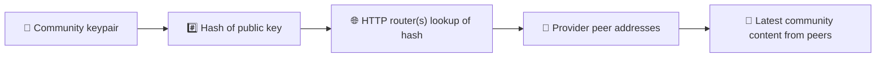
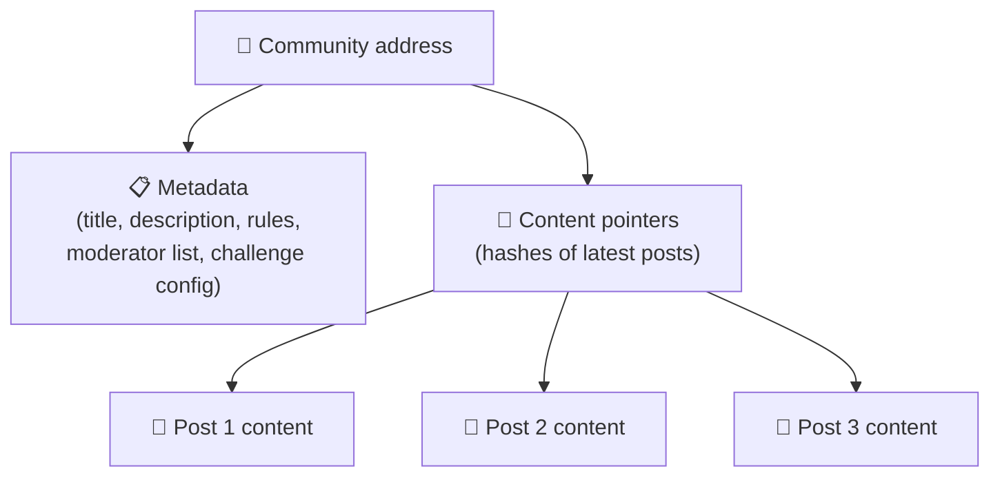
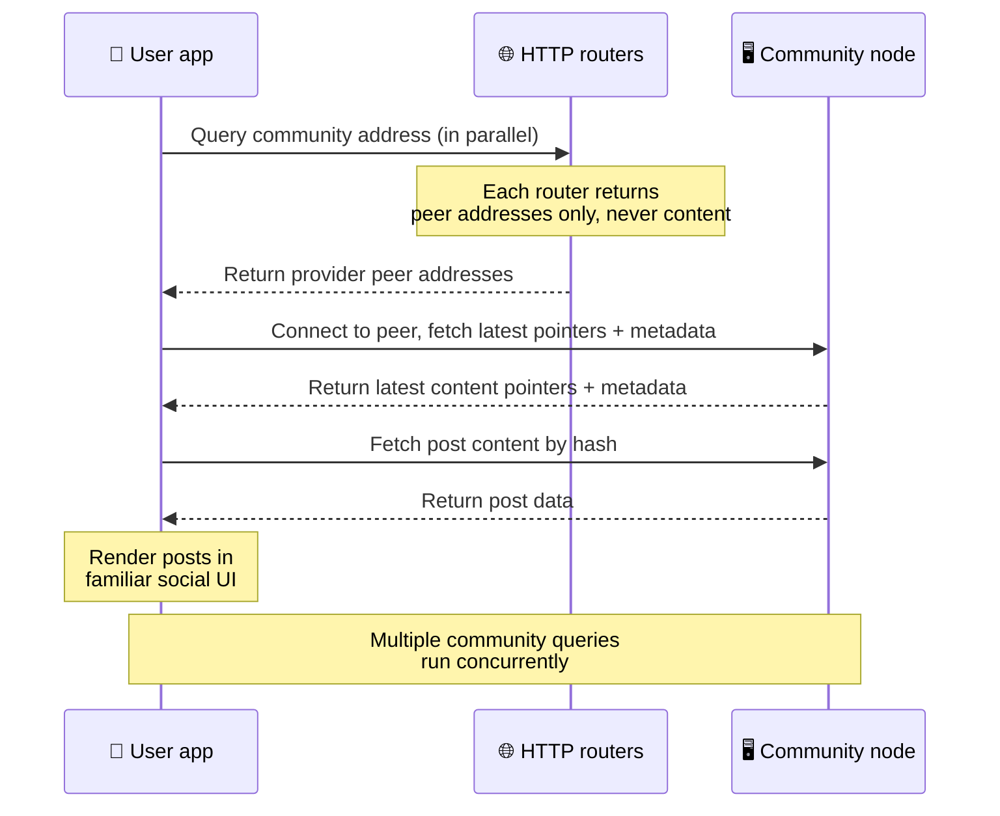
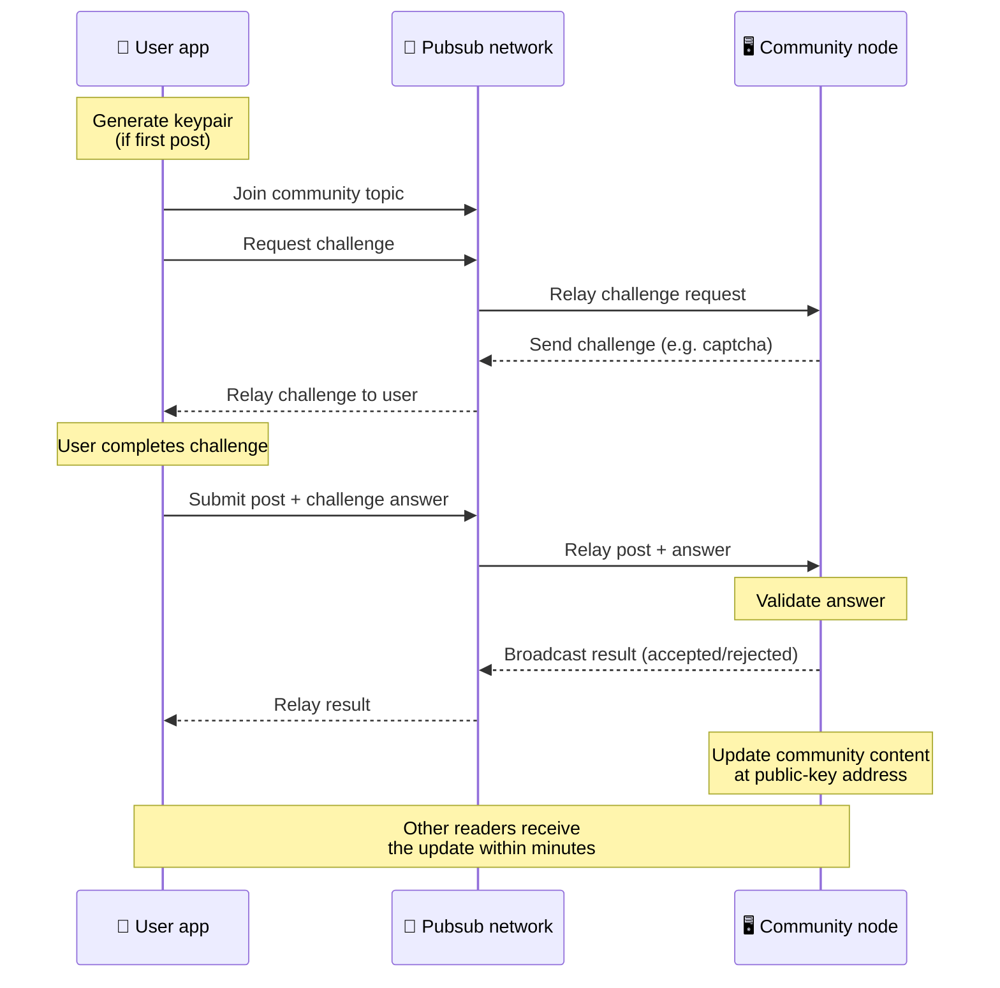
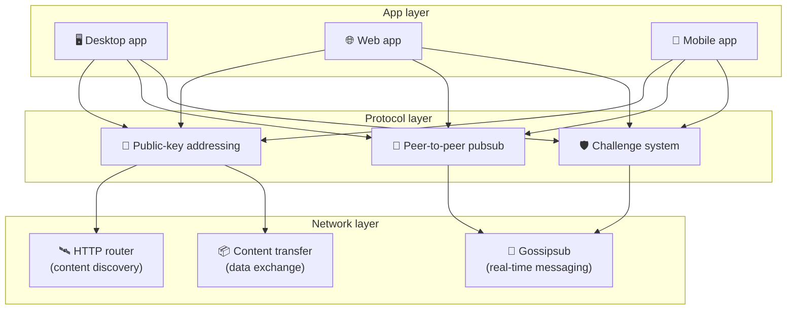

# โปรโตคอลเพียร์ทูเพียร์

Bitsocial ไม่ได้ใช้บล็อกเชน เซิร์ฟเวอร์เฟเดอเรชัน หรือแบ็กเอนด์แบบรวมศูนย์ แต่ใช้สแตก IPFS/libp2p
เพื่อรวมสองแนวคิดเข้าด้วยกัน คือ **การกำหนดที่อยู่ด้วยกุญแจสาธารณะ** และ
**pubsub แบบเพียร์ทูเพียร์** ทั้งสองอย่างรวมกันทำให้ใครก็ตามโฮสต์ชุมชนจากฮาร์ดแวร์ทั่วไปได้
ขณะที่ผู้ใช้อ่านและโพสต์ได้โดยไม่ต้องมีบัญชีบนบริการที่บริษัทใดควบคุม

หากต้องการคำอธิบายที่เน้นเทคนิคน้อยกว่านี้ อ่าน
[คำอธิบายโปรโตคอล Bitsocial ฉบับเข้าใจง่ายแบบครบถ้วน](./layman-protocol-explanation.md)

## Bitsocial ใช้ IPFS หรือไม่

ใช่ โหนด Bitsocial ใช้ไพรมิทีฟของ IPFS/libp2p เป็นชั้นเพียร์ทูเพียร์ ได้แก่
ระเบียนชุมชนที่กำหนดที่อยู่ด้วยกุญแจสาธารณะ การถ่ายโอนเนื้อหาระหว่างเพียร์ และ gossipsub pubsub
สำหรับข้อความแบบเรียลไทม์ เมื่อเอกสารชุดนี้พูดถึง "pubsub" หมายถึง pubsub ของ IPFS/libp2p
ไม่ใช่ตัวกลางรับส่งข้อความแบบรวมศูนย์ที่แยกออกมาต่างหาก

ปัจจุบันโปรโตคอลอธิบายการค้นพบผ่านเราเตอร์ HTTP เพราะไคลเอนต์ของ Bitsocial
สอบถามเอนด์พอยต์ของเราเตอร์เพื่อขอที่อยู่ของเพียร์ผู้ให้บริการ แทนที่จะพึ่ง DHT
ซึ่งใช้งานในเบราว์เซอร์ได้ยากในทุกครั้งที่ค้นหา เราเตอร์คืนค่าเฉพาะรายชื่อเพียร์เท่านั้น
ส่วนการถ่ายโอนเนื้อหาและทราฟฟิก pubsub ยังคงวิ่งผ่านเครือข่ายเพียร์ทูเพียร์

## ปัญหาสองข้อ

เครือข่ายสังคมแบบกระจายศูนย์ต้องตอบคำถามสองข้อ:

1. **ข้อมูล** — จะจัดเก็บและให้บริการเนื้อหาโซเชียลของคนทั้งโลกโดยไม่มีฐานข้อมูลส่วนกลางได้อย่างไร
2. **สแปม** — จะป้องกันการใช้งานในทางที่ผิดอย่างไร โดยที่เครือข่ายยังใช้งานได้ฟรี

Bitsocial แก้ปัญหาข้อมูลด้วยการไม่ใช้บล็อกเชนเลย เพราะโซเชียลมีเดียไม่จำเป็นต้องมีลำดับธุรกรรมระดับโลก
หรือความพร้อมใช้งานถาวรของโพสต์เก่าทุกชิ้น ส่วนปัญหาสแปมแก้ด้วยการให้แต่ละชุมชน
รันชาเลนจ์ป้องกันสแปมของตัวเองบนเครือข่ายเพียร์ทูเพียร์

สำหรับโมเดลการค้นพบที่อยู่เหนือชั้นเครือข่ายนี้ ดู [การค้นพบเนื้อหา](./content-discovery.md)

---

## การกำหนดที่อยู่ด้วยกุญแจสาธารณะ {#public-key-based-addressing}

ใน BitTorrent แฮชของไฟล์จะกลายเป็นที่อยู่ของไฟล์นั้น (_การกำหนดที่อยู่ตามเนื้อหา_) Bitsocial
ใช้แนวคิดคล้ายกันแต่ทำกับกุญแจสาธารณะ คือแฮชของกุญแจสาธารณะของชุมชนจะกลายเป็นที่อยู่ของชุมชนนั้นบนเครือข่าย

เพียร์ใดก็ตามบนเครือข่ายสามารถสอบถาม **เราเตอร์ HTTP** เกี่ยวกับที่อยู่นั้นได้
เราเตอร์จะตอบกลับด้วยรายการที่อยู่เครือข่ายของเพียร์ที่กำลังให้บริการแฮชของชุมชนอยู่ในขณะนั้น
จากนั้นไคลเอนต์จะเชื่อมต่อกับเพียร์เหล่านั้นโดยตรงเพื่อดึงสถานะล่าสุดของชุมชน ทุกครั้งที่เนื้อหาถูกอัปเดต
หมายเลขเวอร์ชันจะเพิ่มขึ้น เครือข่ายเก็บไว้เฉพาะเวอร์ชันล่าสุดเท่านั้น
ไม่จำเป็นต้องรักษาสถานะในอดีตทุกสถานะเอาไว้ ซึ่งเป็นเหตุผลที่ทำให้วิธีนี้เบากว่าบล็อกเชนมาก

> **เราเตอร์ HTTP เก็บอะไรไว้จริง ๆ** เราเตอร์ HTTP เป็นดัชนีบาง ๆ สำหรับที่อยู่เนื้อหาแต่ละรายการที่รู้จัก
> มันเก็บเพียงที่อยู่เครือข่ายของเพียร์ที่ประกาศตัวว่าเป็นผู้ให้บริการ (คู่ IP/พอร์ต, libp2p multiaddr
> และอื่น ๆ ในทำนองนี้) มัน **ไม่ได้** เก็บเนื้อหาของชุมชน ข้อมูลเมตา ข้อความในโพสต์ รายชื่อสมาชิก
> หรือแม้แต่ป้ายกำกับที่มนุษย์อ่านได้ว่าสิ่งที่อยู่ที่ที่อยู่นั้นคืออะไร มันเพียงตอบคำถามว่า
> "เพียร์ใดบ้างที่อ้างว่ามีแฮชนี้" สิ่งนี้ทำให้เราเตอร์รันได้ด้วยต้นทุนต่ำ เปลี่ยนตัวได้ง่าย
> และไม่ต้องรับผิดต่อสิ่งที่ผู้ใช้เผยแพร่ คล้ายกับ tracker ของ BitTorrent แต่ไม่มีข้อมูลเมตาของทอร์เรนต์
> คือ tracker จับคู่ infohash กับเพียร์ ส่วนเราเตอร์ HTTP จับคู่เพียงที่อยู่เนื้อหากับที่อยู่ของเพียร์ผู้ให้บริการ
>
> เพื่อความซ้ำซ้อนสำรอง ไคลเอนต์จะสอบถาม **เราเตอร์ HTTP หลายตัวพร้อมกัน**
> แล้วรวมรายการผู้ให้บริการที่ได้กลับมาเข้าด้วยกัน ใครก็รันเราเตอร์ได้ และการเปลี่ยนหรือเพิ่มเราเตอร์
> เป็นเพียงการแก้ค่าคอนฟิก โดยไม่ต้องย้ายข้อมูลใด ๆ
>
> Bitsocial ใช้เราเตอร์ HTTP แทน DHT เพราะการรัน DHT ในระดับที่รองรับการค้นพบเนื้อหาได้จริงนั้นมีต้นทุนสูง
> โดยเฉพาะบนมือถือ อีกทั้ง DHT ยังใช้ไม่ได้ในเบราว์เซอร์ เพราะเบราว์เซอร์เข้าร่วม libp2p DHT
> โดยตรงไม่ได้ ขณะที่เราเตอร์ HTTP รันได้ด้วยต้นทุนต่ำบนโครงสร้างพื้นฐาน HTTP ทั่วไป
> และทำงานได้ดีพอกันทั้งจากโทรศัพท์และจากเบราว์เซอร์

### สิ่งที่ถูกเก็บไว้ที่ที่อยู่นั้น

ที่อยู่ของชุมชนไม่ได้บรรจุเนื้อหาเต็มของโพสต์ไว้โดยตรง แต่เก็บรายการตัวระบุเนื้อหา
ซึ่งเป็นแฮชที่ชี้ไปยังข้อมูลจริง จากนั้นไคลเอนต์จึงดึงเนื้อหาแต่ละชิ้นโดยตรงจากเพียร์ที่เราเตอร์ HTTP
ส่งกลับมา ตัวเราเตอร์เองไม่เคยเห็นหรือเก็บเนื้อหาเลย

จะมีเพียร์อย่างน้อยหนึ่งรายที่มีข้อมูลอยู่เสมอ นั่นคือโหนดของผู้ดำเนินการชุมชน หากชุมชนได้รับความนิยม
ก็จะมีเพียร์อื่นอีกจำนวนมากที่มีข้อมูลนั้นด้วย และภาระงานจะกระจายตัวเอง
เช่นเดียวกับที่ทอร์เรนต์ยอดนิยมดาวน์โหลดได้เร็วกว่า

---

## pubsub แบบเพียร์ทูเพียร์

Pubsub (publish-subscribe) คือรูปแบบการรับส่งข้อความที่เพียร์สมัครรับหัวข้อหนึ่ง
แล้วได้รับทุกข้อความที่ถูกเผยแพร่ในหัวข้อนั้น Bitsocial ใช้เครือข่าย pubsub แบบเพียร์ทูเพียร์
ใครก็เผยแพร่ได้ ใครก็สมัครรับได้ และไม่มีตัวกลางรับส่งข้อความส่วนกลาง

ในการเผยแพร่โพสต์ไปยังชุมชน ผู้ใช้จะเผยแพร่ข้อความที่มีหัวข้อเท่ากับกุญแจสาธารณะของชุมชนนั้น
โหนดของผู้ดำเนินการชุมชนจะรับข้อความไป ตรวจสอบความถูกต้อง และหากผ่านชาเลนจ์ป้องกันสแปม
ก็จะรวมข้อความนั้นไว้ในการอัปเดตเนื้อหาครั้งถัดไป

---

## การป้องกันสแปม: ชาเลนจ์ผ่าน pubsub

เครือข่าย pubsub แบบเปิดเสี่ยงต่อการถูกถล่มด้วยสแปม Bitsocial แก้ปัญหานี้ด้วยการบังคับให้ผู้เผยแพร่
ทำ **ชาเลนจ์** ให้สำเร็จก่อน เนื้อหาจึงจะถูกยอมรับ

ระบบชาเลนจ์มีความยืดหยุ่น ผู้ดำเนินการชุมชนแต่ละรายตั้งค่านโยบายของตัวเองได้ ตัวเลือกมีเช่น:

| ประเภทชาเลนจ์        | ทำงานอย่างไร                                       |
| -------------------- | -------------------------------------------------- |
| **แคปต์ชา**          | ปริศนาเชิงภาพหรือเชิงโต้ตอบที่แสดงในแอป            |
| **การจำกัดอัตรา**    | จำกัดจำนวนโพสต์ต่อช่วงเวลาต่อหนึ่งตัวตน            |
| **การกั้นด้วยโทเคน** | ต้องพิสูจน์ว่าถือยอดคงเหลือของโทเคนที่กำหนด        |
| **การชำระเงิน**      | ต้องจ่ายเงินจำนวนเล็กน้อยต่อหนึ่งโพสต์             |
| **รายการอนุญาต**     | เฉพาะตัวตนที่อนุมัติไว้ล่วงหน้าเท่านั้นที่โพสต์ได้ |
| **โค้ดกำหนดเอง**     | นโยบายใดก็ได้ที่เขียนออกมาเป็นโค้ดได้              |

เพียร์ที่ส่งต่อความพยายามทำชาเลนจ์ที่ล้มเหลวมากเกินไปจะถูกบล็อกออกจากหัวข้อ pubsub
ซึ่งช่วยป้องกันการโจมตีแบบปฏิเสธการให้บริการที่ชั้นเครือข่าย

---

## วงจรการทำงาน: การอ่านชุมชน

นี่คือสิ่งที่เกิดขึ้นเมื่อผู้ใช้เปิดแอปและดูโพสต์ล่าสุดของชุมชน

**ทีละขั้นตอน:**

1. ผู้ใช้เปิดแอปและเห็นหน้าตาแบบโซเชียลเน็ตเวิร์ก
2. ไคลเอนต์สอบถามเราเตอร์ HTTP หลายตัวพร้อมกันสำหรับแต่ละชุมชนที่ผู้ใช้ติดตาม
   เราเตอร์แต่ละตัวคืนค่าเฉพาะที่อยู่ของเพียร์ ไม่เคยคืนเนื้อหา
   ความหน่วงของการสอบถามขึ้นอยู่กับสภาพเครือข่ายและภาระงานของเราเตอร์
   ในสภาพที่ความหน่วงต่ำตามปกติ การสอบถามมักได้ผลลัพธ์ภายในราวหนึ่งวินาทีและทำงานพร้อมกันได้
3. เมื่อไคลเอนต์ได้ที่อยู่ของเพียร์แล้ว ก็จะเชื่อมต่อกับเพียร์เหล่านั้นและดึงตัวชี้เนื้อหาล่าสุด
   พร้อมข้อมูลเมตาของชุมชน (ชื่อ คำอธิบาย รายชื่อผู้ดูแล
   และการตั้งค่าชาเลนจ์)
4. ไคลเอนต์ดึงเนื้อหาโพสต์จริงโดยใช้ตัวชี้เหล่านั้น
   แล้วแสดงผลทุกอย่างในหน้าตาแบบโซเชียลเน็ตเวิร์กที่คุ้นเคย

---

## วงจรการทำงาน: การเผยแพร่โพสต์

การเผยแพร่ต้องผ่านการโต้ตอบแบบชาเลนจ์-เรสปอนส์บน pubsub ก่อน โพสต์จึงจะถูกยอมรับ

**ทีละขั้นตอน:**

1. แอปสร้างคู่กุญแจให้ผู้ใช้ หากผู้ใช้ยังไม่มี
2. ผู้ใช้เขียนโพสต์สำหรับชุมชนหนึ่ง
3. ไคลเอนต์เข้าร่วมหัวข้อ pubsub ของชุมชนนั้น (ผูกกับกุญแจสาธารณะของชุมชน)
4. ไคลเอนต์ขอชาเลนจ์ผ่าน pubsub
5. โหนดของผู้ดำเนินการชุมชนส่งชาเลนจ์กลับมา (เช่น แคปต์ชา)
6. ผู้ใช้ทำชาเลนจ์ให้สำเร็จ
7. ไคลเอนต์ส่งโพสต์พร้อมคำตอบของชาเลนจ์ผ่าน pubsub
8. โหนดของผู้ดำเนินการชุมชนตรวจสอบคำตอบ หากถูกต้อง โพสต์จะถูกยอมรับ
9. โหนดกระจายผลลัพธ์ผ่าน pubsub เพื่อให้เพียร์ในเครือข่ายรู้ว่าควรส่งต่อข้อความ
   จากผู้ใช้รายนี้ต่อไป
10. โหนดอัปเดตเนื้อหาของชุมชนที่ที่อยู่ซึ่งได้จากกุญแจสาธารณะ
11. ภายในไม่กี่นาที ผู้อ่านทุกคนของชุมชนจะได้รับการอัปเดตนั้น

---

## ภาพรวมสถาปัตยกรรม

ระบบทั้งหมดมีสามชั้นที่ทำงานร่วมกัน:

| ชั้น          | บทบาท                                                                                                                                                              |
| ------------- | ------------------------------------------------------------------------------------------------------------------------------------------------------------------ |
| **แอป**       | ส่วนติดต่อผู้ใช้ มีแอปได้หลายตัว แต่ละตัวมีดีไซน์ของตัวเอง และทุกตัวใช้ชุมชนและตัวตนเดียวกัน                                                                       |
| **โปรโตคอล**  | กำหนดว่าชุมชนถูกระบุที่อยู่อย่างไร โพสต์ถูกเผยแพร่อย่างไร และป้องกันสแปมอย่างไร                                                                                    |
| **เครือข่าย** | โครงสร้างพื้นฐานเพียร์ทูเพียร์ที่อยู่เบื้องล่าง ได้แก่ เราเตอร์ HTTP สำหรับการค้นพบ gossipsub สำหรับข้อความเรียลไทม์ และการถ่ายโอนเนื้อหาสำหรับการแลกเปลี่ยนข้อมูล |

---

## ความเป็นส่วนตัว: การตัดการเชื่อมโยงผู้เขียนกับที่อยู่ IP

เมื่อผู้ใช้เผยแพร่โพสต์ เนื้อหาจะถูก **เข้ารหัสด้วยกุญแจสาธารณะของผู้ดำเนินการชุมชน**
ก่อนเข้าสู่เครือข่าย pubsub นั่นหมายความว่าแม้ผู้สังเกตการณ์บนเครือข่ายจะเห็นว่าเพียร์หนึ่ง
ได้เผยแพร่ _บางอย่าง_ ออกไป แต่พวกเขาไม่สามารถระบุได้ว่า:

- เนื้อหานั้นพูดว่าอะไร
- ตัวตนของผู้เขียนคนใดเป็นผู้เผยแพร่

คล้ายกับที่ BitTorrent ทำให้เราค้นหาได้ว่า IP ใดบ้างที่ซีดทอร์เรนต์หนึ่ง
แต่ไม่รู้ว่าใครเป็นผู้สร้างทอร์เรนต์นั้นตั้งแต่แรก ชั้นการเข้ารหัสเพิ่มการรับประกันความเป็นส่วนตัว
อีกชั้นหนึ่งบนพื้นฐานดังกล่าว

---

## เพียร์ทูเพียร์ในเบราว์เซอร์

ตอนนี้ P2P ในเบราว์เซอร์เป็นไปได้แล้วในไคลเอนต์ของ Bitsocial แอปในเบราว์เซอร์รันโหนด
[Helia](https://helia.io/) ได้ ใช้สแตกไคลเอนต์โปรโตคอล Bitsocial ชุดเดียวกับแอปอื่น ๆ
และดึงเนื้อหาจากเพียร์แทนที่จะขอให้เกตเวย์ IPFS แบบรวมศูนย์ส่งเนื้อหาให้
เบราว์เซอร์ยังเข้าร่วม pubsub ได้โดยตรงด้วย ดังนั้นในเส้นทางปกติ
การโพสต์จึงไม่ต้องพึ่งผู้ให้บริการ pubsub ที่แพลตฟอร์มเป็นเจ้าของ

นี่คือหมุดหมายสำคัญสำหรับการกระจายผ่านเว็บ เว็บไซต์ HTTPS ธรรมดาเปิดขึ้นมาเป็นไคลเอนต์โซเชียล P2P
ที่ทำงานจริงได้ ผู้ใช้ไม่จำเป็นต้องติดตั้งแอปเดสก์ท็อปก่อนจึงจะอ่านข้อมูลจากเครือข่ายได้
และผู้ดำเนินการแอปก็ไม่จำเป็นต้องรันเกตเวย์ส่วนกลางที่จะกลายเป็นคอขวดด้านการควบคุมเนื้อหา
สำหรับผู้ใช้เบราว์เซอร์ทุกคน

เส้นทางแบบเบราว์เซอร์มีข้อจำกัดต่างจากโหนดบนเดสก์ท็อปหรือเซิร์ฟเวอร์:

- โดยทั่วไปโหนดในเบราว์เซอร์รับการเชื่อมต่อขาเข้าตามอำเภอใจจากอินเทอร์เน็ตสาธารณะไม่ได้
- มันโหลด ตรวจสอบความถูกต้อง แคช และเผยแพร่ข้อมูลได้ในระหว่างที่แอปเปิดอยู่
- ไม่ควรถือว่ามันเป็นผู้โฮสต์ข้อมูลของชุมชนในระยะยาว
- การโฮสต์ชุมชนแบบเต็มรูปแบบยังคงเหมาะกับแอปเดสก์ท็อป `bitsocial-cli`
  หรือโหนดอื่นที่เปิดอยู่ตลอดเวลามากกว่า

เราเตอร์ HTTP ยังคงสำคัญต่อการค้นพบเนื้อหา เพราะมันคืนที่อยู่ของผู้ให้บริการสำหรับแฮชของชุมชน
มันไม่ใช่เกตเวย์ IPFS เพราะไม่ได้ให้บริการตัวเนื้อหาเอง หลังจากค้นพบแล้ว
ไคลเอนต์ในเบราว์เซอร์จะเชื่อมต่อกับเพียร์และดึงข้อมูลผ่านสแตก P2P

ตอนนี้ P2P ในเบราว์เซอร์เป็นเส้นทางเว็บเริ่มต้นแล้ว ไม่ใช่การทดลองที่ซ่อนอยู่หลังสวิตช์
5chan รัน P2P ในเบราว์เซอร์ล้วนเป็นค่าเริ่มต้นที่ 5chan.app และบล็อกของ Bitsocial บน bitsocial.net
ก็ทำเช่นเดียวกัน เพียร์ในเบราว์เซอร์เชื่อมต่อผ่าน WebSockets แบบปลอดภัย ส่วน `pkc-js`
ปฏิเสธการเชื่อมต่อแบบ WebRTC และ WebTransport ตามค่าเริ่มต้น
เพราะเส้นทางการสร้างการเชื่อมต่อของทั้งสองแบบนั้นช้าและไม่น่าเชื่อถือในเบราว์เซอร์
การเปลี่ยนแปลงจากต้นน้ำที่ทำให้การเผยแพร่จากเบราว์เซอร์ใช้งานได้จริงในปี 2026 คือการแก้ไขหมายเลขลำดับของ
gossipsub ใน `@libp2p/gossipsub` 15.0.21 ซึ่งทำให้เพียร์ Kubo เลิกทิ้งข้อความที่เผยแพร่โดยโหนด JavaScript

สำหรับภาพรวมทั้งหมด รวมถึงสิ่งที่โหนดในเบราว์เซอร์ยังทำไม่ได้ ดู
[เพียร์ทูเพียร์ในเบราว์เซอร์](/browser-p2p/)

## การสำรองด้วยเกตเวย์ {#gateway-fallback}

การเข้าถึงผ่านเบราว์เซอร์ที่มีเกตเวย์หนุนหลังยังมีประโยชน์ในฐานะทางสำรองเพื่อความเข้ากันได้และการทยอยเปิดใช้งาน
เกตเวย์ส่งต่อข้อมูลระหว่างเครือข่าย P2P กับไคลเอนต์ในเบราว์เซอร์ได้
เมื่อเบราว์เซอร์เข้าร่วมเครือข่ายโดยตรงไม่ได้ หรือเมื่อแอปเลือกใช้เส้นทางแบบเดิมโดยตั้งใจ เกตเวย์เหล่านี้:

- ใครก็รันได้
- ไม่ต้องมีบัญชีผู้ใช้หรือการชำระเงิน
- ไม่ได้ครอบครองตัวตนของผู้ใช้หรือชุมชน
- เปลี่ยนตัวได้โดยไม่สูญเสียข้อมูล

สถาปัตยกรรมเป้าหมายคือ P2P ในเบราว์เซอร์มาก่อน โดยมีเกตเวย์เป็นทางสำรองที่เลือกใช้ได้
ไม่ใช่คอขวดที่เป็นค่าเริ่มต้น

---

## ทำไมไม่ใช้บล็อกเชน

บล็อกเชนถูกสร้างมาเพื่อแก้ปัญหาการใช้เงินซ้ำซ้อน จึงต้องรู้ลำดับที่แน่นอนของทุกธุรกรรม
เพื่อป้องกันไม่ให้ใครใช้เหรียญเดียวกันสองครั้ง

โซเชียลมีเดียไม่มีปัญหาการใช้เงินซ้ำซ้อน ไม่สำคัญว่าโพสต์ A ถูกเผยแพร่ก่อนโพสต์ B หนึ่งมิลลิวินาทีหรือไม่
และโพสต์เก่าก็ไม่จำเป็นต้องพร้อมใช้งานอย่างถาวรบนทุกโหนด

ด้วยการไม่ใช้บล็อกเชน Bitsocial จึงหลีกเลี่ยง:

- **ค่าแก๊ส** — การโพสต์ไม่มีค่าใช้จ่าย
- **ขีดจำกัดปริมาณงาน** — ไม่มีคอขวดจากขนาดบล็อกหรือเวลาบล็อก
- **ข้อมูลบวมเกินจำเป็น** — โหนดเก็บเฉพาะสิ่งที่ต้องใช้
- **ภาระของฉันทามติ** — ไม่ต้องมีนักขุด ผู้ตรวจสอบ หรือการสเตก

ข้อแลกเปลี่ยนคือ Bitsocial ไม่รับประกันความพร้อมใช้งานถาวรของเนื้อหาเก่า แต่สำหรับโซเชียลมีเดีย
นั่นเป็นข้อแลกเปลี่ยนที่ยอมรับได้ เพราะโหนดของผู้ดำเนินการชุมชนถือข้อมูลไว้
เนื้อหายอดนิยมกระจายไปยังเพียร์จำนวนมาก และโพสต์ที่เก่ามากก็ค่อย ๆ จางหายไปตามธรรมชาติ
เช่นเดียวกับที่เกิดขึ้นบนทุกแพลตฟอร์มโซเชียล

## ทำไมไม่ใช้เฟเดอเรชัน

เครือข่ายแบบเฟเดอเรชัน (เช่น อีเมล หรือแพลตฟอร์มที่อิง ActivityPub) ดีกว่าการรวมศูนย์
แต่ก็ยังมีข้อจำกัดเชิงโครงสร้าง:

- **การพึ่งพาเซิร์ฟเวอร์** — แต่ละชุมชนต้องมีเซิร์ฟเวอร์พร้อมโดเมน TLS
  และการดูแลรักษาอย่างต่อเนื่อง
- **ความไว้วางใจในผู้ดูแลระบบ** — ผู้ดูแลเซิร์ฟเวอร์ควบคุมบัญชีผู้ใช้และเนื้อหาได้ทั้งหมด
- **การแตกกระจาย** — การย้ายระหว่างเซิร์ฟเวอร์มักหมายถึงการสูญเสียผู้ติดตาม ประวัติ หรือตัวตน
- **ต้นทุน** — ต้องมีคนจ่ายค่าโฮสติ้ง ซึ่งสร้างแรงกดดันให้เกิดการรวมศูนย์

แนวทางเพียร์ทูเพียร์ของ Bitsocial ตัดเซิร์ฟเวอร์ออกจากสมการทั้งหมด โหนดของชุมชนรันบนแล็ปท็อป
Raspberry Pi หรือ VPS ราคาถูกก็ได้ ผู้ดำเนินการควบคุมนโยบายการกลั่นกรองเนื้อหา
แต่ยึดตัวตนของผู้ใช้ไปไม่ได้ เพราะตัวตนถูกควบคุมด้วยคู่กุญแจ ไม่ใช่สิ่งที่เซิร์ฟเวอร์มอบให้

## แล้ว Nostr ล่ะ

Nostr ไม่เข้ากลุ่มใดกลุ่มหนึ่งอย่างชัดเจน มันไม่ใช่เฟเดอเรชันแบบ ActivityPub
เพราะผู้ใช้ไม่ได้รับบัญชีจากอินสแตนซ์ และตัวตนไม่ได้ผูกกับเซิร์ฟเวอร์ใดเซิร์ฟเวอร์หนึ่ง
และมันก็ไม่ใช่โซเชียลมีเดียบนบล็อกเชนเช่นกัน เพราะไม่มีเชน ฉันทามติ ค่าแก๊ส หรือลำดับธุรกรรมระดับโลก

เรียก Nostr ว่า **โซเชียลมีเดียที่อิงรีเลย์** จะตรงกว่า ในโปรโตคอลพื้นฐาน
([NIP-01](https://github.com/nostr-protocol/nips/blob/master/01.md)) ผู้ใช้ถือคู่กุญแจ ลงลายเซ็นอีเวนต์
และเผยแพร่อีเวนต์เหล่านั้นไปยังรีเลย์ WebSocket ไคลเอนต์สมัครรับข้อมูลจากรีเลย์พร้อมตัวกรอง
ดึงอีเวนต์ที่ตรงเงื่อนไข และตรวจสอบลายเซ็นในเครื่อง ผู้ใช้ยังเผยแพร่ข้อมูลเมตารายการรีเลย์ได้ด้วย
([NIP-65](https://github.com/nostr-protocol/nips/blob/master/65.md)) ซึ่งบอกไคลเอนต์ว่าปกติแล้วเขียนไปยัง
รีเลย์ใด และชอบอ่านการกล่าวถึงจากรีเลย์ใด

นั่นทำให้ Nostr ใกล้เคียงกับ Bitsocial มากกว่าระบบแบบเฟเดอเรชันหรือบล็อกเชนในแง่สำคัญข้อหนึ่ง คือ
ตัวตนเป็นแบบเข้ารหัสลับและพกพาได้ ความต่างหลักอยู่ที่ชั้นข้อมูล ใน Nostr
รีเลย์คือชั้นจัดเก็บและส่งมอบข้อมูลตามปกติ ส่วนใน Bitsocial เราเตอร์ HTTP
ช่วยแค่ให้ไคลเอนต์หาเพียร์เจอเท่านั้น เราเตอร์ไม่เก็บโพสต์ โปรไฟล์ ข้อมูลเมตาของชุมชน
หรือสถานะการกลั่นกรองเนื้อหา มันคืนที่อยู่ของเพียร์ผู้ให้บริการ แล้วไคลเอนต์จึงไปดึงเนื้อหาจากเพียร์

ชุมชนก็แบ่งแยกในลักษณะเดียวกัน Nostr มีรูปแบบเสริมสำหรับ
[กลุ่มที่อิงรีเลย์](https://github.com/nostr-protocol/nips/blob/master/29.md) และ
[ชุมชนที่ผู้ดูแลอนุมัติ](https://github.com/nostr-protocol/nips/blob/master/72.md)
แต่ทั้งสองแบบยังขึ้นอยู่กับนโยบายของรีเลย์ สถานะกลุ่มที่รีเลย์โฮสต์ไว้
หรือการที่ไคลเอนต์เลือกว่าจะยอมรับการอนุมัติของใคร ส่วน Bitsocial
ถือว่าชุมชนเป็นออบเจ็กต์เชิงเข้ารหัสลับระดับพื้นฐาน ซึ่งโหนดของผู้ดำเนินการเป็นผู้ตรวจสอบโพสต์
รันนโยบายชาเลนจ์ของชุมชน และเผยแพร่สถานะล่าสุดที่ได้รับการยอมรับเข้าสู่เครือข่ายเพียร์ทูเพียร์

| คำถาม               | Nostr                                                                                                 | Bitsocial                                                           |
| ------------------- | ----------------------------------------------------------------------------------------------------- | ------------------------------------------------------------------- |
| ประเภท              | โปรโตคอลที่อิงรีเลย์                                                                                  | เครือข่ายชุมชนแบบเพียร์ทูเพียร์                                     |
| ตัวตน               | กุญแจสาธารณะของผู้ใช้                                                                                 | คู่กุญแจของผู้ใช้และของชุมชน                                        |
| เส้นทางข้อมูล       | อีเวนต์ที่ลงลายเซ็นแล้วถูกเผยแพร่ไปยังรีเลย์                                                          | ที่อยู่จากกุญแจสาธารณะชี้ไปยังเพียร์ แล้วดึงเนื้อหาจากเพียร์        |
| ใครทำให้ออนไลน์อยู่ | รีเลย์ที่ผู้ใช้และไคลเอนต์เลือก                                                                       | โหนดของเจ้าของชุมชน พร้อมซีดเดอร์ที่ช่วยกระจาย                      |
| ชุมชน               | กลุ่มที่อิงรีเลย์หรือชุมชนที่ผู้ดูแลอนุมัติ ซึ่งเป็นทางเลือกเสริม                                     | ออบเจ็กต์ชุมชนระดับพื้นฐาน โดยผู้ดำเนินการควบคุมการกลั่นกรองเนื้อหา |
| การป้องกันสแปม      | นโยบายของรีเลย์ การยืนยันตัวตน การชำระเงิน proof-of-work ตัวกรองฝั่งไคลเอนต์ หรือการอนุมัติโดยผู้ดูแล | ตรรกะชาเลนจ์ที่ชุมชนกำหนดเอง ก่อนจะรับเนื้อหาเข้าไป                 |
| ข้อแลกเปลี่ยนหลัก   | ตัวตนพกพาได้ แต่ความพร้อมใช้งานและนโยบายขึ้นกับรีเลย์                                                 | พึ่งพารีเลย์น้อยกว่า แต่ไม่รับประกันว่าเนื้อหาเก่าจะอยู่ตลอดไป      |

---

## สรุป

Bitsocial สร้างขึ้นบนไพรมิทีฟสองอย่าง ได้แก่ การกำหนดที่อยู่ด้วยกุญแจสาธารณะสำหรับการค้นพบเนื้อหา
และ pubsub แบบเพียร์ทูเพียร์สำหรับการสื่อสารแบบเรียลไทม์ ทั้งสองอย่างรวมกันสร้างเครือข่ายสังคมที่:

- ชุมชนถูกระบุด้วยกุญแจเข้ารหัสลับ ไม่ใช่ชื่อโดเมน
- เนื้อหากระจายไปทั่วเพียร์เหมือนทอร์เรนต์ ไม่ได้ให้บริการจากฐานข้อมูลเดียว
- การต้านสแปมเป็นเรื่องเฉพาะของแต่ละชุมชน ไม่ได้ถูกกำหนดโดยแพลตฟอร์ม
- ผู้ใช้เป็นเจ้าของตัวตนของตนเองผ่านคู่กุญแจ ไม่ใช่ผ่านบัญชีที่ถูกเพิกถอนได้
- ทั้งระบบทำงานได้โดยไม่ต้องมีเซิร์ฟเวอร์ บล็อกเชน หรือค่าธรรมเนียมแพลตฟอร์ม
