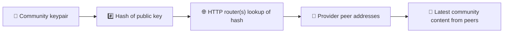
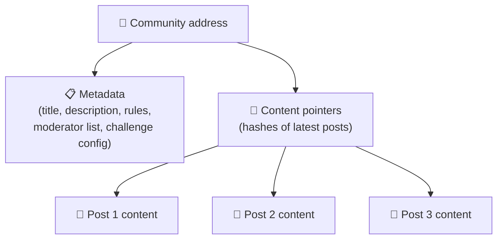
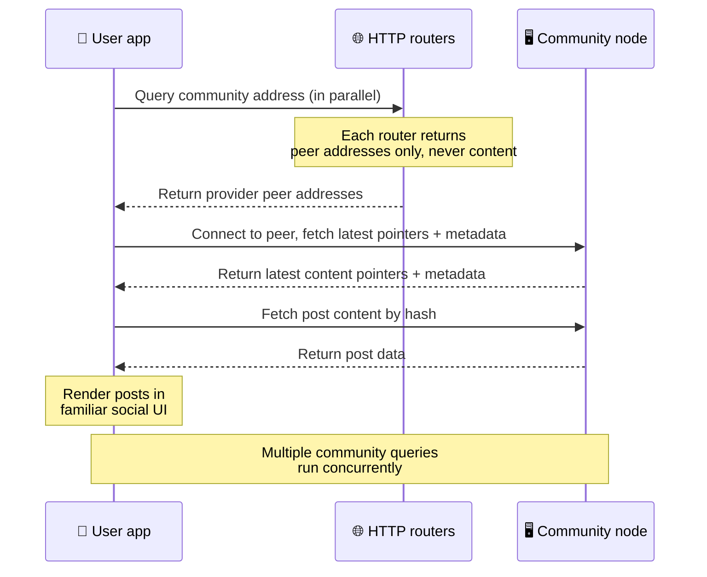
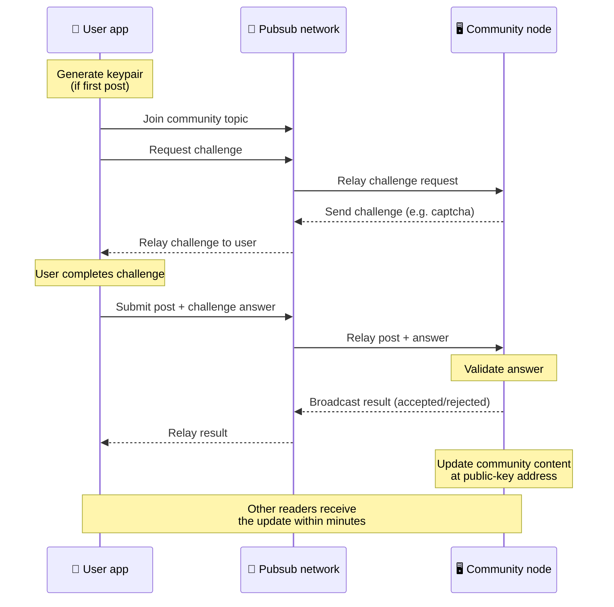
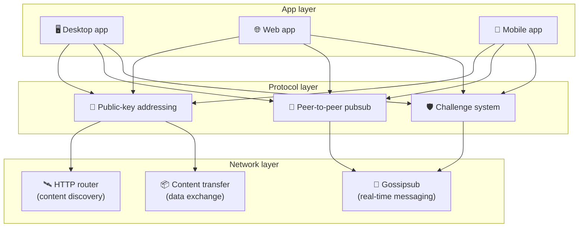

# Eşler Arası Protokol

Bitsocial ne blok zinciri, ne federasyon sunucusu, ne de merkezî bir arka uç kullanır. Bunun yerine
iki fikri birleştirmek için IPFS/libp2p yığınından yararlanır: **açık anahtar tabanlı adresleme** ve
**eşler arası pubsub**. Bu ikisi bir arada, herkesin sıradan tüketici donanımıyla bir topluluk
barındırmasına, kullanıcıların da hiçbir şirket denetimindeki hizmette hesap açmadan okuyup gönderi
paylaşmasına imkân verir.

Daha az teknik bir anlatım için
[Bitsocial protokolünün baştan sona sade bir açıklaması](./layman-protocol-explanation.md) sayfasını okuyun.

## Bitsocial IPFS kullanıyor mu?

Evet. Bitsocial düğümleri eşler arası katman için IPFS/libp2p ilkellerini kullanır: açık anahtarla
adreslenen topluluk kayıtları, eşler arasında içerik aktarımı ve gerçek zamanlı mesajlar için
gossipsub pubsub. Bu belgelerde "pubsub" dendiğinde kastedilen IPFS/libp2p pubsub'ıdır, ayrı ve
merkezî bir mesaj aracısı değil.

Protokol şu anda keşfi HTTP yönlendiricileri üzerinden tarif eder, çünkü Bitsocial istemcileri her
arama için tarayıcıya düşman bir DHT'ye bel bağlamak yerine sağlayıcı eş adreslerini yönlendirici uç
noktalarından sorgular. Yönlendiriciler yalnızca eş döndürür; içerik aktarımı ve pubsub trafiği yine
eşler arası ağ üzerinden akar.

## İki sorun

Merkezi olmayan bir sosyal ağın iki soruyu yanıtlaması gerekir:

1. **Veri** — dünyanın sosyal içeriğini merkezî bir veritabanı olmadan nasıl saklar ve sunarsınız?
2. **Spam** — ağı kullanımı ücretsiz tutarken kötüye kullanımı nasıl engellersiniz?

Bitsocial veri sorununu blok zincirini tamamen atlayarak çözer: sosyal medyanın küresel işlem
sıralamasına ya da her eski gönderinin kalıcı erişilebilirliğine ihtiyacı yoktur. Spam sorununu ise
her topluluğun kendi spam önleme sınamasını eşler arası ağ üzerinde çalıştırmasına izin vererek çözer.

Bu ağ katmanının üzerindeki keşif modeli için bkz. [İçerik Keşfi](./content-discovery.md).

---

## Açık anahtar tabanlı adresleme {#public-key-based-addressing}

BitTorrent'te bir dosyanın karması onun adresi olur (_içerik tabanlı adresleme_). Bitsocial benzer
bir fikri açık anahtarlarla kullanır: bir topluluğun açık anahtarının karması onun ağ adresi olur.

Ağdaki herhangi bir eş bu adres için bir **HTTP yönlendiricisine** sorgu gönderebilir: yönlendirici,
o an topluluğun karmasını sağlayan eşlerin ağ adreslerini içeren bir listeyle yanıt verir ve istemci
topluluğun en güncel durumunu almak için doğrudan bu eşlere bağlanır. İçerik her güncellendiğinde
sürüm numarası artar. Ağ yalnızca en son sürümü tutar — her geçmiş durumu saklamaya gerek yoktur ve
bu yaklaşımı bir blok zincirine kıyasla hafif kılan da budur.

> **Bir HTTP yönlendiricisi gerçekte neyi tutar.** HTTP yönlendiricisi ince bir dizinden ibarettir.
> Bildiği her içerik adresi için yalnızca kendini sağlayıcı olarak duyuran eşlerin ağ adreslerini
> saklar (IP/port çiftleri, libp2p multiaddr'ları, bu türden şeyler). Topluluğun içeriğini, meta
> verilerini, gönderi metnini, üye listesini, hatta o adreste ne olduğunu belirten insan tarafından
> okunabilir etiketi bile **saklamaz**; sadece "bu karmaya sahip olduğunu iddia eden eşler
> hangileri?" sorusunu yanıtlar. Bu da yönlendiricileri çalıştırması ucuz, değiştirmesi kolay ve
> kullanıcıların yayımladıklarından sorumlu olmayan bileşenler hâline getirir; bir BitTorrent
> tracker'ına benzer ama torrent meta verisi olmadan: bir tracker infohash'leri eşlere eşlerken, bir
> HTTP yönlendiricisi yalnızca bir içerik adresini sağlayıcı eş adreslerine eşler.
>
> Yedeklilik için istemci **birden fazla HTTP yönlendiricisini paralel olarak** sorgular ve geri
> aldığı sağlayıcı listelerini birleştirir. Yönlendiriciyi herkes çalıştırabilir; yönlendirici
> değiştirmek veya eklemek veri göçü gerektirmeyen bir yapılandırma değişikliğidir.
>
> Bitsocial DHT yerine HTTP yönlendiricilerini kullanır, çünkü içerik keşfi için gereken ölçekte bir
> DHT çalıştırmak pahalıdır, özellikle mobilde. Ayrıca DHT tarayıcıda çalışmaz, çünkü tarayıcılar
> doğrudan bir libp2p DHT'sine katılamaz. Bir HTTP yönlendiricisi ise sıradan HTTP altyapısında
> ucuza çalışır ve telefondan da tarayıcıdan da aynı şekilde iş görür.

### Adreste ne saklanır

Topluluk adresi gönderilerin tam içeriğini doğrudan barındırmaz. Bunun yerine bir içerik
tanımlayıcıları listesi tutar — asıl veriye işaret eden karmalar. İstemci daha sonra her içerik
parçasını doğrudan HTTP yönlendiricilerinin döndürdüğü eşlerden alır. Yönlendiricilerin kendisi
içeriği hiçbir zaman görmez veya saklamaz.

Veri her zaman en az bir eşin elindedir: topluluk işletmecisinin düğümü. Topluluk popülerse başka
birçok eşte de bulunur ve yük kendiliğinden dağılır; tıpkı popüler torrentlerin daha hızlı inmesi
gibi.

---

## Eşler arası pubsub

Pubsub (yayımla-abone ol), eşlerin bir konuya abone olup o konuya yayımlanan her mesajı aldığı bir
mesajlaşma desenidir. Bitsocial eşler arası bir pubsub ağı kullanır — herkes yayımlayabilir, herkes
abone olabilir ve merkezî bir mesaj aracısı yoktur.

Bir topluluğa gönderi yayımlamak için kullanıcı, konusu topluluğun açık anahtarına eşit olan bir
mesaj yayımlar. Topluluk işletmecisinin düğümü bunu alır, doğrular ve — spam önleme sınamasını
geçiyorsa — bir sonraki içerik güncellemesine dâhil eder.

---

## Spam önleme: pubsub üzerinden sınamalar

Açık bir pubsub ağı spam selleri karşısında savunmasızdır. Bitsocial bunu, yayımcıların içerikleri
kabul edilmeden önce bir **sınamayı** tamamlamasını zorunlu kılarak çözer.

Sınama sistemi esnektir: her topluluk işletmecisi kendi politikasını yapılandırır. Seçenekler
arasında şunlar vardır:

| Sınama türü       | Nasıl çalışır                                                          |
| ----------------- | ---------------------------------------------------------------------- |
| **Captcha**       | Uygulamada gösterilen görsel veya etkileşimli bulmaca                  |
| **Hız sınırlama** | Kimlik başına belirli bir zaman aralığındaki gönderi sayısını sınırlar |
| **Token kapısı**  | Belirli bir token bakiyesinin kanıtını ister                           |
| **Ödeme**         | Gönderi başına küçük bir ödeme ister                                   |
| **İzin listesi**  | Yalnızca önceden onaylanmış kimlikler gönderi paylaşabilir             |
| **Özel kod**      | Kodla ifade edilebilen her türlü politika                              |

Çok sayıda başarısız sınama denemesini aktaran eşler pubsub konusundan engellenir; bu da ağ
katmanına yönelik hizmet reddi saldırılarını önler.

---

## Yaşam döngüsü: bir topluluğu okumak

Kullanıcı uygulamayı açıp bir topluluğun son gönderilerini görüntülediğinde olan biten şudur.

**Adım adım:**

1. Kullanıcı uygulamayı açar ve bir sosyal arayüz görür.
2. İstemci, kullanıcının takip ettiği her topluluk için birden fazla HTTP yönlendiricisini paralel
   olarak sorgular; her yönlendirici yalnızca eş adresleri döndürür, hiçbir zaman içerik döndürmez.
   Sorgu gecikmesi ağ koşullarına ve yönlendirici yüküne bağlıdır; tipik düşük gecikmeli koşullarda
   sorgular çoğunlukla bir saniye civarında yanıt verir ve eşzamanlı olarak çalışır.
3. İstemci eş adreslerini aldıktan sonra bu eşlere bağlanır ve topluluğun en güncel içerik
   işaretçilerini ve meta verilerini (başlık, açıklama, moderatör listesi, sınama yapılandırması)
   alır.
4. İstemci bu işaretçileri kullanarak asıl gönderi içeriğini alır, ardından her şeyi tanıdık bir
   sosyal arayüzde görüntüler.

---

## Yaşam döngüsü: bir gönderi yayımlamak

Yayımlama, gönderi kabul edilmeden önce pubsub üzerinden yapılan bir sınama-yanıt el sıkışması içerir.

**Adım adım:**

1. Kullanıcının henüz bir anahtar çifti yoksa uygulama onun için bir tane üretir.
2. Kullanıcı bir topluluk için gönderi yazar.
3. İstemci o topluluğun pubsub konusuna katılır (konu, topluluğun açık anahtarına bağlıdır).
4. İstemci pubsub üzerinden bir sınama ister.
5. Topluluk işletmecisinin düğümü karşılığında bir sınama gönderir (örneğin bir captcha).
6. Kullanıcı sınamayı tamamlar.
7. İstemci gönderiyi sınama yanıtıyla birlikte pubsub üzerinden iletir.
8. Topluluk işletmecisinin düğümü yanıtı doğrular. Yanıt doğruysa gönderi kabul edilir.
9. Düğüm sonucu pubsub üzerinden duyurur; böylece ağdaki eşler bu kullanıcının mesajlarını
   aktarmayı sürdürmeleri gerektiğini bilir.
10. Düğüm topluluğun içeriğini kendi açık anahtar adresinde günceller.
11. Birkaç dakika içinde topluluğun her okuyucusu güncellemeyi alır.

---

## Mimariye genel bakış

Sistemin tamamı, birlikte çalışan üç katmandan oluşur:

| Katman       | Rol                                                                                                                                                  |
| ------------ | ---------------------------------------------------------------------------------------------------------------------------------------------------- |
| **Uygulama** | Kullanıcı arayüzü. Her biri kendi tasarımına sahip birden fazla uygulama var olabilir ve hepsi aynı toplulukları ve kimlikleri paylaşır.             |
| **Protokol** | Toplulukların nasıl adreslendiğini, gönderilerin nasıl yayımlandığını ve spam'in nasıl önlendiğini tanımlar.                                         |
| **Ağ**       | Altta yatan eşler arası altyapı: keşif için HTTP yönlendiricileri, gerçek zamanlı mesajlaşma için gossipsub ve veri alışverişi için içerik aktarımı. |

---

## Gizlilik: yazarları IP adreslerinden koparmak

Bir kullanıcı gönderi yayımladığında içerik, pubsub ağına girmeden önce **topluluk işletmecisinin
açık anahtarıyla şifrelenir**. Bu, ağı izleyenlerin bir eşin _bir şey_ yayımladığını görebilecekleri
ama şunları belirleyemeyecekleri anlamına gelir:

- içeriğin ne söylediğini
- hangi yazar kimliğinin yayımladığını

Bu, BitTorrent'te bir torrenti hangi IP'lerin beslediğinin keşfedilebilmesine ama onu asıl kimin
oluşturduğunun bilinememesine benzer. Şifreleme katmanı bu temelin üzerine ek bir gizlilik güvencesi
ekler.

---

## Tarayıcıda eşler arası ağ

Bitsocial istemcilerinde tarayıcı P2P'si artık mümkün. Bir tarayıcı uygulaması
[Helia](https://helia.io/) düğümü çalıştırabilir, diğer uygulamalarla aynı Bitsocial protokol
istemci yığınını kullanabilir ve içeriği merkezî bir IPFS ağ geçidinden istemek yerine doğrudan
eşlerden alabilir. Tarayıcı ayrıca pubsub'a doğrudan katılabilir, dolayısıyla olağan akışta gönderi
paylaşmak için platform sahipli bir pubsub sağlayıcısına gerek kalmaz.

Web dağıtımı açısından asıl dönüm noktası budur: sıradan bir HTTPS web sitesi canlı bir P2P sosyal
istemcisi olarak açılabilir. Kullanıcıların ağdan okuyabilmek için önce bir masaüstü uygulaması
kurması gerekmez ve uygulama işletmecisinin, her tarayıcı kullanıcısı için sansür ya da moderasyon
darboğazına dönüşen merkezî bir ağ geçidi çalıştırması gerekmez.

Tarayıcı yolunun masaüstü veya sunucu düğümünden farklı sınırları vardır:

- bir tarayıcı düğümü genellikle genel internetten gelen rastgele bağlantıları kabul edemez
- uygulama açıkken veri yükleyebilir, doğrulayabilir, önbelleğe alabilir ve yayımlayabilir
- bir topluluğun verisi için uzun ömürlü barındırıcı olarak görülmemelidir
- tam topluluk barındırma işini hâlâ en iyi bir masaüstü uygulaması, `bitsocial-cli` veya sürekli
  açık başka bir düğüm yürütür

HTTP yönlendiricileri içerik keşfi için hâlâ önemlidir: bir topluluk karması için sağlayıcı
adreslerini döndürürler. IPFS ağ geçidi değildirler, çünkü içeriğin kendisini sunmazlar. Keşiften
sonra tarayıcı istemcisi eşlere bağlanır ve veriyi P2P yığını üzerinden alır.

Tarayıcı P2P'si artık bir düğmenin arkasındaki deney değil, varsayılan web yoludur. 5chan,
5chan.app adresinde varsayılan olarak saf tarayıcı P2P'si çalıştırır; bitsocial.net üzerindeki
Bitsocial blogu da aynısını yapar. Tarayıcı eşleri güvenli WebSockets üzerinden bağlanır; `pkc-js`
WebRTC ve WebTransport bağlantı denemelerini varsayılan olarak reddeder, çünkü bu yöntemlerin
bağlantı kurma yolları tarayıcıda yavaş ve güvenilmezdir. 2026'da tarayıcıdan yayımlamayı pratik
hâle getiren yukarı akış değişikliği, `@libp2p/gossipsub` 15.0.21 sürümündeki gossipsub sıra numarası
düzeltmesiydi; bu düzeltme Kubo eşlerinin JavaScript düğümlerinin yayımladığı mesajları atmasını
durdurdu.

Bir tarayıcı düğümünün hâlâ neleri yapamadığı da dahil olmak üzere tablonun tamamı için bkz.
[Tarayıcıda Eşler Arası Ağ](/browser-p2p/).

## Ağ geçidi yedeği {#gateway-fallback}

Ağ geçidi destekli tarayıcı erişimi bir uyumluluk ve kademeli geçiş yedeği olarak hâlâ işe yarar.
Bir tarayıcı ağa doğrudan katılamadığında ya da uygulama bilerek eski yolu seçtiğinde, bir ağ geçidi
P2P ağı ile tarayıcı istemcisi arasında veri aktarabilir. Bu ağ geçitleri:

- herkes tarafından çalıştırılabilir
- kullanıcı hesabı veya ödeme gerektirmez
- kullanıcı kimlikleri ya da toplulukları üzerinde vesayet elde etmez
- veri kaybı olmadan değiştirilebilir

Hedeflenen mimaride önce tarayıcı P2P'si gelir; ağ geçitleri varsayılan darboğaz değil, isteğe bağlı
bir yedektir.

---

## Neden blok zinciri değil?

Blok zincirleri çifte harcama sorununu çözer: birinin aynı parayı iki kez harcamasını engellemek
için her işlemin tam sırasını bilmeleri gerekir.

Sosyal medyanın çifte harcama sorunu yoktur. A gönderisinin B gönderisinden bir milisaniye önce
yayımlanmış olması fark etmez ve eski gönderilerin her düğümde kalıcı olarak erişilebilir kalması
gerekmez.

Blok zincirini atlayarak Bitsocial şunlardan kaçınır:

- **gas ücretleri** — gönderi paylaşmak ücretsizdir
- **verim sınırları** — blok boyutu veya blok süresi darboğazı yoktur
- **depolama şişmesi** — düğümler yalnızca ihtiyaç duyduklarını tutar
- **uzlaşı yükü** — madenci, doğrulayıcı veya stake gerekmez

Bunun bedeli, Bitsocial'ın eski içeriğin kalıcı erişilebilirliğini garanti etmemesidir. Ama sosyal
medya için bu kabul edilebilir bir bedeldir: veriyi topluluk işletmecisinin düğümü tutar, popüler
içerik birçok eşe yayılır ve çok eski gönderiler doğal olarak silikleşir — tıpkı her sosyal
platformda olduğu gibi.

## Neden federasyon değil?

Federe ağlar (e-posta ya da ActivityPub tabanlı platformlar gibi) merkezîleşmeye göre bir ilerlemedir
ama yine de yapısal sınırları vardır:

- **Sunucu bağımlılığı** — her topluluğun alan adı, TLS ve süregelen bakımı olan bir sunucuya
  ihtiyacı olur
- **Yöneticiye güven** — sunucu yöneticisi kullanıcı hesapları ve içerik üzerinde tam denetime sahiptir
- **Parçalanma** — sunucular arasında taşınmak çoğu zaman takipçi, geçmiş veya kimlik kaybı demektir
- **Maliyet** — barındırmanın parasını birinin ödemesi gerekir, bu da yoğunlaşma yönünde baskı yaratır

Bitsocial'ın eşler arası yaklaşımı sunucuyu denklemden tamamen çıkarır. Bir topluluk düğümü dizüstü
bilgisayarda, Raspberry Pi'de veya ucuz bir VPS üzerinde çalışabilir. İşletmeci moderasyon
politikasını belirler ama kullanıcı kimliklerine el koyamaz, çünkü kimlikler sunucu tarafından
verilmez, anahtar çiftiyle denetlenir.

## Peki ya Nostr?

Nostr bu iki kategoriden hiçbirine tam oturmaz. ActivityPub tarzı bir federasyon değildir, çünkü
kullanıcılara hesap veren örnekler yoktur ve kimlik tek bir sunucuya bağlı değildir. Blok zinciri
tabanlı sosyal medya da değildir, çünkü ortada zincir, uzlaşı, gas veya küresel işlem sırası yoktur.

Nostr'u tanımlamanın daha iyi yolu **röle tabanlı sosyal medya** demektir. Temel protokolde
([NIP-01](https://github.com/nostr-protocol/nips/blob/master/01.md)), kullanıcılar anahtar çiftleri
tutar, olayları imzalar ve bu olayları WebSocket rölelerine yayımlar. İstemciler rölelere filtrelerle
abone olur, eşleşen olayları alır ve imzaları yerelde doğrular. Kullanıcılar ayrıca istemcilere
normalde hangi rölelere yazdıklarını ve kendilerinden söz eden gönderileri okumak için hangi röleleri
tercih ettiklerini bildiren röle listesi meta verisi
([NIP-65](https://github.com/nostr-protocol/nips/blob/master/65.md)) yayımlayabilir.

Bu, Nostr'u önemli bir noktada federe veya blok zinciri sistemlerinden çok Bitsocial'a yaklaştırır:
kimlik kriptografik ve taşınabilirdir. Asıl fark veri katmanındadır. Nostr'da röleler olağan depolama
ve dağıtım katmanıdır. Bitsocial'da HTTP yönlendiricileri yalnızca istemcilerin eş bulmasına yardım
eder. Yönlendiriciler gönderileri, profilleri, topluluk meta verilerini veya moderasyon durumunu
saklamaz; sağlayıcı eş adreslerini döndürürler, ardından istemciler içeriği eşlerden alır.

Topluluklarda da aynı ayrım görülür. Nostr'un
[röle tabanlı gruplar](https://github.com/nostr-protocol/nips/blob/master/29.md) ve
[moderatör onaylı topluluklar](https://github.com/nostr-protocol/nips/blob/master/72.md) için isteğe
bağlı desenleri vardır, ama bunlar hâlâ röle politikasına, rölede tutulan grup durumuna ya da
istemcilerin hangi onayları dikkate alacağı tercihine bağlıdır. Bitsocial toplulukları birinci sınıf
kriptografik nesneler olarak ele alır; bu nesnelerin işletmeci düğümü gönderileri doğrular,
topluluğun sınama politikasını çalıştırır ve kabul edilen en güncel durumu eşler arası ağa yayımlar.

| Soru            | Nostr                                                                                               | Bitsocial                                                              |
| --------------- | --------------------------------------------------------------------------------------------------- | ---------------------------------------------------------------------- |
| Kategori        | Röle tabanlı protokol                                                                               | Eşler arası topluluk ağı                                               |
| Kimlik          | Kullanıcı açık anahtarı                                                                             | Kullanıcı ve topluluk anahtar çiftleri                                 |
| Veri yolu       | Rölelere yayımlanan imzalı olaylar                                                                  | Açık anahtar adresi eşlere çözülür; içerik eşlerden alınır             |
| Çevrimiçi tutan | Kullanıcıların ve istemcilerin seçtiği röleler                                                      | Topluluk sahibinin düğümü ve yardımcı seeder'lar                       |
| Topluluklar     | İsteğe bağlı röle tabanlı gruplar veya moderatör onaylı topluluklar                                 | İşletmeci denetimli moderasyona sahip birinci sınıf topluluk nesneleri |
| Spam önleme     | Röle politikası, kimlik doğrulama, ödeme, proof-of-work, istemci filtreleri veya moderatör onayları | Dâhil edilmeden önce topluluğun tanımladığı sınama mantığı             |
| Ana ödünleşim   | Taşınabilir kimlik, ama röleye bağımlı erişilebilirlik ve politika                                  | Röleye daha az bağımlılık, ama eski içerik sonsuza dek garanti değil   |

---

## Özet

Bitsocial iki ilkel üzerine kuruludur: içerik keşfi için açık anahtar tabanlı adresleme ve gerçek
zamanlı iletişim için eşler arası pubsub. Bu ikisi bir arada, şöyle bir sosyal ağ ortaya çıkarır:

- topluluklar alan adlarıyla değil, kriptografik anahtarlarla tanımlanır
- içerik tek bir veritabanından sunulmaz, bir torrent gibi eşlere yayılır
- spam direnci bir platform tarafından dayatılmaz, her topluluğa özgüdür
- kullanıcılar kimliklerine iptal edilebilir hesaplarla değil, anahtar çiftleriyle sahiptir
- sistemin tamamı sunucular, blok zincirleri veya platform ücretleri olmadan çalışır
