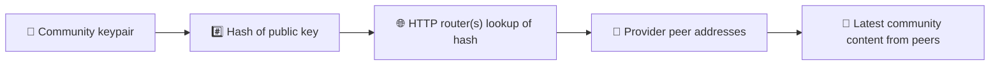
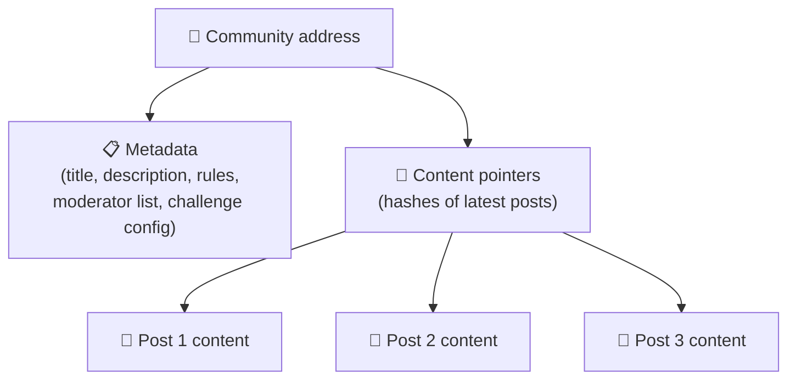
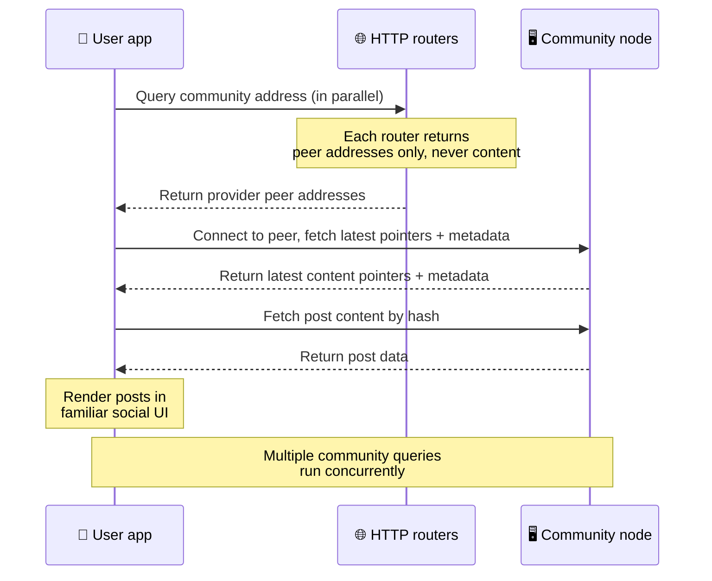
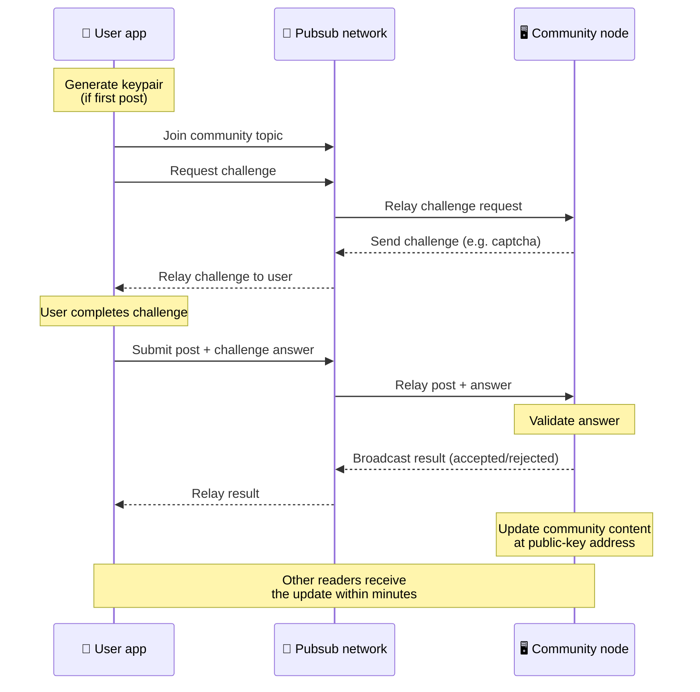
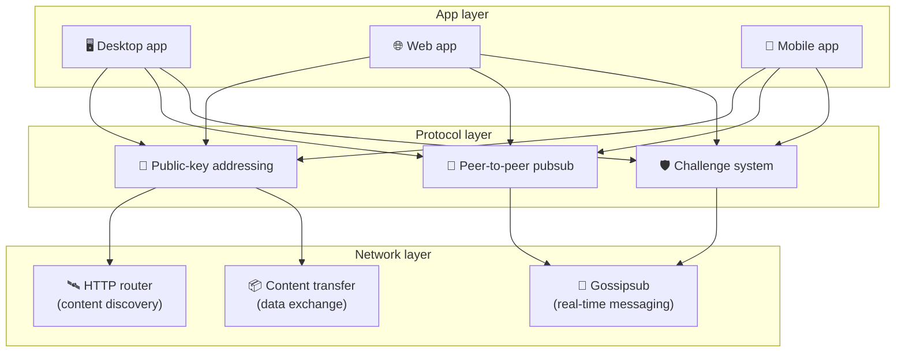

# Одноранговий протокол

Bitsocial не використовує ані блокчейн, ані сервер федерації, ані централізований бекенд. Натомість
він спирається на стек IPFS/libp2p, поєднуючи дві ідеї: **адресацію за відкритим ключем** та
**одноранговий pubsub**. Разом вони дають змогу будь-кому тримати спільноту на побутовому обладнанні,
а користувачам — читати й публікувати дописи без облікових записів у будь-якому сервісі, що належить
компанії.

Менш технічний огляд читайте в статті
[Повне пояснення протоколу Bitsocial простими словами](./layman-protocol-explanation.md).

## Чи використовує Bitsocial IPFS?

Так. Вузли Bitsocial використовують примітиви IPFS/libp2p для однорангового рівня: записи спільнот,
адресовані за відкритим ключем, передавання вмісту між вузлами та gossipsub-pubsub для повідомлень у
реальному часі. Коли в цій документації йдеться про «pubsub», мається на увазі pubsub з IPFS/libp2p,
а не окремий централізований брокер повідомлень.

Наразі протокол описує пошук через HTTP-маршрутизатори, бо клієнти Bitsocial запитують адреси
вузлів-постачальників у маршрутизаторів замість того, щоб для кожного пошуку покладатися на
непридатну для браузера DHT. Маршрутизатори повертають лише вузли; передавання вмісту й трафік pubsub
і далі проходять через однорангову мережу.

## Дві проблеми

Децентралізована соціальна мережа має відповісти на два запитання:

1. **Дані** — як зберігати й віддавати світовий соціальний вміст без центральної бази даних?
2. **Спам** — як запобігати зловживанням, залишаючи мережу безкоштовною для користування?

Проблему даних Bitsocial розв’язує, повністю відмовляючись від блокчейну: соціальним медіа не
потрібні ані глобальне впорядкування транзакцій, ані вічна доступність кожного старого допису.
Проблему спаму він розв’язує, дозволяючи кожній спільноті проводити власну антиспам-перевірку в
одноранговій мережі.

Про модель пошуку, що працює над цим мережевим рівнем, читайте в розділі
[Відкриття вмісту](./content-discovery.md).

---

## Адресація за відкритим ключем {#public-key-based-addressing}

У BitTorrent адресою файлу стає його хеш (_адресація за вмістом_). Bitsocial застосовує схожу ідею до
відкритих ключів: мережевою адресою спільноти стає хеш її відкритого ключа.

Будь-який вузол мережі може запитати цю адресу в **HTTP-маршрутизатора**: маршрутизатор повертає
список мережевих адрес вузлів, які наразі надають хеш спільноти, і клієнт напряму під’єднується до
них, щоб отримати останній стан спільноти. Щоразу, коли вміст оновлюється, номер його версії зростає.
Мережа зберігає лише останню версію — потреби тримати кожен історичний стан немає, і саме тому цей
підхід легший за блокчейн.

> **Що насправді зберігає HTTP-маршрутизатор.** HTTP-маршрутизатор — це тонкий покажчик. Для кожної
> відомої йому адреси вмісту він зберігає лише мережеві адреси вузлів, які оголосили себе
> постачальниками (пари IP та порту, мультиадреси libp2p тощо). Він **не** зберігає ані вмісту
> спільноти, ані її метаданих, тексту дописів, списку учасників чи навіть зрозумілої людині назви
> того, що лежить за цією адресою; він лише відповідає на запитання «які вузли стверджують, що мають
> цей хеш?». Завдяки цьому маршрутизатори дешеві в обслуговуванні, їх легко замінити, і вони не
> відповідають за те, що публікують користувачі, — схоже на трекер BitTorrent, але без
> торент-метаданих: трекер зіставляє infohash з вузлами, а HTTP-маршрутизатор зіставляє адресу вмісту
> лише з адресами вузлів-постачальників.
>
> Задля надійності клієнт опитує **кілька HTTP-маршрутизаторів паралельно** й об’єднує отримані
> списки постачальників. Запустити маршрутизатор може будь-хто, а заміна чи додавання
> маршрутизаторів — це зміна конфігурації без міграції даних.
>
> Bitsocial використовує HTTP-маршрутизатори замість DHT, бо утримувати DHT у масштабі, потрібному
> для пошуку вмісту, дорого, особливо для мобільних пристроїв. До того ж DHT не працює в браузері,
> оскільки браузери не можуть напряму приєднатися до libp2p-DHT. HTTP-маршрутизатор дешево працює на
> звичайній HTTP-інфраструктурі й однаково добре обслуговує і телефон, і браузер.

### Що зберігається за адресою

Адреса спільноти не містить повного вмісту дописів безпосередньо. Натомість за нею лежить список
ідентифікаторів вмісту — хешів, які вказують на самі дані. Далі клієнт завантажує кожну частину
вмісту напряму від вузлів, які повернули HTTP-маршрутизатори. Самі маршрутизатори ніколи не бачать і
не зберігають вмісту.

Принаймні один вузол завжди має ці дані: вузол оператора спільноти. Якщо спільнота популярна, її дані
будуть і в багатьох інших вузлів, а навантаження розподілиться саме собою — так само, як популярні
торенти завантажуються швидше.

---

## Одноранговий pubsub

Pubsub (publish-subscribe) — це модель обміну повідомленнями, у якій вузли підписуються на тему й
отримують кожне повідомлення, опубліковане в цій темі. Bitsocial використовує однорангову мережу
pubsub: публікувати може будь-хто, підписуватися може будь-хто, і центрального брокера повідомлень
немає.

Щоб опублікувати допис у спільноті, користувач надсилає повідомлення, темою якого є відкритий ключ
цієї спільноти. Вузол оператора спільноти підхоплює його, перевіряє і — якщо антиспам-перевірку
пройдено — вносить його в наступне оновлення вмісту.

---

## Антиспам: перевірки через pubsub

Відкрита мережа pubsub вразлива до спамових навал. Bitsocial розв’язує це, вимагаючи від тих, хто
публікує, пройти **перевірку**, перш ніж їхній вміст буде прийнято.

Система перевірок гнучка: кожен оператор спільноти налаштовує власну політику. Серед варіантів:

| Тип перевірки         | Як це працює                                               |
| --------------------- | ---------------------------------------------------------- |
| **Captcha**           | Візуальна або інтерактивна головоломка в застосунку        |
| **Обмеження частоти** | Обмеження кількості дописів на одну особу за проміжок часу |
| **Токен-гейт**        | Вимога підтвердити баланс певного токена                   |
| **Оплата**            | Вимога невеликої оплати за допис                           |
| **Список дозволених** | Публікувати можуть лише попередньо схвалені особи          |
| **Власний код**       | Будь-яка політика, яку можна виразити кодом                |

Вузли, які ретранслюють забагато невдалих спроб перевірки, блокуються в темі pubsub, і це запобігає
атакам на відмову в обслуговуванні на мережевому рівні.

---

## Життєвий цикл: читання спільноти

Ось що відбувається, коли користувач відкриває застосунок і переглядає останні дописи спільноти.

**Крок за кроком:**

1. Користувач відкриває застосунок і бачить соціальний інтерфейс.
2. Клієнт паралельно опитує кілька HTTP-маршрутизаторів для кожної спільноти, за якою стежить
   користувач; кожен маршрутизатор повертає лише адреси вузлів, ніколи не вміст. Затримка запиту
   залежить від стану мережі та навантаження на маршрутизатор; за типових умов із низькою затримкою
   запити зазвичай повертаються приблизно за секунду й виконуються одночасно.
3. Отримавши адреси вузлів, клієнт під’єднується до них і завантажує останні покажчики вмісту
   спільноти та метадані (назву, опис, список модераторів, конфігурацію перевірки).
4. За цими покажчиками клієнт завантажує сам вміст дописів і відображає все у звичному соціальному
   інтерфейсі.

---

## Життєвий цикл: публікація допису

Перед тим як допис буде прийнято, через pubsub відбувається рукостискання «перевірка — відповідь».

**Крок за кроком:**

1. Якщо в користувача ще немає пари ключів, застосунок її генерує.
2. Користувач пише допис для спільноти.
3. Клієнт приєднується до теми pubsub цієї спільноти (прив’язаної до відкритого ключа спільноти).
4. Клієнт запитує перевірку через pubsub.
5. Вузол оператора спільноти надсилає у відповідь перевірку (наприклад, captcha).
6. Користувач проходить перевірку.
7. Клієнт надсилає допис разом із відповіддю на перевірку через pubsub.
8. Вузол оператора спільноти перевіряє відповідь. Якщо вона правильна, допис приймається.
9. Вузол розсилає результат через pubsub, щоб вузли мережі знали, що повідомлення від цього
   користувача треба ретранслювати й далі.
10. Вузол оновлює вміст спільноти за її адресою на основі відкритого ключа.
11. За кілька хвилин оновлення отримує кожен читач спільноти.

---

## Огляд архітектури

Уся система складається з трьох рівнів, які працюють разом:

| Рівень         | Роль                                                                                                                                                             |
| -------------- | ---------------------------------------------------------------------------------------------------------------------------------------------------------------- |
| **Застосунок** | Інтерфейс користувача. Застосунків може бути багато, кожен зі своїм дизайном, і всі вони працюють з тими самими спільнотами та ідентичностями.                   |
| **Протокол**   | Визначає, як адресуються спільноти, як публікуються дописи і як стримується спам.                                                                                |
| **Мережа**     | Базова однорангова інфраструктура: HTTP-маршрутизатори для пошуку, gossipsub для обміну повідомленнями в реальному часі та передавання вмісту для обміну даними. |

---

## Приватність: розрив зв’язку між авторами та IP-адресами

Коли користувач публікує допис, вміст **шифрується відкритим ключем оператора спільноти**, перш ніж
потрапити в мережу pubsub. Тож спостерігачі в мережі можуть бачити, що вузол опублікував _щось_, але
не можуть визначити:

- що саме сказано у вмісті
- яка авторська ідентичність це опублікувала

Це схоже на те, як BitTorrent дає змогу дізнатися, які IP-адреси роздають торент, але не хто його
створив. Рівень шифрування додає ще одну гарантію приватності поверх цієї базової.

---

## Одноранговий зв’язок у браузері

P2P у браузері вже працює в клієнтах Bitsocial. Браузерний застосунок може запускати вузол
[Helia](https://helia.io/), використовувати той самий клієнтський стек протоколу Bitsocial, що й інші
застосунки, і забирати вміст в інших вузлів замість того, щоб просити централізований шлюз IPFS
віддати його. Браузер також може брати участь у pubsub напряму, тож в основному сценарії публікація
не потребує постачальника pubsub, який належить платформі.

Це важлива віха для розповсюдження через веб: звичайний HTTPS-сайт може відкритися як живий
соціальний P2P-клієнт. Користувачам не треба встановлювати настільний застосунок, щоб почати читати з
мережі, а оператору застосунку не треба тримати центральний шлюз, який стає вузьким місцем цензури
або модерації для кожного користувача браузера.

Браузерний шлях має інші обмеження, ніж вузол на комп’ютері чи сервері:

- браузерний вузол зазвичай не може приймати довільні вхідні з’єднання з публічного інтернету
- він може завантажувати, перевіряти, кешувати й публікувати дані, доки застосунок відкритий
- його не варто вважати довготривалим сховищем для даних спільноти
- повноцінний хостинг спільноти й далі найкраще довіряти настільному застосунку, `bitsocial-cli` або
  іншому вузлу, що працює постійно

HTTP-маршрутизатори й далі важливі для пошуку вмісту: вони повертають адреси постачальників для хешу
спільноти. Це не шлюзи IPFS, бо самого вмісту вони не віддають. Після пошуку браузерний клієнт
під’єднується до вузлів і забирає дані через P2P-стек.

P2P у браузері тепер є типовим вебшляхом, а не експериментом за перемикачем. 5chan за замовчуванням
працює як чистий браузерний P2P на 5chan.app, і блог Bitsocial на bitsocial.net робить те саме.
Браузерні вузли з’єднуються через захищені WebSockets; `pkc-js` за замовчуванням забороняє з’єднання
через WebRTC і WebTransport, бо в браузері їхні шляхи встановлення з’єднання повільні й ненадійні.
Зміною в апстрімі, яка зробила публікацію з браузера практичною у 2026 році, стало виправлення
порядкових номерів gossipsub у `@libp2p/gossipsub` 15.0.21: після нього вузли Kubo перестали
відкидати повідомлення, опубліковані вузлами на JavaScript.

Повну картину, зокрема те, чого браузерний вузол досі не вміє, дивіться в розділі
[Одноранговий зв’язок у браузері](/browser-p2p/).

## Резервний варіант зі шлюзом {#gateway-fallback}

Доступ із браузера через шлюз досі корисний як резервний варіант для сумісності та поступового
впровадження. Шлюз може передавати дані між P2P-мережею та браузерним клієнтом, коли браузер не може
приєднатися до мережі напряму або коли застосунок свідомо обирає старіший шлях. Такі шлюзи:

- може запускати будь-хто
- не потребують облікових записів чи платежів
- не отримують контролю над ідентичностями користувачів чи спільнотами
- можна замінити без втрати даних

Цільова архітектура — спершу P2P у браузері, а шлюзи як необов’язковий резерв, а не типове вузьке
місце.

---

## Чому не блокчейн?

Блокчейни розв’язують проблему подвійних витрат: їм потрібно знати точний порядок кожної транзакції,
щоб ніхто не витратив ту саму монету двічі.

У соціальних медіа проблеми подвійних витрат немає. Не має значення, чи допис A опубліковано на
мілісекунду раніше за допис B, а старі дописи не мусять бути вічно доступні на кожному вузлі.

Відмовившись від блокчейну, Bitsocial уникає:

- **комісій за газ** — публікація безкоштовна
- **обмежень пропускної здатності** — немає вузького місця у вигляді розміру чи часу блока
- **розростання сховища** — вузли зберігають лише те, що їм потрібно
- **накладних витрат на консенсус** — не потрібні ані майнери, ані валідатори, ані стейкінг

Компроміс у тому, що Bitsocial не гарантує вічної доступності старого вмісту. Але для соціальних
медіа це прийнятний компроміс: дані тримає вузол оператора спільноти, популярний вміст розходиться
між багатьма вузлами, а дуже старі дописи природно згасають — так само, як на кожній соціальній
платформі.

## Чому не федерація?

Федеративні мережі (як електронна пошта чи платформи на основі ActivityPub) кращі за централізовані,
але й далі мають структурні обмеження:

- **Залежність від сервера** — кожній спільноті потрібен сервер із доменом, TLS і постійним
  обслуговуванням
- **Довіра до адміністратора** — адміністратор сервера повністю контролює облікові записи та вміст
  користувачів
- **Фрагментація** — перехід між серверами часто означає втрату підписників, історії чи ідентичності
- **Вартість** — хтось має платити за хостинг, а це створює тиск у бік укрупнення

Одноранговий підхід Bitsocial узагалі прибирає сервер із рівняння. Вузол спільноти може працювати на
ноутбуці, Raspberry Pi чи дешевому VPS. Оператор керує політикою модерації, але не може відібрати
ідентичності користувачів, бо ними керують пари ключів, а не сервер.

## А як щодо Nostr?

Nostr не вкладається чітко в жодну з категорій. Це не федерація в стилі ActivityPub, бо облікові
записи користувачам не видає інстанс, а ідентичність не прив’язана до одного сервера. Це й не
блокчейн-соцмережа, бо тут немає ані ланцюжка, ані консенсусу, ані газу, ані глобального порядку
транзакцій.

Nostr краще описувати як **соціальні медіа на основі реле**. У базовому протоколі
([NIP-01](https://github.com/nostr-protocol/nips/blob/master/01.md)) користувачі тримають пари
ключів, підписують події та публікують їх на WebSocket-реле. Клієнти підписуються на реле з
фільтрами, отримують відповідні події й локально перевіряють підписи. Користувачі також можуть
публікувати метадані зі списком реле
([NIP-65](https://github.com/nostr-protocol/nips/blob/master/65.md)), які підказують клієнтам, на які
реле вони зазвичай пишуть і з яких воліють читати згадки.

Це робить Nostr ближчим до Bitsocial, ніж федеративні чи блокчейн-системи, в одному важливому
аспекті: ідентичність криптографічна й переносна. Головна відмінність — рівень даних. У Nostr реле є
звичайним рівнем зберігання й доставки. У Bitsocial HTTP-маршрутизатори лише допомагають клієнтам
знайти вузли. Маршрутизатори не зберігають ані дописів, ані профілів, ані метаданих спільнот, ані
стану модерації; вони повертають адреси вузлів-постачальників, а вміст клієнти забирають уже в самих
вузлів.

Зі спільнотами той самий поділ. У Nostr є необов’язкові підходи для
[груп на основі реле](https://github.com/nostr-protocol/nips/blob/master/29.md) та
[спільнот зі схваленням модератора](https://github.com/nostr-protocol/nips/blob/master/72.md), але
вони все одно залежать від політики реле, стану групи, що зберігається на реле, або від того, які
схвалення вирішить враховувати клієнт. Bitsocial розглядає спільноти як повноцінні криптографічні
об’єкти, чий вузол-оператор перевіряє дописи, застосовує політику перевірок спільноти та публікує
останній прийнятий стан в однорангову мережу.

| Питання              | Nostr                                                                                             | Bitsocial                                                                |
| -------------------- | ------------------------------------------------------------------------------------------------- | ------------------------------------------------------------------------ |
| Категорія            | Протокол на основі реле                                                                           | Однорангова мережа спільнот                                              |
| Ідентичність         | Відкритий ключ користувача                                                                        | Пари ключів користувача та спільноти                                     |
| Шлях даних           | Підписані події публікуються на реле                                                              | Адреса за відкритим ключем веде до вузлів; вміст завантажується з вузлів |
| Хто тримає це онлайн | Реле, обрані користувачами й клієнтами                                                            | Вузол власника спільноти плюс допоміжні сідери                           |
| Спільноти            | Необов’язкові групи на основі реле або спільноти зі схваленням модератора                         | Повноцінні об’єкти спільнот із модерацією під контролем оператора        |
| Антиспам             | Політика реле, автентифікація, оплата, proof-of-work, клієнтські фільтри або схвалення модератора | Визначена спільнотою логіка перевірки перед включенням                   |
| Головний компроміс   | Переносна ідентичність, але доступність і політика залежать від реле                              | Менша залежність від реле, але старий вміст не гарантований назавжди     |

---

## Підсумок

Bitsocial побудований на двох примітивах: адресації за відкритим ключем для пошуку вмісту та
одноранговому pubsub для спілкування в реальному часі. Разом вони дають соціальну мережу, де:

- спільноти визначаються криптографічними ключами, а не доменними іменами
- вміст розходиться між вузлами, як торент, а не віддається з єдиної бази даних
- стійкість до спаму належить кожній спільноті окремо, а не нав’язана платформою
- користувачі володіють своїми ідентичностями через пари ключів, а не через облікові записи, які
  можна відкликати
- уся система працює без серверів, блокчейнів і платформних комісій
