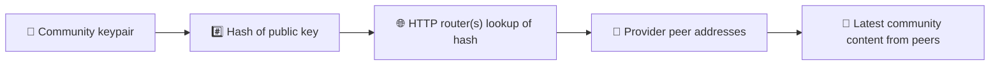
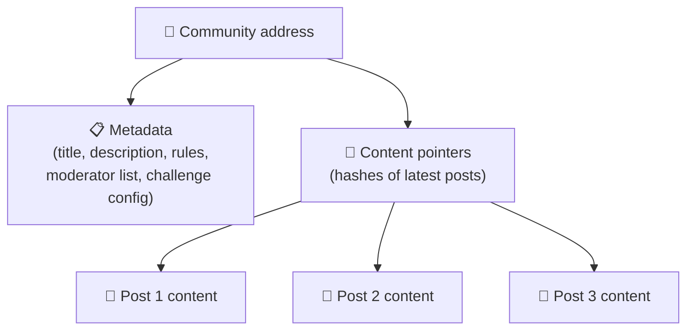
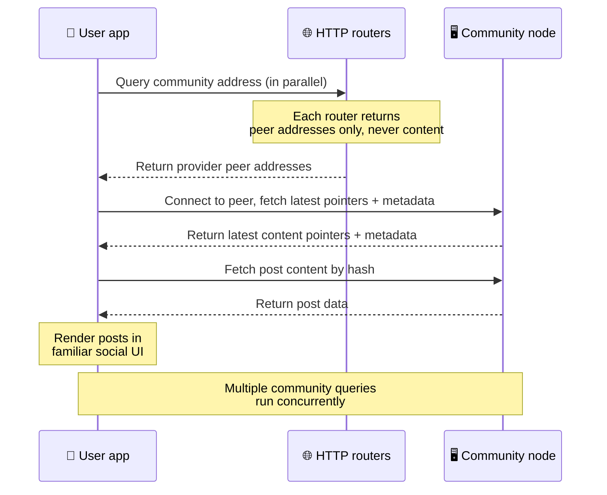
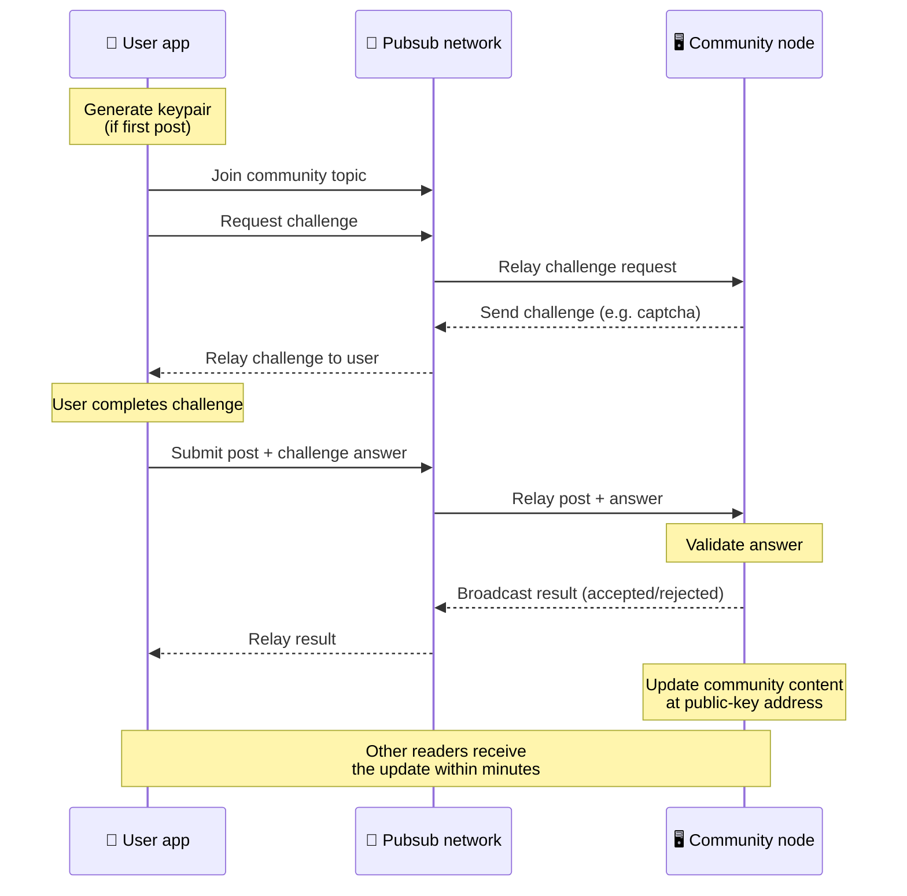
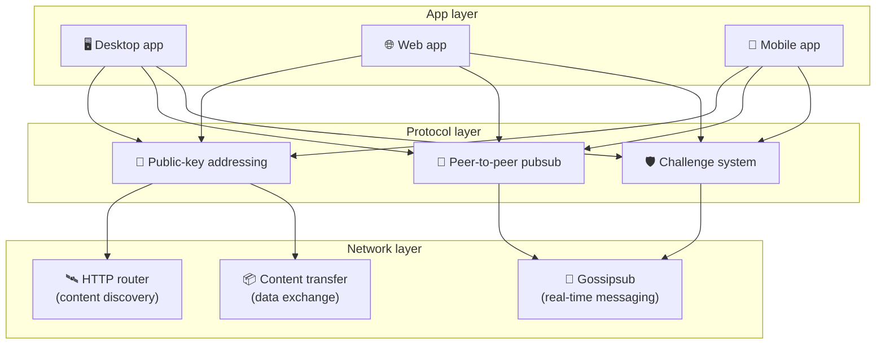

# پیئر ٹو پیئر پروٹوکول

Bitsocial نہ کوئی بلاک چین استعمال کرتا ہے، نہ فیڈریشن سرور، اور نہ کوئی مرکزی بیک اینڈ۔ اس کے بجائے یہ
IPFS/libp2p اسٹیک کے ذریعے دو تصورات کو یکجا کرتا ہے: **عوامی کلید پر مبنی ایڈریسنگ** اور
**پیئر ٹو پیئر pubsub**۔ دونوں مل کر کسی بھی شخص کو عام گھریلو ہارڈ ویئر سے کمیونٹی چلانے کے قابل بناتے
ہیں، جبکہ صارفین کسی کمپنی کے زیرِ کنٹرول سروس پر اکاؤنٹ بنائے بغیر پڑھ اور پوسٹ کر سکتے ہیں۔

کم تکنیکی وضاحت کے لیے
[Bitsocial پروٹوکول کی مکمل عام فہم وضاحت](./layman-protocol-explanation.md) پڑھیں۔

## کیا Bitsocial، IPFS استعمال کرتا ہے؟

جی ہاں۔ Bitsocial نوڈز پیئر ٹو پیئر پرت کے لیے IPFS/libp2p کے بنیادی اجزا استعمال کرتے ہیں: عوامی کلید
سے ایڈریس کیے گئے کمیونٹی ریکارڈز، پیئرز کے درمیان مواد کی منتقلی، اور فوری پیغامات کے لیے gossipsub
pubsub۔ جب یہ دستاویزات "pubsub" کہتی ہیں تو ان کی مراد IPFS/libp2p کا pubsub ہوتا ہے، کوئی الگ مرکزی
میسج بروکر نہیں۔

پروٹوکول فی الحال دریافت کو HTTP راؤٹرز کے ذریعے بیان کرتا ہے، کیونکہ Bitsocial کلائنٹس ہر تلاش کے لیے
براؤزر کے لیے ناموزوں DHT پر انحصار کرنے کے بجائے راؤٹر اینڈ پوائنٹس سے فراہم کنندہ پیئرز کے پتے پوچھتے
ہیں۔ راؤٹرز صرف پیئرز واپس کرتے ہیں؛ مواد کی منتقلی اور pubsub ٹریفک اب بھی پیئر ٹو پیئر نیٹ ورک ہی سے
گزرتے ہیں۔

## دو مسائل

ایک غیر مرکزی سوشل نیٹ ورک کو دو سوالوں کا جواب دینا ہوتا ہے:

1. **ڈیٹا** — مرکزی ڈیٹا بیس کے بغیر دنیا بھر کا سوشل مواد کیسے محفوظ اور پیش کیا جائے؟
2. **اسپیم** — نیٹ ورک کو استعمال کے لیے مفت رکھتے ہوئے غلط استعمال کیسے روکا جائے؟

Bitsocial ڈیٹا کا مسئلہ بلاک چین کو مکمل طور پر چھوڑ کر حل کرتا ہے: سوشل میڈیا کو نہ عالمی سطح پر لین دین
کی ترتیب درکار ہے اور نہ ہر پرانی پوسٹ کی مستقل دستیابی۔ اسپیم کا مسئلہ یہ اس طرح حل کرتا ہے کہ ہر
کمیونٹی پیئر ٹو پیئر نیٹ ورک پر اپنا اینٹی اسپیم چیلنج خود چلاتی ہے۔

اس نیٹ ورک پرت کے اوپر موجود دریافت کے ماڈل کے لیے [مواد کی دریافت](./content-discovery.md) دیکھیں۔

---

## عوامی کلید پر مبنی ایڈریسنگ {#public-key-based-addressing}

BitTorrent میں فائل کا ہیش ہی اس کا پتہ بن جاتا ہے (_مواد پر مبنی ایڈریسنگ_)۔ Bitsocial عوامی کلیدوں کے
ساتھ اسی سے ملتا جلتا تصور استعمال کرتا ہے: کسی کمیونٹی کی عوامی کلید کا ہیش اس کا نیٹ ورک ایڈریس بن جاتا
ہے۔

نیٹ ورک پر موجود کوئی بھی پیئر اس پتے کے لیے کسی **HTTP راؤٹر** سے استفسار کر سکتا ہے: راؤٹر ان پیئرز کے
نیٹ ورک پتوں کی فہرست واپس کرتا ہے جو اس وقت کمیونٹی کا ہیش فراہم کر رہے ہوتے ہیں، اور کلائنٹ کمیونٹی کی
تازہ ترین حالت لانے کے لیے براہِ راست انہی پیئرز سے جڑ جاتا ہے۔ جب بھی مواد اپ ڈیٹ ہوتا ہے، اس کا ورژن
نمبر بڑھ جاتا ہے۔ نیٹ ورک صرف تازہ ترین ورژن رکھتا ہے — ہر پرانی حالت محفوظ رکھنے کی ضرورت نہیں، اور یہی
چیز اس طریقے کو بلاک چین کے مقابلے میں ہلکا پھلکا بناتی ہے۔

> **HTTP راؤٹر کے پاس دراصل کیا ہوتا ہے۔** HTTP راؤٹر ایک پتلا سا انڈیکس ہے۔ اسے معلوم ہر مواد کے پتے کے
> لیے یہ صرف ان پیئرز کے نیٹ ورک پتے رکھتا ہے جنہوں نے خود کو فراہم کنندہ کے طور پر ظاہر کیا (IP اور پورٹ
> کے جوڑے، libp2p ملٹی ایڈریسز، وغیرہ)۔ یہ کمیونٹی کا مواد، اس کا میٹا ڈیٹا، پوسٹ کا متن، ممبر فہرست،
> حتیٰ کہ اس پتے پر موجود چیز کا انسانی پڑھنے کے قابل نام بھی محفوظ **نہیں** کرتا؛ یہ صرف اتنا بتاتا ہے
> کہ "کن پیئرز کا دعویٰ ہے کہ ان کے پاس یہ ہیش ہے؟"۔ اسی لیے راؤٹرز چلانا سستا ہے، انہیں بدلنا آسان ہے،
> اور صارفین جو کچھ شائع کرتے ہیں اس کے وہ ذمہ دار نہیں ہوتے — کچھ کچھ BitTorrent ٹریکر جیسا، مگر ٹورنٹ
> میٹا ڈیٹا کے بغیر: ٹریکر انفو ہیشز کو پیئرز سے جوڑتا ہے، جبکہ HTTP راؤٹر صرف ایک مواد کے پتے کو فراہم
> کنندہ پیئرز کے پتوں سے جوڑتا ہے۔
>
> اضافی بھروسے کے لیے کلائنٹ **کئی HTTP راؤٹرز سے بیک وقت** استفسار کرتا ہے اور جو فراہم کنندہ فہرستیں
> واپس آتی ہیں انہیں یکجا کر لیتا ہے۔ راؤٹر کوئی بھی چلا سکتا ہے، اور راؤٹرز بدلنا یا نئے شامل کرنا محض
> ایک کنفیگ تبدیلی ہے جس میں ڈیٹا کی کوئی منتقلی درکار نہیں۔
>
> Bitsocial، DHT کے بجائے HTTP راؤٹرز اس لیے استعمال کرتا ہے کہ مواد کی دریافت کے لیے درکار پیمانے پر DHT
> چلانا مہنگا پڑتا ہے، خاص طور پر موبائل پر۔ DHT براؤزر میں کام بھی نہیں کرتا، کیونکہ براؤزر براہِ راست
> libp2p DHT میں شامل نہیں ہو سکتے۔ HTTP راؤٹر عام HTTP انفراسٹرکچر پر سستے داموں چلتا ہے اور فون ہو یا
> براؤزر، دونوں پر یکساں اچھا کام کرتا ہے۔

### پتے پر کیا محفوظ ہوتا ہے

کمیونٹی کے پتے میں پوسٹ کا پورا مواد براہِ راست موجود نہیں ہوتا۔ اس کے بجائے وہاں مواد کے شناخت کنندگان
کی فہرست رکھی جاتی ہے — ایسے ہیشز جو اصل ڈیٹا کی طرف اشارہ کرتے ہیں۔ اس کے بعد کلائنٹ مواد کا ہر حصہ
براہِ راست ان پیئرز سے لاتا ہے جو HTTP راؤٹرز نے واپس کیے تھے۔ راؤٹرز خود نہ کبھی مواد دیکھتے ہیں، نہ
محفوظ کرتے ہیں۔

کم از کم ایک پیئر کے پاس ڈیٹا ہمیشہ موجود ہوتا ہے: کمیونٹی چلانے والے کا نوڈ۔ اگر کمیونٹی مقبول ہو تو بہت
سے دوسرے پیئرز کے پاس بھی یہ ڈیٹا آ جاتا ہے اور بوجھ خود بخود بٹ جاتا ہے، بالکل اسی طرح جیسے مقبول ٹورنٹس
زیادہ تیزی سے ڈاؤن لوڈ ہوتے ہیں۔

---

## پیئر ٹو پیئر pubsub

pubsub (پبلش-سبسکرائب) پیغام رسانی کا ایسا طریقہ ہے جس میں پیئرز کسی ٹاپک کو سبسکرائب کرتے ہیں اور اس
ٹاپک پر شائع ہونے والا ہر پیغام وصول کرتے ہیں۔ Bitsocial ایک پیئر ٹو پیئر pubsub نیٹ ورک استعمال کرتا ہے
— کوئی بھی شائع کر سکتا ہے، کوئی بھی سبسکرائب کر سکتا ہے، اور کوئی مرکزی میسج بروکر نہیں ہوتا۔

کسی کمیونٹی میں پوسٹ شائع کرنے کے لیے صارف ایسا پیغام شائع کرتا ہے جس کا ٹاپک اس کمیونٹی کی عوامی کلید کے
برابر ہو۔ کمیونٹی چلانے والے کا نوڈ اسے اٹھاتا ہے، اس کی جانچ کرتا ہے، اور اگر وہ اینٹی اسپیم چیلنج پاس
کر لے تو اسے اگلے مواد اپ ڈیٹ میں شامل کر دیتا ہے۔

---

## اینٹی اسپیم: pubsub پر چیلنجز

کھلا pubsub نیٹ ورک اسپیم کے سیلاب کا شکار ہو سکتا ہے۔ Bitsocial اس کا حل یوں نکالتا ہے کہ شائع کرنے
والوں کو اپنا مواد قبول ہونے سے پہلے ایک **چیلنج** مکمل کرنا پڑتا ہے۔

چیلنج کا نظام لچکدار ہے: ہر کمیونٹی چلانے والا اپنی پالیسی خود طے کرتا ہے۔ دستیاب اختیارات میں شامل ہیں:

| چیلنج کی قسم       | یہ کیسے کام کرتا ہے                            |
| ------------------ | ---------------------------------------------- |
| **کیپچا**          | ایپ میں دکھایا جانے والا بصری یا تعاملی معمہ   |
| **ریٹ لمٹنگ**      | فی شناخت، ایک مقررہ وقفے میں پوسٹس کی حد       |
| **ٹوکن گیٹ**       | کسی مخصوص ٹوکن کے بیلنس کا ثبوت لازمی          |
| **ادائیگی**        | فی پوسٹ ایک معمولی ادائیگی لازمی               |
| **اجازت فہرست**    | صرف پہلے سے منظور شدہ شناختیں پوسٹ کر سکتی ہیں |
| **حسبِ ضرورت کوڈ** | کوئی بھی پالیسی جو کوڈ میں لکھی جا سکے         |

جو پیئرز بہت زیادہ ناکام چیلنج کوششیں ریلے کرتے ہیں، انہیں pubsub ٹاپک سے بلاک کر دیا جاتا ہے، جس سے
نیٹ ورک پرت پر ڈینائل آف سروس حملے رک جاتے ہیں۔

---

## لائف سائیکل: کمیونٹی پڑھنا

جب کوئی صارف ایپ کھول کر کسی کمیونٹی کی تازہ ترین پوسٹس دیکھتا ہے تو یہ سب ہوتا ہے۔

**قدم بہ قدم:**

1. صارف ایپ کھولتا ہے اور اسے ایک سوشل انٹرفیس نظر آتا ہے۔
2. کلائنٹ صارف کی فالو کی ہوئی ہر کمیونٹی کے لیے کئی HTTP راؤٹرز سے بیک وقت استفسار کرتا ہے؛ ہر راؤٹر
   صرف پیئرز کے پتے واپس کرتا ہے، مواد کبھی نہیں۔ استفسار میں لگنے والا وقت نیٹ ورک کے حالات اور راؤٹر
   پر بوجھ پر منحصر ہوتا ہے؛ عام کم تاخیر والے حالات میں جواب اکثر تقریباً ایک سیکنڈ کے اندر آ جاتا ہے
   اور یہ استفسارات ساتھ ساتھ چلتے ہیں۔
3. پیئرز کے پتے مل جانے کے بعد کلائنٹ ان پیئرز سے جڑتا ہے اور کمیونٹی کے تازہ ترین مواد کے پوائنٹرز اور
   میٹا ڈیٹا (عنوان، تفصیل، ماڈریٹر فہرست، چیلنج کی ترتیب) حاصل کرتا ہے۔
4. کلائنٹ ان پوائنٹرز کی مدد سے اصل پوسٹ مواد لاتا ہے، پھر سب کچھ ایک مانوس سوشل انٹرفیس میں دکھا دیتا
   ہے۔

---

## لائف سائیکل: پوسٹ شائع کرنا

پوسٹ قبول ہونے سے پہلے pubsub پر ایک چیلنج-جواب ہینڈ شیک ہوتا ہے۔

**قدم بہ قدم:**

1. اگر صارف کے پاس پہلے سے کلیدی جوڑا نہ ہو تو ایپ اس کے لیے ایک کلیدی جوڑا بناتی ہے۔
2. صارف کسی کمیونٹی کے لیے پوسٹ لکھتا ہے۔
3. کلائنٹ اس کمیونٹی کے pubsub ٹاپک میں شامل ہوتا ہے (جو کمیونٹی کی عوامی کلید سے منسلک ہوتا ہے)۔
4. کلائنٹ pubsub پر چیلنج کی درخواست کرتا ہے۔
5. کمیونٹی چلانے والے کا نوڈ جواب میں ایک چیلنج بھیجتا ہے (مثلاً کیپچا)۔
6. صارف چیلنج مکمل کرتا ہے۔
7. کلائنٹ pubsub پر پوسٹ کے ساتھ چیلنج کا جواب جمع کراتا ہے۔
8. کمیونٹی چلانے والے کا نوڈ جواب کی جانچ کرتا ہے۔ درست ہونے پر پوسٹ قبول کر لی جاتی ہے۔
9. نوڈ نتیجہ pubsub پر نشر کرتا ہے تاکہ نیٹ ورک کے پیئرز کو معلوم ہو جائے کہ اس صارف کے پیغامات ریلے
   کرتے رہنے ہیں۔
10. نوڈ کمیونٹی کا مواد اس کے عوامی کلید والے پتے پر اپ ڈیٹ کر دیتا ہے۔
11. چند ہی منٹوں میں کمیونٹی کے ہر قاری تک یہ اپ ڈیٹ پہنچ جاتا ہے۔

---

## فنِ تعمیر کا جائزہ

پورے نظام کی تین پرتیں ہیں جو مل کر کام کرتی ہیں:

| پرت          | کردار                                                                                                                                    |
| ------------ | ---------------------------------------------------------------------------------------------------------------------------------------- |
| **ایپ**      | صارف انٹرفیس۔ کئی ایپس موجود ہو سکتی ہیں، ہر ایک کا اپنا ڈیزائن، مگر سب ایک ہی کمیونٹیز اور شناختوں میں شریک۔                            |
| **پروٹوکول** | طے کرتا ہے کہ کمیونٹیز کو کیسے ایڈریس کیا جائے، پوسٹس کیسے شائع ہوں، اور اسپیم کیسے روکا جائے۔                                           |
| **نیٹ ورک**  | بنیادی پیئر ٹو پیئر انفراسٹرکچر: دریافت کے لیے HTTP راؤٹرز، فوری پیغام رسانی کے لیے gossipsub، اور ڈیٹا کے تبادلے کے لیے مواد کی منتقلی۔ |

---

## پرائیویسی: مصنفین کو IP پتوں سے الگ رکھنا

جب کوئی صارف پوسٹ شائع کرتا ہے تو pubsub نیٹ ورک میں داخل ہونے سے پہلے مواد **کمیونٹی چلانے والے کی
عوامی کلید سے خفیہ کر دیا جاتا ہے**۔ اس کا مطلب یہ ہے کہ نیٹ ورک پر نظر رکھنے والے یہ تو دیکھ سکتے ہیں کہ
کسی پیئر نے _کچھ_ شائع کیا ہے، مگر یہ طے نہیں کر سکتے:

- مواد میں کیا لکھا ہے
- کس مصنف کی شناخت نے اسے شائع کیا

یہ کچھ ایسے ہی ہے جیسے BitTorrent میں یہ تو معلوم کیا جا سکتا ہے کہ کون سے IP کسی ٹورنٹ کو سیڈ کر رہے
ہیں، مگر یہ نہیں کہ اسے اصل میں بنایا کس نے تھا۔ خفیہ کاری کی پرت اس بنیادی سطح کے اوپر پرائیویسی کی ایک
اضافی ضمانت دیتی ہے۔

---

## براؤزر پیئر ٹو پیئر

Bitsocial کلائنٹس میں براؤزر P2P اب ممکن ہے۔ ایک براؤزر ایپ [Helia](https://helia.io/) نوڈ چلا سکتی ہے،
وہی Bitsocial پروٹوکول کلائنٹ اسٹیک استعمال کر سکتی ہے جو باقی ایپس استعمال کرتی ہیں، اور کسی مرکزی IPFS
گیٹ وے سے مواد مانگنے کے بجائے وہ مواد براہِ راست پیئرز سے لے سکتی ہے۔ براؤزر خود بھی pubsub میں شریک ہو
سکتا ہے، اس لیے معمول کی صورت میں پوسٹ کرنے کے لیے کسی پلیٹ فارم کے زیرِ ملکیت pubsub فراہم کنندہ کی
ضرورت نہیں رہتی۔

ویب پر تقسیم کے لیے یہ اہم سنگِ میل ہے: ایک عام HTTPS ویب سائٹ کھلتے ہی ایک زندہ P2P سوشل کلائنٹ بن سکتی
ہے۔ نیٹ ورک سے پڑھنے کے لیے صارفین کو پہلے ڈیسک ٹاپ ایپ انسٹال کرنے کی ضرورت نہیں، اور ایپ چلانے والے کو
ایسا مرکزی گیٹ وے چلانے کی ضرورت نہیں جو ہر براؤزر صارف کے لیے مواد کی روک تھام یا ماڈریشن کا واحد کنٹرول
پوائنٹ بن جائے۔

براؤزر والے راستے کی حدود ڈیسک ٹاپ یا سرور نوڈ سے مختلف ہیں:

- براؤزر نوڈ عام طور پر عوامی انٹرنیٹ سے آنے والے کسی بھی اِن باؤنڈ کنکشن کو قبول نہیں کر سکتا
- ایپ کھلی رہنے تک یہ ڈیٹا لوڈ، جانچ، کیش اور شائع کر سکتا ہے
- اسے کمیونٹی کے ڈیٹا کا دیرپا میزبان نہیں سمجھنا چاہیے
- کمیونٹی کی مکمل میزبانی اب بھی ڈیسک ٹاپ ایپ، `bitsocial-cli`، یا کسی اور ہمہ وقت چلنے والے نوڈ سے
  بہتر ہوتی ہے

مواد کی دریافت کے لیے HTTP راؤٹرز اب بھی اہم ہیں: وہ کسی کمیونٹی ہیش کے لیے فراہم کنندہ پتے واپس کرتے
ہیں۔ یہ IPFS گیٹ ویز نہیں ہیں، کیونکہ یہ مواد خود پیش نہیں کرتے۔ دریافت کے بعد براؤزر کلائنٹ پیئرز سے
جڑتا ہے اور ڈیٹا P2P اسٹیک کے ذریعے حاصل کرتا ہے۔

براؤزر P2P اب ویب کا ڈیفالٹ راستہ ہے، کسی سوئچ کے پیچھے چھپا کوئی تجربہ نہیں۔ 5chan بطورِ ڈیفالٹ
5chan.app پر خالص براؤزر P2P چلاتا ہے، اور bitsocial.net پر Bitsocial بلاگ بھی یہی کرتا ہے۔ براؤزر پیئرز
محفوظ WebSockets پر ڈائل کرتے ہیں؛ `pkc-js` بطورِ ڈیفالٹ WebRTC اور WebTransport ڈائلز کو مسترد کر دیتا
ہے، کیونکہ براؤزر میں ان کے کنکشن قائم کرنے کے راستے سست اور ناقابلِ اعتماد ہیں۔ 2026 میں براؤزر سے
اشاعت کو عملی بنانے والی اپ اسٹریم تبدیلی `@libp2p/gossipsub` 15.0.21 میں gossipsub سیکوینس نمبر کی
درستی تھی، جس کے بعد Kubo پیئرز نے JavaScript نوڈز کے شائع کردہ پیغامات ضائع کرنا بند کر دیا۔

مکمل تصویر کے لیے، بشمول اس کے کہ براؤزر نوڈ اب بھی کیا نہیں کر سکتا،
[براؤزر پیئر ٹو پیئر](/browser-p2p/) دیکھیں۔

## گیٹ وے فال بیک {#gateway-fallback}

گیٹ وے کے ذریعے براؤزر رسائی اب بھی مطابقت اور مرحلہ وار اجرا کے لیے مفید ہے۔ جب کوئی براؤزر براہِ راست
نیٹ ورک میں شامل نہ ہو سکے، یا ایپ جان بوجھ کر پرانا راستہ چنے، تو گیٹ وے P2P نیٹ ورک اور براؤزر کلائنٹ
کے درمیان ڈیٹا ریلے کر سکتا ہے۔ یہ گیٹ ویز:

- کوئی بھی چلا سکتا ہے
- ان کے لیے صارف اکاؤنٹس یا ادائیگیوں کی ضرورت نہیں ہوتی
- یہ صارفین کی شناخت یا کمیونٹیز پر تحویل حاصل نہیں کرتے
- ڈیٹا کھوئے بغیر انہیں بدلا جا سکتا ہے

مطلوبہ فنِ تعمیر یہ ہے کہ پہلے براؤزر P2P ہو، اور گیٹ ویز ڈیفالٹ رکاوٹ بننے کے بجائے ایک اختیاری فال بیک
رہیں۔

---

## بلاک چین کیوں نہیں؟

بلاک چینز ڈبل اسپینڈ کا مسئلہ حل کرتی ہیں: انہیں ہر لین دین کی درست ترتیب معلوم ہونی چاہیے تاکہ کوئی ایک
ہی سکہ دو بار خرچ نہ کر سکے۔

سوشل میڈیا میں ڈبل اسپینڈ کا مسئلہ نہیں ہوتا۔ اس سے فرق نہیں پڑتا کہ پوسٹ A، پوسٹ B سے ایک ملی سیکنڈ
پہلے شائع ہوئی، اور پرانی پوسٹس کا ہر نوڈ پر ہمیشہ دستیاب رہنا ضروری نہیں۔

بلاک چین چھوڑ دینے سے Bitsocial ان چیزوں سے بچ جاتا ہے:

- **گیس فیس** — پوسٹ کرنا مفت ہے
- **تھروپٹ کی حدود** — بلاک سائز یا بلاک ٹائم کی کوئی رکاوٹ نہیں
- **اسٹوریج کا پھیلاؤ** — نوڈز صرف وہی رکھتے ہیں جو انہیں درکار ہو
- **اتفاقِ رائے کا بوجھ** — کوئی مائنر، ویلیڈیٹر یا اسٹیکنگ درکار نہیں

اس کا نقصان یہ ہے کہ Bitsocial پرانے مواد کی مستقل دستیابی کی ضمانت نہیں دیتا۔ مگر سوشل میڈیا کے لیے یہ
قابلِ قبول سودا ہے: کمیونٹی چلانے والے کا نوڈ ڈیٹا رکھتا ہے، مقبول مواد بہت سے پیئرز تک پھیل جاتا ہے، اور
بہت پرانی پوسٹس قدرتی طور پر ماند پڑ جاتی ہیں — جیسا کہ ہر سوشل پلیٹ فارم پر ہوتا ہے۔

## فیڈریشن کیوں نہیں؟

فیڈریٹڈ نیٹ ورکس (جیسے ای میل یا ActivityPub پر مبنی پلیٹ فارمز) مرکزیت کے مقابلے میں بہتر ہیں، مگر ان
میں ساختی حدود اب بھی موجود ہیں:

- **سرور پر انحصار** — ہر کمیونٹی کو ڈومین، TLS اور مسلسل دیکھ بھال والا سرور درکار ہوتا
  ہے
- **ایڈمن پر بھروسہ** — سرور ایڈمن کو صارف اکاؤنٹس اور مواد پر مکمل اختیار حاصل ہوتا ہے
- **بکھراؤ** — ایک سرور سے دوسرے پر جانے کا مطلب اکثر فالوورز، تاریخ یا شناخت کھو دینا ہوتا ہے
- **لاگت** — ہوسٹنگ کا خرچ کسی نہ کسی کو اٹھانا پڑتا ہے، جس سے چند بڑے سرورز میں سمٹنے کا دباؤ بنتا ہے

Bitsocial کا پیئر ٹو پیئر طریقہ سرور کو مساوات سے مکمل طور پر نکال دیتا ہے۔ کمیونٹی نوڈ ایک لیپ ٹاپ،
Raspberry Pi، یا سستے VPS پر چل سکتا ہے۔ چلانے والا ماڈریشن پالیسی کا اختیار رکھتا ہے مگر صارفین کی شناخت
پر قبضہ نہیں کر سکتا، کیونکہ شناختیں کلیدی جوڑوں سے کنٹرول ہوتی ہیں، سرور کی عطا کردہ نہیں ہوتیں۔

## Nostr کا کیا بنتا ہے؟

Nostr صاف طور پر کسی ایک خانے میں فٹ نہیں ہوتا۔ یہ ActivityPub طرز کی فیڈریشن نہیں ہے، کیونکہ صارفین کو
انسٹینسز اکاؤنٹ جاری نہیں کرتیں اور شناخت کسی ایک سرور سے بندھی ہوئی نہیں ہوتی۔ یہ بلاک چین سوشل میڈیا
بھی نہیں ہے، کیونکہ اس میں نہ کوئی چین ہے، نہ اتفاقِ رائے، نہ گیس، اور نہ لین دین کی عالمی ترتیب۔

Nostr کو بہتر طور پر **ریلے پر مبنی سوشل میڈیا** کہا جا سکتا ہے۔ بنیادی پروٹوکول
([NIP-01](https://github.com/nostr-protocol/nips/blob/master/01.md)) میں صارفین کلیدی جوڑے رکھتے ہیں،
ایونٹس پر دستخط کرتے ہیں، اور وہ ایونٹس WebSocket ریلیز پر شائع کرتے ہیں۔ کلائنٹس فلٹرز کے ساتھ ریلیز کو
سبسکرائب کرتے ہیں، مماثل ایونٹس لاتے ہیں، اور دستخط مقامی طور پر جانچ لیتے ہیں۔ صارفین ریلے فہرست کا میٹا
ڈیٹا بھی شائع کر سکتے ہیں ([NIP-65](https://github.com/nostr-protocol/nips/blob/master/65.md)) جو
کلائنٹس کو بتاتا ہے کہ وہ عام طور پر کن ریلیز پر لکھتے ہیں اور اپنے تذکروں کو پڑھنے کے لیے کن ریلیز کو
ترجیح دیتے ہیں۔

اس سے Nostr ایک اہم پہلو میں فیڈریٹڈ یا بلاک چین نظاموں کے مقابلے میں Bitsocial کے زیادہ قریب آ جاتا ہے:
شناخت خفیہ نگاری پر مبنی اور قابلِ منتقلی ہے۔ بڑا فرق ڈیٹا کی پرت کا ہے۔ Nostr میں ریلیز ہی معمول کی
اسٹوریج اور ترسیل کی پرت ہیں۔ Bitsocial میں HTTP راؤٹرز صرف کلائنٹس کو پیئرز ڈھونڈنے میں مدد دیتے ہیں۔
راؤٹرز نہ پوسٹس رکھتے ہیں، نہ پروفائلز، نہ کمیونٹی میٹا ڈیٹا، اور نہ ماڈریشن کی حالت؛ وہ فراہم کنندہ
پیئرز کے پتے واپس کرتے ہیں، اور پھر کلائنٹس مواد پیئرز سے لاتے ہیں۔

کمیونٹیز میں بھی یہی تقسیم نظر آتی ہے۔ Nostr میں
[ریلے پر مبنی گروپس](https://github.com/nostr-protocol/nips/blob/master/29.md) اور
[ماڈریٹر سے منظور شدہ کمیونٹیز](https://github.com/nostr-protocol/nips/blob/master/72.md) کے اختیاری
طریقے موجود ہیں، مگر وہ اب بھی ریلے پالیسی، ریلے پر رکھی گئی گروپ حالت، یا اس کلائنٹ کے فیصلے پر منحصر
ہیں کہ وہ کن منظوریوں کو مانے۔ Bitsocial کمیونٹیز کو اولین درجے کے خفیہ نگاری آبجیکٹس سمجھتا ہے، جن کا
آپریٹر نوڈ پوسٹس کی جانچ کرتا ہے، کمیونٹی کی چیلنج پالیسی چلاتا ہے، اور تازہ ترین منظور شدہ حالت پیئر ٹو
پیئر نیٹ ورک میں شائع کرتا ہے۔

| سوال                     | Nostr                                                                          | Bitsocial                                                     |
| ------------------------ | ------------------------------------------------------------------------------ | ------------------------------------------------------------- |
| زمرہ                     | ریلے پر مبنی پروٹوکول                                                          | پیئر ٹو پیئر کمیونٹی نیٹ ورک                                  |
| شناخت                    | صارف کی عوامی کلید                                                             | صارف اور کمیونٹی کے کلیدی جوڑے                                |
| ڈیٹا کا راستہ            | دستخط شدہ ایونٹس ریلیز پر شائع ہوتے ہیں                                        | عوامی کلید والا پتہ پیئرز تک لے جاتا ہے؛ مواد پیئرز سے آتا ہے |
| اسے آن لائن کون رکھتا ہے | صارفین اور کلائنٹس کے چنے ہوئے ریلیز                                           | کمیونٹی مالک کا نوڈ اور مددگار سیڈرز                          |
| کمیونٹیز                 | اختیاری ریلے پر مبنی گروپس یا ماڈریٹر سے منظور شدہ کمیونٹیز                    | اولین درجے کے کمیونٹی آبجیکٹس، ماڈریشن آپریٹر کے کنٹرول میں   |
| اینٹی اسپیم              | ریلے پالیسی، توثیق، ادائیگی، پروف آف ورک، کلائنٹ فلٹرز، یا ماڈریٹر کی منظوریاں | شمولیت سے پہلے کمیونٹی کی طے کردہ چیلنج منطق                  |
| بنیادی سمجھوتہ           | قابلِ منتقلی شناخت، مگر دستیابی اور پالیسی ریلے پر منحصر                       | ریلے پر انحصار کم، مگر پرانے مواد کی ہمیشہ دستیابی یقینی نہیں |

---

## خلاصہ

Bitsocial دو بنیادی اجزا پر کھڑا ہے: مواد کی دریافت کے لیے عوامی کلید پر مبنی ایڈریسنگ، اور فوری رابطے
کے لیے پیئر ٹو پیئر pubsub۔ دونوں مل کر ایسا سوشل نیٹ ورک بناتے ہیں جہاں:

- کمیونٹیز کی شناخت خفیہ نگاری کی کلیدوں سے ہوتی ہے، ڈومین ناموں سے نہیں
- مواد ٹورنٹ کی طرح پیئرز میں پھیلتا ہے، کسی ایک ڈیٹا بیس سے پیش نہیں ہوتا
- اسپیم سے بچاؤ ہر کمیونٹی کا اپنا معاملہ ہے، کسی پلیٹ فارم کا مسلط کردہ نہیں
- صارفین اپنی شناخت کے مالک کلیدی جوڑوں کے ذریعے ہوتے ہیں، منسوخ ہو سکنے والے اکاؤنٹس کے ذریعے نہیں
- پورا نظام سرورز، بلاک چینز یا پلیٹ فارم فیس کے بغیر چلتا ہے
