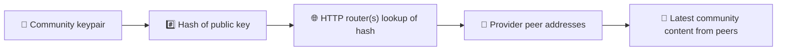
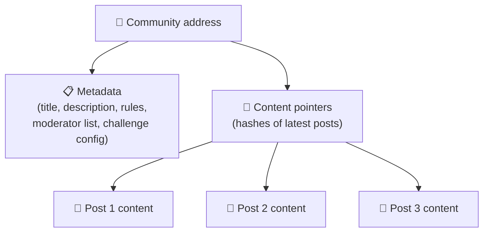
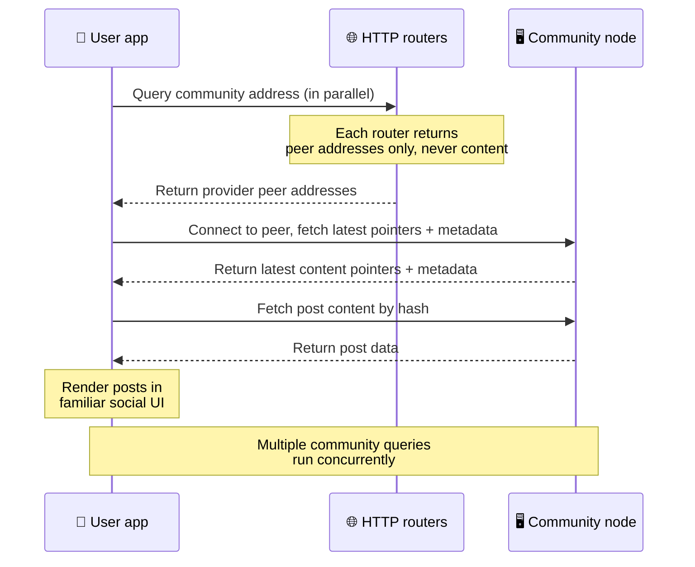
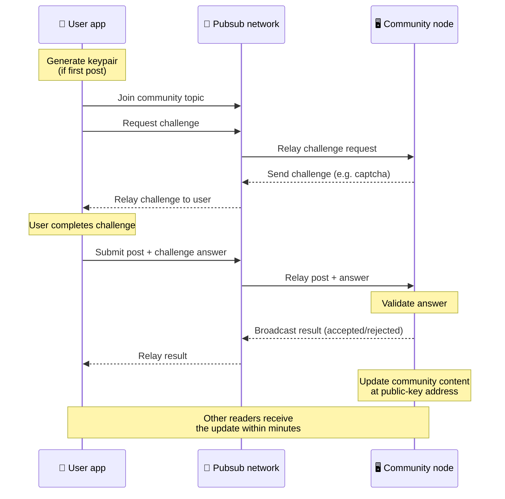
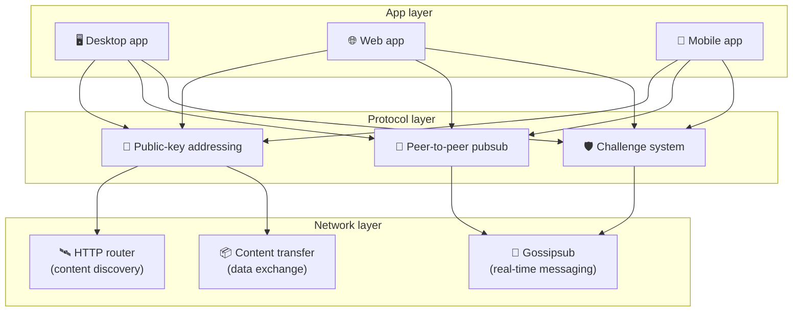

# Giao thức ngang hàng

Bitsocial không dùng blockchain, máy chủ liên hợp hay backend tập trung. Thay vào đó, nó dựa trên
bộ công cụ IPFS/libp2p để kết hợp hai ý tưởng: **định địa chỉ bằng khóa công khai** và **pubsub
ngang hàng**. Cùng nhau, chúng cho phép bất kỳ ai vận hành một cộng đồng bằng phần cứng phổ thông,
còn người dùng thì đọc và đăng bài mà không cần tài khoản trên bất kỳ dịch vụ nào do một công ty
kiểm soát.

Nếu bạn muốn một bài giải thích ít kỹ thuật hơn, hãy đọc
[Giải thích đầy đủ giao thức Bitsocial cho người không chuyên](./layman-protocol-explanation.md).

## Bitsocial có dùng IPFS không?

Có. Các node Bitsocial dùng những thành phần cơ bản của IPFS/libp2p cho lớp ngang hàng: bản ghi
cộng đồng được định địa chỉ bằng khóa công khai, việc truyền nội dung giữa các peer, và pubsub
gossipsub cho tin nhắn thời gian thực. Khi tài liệu này nói “pubsub”, đó là pubsub của IPFS/libp2p,
không phải một message broker tập trung riêng biệt.

Hiện tại, giao thức mô tả việc khám phá thông qua các router HTTP, vì client Bitsocial truy vấn
endpoint của router để lấy địa chỉ của các peer cung cấp nội dung, thay vì phải dựa vào DHT — vốn
không thân thiện với trình duyệt — cho mọi lượt tra cứu. Router chỉ trả về peer; lưu lượng truyền
nội dung và pubsub vẫn đi qua mạng ngang hàng.

## Hai bài toán

Một mạng xã hội phi tập trung phải trả lời hai câu hỏi:

1. **Dữ liệu** — làm sao lưu trữ và phân phối toàn bộ nội dung xã hội của thế giới mà không cần một
   cơ sở dữ liệu trung tâm?
2. **Spam** — làm sao ngăn chặn lạm dụng mà vẫn giữ cho mạng được dùng miễn phí?

Bitsocial giải bài toán dữ liệu bằng cách bỏ hẳn blockchain: mạng xã hội không cần thứ tự giao dịch
toàn cục, cũng không cần mọi bài đăng cũ luôn sẵn sàng vĩnh viễn. Nó giải bài toán spam bằng cách để
mỗi cộng đồng tự chạy thử thách chống spam của riêng mình trên mạng ngang hàng.

Về mô hình khám phá nằm trên lớp mạng này, xem [Khám phá nội dung](./content-discovery.md).

---

## Định địa chỉ bằng khóa công khai {#public-key-based-addressing}

Trong BitTorrent, hash của một tệp trở thành địa chỉ của tệp đó (_định địa chỉ dựa trên nội dung_).
Bitsocial dùng ý tưởng tương tự nhưng với khóa công khai: hash khóa công khai của một cộng đồng trở
thành địa chỉ mạng của cộng đồng đó.

Bất kỳ peer nào trên mạng cũng có thể hỏi một **router HTTP** về địa chỉ đó: router trả lời bằng
danh sách địa chỉ mạng của những peer đang cung cấp hash của cộng đồng, rồi client kết nối trực tiếp
tới các peer đó để lấy trạng thái mới nhất của cộng đồng. Mỗi lần nội dung được cập nhật, số phiên
bản của nó tăng lên. Mạng chỉ giữ lại phiên bản mới nhất — không cần bảo tồn mọi trạng thái trong
quá khứ, và đó chính là điều làm cho cách tiếp cận này nhẹ hơn hẳn so với blockchain.

> **Một router HTTP thực sự nắm giữ những gì.** Router HTTP là một chỉ mục mỏng. Với mỗi địa chỉ nội
> dung mà nó biết, nó chỉ lưu địa chỉ mạng của những peer đã tự công bố mình là nhà cung cấp (cặp
> IP/cổng, multiaddr của libp2p, đại loại vậy). Nó **không** lưu nội dung của cộng đồng, siêu dữ
> liệu, văn bản bài đăng, danh sách thành viên, hay thậm chí nhãn dễ đọc của thứ nằm ở địa chỉ đó;
> nó chỉ trả lời câu hỏi “những peer nào tuyên bố là có hash này?”. Nhờ vậy, router rẻ để vận hành,
> dễ thay thế và không chịu trách nhiệm về những gì người dùng đăng tải — tương tự tracker của
> BitTorrent nhưng không có siêu dữ liệu torrent: tracker ánh xạ infohash sang peer, còn router HTTP
> chỉ ánh xạ một địa chỉ nội dung sang địa chỉ của các peer cung cấp.
>
> Để dự phòng, client truy vấn **nhiều router HTTP song song** và hợp nhất các danh sách nhà cung
> cấp nhận về. Ai cũng có thể vận hành một router, và việc thay thế hay bổ sung router chỉ là một
> thay đổi cấu hình, không kèm di trú dữ liệu.
>
> Bitsocial dùng router HTTP thay vì DHT vì chạy một DHT ở quy mô cần thiết cho khám phá nội dung
> rất tốn kém, nhất là trên thiết bị di động. DHT cũng không hoạt động trong trình duyệt, vì trình
> duyệt không thể tham gia trực tiếp vào DHT của libp2p. Router HTTP chạy rẻ trên hạ tầng HTTP phổ
> thông và hoạt động tốt như nhau từ điện thoại hay từ trình duyệt.

### Những gì được lưu tại địa chỉ

Địa chỉ cộng đồng không chứa trực tiếp toàn bộ nội dung bài đăng. Thay vào đó, nó lưu một danh sách
định danh nội dung — các hash trỏ tới dữ liệu thật. Sau đó client lấy từng phần nội dung trực tiếp
từ những peer mà router HTTP trả về. Bản thân các router không bao giờ nhìn thấy hay lưu trữ nội
dung.

Luôn có ít nhất một peer giữ dữ liệu: node của người vận hành cộng đồng. Nếu cộng đồng đông người,
nhiều peer khác cũng sẽ có dữ liệu và tải trọng tự phân tán, giống như cách các torrent phổ biến tải
về nhanh hơn.

---

## Pubsub ngang hàng

Pubsub (publish-subscribe, xuất bản – đăng ký) là một mô hình nhắn tin trong đó các peer đăng ký một
chủ đề và nhận mọi thông điệp được xuất bản vào chủ đề đó. Bitsocial dùng một mạng pubsub ngang hàng
— ai cũng có thể xuất bản, ai cũng có thể đăng ký, và không có message broker trung tâm.

Để đăng một bài vào cộng đồng, người dùng xuất bản một thông điệp có chủ đề chính là khóa công khai
của cộng đồng. Node của người vận hành cộng đồng nhận thông điệp đó, kiểm tra tính hợp lệ, và — nếu
nó vượt qua thử thách chống spam — đưa nó vào lần cập nhật nội dung tiếp theo.

---

## Chống spam: thử thách qua pubsub

Một mạng pubsub mở rất dễ bị spam tràn ngập. Bitsocial xử lý điều này bằng cách yêu cầu người đăng
phải hoàn thành một **thử thách** trước khi nội dung của họ được chấp nhận.

Hệ thống thử thách rất linh hoạt: mỗi người vận hành cộng đồng tự cấu hình chính sách riêng. Một số
lựa chọn:

| Loại thử thách         | Cách hoạt động                                                    |
| ---------------------- | ----------------------------------------------------------------- |
| **Captcha**            | Câu đố hình ảnh hoặc tương tác hiển thị ngay trong ứng dụng       |
| **Giới hạn tần suất**  | Giới hạn số bài đăng của mỗi danh tính trong một khoảng thời gian |
| **Cổng token**         | Yêu cầu bằng chứng nắm giữ số dư của một token cụ thể             |
| **Thanh toán**         | Yêu cầu một khoản thanh toán nhỏ cho mỗi bài đăng                 |
| **Danh sách cho phép** | Chỉ những danh tính được duyệt trước mới đăng được                |
| **Mã tùy chỉnh**       | Bất kỳ chính sách nào diễn đạt được bằng mã                       |

Những peer chuyển tiếp quá nhiều lượt thử thách thất bại sẽ bị chặn khỏi chủ đề pubsub, qua đó ngăn
các cuộc tấn công từ chối dịch vụ ở lớp mạng.

---

## Vòng đời: đọc một cộng đồng

Đây là những gì diễn ra khi người dùng mở ứng dụng và xem các bài đăng mới nhất của một cộng đồng.

**Từng bước một:**

1. Người dùng mở ứng dụng và thấy một giao diện mạng xã hội.
2. Client truy vấn song song nhiều router HTTP cho từng cộng đồng mà người dùng theo dõi; mỗi router
   chỉ trả về địa chỉ peer, không bao giờ trả về nội dung. Độ trễ truy vấn phụ thuộc vào điều kiện
   mạng và tải của router; trong điều kiện độ trễ thấp thông thường, các truy vấn thường trả kết quả
   trong khoảng một giây và chạy đồng thời với nhau.
3. Khi đã có địa chỉ peer, client kết nối tới những peer đó và lấy về các con trỏ nội dung mới nhất
   cùng siêu dữ liệu của cộng đồng (tiêu đề, mô tả, danh sách người kiểm duyệt, cấu hình thử thách).
4. Client dùng các con trỏ đó để lấy nội dung bài đăng thật, rồi hiển thị mọi thứ trong một giao diện
   mạng xã hội quen thuộc.

---

## Vòng đời: đăng một bài viết

Việc đăng bài đi kèm một lượt bắt tay thử thách – phản hồi qua pubsub trước khi bài viết được chấp
nhận.

**Từng bước một:**

1. Ứng dụng tạo một cặp khóa cho người dùng nếu họ chưa có.
2. Người dùng viết một bài đăng cho một cộng đồng.
3. Client tham gia chủ đề pubsub của cộng đồng đó (chủ đề được đặt theo khóa công khai của cộng
   đồng).
4. Client yêu cầu một thử thách qua pubsub.
5. Node của người vận hành cộng đồng gửi lại một thử thách (ví dụ một captcha).
6. Người dùng hoàn thành thử thách.
7. Client gửi bài đăng kèm câu trả lời thử thách qua pubsub.
8. Node của người vận hành cộng đồng kiểm tra câu trả lời. Nếu đúng, bài đăng được chấp nhận.
9. Node phát kết quả qua pubsub để các peer trong mạng biết rằng nên tiếp tục chuyển tiếp thông điệp
   từ người dùng này.
10. Node cập nhật nội dung của cộng đồng tại địa chỉ khóa công khai của cộng đồng.
11. Trong vòng vài phút, mọi người đọc của cộng đồng đều nhận được bản cập nhật.

---

## Tổng quan kiến trúc

Toàn bộ hệ thống gồm ba lớp phối hợp với nhau:

| Lớp           | Vai trò                                                                                                                                 |
| ------------- | --------------------------------------------------------------------------------------------------------------------------------------- |
| **Ứng dụng**  | Giao diện người dùng. Có thể tồn tại nhiều ứng dụng, mỗi ứng dụng một thiết kế riêng, tất cả dùng chung các cộng đồng và danh tính.     |
| **Giao thức** | Xác định cách định địa chỉ cộng đồng, cách xuất bản bài đăng và cách ngăn spam.                                                         |
| **Mạng**      | Hạ tầng ngang hàng bên dưới: router HTTP để khám phá, gossipsub để nhắn tin thời gian thực, và truyền tải nội dung để trao đổi dữ liệu. |

---

## Quyền riêng tư: tách tác giả khỏi địa chỉ IP

Khi người dùng đăng một bài viết, nội dung được **mã hóa bằng khóa công khai của người vận hành cộng
đồng** trước khi đi vào mạng pubsub. Nghĩa là dù người quan sát mạng có thể thấy rằng một peer vừa
xuất bản _thứ gì đó_, họ vẫn không xác định được:

- nội dung nói gì
- danh tính tác giả nào đã xuất bản nó

Điều này tương tự cách BitTorrent cho phép biết những IP nào đang seed một torrent nhưng không cho
biết ai là người tạo ra nó. Lớp mã hóa bổ sung thêm một bảo đảm riêng tư nữa lên trên mức cơ bản đó.

---

## Ngang hàng trong trình duyệt

P2P trong trình duyệt giờ đã khả thi với các client Bitsocial. Một ứng dụng chạy trong trình duyệt có
thể vận hành một node [Helia](https://helia.io/), dùng chung bộ client giao thức Bitsocial như các
ứng dụng khác, và lấy nội dung từ các peer thay vì nhờ một gateway IPFS tập trung phục vụ. Trình
duyệt cũng có thể tham gia pubsub trực tiếp, nên trong luồng thuận lợi, việc đăng bài không cần đến
một nhà cung cấp pubsub thuộc sở hữu của nền tảng.

Đây là cột mốc quan trọng cho việc phân phối trên web: một website HTTPS bình thường có thể mở ra
thành một client mạng xã hội P2P đang chạy thật. Người dùng không cần cài ứng dụng máy tính trước khi
đọc được nội dung từ mạng, còn người vận hành ứng dụng không cần chạy một gateway trung tâm — thứ sẽ
trở thành điểm nghẽn kiểm duyệt và quản lý nội dung cho mọi người dùng trình duyệt.

Đường đi qua trình duyệt có những giới hạn khác với node trên máy tính hay máy chủ:

- node trong trình duyệt thường không nhận được các kết nối vào tùy ý từ internet công cộng
- nó có thể tải, kiểm tra tính hợp lệ, lưu đệm và xuất bản dữ liệu khi ứng dụng đang mở
- không nên coi nó là nơi lưu trữ lâu dài cho dữ liệu của một cộng đồng
- việc lưu trữ trọn vẹn một cộng đồng vẫn nên do ứng dụng máy tính, `bitsocial-cli`, hoặc một node
  luôn bật khác đảm nhiệm

Router HTTP vẫn quan trọng cho việc khám phá nội dung: chúng trả về địa chỉ của các nhà cung cấp cho
hash của một cộng đồng. Chúng không phải gateway IPFS, vì chúng không phục vụ chính nội dung đó. Sau
bước khám phá, client trong trình duyệt kết nối tới các peer và lấy dữ liệu qua tầng P2P.

P2P trong trình duyệt hiện là đường đi mặc định trên web, không còn là thử nghiệm nằm sau một công
tắc. 5chan chạy P2P thuần trong trình duyệt theo mặc định tại 5chan.app, và blog Bitsocial trên
bitsocial.net cũng vậy. Các peer trong trình duyệt kết nối qua WebSockets bảo mật; `pkc-js` mặc định
từ chối các lượt kết nối WebRTC và WebTransport vì quá trình thiết lập kết nối của chúng chậm và
thiếu tin cậy trong trình duyệt. Thay đổi ở thượng nguồn giúp việc đăng bài từ trình duyệt trở nên
thực dụng vào năm 2026 là bản sửa lỗi số thứ tự thông điệp của gossipsub trong `@libp2p/gossipsub`
15.0.21, thứ đã chấm dứt việc các peer Kubo loại bỏ thông điệp do node JavaScript xuất bản.

Để có bức tranh đầy đủ, bao gồm cả những gì node trong trình duyệt vẫn chưa làm được, xem
[Ngang hàng trong trình duyệt](/browser-p2p/).

## Phương án dự phòng qua gateway {#gateway-fallback}

Truy cập từ trình duyệt qua gateway vẫn hữu ích như một phương án dự phòng cho tương thích và triển
khai dần. Gateway có thể chuyển tiếp dữ liệu giữa mạng P2P và client trong trình duyệt khi trình
duyệt không thể tham gia mạng trực tiếp, hoặc khi ứng dụng chủ động chọn đường đi cũ. Những gateway
này:

- ai cũng có thể vận hành
- không đòi hỏi tài khoản người dùng hay thanh toán
- không nắm quyền quản lý danh tính người dùng hay cộng đồng
- có thể thay thế mà không mất dữ liệu

Kiến trúc hướng tới là ưu tiên P2P trong trình duyệt, còn gateway chỉ là phương án dự phòng tùy chọn
chứ không phải nút thắt mặc định.

---

## Tại sao không dùng blockchain?

Blockchain giải bài toán chi tiêu hai lần: chúng cần biết chính xác thứ tự của mọi giao dịch để ngăn
ai đó tiêu cùng một đồng coin hai lần.

Mạng xã hội không có bài toán chi tiêu hai lần. Việc bài A được đăng trước bài B một phần nghìn giây
chẳng quan trọng, và những bài đăng cũ cũng không cần luôn sẵn sàng vĩnh viễn trên mọi node.

Nhờ bỏ qua blockchain, Bitsocial tránh được:

- **phí gas** — đăng bài miễn phí
- **giới hạn thông lượng** — không có nút thắt về kích thước khối hay thời gian tạo khối
- **phình dữ liệu lưu trữ** — mỗi node chỉ giữ những gì nó cần
- **chi phí đồng thuận** — không cần thợ đào, validator hay staking

Đánh đổi là Bitsocial không bảo đảm nội dung cũ luôn sẵn sàng vĩnh viễn. Nhưng với mạng xã hội, đó là
đánh đổi chấp nhận được: node của người vận hành cộng đồng giữ dữ liệu, nội dung phổ biến lan ra
nhiều peer, và những bài rất cũ tự nhiên phai dần — đúng như trên mọi nền tảng xã hội khác.

## Tại sao không dùng mô hình liên hợp?

Các mạng liên hợp (như email hay những nền tảng dựa trên ActivityPub) khá hơn mô hình tập trung
nhưng vẫn còn những hạn chế mang tính cấu trúc:

- **Phụ thuộc máy chủ** — mỗi cộng đồng cần một máy chủ với tên miền, TLS và công việc bảo trì liên
  tục
- **Niềm tin vào quản trị viên** — quản trị viên máy chủ toàn quyền kiểm soát tài khoản và nội dung
  của người dùng
- **Phân mảnh** — chuyển giữa các máy chủ thường đồng nghĩa với mất người theo dõi, lịch sử hoặc danh
  tính
- **Chi phí** — ai đó phải trả tiền lưu trữ, và điều này tạo sức ép dồn về phía hợp nhất

Cách tiếp cận ngang hàng của Bitsocial loại bỏ hoàn toàn máy chủ khỏi phương trình. Một node cộng
đồng có thể chạy trên laptop, Raspberry Pi hay một VPS giá rẻ. Người vận hành kiểm soát chính sách
kiểm duyệt nhưng không thể chiếm đoạt danh tính người dùng, vì danh tính do cặp khóa kiểm soát chứ
không phải do máy chủ cấp.

## Còn Nostr thì sao?

Nostr không thuộc hẳn nhóm nào trong hai nhóm trên. Nó không phải mô hình liên hợp kiểu ActivityPub,
vì người dùng không được các instance cấp tài khoản và danh tính không gắn với một máy chủ. Nó cũng
không phải mạng xã hội blockchain, vì không có chuỗi, đồng thuận, gas hay thứ tự giao dịch toàn cục.

Mô tả sát hơn thì Nostr là **mạng xã hội dựa trên relay**. Trong giao thức nền
([NIP-01](https://github.com/nostr-protocol/nips/blob/master/01.md)), người dùng giữ cặp khóa, ký các
sự kiện và xuất bản chúng lên những relay WebSocket. Client đăng ký với relay kèm bộ lọc, lấy về các
sự kiện khớp và tự xác minh chữ ký cục bộ. Người dùng cũng có thể xuất bản siêu dữ liệu danh sách
relay ([NIP-65](https://github.com/nostr-protocol/nips/blob/master/65.md)) để cho client biết họ
thường ghi vào những relay nào và ưa dùng relay nào để đọc các lượt nhắc tên.

Điều đó khiến Nostr gần với Bitsocial hơn so với các hệ thống liên hợp hay blockchain ở một điểm quan
trọng: danh tính mang tính mật mã và có thể mang theo. Khác biệt chính nằm ở lớp dữ liệu. Trong
Nostr, relay là lớp lưu trữ và phân phối thông thường. Trong Bitsocial, router HTTP chỉ giúp client
tìm ra các peer. Router không lưu bài đăng, hồ sơ, siêu dữ liệu cộng đồng hay trạng thái kiểm duyệt;
chúng trả về địa chỉ của các peer cung cấp, rồi client tự lấy nội dung từ các peer.

Cộng đồng cũng cho thấy khác biệt tương tự. Nostr có các mô hình tùy chọn cho
[nhóm dựa trên relay](https://github.com/nostr-protocol/nips/blob/master/29.md) và
[cộng đồng do người kiểm duyệt phê duyệt](https://github.com/nostr-protocol/nips/blob/master/72.md),
nhưng chúng vẫn phụ thuộc vào chính sách của relay, trạng thái nhóm lưu trên relay, hoặc lựa chọn của
client về việc công nhận phê duyệt nào. Bitsocial coi cộng đồng là đối tượng mật mã hạng nhất: node
của người vận hành kiểm tra bài đăng, chạy chính sách thử thách của cộng đồng và xuất bản trạng thái
mới nhất đã được chấp nhận vào mạng ngang hàng.

| Câu hỏi                       | Nostr                                                                                                         | Bitsocial                                                                        |
| ----------------------------- | ------------------------------------------------------------------------------------------------------------- | -------------------------------------------------------------------------------- |
| Phân loại                     | Giao thức dựa trên relay                                                                                      | Mạng cộng đồng ngang hàng                                                        |
| Danh tính                     | Khóa công khai của người dùng                                                                                 | Cặp khóa của người dùng và của cộng đồng                                         |
| Đường đi dữ liệu              | Sự kiện đã ký được xuất bản lên relay                                                                         | Địa chỉ khóa công khai phân giải ra peer; nội dung được lấy từ peer              |
| Ai giữ cho nó luôn trực tuyến | Các relay do người dùng và client chọn                                                                        | Node của chủ cộng đồng cùng các seeder hỗ trợ                                    |
| Cộng đồng                     | Nhóm dựa trên relay hoặc cộng đồng do người kiểm duyệt phê duyệt, đều là tùy chọn                             | Đối tượng cộng đồng hạng nhất, kiểm duyệt do người vận hành kiểm soát            |
| Chống spam                    | Chính sách relay, xác thực, thanh toán, proof-of-work, bộ lọc phía client hoặc phê duyệt của người kiểm duyệt | Logic thử thách do cộng đồng tự định nghĩa, áp dụng trước khi nội dung được nhận |
| Đánh đổi chính                | Danh tính mang theo được, nhưng khả năng sẵn sàng và chính sách phụ thuộc relay                               | Ít phụ thuộc relay hơn, nhưng nội dung cũ không được bảo đảm mãi mãi             |

---

## Tóm tắt

Bitsocial được xây trên hai thành phần cơ bản: định địa chỉ bằng khóa công khai để khám phá nội dung,
và pubsub ngang hàng để liên lạc thời gian thực. Kết hợp lại, chúng tạo ra một mạng xã hội trong đó:

- cộng đồng được định danh bằng khóa mật mã, không phải bằng tên miền
- nội dung lan truyền giữa các peer như một torrent, chứ không được phục vụ từ một cơ sở dữ liệu duy
  nhất
- khả năng chống spam thuộc về từng cộng đồng, không do một nền tảng áp đặt
- người dùng sở hữu danh tính của mình qua cặp khóa, không qua những tài khoản có thể bị thu hồi
- toàn bộ hệ thống vận hành mà không cần máy chủ, blockchain hay phí nền tảng
