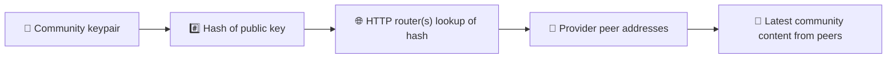
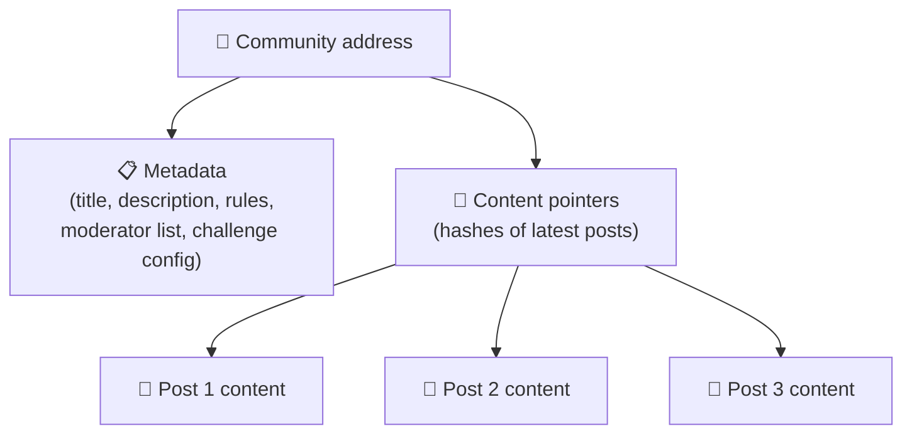
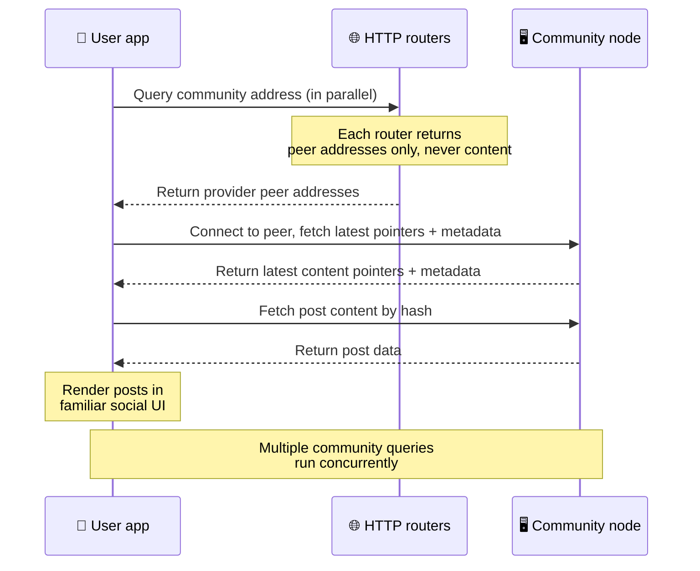
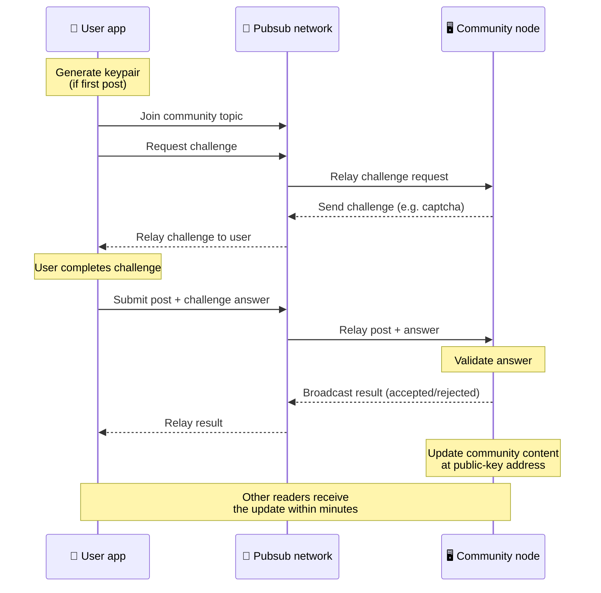
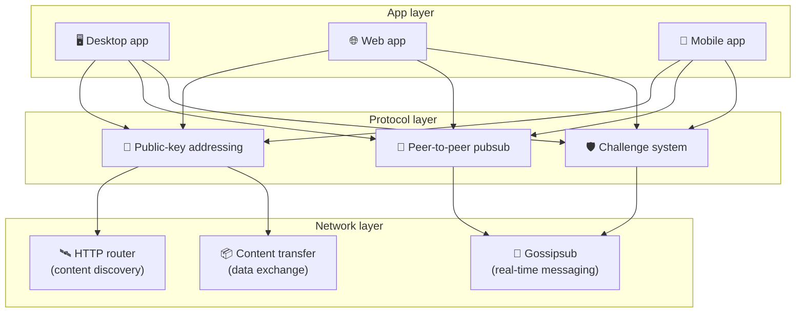

# 点对点协议

Bitsocial 不使用区块链、联邦服务器，也不使用集中式后端。它基于 IPFS/libp2p 技术栈，把两个想法结合
起来：**基于公钥的寻址**与**点对点 pubsub**。两者共同作用，让任何人都能用消费级硬件托管一个社区，
而用户在阅读和发帖时，不需要在任何由公司控制的服务上注册账号。

如果想看技术性没那么强的讲解，请阅读
[Bitsocial 协议的完整外行解释](./layman-protocol-explanation.md)。

## Bitsocial 使用 IPFS 吗？

是的。Bitsocial 节点在点对点层使用 IPFS/libp2p 的基础构件：以公钥寻址的社区记录、对等点之间的内容
传输，以及用于实时消息的 gossipsub pubsub。本文档提到“pubsub”时，指的都是 IPFS/libp2p 的 pubsub，
而不是另设一个集中式消息代理。

协议目前把发现描述为经由 HTTP 路由器完成，因为 Bitsocial 客户端会向路由器端点查询提供者对等点的
地址，而不是每次查找都依赖对浏览器并不友好的 DHT。路由器只返回对等点；内容传输和 pubsub 流量仍然
走点对点网络。

## 两个问题

去中心化的社交网络必须回答两个问题：

1. **数据** — 没有中央数据库，如何存储并分发全世界的社交内容？
2. **垃圾信息** — 如何在让网络保持免费使用的同时防止滥用？

Bitsocial 完全跳过区块链来解决数据问题：社交媒体既不需要全局交易排序，也不需要让每一条旧帖子永久
可用。它解决垃圾信息问题的方式，是让每个社区在点对点网络上运行自己的反垃圾挑战。

关于这一网络层之上的发现模型，请参阅[内容发现](./content-discovery.md)。

---

## 基于公钥的寻址 {#public-key-based-addressing}

在 BitTorrent 中，文件的哈希就是它的地址（_基于内容的寻址_）。Bitsocial 把类似的思路用在公钥上：
社区公钥的哈希就是它的网络地址。

网络上的任何对等点都可以就该地址向 **HTTP 路由器**发起查询：路由器会返回当前提供该社区哈希的对等点
网络地址列表，客户端再直接连接这些对等点，取回社区的最新状态。内容每更新一次，版本号就递增一次。
网络只保留最新版本 — 无需保存每一个历史状态，这正是这种做法相比区块链更轻量的原因。

> **HTTP 路由器实际保存些什么。** HTTP 路由器只是一个很薄的索引。对它已知的每个内容地址，它只保存
> 那些宣告自己为提供者的对等点的网络地址（IP/端口对、libp2p multiaddr 之类）。它**不**保存社区的
> 内容、元数据、帖子正文、成员列表，甚至也不保存该地址上内容的可读名称；它只回答一个问题：“哪些
> 对等点声称拥有这个哈希？”。这让路由器运行成本低、易于更换，也不必为用户发布的内容承担责任，有点
> 像 BitTorrent 的 tracker，但没有种子元数据：tracker 把 infohash 映射到对等点，而 HTTP 路由器只把
> 内容地址映射到提供者对等点的地址。
>
> 为了冗余，客户端会**并行查询多个 HTTP 路由器**，并把拿回来的提供者列表合并起来。任何人都可以运行
> 路由器，更换或增加路由器只是改配置，不涉及数据迁移。
>
> Bitsocial 选择 HTTP 路由器而非 DHT，是因为把 DHT 运行到内容发现所需的规模代价高昂，在移动端尤其
> 如此。DHT 在浏览器里也用不了，因为浏览器无法直接加入 libp2p DHT。HTTP 路由器跑在普通的 HTTP 基础
> 设施上成本很低，从手机或浏览器访问也一样好用。

### 地址上存储的是什么

社区地址本身并不直接包含完整的帖子内容，而是保存一份内容标识符列表 — 指向实际数据的哈希。客户端
随后直接从 HTTP 路由器返回的对等点那里获取每一份内容。路由器自己从不接触、也不保存这些内容。

至少总有一个对等点持有数据：社区运营者的节点。如果社区受欢迎，许多其他对等点也会持有这些数据，负载
会自行分散，就像热门种子下载起来更快一样。

---

## 点对点 pubsub

Pubsub（发布-订阅）是一种消息模式：对等点订阅某个主题，就能收到发布到该主题的每一条消息。Bitsocial
使用的是点对点的 pubsub 网络 — 任何人都可以发布，任何人都可以订阅，没有中央消息代理。

要向某个社区发帖，用户发布一条主题等于该社区公钥的消息。社区运营者的节点会收到它、校验它，如果它
通过了反垃圾挑战，就把它纳入下一次内容更新。

---

## 反垃圾：通过 pubsub 发起挑战

开放的 pubsub 网络容易被垃圾信息淹没。Bitsocial 的解法是：发布者必须先完成一项**挑战**，内容才会
被接受。

挑战系统很灵活：每个社区运营者自行配置策略。可选项包括：

| 挑战类型       | 工作方式                             |
| -------------- | ------------------------------------ |
| **验证码**     | 在应用中呈现的图形或交互式谜题       |
| **限速**       | 限制每个身份在单位时间窗口内的发帖数 |
| **代币门槛**   | 要求证明持有特定代币的余额           |
| **付费**       | 每次发帖需要支付一小笔费用           |
| **白名单**     | 只有预先批准的身份才能发帖           |
| **自定义代码** | 任何能用代码表达的策略               |

如果某个对等点转发了过多失败的挑战尝试，就会被该 pubsub 主题屏蔽，这样可以阻止针对网络层的拒绝服务
攻击。

---

## 生命周期：读取一个社区

下面是用户打开应用、查看某个社区最新帖子时发生的事情。

**逐步说明：**

1. 用户打开应用，看到一个社交界面。
2. 对于用户关注的每个社区，客户端都会并行查询多个 HTTP 路由器；每个路由器只返回对等点地址，绝不
   返回内容。查询延迟取决于网络状况和路由器负载；在通常的低延迟条件下，查询往往在一秒左右返回，
   并且是并发进行的。
3. 拿到对等点地址后，客户端连接这些对等点，取回社区最新的内容指针和元数据（标题、描述、版主列表、
   挑战配置）。
4. 客户端再用这些指针取回真正的帖子内容，然后把这一切渲染成大家熟悉的社交界面。

---

## 生命周期：发布一条帖子

在帖子被接受之前，发布过程要先在 pubsub 上完成一次挑战-应答握手。

**逐步说明：**

1. 如果用户还没有密钥对，应用会先为其生成一个。
2. 用户为某个社区写一条帖子。
3. 客户端加入该社区的 pubsub 主题（以社区公钥为键）。
4. 客户端通过 pubsub 请求一项挑战。
5. 社区运营者的节点回送一项挑战（例如验证码）。
6. 用户完成挑战。
7. 客户端通过 pubsub 把帖子连同挑战答案一起提交。
8. 社区运营者的节点校验答案。答案正确，帖子就被接受。
9. 节点通过 pubsub 广播结果，让网络中的对等点知道可以继续转发这位用户的消息。
10. 节点在社区的公钥地址上更新社区内容。
11. 几分钟之内，该社区的每一位读者都会收到这次更新。

---

## 架构概览

完整的系统由三个层次协同构成：

| 层次       | 作用                                                                                   |
| ---------- | -------------------------------------------------------------------------------------- |
| **应用层** | 用户界面。可以同时存在多个应用，各有各的设计，却共享同样的社区与身份。                 |
| **协议层** | 定义社区如何被寻址、帖子如何发布，以及如何防范垃圾信息。                               |
| **网络层** | 底层的点对点基础设施：用于发现的 HTTP 路由器、用于实时消息的 gossipsub，以及内容传输。 |

---

## 隐私：切断作者与 IP 地址之间的关联

用户发布帖子时，内容在进入 pubsub 网络之前，会先**用社区运营者的公钥加密**。这意味着，网络上的观察
者虽然能看到某个对等点发布了*某些东西*，却无法判断：

- 内容说了什么
- 是哪个作者身份发布的

这有点像 BitTorrent：你可以查到哪些 IP 在做种，却查不到最初是谁制作了这个种子。加密层在这个基线之
上又加了一层隐私保障。

---

## 浏览器点对点

Bitsocial 客户端现在已经能做到浏览器 P2P。浏览器应用可以运行一个 [Helia](https://helia.io/) 节点，
使用与其他应用相同的 Bitsocial 协议客户端栈，直接从对等点获取内容，而不必请求集中式 IPFS 网关代为
提供。浏览器也能直接参与 pubsub，因此在顺利路径上，发帖不需要任何由平台掌控的 pubsub 提供方。

这是网页分发上的重要里程碑：一个普通的 HTTPS 网站，打开后就是一个运行中的 P2P 社交客户端。用户不必
先安装桌面应用才能从网络中读取内容，应用运营方也不必运行一个中心网关 — 那样的网关会成为每一位浏览
器用户都绕不开的审查与审核关卡。

浏览器这条路径与桌面或服务器节点有着不同的限制：

- 浏览器节点通常无法接受来自公共互联网的任意入站连接
- 在应用打开期间，它可以加载、校验、缓存并发布数据
- 不应把它当作社区数据的长期托管方
- 完整的社区托管仍然最好交给桌面应用、`bitsocial-cli` 或其他常在线的节点

HTTP 路由器对内容发现依然重要：它们会返回某个社区哈希的提供者地址。它们不是 IPFS 网关，因为它们并
不提供内容本身。发现完成之后，浏览器客户端连接对等点，通过 P2P 栈取回数据。

浏览器 P2P 现在已经是默认的网页路径，而不是藏在开关后面的实验。5chan 在 5chan.app 上默认运行纯浏览
器 P2P，bitsocial.net 上的 Bitsocial 博客也是如此。浏览器对等点通过安全 WebSockets 拨号；`pkc-js`
默认拒绝 WebRTC 与 WebTransport 拨号，因为它们在浏览器里的连接建立过程既慢又不可靠。让浏览器端发布
在 2026 年真正可行的上游改动，是 `@libp2p/gossipsub` 15.0.21 中的 gossipsub 序列号修复，它让 Kubo
对等点不再丢弃 JavaScript 节点发布的消息。

要了解完整情况，包括浏览器节点目前仍然做不到的事，请参阅[浏览器点对点](/browser-p2p/)。

## 网关回退 {#gateway-fallback}

以网关为后盾的浏览器访问，作为兼容手段和推广期的回退方案仍然有用。当浏览器无法直接加入网络，或者
应用有意选择旧路径时，网关可以在 P2P 网络和浏览器客户端之间中转数据。这些网关：

- 任何人都可以运行
- 不需要用户账号，也不需要付费
- 不会取得对用户身份或社区的保管权
- 可以随时更换而不丢失数据

目标架构是浏览器 P2P 优先，网关只作为可选的回退，而不是默认的瓶颈。

---

## 为什么不用区块链？

区块链解决的是双花问题：它需要知道每一笔交易的确切顺序，才能防止有人把同一枚币花两次。

社交媒体没有双花问题。帖子 A 比帖子 B 早发布一毫秒并不重要，旧帖子也不需要在每个节点上永久可用。

跳过区块链，Bitsocial 就避开了：

- **gas 费** — 发帖是免费的
- **吞吐限制** — 没有区块大小或出块时间的瓶颈
- **存储膨胀** — 节点只保留自己需要的东西
- **共识开销** — 不需要矿工、验证者或质押

代价是 Bitsocial 不保证旧内容永久可用。但对社交媒体来说这是可以接受的取舍：社区运营者的节点持有
数据，热门内容会扩散到许多对等点，非常久远的帖子则自然淡出 — 就像在任何一个社交平台上那样。

## 为什么不用联邦式架构？

联邦式网络（比如电子邮件，或基于 ActivityPub 的平台）比中心化前进了一步，但仍有结构性局限：

- **服务器依赖** — 每个社区都需要一台服务器，配上域名、TLS 和持续的维护
- **管理员信任** — 服务器管理员对用户账号和内容拥有完全控制权
- **割裂** — 在服务器之间迁移，往往意味着丢掉关注者、历史记录或身份
- **成本** — 总得有人为托管买单，这会推着整个网络向少数几家集中

Bitsocial 的点对点做法把服务器彻底从等式里拿掉。一个社区节点可以跑在笔记本、树莓派或一台便宜的 VPS
上。运营者掌握审核策略，却无法夺走用户身份，因为身份由密钥对控制，不是由服务器授予的。

## 那 Nostr 呢？

Nostr 并不能干净地归入上面任何一类。它不是 ActivityPub 式的联邦：用户的账号不是由实例发放的，身份
也不绑定在某一台服务器上。它也不是区块链社交媒体：这里没有链、没有共识、没有 gas，也没有全局交易
顺序。

更贴切的说法是，Nostr 是**基于中继的社交媒体**。在基础协议
（[NIP-01](https://github.com/nostr-protocol/nips/blob/master/01.md)）中，用户持有密钥对，为事件
签名，并把这些事件发布到 WebSocket 中继。客户端带着过滤条件订阅中继，取回匹配的事件，并在本地验证
签名。用户还可以发布中继列表元数据
（[NIP-65](https://github.com/nostr-protocol/nips/blob/master/65.md)），告诉客户端自己平时往哪些
中继写入、更倾向从哪些中继读取提及。

在一个重要方面，这让 Nostr 比联邦式或区块链系统更接近 Bitsocial：身份是加密的，而且可携带。主要
差别在数据层。在 Nostr 中，中继就是常规的存储与分发层。在 Bitsocial 中，HTTP 路由器只负责帮客户端
找到对等点。路由器不存储帖子、个人资料、社区元数据或审核状态；它们返回提供者对等点的地址，然后由
客户端从对等点取回内容。

社区这一块也是同样的分野。Nostr 有一些可选的模式，例如
[基于中继的群组](https://github.com/nostr-protocol/nips/blob/master/29.md)和
[版主审核制社区](https://github.com/nostr-protocol/nips/blob/master/72.md)，但它们仍然依赖中继
策略、由中继托管的群组状态，或者客户端自行决定认可哪些审核结果。Bitsocial 把社区当作一等的加密
对象：社区的运营者节点校验帖子、执行社区的挑战策略，并把最新的已接受状态发布到点对点网络中。

| 问题           | Nostr                                                    | Bitsocial                                |
| -------------- | -------------------------------------------------------- | ---------------------------------------- |
| 类别           | 基于中继的协议                                           | 点对点社区网络                           |
| 身份           | 用户公钥                                                 | 用户与社区的密钥对                       |
| 数据路径       | 签名后的事件发布到中继                                   | 公钥地址解析出对等点，内容从对等点取回   |
| 谁让它保持在线 | 由用户和客户端选择的中继                                 | 社区所有者的节点，加上协助做种的节点     |
| 社区           | 可选的基于中继的群组，或版主审核制社区                   | 一等的社区对象，审核权由运营者掌握       |
| 反垃圾         | 中继策略、鉴权、付费、工作量证明、客户端过滤，或版主审核 | 收录之前执行社区自定义的挑战逻辑         |
| 主要取舍       | 身份可携带，但可用性与策略取决于中继                     | 对中继的依赖更少，但旧内容不保证永久留存 |

---

## 总结

Bitsocial 建立在两个基本构件之上：用于内容发现的、基于公钥的寻址，以及用于实时通信的点对点 pubsub。
两者结合，造就了这样一个社交网络：

- 社区由加密密钥标识，而不是由域名标识
- 内容像种子一样在对等点之间扩散，而不是由单一数据库提供
- 抵御垃圾信息的能力属于每个社区自己，而不是由平台强加
- 用户通过密钥对拥有自己的身份，而不是通过随时可被吊销的账号
- 整个系统运行起来不需要服务器、区块链，也没有平台费用
